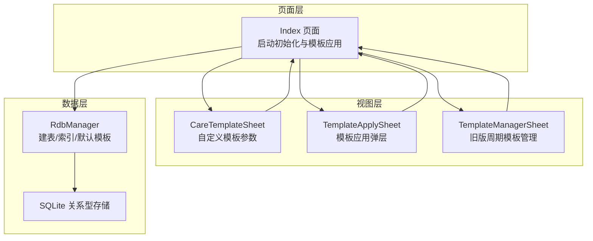
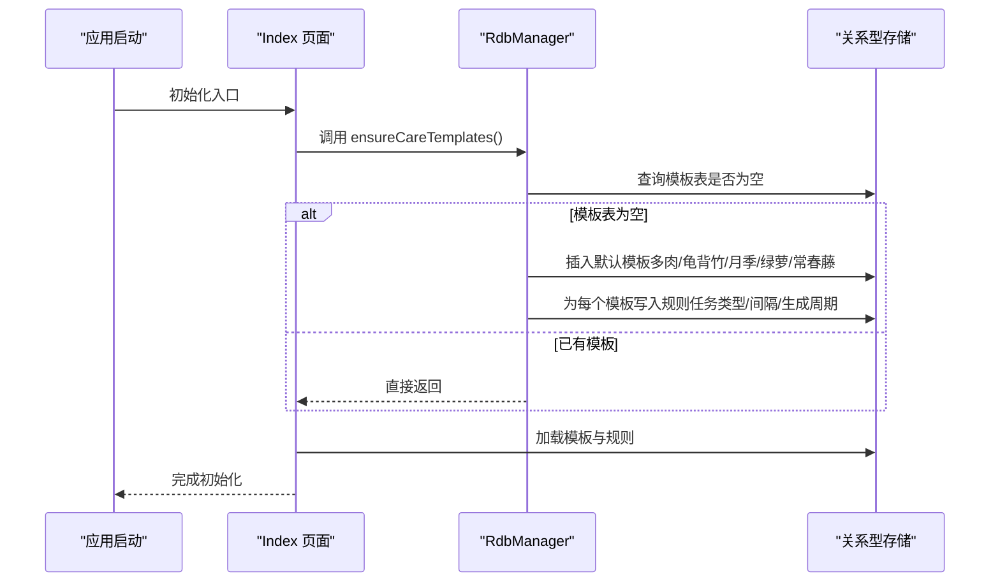
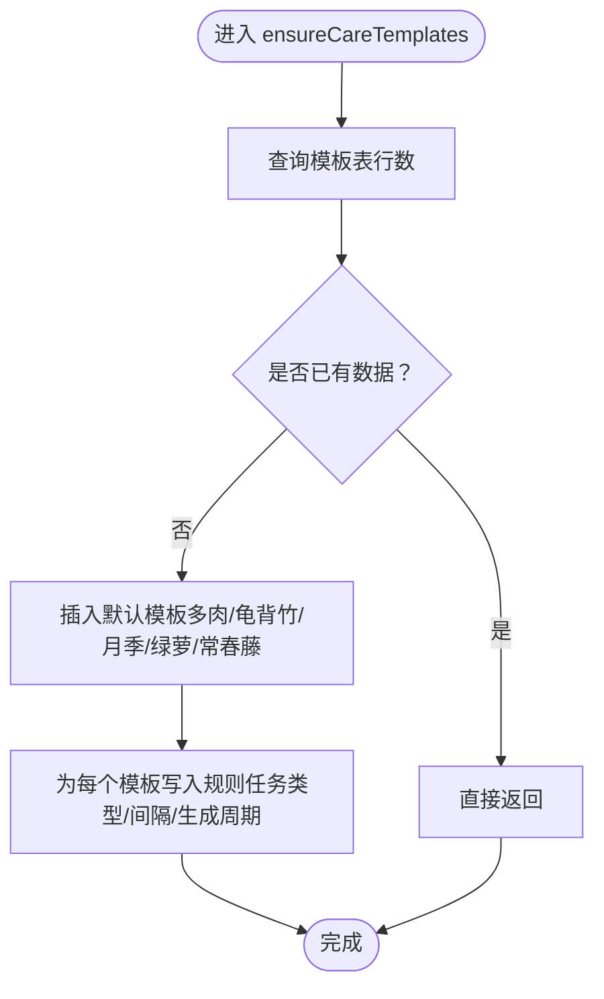
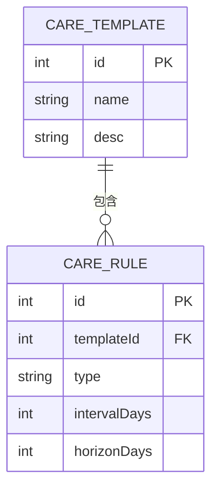
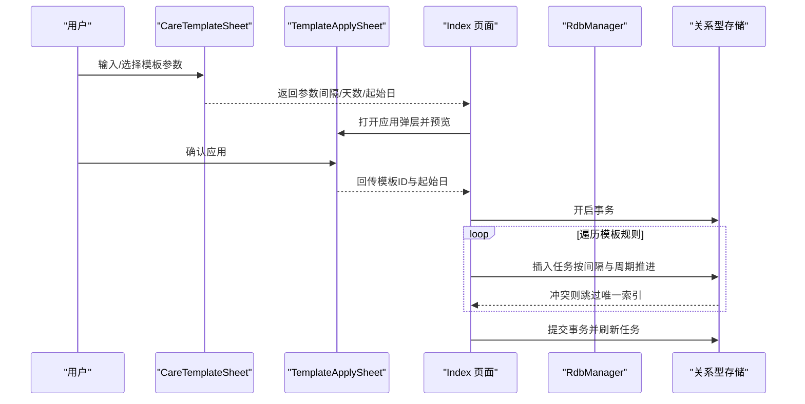
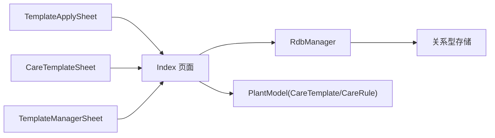

# 模板数据初始化

<cite>
**本文引用的文件**
- [RdbManager.ets](file://entry/src/main/ets/viewmodel/RdbManager.ets)
- [Index.ets](file://entry/src/main/ets/pages/Index.ets)
- [PlantModel.ets](file://entry/src/main/ets/model/PlantModel.ets)
- [CareTemplateSheet.ets](file://entry/src/main/ets/view/CareTemplateSheet.ets)
- [TemplateApplySheet.ets](file://entry/src/main/ets/view/TemplateApplySheet.ets)
- [TemplateManagerSheet.ets](file://entry/src/main/ets/view/TemplateManagerSheet.ets)
</cite>

## 目录
1. [简介](#简介)
2. [项目结构](#项目结构)
3. [核心组件](#核心组件)
4. [架构总览](#架构总览)
5. [详细组件分析](#详细组件分析)
6. [依赖关系分析](#依赖关系分析)
7. [性能考量](#性能考量)
8. [故障排查指南](#故障排查指南)
9. [结论](#结论)
10. [附录](#附录)

## 简介
本文件聚焦于植物日记项目的“模板数据初始化”能力，系统性阐述 ensureCareTemplates 方法的实现原理与工作机制，解释养护模板与规则的自动初始化流程；梳理模板数据的设计思路与业务逻辑（任务类型、间隔天数、生成周期），并提供扩展与维护指南（新增植物模板与规则、查询与修改接口、数据迁移与版本兼容）。文档面向开发者与产品人员，兼顾可读性与工程落地。

## 项目结构
模板系统涉及三层协作：
- 数据层：RdbManager 负责数据库建表、索引与默认模板数据的初始化。
- 页面层：Index 页面在应用启动时触发初始化，并承载模板应用与任务生成流程。
- 视图层：CareTemplateSheet、TemplateApplySheet、TemplateManagerSheet 提供模板选择、预览与管理界面。

**图示来源**
- [Index.ets:129-135](file://entry/src/main/ets/pages/Index.ets#L129-L135)
- [RdbManager.ets:27-170](file://entry/src/main/ets/viewmodel/RdbManager.ets#L27-L170)
- [CareTemplateSheet.ets:1-217](file://entry/src/main/ets/view/CareTemplateSheet.ets#L1-L217)
- [TemplateApplySheet.ets:1-145](file://entry/src/main/ets/view/TemplateApplySheet.ets#L1-L145)
- [TemplateManagerSheet.ets:1-249](file://entry/src/main/ets/view/TemplateManagerSheet.ets#L1-L249)

**章节来源**
- [Index.ets:129-135](file://entry/src/main/ets/pages/Index.ets#L129-L135)
- [RdbManager.ets:27-170](file://entry/src/main/ets/viewmodel/RdbManager.ets#L27-L170)

## 核心组件
- RdbManager：统一负责数据库建表、索引初始化与默认模板数据的“一次性”注入，保证空库时自动填充，避免覆盖用户后续修改。
- Index 页面：应用启动时调用 ensureCareTemplates，并在模板应用流程中批量生成任务。
- PlantModel：定义模板与规则的数据结构（CareTemplate、CareRule），用于页面间传递与渲染。
- 视图组件：提供模板参数输入、预览与应用入口，以及旧版周期模板的管理界面。

**章节来源**
- [RdbManager.ets:172-276](file://entry/src/main/ets/viewmodel/RdbManager.ets#L172-L276)
- [Index.ets:129-135](file://entry/src/main/ets/pages/Index.ets#L129-L135)
- [PlantModel.ets:150-163](file://entry/src/main/ets/model/PlantModel.ets#L150-L163)

## 架构总览
模板初始化与应用的端到端流程如下：

**图示来源**
- [Index.ets:129-135](file://entry/src/main/ets/pages/Index.ets#L129-L135)
- [RdbManager.ets:172-276](file://entry/src/main/ets/viewmodel/RdbManager.ets#L172-L276)

## 详细组件分析

### ensureCareTemplates 方法实现原理
- 触发时机：应用启动时由 Index 页面调用，确保模板数据仅在空库时注入。
- 判断逻辑：通过查询模板表行数，若大于 0 则直接返回，避免覆盖用户已有数据。
- 注入策略：按植物类型插入模板主表记录，随后为每个模板写入多条规则，形成“模板-规则”二维数据集。
- 冲突处理：模板应用阶段采用唯一索引约束，批量插入时命中冲突自动跳过，保证幂等与性能。

**图示来源**
- [RdbManager.ets:172-276](file://entry/src/main/ets/viewmodel/RdbManager.ets#L172-L276)

**章节来源**
- [RdbManager.ets:172-276](file://entry/src/main/ets/viewmodel/RdbManager.ets#L172-L276)
- [Index.ets:129-135](file://entry/src/main/ets/pages/Index.ets#L129-L135)

### 模板数据设计思路与业务逻辑
- 模板维度：以植物类型为单位抽象“养护模板”，如多肉、龟背竹、月季、绿萝、常春藤。
- 规则维度：每条规则描述一种“任务类型 + 间隔天数 + 生成周期（horizonDays）”，形成可预测的任务序列。
- 业务原则：
  - 任务类型：浇水、施肥、修剪等常见园艺操作。
  - 间隔天数：依据植物特性与生长节奏设定，如多肉较长间隔、观花植物较短间隔。
  - 生成周期：限定任务生成的时间范围，避免无限扩展。
  - 唯一索引：同一植物在同一日期仅允许同类型任务一次，防止重复生成。

**图示来源**
- [RdbManager.ets:89-103](file://entry/src/main/ets/viewmodel/RdbManager.ets#L89-L103)
- [PlantModel.ets:150-163](file://entry/src/main/ets/model/PlantModel.ets#L150-L163)

**章节来源**
- [RdbManager.ets:89-103](file://entry/src/main/ets/viewmodel/RdbManager.ets#L89-L103)
- [PlantModel.ets:150-163](file://entry/src/main/ets/model/PlantModel.ets#L150-L163)

### 模板应用与任务生成流程
- 参数来源：用户可在 CareTemplateSheet 自定义浇水/施肥/修剪间隔与生成天数，或选择预设方案。
- 预览机制：TemplateApplySheet 对选定模板按规则本地展开，展示计划任务清单。
- 应用执行：Index 页面按模板规则与起始日期批量生成任务，采用事务与唯一索引避免重复与中断。

**图示来源**
- [CareTemplateSheet.ets:1-217](file://entry/src/main/ets/view/CareTemplateSheet.ets#L1-L217)
- [TemplateApplySheet.ets:1-145](file://entry/src/main/ets/view/TemplateApplySheet.ets#L1-L145)
- [Index.ets:814-852](file://entry/src/main/ets/pages/Index.ets#L814-L852)

**章节来源**
- [CareTemplateSheet.ets:1-217](file://entry/src/main/ets/view/CareTemplateSheet.ets#L1-L217)
- [TemplateApplySheet.ets:1-145](file://entry/src/main/ets/view/TemplateApplySheet.ets#L1-L145)
- [Index.ets:814-852](file://entry/src/main/ets/pages/Index.ets#L814-L852)

### 模板数据的查询与修改接口
- 查询接口：
  - 模板列表：按 id 升序查询 care_template 表的 id、name、desc。
  - 规则列表：按 templateId 升序、id 升序查询 care_rule 表的 id、templateId、type、intervalDays、horizonDays。
- 修改接口：
  - 模板主表：支持更新 name、desc。
  - 规则表：支持新增/更新/删除规则，变更将影响后续任务生成。
- 注意事项：
  - 唯一索引约束：任务表对 (plantId, type, planDate) 唯一，避免重复生成。
  - 幂等性：ensureCareTemplates 仅在空库时注入，避免覆盖用户修改。

**章节来源**
- [Index.ets:776-804](file://entry/src/main/ets/pages/Index.ets#L776-L804)
- [RdbManager.ets:134-146](file://entry/src/main/ets/viewmodel/RdbManager.ets#L134-L146)

### 模板数据的扩展方法
- 新增植物模板：
  - 在 ensureCareTemplates 中插入新模板记录，并为其写入对应规则。
  - 更新后，Index 页面加载模板与规则，用户即可在应用弹层中选择。
- 新增养护规则：
  - 为既有模板追加规则，注意 intervalDays 与 horizonDays 的合理性。
  - 若已有任务生成，新增规则不会回溯覆盖，仅影响未来生成。
- 旧版周期模板兼容：
  - TemplateManagerSheet 支持旧版 tpl 表的 CRUD，与新 care_template 体系并存，便于平滑过渡。

**章节来源**
- [RdbManager.ets:172-276](file://entry/src/main/ets/viewmodel/RdbManager.ets#L172-L276)
- [TemplateManagerSheet.ets:1-249](file://entry/src/main/ets/view/TemplateManagerSheet.ets#L1-L249)

### 数据迁移与版本兼容
- 初始化策略：ensureCareTemplates 仅在模板表为空时注入默认数据，避免覆盖用户后续修改。
- 索引与约束：任务表建立唯一索引，保障批量插入的幂等与一致性。
- 版本演进：tpl 表与 care_template/care_rule 并存，逐步引导用户迁移到新体系。

**章节来源**
- [RdbManager.ets:172-276](file://entry/src/main/ets/viewmodel/RdbManager.ets#L172-L276)
- [RdbManager.ets:134-146](file://entry/src/main/ets/viewmodel/RdbManager.ets#L134-L146)

## 依赖关系分析
- 页面依赖数据层：Index 页面在 initDb 后调用 ensureCareTemplates，再加载模板与规则。
- 视图依赖模型：TemplateApplySheet 与 CareTemplateSheet 使用 CareTemplate/CareRule 结构进行数据传递。
- 数据层依赖存储：RdbManager 统一管理建表、索引与默认数据。

**图示来源**
- [Index.ets:129-135](file://entry/src/main/ets/pages/Index.ets#L129-L135)
- [RdbManager.ets:27-170](file://entry/src/main/ets/viewmodel/RdbManager.ets#L27-L170)
- [PlantModel.ets:150-163](file://entry/src/main/ets/model/PlantModel.ets#L150-L163)

**章节来源**
- [Index.ets:129-135](file://entry/src/main/ets/pages/Index.ets#L129-L135)
- [RdbManager.ets:27-170](file://entry/src/main/ets/viewmodel/RdbManager.ets#L27-L170)
- [PlantModel.ets:150-163](file://entry/src/main/ets/model/PlantModel.ets#L150-L163)

## 性能考量
- 批量生成任务：采用事务包裹，逐条插入并利用唯一索引冲突跳过，避免重复计算与 IO。
- 查询优化：模板与规则按主键与关联键有序查询，配合索引提升渲染效率。
- 预览机制：TemplateApplySheet 本地展开规则，降低数据库压力，改善交互体验。

[本节为通用性能建议，无需特定文件引用]

## 故障排查指南
- 初始化未生效：
  - 确认 ensureCareTemplates 是否被调用（Index 页面 initDb 路径）。
  - 检查模板表是否已有数据，若有则不会再次注入。
- 任务重复或缺失：
  - 核对任务表唯一索引是否存在，确认批量插入是否命中冲突。
  - 检查模板规则的 intervalDays 与 horizonDays 设置是否合理。
- 应用弹层无预览：
  - 确认模板与规则加载成功，且 chosenTemplateId 正确绑定。

**章节来源**
- [Index.ets:129-135](file://entry/src/main/ets/pages/Index.ets#L129-L135)
- [Index.ets:814-852](file://entry/src/main/ets/pages/Index.ets#L814-L852)
- [RdbManager.ets:134-146](file://entry/src/main/ets/viewmodel/RdbManager.ets#L134-L146)

## 结论
模板系统通过“一次性注入 + 幂等应用”的设计，实现了默认模板的自动初始化与可扩展的规则体系。开发者可在不破坏用户数据的前提下，持续完善模板与规则，满足多样化的植物养护场景。建议在新增模板时遵循“间隔与周期”的平衡原则，并通过预览与测试验证生成效果。

[本节为总结性内容，无需特定文件引用]

## 附录

### 使用指南与定制化建议
- 快速开始：
  - 在 Index 页面打开模板应用弹层，选择目标植物与模板，设置起始日期与生成天数，点击复制。
- 定制化开发：
  - 在 ensureCareTemplates 中新增模板与规则，确保 intervalDays 与 horizonDays 合理。
  - 如需调整 UI，可在 CareTemplateSheet 与 TemplateApplySheet 中扩展参数与预设。
  - 旧版 tpl 模板可通过 TemplateManagerSheet 管理，逐步迁移至新体系。

**章节来源**
- [RdbManager.ets:172-276](file://entry/src/main/ets/viewmodel/RdbManager.ets#L172-L276)
- [CareTemplateSheet.ets:1-217](file://entry/src/main/ets/view/CareTemplateSheet.ets#L1-L217)
- [TemplateApplySheet.ets:1-145](file://entry/src/main/ets/view/TemplateApplySheet.ets#L1-L145)
- [TemplateManagerSheet.ets:1-249](file://entry/src/main/ets/view/TemplateManagerSheet.ets#L1-L249)