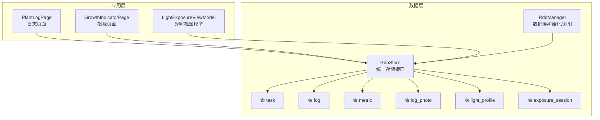
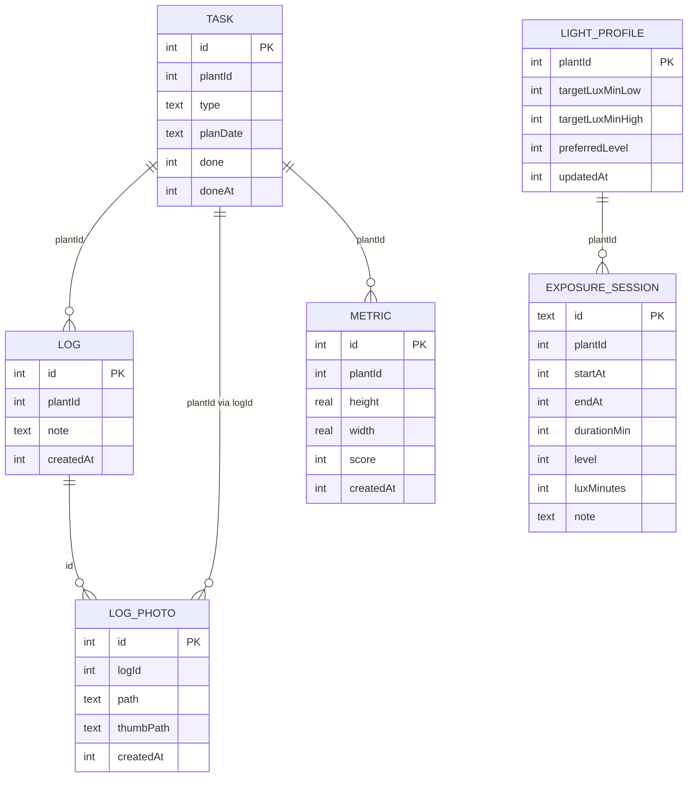
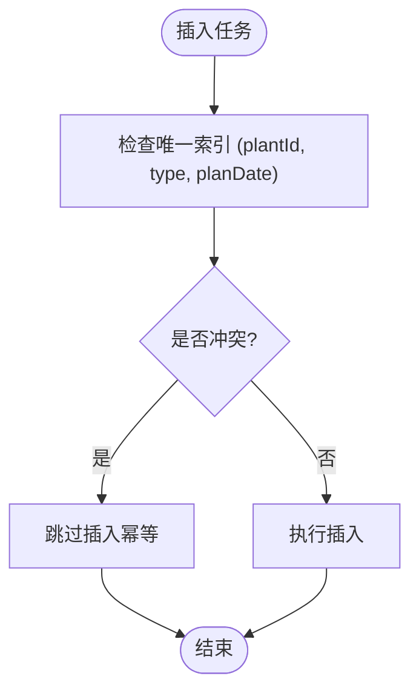
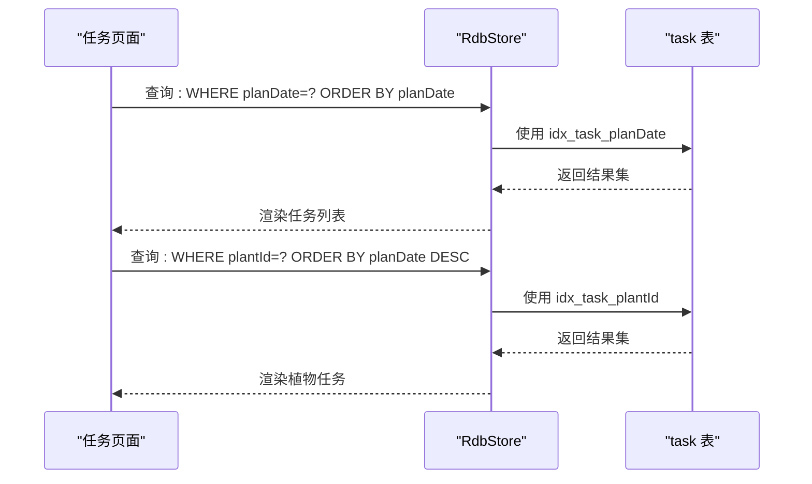
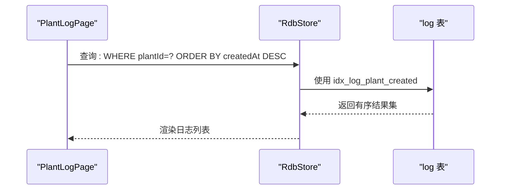
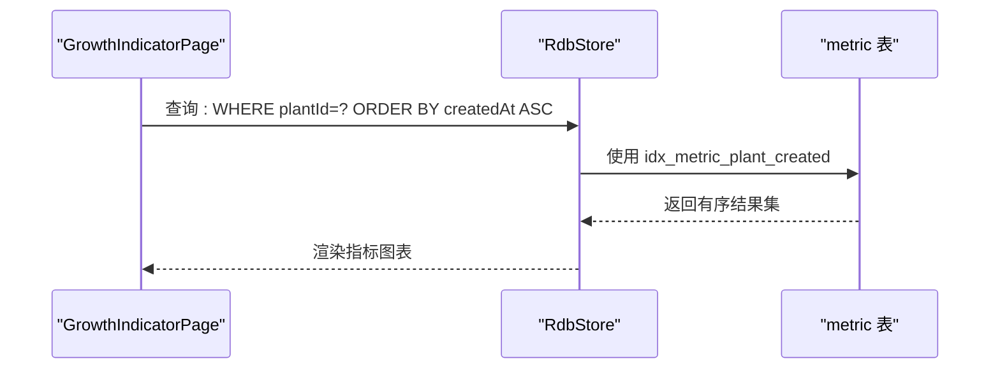
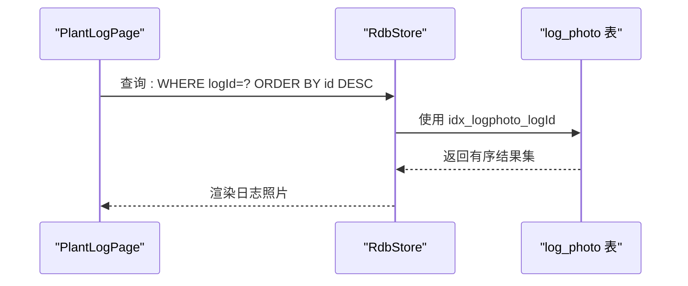
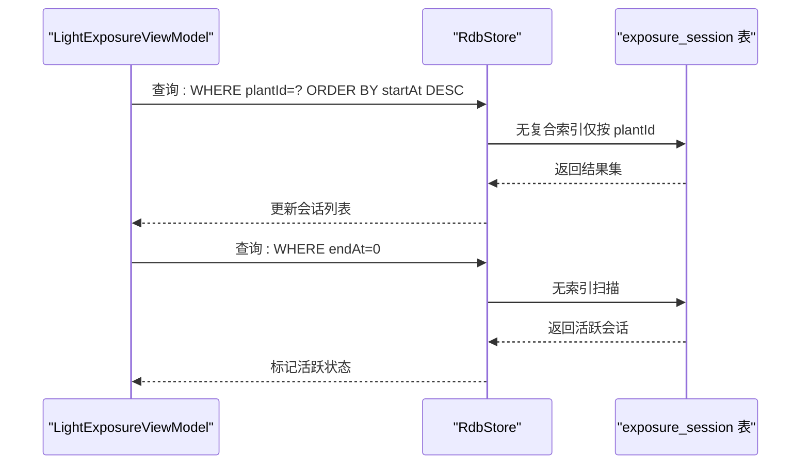
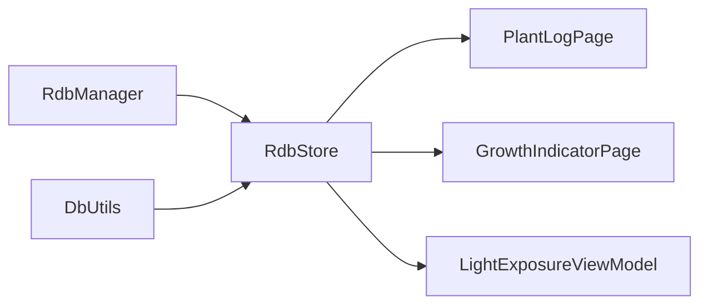

# 索引设计

<cite>
**本文引用的文件**
- [RdbManager.ets](file://entry/src/main/ets/viewmodel/RdbManager.ets)
- [DbUtils.ets](file://entry/src/main/ets/model/DbUtils.ets)
- [PlantLogPage.ets](file://entry/src/main/ets/pages/PlantLogPage.ets)
- [GrowthIndicatorPage.ets](file://entry/src/main/ets/pages/GrowthIndicatorPage.ets)
- [LightExposureViewModel.ets](file://entry/src/main/ets/viewmodel/LightExposureViewModel.ets)
- [PlantModel.ets](file://entry/src/main/ets/model/PlantModel.ets)
- [PlantLogSheet.ets](file://entry/src/main/ets/view/PlantLogSheet.ets)
</cite>

## 目录
1. [简介](#简介)
2. [项目结构](#项目结构)
3. [核心组件](#核心组件)
4. [架构总览](#架构总览)
5. [详细组件分析](#详细组件分析)
6. [依赖分析](#依赖分析)
7. [性能考量](#性能考量)
8. [故障排查指南](#故障排查指南)
9. [结论](#结论)
10. [附录](#附录)

## 简介
本文件面向植物日记项目的数据库索引设计，系统梳理现有索引（唯一索引 idx_task_unique 与多个复合索引）的创建策略、设计原理与性能影响，结合实际查询模式给出索引选择策略与最佳实践，并提供索引维护与性能监控建议。文档同时说明索引与表结构的关系，以及如何根据查询模式优化索引设计。

## 项目结构
植物日记采用 ArkTS + 关系型数据库（RDB）的移动端架构，数据库初始化与索引创建集中在 RdbManager 中，各页面通过统一的 RdbStore 访问数据。核心表包括 plant、task、log、metric、log_photo、care_template、care_rule、light_profile、exposure_session 等。

**图表来源**
- [RdbManager.ets:27-170](file://entry/src/main/ets/viewmodel/RdbManager.ets#L27-L170)
- [PlantLogPage.ets:58-357](file://entry/src/main/ets/pages/PlantLogPage.ets#L58-L357)
- [GrowthIndicatorPage.ets:56-420](file://entry/src/main/ets/pages/GrowthIndicatorPage.ets#L56-L420)
- [LightExposureViewModel.ets:43-113](file://entry/src/main/ets/viewmodel/LightExposureViewModel.ets#L43-L113)

**章节来源**
- [RdbManager.ets:27-170](file://entry/src/main/ets/viewmodel/RdbManager.ets#L27-L170)

## 核心组件
- RdbManager：负责数据库初始化、建表与索引创建，集中管理所有表结构与索引策略。
- 各页面与视图模型：通过 RdbStore 发起查询与写入，遵循统一的 SQL 访问模式。
- 事务封装：DbUtils 提供统一事务封装，保障批量写入的一致性。

**章节来源**
- [RdbManager.ets:4-296](file://entry/src/main/ets/viewmodel/RdbManager.ets#L4-L296)
- [DbUtils.ets:1-22](file://entry/src/main/ets/model/DbUtils.ets#L1-L22)

## 架构总览
索引设计围绕以下关键表与查询模式展开：
- task：高频按 plantId、planDate 查询与排序，唯一索引约束重复任务。
- log：按 plantId 查询日志并按 createdAt 倒序展示。
- metric：按 plantId + createdAt 查询与排序，支持图表展示。
- log_photo：按 logId 查询附件。
- light_profile/exposure_session：按 plantId 查询配置与历史会话，支持活跃会话查询。

**图表来源**
- [RdbManager.ets:37-129](file://entry/src/main/ets/viewmodel/RdbManager.ets#L37-L129)

## 详细组件分析

### 唯一索引 idx_task_unique 设计
- 创建位置：task 表唯一索引，约束 (plantId, type, planDate) 组合唯一。
- 设计动机：防止同植物、同任务类型、同计划日期重复插入，支持“尝试插入、冲突即跳过”的幂等策略。
- 性能影响：唯一约束带来插入时的冲突检查成本，但显著降低重复任务带来的数据冗余与查询歧义。

**图表来源**
- [RdbManager.ets:134-137](file://entry/src/main/ets/viewmodel/RdbManager.ets#L134-L137)

**章节来源**
- [RdbManager.ets:131-137](file://entry/src/main/ets/viewmodel/RdbManager.ets#L131-L137)

### 复合索引 idx_task_planDate 与 idx_task_plantId
- idx_task_planDate：按计划日期查询与排序，满足任务列表按日期展示需求。
- idx_task_plantId：按植物查询任务，满足按植物筛选与聚合。
- 设计原则：优先满足高频查询谓词，避免重复索引；与唯一索引组合使用，减少冗余列索引。

**图表来源**
- [RdbManager.ets:139-146](file://entry/src/main/ets/viewmodel/RdbManager.ets#L139-L146)

**章节来源**
- [RdbManager.ets:138-146](file://entry/src/main/ets/viewmodel/RdbManager.ets#L138-L146)

### 复合索引 idx_log_plant_created
- 创建位置：log 表 (plantId, createdAt)。
- 查询模式：按 plantId 拉取日志，再按 createdAt 倒序展示。
- 设计原则：复合索引覆盖查询谓词与排序，避免额外排序开销与回表。

**图表来源**
- [RdbManager.ets:152-155](file://entry/src/main/ets/viewmodel/RdbManager.ets#L152-L155)
- [PlantLogPage.ets:330-350](file://entry/src/main/ets/pages/PlantLogPage.ets#L330-L350)

**章节来源**
- [RdbManager.ets:148-155](file://entry/src/main/ets/viewmodel/RdbManager.ets#L148-L155)
- [PlantLogPage.ets:324-357](file://entry/src/main/ets/pages/PlantLogPage.ets#L324-L357)

### 复合索引 idx_metric_plant_created
- 创建位置：metric 表 (plantId, createdAt)。
- 查询模式：按植物查询指标并按时间升序展示，支持图表绘制。
- 设计原则：复合索引覆盖查询与排序，提升图表渲染性能。

**图表来源**
- [RdbManager.ets:166-169](file://entry/src/main/ets/viewmodel/RdbManager.ets#L166-L169)
- [GrowthIndicatorPage.ets:401-420](file://entry/src/main/ets/pages/GrowthIndicatorPage.ets#L401-L420)

**章节来源**
- [RdbManager.ets:163-169](file://entry/src/main/ets/viewmodel/RdbManager.ets#L163-L169)
- [GrowthIndicatorPage.ets:401-420](file://entry/src/main/ets/pages/GrowthIndicatorPage.ets#L401-L420)

### 单列索引 idx_logphoto_logId
- 创建位置：log_photo 表 (logId)。
- 查询模式：按日志 ID 查询附件，支持日志详情页加载照片列表。
- 设计原则：单一列索引满足典型查询，避免不必要的复合索引。

**图表来源**
- [RdbManager.ets:158-161](file://entry/src/main/ets/viewmodel/RdbManager.ets#L158-L161)
- [PlantLogPage.ets:165-170](file://entry/src/main/ets/pages/PlantLogPage.ets#L165-L170)

**章节来源**
- [RdbManager.ets:157-161](file://entry/src/main/ets/viewmodel/RdbManager.ets#L157-L161)
- [PlantLogPage.ets:161-177](file://entry/src/main/ets/pages/PlantLogPage.ets#L161-L177)

### 光照相关查询与索引策略
- light_profile：按 plantId 查询配置，作为一对一主键，无需额外索引。
- exposure_session：按 plantId 查询历史会话，支持活跃会话查询（endAt=0）。
- 现状：未显式创建索引，但查询模式相对简单，可通过执行计划评估是否需要补充索引。

**图表来源**
- [RdbManager.ets:109-129](file://entry/src/main/ets/viewmodel/RdbManager.ets#L109-L129)
- [LightExposureViewModel.ets:71-88](file://entry/src/main/ets/viewmodel/LightExposureViewModel.ets#L71-L88)

**章节来源**
- [RdbManager.ets:105-129](file://entry/src/main/ets/viewmodel/RdbManager.ets#L105-L129)
- [LightExposureViewModel.ets:43-113](file://entry/src/main/ets/viewmodel/LightExposureViewModel.ets#L43-L113)

## 依赖分析
- RdbManager 是数据库与索引的唯一入口，所有页面与视图模型通过其提供的 RdbStore 访问数据。
- 事务封装 DbUtils 为批量写入提供一致性保障，避免索引维护期间的数据不一致。
- 页面与视图模型依赖统一的 SQL 查询模式，索引设计需与查询谓词与排序保持一致。

**图表来源**
- [RdbManager.ets:4-296](file://entry/src/main/ets/viewmodel/RdbManager.ets#L4-L296)
- [DbUtils.ets:1-22](file://entry/src/main/ets/model/DbUtils.ets#L1-L22)

**章节来源**
- [RdbManager.ets:4-296](file://entry/src/main/ets/viewmodel/RdbManager.ets#L4-L296)
- [DbUtils.ets:1-22](file://entry/src/main/ets/model/DbUtils.ets#L1-L22)

## 性能考量
- 索引覆盖查询谓词与排序：task、log、metric 的复合索引有效避免额外排序与回表，提升查询性能。
- 唯一索引的冲突成本：idx_task_unique 在插入时进行冲突检查，但能显著减少重复任务，降低后续查询与维护成本。
- 单列索引的必要性：log_photo 的 logId 索引满足典型查询，避免全表扫描。
- 光照查询现状：exposure_session 未显式索引，活跃会话查询（endAt=0）可能产生全表扫描，建议评估是否添加 (plantId, endAt) 复合索引以优化活跃会话检测。

[本节为通用性能讨论，不直接分析具体文件]

## 故障排查指南
- 插入冲突：当插入任务时出现冲突，应检查唯一索引约束，确认是否为重复任务。
- 查询性能异常：若发现某查询变慢，检查是否命中预期索引，确认查询谓词与排序是否与索引列顺序一致。
- 事务一致性：批量写入失败时，检查事务封装是否正确使用，确保异常时回滚生效。
- 光照活跃会话：若首页“正在补光”状态不同步，检查活跃会话查询是否命中索引，必要时评估添加索引。

**章节来源**
- [RdbManager.ets:131-137](file://entry/src/main/ets/viewmodel/RdbManager.ets#L131-L137)
- [DbUtils.ets:12-21](file://entry/src/main/ets/model/DbUtils.ets#L12-L21)
- [LightExposureViewModel.ets:277-278](file://entry/src/main/ets/viewmodel/LightExposureViewModel.ets#L277-L278)

## 结论
植物日记项目的索引设计以查询模式为核心，通过唯一索引与复合索引覆盖高频查询与排序，有效提升了任务、日志、指标等关键场景的查询性能。建议在光照活跃会话查询场景评估添加相应索引，并持续通过执行计划与监控指标验证索引效果。

[本节为总结性内容，不直接分析具体文件]

## 附录

### 索引设计最佳实践
- 命名规范：采用“idx_{table}_{columns}”格式，清晰表达表名与覆盖列。
- 谓词与排序对齐：索引列顺序需与查询 WHERE 与 ORDER BY 保持一致。
- 避免冗余索引：优先使用复合索引覆盖多列查询，减少重复单列索引。
- 唯一性约束：对存在重复风险的关键组合使用唯一索引，保障数据一致性。
- 事务与一致性：批量写入使用统一事务封装，确保索引与数据一致性。

[本节为通用最佳实践，不直接分析具体文件]

### 索引维护策略
- 定期审查：定期审查查询执行计划，识别未命中索引或回表过多的查询。
- 监控指标：关注慢查询日志与执行耗时，定位性能瓶颈。
- 版本演进：随着查询模式变化，及时调整索引策略，避免历史索引成为负担。

[本节为通用维护建议，不直接分析具体文件]

### 索引创建与性能测试参考
- 索引创建示例路径
  - 唯一索引：[RdbManager.ets:134-137](file://entry/src/main/ets/viewmodel/RdbManager.ets#L134-L137)
  - 复合索引（任务按日期）：[RdbManager.ets:139-142](file://entry/src/main/ets/viewmodel/RdbManager.ets#L139-L142)
  - 复合索引（任务按植物）：[RdbManager.ets:143-146](file://entry/src/main/ets/viewmodel/RdbManager.ets#L143-L146)
  - 复合索引（日志按植物+时间）：[RdbManager.ets:152-155](file://entry/src/main/ets/viewmodel/RdbManager.ets#L152-L155)
  - 复合索引（指标按植物+时间）：[RdbManager.ets:166-169](file://entry/src/main/ets/viewmodel/RdbManager.ets#L166-L169)
  - 单列索引（日志照片按日志）：[RdbManager.ets:158-161](file://entry/src/main/ets/viewmodel/RdbManager.ets#L158-L161)

- 性能测试建议
  - 使用执行计划工具验证索引命中情况。
  - 对热点查询进行基准测试，记录查询耗时与返回行数。
  - 在索引变更前后对比性能指标，评估收益与成本。

[本节为参考路径与测试建议，不直接分析具体文件]