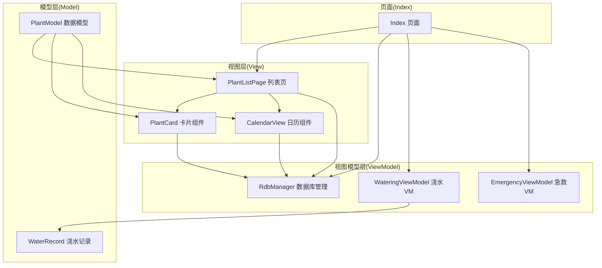
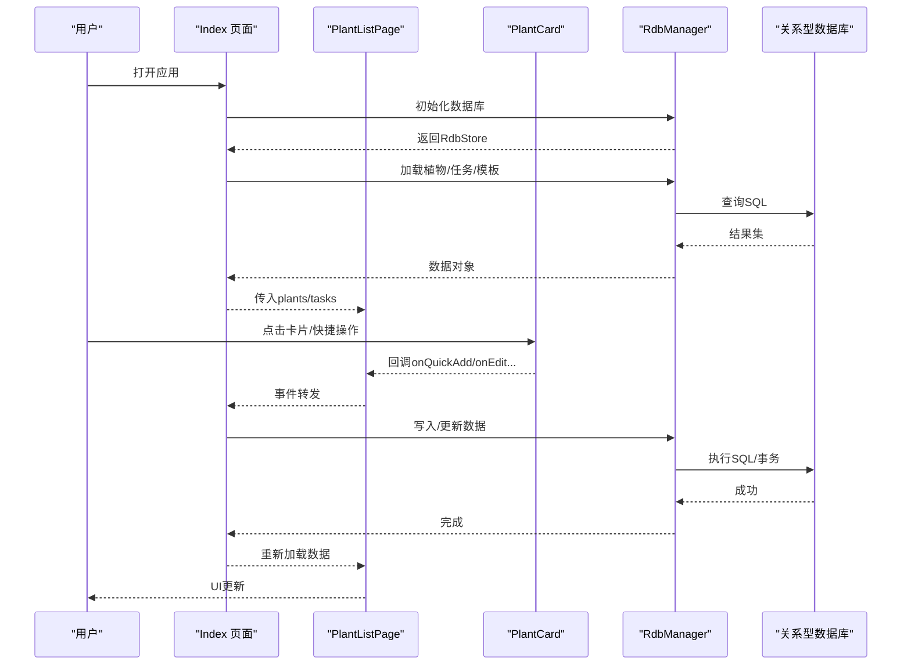
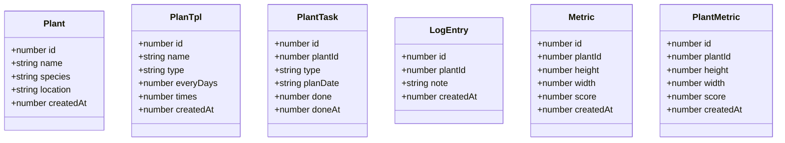
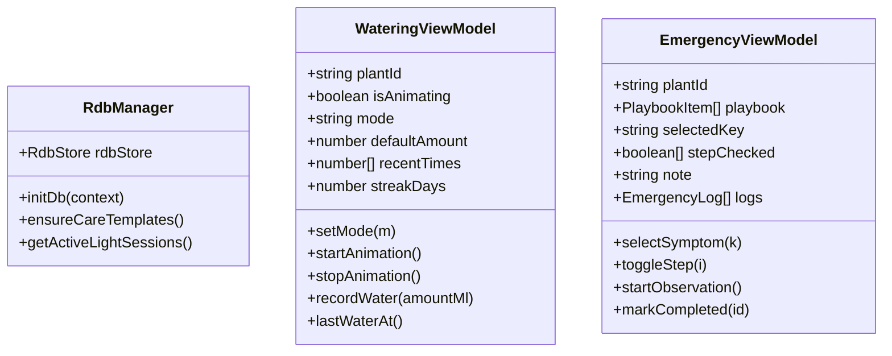
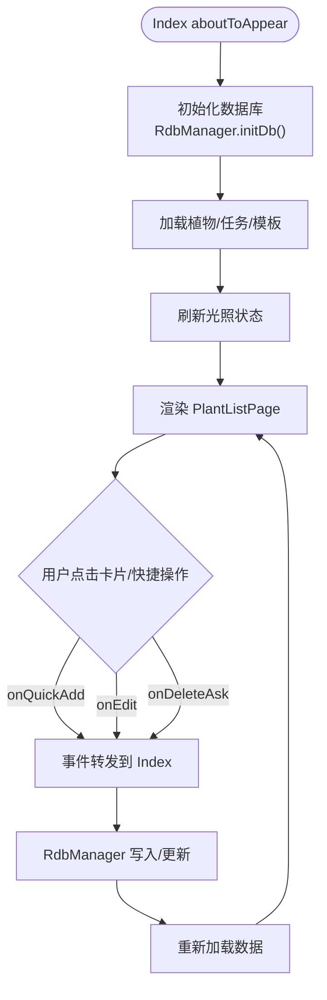
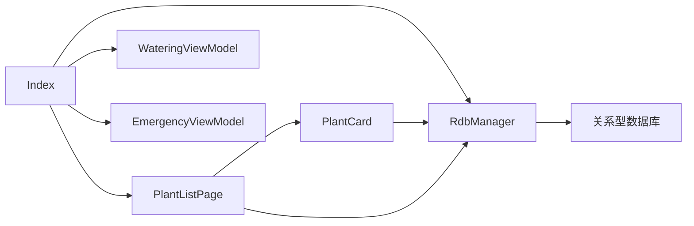

# MVVM架构模式

<cite>
**本文引用的文件**
- [RdbManager.ets](file://entry/src/main/ets/viewmodel/RdbManager.ets)
- [PlantModel.ets](file://entry/src/main/ets/model/PlantModel.ets)
- [PlantCard.ets](file://entry/src/main/ets/view/PlantCard.ets)
- [WateringViewModel.ets](file://entry/src/main/ets/viewmodel/WateringViewModel.ets)
- [Index.ets](file://entry/src/main/ets/pages/Index.ets)
- [PlantListPage.ets](file://entry/src/main/ets/pages/PlantListPage.ets)
- [DbUtils.ets](file://entry/src/main/ets/model/DbUtils.ets)
- [EmergencyViewModel.ets](file://entry/src/main/ets/viewmodel/EmergencyViewModel.ets)
- [WaterRecord.ets](file://entry/src/main/ets/model/WaterRecord.ets)
- [CalendarView.ets](file://entry/src/main/ets/view/CalendarView.ets)
</cite>

## 目录
1. [简介](#简介)
2. [项目结构](#项目结构)
3. [核心组件](#核心组件)
4. [架构总览](#架构总览)
5. [详细组件分析](#详细组件分析)
6. [依赖分析](#依赖分析)
7. [性能考虑](#性能考虑)
8. [故障排查指南](#故障排查指南)
9. [结论](#结论)
10. [附录](#附录)

## 简介
本文件面向植物日记项目，系统性阐述在HarmonyOS应用中基于ArkTS的MVVM架构实现。文档聚焦以下目标：
- 明确Model-View-ViewModel三层职责与边界
- 解释数据流与组件交互关系
- 深入说明响应式编程在MVVM中的应用（@ObservedV2、@State、@Prop、@Event等装饰器）
- 展示数据绑定、状态管理与事件处理流程
- 提供可操作的最佳实践与排障建议

## 项目结构
植物日记采用以页面为中心的组织方式，结合Model（数据模型）、ViewModel（业务逻辑与状态）、View（UI组件）三层划分：
- Model层：定义轻量数据结构与接口，承载业务实体与简单构造逻辑
- ViewModel层：封装业务状态与逻辑，提供可观测状态与方法
- View层：组件化UI，负责渲染与事件传递

**图表来源**
- [Index.ets:1-120](file://entry/src/main/ets/pages/Index.ets#L1-L120)
- [PlantListPage.ets:1-60](file://entry/src/main/ets/pages/PlantListPage.ets#L1-L60)
- [PlantCard.ets:1-40](file://entry/src/main/ets/view/PlantCard.ets#L1-L40)
- [CalendarView.ets:1-40](file://entry/src/main/ets/view/CalendarView.ets#L1-L40)
- [RdbManager.ets:1-40](file://entry/src/main/ets/viewmodel/RdbManager.ets#L1-L40)
- [WateringViewModel.ets:1-30](file://entry/src/main/ets/viewmodel/WateringViewModel.ets#L1-L30)
- [EmergencyViewModel.ets:1-30](file://entry/src/main/ets/viewmodel/EmergencyViewModel.ets#L1-L30)
- [PlantModel.ets:1-40](file://entry/src/main/ets/model/PlantModel.ets#L1-L40)
- [WaterRecord.ets:1-20](file://entry/src/main/ets/model/WaterRecord.ets#L1-L20)

**章节来源**
- [Index.ets:1-120](file://entry/src/main/ets/pages/Index.ets#L1-L120)
- [PlantListPage.ets:1-60](file://entry/src/main/ets/pages/PlantListPage.ets#L1-L60)
- [PlantCard.ets:1-40](file://entry/src/main/ets/view/PlantCard.ets#L1-L40)
- [CalendarView.ets:1-40](file://entry/src/main/ets/view/CalendarView.ets#L1-L40)
- [RdbManager.ets:1-40](file://entry/src/main/ets/viewmodel/RdbManager.ets#L1-L40)
- [WateringViewModel.ets:1-30](file://entry/src/main/ets/viewmodel/WateringViewModel.ets#L1-L30)
- [EmergencyViewModel.ets:1-30](file://entry/src/main/ets/viewmodel/EmergencyViewModel.ets#L1-L30)
- [PlantModel.ets:1-40](file://entry/src/main/ets/model/PlantModel.ets#L1-L40)
- [WaterRecord.ets:1-20](file://entry/src/main/ets/model/WaterRecord.ets#L1-L20)

## 核心组件
- 数据模型（Model）
  - 使用@ObservedV2标注的类作为可观察数据载体，如Plant、PlanTpl、PlantTask、LogEntry、Metric、PlantMetric等
  - 轻量数据结构，仅包含字段与必要构造逻辑，复杂业务规则置于页面或ViewModel
- 视图模型（ViewModel）
  - RdbManager：数据库初始化、建表、索引、默认数据注入与查询
  - WateringViewModel：浇水动画状态、历史记录、连胜天数等业务状态
  - EmergencyViewModel：急救流程状态与记录生成
- 视图（View）
  - Index：应用入口与状态中枢，负责数据库初始化、全局数据加载与状态管理
  - PlantListPage：植物列表页，负责筛选、排序与事件转发
  - PlantCard：植物卡片组件，负责展示与事件回调
  - CalendarView：日历组件，负责日期网格、任务筛选与交互

**章节来源**
- [PlantModel.ets:1-166](file://entry/src/main/ets/model/PlantModel.ets#L1-L166)
- [RdbManager.ets:1-170](file://entry/src/main/ets/viewmodel/RdbManager.ets#L1-L170)
- [WateringViewModel.ets:1-102](file://entry/src/main/ets/viewmodel/WateringViewModel.ets#L1-L102)
- [EmergencyViewModel.ets:1-115](file://entry/src/main/ets/viewmodel/EmergencyViewModel.ets#L1-L115)
- [Index.ets:1-120](file://entry/src/main/ets/pages/Index.ets#L1-L120)
- [PlantListPage.ets:1-60](file://entry/src/main/ets/pages/PlantListPage.ets#L1-L60)
- [PlantCard.ets:1-40](file://entry/src/main/ets/view/PlantCard.ets#L1-L40)
- [CalendarView.ets:1-40](file://entry/src/main/ets/view/CalendarView.ets#L1-L40)

## 架构总览
MVVM在植物日记中的落地要点：
- 响应式数据：@ObservedV2使数据变更自动触发UI更新
- 状态集中：Index作为状态中枢，统一加载与刷新全局数据
- 事件驱动：View通过@Event向上游传递用户交互，ViewModel处理业务逻辑
- 数据持久化：RdbManager统一管理数据库生命周期与事务

**图表来源**
- [Index.ets:115-184](file://entry/src/main/ets/pages/Index.ets#L115-L184)
- [PlantListPage.ets:153-196](file://entry/src/main/ets/pages/PlantListPage.ets#L153-L196)
- [PlantCard.ets:155-196](file://entry/src/main/ets/view/PlantCard.ets#L155-L196)
- [RdbManager.ets:27-170](file://entry/src/main/ets/viewmodel/RdbManager.ets#L27-L170)

**章节来源**
- [Index.ets:115-184](file://entry/src/main/ets/pages/Index.ets#L115-L184)
- [PlantListPage.ets:153-196](file://entry/src/main/ets/pages/PlantListPage.ets#L153-L196)
- [PlantCard.ets:155-196](file://entry/src/main/ets/view/PlantCard.ets#L155-L196)
- [RdbManager.ets:27-170](file://entry/src/main/ets/viewmodel/RdbManager.ets#L27-L170)

## 详细组件分析

### 数据模型（Model）
- 设计原则
  - 仅承载字段与最小构造逻辑，复杂规则移至页面或ViewModel
  - 使用@ObservedV2标注，确保字段变更可被响应式框架感知
- 关键类型
  - Plant：植物基本信息
  - PlanTpl：周期模板
  - PlantTask：任务
  - LogEntry：日志
  - Metric/PlantMetric：生长指标
  - CareTemplate/CareRule：养护模板与规则
- 复杂度与性能
  - 数据结构扁平，便于序列化与传输
  - 通过索引与查询优化提升读取效率（见数据库层）

**图表来源**
- [PlantModel.ets:6-147](file://entry/src/main/ets/model/PlantModel.ets#L6-L147)

**章节来源**
- [PlantModel.ets:1-166](file://entry/src/main/ets/model/PlantModel.ets#L1-L166)

### 视图模型（ViewModel）
- RdbManager
  - 负责数据库初始化、建表、索引与默认数据注入
  - 提供查询活跃光照会话等便捷方法
- WateringViewModel
  - 管理浇水动画与交互态
  - 维护最近浇水时间与连胜天数
  - 生成WaterRecord供页面或上层服务决定是否持久化
- EmergencyViewModel
  - 管理症状选择、步骤勾选与开始观察
  - 生成急救记录并维护历史列表

**图表来源**
- [RdbManager.ets:4-295](file://entry/src/main/ets/viewmodel/RdbManager.ets#L4-L295)
- [WateringViewModel.ets:11-96](file://entry/src/main/ets/viewmodel/WateringViewModel.ets#L11-L96)
- [EmergencyViewModel.ets:13-114](file://entry/src/main/ets/viewmodel/EmergencyViewModel.ets#L13-L114)

**章节来源**
- [RdbManager.ets:1-295](file://entry/src/main/ets/viewmodel/RdbManager.ets#L1-L295)
- [WateringViewModel.ets:1-102](file://entry/src/main/ets/viewmodel/WateringViewModel.ets#L1-L102)
- [EmergencyViewModel.ets:1-115](file://entry/src/main/ets/viewmodel/EmergencyViewModel.ets#L1-L115)

### 视图（View）
- Index
  - 应用状态中枢：初始化数据库、加载全局数据、管理Banner提示
  - 提供Provider注入RdbManager与store，供子组件消费
- PlantListPage
  - 负责植物列表的筛选与排序，将计算逻辑下沉至页面，减少子组件负担
  - 通过事件回调将用户操作上抛至Index处理
- PlantCard
  - 负责卡片展示与交互，内部查询最近日志与照片，支持补光呼吸效果
  - 通过@Event向外抛出操作事件
- CalendarView
  - 支持抽屉与内嵌两种模式，负责日历网格、任务筛选与当日清单
  - 通过@Event与父组件交互

**图表来源**
- [Index.ets:115-184](file://entry/src/main/ets/pages/Index.ets#L115-L184)
- [PlantListPage.ets:153-196](file://entry/src/main/ets/pages/PlantListPage.ets#L153-L196)
- [PlantCard.ets:155-196](file://entry/src/main/ets/view/PlantCard.ets#L155-L196)
- [RdbManager.ets:27-170](file://entry/src/main/ets/viewmodel/RdbManager.ets#L27-L170)

**章节来源**
- [Index.ets:115-184](file://entry/src/main/ets/pages/Index.ets#L115-L184)
- [PlantListPage.ets:1-228](file://entry/src/main/ets/pages/PlantListPage.ets#L1-L228)
- [PlantCard.ets:1-326](file://entry/src/main/ets/view/PlantCard.ets#L1-L326)
- [CalendarView.ets:1-566](file://entry/src/main/ets/view/CalendarView.ets#L1-L566)

## 依赖分析
- 组件耦合
  - Index对RdbManager强依赖，负责数据库生命周期与全局数据加载
  - PlantListPage依赖Plant模型与PlantTask集合，通过事件回调与Index解耦
  - PlantCard依赖RdbManager查询日志与照片，同时通过事件回调与父页面解耦
- 外部依赖
  - ArkData关系型数据库：提供SQL执行、事务与索引能力
  - AppStorage：用于跨组件状态广播（如补光状态）
- 循环依赖
  - 未发现循环依赖，数据流单向：View -> ViewModel -> Model -> 数据库

**图表来源**
- [Index.ets:42-46](file://entry/src/main/ets/pages/Index.ets#L42-L46)
- [PlantListPage.ets:1-25](file://entry/src/main/ets/pages/PlantListPage.ets#L1-L25)
- [PlantCard.ets:23-24](file://entry/src/main/ets/view/PlantCard.ets#L23-L24)
- [RdbManager.ets:1-4](file://entry/src/main/ets/viewmodel/RdbManager.ets#L1-L4)
- [WateringViewModel.ets:1-11](file://entry/src/main/ets/viewmodel/WateringViewModel.ets#L1-L11)
- [EmergencyViewModel.ets:1-13](file://entry/src/main/ets/viewmodel/EmergencyViewModel.ets#L1-L13)

**章节来源**
- [Index.ets:42-46](file://entry/src/main/ets/pages/Index.ets#L42-L46)
- [PlantListPage.ets:1-25](file://entry/src/main/ets/pages/PlantListPage.ets#L1-L25)
- [PlantCard.ets:23-24](file://entry/src/main/ets/view/PlantCard.ets#L23-L24)
- [RdbManager.ets:1-4](file://entry/src/main/ets/viewmodel/RdbManager.ets#L1-L4)
- [WateringViewModel.ets:1-11](file://entry/src/main/ets/viewmodel/WateringViewModel.ets#L1-L11)
- [EmergencyViewModel.ets:1-13](file://entry/src/main/ets/viewmodel/EmergencyViewModel.ets#L1-L13)

## 性能考虑
- 数据库查询与索引
  - 为常用查询建立复合索引（如任务按plantId+createdAt、日志按plantId+createdAt、指标按plantId+createdAt），降低查询成本
- 事务一致性
  - 对批量写入使用runInTransaction封装，确保原子性，避免部分失败导致脏数据
- UI渲染优化
  - 列表页的筛选与排序在页面层完成，减少子组件重复计算
  - 组件内部使用@Local本地状态，避免不必要的全局状态更新
- 状态广播
  - 使用AppStorage广播补光状态，避免频繁跨层级传递

**章节来源**
- [RdbManager.ets:131-170](file://entry/src/main/ets/viewmodel/RdbManager.ets#L131-L170)
- [DbUtils.ets:1-22](file://entry/src/main/ets/model/DbUtils.ets#L1-L22)
- [PlantListPage.ets:91-114](file://entry/src/main/ets/pages/PlantListPage.ets#L91-L114)
- [Index.ets:162-168](file://entry/src/main/ets/pages/Index.ets#L162-L168)

## 故障排查指南
- 数据库初始化失败
  - 现象：Banner提示数据库初始化失败
  - 排查：检查RdbManager.initDb()执行链路与权限配置
- 事务异常
  - 现象：批量写入后部分失败
  - 排查：确认runInTransaction包裹逻辑，捕获异常并回滚
- 状态不一致
  - 现象：卡片补光状态与实际不符
  - 排查：确认Index.refreshActiveSessions()是否正确更新AppStorage
- 事件未回调
  - 现象：点击卡片无响应
  - 排查：确认PlantCard事件回调是否正确透传至父页面

**章节来源**
- [Index.ets:115-125](file://entry/src/main/ets/pages/Index.ets#L115-L125)
- [DbUtils.ets:12-21](file://entry/src/main/ets/model/DbUtils.ets#L12-L21)
- [Index.ets:162-168](file://entry/src/main/ets/pages/Index.ets#L162-L168)
- [PlantCard.ets:155-196](file://entry/src/main/ets/view/PlantCard.ets#L155-L196)

## 结论
植物日记项目在HarmonyOS中通过清晰的MVVM分层实现了数据驱动的UI更新与稳定的业务逻辑处理。@ObservedV2、@State、@Prop、@Event等装饰器有效支撑了响应式编程与组件间通信。配合RdbManager统一的数据库管理与事务封装，项目具备良好的扩展性与可维护性。建议在后续迭代中持续优化查询索引与渲染性能，并完善错误监控与日志追踪。

## 附录
- 装饰器使用要点
  - @ObservedV2：用于数据模型与VM，确保字段变更触发响应式更新
  - @State/@Local：用于页面与组件的本地状态管理
  - @Param/@Require：用于组件间参数传递
  - @Event：用于组件向父级传递用户交互事件
- 最佳实践
  - 将复杂业务逻辑集中在ViewModel或页面，保持组件简洁
  - 使用Provider/Consumer在页面与子组件间传递共享状态
  - 对批量写入使用事务封装，保证一致性
  - 通过索引优化常用查询，减少全表扫描