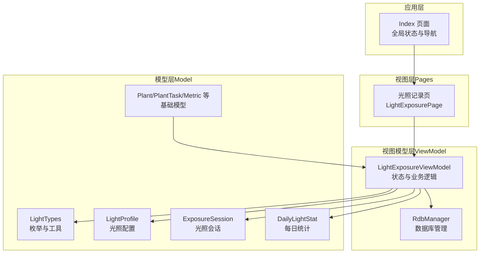
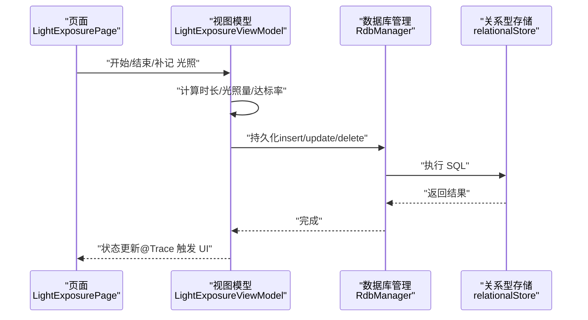
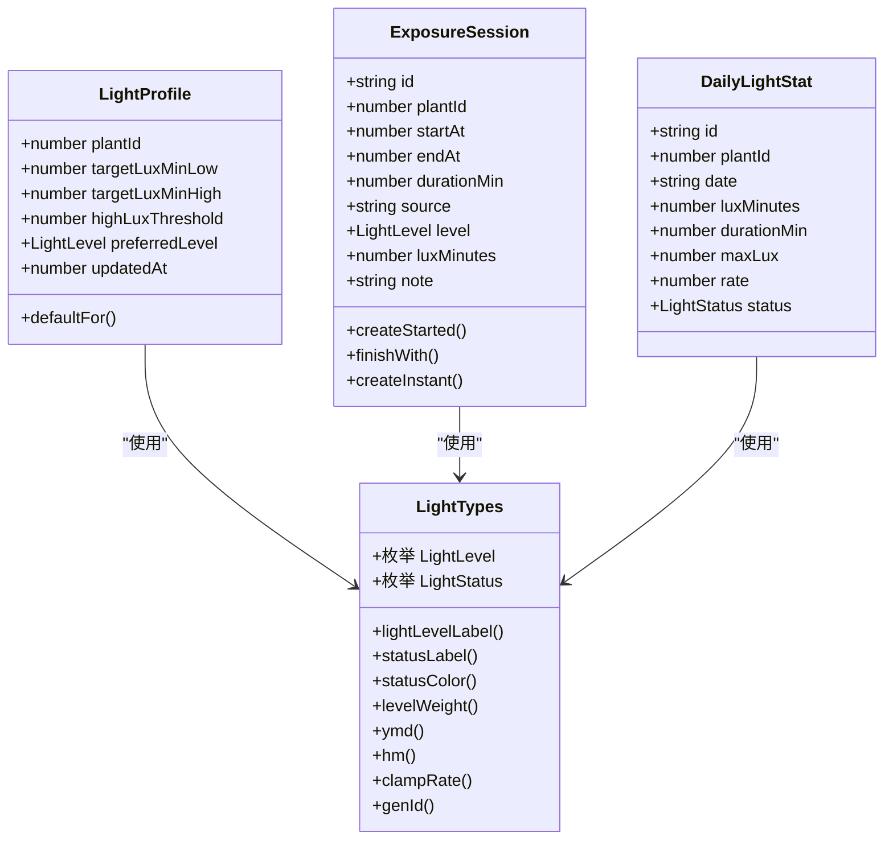
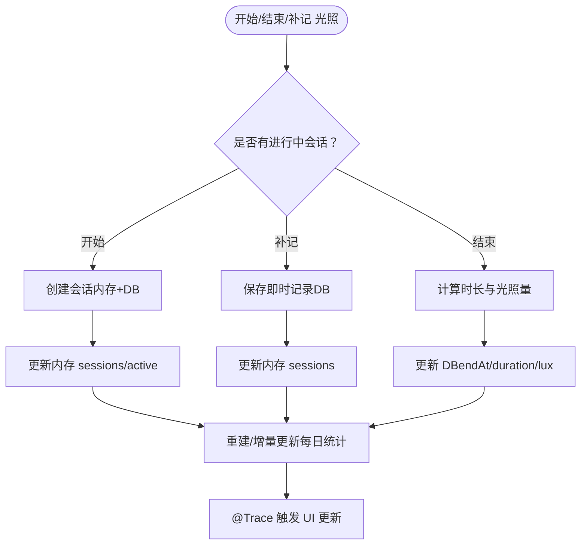
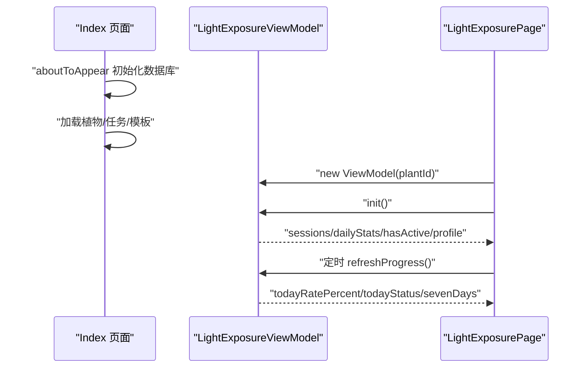
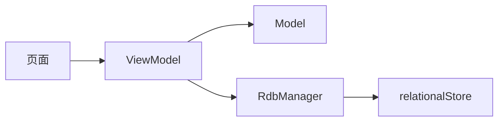

# 架构设计

<cite>
**本文引用的文件**
- [AppScope/app.json5](file://AppScope/app.json5)
- [entry/build-profile.json5](file://entry/build-profile.json5)
- [PROJECT_GUIDE.md](file://PROJECT_GUIDE.md)
- [CODE_ANNOTATIONS.md](file://CODE_ANNOTATIONS.md)
- [entry/src/main/ets/model/LightTypes.ets](file://entry/src/main/ets/model/LightTypes.ets)
- [entry/src/main/ets/model/ExposureSession.ets](file://entry/src/main/ets/model/ExposureSession.ets)
- [entry/src/main/ets/model/PlantModel.ets](file://entry/src/main/ets/model/PlantModel.ets)
- [entry/src/main/ets/model/DailyLightStat.ets](file://entry/src/main/ets/model/DailyLightStat.ets)
- [entry/src/main/ets/model/LightProfile.ets](file://entry/src/main/ets/model/LightProfile.ets)
- [entry/src/main/ets/viewmodel/LightExposureViewModel.ets](file://entry/src/main/ets/viewmodel/LightExposureViewModel.ets)
- [entry/src/main/ets/viewmodel/RdbManager.ets](file://entry/src/main/ets/viewmodel/RdbManager.ets)
- [entry/src/main/ets/pages/Index.ets](file://entry/src/main/ets/pages/Index.ets)
- [entry/src/main/ets/pages/LightExposurePage.ets](file://entry/src/main/ets/pages/LightExposurePage.ets)
</cite>

## 目录
1. [简介](#简介)
2. [项目结构](#项目结构)
3. [核心组件](#核心组件)
4. [架构总览](#架构总览)
5. [详细组件分析](#详细组件分析)
6. [依赖分析](#依赖分析)
7. [性能考虑](#性能考虑)
8. [故障排查指南](#故障排查指南)
9. [结论](#结论)
10. [附录](#附录)

## 简介
本项目是一个基于 HarmonyOS 5.0.5 与 ArkTS 的植物养护管理应用，采用 MVVM 架构模式组织代码，分为 Model（数据模型）、ViewModel（业务逻辑与状态管理）、View（页面与可复用组件）三层。项目围绕“光照记录、浇水估算、生长指标、任务与日志”等核心功能展开，强调响应式状态、装饰器驱动的 UI 更新与模块化数据库管理。

## 项目结构
项目采用按层分组的目录组织方式：
- AppScope：应用级资源配置
- entry/src/main/ets：
  - model：数据模型层（@ObservedV2 + @Trace）
  - viewmodel：业务逻辑与状态管理（RdbManager、各 ViewModel）
  - view：可复用 UI 组件
  - pages：页面层（Index、各功能页）
  - component：基础组件
  - entryability：应用入口能力
- entry/resources：资源文件
- entry/build-profile.json5：构建配置（ArkTS 编译选项）

**图表来源**
- [entry/src/main/ets/pages/Index.ets](file://entry/src/main/ets/pages/Index.ets)
- [entry/src/main/ets/pages/LightExposurePage.ets](file://entry/src/main/ets/pages/LightExposurePage.ets)
- [entry/src/main/ets/viewmodel/LightExposureViewModel.ets](file://entry/src/main/ets/viewmodel/LightExposureViewModel.ets)
- [entry/src/main/ets/viewmodel/RdbManager.ets](file://entry/src/main/ets/viewmodel/RdbManager.ets)
- [entry/src/main/ets/model/LightTypes.ets](file://entry/src/main/ets/model/LightTypes.ets)
- [entry/src/main/ets/model/LightProfile.ets](file://entry/src/main/ets/model/LightProfile.ets)
- [entry/src/main/ets/model/ExposureSession.ets](file://entry/src/main/ets/model/ExposureSession.ets)
- [entry/src/main/ets/model/DailyLightStat.ets](file://entry/src/main/ets/model/DailyLightStat.ets)
- [entry/src/main/ets/model/PlantModel.ets](file://entry/src/main/ets/model/PlantModel.ets)

**章节来源**
- [PROJECT_GUIDE.md](file://PROJECT_GUIDE.md)
- [entry/build-profile.json5](file://entry/build-profile.json5)

## 核心组件
- 数据模型（Model）
  - 使用 @ObservedV2 与 @Trace 装饰器实现响应式数据结构，便于 ViewModel 与 UI 自动联动。
  - 关键模型：Plant、ExposureSession、DailyLightStat、LightProfile、Metric 等。
- 视图模型（ViewModel）
  - LightExposureViewModel：负责光照会话管理、统计计算、数据库交互与状态更新。
  - RdbManager：数据库初始化、建表、索引与默认数据注入，提供统一的 CRUD 接口。
- 页面（View）
  - Index：应用入口与全局状态中心，负责数据库初始化、全局数据加载与跨页面状态同步。
  - LightExposurePage：光照记录页面，承载 UI 交互与 ViewModel 的绑定。

**章节来源**
- [CODE_ANNOTATIONS.md](file://CODE_ANNOTATIONS.md)
- [entry/src/main/ets/model/PlantModel.ets](file://entry/src/main/ets/model/PlantModel.ets)
- [entry/src/main/ets/model/ExposureSession.ets](file://entry/src/main/ets/model/ExposureSession.ets)
- [entry/src/main/ets/model/DailyLightStat.ets](file://entry/src/main/ets/model/DailyLightStat.ets)
- [entry/src/main/ets/model/LightProfile.ets](file://entry/src/main/ets/model/LightProfile.ets)
- [entry/src/main/ets/viewmodel/LightExposureViewModel.ets](file://entry/src/main/ets/viewmodel/LightExposureViewModel.ets)
- [entry/src/main/ets/viewmodel/RdbManager.ets](file://entry/src/main/ets/viewmodel/RdbManager.ets)
- [entry/src/main/ets/pages/Index.ets](file://entry/src/main/ets/pages/Index.ets)
- [entry/src/main/ets/pages/LightExposurePage.ets](file://entry/src/main/ets/pages/LightExposurePage.ets)

## 架构总览
MVVM 在本项目中的实现要点：
- Model：纯数据结构，承载业务数据与简单校验，不包含 UI 逻辑。
- ViewModel：集中处理业务规则、状态计算、数据持久化与 UI 响应式更新。
- View：仅负责渲染与事件回调，回调委托给 ViewModel，避免直接访问数据库。
- 状态管理：通过 @State、@Prop、@Link、@Local、@Consumer、@ObservedV2、@Trace 等装饰器实现。
- 数据流：页面发起交互 → ViewModel 处理 → Model/数据库变更 → @Trace 触发 UI 更新。

**图表来源**
- [entry/src/main/ets/pages/LightExposurePage.ets](file://entry/src/main/ets/pages/LightExposurePage.ets)
- [entry/src/main/ets/viewmodel/LightExposureViewModel.ets](file://entry/src/main/ets/viewmodel/LightExposureViewModel.ets)
- [entry/src/main/ets/viewmodel/RdbManager.ets](file://entry/src/main/ets/viewmodel/RdbManager.ets)

## 详细组件分析

### Model 层（数据模型）
- LightTypes：定义光照级别与状态枚举、标签映射、颜色映射、权重与日期工具函数。
- ExposureSession：一次完整的光照会话，支持“开始/结束”与“即时补记”两种模式。
- DailyLightStat：每日光照统计，包含达标率与状态。
- LightProfile：植物光照偏好与目标范围配置。
- PlantModel：基础实体（Plant、PlanTpl、PlantTask、LogEntry、Metric 等）。

**图表来源**
- [entry/src/main/ets/model/LightTypes.ets](file://entry/src/main/ets/model/LightTypes.ets)
- [entry/src/main/ets/model/LightProfile.ets](file://entry/src/main/ets/model/LightProfile.ets)
- [entry/src/main/ets/model/ExposureSession.ets](file://entry/src/main/ets/model/ExposureSession.ets)
- [entry/src/main/ets/model/DailyLightStat.ets](file://entry/src/main/ets/model/DailyLightStat.ets)

**章节来源**
- [entry/src/main/ets/model/LightTypes.ets](file://entry/src/main/ets/model/LightTypes.ets)
- [entry/src/main/ets/model/ExposureSession.ets](file://entry/src/main/ets/model/ExposureSession.ets)
- [entry/src/main/ets/model/DailyLightStat.ets](file://entry/src/main/ets/model/DailyLightStat.ets)
- [entry/src/main/ets/model/LightProfile.ets](file://entry/src/main/ets/model/LightProfile.ets)
- [entry/src/main/ets/model/PlantModel.ets](file://entry/src/main/ets/model/PlantModel.ets)

### ViewModel 层（业务逻辑与状态管理）
- LightExposureViewModel
  - 负责：加载/初始化光照配置、管理进行中会话、计算光照量与达标率、增量更新每日统计、提供“近七天”数据。
  - 数据来源：数据库（RdbManager），状态通过 @ObservedV2/@Trace 驱动 UI。
  - 关键流程：开始/结束/补记光照、异常会话清理、删除会话后的统计修正。
- RdbManager
  - 负责：数据库初始化、建表与索引、默认数据注入、提供统一的 CRUD 接口。
  - 设计：单例模式，集中管理数据库生命周期与表结构。

**图表来源**
- [entry/src/main/ets/viewmodel/LightExposureViewModel.ets](file://entry/src/main/ets/viewmodel/LightExposureViewModel.ets)
- [entry/src/main/ets/viewmodel/RdbManager.ets](file://entry/src/main/ets/viewmodel/RdbManager.ets)

**章节来源**
- [entry/src/main/ets/viewmodel/LightExposureViewModel.ets](file://entry/src/main/ets/viewmodel/LightExposureViewModel.ets)
- [entry/src/main/ets/viewmodel/RdbManager.ets](file://entry/src/main/ets/viewmodel/RdbManager.ets)

### View 层（页面与交互）
- Index（应用入口）
  - 职责：初始化数据库、加载全局数据（植物、任务、模板）、维护横幅提示、提供通用弹窗与面板状态。
  - 与 ViewModel 的关系：通过 Provider 注入 RdbManager 与 store，页面本身不直接持有业务状态。
- LightExposurePage（光照记录页）
  - 职责：承载 UI 交互（开始/结束/补记）、展示实时进度与近七天统计、提供偏好配置界面。
  - 与 ViewModel 的关系：@Param 接收植物参数，@Local 绑定 ViewModel，定时刷新 tick 驱动 UI。

**图表来源**
- [entry/src/main/ets/pages/Index.ets](file://entry/src/main/ets/pages/Index.ets)
- [entry/src/main/ets/pages/LightExposurePage.ets](file://entry/src/main/ets/pages/LightExposurePage.ets)
- [entry/src/main/ets/viewmodel/LightExposureViewModel.ets](file://entry/src/main/ets/viewmodel/LightExposureViewModel.ets)

**章节来源**
- [entry/src/main/ets/pages/Index.ets](file://entry/src/main/ets/pages/Index.ets)
- [entry/src/main/ets/pages/LightExposurePage.ets](file://entry/src/main/ets/pages/LightExposurePage.ets)

## 依赖分析
- 组件耦合
  - 页面仅依赖 ViewModel 的公开状态与方法，不直接访问数据库，降低耦合。
  - ViewModel 依赖 Model 与 RdbManager，形成清晰的业务边界。
- 外部依赖
  - ArkTS 装饰器（@ObservedV2、@Trace、@ComponentV2 等）驱动响应式更新。
  - relationalStore 提供 SQLite 风格的关系型数据库操作。
- 潜在风险
  - ViewModel 中的“异常会话清理”逻辑依赖数据库一致性，需保证并发安全与事务正确性。
  - 页面定时刷新 tick 的频率需平衡实时性与性能。

**图表来源**
- [entry/src/main/ets/pages/LightExposurePage.ets](file://entry/src/main/ets/pages/LightExposurePage.ets)
- [entry/src/main/ets/viewmodel/LightExposureViewModel.ets](file://entry/src/main/ets/viewmodel/LightExposureViewModel.ets)
- [entry/src/main/ets/viewmodel/RdbManager.ets](file://entry/src/main/ets/viewmodel/RdbManager.ets)

**章节来源**
- [entry/src/main/ets/viewmodel/LightExposureViewModel.ets](file://entry/src/main/ets/viewmodel/LightExposureViewModel.ets)
- [entry/src/main/ets/viewmodel/RdbManager.ets](file://entry/src/main/ets/viewmodel/RdbManager.ets)

## 性能考虑
- 响应式更新
  - 使用 @Trace 精准追踪属性变化，避免不必要的 UI 重绘。
  - 将复杂计算放在 ViewModel，不在 build 中执行。
- 列表渲染
  - 大数据列表使用惰性渲染与合适容器，减少一次性渲染压力。
- 数据库访问
  - 使用索引优化常用查询（如按 plantId、planDate、createdAt 排序）。
  - 事务封装批量删除与写入，降低锁竞争与 IO 次数。
- 实时刷新
  - 页面定时器按需刷新 tick，避免过于频繁的 UI 更新。

[本节为通用指导，无需特定文件引用]

## 故障排查指南
- 数据库初始化失败
  - 检查 RdbManager 初始化流程与表结构创建日志，确认上下文与权限。
- 异常进行中会话
  - ViewModel 会在初始化时清理多余进行中会话，若仍异常，检查 endAt 字段与事务一致性。
- UI 不更新
  - 确认状态属性使用 @Trace 装饰，且在 ViewModel 内部修改后触发 UI。
- 页面间数据传递
  - 使用 @Param 接收参数，通过 NavPathStack 导航，避免直接共享可变状态。

**章节来源**
- [entry/src/main/ets/viewmodel/RdbManager.ets](file://entry/src/main/ets/viewmodel/RdbManager.ets)
- [entry/src/main/ets/viewmodel/LightExposureViewModel.ets](file://entry/src/main/ets/viewmodel/LightExposureViewModel.ets)
- [entry/src/main/ets/pages/LightExposurePage.ets](file://entry/src/main/ets/pages/LightExposurePage.ets)

## 结论
本项目以 MVVM 为核心，结合 ArkTS 的装饰器体系与 HarmonyOS 的关系型数据库能力，实现了清晰的职责分离与高效的响应式更新。通过 ViewModel 集中处理业务逻辑与状态管理，页面专注于交互与展示，既保证了可维护性，也为后续扩展（如新增功能模块、图表与通知）提供了良好的基础。

## 附录
- 开发规范与最佳实践
  - 类型安全：明确返回类型与接口定义，避免隐式 any。
  - 组件规范：页面使用 @ComponentV2，自定义组件包含 build，命名遵循约定。
  - 资源规范：颜色使用十六进制，避免 CSS 颜色格式。
- 新增功能步骤
  - 在 model/ 创建数据模型
  - 在 viewmodel/ 创建业务逻辑
  - 在 pages/ 创建页面
  - 在 Index 中注册路由与状态

**章节来源**
- [PROJECT_GUIDE.md](file://PROJECT_GUIDE.md)
- [CODE_ANNOTATIONS.md](file://CODE_ANNOTATIONS.md)