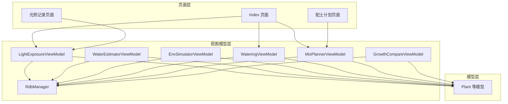
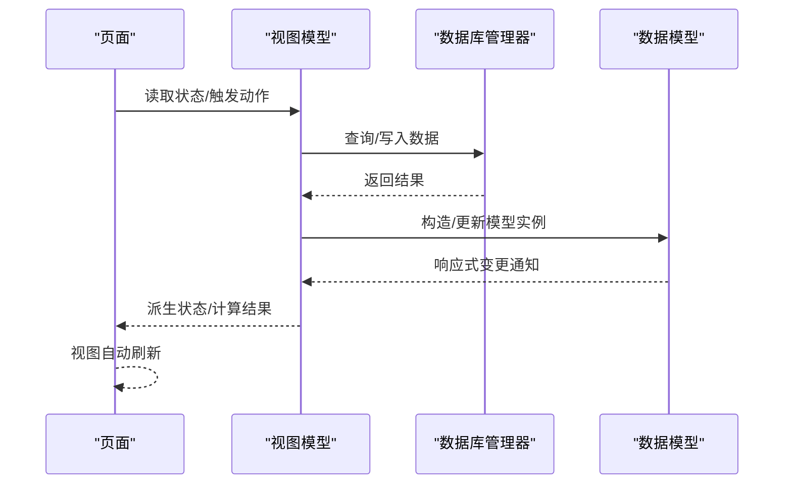
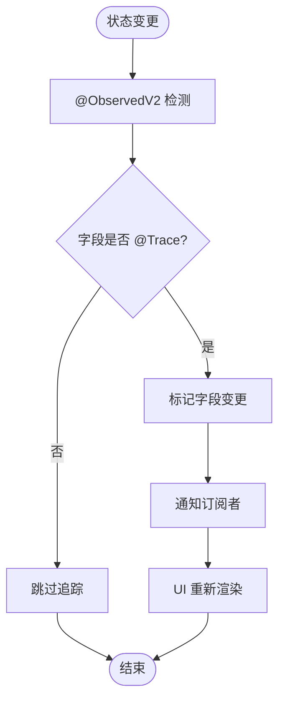
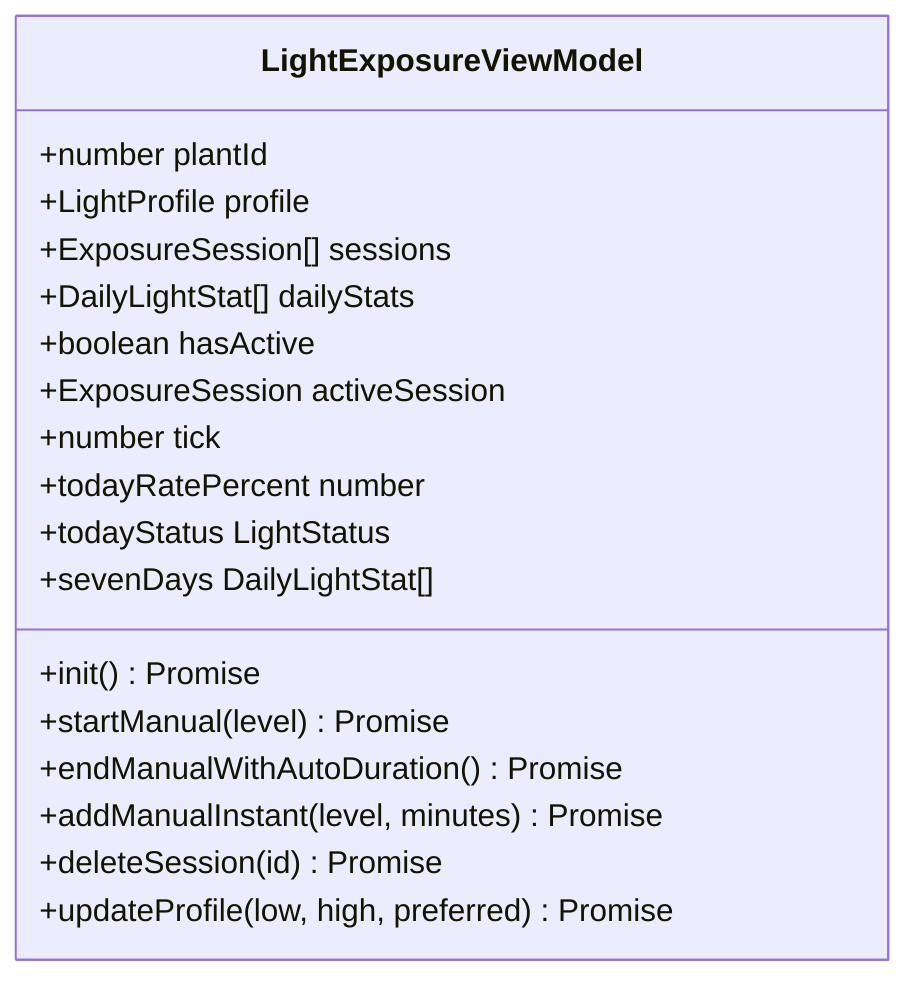
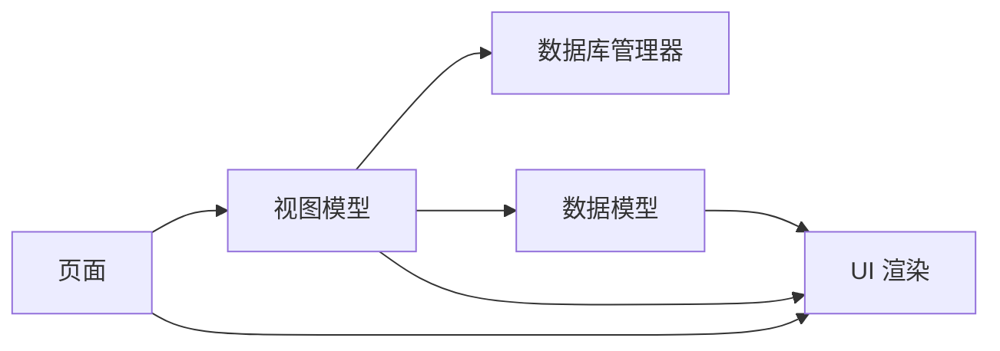

# 状态管理模式

<cite>
**本文引用的文件**
- [PROJECT_GUIDE.md](file://PROJECT_GUIDE.md)
- [CODE_ANNOTATIONS.md](file://CODE_ANNOTATIONS.md)
- [PlantModel.ets](file://entry/src/main/ets/model/PlantModel.ets)
- [LightExposureViewModel.ets](file://entry/src/main/ets/viewmodel/LightExposureViewModel.ets)
- [WaterEstimatorViewModel.ets](file://entry/src/main/ets/viewmodel/WaterEstimatorViewModel.ets)
- [EnvSimulatorViewModel.ets](file://entry/src/main/ets/viewmodel/EnvSimulatorViewModel.ets)
- [WateringViewModel.ets](file://entry/src/main/ets/viewmodel/WateringViewModel.ets)
- [MixPlannerViewModel.ets](file://entry/src/main/ets/viewmodel/MixPlannerViewModel.ets)
- [GrowthCompareViewModel.ets](file://entry/src/main/ets/viewmodel/GrowthCompareViewModel.ets)
- [RdbManager.ets](file://entry/src/main/ets/viewmodel/RdbManager.ets)
- [Index.ets](file://entry/src/main/ets/pages/Index.ets)
- [LightExposurePage.ets](file://entry/src/main/ets/pages/LightExposurePage.ets)
- [MixPlannerPage.ets](file://entry/src/main/ets/pages/MixPlannerPage.ets)
</cite>

## 目录
1. [简介](#简介)
2. [项目结构](#项目结构)
3. [核心组件](#核心组件)
4. [架构总览](#架构总览)
5. [详细组件分析](#详细组件分析)
6. [依赖分析](#依赖分析)
7. [性能考量](#性能考量)
8. [故障排查指南](#故障排查指南)
9. [结论](#结论)
10. [附录](#附录)

## 简介
本文件系统化梳理植物日记项目在 ArkTS 中的状态管理模式，围绕状态装饰器与响应式机制展开，覆盖全局状态、局部状态与跨组件共享的设计与实现，同时给出持久化、恢复与同步的技术要点及最佳实践。

## 项目结构
- 模型层（Model）：以轻量数据结构为主，使用类级装饰器开启响应式，属性级装饰器标注追踪字段，便于 UI 自动感知变更。
- 视图模型层（ViewModel）：封装业务逻辑、数据持久化与派生状态，统一对外暴露可观察状态，页面仅与 VM 交互。
- 页面层（Page）：通过状态装饰器承载局部 UI 状态，使用 @Local/@Param/@Require 等实现页面间状态共享与参数传递。
- 数据持久化：通过数据库管理器集中初始化与维护表结构、索引与默认数据，各 VM 负责具体读写。

**图表来源**
- [Index.ets:96-165](file://entry/src/main/ets/pages/Index.ets#L96-L165)
- [LightExposurePage.ets:1-200](file://entry/src/main/ets/pages/LightExposurePage.ets#L1-L200)
- [MixPlannerPage.ets:1-200](file://entry/src/main/ets/pages/MixPlannerPage.ets#L1-L200)
- [LightExposureViewModel.ets:1-554](file://entry/src/main/ets/viewmodel/LightExposureViewModel.ets#L1-L554)
- [RdbManager.ets:1-296](file://entry/src/main/ets/viewmodel/RdbManager.ets#L1-L296)
- [PlantModel.ets:1-166](file://entry/src/main/ets/model/PlantModel.ets#L1-L166)

**章节来源**
- [PROJECT_GUIDE.md:40-102](file://PROJECT_GUIDE.md#L40-L102)

## 核心组件
- 数据模型（Model）：统一使用类级装饰器开启响应式，属性使用属性级装饰器标注，保证字段变更能驱动 UI 更新。
- 视图模型（ViewModel）：集中处理业务逻辑、数据库读写、派生状态与计算，页面通过 VM 消费状态，降低页面复杂度。
- 页面（Page）：使用状态装饰器承载 UI 局部状态，通过 @Local/@Param/@Require 实现页面间共享与参数传递。

**章节来源**
- [PROJECT_GUIDE.md:40-102](file://PROJECT_GUIDE.md#L40-L102)
- [PlantModel.ets:1-166](file://entry/src/main/ets/model/PlantModel.ets#L1-L166)

## 架构总览
ArkTS 状态管理采用“模型-视图模型-页面”的分层架构：
- 模型层：轻量数据结构，具备响应式能力，便于在多页面与 VM 间共享。
- 视图模型层：封装业务与持久化，提供稳定的对外状态接口，页面只与 VM 交互。
- 页面层：以状态装饰器承载 UI 局部状态，通过参数与本地状态实现跨组件共享。

**图表来源**
- [LightExposureViewModel.ets:43-113](file://entry/src/main/ets/viewmodel/LightExposureViewModel.ets#L43-L113)
- [RdbManager.ets:27-170](file://entry/src/main/ets/viewmodel/RdbManager.ets#L27-L170)
- [PlantModel.ets:1-166](file://entry/src/main/ets/model/PlantModel.ets#L1-L166)

## 详细组件分析

### 状态装饰器与使用规范
- @State：组件内部状态，用于承载 UI 局部状态，如对话框选择、滑块值等。
  - 示例路径：[LightExposurePage.ets:17-80](file://entry/src/main/ets/pages/LightExposurePage.ets#L17-L80)
- @Prop：父组件向子组件传递只读数据。
  - 示例路径：页面与子组件间参数传递（页面层常见用法）
- @Link：子组件与父组件双向绑定，适合需要回传编辑态的场景。
  - 示例路径：页面与子组件间双向绑定（页面层常见用法）
- @Local：页面间共享状态，适合筛选器、图表数据等跨页面状态。
  - 示例路径：[Index.ets:96-111](file://entry/src/main/ets/pages/Index.ets#L96-L111)
- @Consumer：消费全局状态（如 AppStorage/全局 VM），用于跨页面共享。
  - 示例路径：页面层参数与状态消费（页面层常见用法）
- @ObservedV2：类级装饰器，使整个类具备响应式能力，字段变更自动触发 UI 更新。
  - 示例路径：[LightExposureViewModel.ets:16-36](file://entry/src/main/ets/viewmodel/LightExposureViewModel.ets#L16-L36)
- @Trace：属性级装饰器，标注需要追踪的字段，与 @ObservedV2 配合使用。
  - 示例路径：[LightExposureViewModel.ets:19-25](file://entry/src/main/ets/viewmodel/LightExposureViewModel.ets#L19-L25)

**章节来源**
- [PROJECT_GUIDE.md:71-82](file://PROJECT_GUIDE.md#L71-L82)
- [LightExposurePage.ets:17-80](file://entry/src/main/ets/pages/LightExposurePage.ets#L17-L80)
- [Index.ets:96-111](file://entry/src/main/ets/pages/Index.ets#L96-L111)
- [LightExposureViewModel.ets:16-36](file://entry/src/main/ets/viewmodel/LightExposureViewModel.ets#L16-L36)

### 响应式数据绑定与传播机制
- 类级装饰器开启响应式：VM/Model 使用类级装饰器后，其字段变更会触发 UI 侧的响应式更新。
- 属性级装饰器标注追踪字段：仅对标注字段进行追踪，减少不必要的更新。
- 派生状态与计算：VM 内部通过 getter 或计算方法生成派生状态，页面直接消费，避免重复计算。
- UI 刷新驱动：通过定时器或状态变更驱动 UI 刷新，确保实时性与一致性。

**图表来源**
- [LightExposureViewModel.ets:16-36](file://entry/src/main/ets/viewmodel/LightExposureViewModel.ets#L16-L36)
- [PlantModel.ets:6-21](file://entry/src/main/ets/model/PlantModel.ets#L6-L21)

**章节来源**
- [LightExposureViewModel.ets:16-36](file://entry/src/main/ets/viewmodel/LightExposureViewModel.ets#L16-L36)
- [PlantModel.ets:6-21](file://entry/src/main/ets/model/PlantModel.ets#L6-L21)

### 全局状态管理、局部状态控制与跨组件共享
- 全局状态：通过页面层的 @Local/@Param/@Require 实现跨页面共享，如筛选器、图表数据、模板列表等。
  - 示例路径：[Index.ets:96-111](file://entry/src/main/ets/pages/Index.ets#L96-L111)
- 局部状态：页面内使用 @State 承载对话框、滑块等局部 UI 状态。
  - 示例路径：[LightExposurePage.ets:17-80](file://entry/src/main/ets/pages/LightExposurePage.ets#L17-L80)
- 跨组件共享：通过 VM 暴露统一状态，页面间共享 VM 实例或通过参数传递 VM 引用。
  - 示例路径：[MixPlannerPage.ets:40-90](file://entry/src/main/ets/pages/MixPlannerPage.ets#L40-L90)

**章节来源**
- [Index.ets:96-111](file://entry/src/main/ets/pages/Index.ets#L96-L111)
- [LightExposurePage.ets:17-80](file://entry/src/main/ets/pages/LightExposurePage.ets#L17-L80)
- [MixPlannerPage.ets:40-90](file://entry/src/main/ets/pages/MixPlannerPage.ets#L40-L90)

### 状态持久化、状态恢复与状态同步
- 持久化：VM 通过数据库管理器执行查询/写入，保证状态落地。
  - 示例路径：[LightExposureViewModel.ets:43-113](file://entry/src/main/ets/viewmodel/LightExposureViewModel.ets#L43-L113)
- 状态恢复：页面启动时初始化数据库并加载全局数据，确保状态一致性。
  - 示例路径：[Index.ets:128-141](file://entry/src/main/ets/pages/Index.ets#L128-L141)
- 状态同步：页面与 VM 之间通过响应式更新同步，VM 与数据库之间通过事务/查询同步。
  - 示例路径：[RdbManager.ets:27-170](file://entry/src/main/ets/viewmodel/RdbManager.ets#L27-L170)

**章节来源**
- [LightExposureViewModel.ets:43-113](file://entry/src/main/ets/viewmodel/LightExposureViewModel.ets#L43-L113)
- [Index.ets:128-141](file://entry/src/main/ets/pages/Index.ets#L128-L141)
- [RdbManager.ets:27-170](file://entry/src/main/ets/viewmodel/RdbManager.ets#L27-L170)

### 具体组件与状态装饰器应用

#### 光照记录视图模型（LightExposureViewModel）
- 职责：管理光照会话、统计计算、目标配置与数据库交互。
- 关键状态：植物 ID、光照配置、会话列表、每日统计、进行中状态、时钟信号。
- 响应式：类级装饰器开启响应式，属性级装饰器标注追踪字段，getter 生成派生状态。
- 数据持久化：初始化时加载配置与会话，结束会话时写入数据库并更新统计。

**图表来源**
- [LightExposureViewModel.ets:16-554](file://entry/src/main/ets/viewmodel/LightExposureViewModel.ets#L16-L554)

**章节来源**
- [LightExposureViewModel.ets:16-554](file://entry/src/main/ets/viewmodel/LightExposureViewModel.ets#L16-L554)

#### 浇水估算视图模型（WaterEstimatorViewModel）
- 职责：根据盆径、深度、介质等计算用水量，保存估算记录。
- 关键状态：植物 ID、输入参数、计算结果、历史记录。
- 响应式：类级装饰器开启响应式，属性级装饰器标注追踪字段。

**章节来源**
- [WaterEstimatorViewModel.ets:16-37](file://entry/src/main/ets/viewmodel/WaterEstimatorViewModel.ets#L16-L37)

#### 环境模拟器视图模型（EnvSimulatorViewModel）
- 职责：管理光照、土壤湿度、空气湿度参数，提供派生展示状态与快照导出。
- 关键状态：植物 ID、三个主参数、最后快照、动画状态。
- 响应式：类级装饰器开启响应式，参数变化驱动派生状态刷新。

**章节来源**
- [EnvSimulatorViewModel.ets:10-50](file://entry/src/main/ets/viewmodel/EnvSimulatorViewModel.ets#L10-L50)

#### 浇水视图模型（WateringViewModel）
- 职责：管理浇水动画状态、历史（内存）、连胜天数逻辑、生成记录。
- 关键状态：植物 ID、动画与交互态、模式、默认量、最近时间、连胜天数。
- 响应式：类级装饰器开启响应式，记录时仅更新内存态，持久化由上层决定。

**章节来源**
- [WateringViewModel.ets:11-102](file://entry/src/main/ets/viewmodel/WateringViewModel.ets#L11-L102)

#### 配土计划视图模型（MixPlannerViewModel）
- 职责：内置/我的配方选择、材料编辑、总量设定、计算体积/重量、保存配方与记录。
- 关键状态：配方名称、材料列表、总量、内置与我的配方、历史调配记录。
- 响应式：类级装饰器开启响应式，计算结果直接用于渲染。

**章节来源**
- [MixPlannerViewModel.ets:17-228](file://entry/src/main/ets/viewmodel/MixPlannerViewModel.ets#L17-L228)

#### 生长对比视图模型（GrowthCompareViewModel）
- 职责：前后对比工作区管理、对齐参数、保存对比卡。
- 关键状态：前后图 URI、备注、分割比例、缩放、偏移、网格开关、对齐模式、已保存对比卡。
- 响应式：类级装饰器开启响应式，保存时固化图片关系与备注。

**章节来源**
- [GrowthCompareViewModel.ets:12-109](file://entry/src/main/ets/viewmodel/GrowthCompareViewModel.ets#L12-L109)

### 页面与状态装饰器的实际应用

#### 光照记录页面（LightExposurePage）
- 使用 @State 承载对话框内部状态（光照强度、时长等）。
- 通过 VM 方法触发会话开始/结束/补记，页面仅负责 UI 交互。

**章节来源**
- [LightExposurePage.ets:17-80](file://entry/src/main/ets/pages/LightExposurePage.ets#L17-L80)

#### 配土计划页面（MixPlannerPage）
- 使用 @Local 承载页面间共享状态（植物 ID、VM 实例）。
- 通过 VM 的计算结果直接渲染，避免在 UI 中重复计算。

**章节来源**
- [MixPlannerPage.ets:40-90](file://entry/src/main/ets/pages/MixPlannerPage.ets#L40-L90)

#### 首页（Index）
- 使用 @Local 承载筛选器、排序、图表可见性等跨页面状态。
- 初始化数据库并加载全局数据，确保状态一致性。

**章节来源**
- [Index.ets:96-165](file://entry/src/main/ets/pages/Index.ets#L96-L165)

## 依赖分析
- VM 与数据库：VM 通过数据库管理器进行查询/写入，保证状态持久化。
- VM 与模型：VM 构造/更新模型实例，模型具备响应式能力，驱动 UI 更新。
- 页面与 VM：页面通过 VM 消费状态，避免直接访问数据库或模型。

**图表来源**
- [LightExposureViewModel.ets:16-554](file://entry/src/main/ets/viewmodel/LightExposureViewModel.ets#L16-L554)
- [RdbManager.ets:1-296](file://entry/src/main/ets/viewmodel/RdbManager.ets#L1-L296)
- [PlantModel.ets:1-166](file://entry/src/main/ets/model/PlantModel.ets#L1-L166)

**章节来源**
- [LightExposureViewModel.ets:16-554](file://entry/src/main/ets/viewmodel/LightExposureViewModel.ets#L16-L554)
- [RdbManager.ets:1-296](file://entry/src/main/ets/viewmodel/RdbManager.ets#L1-L296)
- [PlantModel.ets:1-166](file://entry/src/main/ets/model/PlantModel.ets#L1-L166)

## 性能考量
- 减少不必要的响应式更新：仅对必要字段使用属性级装饰器，避免过度追踪。
- 派生状态缓存：对计算密集型派生状态进行缓存，避免重复计算。
- 数据库访问优化：批量查询/写入，合理使用索引，避免全表扫描。
- UI 刷新频率控制：通过时钟信号或定时器控制刷新频率，避免频繁重绘。

[本节为通用指导，无需特定文件引用]

## 故障排查指南
- 数据库初始化失败：检查数据库管理器初始化流程与权限配置。
  - 参考路径：[RdbManager.ets:27-170](file://entry/src/main/ets/viewmodel/RdbManager.ets#L27-L170)
- 光照会话异常：检查进行中会话数量与结束逻辑，确保只有一个进行中会话。
  - 参考路径：[LightExposureViewModel.ets:92-109](file://entry/src/main/ets/viewmodel/LightExposureViewModel.ets#L92-L109)
- 状态不一致：确认页面与 VM 的状态同步机制，确保 UI 与 VM 一致。
  - 参考路径：[Index.ets:128-141](file://entry/src/main/ets/pages/Index.ets#L128-L141)

**章节来源**
- [RdbManager.ets:27-170](file://entry/src/main/ets/viewmodel/RdbManager.ets#L27-L170)
- [LightExposureViewModel.ets:92-109](file://entry/src/main/ets/viewmodel/LightExposureViewModel.ets#L92-L109)
- [Index.ets:128-141](file://entry/src/main/ets/pages/Index.ets#L128-L141)

## 结论
植物日记项目在 ArkTS 中采用清晰的分层架构与状态装饰器体系，通过模型-视图模型-页面的职责分离，实现了良好的可维护性与可扩展性。配合响应式机制与数据库持久化，项目在状态管理方面具备较高的稳定性与性能表现。

[本节为总结性内容，无需特定文件引用]

## 附录
- 状态装饰器速查
  - @State：组件内部状态
  - @Prop/@Link：父子组件数据传递
  - @Local：页面间共享状态
  - @Consumer：消费全局状态
  - @ObservedV2：类级响应式
  - @Trace：属性级响应式

**章节来源**
- [PROJECT_GUIDE.md:71-82](file://PROJECT_GUIDE.md#L71-L82)