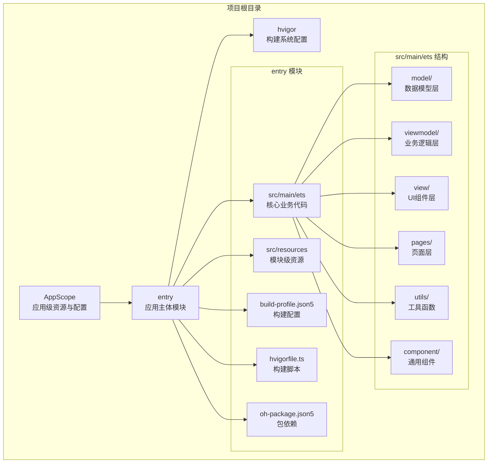
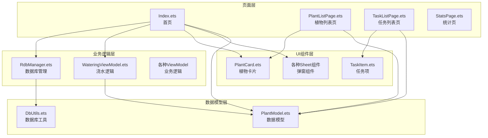
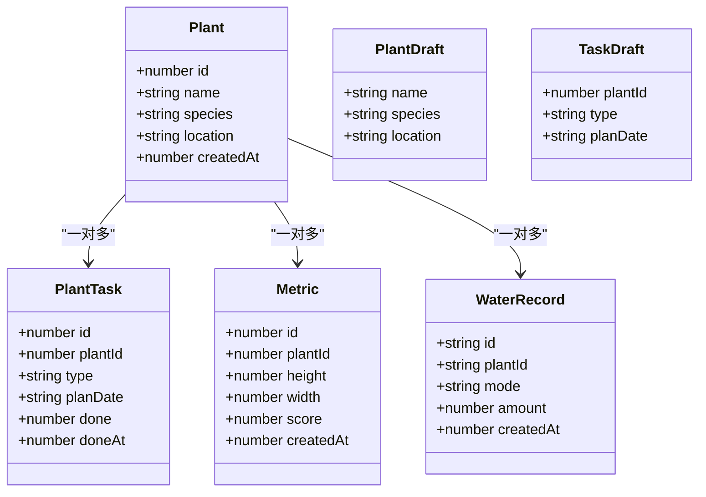
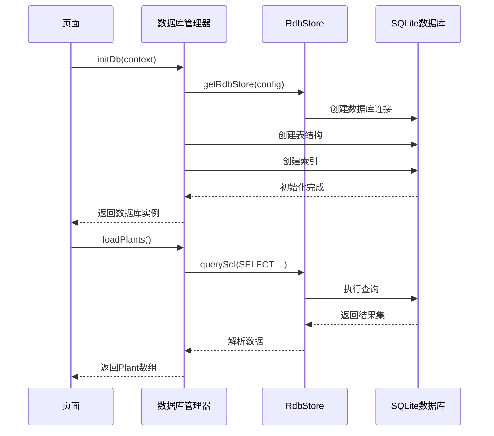

# 目录结构设计

<cite>
**本文档引用的文件**
- [AppScope/app.json5](file://AppScope/app.json5)
- [entry/build-profile.json5](file://entry/build-profile.json5)
- [hvigorfile.ts](file://hvigorfile.ts)
- [entry/hvigorfile.ts](file://entry/hvigorfile.ts)
- [entry/src/main/ets/model/PlantModel.ets](file://entry/src/main/ets/model/PlantModel.ets)
- [entry/src/main/ets/viewmodel/RdbManager.ets](file://entry/src/main/ets/viewmodel/RdbManager.ets)
- [entry/src/main/ets/viewmodel/WateringViewModel.ets](file://entry/src/main/ets/viewmodel/WateringViewModel.ets)
- [entry/src/main/ets/view/PlantCard.ets](file://entry/src/main/ets/view/PlantCard.ets)
- [entry/src/main/ets/pages/Index.ets](file://entry/src/main/ets/pages/Index.ets)
- [entry/src/main/ets/pages/PlantListPage.ets](file://entry/src/main/ets/pages/PlantListPage.ets)
- [entry/src/main/ets/pages/TaskListPage.ets](file://entry/src/main/ets/pages/TaskListPage.ets)
- [entry/src/main/ets/pages/StatsPage.ets](file://entry/src/main/ets/pages/StatsPage.ets)
- [entry/src/main/ets/model/DbUtils.ets](file://entry/src/main/ets/model/DbUtils.ets)
</cite>

## 目录结构总览

植物日记项目采用基于 ArkTS 的分布式应用架构，整体目录结构遵循“模块化 + 分层”的设计原则。项目主要包含以下顶级目录：

- **AppScope**：应用级资源与配置，提供全局共享的资源定义和应用元信息
- **entry**：应用主体模块，包含业务实现、资源、测试等完整模块内容
- **hvigor**：构建系统配置目录，提供构建工具的全局配置

**图表来源**
- [AppScope/app.json5:1-11](file://AppScope/app.json5#L1-L11)
- [entry/build-profile.json5:1-33](file://entry/build-profile.json5#L1-L33)
- [hvigorfile.ts:1-6](file://hvigorfile.ts#L1-L6)

## 目录命名规范与文件分类标准

### 顶级目录职责定位

**AppScope 目录**
- **作用**：存放应用级共享资源和配置，提供全局可用的资源定义
- **文件组织**：
  - `resources/base/element/string.json`：基础字符串资源
  - `resources/base/media/layered_image.json`：应用图标等媒体资源
  - `app.json5`：应用元信息配置，包含 bundleName、版本号等

**entry 目录**
- **作用**：应用主体模块，包含完整的业务实现和资源
- **文件组织**：
  - `.preview/`：预览构建相关配置
  - `src/main/ets/`：ArkTS 主要业务代码
  - `src/resources/`：模块级资源文件
  - `build-profile.json5`：模块构建配置
  - `hvigorfile.ts`：模块构建脚本

### 四层架构设计

项目采用经典的四层架构模式，每层都有明确的职责边界：

#### model/ 数据模型层
- **职责**：定义轻量级数据结构，作为页面、弹层和数据库之间的共享载体
- **特点**：仅保留字段和少量构造逻辑，复杂业务规则放在其他层处理
- **典型文件**：PlantModel.ets、DbUtils.ets

#### viewmodel/ 业务逻辑层  
- **职责**：封装复杂的业务逻辑，管理状态和交互行为
- **特点**：使用 @ObservedV2 注解实现响应式更新
- **典型文件**：RdbManager.ets、WateringViewModel.ets

#### view/ UI组件层
- **职责**：实现可复用的UI组件，专注于界面展示和用户交互
- **特点**：使用 @ComponentV2 注解，支持事件传递和状态管理
- **典型文件**：PlantCard.ets、各种 Sheet 组件

#### pages/ 页面层
- **职责**：组织页面逻辑，协调多个组件完成特定业务场景
- **特点**：包含完整的页面生命周期管理和状态控制
- **典型文件**：Index.ets、PlantListPage.ets、TaskListPage.ets

**章节来源**
- [entry/src/main/ets/model/PlantModel.ets:1-166](file://entry/src/main/ets/model/PlantModel.ets#L1-L166)
- [entry/src/main/ets/viewmodel/RdbManager.ets:1-296](file://entry/src/main/ets/viewmodel/RdbManager.ets#L1-L296)
- [entry/src/main/ets/view/PlantCard.ets:1-326](file://entry/src/main/ets/view/PlantCard.ets#L1-L326)
- [entry/src/main/ets/pages/Index.ets:1-800](file://entry/src/main/ets/pages/Index.ets#L1-L800)

## 模块划分策略与依赖关系

### 模块间依赖关系

**图表来源**
- [entry/src/main/ets/pages/Index.ets:1-800](file://entry/src/main/ets/pages/Index.ets#L1-L800)
- [entry/src/main/ets/viewmodel/RdbManager.ets:1-296](file://entry/src/main/ets/viewmodel/RdbManager.ets#L1-L296)
- [entry/src/main/ets/view/PlantCard.ets:1-326](file://entry/src/main/ets/view/PlantCard.ets#L1-L326)

### 导入导出规则

1. **层级依赖**：页面层 → 业务逻辑层 → UI组件层 → 数据模型层
2. **单向依赖**：不允许反向依赖，避免循环引用
3. **接口抽象**：通过接口定义契约，降低耦合度
4. **事件驱动**：组件间通信主要通过事件传递

### 资源共享机制

- **Provider/Consumer**：通过 Provider 注入全局服务，Consumer 获取所需资源
- **AppStorage**：用于跨组件的状态共享和持久化
- **单例模式**：数据库管理器等服务采用单例模式确保资源一致性

**章节来源**
- [entry/src/main/ets/pages/Index.ets:39-85](file://entry/src/main/ets/pages/Index.ets#L39-L85)
- [entry/src/main/ets/view/PlantCard.ets:23-24](file://entry/src/main/ets/view/PlantCard.ets#L23-L24)

## 数据流与处理逻辑

### 数据模型设计

**图表来源**
- [entry/src/main/ets/model/PlantModel.ets:7-147](file://entry/src/main/ets/model/PlantModel.ets#L7-L147)

### 数据库管理流程

**图表来源**
- [entry/src/main/ets/viewmodel/RdbManager.ets:27-170](file://entry/src/main/ets/viewmodel/RdbManager.ets#L27-L170)
- [entry/src/main/ets/pages/Index.ets:129-159](file://entry/src/main/ets/pages/Index.ets#L129-L159)

## 性能考虑与优化建议

### 架构性能特性

1. **响应式更新**：使用 @ObservedV2 注解实现细粒度状态更新，减少不必要的重渲染
2. **懒加载策略**：页面按需加载数据，避免一次性加载大量数据
3. **索引优化**：数据库建立复合索引，提升查询性能
4. **事务处理**：批量操作使用事务保证数据一致性

### 优化建议

1. **数据缓存**：在 ViewModel 层实现数据缓存机制
2. **虚拟列表**：对于大量数据的列表使用虚拟滚动
3. **异步加载**：图片等资源采用异步加载和懒加载
4. **内存管理**：及时释放不再使用的资源引用

## 故障排查指南

### 常见问题与解决方案

**数据库初始化失败**
- 检查数据库权限配置
- 验证表结构创建语句
- 确认索引创建是否成功

**页面数据不一致**
- 检查 Provider 注入是否正确
- 验证状态更新时机
- 确认事件传递链路

**组件渲染异常**
- 检查 @Param 参数传递
- 验证 @Event 事件绑定
- 确认 @Local 状态管理

**章节来源**
- [entry/src/main/ets/pages/Index.ets:116-125](file://entry/src/main/ets/pages/Index.ets#L116-L125)
- [entry/src/main/ets/viewmodel/RdbManager.ets:173-276](file://entry/src/main/ets/viewmodel/RdbManager.ets#L173-L276)

## 结论

植物日记项目的目录结构设计体现了清晰的分层架构和模块化原则。通过合理的目录划分、严格的依赖管理和完善的资源共享机制，实现了代码的高内聚、低耦合。四层架构的设计使得业务逻辑、数据处理和界面展示相互独立，便于维护和扩展。同时，通过 Provider/Consumer 模式的使用和单例服务的设计，确保了应用的整体性和一致性。