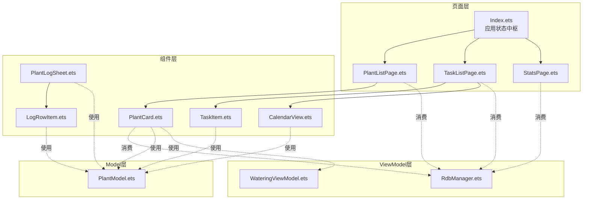
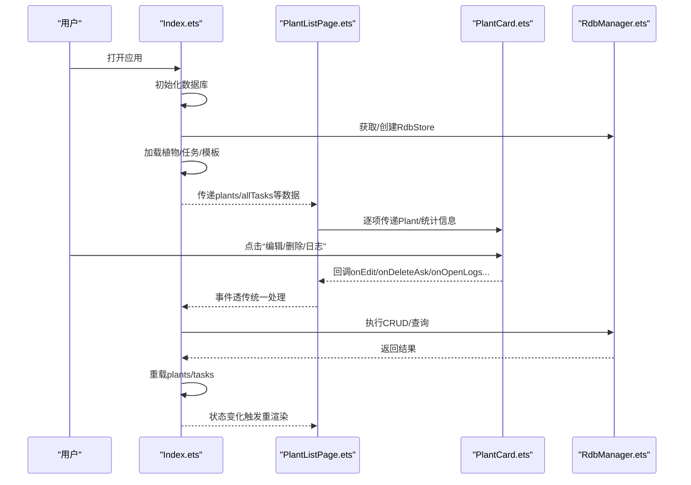
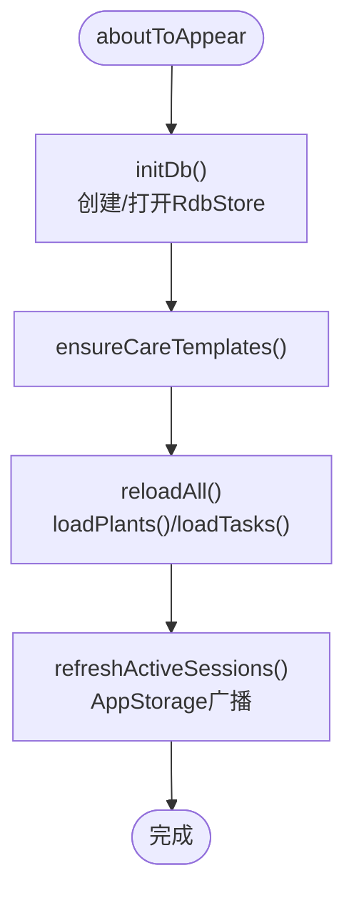
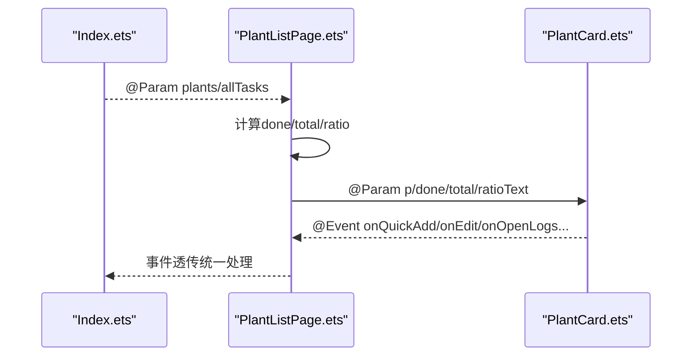
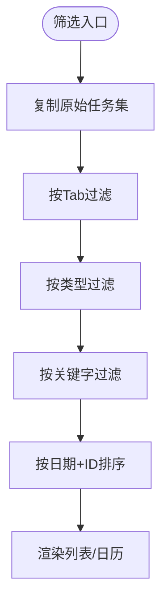
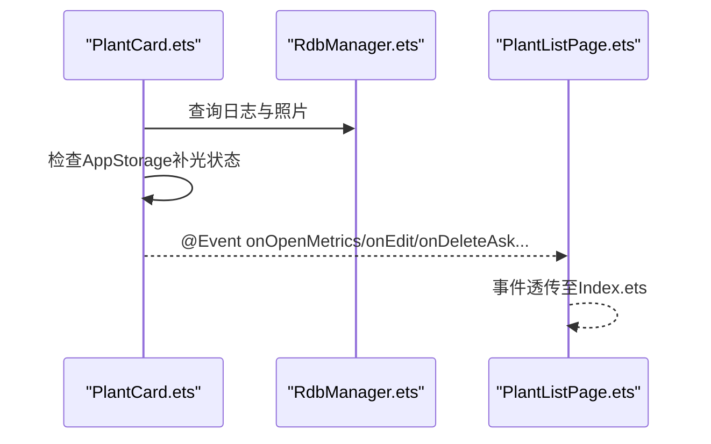
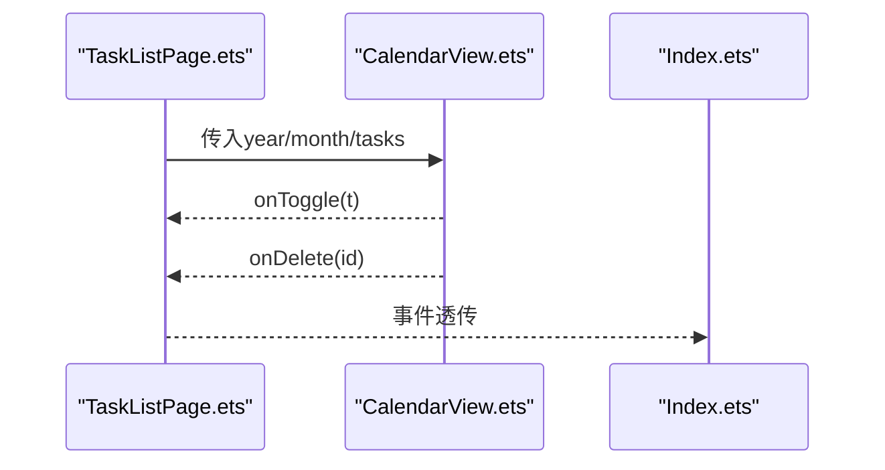
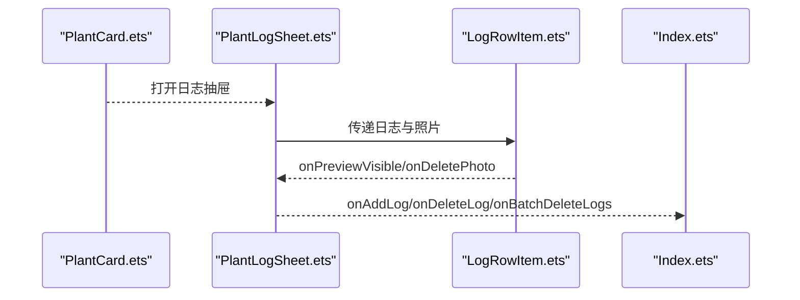
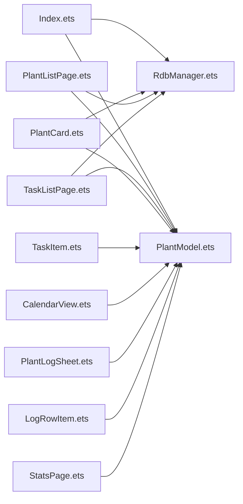

# 组件交互关系

<cite>
**本文引用的文件**
- [Index.ets](file://entry/src/main/ets/pages/Index.ets)
- [PlantListPage.ets](file://entry/src/main/ets/pages/PlantListPage.ets)
- [TaskListPage.ets](file://entry/src/main/ets/pages/TaskListPage.ets)
- [StatsPage.ets](file://entry/src/main/ets/pages/StatsPage.ets)
- [PlantCard.ets](file://entry/src/main/ets/view/PlantCard.ets)
- [TaskItem.ets](file://entry/src/main/ets/view/TaskItem.ets)
- [CalendarView.ets](file://entry/src/main/ets/view/CalendarView.ets)
- [PlantLogSheet.ets](file://entry/src/main/ets/view/PlantLogSheet.ets)
- [LogRowItem.ets](file://entry/src/main/ets/view/LogRowItem.ets)
- [RdbManager.ets](file://entry/src/main/ets/viewmodel/RdbManager.ets)
- [WateringViewModel.ets](file://entry/src/main/ets/viewmodel/WateringViewModel.ets)
- [PlantModel.ets](file://entry/src/main/ets/model/PlantModel.ets)
</cite>

## 目录
1. [简介](#简介)
2. [项目结构](#项目结构)
3. [核心组件](#核心组件)
4. [架构总览](#架构总览)
5. [详细组件分析](#详细组件分析)
6. [依赖分析](#依赖分析)
7. [性能考量](#性能考量)
8. [故障排查指南](#故障排查指南)
9. [结论](#结论)
10. [附录](#附录)

## 简介
本文件聚焦“植物日记”项目的组件交互关系，系统梳理页面层、组件层与ViewModel层之间的交互模式与数据流，涵盖：
- 页面与组件间的数据传递（@Param/@Require/@BuilderParam）
- 事件回调（@Event）与父子通信
- 生命周期管理与状态传递策略
- 组件复用、插槽与组合模式
- 从用户交互到数据更新的完整调用链路与数据流向
- 解耦设计、依赖注入与模块化最佳实践

## 项目结构
项目采用“页面层 + 组件层 + ViewModel层 + Model层”的分层组织，页面作为状态中枢，组件以轻量展示与事件回调为主，ViewModel负责可观测状态与业务逻辑，Model承载数据结构。

**图表来源**
- [Index.ets:1-1382](file://entry/src/main/ets/pages/Index.ets#L1-L1382)
- [PlantListPage.ets:1-228](file://entry/src/main/ets/pages/PlantListPage.ets#L1-L228)
- [TaskListPage.ets:1-463](file://entry/src/main/ets/pages/TaskListPage.ets#L1-L463)
- [StatsPage.ets:1-442](file://entry/src/main/ets/pages/StatsPage.ets#L1-L442)
- [PlantCard.ets:1-326](file://entry/src/main/ets/view/PlantCard.ets#L1-L326)
- [TaskItem.ets:1-67](file://entry/src/main/ets/view/TaskItem.ets#L1-L67)
- [CalendarView.ets:1-566](file://entry/src/main/ets/view/CalendarView.ets#L1-L566)
- [PlantLogSheet.ets:1-384](file://entry/src/main/ets/view/PlantLogSheet.ets#L1-L384)
- [LogRowItem.ets:1-272](file://entry/src/main/ets/view/LogRowItem.ets#L1-L272)
- [RdbManager.ets:1-296](file://entry/src/main/ets/viewmodel/RdbManager.ets#L1-L296)
- [WateringViewModel.ets:1-102](file://entry/src/main/ets/viewmodel/WateringViewModel.ets#L1-L102)
- [PlantModel.ets:1-166](file://entry/src/main/ets/model/PlantModel.ets#L1-L166)

**章节来源**
- [Index.ets:1-1382](file://entry/src/main/ets/pages/Index.ets#L1-L1382)
- [PlantListPage.ets:1-228](file://entry/src/main/ets/pages/PlantListPage.ets#L1-L228)
- [TaskListPage.ets:1-463](file://entry/src/main/ets/pages/TaskListPage.ets#L1-L463)
- [StatsPage.ets:1-442](file://entry/src/main/ets/pages/StatsPage.ets#L1-L442)

## 核心组件
- 页面中枢（Index.ets）：集中管理数据库连接、全局状态、重载与模板加载，作为各页面共享的数据源与上下文提供者。
- 列表页面（PlantListPage.ets、TaskListPage.ets）：负责筛选、排序与事件透传，将计算后的数据与事件回调传递给子组件。
- 展示组件（PlantCard.ets、TaskItem.ets、CalendarView.ets、PlantLogSheet.ets、LogRowItem.ets）：承担轻量展示与交互，通过@Event向上游回调。
- ViewModel（RdbManager.ets、WateringViewModel.ets）：提供数据库访问与可观察状态，支持组件与页面解耦。
- Model（PlantModel.ets）：定义轻量数据结构，约束字段与追踪变更。

**章节来源**
- [Index.ets:1-1382](file://entry/src/main/ets/pages/Index.ets#L1-L1382)
- [PlantListPage.ets:1-228](file://entry/src/main/ets/pages/PlantListPage.ets#L1-L228)
- [TaskListPage.ets:1-463](file://entry/src/main/ets/pages/TaskListPage.ets#L1-L463)
- [PlantCard.ets:1-326](file://entry/src/main/ets/view/PlantCard.ets#L1-L326)
- [TaskItem.ets:1-67](file://entry/src/main/ets/view/TaskItem.ets#L1-L67)
- [CalendarView.ets:1-566](file://entry/src/main/ets/view/CalendarView.ets#L1-L566)
- [PlantLogSheet.ets:1-384](file://entry/src/main/ets/view/PlantLogSheet.ets#L1-L384)
- [LogRowItem.ets:1-272](file://entry/src/main/ets/view/LogRowItem.ets#L1-L272)
- [RdbManager.ets:1-296](file://entry/src/main/ets/viewmodel/RdbManager.ets#L1-L296)
- [WateringViewModel.ets:1-102](file://entry/src/main/ets/viewmodel/WateringViewModel.ets#L1-L102)
- [PlantModel.ets:1-166](file://entry/src/main/ets/model/PlantModel.ets#L1-L166)

## 架构总览
页面层通过@Provider/@Consumer注入数据库与全局状态，组件层通过@Param/@Event接收数据与回调，ViewModel层封装数据访问与状态，Model层提供稳定的数据契约。页面中枢负责初始化与重载，确保全局一致性。

**图表来源**
- [Index.ets:116-141](file://entry/src/main/ets/pages/Index.ets#L116-L141)
- [Index.ets:143-184](file://entry/src/main/ets/pages/Index.ets#L143-L184)
- [PlantListPage.ets:154-182](file://entry/src/main/ets/pages/PlantListPage.ets#L154-L182)
- [PlantCard.ets:13-22](file://entry/src/main/ets/view/PlantCard.ets#L13-L22)
- [RdbManager.ets:27-170](file://entry/src/main/ets/viewmodel/RdbManager.ets#L27-L170)

## 详细组件分析

### 页面中枢（Index.ets）
- 职责
  - 初始化数据库与表结构，确保唯一索引与常用索引
  - 统一加载植物、任务、模板与指标数据
  - 提供@Provider注入RdbManager与RdbStore，以及@Local全局状态
  - 通过AppStorage广播光照会话状态，驱动卡片层即时反馈
- 关键交互
  - @Provider('RdbManager')与@Provider('store')向下提供依赖
  - @Local状态变化触发重渲染
  - 异步加载与错误提示（banner）

**图表来源**
- [Index.ets:116-141](file://entry/src/main/ets/pages/Index.ets#L116-L141)
- [Index.ets:129-135](file://entry/src/main/ets/pages/Index.ets#L129-L135)
- [Index.ets:138-141](file://entry/src/main/ets/pages/Index.ets#L138-L141)
- [Index.ets:162-168](file://entry/src/main/ets/pages/Index.ets#L162-L168)

**章节来源**
- [Index.ets:116-168](file://entry/src/main/ets/pages/Index.ets#L116-L168)
- [Index.ets:169-284](file://entry/src/main/ets/pages/Index.ets#L169-L284)
- [RdbManager.ets:27-170](file://entry/src/main/ets/viewmodel/RdbManager.ets#L27-L170)

### 植物列表页（PlantListPage.ets）
- 职责
  - 对全局任务进行本地筛选与排序，计算每株植物的完成数/总数/完成率
  - 通过Header BuilderParam复用统一头部（搜索/筛选）
  - 将计算结果与事件回调传递给PlantCard
- 交互要点
  - @Param @Require接收plants/allTasks
  - @Event透传编辑/删除/日志/指标/模板等操作
  - PlantCard仅负责展示与事件抛出，具体CRUD由上层处理

**图表来源**
- [PlantListPage.ets:6-24](file://entry/src/main/ets/pages/PlantListPage.ets#L6-L24)
- [PlantListPage.ets:27-58](file://entry/src/main/ets/pages/PlantListPage.ets#L27-L58)
- [PlantListPage.ets:154-182](file://entry/src/main/ets/pages/PlantListPage.ets#L154-L182)
- [PlantCard.ets:9-22](file://entry/src/main/ets/view/PlantCard.ets#L9-L22)

**章节来源**
- [PlantListPage.ets:1-228](file://entry/src/main/ets/pages/PlantListPage.ets#L1-L228)

### 任务列表页（TaskListPage.ets）
- 职责
  - 统一筛选：按“全部/今天/将来/已完成”与类型、关键字过滤
  - 统一排序：按计划日期与ID排序
  - 支持日视图（CalendarView）与列表视图切换
- 交互要点
  - @Param @Require接收tasks/plants
  - @Event透传切换完成状态、删除询问、创建任务
  - 与CalendarView共享筛选结果，保证一致性

**图表来源**
- [TaskListPage.ets:135-162](file://entry/src/main/ets/pages/TaskListPage.ets#L135-L162)
- [TaskListPage.ets:95-132](file://entry/src/main/ets/pages/TaskListPage.ets#L95-L132)

**章节来源**
- [TaskListPage.ets:1-463](file://entry/src/main/ets/pages/TaskListPage.ets#L1-L463)
- [CalendarView.ets:1-566](file://entry/src/main/ets/view/CalendarView.ets#L1-L566)

### 展示组件：PlantCard（.ets）
- 参数与事件
  - @Param @Require p/done/total/ratioText：接收植物与统计信息
  - @Event onQuickAdd/onEdit/onDeleteAsk/onOpenLogs/...：向上抛出操作请求
  - @Consumer('RdbManager')与@Consumer('store')：消费数据库依赖
- 生命周期与状态
  - aboutToAppear：加载最近日志与照片，检查补光状态
  - @Local pressed/pressed图标状态：提升交互反馈
- 交互流程
  - 点击“指标/编辑/删除/日志/模板/盆栽/用量估算器/快捷任务”触发对应事件
  - AppStorage广播补光状态，带动画呼吸效果

**图表来源**
- [PlantCard.ets:35-47](file://entry/src/main/ets/view/PlantCard.ets#L35-L47)
- [PlantCard.ets:80-111](file://entry/src/main/ets/view/PlantCard.ets#L80-L111)
- [PlantCard.ets:13-22](file://entry/src/main/ets/view/PlantCard.ets#L13-L22)

**章节来源**
- [PlantCard.ets:1-326](file://entry/src/main/ets/view/PlantCard.ets#L1-L326)

### 展示组件：TaskItem（.ets）
- 轻量展示组件，负责单条任务的勾选与删除
- 交互：点击勾选触发onToggle，点击删除触发onDeleteAsk
- 本地状态用于即时反馈，最终以父层重载为准

**章节来源**
- [TaskItem.ets:1-67](file://entry/src/main/ets/view/TaskItem.ets#L1-L67)

### 展示组件：CalendarView（.ets）
- 模式：抽屉（sheet）与内嵌两种模式
- 输入：@Param @Require year/month/tasks
- 输出：@Event onToggle/onDelete/onClose
- 交互：切换月份、选择日期、类型筛选、当日清单

**图表来源**
- [CalendarView.ets:7-17](file://entry/src/main/ets/view/CalendarView.ets#L7-L17)
- [CalendarView.ets:31-80](file://entry/src/main/ets/view/CalendarView.ets#L31-L80)

**章节来源**
- [CalendarView.ets:1-566](file://entry/src/main/ets/view/CalendarView.ets#L1-L566)

### 展示组件：PlantLogSheet（.ets）与LogRowItem（.ets）
- PlantLogSheet：日志抽屉，支持新增、排序、多选、预览与批量删除
- LogRowItem：单条日志行，支持高亮、长按进入多选、图片预览与删除
- 事件：onAddLog/onDeleteLog/onBatchDeleteLogs/onPickPhotos/onCapturePhoto/onDeletePhoto/onPreviewPhoto/onClose

**图表来源**
- [PlantLogSheet.ets:35-50](file://entry/src/main/ets/view/PlantLogSheet.ets#L35-L50)
- [LogRowItem.ets:136-134](file://entry/src/main/ets/view/LogRowItem.ets#L136-L134)

**章节来源**
- [PlantLogSheet.ets:1-384](file://entry/src/main/ets/view/PlantLogSheet.ets#L1-L384)
- [LogRowItem.ets:1-272](file://entry/src/main/ets/view/LogRowItem.ets#L1-L272)

### ViewModel：RdbManager（.ets）
- 单例管理数据库连接与建表
- 统一索引与种子数据初始化
- 提供活跃光照会话查询，供首页同步卡片状态

**章节来源**
- [RdbManager.ets:1-296](file://entry/src/main/ets/viewmodel/RdbManager.ets#L1-L296)

### ViewModel：WateringViewModel（.ets）
- 可观测状态：模式、默认量、最近浇水时间、连胜天数
- 动画控制：开始/停止动画
- 记录一次浇水：生成WaterRecord并更新内存态

**章节来源**
- [WateringViewModel.ets:1-102](file://entry/src/main/ets/viewmodel/WateringViewModel.ets#L1-L102)

### Model：PlantModel（.ets）
- 数据结构：Plant/PlanTpl/PlantTask/PlantDraft/TaskDraft/LogEntry/Metric/PlantMetric
- 使用@ObservedV2与@Trace，确保状态变更可追踪与响应

**章节来源**
- [PlantModel.ets:1-166](file://entry/src/main/ets/model/PlantModel.ets#L1-L166)

## 依赖分析
- 组件耦合
  - PlantCard与PlantListPage：强依赖（数据与事件）
  - CalendarView与TaskListPage：共享筛选结果，弱耦合
  - PlantLogSheet与LogRowItem：组合关系，事件逐层透传
- 依赖注入
  - Index.ets通过@Provider注入RdbManager与RdbStore
  - 组件通过@Consumer消费数据库依赖
- 循环依赖
  - 未发现循环依赖，页面→组件→ViewModel→Model单向依赖清晰

**图表来源**
- [Index.ets:44-46](file://entry/src/main/ets/pages/Index.ets#L44-L46)
- [PlantCard.ets:23-24](file://entry/src/main/ets/view/PlantCard.ets#L23-L24)
- [PlantListPage.ets:1-2](file://entry/src/main/ets/pages/PlantListPage.ets#L1-L2)
- [TaskListPage.ets:1-5](file://entry/src/main/ets/pages/TaskListPage.ets#L1-L5)
- [StatsPage.ets:6-8](file://entry/src/main/ets/pages/StatsPage.ets#L6-L8)

**章节来源**
- [Index.ets:44-46](file://entry/src/main/ets/pages/Index.ets#L44-L46)
- [PlantCard.ets:23-24](file://entry/src/main/ets/view/PlantCard.ets#L23-L24)

## 性能考量
- 数据加载
  - 首页一次性重载植物/任务，避免局部状态不一致与重复查询
  - 使用索引（任务唯一索引、日志/指标复合索引）优化查询
- 渲染优化
  - 组件尽量轻量，计算在父层完成，减少子组件重渲染
  - 使用@Local状态控制动画与触摸反馈，避免不必要的全局刷新
- 事务与批处理
  - 删除植物时使用事务，保证一致性与原子性
  - 批量生成周期任务时合并SQL执行

**章节来源**
- [Index.ets:138-141](file://entry/src/main/ets/pages/Index.ets#L138-L141)
- [RdbManager.ets:134-146](file://entry/src/main/ets/viewmodel/RdbManager.ets#L134-L146)
- [Index.ets:358-382](file://entry/src/main/ets/pages/Index.ets#L358-L382)

## 故障排查指南
- 数据库初始化失败
  - 检查RdbStore创建与表结构初始化日志
  - 确认权限与安全级别配置
- 任务重复
  - 检查唯一索引是否生效，避免重复插入
- 删除异常
  - 确认事务执行顺序与文件删除失败回滚
- 状态不一致
  - 确保通过Index.ets统一重载plants/tasks
  - 检查AppStorage广播的补光状态

**章节来源**
- [Index.ets:116-125](file://entry/src/main/ets/pages/Index.ets#L116-L125)
- [RdbManager.ets:134-146](file://entry/src/main/ets/viewmodel/RdbManager.ets#L134-L146)
- [Index.ets:358-402](file://entry/src/main/ets/pages/Index.ets#L358-L402)

## 结论
本项目通过页面中枢统一管理状态与数据源，组件层专注展示与事件回调，ViewModel层封装数据访问与可观测状态，形成清晰的分层与解耦。父子通信以@Param/@Event为主，配合@Provider/@Consumer实现依赖注入与模块化，整体具备良好的扩展性与维护性。

## 附录
- 组件复用与组合
  - PlantListPage通过@BuilderParam Header实现头部复用
  - CalendarView提供内嵌与抽屉两种包装，满足不同场景
- 最佳实践
  - 将复杂逻辑下沉到页面或ViewModel，组件保持轻量
  - 使用索引与事务提升性能与一致性
  - 通过AppStorage广播状态，降低组件间紧耦合