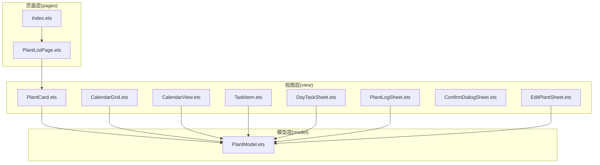
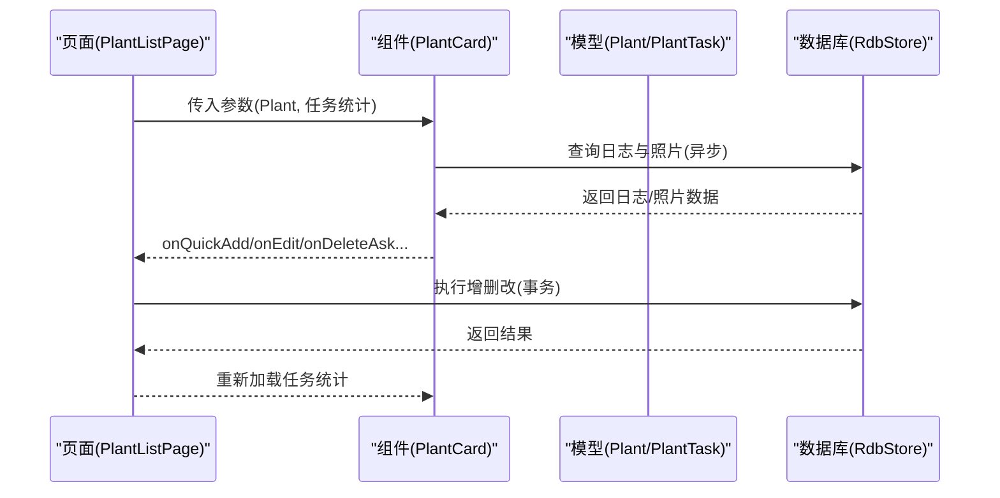
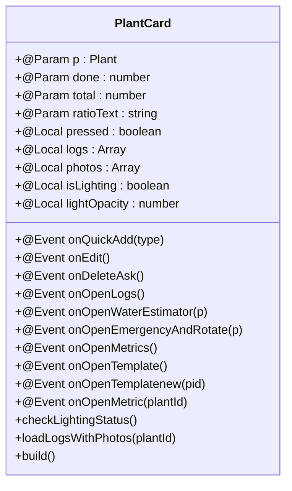
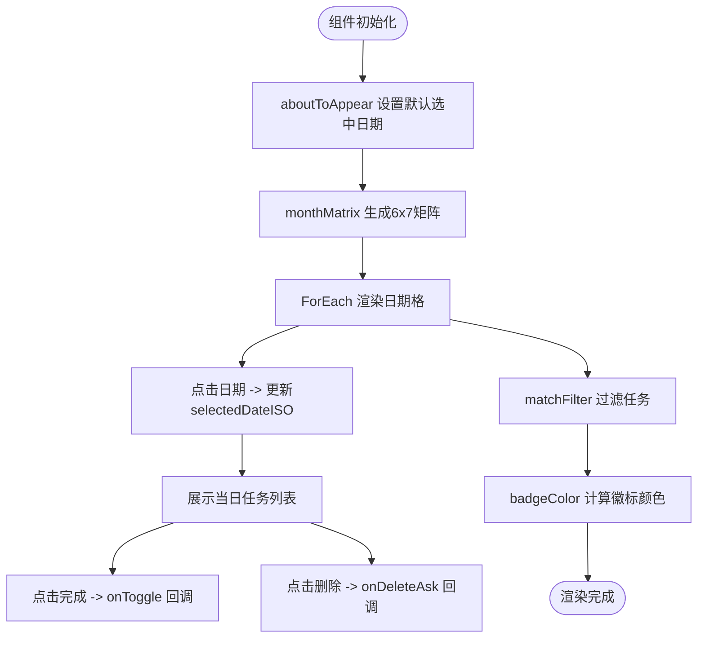
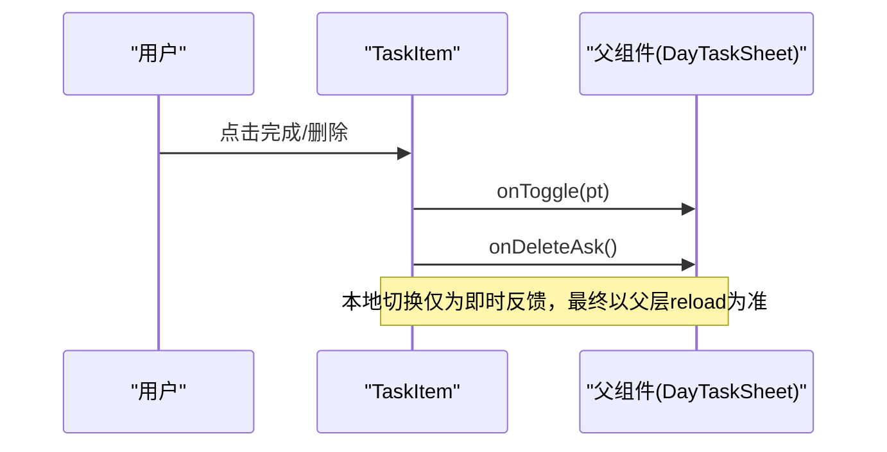
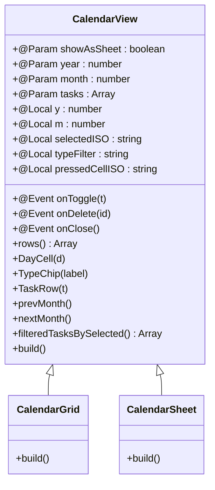
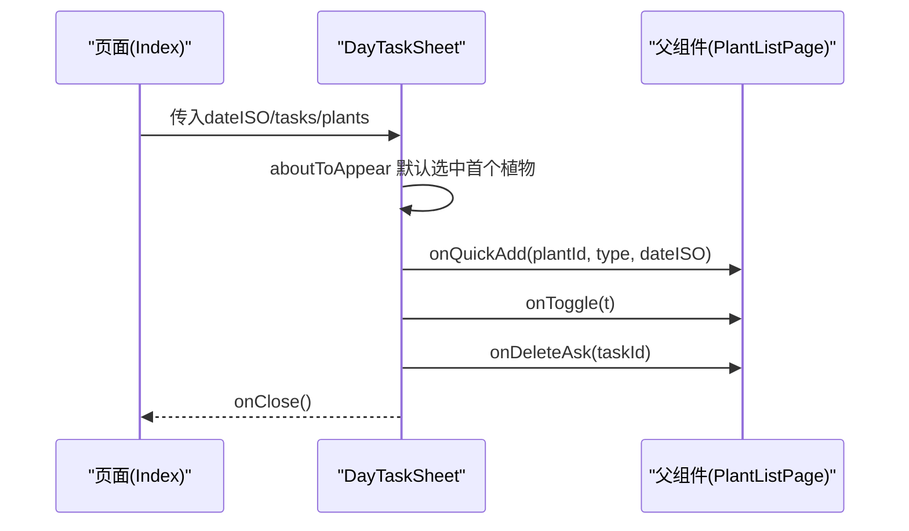
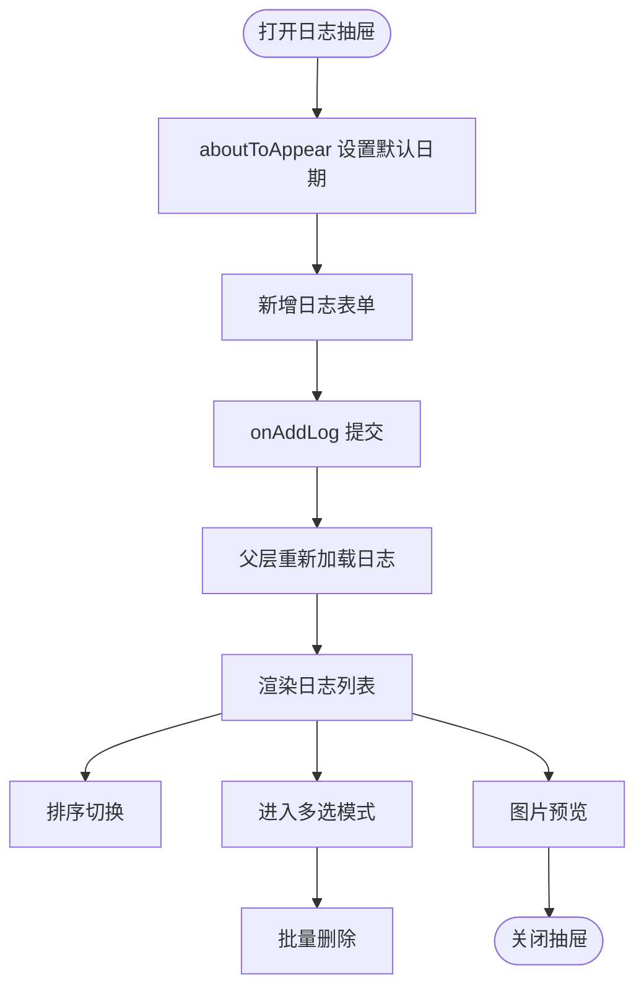
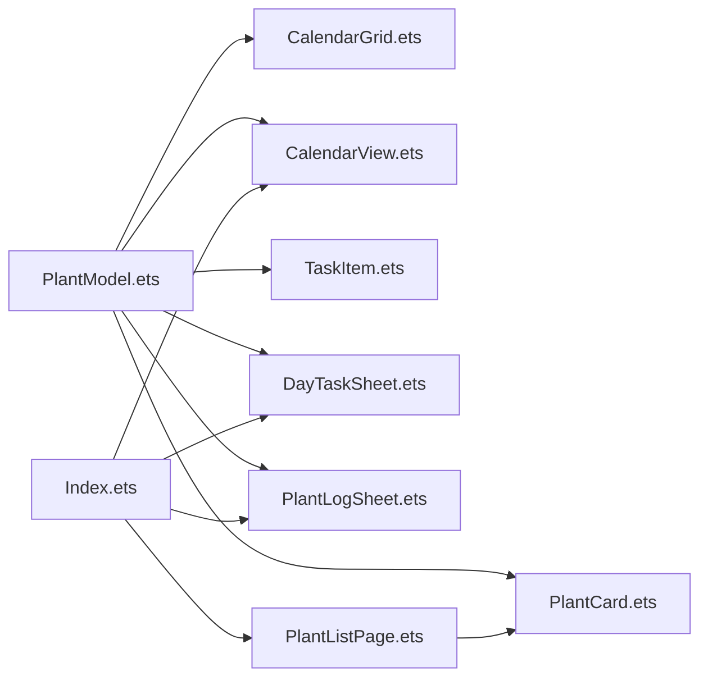

# UI组件层

<cite>
**本文档引用的文件**
- [PlantCard.ets](file://entry/src/main/ets/view/PlantCard.ets)
- [CalendarGrid.ets](file://entry/src/main/ets/view/CalendarGrid.ets)
- [TaskItem.ets](file://entry/src/main/ets/view/TaskItem.ets)
- [CalendarView.ets](file://entry/src/main/ets/view/CalendarView.ets)
- [DayTaskSheet.ets](file://entry/src/main/ets/view/DayTaskSheet.ets)
- [PlantLogSheet.ets](file://entry/src/main/ets/view/PlantLogSheet.ets)
- [ConfirmDialogSheet.ets](file://entry/src/main/ets/view/ConfirmDialogSheet.ets)
- [EditPlantSheet.ets](file://entry/src/main/ets/view/EditPlantSheet.ets)
- [PlantModel.ets](file://entry/src/main/ets/model/PlantModel.ets)
- [Index.ets](file://entry/src/main/ets/pages/Index.ets)
- [PlantListPage.ets](file://entry/src/main/ets/pages/PlantListPage.ets)
</cite>

## 目录
1. [简介](#简介)
2. [项目结构](#项目结构)
3. [核心组件](#核心组件)
4. [架构总览](#架构总览)
5. [详细组件分析](#详细组件分析)
6. [依赖关系分析](#依赖关系分析)
7. [性能考量](#性能考量)
8. [故障排查指南](#故障排查指南)
9. [结论](#结论)
10. [附录](#附录)

## 简介
本文件系统性梳理植物日记应用的UI组件层，重点围绕可复用UI组件的设计理念与实现方式，深入解析PlantCard、CalendarGrid、TaskItem等核心组件的功能特性、属性定义、事件处理与状态管理机制，并阐述组件间通信模式与数据传递方式。同时提供组件定制化与样式覆盖指南、动画与交互体验设计思路，以及每个组件的完整API参考与使用示例路径，帮助开发者高效集成与扩展。

## 项目结构
UI组件主要位于entry/src/main/ets/view目录，配合model层数据模型与pages层页面使用。组件采用ArkTS的@ComponentV2装饰器，结合@Param、@Event、@Local、@Builder等能力实现参数传递、事件回调、本地状态与构建器子组件。

**图表来源**
- [PlantCard.ets:1-326](file://entry/src/main/ets/view/PlantCard.ets#L1-L326)
- [CalendarGrid.ets:1-351](file://entry/src/main/ets/view/CalendarGrid.ets#L1-L351)
- [CalendarView.ets:1-566](file://entry/src/main/ets/view/CalendarView.ets#L1-L566)
- [TaskItem.ets:1-67](file://entry/src/main/ets/view/TaskItem.ets#L1-L67)
- [DayTaskSheet.ets:1-228](file://entry/src/main/ets/view/DayTaskSheet.ets#L1-L228)
- [PlantLogSheet.ets:1-384](file://entry/src/main/ets/view/PlantLogSheet.ets#L1-L384)
- [ConfirmDialogSheet.ets:1-103](file://entry/src/main/ets/view/ConfirmDialogSheet.ets#L1-L103)
- [EditPlantSheet.ets:1-264](file://entry/src/main/ets/view/EditPlantSheet.ets#L1-L264)
- [PlantModel.ets:1-166](file://entry/src/main/ets/model/PlantModel.ets#L1-L166)
- [Index.ets:1-200](file://entry/src/main/ets/pages/Index.ets#L1-L200)
- [PlantListPage.ets:1-200](file://entry/src/main/ets/pages/PlantListPage.ets#L1-L200)

**章节来源**
- [PlantCard.ets:1-326](file://entry/src/main/ets/view/PlantCard.ets#L1-L326)
- [CalendarGrid.ets:1-351](file://entry/src/main/ets/view/CalendarGrid.ets#L1-L351)
- [CalendarView.ets:1-566](file://entry/src/main/ets/view/CalendarView.ets#L1-L566)
- [TaskItem.ets:1-67](file://entry/src/main/ets/view/TaskItem.ets#L1-L67)
- [DayTaskSheet.ets:1-228](file://entry/src/main/ets/view/DayTaskSheet.ets#L1-L228)
- [PlantLogSheet.ets:1-384](file://entry/src/main/ets/view/PlantLogSheet.ets#L1-L384)
- [ConfirmDialogSheet.ets:1-103](file://entry/src/main/ets/view/ConfirmDialogSheet.ets#L1-L103)
- [EditPlantSheet.ets:1-264](file://entry/src/main/ets/view/EditPlantSheet.ets#L1-L264)
- [PlantModel.ets:1-166](file://entry/src/main/ets/model/PlantModel.ets#L1-L166)
- [Index.ets:1-200](file://entry/src/main/ets/pages/Index.ets#L1-L200)
- [PlantListPage.ets:1-200](file://entry/src/main/ets/pages/PlantListPage.ets#L1-L200)

## 核心组件
- PlantCard：植物概览卡片，聚合导航入口，支持进度展示、快速任务创建、日志/指标/模板/应急等操作。
- CalendarGrid：月历网格组件，支持任务徽标统计、日期选择、当日任务列表、过滤与切换。
- TaskItem：单条任务项，轻量展示与交互回调，支持完成状态切换与删除。
- CalendarView：通用日历视图，支持抽屉/内嵌两种模式，类型筛选、指示点、任务列表。
- DayTaskSheet：当日任务抽屉，支持植物选择、快速添加、任务列表与删除确认。
- PlantLogSheet：植物日志抽屉，支持新增、排序、多选删除、图片预览与关键词高亮。
- ConfirmDialogSheet：确认对话框，覆盖式弹窗，支持取消/确认事件。
- EditPlantSheet：植物编辑/新建抽屉，支持周期任务批量调度、模板入口、保存/删除/快速浇水。

**章节来源**
- [PlantCard.ets:6-326](file://entry/src/main/ets/view/PlantCard.ets#L6-L326)
- [CalendarGrid.ets:3-351](file://entry/src/main/ets/view/CalendarGrid.ets#L3-L351)
- [TaskItem.ets:4-67](file://entry/src/main/ets/view/TaskItem.ets#L4-L67)
- [CalendarView.ets:4-566](file://entry/src/main/ets/view/CalendarView.ets#L4-L566)
- [DayTaskSheet.ets:3-228](file://entry/src/main/ets/view/DayTaskSheet.ets#L3-L228)
- [PlantLogSheet.ets:35-384](file://entry/src/main/ets/view/PlantLogSheet.ets#L35-L384)
- [ConfirmDialogSheet.ets:1-103](file://entry/src/main/ets/view/ConfirmDialogSheet.ets#L1-L103)
- [EditPlantSheet.ets:4-264](file://entry/src/main/ets/view/EditPlantSheet.ets#L4-L264)

## 架构总览
组件层采用“页面承载状态，组件专注展示与事件”的分层设计：
- 页面层（Index、PlantListPage等）负责全局状态、数据加载与业务逻辑协调。
- 组件层（PlantCard、CalendarGrid、TaskItem等）负责UI呈现与用户交互，通过@Event向上游回调，由页面统一处理持久化与状态更新。
- 模型层（Plant、PlantTask、Metric等）提供跨页面共享的轻量数据结构。

**图表来源**
- [PlantListPage.ets:116-200](file://entry/src/main/ets/pages/PlantListPage.ets#L116-L200)
- [PlantCard.ets:35-111](file://entry/src/main/ets/view/PlantCard.ets#L35-L111)
- [PlantModel.ets:6-166](file://entry/src/main/ets/model/PlantModel.ets#L6-L166)

**章节来源**
- [Index.ets:127-184](file://entry/src/main/ets/pages/Index.ets#L127-L184)
- [PlantListPage.ets:116-200](file://entry/src/main/ets/pages/PlantListPage.ets#L116-L200)

## 详细组件分析

### PlantCard 组件
- 设计理念：卡片作为植物概览与功能入口的聚合节点，强调“轻展示、重事件”。卡片本身不持有持久化逻辑，仅负责展示与回调。
- 核心属性
  - p: Plant（必填）
  - done: number（必填，当前完成数）
  - total: number（必填，总任务数）
  - ratioText: string（必填，完成率文本）
  - 事件回调：onQuickAdd、onEdit、onDeleteAsk、onOpenLogs、onOpenWaterEstimator、onOpenEmergencyAndRotate、onOpenMetrics、onOpenTemplate、onOpenTemplatenew、onOpenMetric
- 状态管理
  - @Local pressed、metricPressed、editPressed、deletePressed：按钮按压反馈
  - @Local logs、photos：最近日志与照片缓存
  - @Local isLighting、lightOpacity：光照状态与呼吸动画
  - @Consumer('RdbManager')、@Consumer('store')：数据库访问
- 功能特性
  - 封面图优先使用日志照片，无照片时使用首字头像
  - 光照中状态通过AppStorage广播，卡片自动恢复视觉反馈
  - 支持快速任务创建（浇水/施肥/修剪）
  - 支持打开日志、指标、模板、应急与用量估算器
- 交互与动画
  - 按钮触碰缩放与过渡动画
  - 光照状态下的呼吸动画（animateTo）
  - 整体卡片按压缩放与过渡动画
- 使用示例路径
  - [PlantListPage.ets:157-178](file://entry/src/main/ets/pages/PlantListPage.ets#L157-L178)

**图表来源**
- [PlantCard.ets:6-326](file://entry/src/main/ets/view/PlantCard.ets#L6-L326)

**章节来源**
- [PlantCard.ets:6-326](file://entry/src/main/ets/view/PlantCard.ets#L6-L326)
- [PlantListPage.ets:157-178](file://entry/src/main/ets/pages/PlantListPage.ets#L157-L178)

### CalendarGrid 组件
- 设计理念：月历网格组件，负责“日期矩阵渲染 + 当日任务列表”的轻量master-detail结构，所有计算逻辑集中在非@Builder方法中，确保渲染层简洁。
- 核心属性
  - monthISO: string（必填，YYYY-MM）
  - tasks: Array<PlantTask>（必填）
  - plants: Array<Plant>（必填）
  - allItems: Array<PlantTask>（必填，用于徽标统计）
  - filterStatus: number（0/1/2）
  - filterType: string（'' 或具体类型）
  - 事件回调：onPrev、onNext、onToggle、onDeleteAsk、onSelectDate
- 功能特性
  - 生成6x7日期矩阵，空白位以0占位
  - 徽标颜色根据完成度动态变化（全未完成/全完成/部分完成）
  - 选中日期后展示当日任务列表，支持完成切换与删除
  - 支持类型与完成状态过滤
- 使用示例路径
  - [CalendarView.ets:512-536](file://entry/src/main/ets/view/CalendarView.ets#L512-L536)

**图表来源**
- [CalendarGrid.ets:19-124](file://entry/src/main/ets/view/CalendarGrid.ets#L19-L124)
- [CalendarGrid.ets:166-351](file://entry/src/main/ets/view/CalendarGrid.ets#L166-L351)

**章节来源**
- [CalendarGrid.ets:3-351](file://entry/src/main/ets/view/CalendarGrid.ets#L3-L351)
- [CalendarView.ets:512-536](file://entry/src/main/ets/view/CalendarView.ets#L512-L536)

### TaskItem 组件
- 设计理念：极简任务项组件，仅负责展示与交互回调，状态变更由上层统一重载校正，保证一致性。
- 核心属性
  - t: PlantTask（必填）
  - plantName: string（必填）
  - 事件回调：onToggle、onDeleteAsk
  - @Local pressed: boolean（按压反馈）
- 功能特性
  - 完成状态切换时提供即时视觉反馈（缩放与过渡）
  - 文本样式随完成状态变化（透明度与删除线）
  - 支持删除按钮
- 使用示例路径
  - [DayTaskSheet.ets:200-226](file://entry/src/main/ets/view/DayTaskSheet.ets#L200-L226)

**图表来源**
- [TaskItem.ets:13-67](file://entry/src/main/ets/view/TaskItem.ets#L13-L67)
- [DayTaskSheet.ets:200-226](file://entry/src/main/ets/view/DayTaskSheet.ets#L200-L226)

**章节来源**
- [TaskItem.ets:4-67](file://entry/src/main/ets/view/TaskItem.ets#L4-L67)
- [DayTaskSheet.ets:200-226](file://entry/src/main/ets/view/DayTaskSheet.ets#L200-L226)

### CalendarView 组件
- 设计理念：通用日历视图，支持抽屉（带蒙层）与内嵌两种模式，统一标题、网格、筛选与当日清单。
- 核心属性
  - showAsSheet: boolean（是否抽屉模式）
  - year: number、month: number（1~12）
  - tasks: Array<PlantTask>（必填）
  - 事件回调：onToggle、onDelete、onClose
- 功能特性
  - 生成6行7列日格，空白位填充占位单元
  - 指示点（最多3个）显示当日任务数量
  - 类型筛选（全部/浇水/施肥/修剪）
  - 当日清单支持完成切换与删除
- 使用示例路径
  - [CalendarView.ets:512-566](file://entry/src/main/ets/view/CalendarView.ets#L512-L566)

**图表来源**
- [CalendarView.ets:4-566](file://entry/src/main/ets/view/CalendarView.ets#L4-L566)

**章节来源**
- [CalendarView.ets:4-566](file://entry/src/main/ets/view/CalendarView.ets#L4-L566)

### DayTaskSheet 组件
- 设计理念：当日任务抽屉，支持植物选择、快速添加、任务列表与删除确认，提供便捷的一日任务管理入口。
- 核心属性
  - dateISO: string（必填）
  - tasks: Array<PlantTask>（必填，当日任务）
  - plants: Array<Plant>（必填）
  - 事件回调：onToggle、onDeleteAsk、onQuickAdd、onClose
- 功能特性
  - 植物选择芯片，支持默认选中与切换
  - 快速添加（浇水/施肥/修剪），基于选中植物
  - 当日任务列表，支持完成切换与删除
- 使用示例路径
  - [Index.ets:1-200](file://entry/src/main/ets/pages/Index.ets#L1-L200)

**图表来源**
- [DayTaskSheet.ets:14-228](file://entry/src/main/ets/view/DayTaskSheet.ets#L14-L228)
- [Index.ets:1-200](file://entry/src/main/ets/pages/Index.ets#L1-L200)

**章节来源**
- [DayTaskSheet.ets:3-228](file://entry/src/main/ets/view/DayTaskSheet.ets#L3-L228)
- [Index.ets:1-200](file://entry/src/main/ets/pages/Index.ets#L1-L200)

### PlantLogSheet 组件
- 设计理念：植物日志抽屉，支持新增日志、排序、多选删除、图片预览与关键词高亮，提供完整的日志管理体验。
- 核心属性
  - plantName: string（必填）
  - logs: Array<PlantLog>（必填）
  - photos: Array<LogPhoto>（必填）
  - keyword: string（可选，关键词高亮）
  - 事件回调：onAddLog、onDeleteLog、onBatchDeleteLogs、onPickPhotos、onCapturePhoto、onDeletePhoto、onDelete、onBatchDelete、onPreviewPhoto、onClose
- 功能特性
  - 新增日志表单，支持内容与日期选择
  - 排序控制（升序/降序）
  - 多选模式，支持批量删除
  - 图片预览与拍照/相册选择
- 使用示例路径
  - [PlantListPage.ets:171-178](file://entry/src/main/ets/pages/PlantListPage.ets#L171-L178)

**图表来源**
- [PlantLogSheet.ets:61-384](file://entry/src/main/ets/view/PlantLogSheet.ets#L61-L384)

**章节来源**
- [PlantLogSheet.ets:35-384](file://entry/src/main/ets/view/PlantLogSheet.ets#L35-L384)
- [PlantListPage.ets:171-178](file://entry/src/main/ets/pages/PlantListPage.ets#L171-L178)

### ConfirmDialogSheet 组件
- 设计理念：覆盖式确认对话框，提供统一的取消/确认交互，支持背景遮罩渐显与按钮按压反馈。
- 核心属性
  - text: string（必填）
  - 事件回调：onCancel、onConfirm
- 功能特性
  - 背景遮罩渐显动画
  - 取消/确认按钮按压缩放与过渡
- 使用示例路径
  - [Index.ets:1-200](file://entry/src/main/ets/pages/Index.ets#L1-L200)

**章节来源**
- [ConfirmDialogSheet.ets:1-103](file://entry/src/main/ets/view/ConfirmDialogSheet.ets#L1-L103)
- [Index.ets:1-200](file://entry/src/main/ets/pages/Index.ets#L1-L200)

### EditPlantSheet 组件
- 设计理念：植物编辑/新建抽屉，支持周期任务批量调度、模板入口、保存/删除/快速浇水，提供便捷的植物生命周期管理。
- 核心属性
  - title: string（必填）
  - draft: PlantDraft（必填）
  - editingId: number（必填）
  - 事件回调：onSave、onDelete、onClose、onQuickWater、onBulkSchedule、onOpenTpl、onOpenLogs
- 功能特性
  - 表单项（名称/品种/位置）双向绑定
  - 周期任务快捷（每7天×4次/每3天×6次/每14天×3次）
  - 模板管理入口
  - 保存/删除/快速浇水按钮
- 使用示例路径
  - [PlantListPage.ets:165-178](file://entry/src/main/ets/pages/PlantListPage.ets#L165-L178)

**章节来源**
- [EditPlantSheet.ets:4-264](file://entry/src/main/ets/view/EditPlantSheet.ets#L4-L264)
- [PlantListPage.ets:165-178](file://entry/src/main/ets/pages/PlantListPage.ets#L165-L178)

## 依赖关系分析
- 组件依赖模型层数据结构（Plant、PlantTask、Metric等），确保跨页面一致性。
- 页面层通过@Provider注入RdbManager与RdbStore，组件通过@Consumer消费，实现数据库访问解耦。
- 组件间通过事件回调进行松耦合通信，页面统一处理业务逻辑与持久化。

**图表来源**
- [PlantModel.ets:1-166](file://entry/src/main/ets/model/PlantModel.ets#L1-L166)
- [PlantCard.ets:1-326](file://entry/src/main/ets/view/PlantCard.ets#L1-L326)
- [CalendarGrid.ets:1-351](file://entry/src/main/ets/view/CalendarGrid.ets#L1-L351)
- [CalendarView.ets:1-566](file://entry/src/main/ets/view/CalendarView.ets#L1-L566)
- [TaskItem.ets:1-67](file://entry/src/main/ets/view/TaskItem.ets#L1-L67)
- [DayTaskSheet.ets:1-228](file://entry/src/main/ets/view/DayTaskSheet.ets#L1-L228)
- [PlantLogSheet.ets:1-384](file://entry/src/main/ets/view/PlantLogSheet.ets#L1-L384)
- [Index.ets:1-200](file://entry/src/main/ets/pages/Index.ets#L1-L200)
- [PlantListPage.ets:1-200](file://entry/src/main/ets/pages/PlantListPage.ets#L1-L200)

**章节来源**
- [PlantModel.ets:1-166](file://entry/src/main/ets/model/PlantModel.ets#L1-L166)
- [Index.ets:44-46](file://entry/src/main/ets/pages/Index.ets#L44-L46)
- [PlantCard.ets:23-24](file://entry/src/main/ets/view/PlantCard.ets#L23-L24)

## 性能考量
- 渲染优化
  - CalendarGrid与CalendarView将计算逻辑移至非@Builder方法，减少渲染层负担，提升滚动流畅度。
  - PlantCard使用本地缓存（logs、photos）与AppStorage广播状态，避免重复查询与闪烁。
- 动画与交互
  - 统一使用animateTo与animation配置，保证过渡自然且性能可控。
  - 按压反馈采用scale与opacity变化，降低重绘成本。
- 数据访问
  - 通过@Provider/@Consumer注入RdbStore，避免组件内重复初始化与上下文传递。

[本节为通用指导，无需特定文件分析]

## 故障排查指南
- 组件无法接收数据库
  - 检查页面是否正确注入RdbManager与RdbStore，组件是否使用@Consumer消费。
  - 参考路径：[Index.ets:44-46](file://entry/src/main/ets/pages/Index.ets#L44-L46)、[PlantCard.ets:23-24](file://entry/src/main/ets/view/PlantCard.ets#L23-L24)
- 光照状态不生效
  - 确认首页refreshActiveSessions是否正确写入AppStorage，卡片是否读取对应键值。
  - 参考路径：[Index.ets:162-168](file://entry/src/main/ets/pages/Index.ets#L162-L168)、[PlantCard.ets:42-47](file://entry/src/main/ets/view/PlantCard.ets#L42-L47)
- 日历徽标颜色异常
  - 检查filterStatus与filterType是否正确传入，matchFilter逻辑是否符合预期。
  - 参考路径：[CalendarGrid.ets:32-43](file://entry/src/main/ets/view/CalendarGrid.ets#L32-L43)
- 任务切换无效
  - 确认TaskItem的onToggle回调是否被父组件正确处理，本地切换仅为即时反馈。
  - 参考路径：[TaskItem.ets:23-27](file://entry/src/main/ets/view/TaskItem.ets#L23-L27)

**章节来源**
- [Index.ets:44-46](file://entry/src/main/ets/pages/Index.ets#L44-L46)
- [PlantCard.ets:23-24](file://entry/src/main/ets/view/PlantCard.ets#L23-L24)
- [Index.ets:162-168](file://entry/src/main/ets/pages/Index.ets#L162-L168)
- [PlantCard.ets:42-47](file://entry/src/main/ets/view/PlantCard.ets#L42-L47)
- [CalendarGrid.ets:32-43](file://entry/src/main/ets/view/CalendarGrid.ets#L32-L43)
- [TaskItem.ets:23-27](file://entry/src/main/ets/view/TaskItem.ets#L23-L27)

## 结论
本UI组件层通过清晰的职责划分与事件驱动的通信模式，实现了高度可复用与可维护的组件体系。PlantCard、CalendarGrid、TaskItem等核心组件在保持轻量化的同时，提供了丰富的交互与动画体验。建议在扩展新组件时遵循以下原则：
- 以事件回调为主，避免在组件内直接持久化
- 将计算逻辑移至非@Builder方法，确保渲染层简洁
- 使用统一的动画与交互规范，提升用户体验一致性
- 通过Provider/Consumer解耦数据访问，便于测试与替换

[本节为总结，无需特定文件分析]

## 附录

### 组件API参考

- PlantCard
  - 属性
    - p: Plant（必填）
    - done: number（必填）
    - total: number（必填）
    - ratioText: string（必填）
  - 事件
    - onQuickAdd(type: string) => void
    - onEdit() => void
    - onDeleteAsk() => void
    - onOpenLogs() => void
    - onOpenWaterEstimator(p: Plant) => void
    - onOpenEmergencyAndRotate(p: Plant) => void
    - onOpenMetrics() => void
    - onOpenTemplate() => void
    - onOpenTemplatenew(pid: number) => void
    - onOpenMetric(plantId: number) => void
  - 示例路径
    - [PlantListPage.ets:157-178](file://entry/src/main/ets/pages/PlantListPage.ets#L157-L178)

- CalendarGrid
  - 属性
    - monthISO: string（必填）
    - tasks: Array<PlantTask>（必填）
    - plants: Array<Plant>（必填）
    - allItems: Array<PlantTask>（必填）
    - filterStatus: number（0/1/2）
    - filterType: string（'' 或具体类型）
  - 事件
    - onPrev() => void
    - onNext() => void
    - onToggle(t: PlantTask) => void
    - onDeleteAsk(taskId: number) => void
    - onSelectDate(iso: string) => void
  - 示例路径
    - [CalendarView.ets:512-536](file://entry/src/main/ets/view/CalendarView.ets#L512-L536)

- TaskItem
  - 属性
    - t: PlantTask（必填）
    - plantName: string（必填）
  - 事件
    - onToggle(pt: PlantTask) => void
    - onDeleteAsk() => void
  - 示例路径
    - [DayTaskSheet.ets:200-226](file://entry/src/main/ets/view/DayTaskSheet.ets#L200-L226)

- CalendarView
  - 属性
    - showAsSheet: boolean（默认false）
    - year: number（必填）
    - month: number（1~12，必填）
    - tasks: Array<PlantTask>（必填）
  - 事件
    - onToggle(t: PlantTask) => void
    - onDelete(id: number) => void
    - onClose() => void
  - 示例路径
    - [CalendarView.ets:512-566](file://entry/src/main/ets/view/CalendarView.ets#L512-L566)

- DayTaskSheet
  - 属性
    - dateISO: string（必填）
    - tasks: Array<PlantTask>（必填，当日任务）
    - plants: Array<Plant>（必填）
  - 事件
    - onToggle(t: PlantTask) => void
    - onDeleteAsk(taskId: number) => void
    - onQuickAdd(plantId: number, type: string, dateISO: string) => void
    - onClose() => void
  - 示例路径
    - [Index.ets:1-200](file://entry/src/main/ets/pages/Index.ets#L1-L200)

- PlantLogSheet
  - 属性
    - plantName: string（必填）
    - logs: Array<PlantLog>（必填）
    - photos: Array<LogPhoto>（必填）
    - keyword: string（可选）
  - 事件
    - onAddLog(note: string, dateISO: string) => void
    - onDeleteLog(logId: number) => void
    - onBatchDeleteLogs(logIds: Array<number>) => void
    - onPickPhotos(logId: number) => void
    - onCapturePhoto(logId: number) => void
    - onDeletePhoto(photoId: number) => void
    - onDelete(lid: number) => void
    - onBatchDelete(ids: Array<number>) => void
    - onPreviewPhoto(fp: string) => void
    - onClose() => void
  - 示例路径
    - [PlantListPage.ets:171-178](file://entry/src/main/ets/pages/PlantListPage.ets#L171-L178)

- ConfirmDialogSheet
  - 属性
    - text: string（必填）
  - 事件
    - onCancel() => void
    - onConfirm() => void
  - 示例路径
    - [Index.ets:1-200](file://entry/src/main/ets/pages/Index.ets#L1-L200)

- EditPlantSheet
  - 属性
    - title: string（必填）
    - draft: PlantDraft（必填）
    - editingId: number（必填）
  - 事件
    - onSave() => void
    - onDelete() => void
    - onClose() => void
    - onQuickWater() => void
    - onBulkSchedule(type: string, everyDays: number, times: number) => void
    - onOpenTpl() => void
    - onOpenLogs() => void
  - 示例路径
    - [PlantListPage.ets:165-178](file://entry/src/main/ets/pages/PlantListPage.ets#L165-L178)

**章节来源**
- [PlantCard.ets:6-326](file://entry/src/main/ets/view/PlantCard.ets#L6-L326)
- [CalendarGrid.ets:3-351](file://entry/src/main/ets/view/CalendarGrid.ets#L3-L351)
- [TaskItem.ets:4-67](file://entry/src/main/ets/view/TaskItem.ets#L4-L67)
- [CalendarView.ets:4-566](file://entry/src/main/ets/view/CalendarView.ets#L4-L566)
- [DayTaskSheet.ets:3-228](file://entry/src/main/ets/view/DayTaskSheet.ets#L3-L228)
- [PlantLogSheet.ets:35-384](file://entry/src/main/ets/view/PlantLogSheet.ets#L35-L384)
- [ConfirmDialogSheet.ets:1-103](file://entry/src/main/ets/view/ConfirmDialogSheet.ets#L1-L103)
- [EditPlantSheet.ets:4-264](file://entry/src/main/ets/view/EditPlantSheet.ets#L4-L264)
- [PlantListPage.ets:157-178](file://entry/src/main/ets/pages/PlantListPage.ets#L157-L178)

### 组件定制化与样式覆盖指南
- 颜色与主题
  - 使用资源色常量（如0xFFxxxxxx）统一管理颜色，便于主题切换与维护。
  - 建议在组件内通过参数传入主题色，而非硬编码。
- 尺寸与间距
  - 使用相对单位（百分比、vp）适配不同屏幕尺寸。
  - 统一使用padding/margin配置，避免硬编码像素值。
- 动画与过渡
  - 使用animateTo与animation配置，确保动画时长与曲线一致。
  - 按压反馈建议统一使用scale与opacity变化，避免过度动画影响性能。
- 可访问性
  - 为重要按钮提供明确的文本标签与对比度。
  - 确保触摸目标足够大，便于误触防护。

[本节为通用指导，无需特定文件分析]