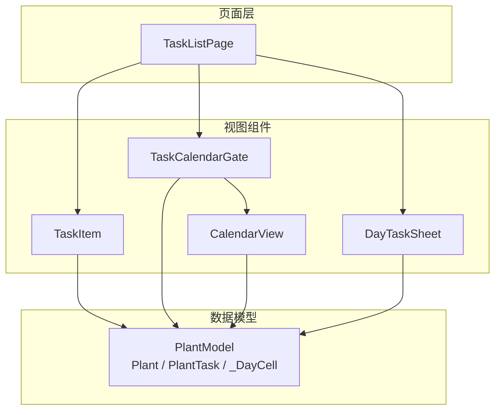
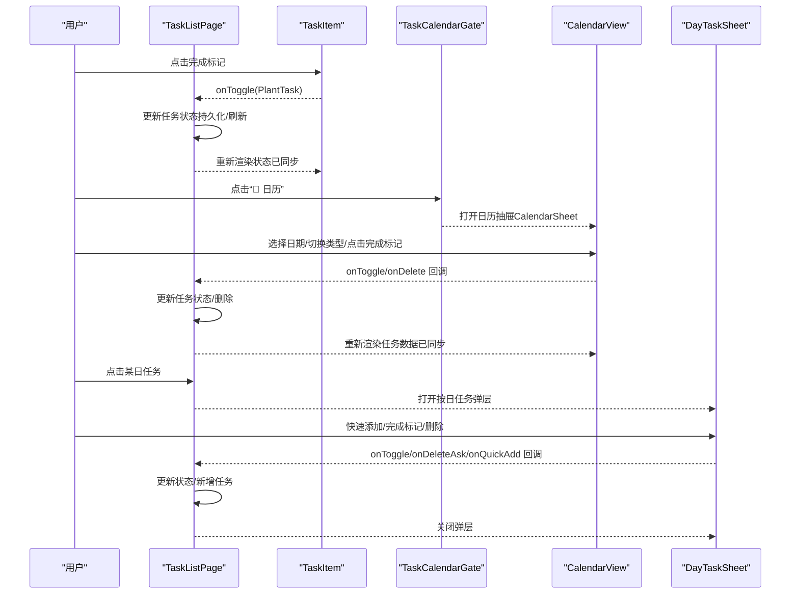
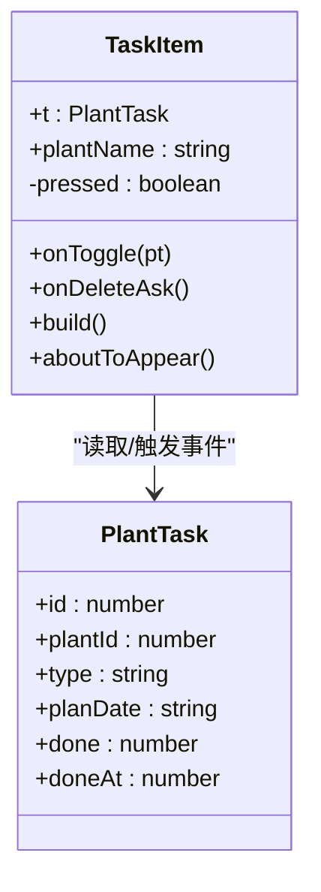
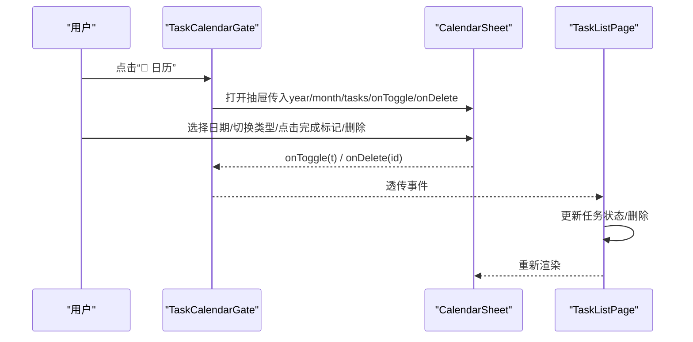
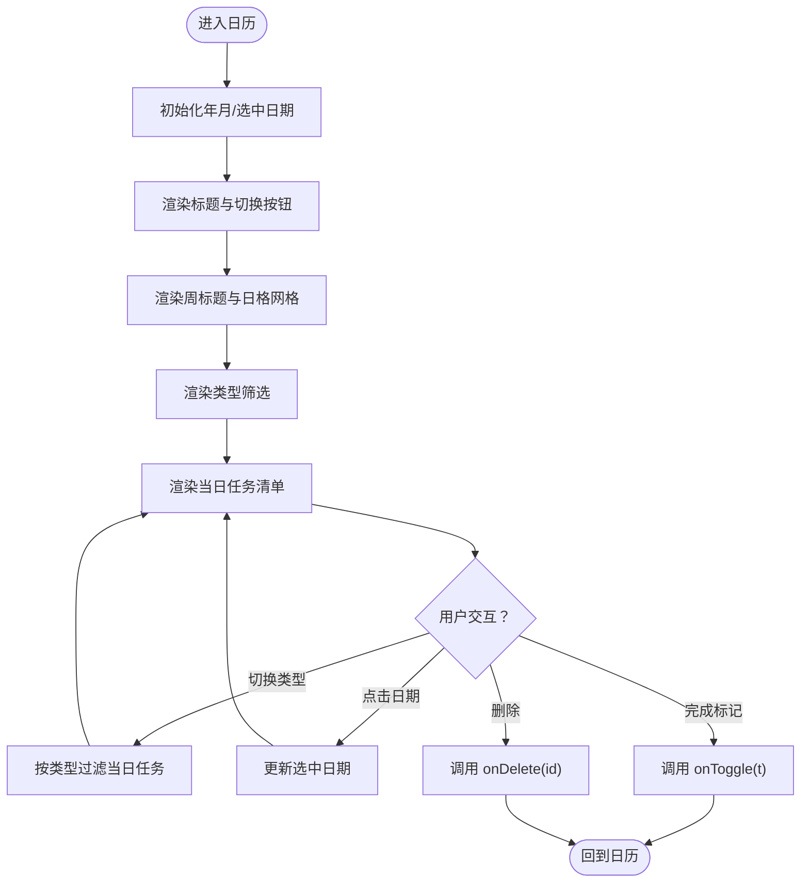
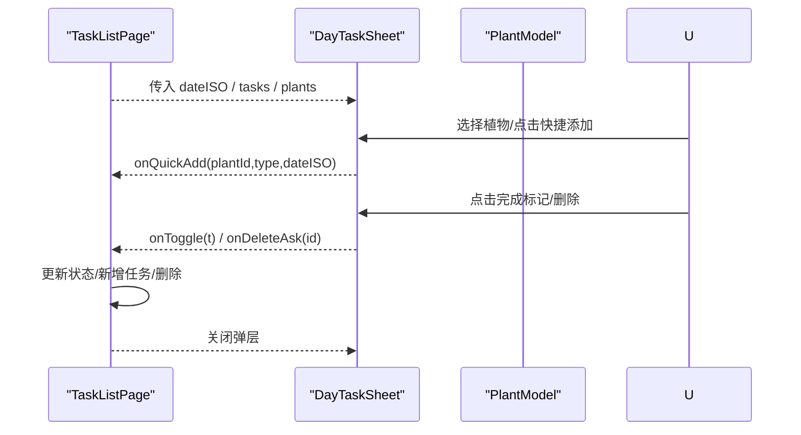
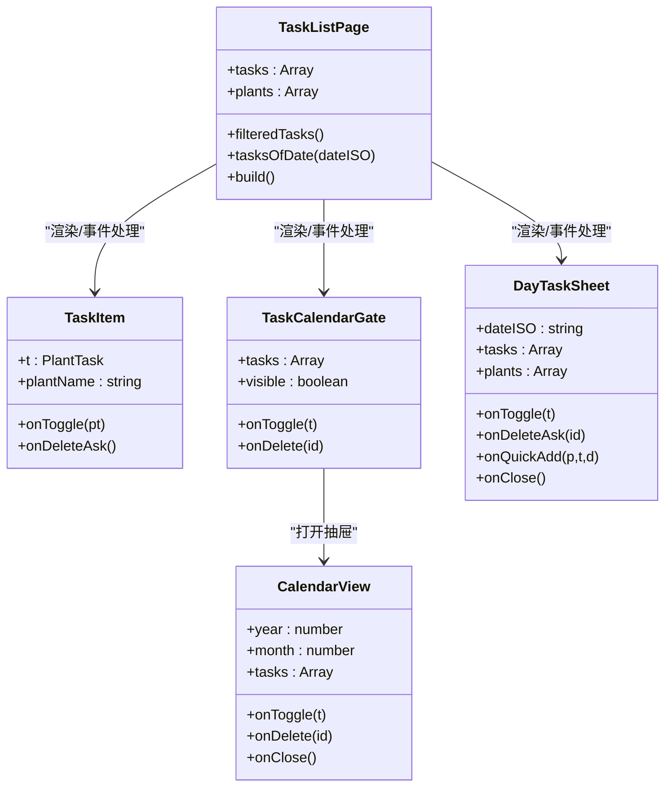
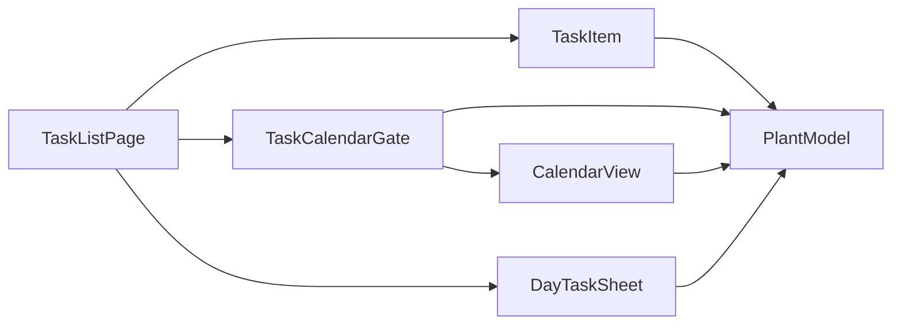

# 任务组件

<cite>
**本文引用的文件**
- [TaskItem.ets](file://entry/src/main/ets/view/TaskItem.ets)
- [TaskCalendarGate.ets](file://entry/src/main/ets/view/TaskCalendarGate.ets)
- [TaskListPage.ets](file://entry/src/main/ets/pages/TaskListPage.ets)
- [CalendarView.ets](file://entry/src/main/ets/view/CalendarView.ets)
- [DayTaskSheet.ets](file://entry/src/main/ets/view/DayTaskSheet.ets)
- [PlantModel.ets](file://entry/src/main/ets/model/PlantModel.ets)
- [WateringViewModel.ets](file://entry/src/main/ets/viewmodel/WateringViewModel.ets)
- [MixPlannerViewModel.ets](file://entry/src/main/ets/viewmodel/MixPlannerViewModel.ets)
- [color.json](file://entry/src/main/resources/base/element/color.json)
- [dark_color.json](file://entry/src/main/resources/dark/element/color.json)
</cite>

## 目录
1. [简介](#简介)
2. [项目结构](#项目结构)
3. [核心组件](#核心组件)
4. [架构总览](#架构总览)
5. [组件详解](#组件详解)
6. [依赖关系分析](#依赖关系分析)
7. [性能考量](#性能考量)
8. [故障排查指南](#故障排查指南)
9. [结论](#结论)
10. [附录：使用示例与最佳实践](#附录使用示例与最佳实践)

## 简介
本文件聚焦于 PlantDiary 应用中的任务组件体系，系统性梳理 TaskItem 与 TaskCalendarGate 的设计与实现，阐明任务项的展示、状态切换、完成标记与交互处理；解析任务门组件如何集成日历视图、进行任务筛选与视图切换；并说明组件与任务管理页面（TaskListPage）及底层数据模型（PlantModel）的集成与数据同步机制。同时提供样式定制与响应式设计建议，以及完整的使用示例与用户体验优化策略。

## 项目结构
任务相关组件主要分布在以下位置：
- 视图组件：TaskItem、TaskCalendarGate、CalendarView、DayTaskSheet
- 页面容器：TaskListPage
- 数据模型：PlantModel（包含 Plant、PlantTask 等）
- 示例 ViewModel：WateringViewModel、MixPlannerViewModel（用于理解可观察数据与交互模式）

图表来源
- [TaskListPage.ets:1-463](file://entry/src/main/ets/pages/TaskListPage.ets#L1-L463)
- [TaskItem.ets:1-67](file://entry/src/main/ets/view/TaskItem.ets#L1-L67)
- [TaskCalendarGate.ets:1-81](file://entry/src/main/ets/view/TaskCalendarGate.ets#L1-L81)
- [CalendarView.ets:1-566](file://entry/src/main/ets/view/CalendarView.ets#L1-L566)
- [DayTaskSheet.ets:1-228](file://entry/src/main/ets/view/DayTaskSheet.ets#L1-L228)
- [PlantModel.ets:1-166](file://entry/src/main/ets/model/PlantModel.ets#L1-L166)

章节来源
- [TaskListPage.ets:1-463](file://entry/src/main/ets/pages/TaskListPage.ets#L1-L463)
- [TaskItem.ets:1-67](file://entry/src/main/ets/view/TaskItem.ets#L1-L67)
- [TaskCalendarGate.ets:1-81](file://entry/src/main/ets/view/TaskCalendarGate.ets#L1-L81)
- [CalendarView.ets:1-566](file://entry/src/main/ets/view/CalendarView.ets#L1-L566)
- [DayTaskSheet.ets:1-228](file://entry/src/main/ets/view/DayTaskSheet.ets#L1-L228)
- [PlantModel.ets:1-166](file://entry/src/main/ets/model/PlantModel.ets#L1-L166)

## 核心组件
- TaskItem：轻量任务项展示与交互回调组件，负责渲染任务类型、植物名、计划日期与完成状态，并触发状态切换与删除询问事件。
- TaskCalendarGate：任务门组件，提供“日历”入口，打开日历抽屉（CalendarSheet），并在其中承载任务筛选与状态切换。
- CalendarView：日历核心组件，支持抽屉/内嵌两种模式，提供月份切换、类型筛选、点击日期选择、当日任务清单等能力。
- DayTaskSheet：按日任务弹层，展示选定日期的任务列表，支持快速添加、完成切换与删除。
- PlantModel：任务数据模型（Plant、PlantTask、_DayCell 等），作为组件间共享的轻量数据结构。

章节来源
- [TaskItem.ets:1-67](file://entry/src/main/ets/view/TaskItem.ets#L1-L67)
- [TaskCalendarGate.ets:1-81](file://entry/src/main/ets/view/TaskCalendarGate.ets#L1-L81)
- [CalendarView.ets:1-566](file://entry/src/main/ets/view/CalendarView.ets#L1-L566)
- [DayTaskSheet.ets:1-228](file://entry/src/main/ets/view/DayTaskSheet.ets#L1-L228)
- [PlantModel.ets:1-166](file://entry/src/main/ets/model/PlantModel.ets#L1-L166)

## 架构总览
组件与页面的交互遵循“页面聚合 + 子组件解耦”的模式：
- TaskListPage 负责任务筛选（按日、类型、关键词）、排序与列表渲染；将 PlantTask 与植物名传递给 TaskItem。
- TaskItem 仅负责展示与交互回调，不直接修改任务状态，而是通过事件向上通知 TaskListPage 执行实际的状态切换与删除操作。
- TaskCalendarGate 提供日历入口，打开 CalendarSheet 或 CalendarGrid，内部委托 CalendarView 完成日历渲染与交互。
- CalendarView 支持抽屉/内嵌两种模式，提供类型筛选与当日任务清单，事件向上回调至 TaskListPage 或上层页面。
- DayTaskSheet 在抽屉中展示选定日期的任务，支持快速添加与删除。

图表来源
- [TaskListPage.ets:1-463](file://entry/src/main/ets/pages/TaskListPage.ets#L1-L463)
- [TaskItem.ets:1-67](file://entry/src/main/ets/view/TaskItem.ets#L1-L67)
- [TaskCalendarGate.ets:1-81](file://entry/src/main/ets/view/TaskCalendarGate.ets#L1-L81)
- [CalendarView.ets:1-566](file://entry/src/main/ets/view/CalendarView.ets#L1-L566)
- [DayTaskSheet.ets:1-228](file://entry/src/main/ets/view/DayTaskSheet.ets#L1-L228)

## 组件详解

### TaskItem 组件
- 设计要点
  - 结构：Row + Column + Text + Blank + Touch 事件组合，保持最小职责：展示与交互回调。
  - 状态展示：根据 done 字段显示完成/未完成标记，文本采用删除线与透明度区分已完成。
  - 交互：点击完成标记触发 onToggle；点击右侧删除图标触发 onDeleteAsk；触摸 Down/Up 控制缩放与按下反馈。
  - 动画：完成切换与整体布局使用动画提升反馈感。
- 数据与事件
  - 输入参数：t（PlantTask）、plantName（字符串）、onToggle、onDeleteAsk。
  - 输出事件：onToggle(t)、onDeleteAsk()。
- 与 ViewModel 的关系
  - TaskItem 不直接持有 ViewModel；状态切换与删除由 TaskListPage 或上层页面处理，组件仅负责触发事件并即时局部反馈。

图表来源
- [TaskItem.ets:1-67](file://entry/src/main/ets/view/TaskItem.ets#L1-L67)
- [PlantModel.ets:42-59](file://entry/src/main/ets/model/PlantModel.ets#L42-L59)

章节来源
- [TaskItem.ets:1-67](file://entry/src/main/ets/view/TaskItem.ets#L1-L67)
- [PlantModel.ets:42-59](file://entry/src/main/ets/model/PlantModel.ets#L42-L59)

### TaskCalendarGate 组件
- 设计要点
  - 提供“📅 日历”入口按钮，点击后打开日历抽屉（CalendarSheet）。
  - 初始化当前年月为今日，便于用户快速定位。
  - 通过事件 onToggle 与 onDelete 将日历内的任务操作回传至上层。
- 与日历组件的关系
  - 内部使用 CalendarSheet（抽屉模式）承载日历视图，传入 tasks、年月与回调。
  - 保留了 CalendarGrid（内嵌模式）的调用路径，便于后续恢复日历视图。

图表来源
- [TaskCalendarGate.ets:1-81](file://entry/src/main/ets/view/TaskCalendarGate.ets#L1-L81)
- [CalendarView.ets:538-566](file://entry/src/main/ets/view/CalendarView.ets#L538-L566)

章节来源
- [TaskCalendarGate.ets:1-81](file://entry/src/main/ets/view/TaskCalendarGate.ets#L1-L81)
- [CalendarView.ets:538-566](file://entry/src/main/ets/view/CalendarView.ets#L538-L566)

### CalendarView 组件（日历核心）
- 模式与参数
  - 支持抽屉（showAsSheet=true）与内嵌（false）两种模式。
  - 参数：year、month、tasks、onToggle、onDelete、onClose。
- 功能特性
  - 月份导航：‹/› 切换前后月份。
  - 周标题与 6×7 日历网格：按 ISO 日期填充，今日标记点。
  - 类型筛选：全部/浇水/施肥/修剪 等。
  - 当日任务清单：按所选日期列出任务，支持完成切换与删除。
  - 交互反馈：点击日期选中、按下缩放、选中态阴影与颜色变化。
- 与 PlantModel 的关系
  - 使用 PlantTask 渲染任务行，使用 _DayCell 描述日格与占位。

图表来源
- [CalendarView.ets:1-566](file://entry/src/main/ets/view/CalendarView.ets#L1-L566)
- [PlantModel.ets:92-106](file://entry/src/main/ets/model/PlantModel.ets#L92-L106)

章节来源
- [CalendarView.ets:1-566](file://entry/src/main/ets/view/CalendarView.ets#L1-L566)
- [PlantModel.ets:92-106](file://entry/src/main/ets/model/PlantModel.ets#L92-L106)

### DayTaskSheet 组件（按日任务弹层）
- 设计要点
  - 展示选定日期的任务列表，支持按植物筛选与快速添加。
  - 提供“浇水/施肥/修剪”快捷添加，基于当前选中植物。
  - 支持完成切换与删除，事件向上回调。
- 与 PlantModel 的关系
  - 通过 PlantTask 渲染任务行，通过 Plant 获取植物名。

图表来源
- [DayTaskSheet.ets:1-228](file://entry/src/main/ets/view/DayTaskSheet.ets#L1-L228)
- [PlantModel.ets:42-59](file://entry/src/main/ets/model/PlantModel.ets#L42-L59)

章节来源
- [DayTaskSheet.ets:1-228](file://entry/src/main/ets/view/DayTaskSheet.ets#L1-L228)
- [PlantModel.ets:42-59](file://entry/src/main/ets/model/PlantModel.ets#L42-L59)

### 与任务管理页面的集成与数据同步
- TaskListPage 聚合任务筛选（按日、类型、关键词）、排序与渲染；将 PlantTask 与植物名传递给 TaskItem。
- TaskItem 仅触发事件，不直接修改状态；页面负责执行状态切换与删除，并通过重新渲染确保 UI 与数据一致。
- TaskCalendarGate/CalendarView/DayTaskSheet 同样通过事件回传到 TaskListPage，实现统一的数据更新与刷新。

图表来源
- [TaskListPage.ets:1-463](file://entry/src/main/ets/pages/TaskListPage.ets#L1-L463)
- [TaskItem.ets:1-67](file://entry/src/main/ets/view/TaskItem.ets#L1-L67)
- [TaskCalendarGate.ets:1-81](file://entry/src/main/ets/view/TaskCalendarGate.ets#L1-L81)
- [CalendarView.ets:1-566](file://entry/src/main/ets/view/CalendarView.ets#L1-L566)
- [DayTaskSheet.ets:1-228](file://entry/src/main/ets/view/DayTaskSheet.ets#L1-L228)

章节来源
- [TaskListPage.ets:1-463](file://entry/src/main/ets/pages/TaskListPage.ets#L1-L463)
- [TaskItem.ets:1-67](file://entry/src/main/ets/view/TaskItem.ets#L1-L67)
- [TaskCalendarGate.ets:1-81](file://entry/src/main/ets/view/TaskCalendarGate.ets#L1-L81)
- [CalendarView.ets:1-566](file://entry/src/main/ets/view/CalendarView.ets#L1-L566)
- [DayTaskSheet.ets:1-228](file://entry/src/main/ets/view/DayTaskSheet.ets#L1-L228)

## 依赖关系分析
- 组件耦合
  - TaskItem 与 PlantModel 强耦合（读取 PlantTask 字段），弱耦合于 TaskListPage（通过事件回传）。
  - TaskCalendarGate 与 CalendarView 强耦合（委托渲染与交互），弱耦合于 TaskListPage。
  - CalendarView 与 PlantModel 强耦合（使用 PlantTask/_DayCell）。
  - DayTaskSheet 与 PlantModel 强耦合（使用 PlantTask/Plant）。
- 数据流
  - 上游：TaskListPage 聚合数据与筛选，向下传递给子组件。
  - 下游：子组件通过事件回传，TaskListPage 执行状态更新与刷新。
- 循环依赖
  - 未发现循环依赖；组件间为单向数据流与事件回传。

图表来源
- [TaskListPage.ets:1-463](file://entry/src/main/ets/pages/TaskListPage.ets#L1-L463)
- [TaskItem.ets:1-67](file://entry/src/main/ets/view/TaskItem.ets#L1-L67)
- [TaskCalendarGate.ets:1-81](file://entry/src/main/ets/view/TaskCalendarGate.ets#L1-L81)
- [CalendarView.ets:1-566](file://entry/src/main/ets/view/CalendarView.ets#L1-L566)
- [DayTaskSheet.ets:1-228](file://entry/src/main/ets/view/DayTaskSheet.ets#L1-L228)
- [PlantModel.ets:1-166](file://entry/src/main/ets/model/PlantModel.ets#L1-L166)

章节来源
- [TaskListPage.ets:1-463](file://entry/src/main/ets/pages/TaskListPage.ets#L1-L463)
- [PlantModel.ets:1-166](file://entry/src/main/ets/model/PlantModel.ets#L1-L166)

## 性能考量
- 渲染优化
  - 列表渲染使用 ForEach + ListItem，配合 List 的 space 与滚动配置，减少重排。
  - 动画时长与曲线（如 200ms/250ms）控制交互反馈，避免过度动画影响滚动性能。
- 数据更新
  - TaskItem 本地切换 done 仅用于即时反馈，最终以父层 reload 校正为准，避免重复渲染。
  - CalendarView/DayTaskSheet 通过按日筛选与类型过滤，缩小渲染范围。
- 内存与复杂度
  - PlantTask 列表遍历与过滤为 O(n)，在任务规模合理时可接受；建议对大数据集考虑分页或虚拟列表（当前未实现）。

## 故障排查指南
- 任务状态不同步
  - 现象：点击完成标记后 UI 闪烁但状态未持久。
  - 排查：确认 TaskListPage 是否正确接收 onToggle 事件并更新数据源，随后触发重新渲染。
- 删除确认缺失
  - 现象：点击删除图标直接删除。
  - 排查：TaskItem 触发 onDeleteAsk，应由 TaskListPage 弹出确认对话框；若未弹出，检查事件回调链路。
- 日历未显示任务
  - 现象：日历中无任务点或任务列表为空。
  - 排查：确认传入 tasks 是否包含对应日期的 PlantTask；检查 CalendarView 的类型筛选与 selectedISO。
- 按日弹层无法关闭
  - 现象：DayTaskSheet 打开后无法关闭。
  - 排查：确认 onClose 回调是否正确设置并触发关闭逻辑。

章节来源
- [TaskItem.ets:1-67](file://entry/src/main/ets/view/TaskItem.ets#L1-L67)
- [TaskCalendarGate.ets:1-81](file://entry/src/main/ets/view/TaskCalendarGate.ets#L1-L81)
- [CalendarView.ets:1-566](file://entry/src/main/ets/view/CalendarView.ets#L1-L566)
- [DayTaskSheet.ets:1-228](file://entry/src/main/ets/view/DayTaskSheet.ets#L1-L228)

## 结论
TaskItem 与 TaskCalendarGate 通过清晰的职责划分与事件回传机制，实现了任务展示与日历集成的解耦。TaskListPage 作为聚合层承担筛选、排序与状态同步，保证了数据一致性与良好的用户体验。CalendarView 与 DayTaskSheet 提供了完整的日历与按日任务交互能力。建议在大规模数据场景下引入虚拟列表与缓存策略，进一步优化性能。

## 附录：使用示例与最佳实践
- 使用示例（TaskItem）
  - 在 TaskListPage 的列表中渲染 TaskItem，传入 t、plantName、onToggle、onDeleteAsk。
  - 示例路径参考：[TaskListPage.ets:215-230](file://entry/src/main/ets/pages/TaskListPage.ets#L215-L230)
- 使用示例（TaskCalendarGate）
  - 在任务页顶部放置入口，打开日历抽屉并传入 tasks、onToggle、onDelete。
  - 示例路径参考：[TaskListPage.ets:190-270](file://entry/src/main/ets/pages/TaskListPage.ets#L190-L270)
- 样式定制与响应式设计
  - 颜色主题：通过资源文件 color.json/dark_color.json 定义主题色，组件中使用十六进制颜色值。
  - 响应式：利用百分比宽度与 padding/margin 实现自适应；在不同屏幕尺寸下保持间距与字号比例一致。
  - 动画：为点击、切换、弹层等交互添加适度动画，提升反馈感但避免过度。
- 用户体验优化建议
  - 即时反馈：TaskItem 的本地 done 切换与动画可增强即时反馈，但需确保父层尽快校正。
  - 明确状态：已完成任务采用删除线与半透明，帮助用户快速识别。
  - 快捷操作：DayTaskSheet 提供“浇水/施肥/修剪”快捷添加，减少用户操作步骤。
  - 一致性：日历与列表视图共享筛选条件，避免同一入口看到的任务不一致。

章节来源
- [TaskListPage.ets:1-463](file://entry/src/main/ets/pages/TaskListPage.ets#L1-L463)
- [TaskItem.ets:1-67](file://entry/src/main/ets/view/TaskItem.ets#L1-L67)
- [TaskCalendarGate.ets:1-81](file://entry/src/main/ets/view/TaskCalendarGate.ets#L1-L81)
- [CalendarView.ets:1-566](file://entry/src/main/ets/view/CalendarView.ets#L1-L566)
- [DayTaskSheet.ets:1-228](file://entry/src/main/ets/view/DayTaskSheet.ets#L1-L228)
- [color.json:1-8](file://entry/src/main/resources/base/element/color.json#L1-L8)
- [dark_color.json:1-8](file://entry/src/main/resources/dark/element/color.json#L1-L8)