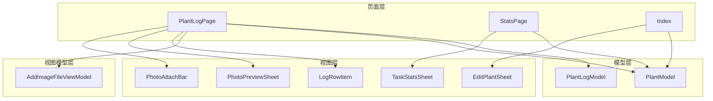
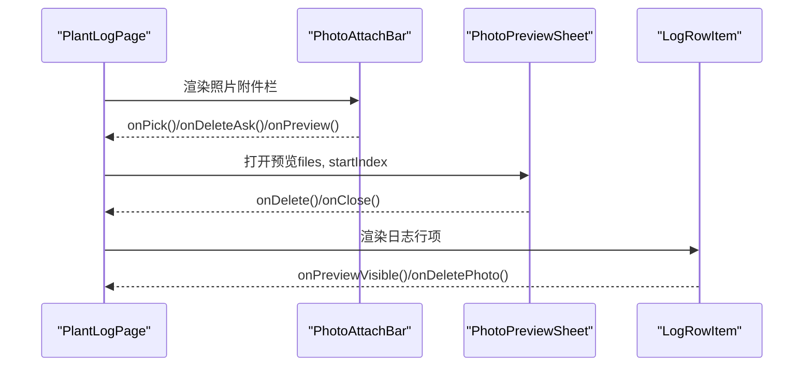
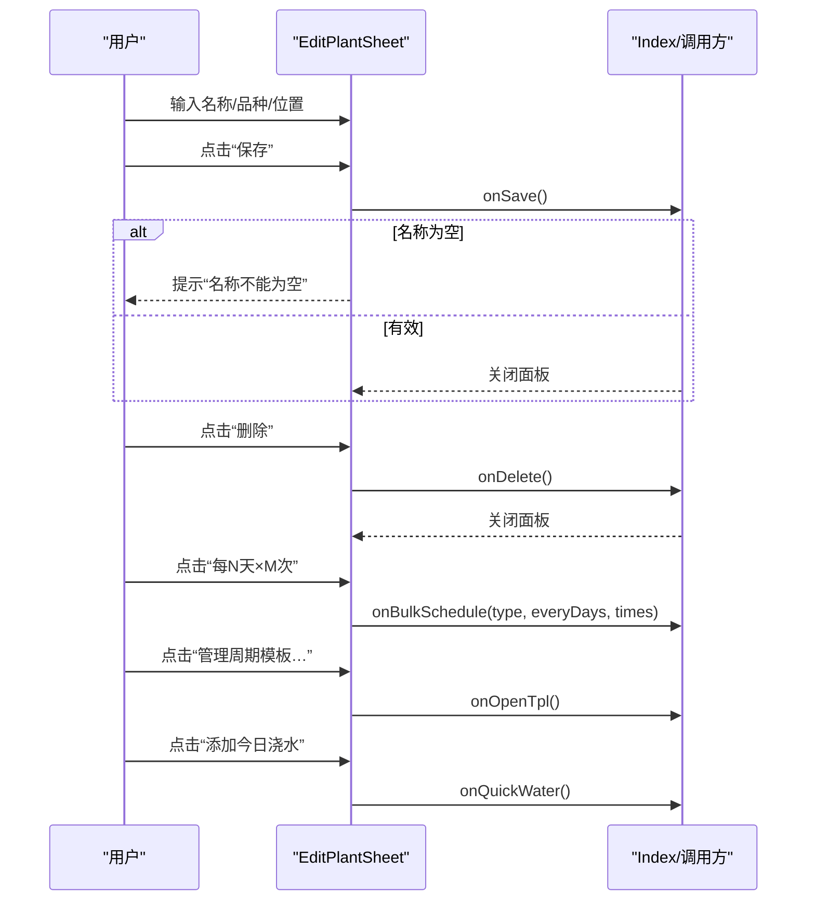
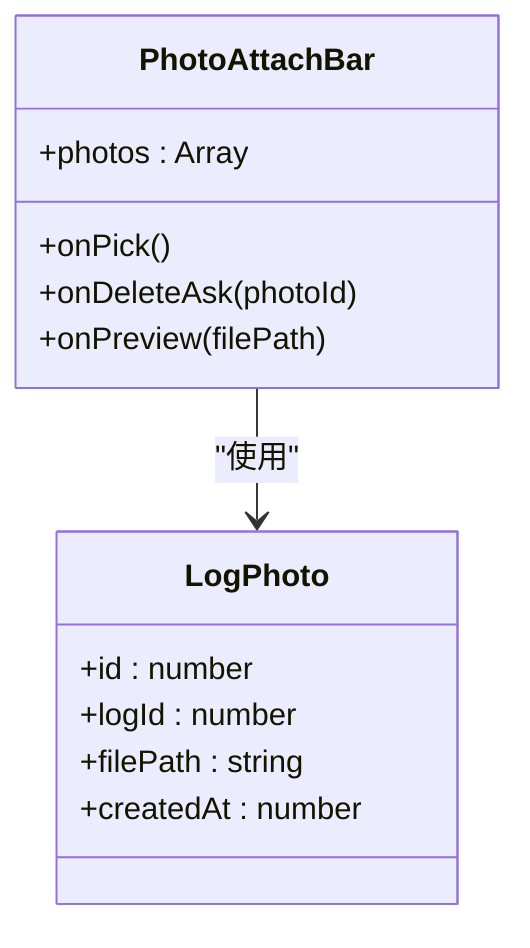
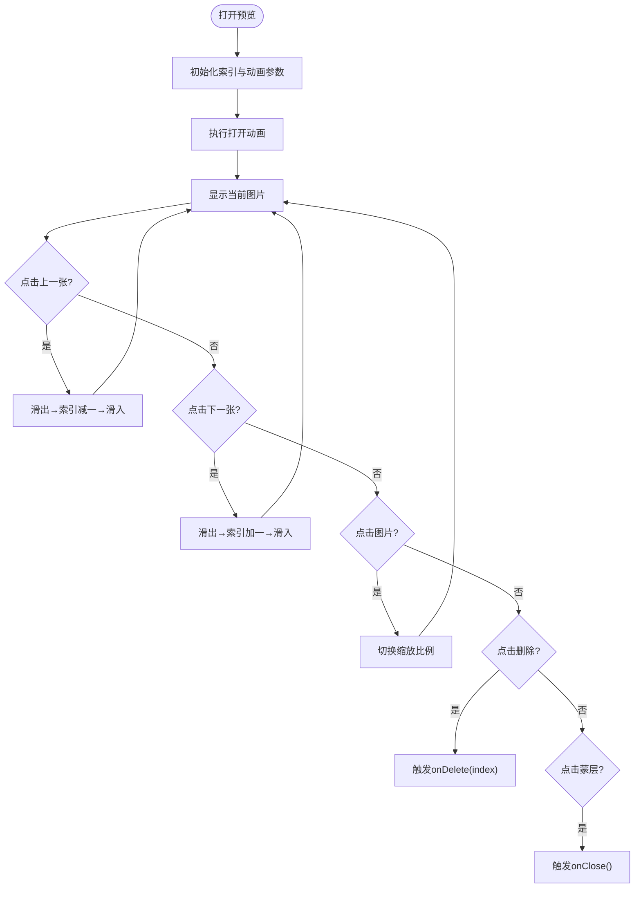
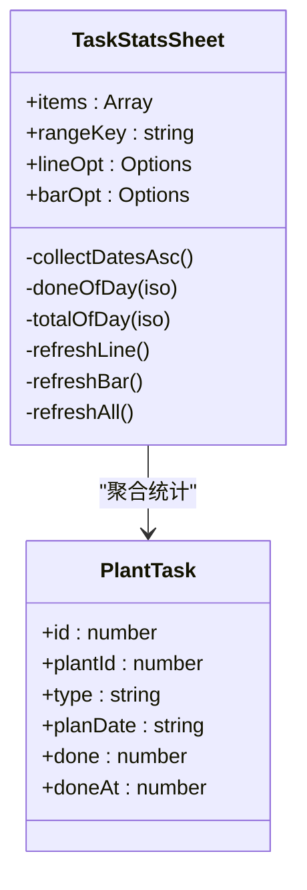
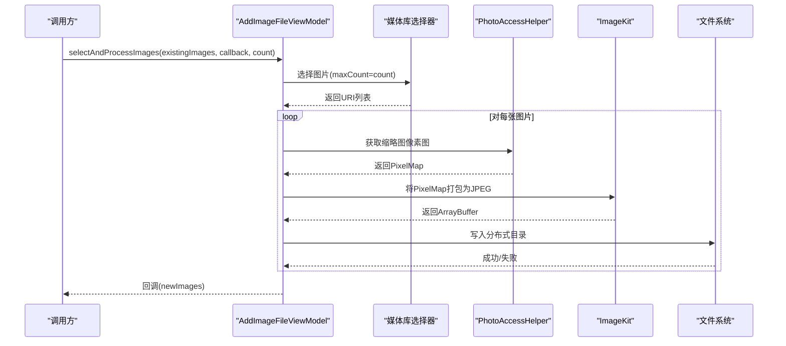
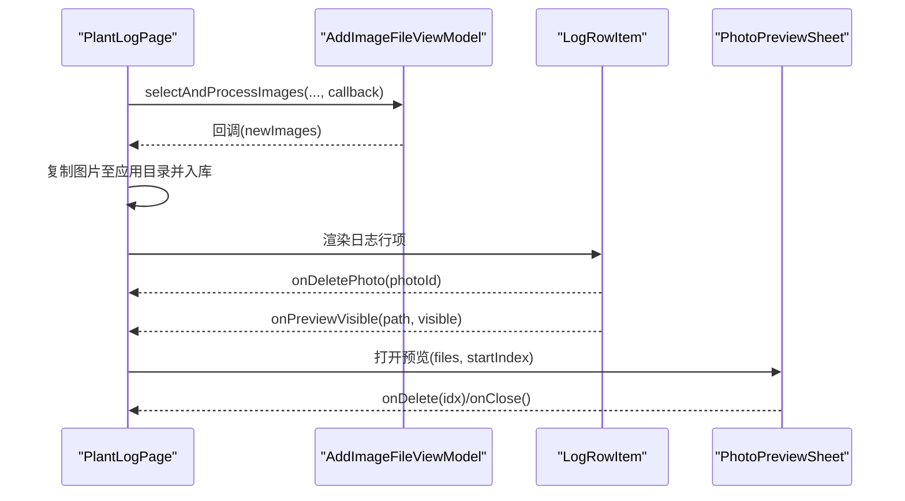
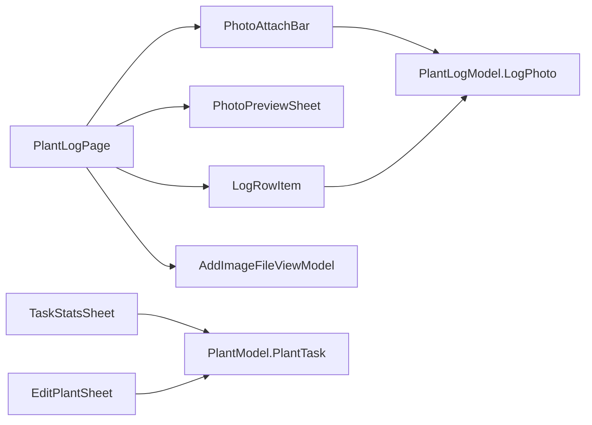

# 工具组件

<cite>
**本文档引用的文件**
- [EditPlantSheet.ets](file://entry/src/main/ets/view/EditPlantSheet.ets)
- [PhotoAttachBar.ets](file://entry/src/main/ets/view/PhotoAttachBar.ets)
- [PhotoPreviewSheet.ets](file://entry/src/main/ets/view/PhotoPreviewSheet.ets)
- [TaskStatsSheet.ets](file://entry/src/main/ets/view/TaskStatsSheet.ets)
- [AddImageFileViewModel.ets](file://entry/src/main/ets/viewmodel/AddImageFileViewModel.ets)
- [PlantModel.ets](file://entry/src/main/ets/model/PlantModel.ets)
- [PlantLogModel.ets](file://entry/src/main/ets/model/PlantLogModel.ets)
- [PlantLogSheet.ets](file://entry/src/main/ets/view/PlantLogSheet.ets)
- [LogRowItem.ets](file://entry/src/main/ets/view/LogRowItem.ets)
- [PlantLogPage.ets](file://entry/src/main/ets/pages/PlantLogPage.ets)
- [StatsPage.ets](file://entry/src/main/ets/pages/StatsPage.ets)
- [Index.ets](file://entry/src/main/ets/pages/Index.ets)
</cite>

## 目录
1. [简介](#简介)
2. [项目结构](#项目结构)
3. [核心组件](#核心组件)
4. [架构总览](#架构总览)
5. [详细组件分析](#详细组件分析)
6. [依赖关系分析](#依赖关系分析)
7. [性能考量](#性能考量)
8. [故障排查指南](#故障排查指南)
9. [结论](#结论)
10. [附录](#附录)

## 简介
本文件聚焦 PlantDiary 项目中的工具组件，系统性梳理以下实用组件的设计与实现：
- 编辑植物弹窗：支持植物信息编辑、周期任务批量生成、快速浇水、删除与保存等。
- 照片附件栏：用于日志照片的缩略图展示、添加、删除与预览。
- 照片预览弹窗：提供大图浏览、缩放、翻页与删除操作。
- 任务统计弹窗：对任务完成率与类型占比进行聚合、可视化与区间切换。

同时，文档将深入说明各组件的数据输入、验证与保存流程，阐述照片上传、预览与管理机制，解释统计组件的数据汇总、图表展示与导出能力，并给出用户交互设计与响应式布局实现要点，以及完整的使用示例与扩展指南。

## 项目结构
围绕工具组件，项目采用“页面-视图-视图模型-模型”的分层组织方式：
- 页面层：负责导航、状态管理与业务编排（如 PlantLogPage、StatsPage、Index）。
- 视图层：组件化 UI（如 EditPlantSheet、PhotoAttachBar、PhotoPreviewSheet、TaskStatsSheet、LogRowItem）。
- 视图模型层：封装通用能力（如 AddImageFileViewModel）。
- 模型层：数据结构与接口（如 PlantModel、PlantLogModel）。

**图表来源**
- [PlantLogPage.ets:1-120](file://entry/src/main/ets/pages/PlantLogPage.ets#L1-L120)
- [StatsPage.ets:1-60](file://entry/src/main/ets/pages/StatsPage.ets#L1-L60)
- [Index.ets:1520-1620](file://entry/src/main/ets/pages/Index.ets#L1520-L1620)
- [EditPlantSheet.ets:1-60](file://entry/src/main/ets/view/EditPlantSheet.ets#L1-L60)
- [PhotoAttachBar.ets:1-40](file://entry/src/main/ets/view/PhotoAttachBar.ets#L1-L40)
- [PhotoPreviewSheet.ets:1-40](file://entry/src/main/ets/view/PhotoPreviewSheet.ets#L1-L40)
- [TaskStatsSheet.ets:1-50](file://entry/src/main/ets/view/TaskStatsSheet.ets#L1-L50)
- [AddImageFileViewModel.ets:1-40](file://entry/src/main/ets/viewmodel/AddImageFileViewModel.ets#L1-L40)
- [PlantModel.ets:1-60](file://entry/src/main/ets/model/PlantModel.ets#L1-L60)
- [PlantLogModel.ets:1-40](file://entry/src/main/ets/model/PlantLogModel.ets#L1-L40)

**章节来源**
- [PlantLogPage.ets:1-120](file://entry/src/main/ets/pages/PlantLogPage.ets#L1-L120)
- [StatsPage.ets:1-60](file://entry/src/main/ets/pages/StatsPage.ets#L1-L60)
- [Index.ets:1520-1620](file://entry/src/main/ets/pages/Index.ets#L1520-L1620)

## 核心组件
本节概述四个工具组件的核心职责与交互要点：
- 编辑植物弹窗：承载植物信息表单、周期任务模板入口、快速浇水与保存/删除/关闭等事件。
- 照片附件栏：展示日志照片缩略图，提供“添加照片”、“删除”与“预览”事件。
- 照片预览弹窗：全屏大图浏览，支持左右翻页、点击缩放、删除与关闭。
- 任务统计弹窗：按时间区间聚合任务完成率与类型占比，提供图表展示与区间切换。

**章节来源**
- [EditPlantSheet.ets:1-120](file://entry/src/main/ets/view/EditPlantSheet.ets#L1-L120)
- [PhotoAttachBar.ets:17-99](file://entry/src/main/ets/view/PhotoAttachBar.ets#L17-L99)
- [PhotoPreviewSheet.ets:1-120](file://entry/src/main/ets/view/PhotoPreviewSheet.ets#L1-L120)
- [TaskStatsSheet.ets:1-120](file://entry/src/main/ets/view/TaskStatsSheet.ets#L1-L120)

## 架构总览
四个工具组件在页面中的协作关系如下：

**图表来源**
- [PlantLogPage.ets:612-636](file://entry/src/main/ets/pages/PlantLogPage.ets#L612-L636)
- [PhotoAttachBar.ets:25-98](file://entry/src/main/ets/view/PhotoAttachBar.ets#L25-L98)
- [PhotoPreviewSheet.ets:102-221](file://entry/src/main/ets/view/PhotoPreviewSheet.ets#L102-L221)
- [LogRowItem.ets:72-134](file://entry/src/main/ets/view/LogRowItem.ets#L72-L134)

## 详细组件分析

### 编辑植物弹窗（EditPlantSheet）
- 设计目标：提供植物信息编辑、周期任务批量生成、快速浇水与保存/删除/关闭等操作。
- 数据输入与验证：
  - 表单项包括名称、品种、位置，均通过受控输入绑定到草稿对象。
  - 保存前对名称进行非空校验，失败时提示并阻止提交。
- 保存与删除：
  - 保存事件根据编辑 ID 决定新建或更新植物。
  - 删除事件触发删除流程并关闭面板。
- 周期任务与模板：
  - 提供“每N天×M次”的快捷生成按钮，触发批量任务调度。
  - 提供“管理周期模板”入口，便于维护任务模板。
- 用户交互与动画：
  - 背景遮罩渐显、抽屉底部弹出动画、按钮按压反馈与缩放动画。

**图表来源**
- [EditPlantSheet.ets:101-178](file://entry/src/main/ets/view/EditPlantSheet.ets#L101-L178)
- [Index.ets:1536-1619](file://entry/src/main/ets/pages/Index.ets#L1536-L1619)

**章节来源**
- [EditPlantSheet.ets:1-264](file://entry/src/main/ets/view/EditPlantSheet.ets#L1-L264)
- [Index.ets:1520-1620](file://entry/src/main/ets/pages/Index.ets#L1520-L1620)

### 照片附件栏（PhotoAttachBar）
- 功能职责：展示日志照片缩略图，提供“添加照片”、“删除”与“预览”事件。
- 数据结构：接收照片数组，元素包含文件路径与创建时间等。
- 交互细节：
  - “添加”按钮与缩略图卡片均可触发“添加照片”事件。
  - 点击缩略图触发预览事件，点击“删除”触发删除询问事件。
- 响应式布局：横向滚动容器，缩略图尺寸固定，间距与圆角统一。

**图表来源**
- [PhotoAttachBar.ets:17-99](file://entry/src/main/ets/view/PhotoAttachBar.ets#L17-L99)
- [PlantLogModel.ets:34-57](file://entry/src/main/ets/model/PlantLogModel.ets#L34-L57)

**章节来源**
- [PhotoAttachBar.ets:1-100](file://entry/src/main/ets/view/PhotoAttachBar.ets#L1-L100)
- [PlantLogModel.ets:1-58](file://entry/src/main/ets/model/PlantLogModel.ets#L1-L58)

### 照片预览弹窗（PhotoPreviewSheet）
- 功能职责：全屏大图浏览、缩放、翻页、删除与关闭。
- 数据与状态：
  - 接收文件数组与起始索引，内部维护索引、缩放比例与动画参数。
  - 支持前后切换与点击缩放。
- 动画与交互：
  - 打开时的缩放与透明度动画，切换时的滑动过渡。
  - 顶部工具栏显示计数与删除按钮，底部蒙层支持点击关闭。

**图表来源**
- [PhotoPreviewSheet.ets:17-100](file://entry/src/main/ets/view/PhotoPreviewSheet.ets#L17-L100)

**章节来源**
- [PhotoPreviewSheet.ets:1-223](file://entry/src/main/ets/view/PhotoPreviewSheet.ets#L1-L223)

### 任务统计弹窗（TaskStatsSheet）
- 功能职责：对任务完成率与类型占比进行聚合与可视化展示，支持时间区间切换。
- 数据聚合：
  - 完成率趋势：按日期聚合完成数与总数，计算百分比。
  - 类型占比：统计浇水、施肥、修剪与其他类型的次数。
- 图表与交互：
  - 使用 mccharts 的折线图与柱状图组件，配置标题、坐标轴、网格、提示框与系列数据。
  - 区间切换（近30天、近90天、全部）触发刷新。
- 日期工具：提供日期格式化、区间计算与边界处理。

**图表来源**
- [TaskStatsSheet.ets:4-189](file://entry/src/main/ets/view/TaskStatsSheet.ets#L4-L189)
- [PlantModel.ets:42-59](file://entry/src/main/ets/model/PlantModel.ets#L42-L59)

**章节来源**
- [TaskStatsSheet.ets:1-273](file://entry/src/main/ets/view/TaskStatsSheet.ets#L1-L273)
- [PlantModel.ets:1-166](file://entry/src/main/ets/model/PlantModel.ets#L1-L166)

### 照片上传与管理机制（AddImageFileViewModel）
- 能力概述：统一封装“选图→处理→写入→回调”的异步流程，供多页面复用。
- 关键流程：
  - 选图：通过媒体库选择器限制最大数量并返回 URI 列表。
  - 处理：获取缩略图像素图，转换为 JPEG 二进制。
  - 写入：写入分布式目录，便于跨设备与富文本引用。
  - 回调：将处理后的图片路径列表回调给调用方。
- 错误处理：捕获异常并记录日志，保证流程健壮性。

**图表来源**
- [AddImageFileViewModel.ets:34-144](file://entry/src/main/ets/viewmodel/AddImageFileViewModel.ets#L34-L144)

**章节来源**
- [AddImageFileViewModel.ets:1-146](file://entry/src/main/ets/viewmodel/AddImageFileViewModel.ets#L1-L146)

### 日志与照片在页面中的集成（PlantLogPage 与 LogRowItem）
- 页面职责：
  - 加载日志与照片，提供新增、删除、批量删除、预览等功能。
  - 通过 AddImageFileViewModel 实现照片选择与写入。
  - 支持“照片预览弹窗”与“日志行项”的联动。
- 行项职责：
  - 展示日志内容与附件缩略图，支持长按进入多选、删除日志、删除照片、预览照片等。
  - 高亮关键字，支持按 logId 过滤照片集合。

**图表来源**
- [PlantLogPage.ets:210-240](file://entry/src/main/ets/pages/PlantLogPage.ets#L210-L240)
- [LogRowItem.ets:72-134](file://entry/src/main/ets/view/LogRowItem.ets#L72-L134)
- [PhotoPreviewSheet.ets:102-221](file://entry/src/main/ets/view/PhotoPreviewSheet.ets#L102-L221)

**章节来源**
- [PlantLogPage.ets:1-200](file://entry/src/main/ets/pages/PlantLogPage.ets#L1-L200)
- [LogRowItem.ets:1-272](file://entry/src/main/ets/view/LogRowItem.ets#L1-L272)

## 依赖关系分析
- 组件耦合：
  - PlantLogPage 依赖 PhotoAttachBar、PhotoPreviewSheet、LogRowItem、AddImageFileViewModel。
  - TaskStatsSheet 依赖 PlantModel 中的 PlantTask 类型与 mccharts 图表库。
  - EditPlantSheet 依赖 PlantModel 中的 PlantDraft 与 Plant 类型。
- 外部依赖：
  - 媒体库选择器、图像处理、文件系统、分布式存储等系统能力。
  - mccharts 图表库用于统计弹窗的可视化。

**图表来源**
- [PlantLogPage.ets:1-120](file://entry/src/main/ets/pages/PlantLogPage.ets#L1-L120)
- [TaskStatsSheet.ets:1-50](file://entry/src/main/ets/view/TaskStatsSheet.ets#L1-L50)
- [EditPlantSheet.ets:1-20](file://entry/src/main/ets/view/EditPlantSheet.ets#L1-L20)
- [PhotoAttachBar.ets:1-25](file://entry/src/main/ets/view/PhotoAttachBar.ets#L1-L25)
- [LogRowItem.ets:1-10](file://entry/src/main/ets/view/LogRowItem.ets#L1-L10)
- [PlantModel.ets:42-59](file://entry/src/main/ets/model/PlantModel.ets#L42-L59)
- [PlantLogModel.ets:34-57](file://entry/src/main/ets/model/PlantLogModel.ets#L34-L57)

**章节来源**
- [PlantLogPage.ets:1-120](file://entry/src/main/ets/pages/PlantLogPage.ets#L1-L120)
- [TaskStatsSheet.ets:1-60](file://entry/src/main/ets/view/TaskStatsSheet.ets#L1-L60)
- [EditPlantSheet.ets:1-30](file://entry/src/main/ets/view/EditPlantSheet.ets#L1-L30)
- [PhotoAttachBar.ets:1-30](file://entry/src/main/ets/view/PhotoAttachBar.ets#L1-L30)
- [LogRowItem.ets:1-20](file://entry/src/main/ets/view/LogRowItem.ets#L1-L20)
- [PlantModel.ets:1-60](file://entry/src/main/ets/model/PlantModel.ets#L1-L60)
- [PlantLogModel.ets:1-40](file://entry/src/main/ets/model/PlantLogModel.ets#L1-L40)

## 性能考量
- 图像处理与内存管理：
  - 优先使用缩略图像素图，及时释放 PixelMap 避免内存泄漏。
  - 写入分布式目录便于跨设备共享，减少重复解码成本。
- 列表渲染优化：
  - 使用 ForEach 并提供稳定 key，减少重绘与重排。
  - 图片网格高度自适应，避免不必要的布局抖动。
- 动画与交互：
  - 控制动画时长与曲线，避免过度动画导致卡顿。
  - 按压反馈与缩放动画采用短时长过渡，提升响应感。

[本节为通用指导，无需特定文件引用]

## 故障排查指南
- 照片无法显示或路径无效：
  - 确认路径是否以 file:// 前缀，必要时进行转换。
  - 检查文件是否存在与权限是否正确。
- 选图失败或回调未触发：
  - 捕获异常并查看日志输出，确认媒体库选择器返回值与回调时机。
- 删除日志与照片：
  - 确保事务先删子表后删主表，失败时回滚并提示。
  - 删除本地文件时忽略单文件错误，保证数据库一致性。

**章节来源**
- [PlantLogPage.ets:87-137](file://entry/src/main/ets/pages/PlantLogPage.ets#L87-L137)
- [AddImageFileViewModel.ets:115-144](file://entry/src/main/ets/viewmodel/AddImageFileViewModel.ets#L115-L144)

## 结论
上述工具组件围绕“编辑、照片、统计”三大场景构建，具备清晰的职责划分与良好的扩展性。通过统一的视图模型与数据模型，实现了跨页面的复用与一致性。建议在后续迭代中进一步完善统计弹窗的导出能力与编辑组件的表单校验规则，以提升用户体验与数据质量。

[本节为总结性内容，无需特定文件引用]

## 附录

### 使用示例与最佳实践
- 编辑植物弹窗
  - 在页面中渲染组件并绑定事件，保存前进行必填字段校验。
  - 通过 onBulkSchedule 与 onOpenTpl 与任务模板系统集成。
  - 示例参考：[Index.ets:1536-1619](file://entry/src/main/ets/pages/Index.ets#L1536-L1619)
- 照片附件栏
  - 在日志页面中渲染，处理 onPick/onPreview/onDeleteAsk 事件。
  - 示例参考：[PlantLogPage.ets:548-583](file://entry/src/main/ets/pages/PlantLogPage.ets#L548-L583)
- 照片预览弹窗
  - 通过 PhotoPreviewSheet 组件打开，传入文件数组与起始索引。
  - 示例参考：[PlantLogPage.ets:612-636](file://entry/src/main/ets/pages/PlantLogPage.ets#L612-L636)
- 任务统计弹窗
  - 传入 PlantTask 数组，切换区间自动刷新图表。
  - 示例参考：[TaskStatsSheet.ets:192-251](file://entry/src/main/ets/view/TaskStatsSheet.ets#L192-L251)

### 功能扩展建议
- 编辑组件
  - 增加更多字段与校验规则，支持模板继承与批量导入。
- 照片组件
  - 增加拍照入口、裁剪与压缩选项，优化上传队列与进度反馈。
- 统计组件
  - 增加导出报表（PDF/CSV）、多维度筛选与图表交互（钻取）。

[本节为通用指导，无需特定文件引用]