# 弹窗组件

<cite>
**本文引用的文件**
- [LogRowItem.ets](file://entry/src/main/ets/view/LogRowItem.ets)
- [ConfirmDialogSheet.ets](file://entry/src/main/ets/view/ConfirmDialogSheet.ets)
- [DayTaskSheet.ets](file://entry/src/main/ets/view/DayTaskSheet.ets)
- [TemplateManagerSheet.ets](file://entry/src/main/ets/view/TemplateManagerSheet.ets)
- [CareTemplateSheet.ets](file://entry/src/main/ets/view/CareTemplateSheet.ets)
- [EditPlantSheet.ets](file://entry/src/main/ets/view/EditPlantSheet.ets)
- [PlantLogSheet.ets](file://entry/src/main/ets/view/PlantLogSheet.ets)
- [TemplateApplySheet.ets](file://entry/src/main/ets/view/TemplateApplySheet.ets)
- [PhotoPreviewSheet.ets](file://entry/src/main/ets/view/PhotoPreviewSheet.ets)
- [PlantModel.ets](file://entry/src/main/ets/model/PlantModel.ets)
- [Index.ets](file://entry/src/main/ets/pages/Index.ets)
- [TaskListPage.ets](file://entry/src/main/ets/pages/TaskListPage.ets)
- [err.ets](file://entry/src/main/ets/viewmodel/err.ets)
</cite>

## 目录
1. [简介](#简介)
2. [项目结构](#项目结构)
3. [核心组件](#核心组件)
4. [架构总览](#架构总览)
5. [详细组件分析](#详细组件分析)
6. [依赖关系分析](#依赖关系分析)
7. [性能考量](#性能考量)
8. [故障排查指南](#故障排查指南)
9. [结论](#结论)
10. [附录](#附录)

## 简介
本文件系统性梳理植物日记应用中的弹窗组件体系，涵盖日志行项、确认对话框、每日任务弹窗、模板管理弹窗、养护模板弹窗、植物编辑抽屉、日志弹窗、图片预览弹窗等。文档从架构、数据流、交互与状态管理、生命周期与动画、样式与主题适配、事件回调与数据传递、以及最佳实践等方面进行深入解析，并提供可视化图示帮助理解。

## 项目结构
弹窗组件主要位于 entry/src/main/ets/view 目录，配合 model 层数据模型与 pages 页面进行集成调用。关键文件如下：
- 弹窗组件：LogRowItem、ConfirmDialogSheet、DayTaskSheet、TemplateManagerSheet、CareTemplateSheet、EditPlantSheet、PlantLogSheet、TemplateApplySheet、PhotoPreviewSheet
- 数据模型：PlantModel（Plant、PlanTpl、PlantTask、PlantDraft、TaskDraft、LogEntry、Metric、PlantMetric、CareTemplate、CareRule 等）
- 页面集成：Index、TaskListPage、PlantLogPage、GrowthComparePage、err 等

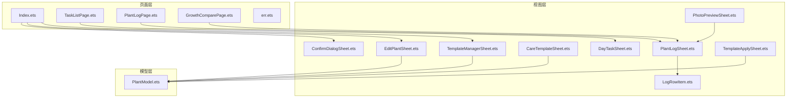

**图表来源**
- [Index.ets:13-18](file://entry/src/main/ets/pages/Index.ets#L13-L18)
- [TaskListPage.ets](file://entry/src/main/ets/pages/TaskListPage.ets#L3)
- [PlantLogSheet.ets:1-384](file://entry/src/main/ets/view/PlantLogSheet.ets#L1-L384)
- [LogRowItem.ets:1-272](file://entry/src/main/ets/view/LogRowItem.ets#L1-L272)
- [PhotoPreviewSheet.ets:1-223](file://entry/src/main/ets/view/PhotoPreviewSheet.ets#L1-L223)
- [PlantModel.ets:1-166](file://entry/src/main/ets/model/PlantModel.ets#L1-L166)

**章节来源**
- [Index.ets:13-18](file://entry/src/main/ets/pages/Index.ets#L13-L18)
- [TaskListPage.ets](file://entry/src/main/ets/pages/TaskListPage.ets#L3)
- [PlantLogSheet.ets:1-384](file://entry/src/main/ets/view/PlantLogSheet.ets#L1-L384)
- [LogRowItem.ets:1-272](file://entry/src/main/ets/view/LogRowItem.ets#L1-L272)
- [PhotoPreviewSheet.ets:1-223](file://entry/src/main/ets/view/PhotoPreviewSheet.ets#L1-L223)
- [PlantModel.ets:1-166](file://entry/src/main/ets/model/PlantModel.ets#L1-L166)

## 核心组件
- 日志行项（LogRowItem）：负责单条日志的展示与交互，支持高亮、附件网格、长按进入选择模式、预览与删除等。
- 确认对话框（ConfirmDialogSheet）：覆盖式确认弹窗，带遮罩渐显与按钮按压反馈。
- 每日任务弹窗（DayTaskSheet）：底部抽屉，展示当日任务、植物筛选、快速新建与删除确认。
- 模板管理弹窗（TemplateManagerSheet）：旧版周期模板管理，支持新建、编辑、删除与应用。
- 养护模板弹窗（CareTemplateSheet）：新版模板配置与生成任务，含预设与起始日期。
- 植物编辑抽屉（EditPlantSheet）：底部抽屉，表单编辑植物信息、周期任务快捷、模板入口与快速浇水。
- 日志弹窗（PlantLogSheet）：底部抽屉，日志增删改、批量操作、关键词高亮、图片预览。
- 模板应用弹窗（TemplateApplySheet）：选择模板、调整起始日期、预览生成任务并回调应用。
- 图片预览弹窗（PhotoPreviewSheet）：全屏大图预览，支持左右切换、缩放、删除与关闭。

**章节来源**
- [LogRowItem.ets:1-272](file://entry/src/main/ets/view/LogRowItem.ets#L1-L272)
- [ConfirmDialogSheet.ets:1-103](file://entry/src/main/ets/view/ConfirmDialogSheet.ets#L1-L103)
- [DayTaskSheet.ets:1-228](file://entry/src/main/ets/view/DayTaskSheet.ets#L1-L228)
- [TemplateManagerSheet.ets:1-249](file://entry/src/main/ets/view/TemplateManagerSheet.ets#L1-L249)
- [CareTemplateSheet.ets:1-217](file://entry/src/main/ets/view/CareTemplateSheet.ets#L1-L217)
- [EditPlantSheet.ets:1-264](file://entry/src/main/ets/view/EditPlantSheet.ets#L1-L264)
- [PlantLogSheet.ets:1-384](file://entry/src/main/ets/view/PlantLogSheet.ets#L1-L384)
- [TemplateApplySheet.ets:1-145](file://entry/src/main/ets/view/TemplateApplySheet.ets#L1-L145)
- [PhotoPreviewSheet.ets:1-223](file://entry/src/main/ets/view/PhotoPreviewSheet.ets#L1-L223)

## 架构总览
弹窗组件遵循统一的“遮罩+容器+动画”的结构模式，通过事件回调与参数传递实现与宿主页面的数据交换。生命周期采用 aboutToAppear 控制入场动画，build 渲染内容，事件回调驱动状态更新与数据持久化。

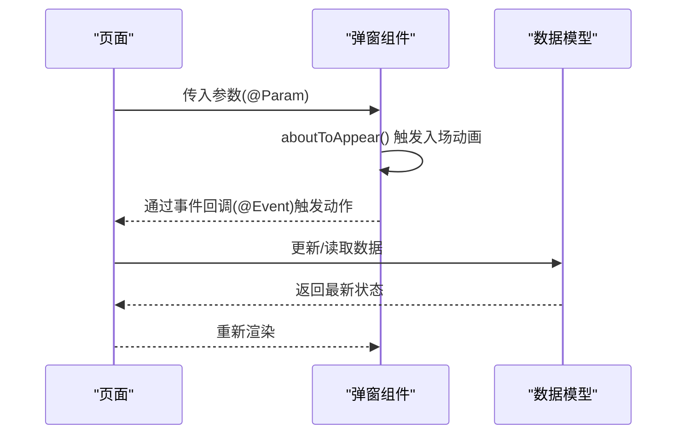

**图表来源**
- [ConfirmDialogSheet.ets:13-18](file://entry/src/main/ets/view/ConfirmDialogSheet.ets#L13-L18)
- [EditPlantSheet.ets:24-35](file://entry/src/main/ets/view/EditPlantSheet.ets#L24-L35)
- [DayTaskSheet.ets:14-21](file://entry/src/main/ets/view/DayTaskSheet.ets#L14-L21)
- [PlantLogSheet.ets:61-63](file://entry/src/main/ets/view/PlantLogSheet.ets#L61-L63)

## 详细组件分析

### 日志行项（LogRowItem）
- 职责：展示单条日志文本、附件缩略图网格、支持选择模式与长按进入选择、预览与删除附件。
- 数据绑定：通过 @Param 接收 PlantLog、附件数组、关键字高亮；通过 @Event 回调父页执行增删改与预览。
- 用户交互：点击、长按、触摸按压反馈；附件点击进入预览；删除图标触发删除。
- 状态管理：本地状态 pressedLog 控制按压缩放；根据关键字进行高亮片段拼接。
- 性能特性：附件网格高度自适应；图片缩略图优先；长列表使用 Grid/ForEach。

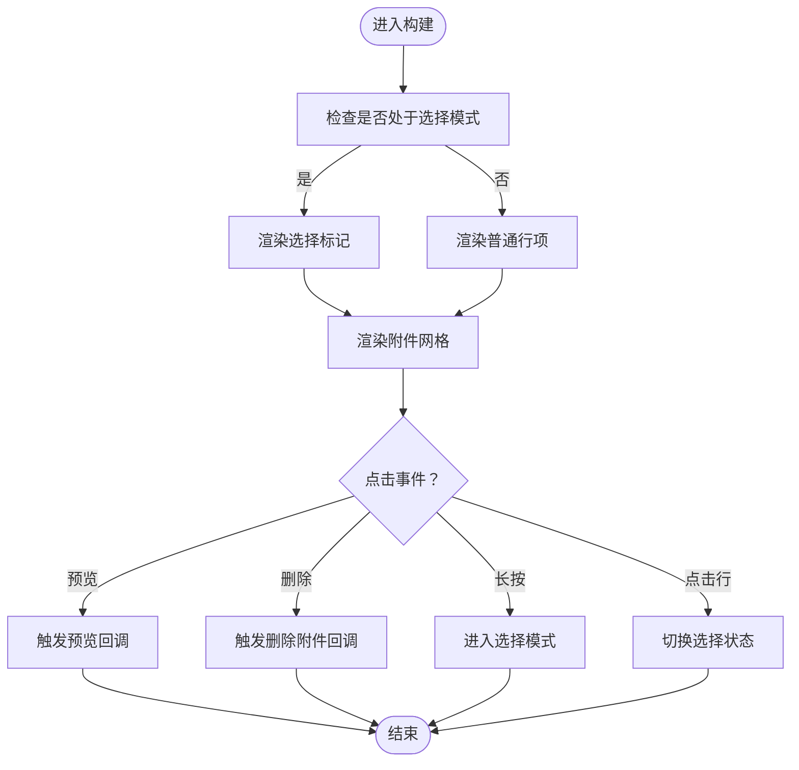

**图表来源**
- [LogRowItem.ets:72-134](file://entry/src/main/ets/view/LogRowItem.ets#L72-L134)
- [LogRowItem.ets:154-205](file://entry/src/main/ets/view/LogRowItem.ets#L154-L205)
- [LogRowItem.ets:242-270](file://entry/src/main/ets/view/LogRowItem.ets#L242-L270)

**章节来源**
- [LogRowItem.ets:1-272](file://entry/src/main/ets/view/LogRowItem.ets#L1-L272)

### 确认对话框（ConfirmDialogSheet）
- 职责：覆盖式确认弹窗，用于二次确认危险操作。
- 生命周期：aboutToAppear 触发遮罩透明度动画；build 渲染对话框与按钮。
- 交互：点击遮罩或“取消”触发取消回调；“确认”触发确认回调；按钮按压缩放与动画。
- 动画：遮罩渐显、对话框入场动画、按钮按压反馈。

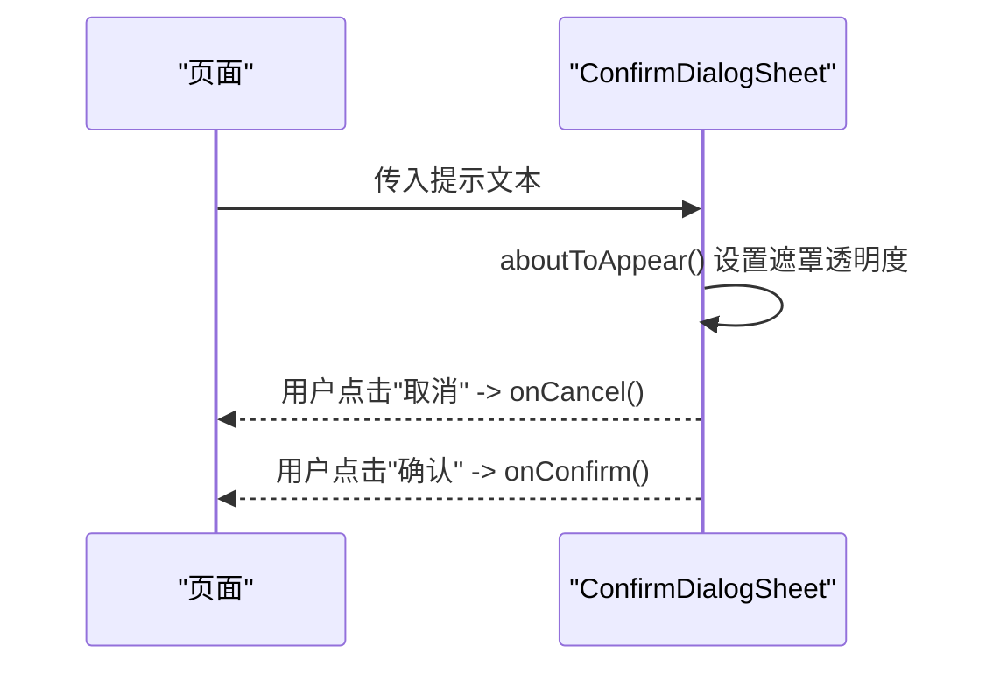

**图表来源**
- [ConfirmDialogSheet.ets:13-18](file://entry/src/main/ets/view/ConfirmDialogSheet.ets#L13-L18)
- [ConfirmDialogSheet.ets:20-102](file://entry/src/main/ets/view/ConfirmDialogSheet.ets#L20-L102)

**章节来源**
- [ConfirmDialogSheet.ets:1-103](file://entry/src/main/ets/view/ConfirmDialogSheet.ets#L1-L103)

### 每日任务弹窗（DayTaskSheet）
- 职责：展示当日任务，支持植物筛选、快速新建、任务切换完成状态、删除确认。
- 数据绑定：接收日期、任务数组、植物数组；通过 @Event 回调切换状态、删除、快速新建。
- 交互：点击植物 Chip 切换选中；点击快速 Chip 触发 onQuickAdd；任务行点击切换完成状态或删除。
- 状态：默认选中首个植物；支持任务列表滚动与边缘效果。

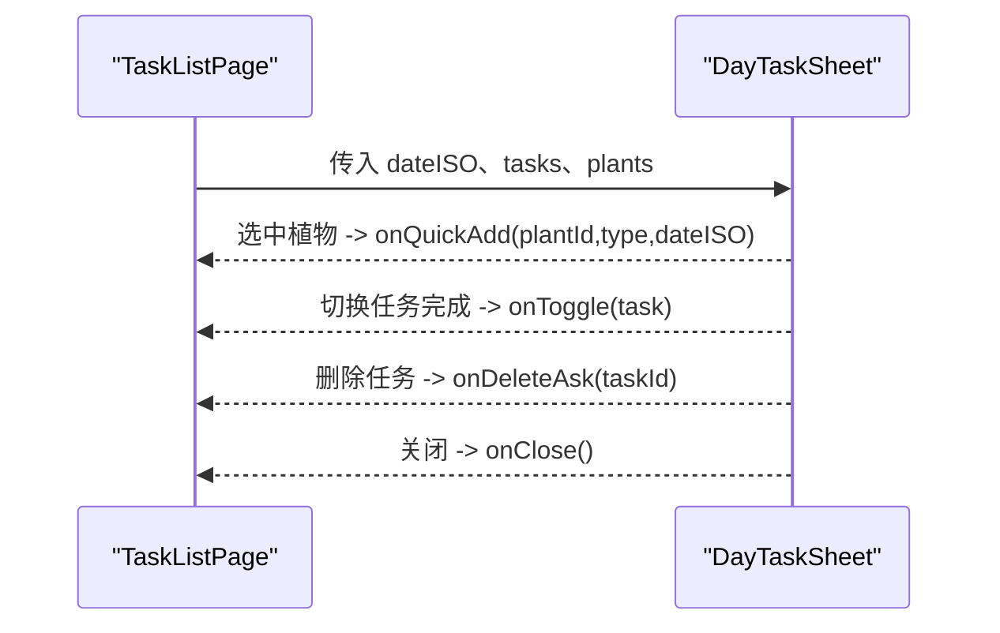

**图表来源**
- [DayTaskSheet.ets:4-11](file://entry/src/main/ets/view/DayTaskSheet.ets#L4-L11)
- [DayTaskSheet.ets:73-158](file://entry/src/main/ets/view/DayTaskSheet.ets#L73-L158)
- [TaskListPage.ets](file://entry/src/main/ets/pages/TaskListPage.ets#L316)

**章节来源**
- [DayTaskSheet.ets:1-228](file://entry/src/main/ets/view/DayTaskSheet.ets#L1-L228)
- [TaskListPage.ets](file://entry/src/main/ets/pages/TaskListPage.ets#L316)

### 模板管理弹窗（TemplateManagerSheet）
- 职责：管理旧版周期模板（PlanTpl），支持新建、编辑、删除与应用。
- 状态：showCreate 控制新建表单显隐；editingId 与编辑草稿字段避免污染列表数据。
- 交互：点击“新建模板”切换表单；点击“应用/编辑/删除”触发对应回调；数字输入安全解析。
- 数据：模板列表通过 @Param 注入；回调 onCreate/onUpdate/onDelete/onApply。

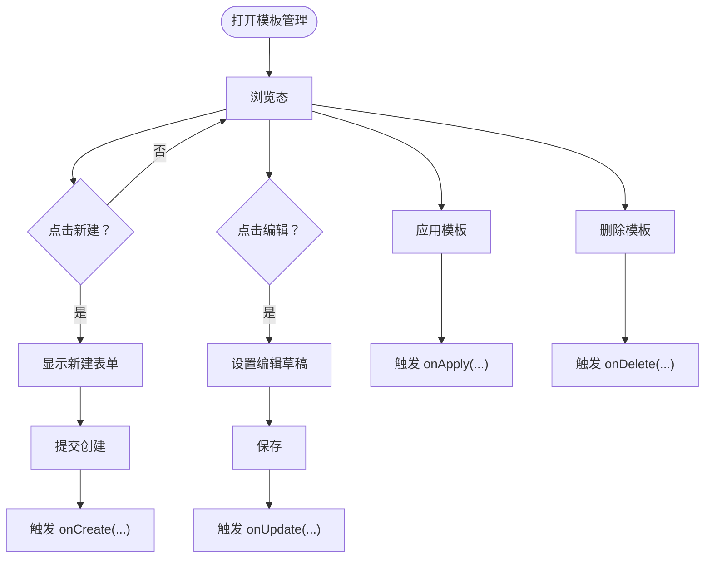

**图表来源**
- [TemplateManagerSheet.ets:12-46](file://entry/src/main/ets/view/TemplateManagerSheet.ets#L12-L46)
- [TemplateManagerSheet.ets:48-110](file://entry/src/main/ets/view/TemplateManagerSheet.ets#L48-L110)
- [TemplateManagerSheet.ets:156-229](file://entry/src/main/ets/view/TemplateManagerSheet.ets#L156-L229)

**章节来源**
- [TemplateManagerSheet.ets:1-249](file://entry/src/main/ets/view/TemplateManagerSheet.ets#L1-L249)
- [PlantModel.ets:24-40](file://entry/src/main/ets/model/PlantModel.ets#L24-L40)

### 养护模板弹窗（CareTemplateSheet）
- 职责：配置新版养护模板，生成任务计划（浇水/施肥/修剪）。
- 交互：预设 Chip 快速填充；数字输入限制；起始日期默认今天；生成任务触发 onApply。
- 数据：模板参数（间隔天数、次数、生成天数）通过草稿字段维护；校验后回调。

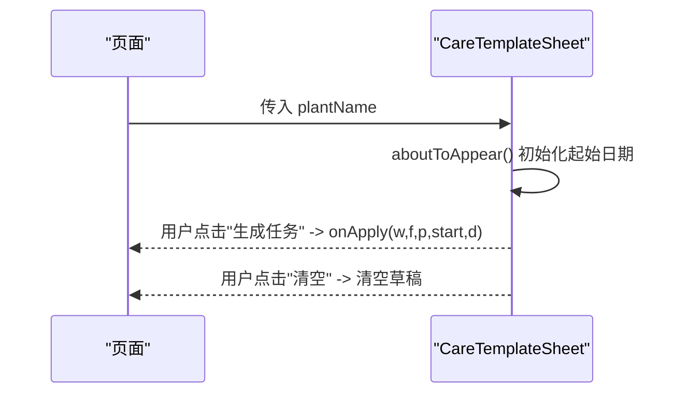

**图表来源**
- [CareTemplateSheet.ets:12-14](file://entry/src/main/ets/view/CareTemplateSheet.ets#L12-L14)
- [CareTemplateSheet.ets:16-158](file://entry/src/main/ets/view/CareTemplateSheet.ets#L16-L158)
- [PlantModel.ets:150-163](file://entry/src/main/ets/model/PlantModel.ets#L150-L163)

**章节来源**
- [CareTemplateSheet.ets:1-217](file://entry/src/main/ets/view/CareTemplateSheet.ets#L1-L217)
- [PlantModel.ets:150-163](file://entry/src/main/ets/model/PlantModel.ets#L150-L163)

### 植物编辑抽屉（EditPlantSheet）
- 职责：底部抽屉，编辑植物信息、周期任务快捷、模板入口、快速浇水。
- 生命周期：aboutToAppear 设置键盘避让模式并触发展开动画；aboutToDisappear 恢复键盘模式。
- 交互：保存/删除/关闭按钮；周期任务快捷；模板入口；快速浇水。

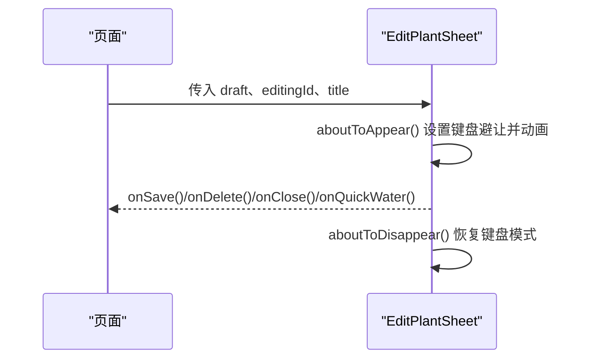

**图表来源**
- [EditPlantSheet.ets:24-35](file://entry/src/main/ets/view/EditPlantSheet.ets#L24-L35)
- [EditPlantSheet.ets:37-207](file://entry/src/main/ets/view/EditPlantSheet.ets#L37-L207)

**章节来源**
- [EditPlantSheet.ets:1-264](file://entry/src/main/ets/view/EditPlantSheet.ets#L1-L264)

### 日志弹窗（PlantLogSheet）
- 职责：底部抽屉，管理植物日志，支持新增、排序、多选删除、关键词高亮、图片预览。
- 数据绑定：接收 logs、photos、keyword；通过 @Event 回调新增、删除、预览、批量删除。
- 状态：selectMode、selected、sortAsc、previewVisible、pressedLog 等。
- 交互：新增日志、切换排序、长按进入多选、删除按钮批量删除、预览图片。

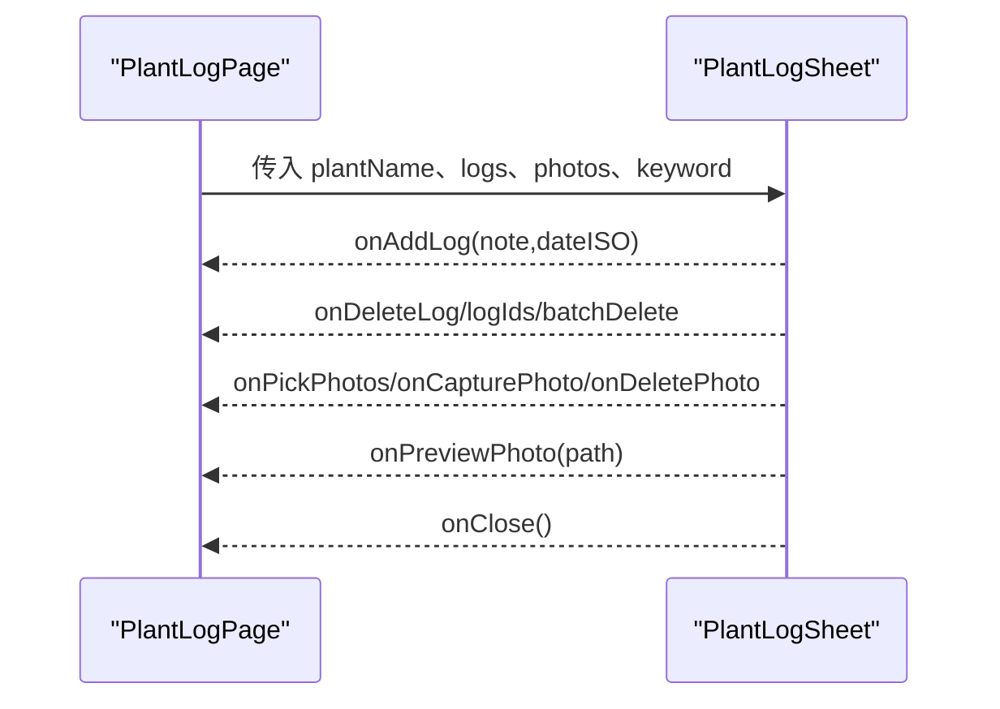

**图表来源**
- [PlantLogSheet.ets:36-50](file://entry/src/main/ets/view/PlantLogSheet.ets#L36-L50)
- [PlantLogSheet.ets:65-283](file://entry/src/main/ets/view/PlantLogSheet.ets#L65-L283)
- [LogRowItem.ets:216-246](file://entry/src/main/ets/view/LogRowItem.ets#L216-L246)

**章节来源**
- [PlantLogSheet.ets:1-384](file://entry/src/main/ets/view/PlantLogSheet.ets#L1-L384)
- [LogRowItem.ets:1-272](file://entry/src/main/ets/view/LogRowItem.ets#L1-L272)

### 模板应用弹窗（TemplateApplySheet）
- 职责：选择模板、调整起始日期、预览生成任务并回调应用。
- 逻辑：预览列表仅本地展开，不落库；计算起始日期偏移；排序输出预览。
- 交互：模板 Chip 选择；输入起始日期；点击“复制到该植物”触发 onApply。

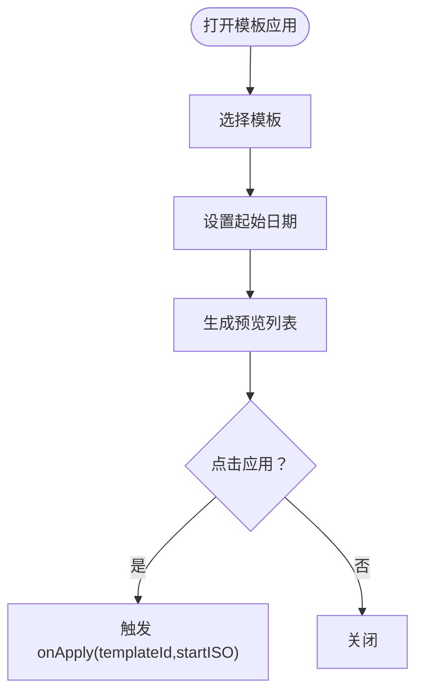

**图表来源**
- [TemplateApplySheet.ets:14-24](file://entry/src/main/ets/view/TemplateApplySheet.ets#L14-L24)
- [TemplateApplySheet.ets:44-60](file://entry/src/main/ets/view/TemplateApplySheet.ets#L44-L60)
- [TemplateApplySheet.ets:62-143](file://entry/src/main/ets/view/TemplateApplySheet.ets#L62-L143)

**章节来源**
- [TemplateApplySheet.ets:1-145](file://entry/src/main/ets/view/TemplateApplySheet.ets#L1-L145)
- [PlantModel.ets:150-163](file://entry/src/main/ets/model/PlantModel.ets#L150-L163)

### 图片预览弹窗（PhotoPreviewSheet）
- 职责：全屏大图预览，支持左右切换、缩放、删除与关闭。
- 生命周期：aboutToAppear 初始化索引与预览动画；支持越界保护。
- 动画：切换时先滑出再滑入，缩放平滑过渡；点击图片切换缩放级别。

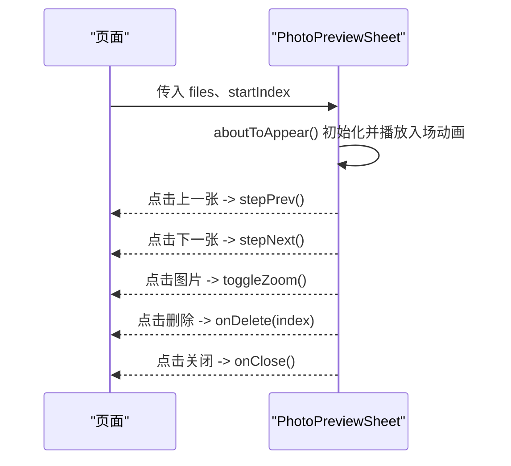

**图表来源**
- [PhotoPreviewSheet.ets:17-34](file://entry/src/main/ets/view/PhotoPreviewSheet.ets#L17-L34)
- [PhotoPreviewSheet.ets:52-92](file://entry/src/main/ets/view/PhotoPreviewSheet.ets#L52-L92)
- [PhotoPreviewSheet.ets:102-221](file://entry/src/main/ets/view/PhotoPreviewSheet.ets#L102-L221)

**章节来源**
- [PhotoPreviewSheet.ets:1-223](file://entry/src/main/ets/view/PhotoPreviewSheet.ets#L1-L223)

## 依赖关系分析
- 组件间依赖：PlantLogSheet 依赖 LogRowItem；PhotoPreviewSheet 与 PlantLogSheet 协作实现图片预览；Index/TaskListPage 等页面作为宿主负责传参与事件回调。
- 模型依赖：各弹窗组件与 PlantModel 的数据结构保持解耦，通过 @Param/@Event 传递数据与回调。
- 页面集成：Index 引入 ConfirmDialogSheet、EditPlantSheet、TemplateManagerSheet；TaskListPage 引入 DayTaskSheet；PlantLogPage 引入 PlantLogSheet。

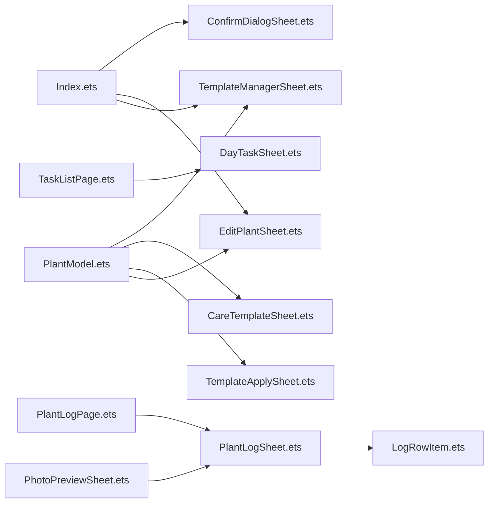

**图表来源**
- [Index.ets:13-18](file://entry/src/main/ets/pages/Index.ets#L13-L18)
- [TaskListPage.ets](file://entry/src/main/ets/pages/TaskListPage.ets#L3)
- [PlantLogSheet.ets:1-384](file://entry/src/main/ets/view/PlantLogSheet.ets#L1-L384)
- [LogRowItem.ets:1-272](file://entry/src/main/ets/view/LogRowItem.ets#L1-L272)
- [PhotoPreviewSheet.ets:1-223](file://entry/src/main/ets/view/PhotoPreviewSheet.ets#L1-L223)
- [PlantModel.ets:1-166](file://entry/src/main/ets/model/PlantModel.ets#L1-L166)

**章节来源**
- [Index.ets:13-18](file://entry/src/main/ets/pages/Index.ets#L13-L18)
- [TaskListPage.ets](file://entry/src/main/ets/pages/TaskListPage.ets#L3)
- [PlantLogSheet.ets:1-384](file://entry/src/main/ets/view/PlantLogSheet.ets#L1-L384)
- [LogRowItem.ets:1-272](file://entry/src/main/ets/view/LogRowItem.ets#L1-L272)
- [PhotoPreviewSheet.ets:1-223](file://entry/src/main/ets/view/PhotoPreviewSheet.ets#L1-L223)
- [PlantModel.ets:1-166](file://entry/src/main/ets/model/PlantModel.ets#L1-L166)

## 性能考量
- 列表渲染：日志与任务列表使用 List/ForEach，避免不必要的重绘；附件网格按数量动态计算高度，减少布局抖动。
- 动画与过渡：统一使用 animateTo 控制入场与切换动画，曲线与时长保持一致，提升流畅度。
- 键盘避让：编辑抽屉在 aboutToAppear 设置 KeyboardAvoidMode.RESIZE，避免输入框被遮挡。
- 事件节流：确认对话框与按钮按压状态通过本地状态控制缩放与动画，避免频繁重绘。

[本节为通用指导，无需列出具体文件来源]

## 故障排查指南
- 弹窗不显示或遮罩不生效
  - 检查页面是否正确引入并实例化弹窗组件；确认 @Param 参数是否传入。
  - 参考：[Index.ets:1067-1149](file://entry/src/main/ets/pages/Index.ets#L1067-L1149)
- 点击遮罩无法关闭
  - 确认遮罩层 onClick 是否绑定 onClose 或对应回调。
  - 参考：[ConfirmDialogSheet.ets:27-29](file://entry/src/main/ets/view/ConfirmDialogSheet.ets#L27-L29)
- 图片预览索引越界
  - 检查 startIndex 是否在有效范围内，组件内已做越界保护。
  - 参考：[PhotoPreviewSheet.ets:17-27](file://entry/src/main/ets/view/PhotoPreviewSheet.ets#L17-L27)
- 模板应用预览为空
  - 检查模板规则与起始日期是否合法；确保模板规则中的 horizonDays 与 intervalDays 合理。
  - 参考：[TemplateApplySheet.ets:44-60](file://entry/src/main/ets/view/TemplateApplySheet.ets#L44-L60)
- 键盘遮挡输入框
  - 确保编辑抽屉在 aboutToAppear 设置 KeyboardAvoidMode.RESIZE，在 aboutToDisappear 恢复 NONE。
  - 参考：[EditPlantSheet.ets:24-35](file://entry/src/main/ets/view/EditPlantSheet.ets#L24-L35)

**章节来源**
- [Index.ets:1067-1149](file://entry/src/main/ets/pages/Index.ets#L1067-L1149)
- [ConfirmDialogSheet.ets:27-29](file://entry/src/main/ets/view/ConfirmDialogSheet.ets#L27-L29)
- [PhotoPreviewSheet.ets:17-27](file://entry/src/main/ets/view/PhotoPreviewSheet.ets#L17-L27)
- [TemplateApplySheet.ets:44-60](file://entry/src/main/ets/view/TemplateApplySheet.ets#L44-L60)
- [EditPlantSheet.ets:24-35](file://entry/src/main/ets/view/EditPlantSheet.ets#L24-L35)

## 结论
弹窗组件体系以统一的遮罩+容器+动画模式实现一致的交互体验，通过 @Param/@Event 实现与页面的松耦合数据交换。日志行项、确认对话框、每日任务弹窗、模板管理弹窗、养护模板弹窗、植物编辑抽屉、日志弹窗与图片预览弹窗覆盖了日常操作的主要场景。建议在扩展新弹窗时遵循现有模式，保持动画一致性与事件回调清晰化，以提升整体用户体验与可维护性。

[本节为总结性内容，无需列出具体文件来源]

## 附录

### 使用示例与最佳实践
- 在页面中引入并实例化弹窗组件，传入必要参数，绑定回调函数。
  - 示例路径参考：
    - [Index.ets:1067-1149](file://entry/src/main/ets/pages/Index.ets#L1067-L1149)
    - [TaskListPage.ets](file://entry/src/main/ets/pages/TaskListPage.ets#L316)
    - [err.ets:66-68](file://entry/src/main/ets/viewmodel/err.ets#L66-L68)
- 事件回调命名建议：
  - onConfirm/onCancel：确认对话框
  - onToggle/onDeleteAsk/onQuickAdd/onClose：每日任务弹窗
  - onCreate/onUpdate/onDelete/onApply：模板管理弹窗
  - onSave/onDelete/onClose/onQuickWater/onOpenTpl/onOpenLogs：植物编辑抽屉
  - onAddLog/onDeleteLog/onBatchDeleteLogs/onPickPhotos/onCapturePhoto/onDeletePhoto/onPreviewPhoto/onClose：日志弹窗
  - onApply/onClose：模板应用弹窗
  - onDelete/onClose：图片预览弹窗
- 样式与主题适配建议：
  - 统一圆角、阴影与字体大小；颜色采用主题色变量；遮罩透明度与背景色保持一致。
  - 动画曲线与时长保持一致，增强一致性体验。
- 生命周期与动画：
  - 使用 aboutToAppear 控制入场动画；使用 animateTo 控制过渡；注意在 aboutToDisappear 恢复环境（如键盘避让模式）。

**章节来源**
- [Index.ets:1067-1149](file://entry/src/main/ets/pages/Index.ets#L1067-L1149)
- [TaskListPage.ets](file://entry/src/main/ets/pages/TaskListPage.ets#L316)
- [err.ets:66-68](file://entry/src/main/ets/viewmodel/err.ets#L66-L68)