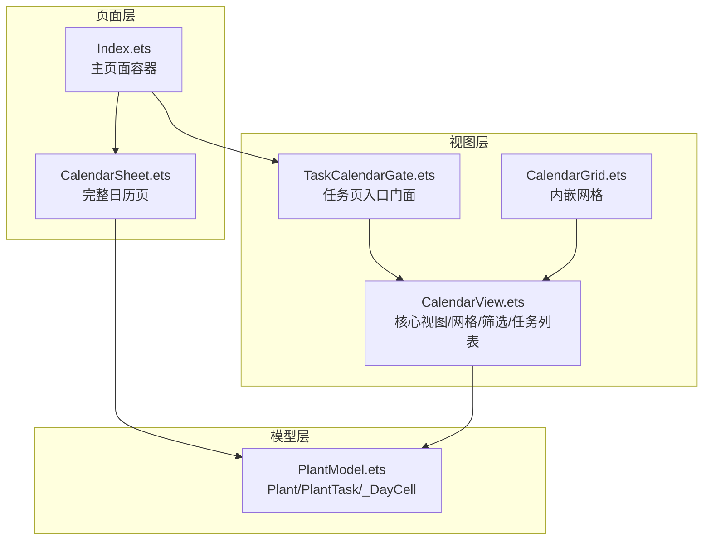
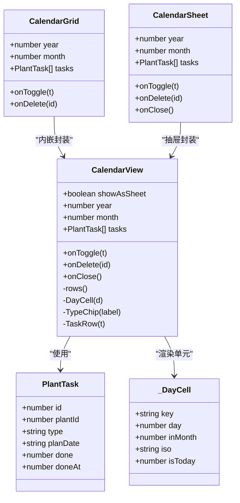
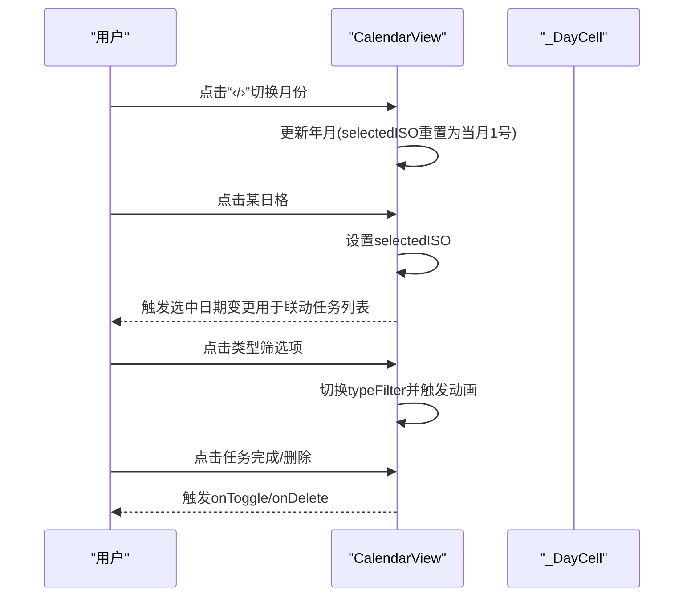
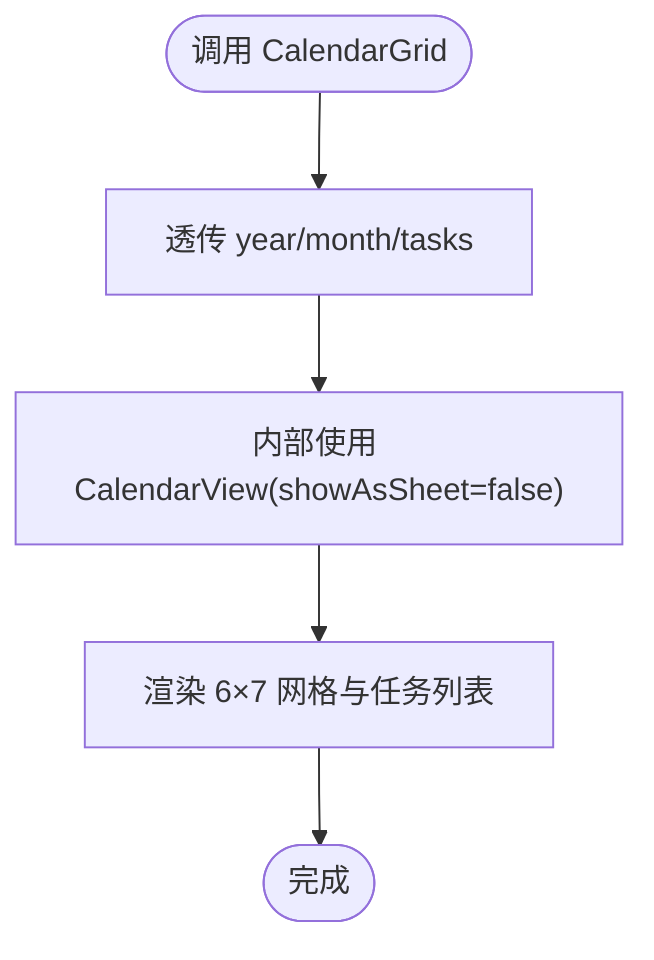
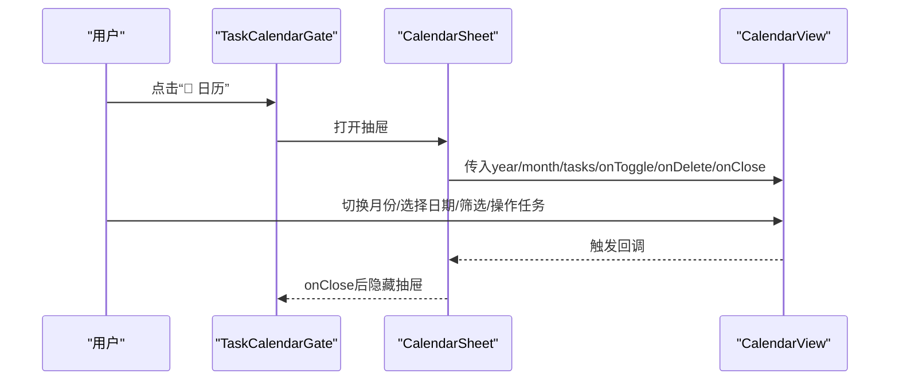
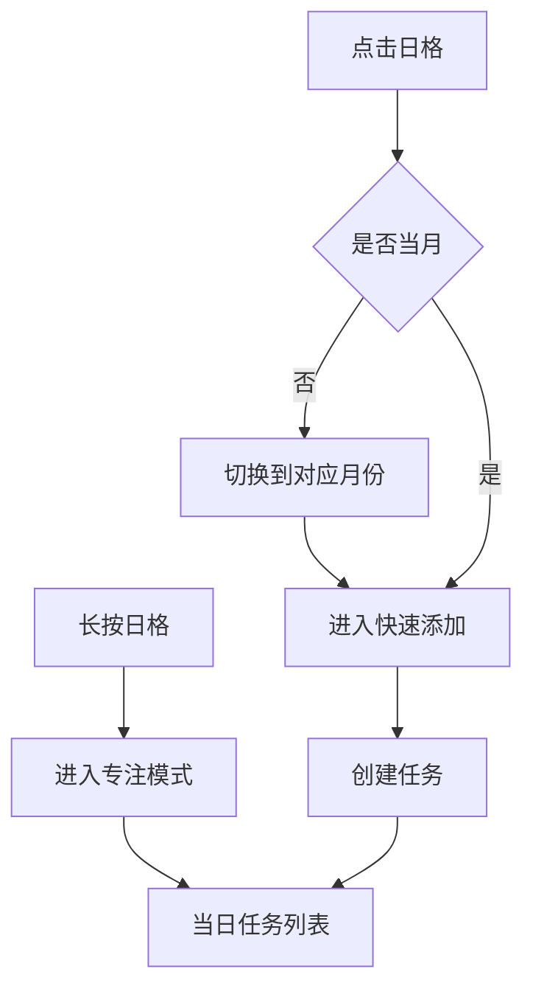
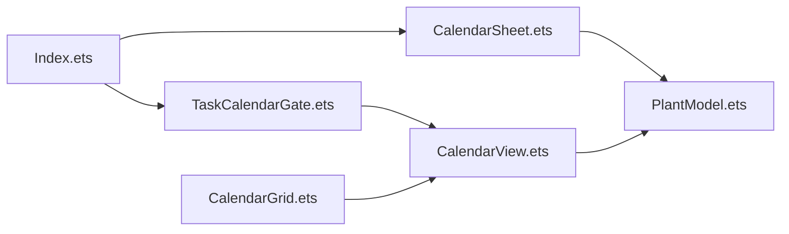

# 日历组件

<cite>
**本文档引用的文件**
- [CalendarGrid.ets](file://entry/src/main/ets/view/CalendarGrid.ets)
- [CalendarView.ets](file://entry/src/main/ets/view/CalendarView.ets)
- [CalendarSheet.ets](file://entry/src/main/ets/pages/CalendarSheet.ets)
- [TaskCalendarGate.ets](file://entry/src/main/ets/view/TaskCalendarGate.ets)
- [PlantModel.ets](file://entry/src/main/ets/model/PlantModel.ets)
- [Index.ets](file://entry/src/main/ets/pages/Index.ets)
</cite>

## 目录
1. [简介](#简介)
2. [项目结构](#项目结构)
3. [核心组件](#核心组件)
4. [架构总览](#架构总览)
5. [组件详解](#组件详解)
6. [依赖关系分析](#依赖关系分析)
7. [性能考量](#性能考量)
8. [故障排查指南](#故障排查指南)
9. [结论](#结论)
10. [附录：使用示例与最佳实践](#附录使用示例与最佳实践)

## 简介
本文件系统性梳理 PlantDiary 应用中的日历组件体系，重点覆盖以下内容：
- CalendarGrid 与 CalendarView 的设计与实现差异
- 日历网格组件的日程显示、日期选择与事件标记
- 日历视图组件的月份切换、日期导航与视图模式切换机制
- 组件的数据绑定、事件处理与用户交互模式
- 样式定制与主题适配建议
- 完整使用示例与最佳实践

## 项目结构
日历相关代码主要分布在以下模块：
- 视图层：CalendarGrid、CalendarView、CalendarSheet
- 页面层：Index、CalendarSheet 页面
- 门面/入口：TaskCalendarGate
- 数据模型：PlantModel（Plant、PlantTask、_DayCell 等）

图表来源
- [Index.ets:951-978](file://entry/src/main/ets/pages/Index.ets#L951-L978)
- [TaskCalendarGate.ets:39-59](file://entry/src/main/ets/view/TaskCalendarGate.ets#L39-L59)
- [CalendarView.ets:511-565](file://entry/src/main/ets/view/CalendarView.ets#L511-L565)
- [CalendarGrid.ets:166-351](file://entry/src/main/ets/view/CalendarGrid.ets#L166-L351)
- [PlantModel.ets:43-106](file://entry/src/main/ets/model/PlantModel.ets#L43-L106)

章节来源
- [Index.ets:951-978](file://entry/src/main/ets/pages/Index.ets#L951-L978)
- [TaskCalendarGate.ets:22-61](file://entry/src/main/ets/view/TaskCalendarGate.ets#L22-L61)
- [CalendarView.ets:5-80](file://entry/src/main/ets/view/CalendarView.ets#L5-L80)
- [CalendarGrid.ets:4-30](file://entry/src/main/ets/view/CalendarGrid.ets#L4-L30)
- [PlantModel.ets:43-106](file://entry/src/main/ets/model/PlantModel.ets#L43-L106)

## 核心组件
- CalendarView：核心日历视图，支持“抽屉模式/内嵌模式”，提供月份切换、日期选择、类型筛选、当日任务列表等能力。内部以 6×7 网格渲染日格，每个日格包含任务指示点与今日标记。
- CalendarGrid：基于 CalendarView 的内嵌封装，简化调用，适合在其他页面中直接嵌入。
- CalendarSheet：基于 CalendarView 的抽屉封装，适合作为独立弹层使用。
- CalendarSheet 页面：完整的日历页，集成了“月视图、快速添加、筛选、当日任务列表”，并提供长按专注、点击快速添加等交互。
- TaskCalendarGate：任务列表页的入口门面，提供“📅 日历”入口，打开抽屉式日历。

章节来源
- [CalendarView.ets:5-80](file://entry/src/main/ets/view/CalendarView.ets#L5-L80)
- [CalendarGrid.ets:511-536](file://entry/src/main/ets/view/CalendarGrid.ets#L511-L536)
- [CalendarSheet.ets:17-52](file://entry/src/main/ets/pages/CalendarSheet.ets#L17-L52)
- [TaskCalendarGate.ets:6-21](file://entry/src/main/ets/view/TaskCalendarGate.ets#L6-L21)

## 架构总览
CalendarView 是核心，CalendarGrid/CalendarSheet 为其两种使用形态的包装器；CalendarSheet 页面在视图层之上增加了筛选、快速添加、专注模式等增强交互；TaskCalendarGate 提供从任务页到日历抽屉的入口。

图表来源
- [CalendarView.ets:5-510](file://entry/src/main/ets/view/CalendarView.ets#L5-L510)
- [CalendarGrid.ets:511-536](file://entry/src/main/ets/view/CalendarGrid.ets#L511-L536)
- [CalendarSheet.ets:539-565](file://entry/src/main/ets/view/CalendarView.ets#L539-L565)
- [PlantModel.ets:43-106](file://entry/src/main/ets/model/PlantModel.ets#L43-L106)

## 组件详解

### CalendarView：核心日历视图
- 视图模式
  - 抽屉模式：带背景遮罩、底部弹出，适合独立弹层场景
  - 内嵌模式：直接铺在父布局中，适合与其他内容组合
- 月份切换与日期导航
  - 通过“‹/›”按钮切换月份，内部维护当前年月与选中日期
  - 选中日期变化时触发外部回调，便于联动任务列表
- 日格渲染与事件标记
  - 使用 6×7 网格，空位填充占位格
  - 每个日格显示日期数字、今日标记与任务指示点
  - 支持按下反馈动画与触摸状态管理
- 筛选与任务列表
  - 类型筛选（全部/浇水/施肥/修剪）
  - 当日任务列表，支持完成状态切换与删除
- 数据绑定与事件
  - 输入参数：showAsSheet、year、month、tasks、onToggle、onDelete、onClose
  - 输出事件：onToggle、onDelete、onClose（抽屉模式下还负责关闭）

图表来源
- [CalendarView.ets:480-502](file://entry/src/main/ets/view/CalendarView.ets#L480-L502)
- [CalendarView.ets:266-282](file://entry/src/main/ets/view/CalendarView.ets#L266-L282)
- [CalendarView.ets:286-304](file://entry/src/main/ets/view/CalendarView.ets#L286-L304)
- [CalendarView.ets:307-344](file://entry/src/main/ets/view/CalendarView.ets#L307-L344)

章节来源
- [CalendarView.ets:31-80](file://entry/src/main/ets/view/CalendarView.ets#L31-L80)
- [CalendarView.ets:83-210](file://entry/src/main/ets/view/CalendarView.ets#L83-L210)
- [CalendarView.ets:218-283](file://entry/src/main/ets/view/CalendarView.ets#L218-L283)
- [CalendarView.ets:285-344](file://entry/src/main/ets/view/CalendarView.ets#L285-L344)
- [CalendarView.ets:346-510](file://entry/src/main/ets/view/CalendarView.ets#L346-L510)

### CalendarGrid：内嵌网格
- 设计定位：对 CalendarView 的轻量封装，适合在其他页面中直接嵌入
- 关键特性
  - 接收 year、month、tasks，并透传 onToggle、onDelete
  - 内嵌模式下无需 onClose
- 适用场景：任务页、卡片页等需要“小而美”的日历网格

图表来源
- [CalendarGrid.ets:511-536](file://entry/src/main/ets/view/CalendarGrid.ets#L511-L536)
- [CalendarView.ets:511-536](file://entry/src/main/ets/view/CalendarView.ets#L511-L536)

章节来源
- [CalendarGrid.ets:511-536](file://entry/src/main/ets/view/CalendarGrid.ets#L511-L536)

### CalendarSheet：抽屉式日历
- 设计定位：对 CalendarView 的抽屉封装，适合独立弹层使用
- 关键特性
  - 支持背景遮罩与滑动关闭
  - 透传 onToggle、onDelete、onClose
- 适用场景：从任务页打开的独立日历面板

图表来源
- [TaskCalendarGate.ets:39-59](file://entry/src/main/ets/view/TaskCalendarGate.ets#L39-L59)
- [CalendarView.ets:539-565](file://entry/src/main/ets/view/CalendarView.ets#L539-L565)

章节来源
- [TaskCalendarGate.ets:39-59](file://entry/src/main/ets/view/TaskCalendarGate.ets#L39-L59)
- [CalendarView.ets:539-565](file://entry/src/main/ets/view/CalendarView.ets#L539-L565)

### CalendarSheet 页面：完整日历页
- 设计定位：完整的日历页面，集成“月视图、快速添加、筛选、当日任务列表”
- 关键特性
  - 专注模式：长按某日进入“仅看当天”
  - 快速添加：点击某日进入快速添加面板，选择植物与类型后创建任务
  - 筛选：完成状态筛选（全部/未完成/已完成）与类型筛选
  - 当日任务列表：复用顶部筛选条件，支持完成状态切换与删除
- 交互细节
  - 点击日格：若为当月则进入快速添加；否则切换月份后再进入
  - 长按日格：进入专注模式
  - 任务列表排序：未完成在前、已完成在后，同类按 id 逆序

图表来源
- [CalendarSheet.ets:255-261](file://entry/src/main/ets/pages/CalendarSheet.ets#L255-L261)
- [CalendarSheet.ets:264-296](file://entry/src/main/ets/pages/CalendarSheet.ets#L264-L296)
- [CalendarSheet.ets:383-386](file://entry/src/main/ets/pages/CalendarSheet.ets#L383-L386)
- [CalendarSheet.ets:476-492](file://entry/src/main/ets/pages/CalendarSheet.ets#L476-L492)

章节来源
- [CalendarSheet.ets:54-175](file://entry/src/main/ets/pages/CalendarSheet.ets#L54-L175)
- [CalendarSheet.ets:220-261](file://entry/src/main/ets/pages/CalendarSheet.ets#L220-L261)
- [CalendarSheet.ets:264-296](file://entry/src/main/ets/pages/CalendarSheet.ets#L264-L296)
- [CalendarSheet.ets:383-386](file://entry/src/main/ets/pages/CalendarSheet.ets#L383-L386)
- [CalendarSheet.ets:476-492](file://entry/src/main/ets/pages/CalendarSheet.ets#L476-L492)

### 数据模型与绑定
- PlantTask：任务实体，包含 plantId、type、planDate、done 等
- _DayCell：日格渲染单元，包含 day、inMonth、iso、isToday 等
- CalendarView/CalendarGrid/CalendarSheet 通过 tasks 参数接收 PlantTask 列表，内部进行筛选、统计与渲染

章节来源
- [PlantModel.ets:43-59](file://entry/src/main/ets/model/PlantModel.ets#L43-L59)
- [PlantModel.ets:92-106](file://entry/src/main/ets/model/PlantModel.ets#L92-L106)
- [CalendarView.ets:10-17](file://entry/src/main/ets/view/CalendarView.ets#L10-L17)
- [CalendarGrid.ets:6-17](file://entry/src/main/ets/view/CalendarGrid.ets#L6-L17)

## 依赖关系分析
- 组件耦合
  - CalendarGrid/CalendarSheet 依赖 CalendarView，耦合度低，职责清晰
  - CalendarSheet 页面与 PlantModel 强关联，用于植物名称解析与任务筛选
- 外部依赖
  - PlantModel 提供数据结构与工具函数
  - Index 页面将 CalendarSheet1 作为标签页内容，形成页面级集成
- 循环依赖
  - 未发现循环依赖，调用方向自上而下

图表来源
- [Index.ets:951-978](file://entry/src/main/ets/pages/Index.ets#L951-L978)
- [TaskCalendarGate.ets:39-59](file://entry/src/main/ets/view/TaskCalendarGate.ets#L39-L59)
- [CalendarView.ets:511-565](file://entry/src/main/ets/view/CalendarView.ets#L511-L565)
- [CalendarGrid.ets:511-536](file://entry/src/main/ets/view/CalendarGrid.ets#L511-L536)
- [CalendarSheet.ets:17-52](file://entry/src/main/ets/pages/CalendarSheet.ets#L17-L52)
- [PlantModel.ets:43-106](file://entry/src/main/ets/model/PlantModel.ets#L43-L106)

章节来源
- [Index.ets:951-978](file://entry/src/main/ets/pages/Index.ets#L951-L978)
- [TaskCalendarGate.ets:39-59](file://entry/src/main/ets/view/TaskCalendarGate.ets#L39-L59)
- [CalendarView.ets:511-565](file://entry/src/main/ets/view/CalendarView.ets#L511-L565)
- [CalendarGrid.ets:511-536](file://entry/src/main/ets/view/CalendarGrid.ets#L511-L536)
- [CalendarSheet.ets:17-52](file://entry/src/main/ets/pages/CalendarSheet.ets#L17-L52)
- [PlantModel.ets:43-106](file://entry/src/main/ets/model/PlantModel.ets#L43-L106)

## 性能考量
- 渲染优化
  - CalendarView 使用固定 6×7 网格，避免动态尺寸计算，提升渲染稳定性
  - 日格使用占位空格而非条件渲染，降低布局抖动
- 事件与动画
  - 按下反馈采用 scale 动画，时长短、曲线平滑，避免卡顿
  - 类型筛选与任务切换使用 animateTo，保证流畅过渡
- 数据访问
  - 通过 tasksOnDate/filteredTasksBySelected 等方法进行局部筛选，避免全量重排
- 建议
  - 大数据量时，优先在上游聚合统计（如按日期汇总任务数与完成数），减少渲染层重复计算
  - 对于频繁切换月份，可考虑缓存 _DayCell 列表，避免重复构建

## 故障排查指南
- 无法切换月份
  - 检查 prevMonth/nextMonth 是否正确更新年月与选中日期
  - 确认 selectedISO 是否被重置为当月1号
- 任务列表不更新
  - 确认 onToggle/onDelete 回调是否正确触发
  - 检查 filteredTasksBySelected 的筛选逻辑是否匹配 typeFilter
- 选中日期无效
  - 确认 onClick 设置 selectedISO 的分支与 ISO 格式
  - 检查 isTodayISO 的比较逻辑
- 样式异常
  - 检查颜色值与主题色板映射
  - 确认阴影、圆角、边距等样式属性是否与容器层级冲突

章节来源
- [CalendarView.ets:480-502](file://entry/src/main/ets/view/CalendarView.ets#L480-L502)
- [CalendarView.ets:464-478](file://entry/src/main/ets/view/CalendarView.ets#L464-L478)
- [CalendarView.ets:277-282](file://entry/src/main/ets/view/CalendarView.ets#L277-L282)
- [CalendarView.ets:433-435](file://entry/src/main/ets/view/CalendarView.ets#L433-L435)

## 结论
- CalendarView 提供了统一的日历核心能力，具备良好的扩展性与复用性
- CalendarGrid/CalendarSheet 通过轻量封装满足不同场景需求
- CalendarSheet 页面在视图层之上提供了丰富的交互与筛选能力
- 建议在数据层进行必要的聚合与缓存，以进一步提升性能与交互体验

## 附录：使用示例与最佳实践

### 使用示例
- 在任务页打开抽屉式日历
  - 参考路径：[TaskCalendarGate.ets:39-59](file://entry/src/main/ets/view/TaskCalendarGate.ets#L39-L59)
- 在主页面标签页中嵌入完整日历页
  - 参考路径：[Index.ets:951-978](file://entry/src/main/ets/pages/Index.ets#L951-L978)
- 在其他页面中嵌入内嵌网格
  - 参考路径：[CalendarGrid.ets:511-536](file://entry/src/main/ets/view/CalendarGrid.ets#L511-L536)

### 最佳实践
- 数据准备
  - 确保 tasks 为 PlantTask 数组，字段完整（planDate、type、done 等）
  - 在上游进行必要的聚合统计，减少渲染层重复计算
- 交互一致性
  - 保持“切换月份/选择日期/筛选/任务操作”的回调链路一致
  - 任务列表与日历视图的筛选条件保持一致，避免语义割裂
- 样式与主题
  - 使用统一的颜色值与阴影配置，确保在浅色/深色主题下均可用
  - 对关键交互（选中、完成、今日）使用明确的视觉反馈
- 性能优化
  - 控制日格数量与渲染复杂度，避免深层嵌套
  - 对高频操作（切换月份、筛选）使用节流/防抖策略