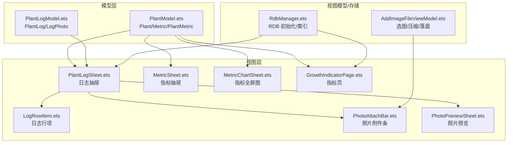
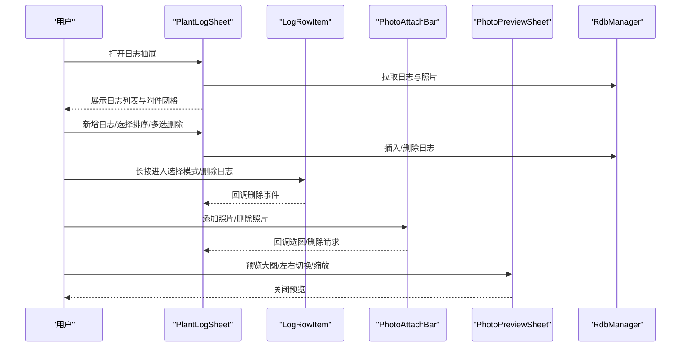
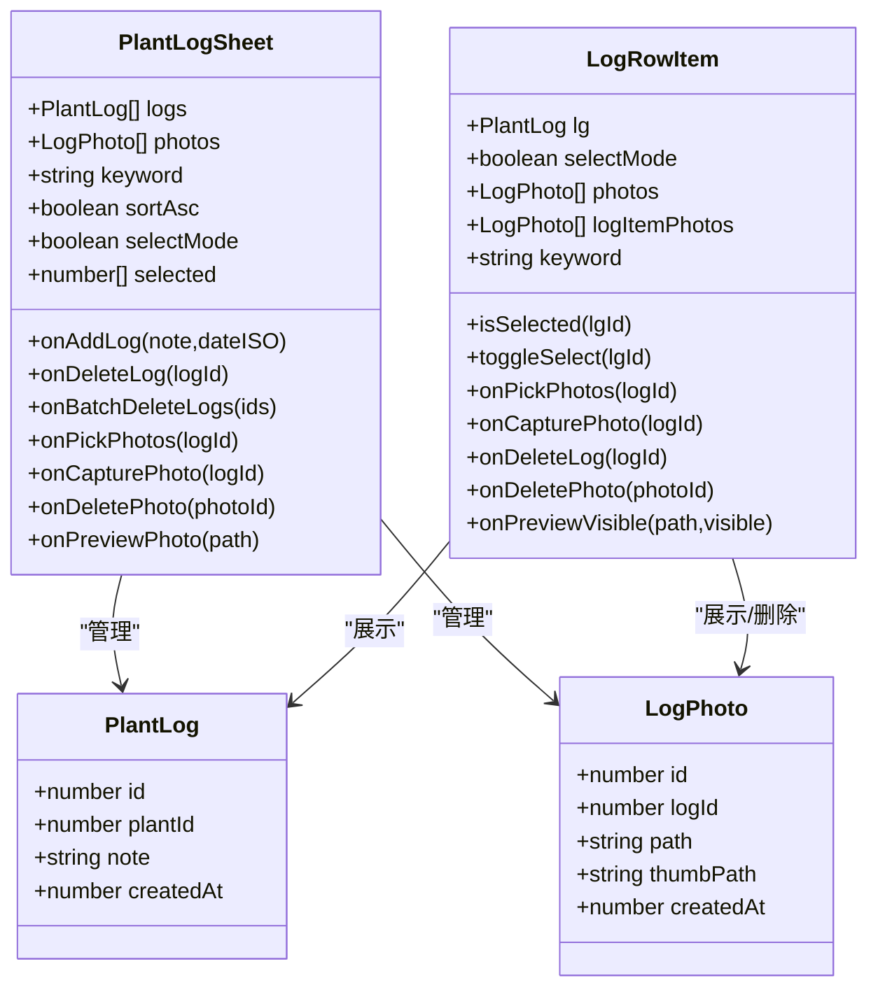
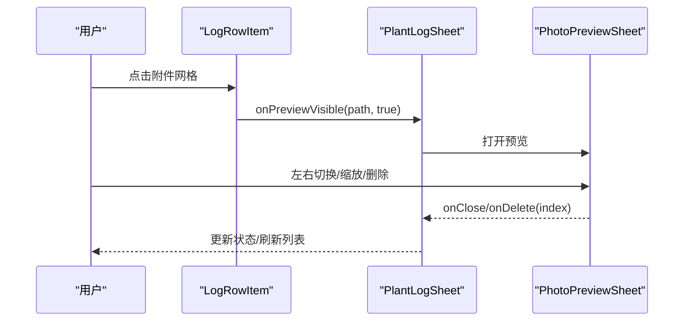
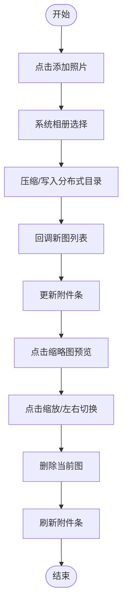
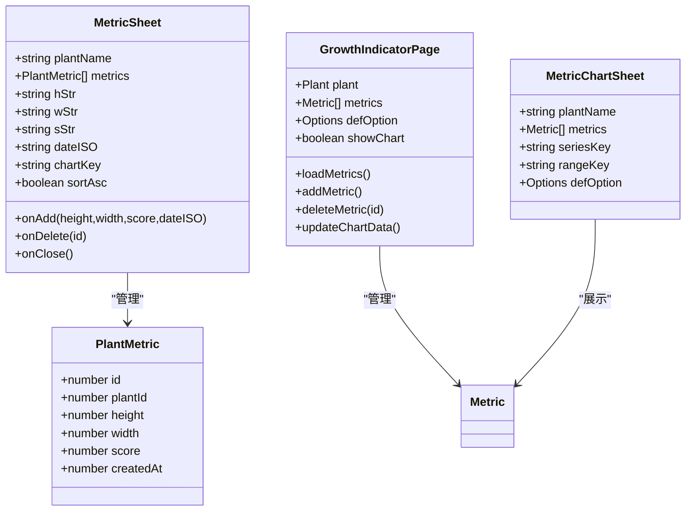
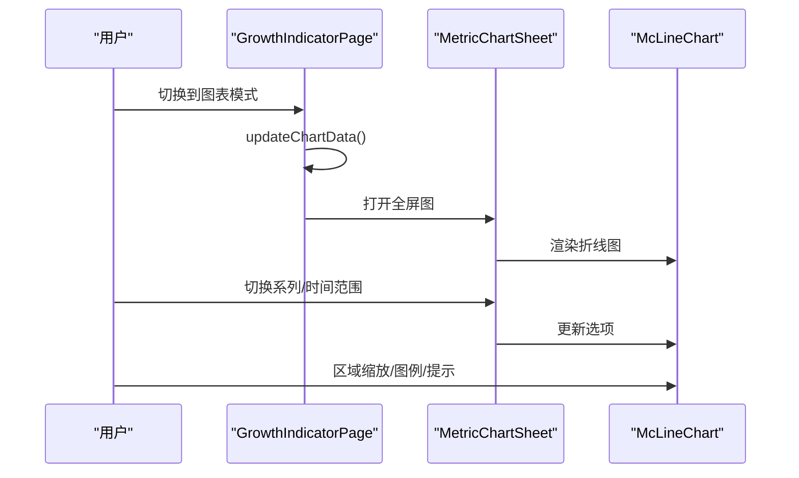
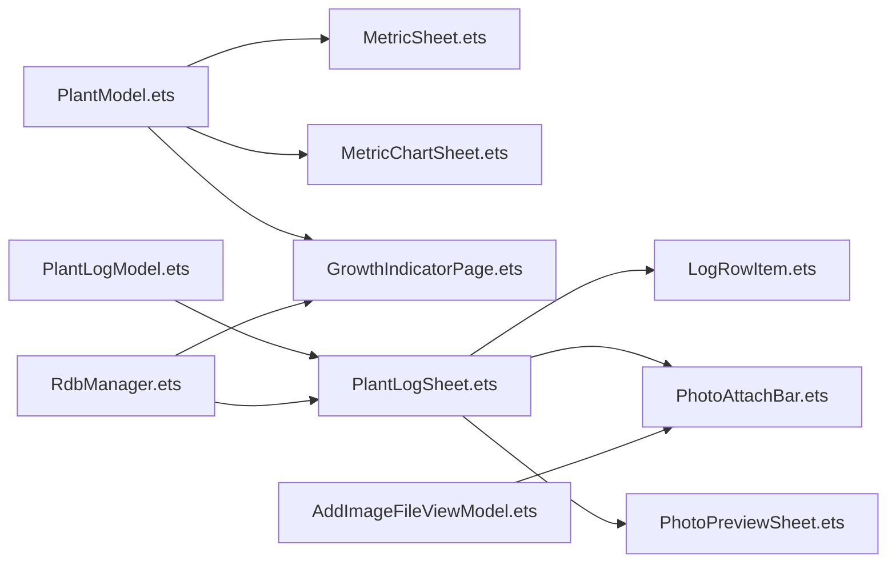

# 日志组件

<cite>
**本文档引用的文件**
- [PlantLogModel.ets](file://entry/src/main/ets/model/PlantLogModel.ets)
- [PlantLogSheet.ets](file://entry/src/main/ets/view/PlantLogSheet.ets)
- [LogRowItem.ets](file://entry/src/main/ets/view/LogRowItem.ets)
- [PhotoAttachBar.ets](file://entry/src/main/ets/view/PhotoAttachBar.ets)
- [PhotoPreviewSheet.ets](file://entry/src/main/ets/view/PhotoPreviewSheet.ets)
- [MetricSheet.ets](file://entry/src/main/ets/view/MetricSheet.ets)
- [MetricChartSheet.ets](file://entry/src/main/ets/view/MetricChartSheet.ets)
- [GrowthIndicatorPage.ets](file://entry/src/main/ets/pages/GrowthIndicatorPage.ets)
- [PlantModel.ets](file://entry/src/main/ets/model/PlantModel.ets)
- [RdbManager.ets](file://entry/src/main/ets/viewmodel/RdbManager.ets)
- [AddImageFileViewModel.ets](file://entry/src/main/ets/viewmodel/AddImageFileViewModel.ets)
</cite>

## 目录
1. [简介](#简介)
2. [项目结构](#项目结构)
3. [核心组件](#核心组件)
4. [架构总览](#架构总览)
5. [详细组件分析](#详细组件分析)
6. [依赖关系分析](#依赖关系分析)
7. [性能考量](#性能考量)
8. [故障排查指南](#故障排查指南)
9. [结论](#结论)
10. [附录](#附录)

## 简介
本文件系统性梳理植物日记应用中的日志组件与指标组件，涵盖以下主题：
- 植物日志：显示、编辑、删除、图片附件与预览
- 指标记录：数值输入、历史记录、趋势分析与图表
- 图表组件：数据可视化、交互操作与样式定制
- 数据绑定、事件处理与状态管理
- 使用示例与数据处理最佳实践

## 项目结构
日志与指标相关代码主要分布在以下模块：
- 模型层：PlantLogModel、PlantModel
- 视图层：PlantLogSheet、LogRowItem、PhotoAttachBar、PhotoPreviewSheet、MetricSheet、MetricChartSheet、GrowthIndicatorPage
- 视图模型与存储：RdbManager、AddImageFileViewModel

**图表来源**
- [PlantModel.ets:1-166](file://entry/src/main/ets/model/PlantModel.ets#L1-L166)
- [PlantLogModel.ets:1-58](file://entry/src/main/ets/model/PlantLogModel.ets#L1-L58)
- [PlantLogSheet.ets:1-384](file://entry/src/main/ets/view/PlantLogSheet.ets#L1-L384)
- [LogRowItem.ets:1-272](file://entry/src/main/ets/view/LogRowItem.ets#L1-L272)
- [PhotoAttachBar.ets:1-100](file://entry/src/main/ets/view/PhotoAttachBar.ets#L1-L100)
- [PhotoPreviewSheet.ets:1-223](file://entry/src/main/ets/view/PhotoPreviewSheet.ets#L1-L223)
- [MetricSheet.ets:1-491](file://entry/src/main/ets/view/MetricSheet.ets#L1-L491)
- [MetricChartSheet.ets:1-181](file://entry/src/main/ets/view/MetricChartSheet.ets#L1-L181)
- [GrowthIndicatorPage.ets:1-605](file://entry/src/main/ets/pages/GrowthIndicatorPage.ets#L1-L605)
- [RdbManager.ets:1-296](file://entry/src/main/ets/viewmodel/RdbManager.ets#L1-L296)
- [AddImageFileViewModel.ets:1-146](file://entry/src/main/ets/viewmodel/AddImageFileViewModel.ets#L1-L146)

**章节来源**
- [PlantLogSheet.ets:1-384](file://entry/src/main/ets/view/PlantLogSheet.ets#L1-L384)
- [MetricSheet.ets:1-491](file://entry/src/main/ets/view/MetricSheet.ets#L1-L491)
- [GrowthIndicatorPage.ets:1-605](file://entry/src/main/ets/pages/GrowthIndicatorPage.ets#L1-L605)

## 核心组件
- 植物日志模型：PlantLog、LogPhoto
- 日志抽屉：PlantLogSheet（含新增、排序、多选删除、图片附件）
- 日志行项：LogRowItem（高亮关键词、附件网格、长按进入选择模式）
- 照片附件条：PhotoAttachBar（横向缩略图滚动、添加/删除/预览）
- 照片预览：PhotoPreviewSheet（全屏预览、左右切换、缩放、删除）
- 指标抽屉：MetricSheet（快速录入、迷你趋势、历史列表、排序）
- 指标全屏图：MetricChartSheet（McLineChart 折线图、系列/时间范围切换）
- 指标页：GrowthIndicatorPage（列表/图表双模式、完整图表、RDB 读写）

**章节来源**
- [PlantLogModel.ets:1-58](file://entry/src/main/ets/model/PlantLogModel.ets#L1-L58)
- [PlantLogSheet.ets:1-384](file://entry/src/main/ets/view/PlantLogSheet.ets#L1-L384)
- [LogRowItem.ets:1-272](file://entry/src/main/ets/view/LogRowItem.ets#L1-L272)
- [PhotoAttachBar.ets:1-100](file://entry/src/main/ets/view/PhotoAttachBar.ets#L1-L100)
- [PhotoPreviewSheet.ets:1-223](file://entry/src/main/ets/view/PhotoPreviewSheet.ets#L1-L223)
- [MetricSheet.ets:1-491](file://entry/src/main/ets/view/MetricSheet.ets#L1-L491)
- [MetricChartSheet.ets:1-181](file://entry/src/main/ets/view/MetricChartSheet.ets#L1-L181)
- [GrowthIndicatorPage.ets:1-605](file://entry/src/main/ets/pages/GrowthIndicatorPage.ets#L1-L605)

## 架构总览
日志与指标组件采用“模型-视图-视图模型/存储”分层设计：
- 模型层：定义数据结构与基本构造
- 视图层：负责 UI 呈现、交互与事件回调
- 视图模型/存储：封装数据库初始化、索引、RDB 操作与图片处理

**图表来源**
- [PlantLogSheet.ets:1-384](file://entry/src/main/ets/view/PlantLogSheet.ets#L1-L384)
- [LogRowItem.ets:1-272](file://entry/src/main/ets/view/LogRowItem.ets#L1-L272)
- [PhotoAttachBar.ets:1-100](file://entry/src/main/ets/view/PhotoAttachBar.ets#L1-L100)
- [PhotoPreviewSheet.ets:1-223](file://entry/src/main/ets/view/PhotoPreviewSheet.ets#L1-L223)
- [RdbManager.ets:1-296](file://entry/src/main/ets/viewmodel/RdbManager.ets#L1-L296)

## 详细组件分析

### 植物日志组件
- 显示与编辑
  - 日志抽屉支持新增日志、设置日期、关键词高亮、排序（升/降）
  - 日志行项支持长按进入选择模式、删除单条日志
- 删除
  - 支持单条删除与批量删除（多选后一键删除）
- 图片附件
  - 行项内嵌附件网格，支持点击预览、删除附件
  - 提供“添加照片/拍照”入口，交由外部处理选图与落库

**图表来源**
- [PlantLogModel.ets:1-58](file://entry/src/main/ets/model/PlantLogModel.ets#L1-L58)
- [PlantLogSheet.ets:1-384](file://entry/src/main/ets/view/PlantLogSheet.ets#L1-L384)
- [LogRowItem.ets:1-272](file://entry/src/main/ets/view/LogRowItem.ets#L1-L272)

**章节来源**
- [PlantLogSheet.ets:1-384](file://entry/src/main/ets/view/PlantLogSheet.ets#L1-L384)
- [LogRowItem.ets:1-272](file://entry/src/main/ets/view/LogRowItem.ets#L1-L272)

### 日志行项与附件交互流程

**图表来源**
- [LogRowItem.ets:1-272](file://entry/src/main/ets/view/LogRowItem.ets#L1-L272)
- [PlantLogSheet.ets:1-384](file://entry/src/main/ets/view/PlantLogSheet.ets#L1-L384)
- [PhotoPreviewSheet.ets:1-223](file://entry/src/main/ets/view/PhotoPreviewSheet.ets#L1-L223)

### 照片附件条与预览
- 照片附件条：横向滚动展示缩略图，支持“添加照片”、“删除照片”、“预览”
- 照片预览：全屏大图、左右滑动切换、点击缩放、顶部工具栏操作

**图表来源**
- [PhotoAttachBar.ets:1-100](file://entry/src/main/ets/view/PhotoAttachBar.ets#L1-L100)
- [PhotoPreviewSheet.ets:1-223](file://entry/src/main/ets/view/PhotoPreviewSheet.ets#L1-L223)
- [AddImageFileViewModel.ets:1-146](file://entry/src/main/ets/viewmodel/AddImageFileViewModel.ets#L1-L146)

**章节来源**
- [PhotoAttachBar.ets:1-100](file://entry/src/main/ets/view/PhotoAttachBar.ets#L1-L100)
- [PhotoPreviewSheet.ets:1-223](file://entry/src/main/ets/view/PhotoPreviewSheet.ets#L1-L223)
- [AddImageFileViewModel.ets:1-146](file://entry/src/main/ets/viewmodel/AddImageFileViewModel.ets#L1-L146)

### 指标记录组件
- 快速录入：身高、冠幅、健康分，日期可设为“今天”，支持清空
- 历史记录：列表展示，支持升/降序切换
- 趋势分析：迷你柱状图感知趋势，全屏图使用 McLineChart

**图表来源**
- [PlantModel.ets:1-166](file://entry/src/main/ets/model/PlantModel.ets#L1-L166)
- [MetricSheet.ets:1-491](file://entry/src/main/ets/view/MetricSheet.ets#L1-L491)
- [GrowthIndicatorPage.ets:1-605](file://entry/src/main/ets/pages/GrowthIndicatorPage.ets#L1-L605)
- [MetricChartSheet.ets:1-181](file://entry/src/main/ets/view/MetricChartSheet.ets#L1-L181)

**章节来源**
- [MetricSheet.ets:1-491](file://entry/src/main/ets/view/MetricSheet.ets#L1-L491)
- [GrowthIndicatorPage.ets:1-605](file://entry/src/main/ets/pages/GrowthIndicatorPage.ets#L1-L605)
- [MetricChartSheet.ets:1-181](file://entry/src/main/ets/view/MetricChartSheet.ets#L1-L181)

### 指标全屏图与交互

**图表来源**
- [GrowthIndicatorPage.ets:1-605](file://entry/src/main/ets/pages/GrowthIndicatorPage.ets#L1-L605)
- [MetricChartSheet.ets:1-181](file://entry/src/main/ets/view/MetricChartSheet.ets#L1-L181)

## 依赖关系分析
- 数据模型依赖：PlantLog/LogPhoto（日志）、Metric/PlantMetric（指标）
- 视图依赖：PlantLogSheet 依赖 LogRowItem、PhotoAttachBar、PhotoPreviewSheet；指标页依赖 McLineChart
- 存储依赖：RdbManager 统一初始化数据库与索引，支持日志与指标的 CRUD
- 图片处理：AddImageFileViewModel 封装选图、压缩、写入分布式目录

**图表来源**
- [PlantModel.ets:1-166](file://entry/src/main/ets/model/PlantModel.ets#L1-L166)
- [PlantLogModel.ets:1-58](file://entry/src/main/ets/model/PlantLogModel.ets#L1-L58)
- [PlantLogSheet.ets:1-384](file://entry/src/main/ets/view/PlantLogSheet.ets#L1-L384)
- [LogRowItem.ets:1-272](file://entry/src/main/ets/view/LogRowItem.ets#L1-L272)
- [PhotoAttachBar.ets:1-100](file://entry/src/main/ets/view/PhotoAttachBar.ets#L1-L100)
- [PhotoPreviewSheet.ets:1-223](file://entry/src/main/ets/view/PhotoPreviewSheet.ets#L1-L223)
- [MetricSheet.ets:1-491](file://entry/src/main/ets/view/MetricSheet.ets#L1-L491)
- [MetricChartSheet.ets:1-181](file://entry/src/main/ets/view/MetricChartSheet.ets#L1-L181)
- [GrowthIndicatorPage.ets:1-605](file://entry/src/main/ets/pages/GrowthIndicatorPage.ets#L1-L605)
- [RdbManager.ets:1-296](file://entry/src/main/ets/viewmodel/RdbManager.ets#L1-L296)
- [AddImageFileViewModel.ets:1-146](file://entry/src/main/ets/viewmodel/AddImageFileViewModel.ets#L1-L146)

**章节来源**
- [RdbManager.ets:1-296](file://entry/src/main/ets/viewmodel/RdbManager.ets#L1-L296)
- [AddImageFileViewModel.ets:1-146](file://entry/src/main/ets/viewmodel/AddImageFileViewModel.ets#L1-L146)

## 性能考量
- 列表渲染优化
  - 使用 List/ForEach 渲染日志与指标，避免不必要的重绘
  - 日志抽屉与指标页均对排序与迷你图进行惰性计算，减少主线程压力
- 图片处理
  - 选图后进行压缩并写入分布式目录，降低内存占用与 IO 压力
  - 预览大图采用缩放与过渡动画，避免频繁重排
- 数据库访问
  - 通过组合索引（plantId, createdAt）加速查询
  - 指标页在切换到全屏图时才重建图表选项，避免列表模式频繁更新

[本节为通用指导，无需特定文件引用]

## 故障排查指南
- 日志无法显示或排序异常
  - 检查日志拉取是否成功，确认 createdAt 字段有效
  - 确认排序逻辑与 sortAsc 状态一致
- 照片无法添加或删除
  - 检查 AddImageFileViewModel 的选图与写入流程是否报错
  - 确认分布式目录权限与文件写入成功
- 指标新增失败
  - 检查日期格式（YYYY-MM-DD）与数值合法性（身高/冠幅>0，健康分 0~100）
  - 确认 RDB 插入成功与重新加载数据
- 图表不更新
  - 指标页在切换到图表模式时才更新图表选项，确保调用了更新方法

**章节来源**
- [AddImageFileFileViewModel.ets:1-146](file://entry/src/main/ets/viewmodel/AddImageFileViewModel.ets#L1-L146)
- [RdbManager.ets:1-296](file://entry/src/main/ets/viewmodel/RdbManager.ets#L1-L296)
- [GrowthIndicatorPage.ets:1-605](file://entry/src/main/ets/pages/GrowthIndicatorPage.ets#L1-L605)

## 结论
日志与指标组件通过清晰的分层设计实现了良好的可维护性与扩展性：
- 日志组件提供完整的增删改查与图片附件能力，支持关键词高亮与多选删除
- 指标组件兼顾快速录入与深度分析，提供迷你图与全屏图两种视图
- 数据绑定与事件回调机制明确，状态管理集中在视图层，便于调试与测试

[本节为总结，无需特定文件引用]

## 附录

### 使用示例与最佳实践
- 日志新增
  - 设置日期为“今天”，输入内容后点击“添加日志”
  - 若需要指定日期，可在日期区域修改
- 日志删除
  - 单条删除：点击日志右侧“🗏”
  - 批量删除：长按进入选择模式，勾选后点击“删除(数量)”执行
- 图片附件
  - 点击“📤”从相册选择，“📲”拍照
  - 点击附件缩略图预览，支持左右切换与删除
- 指标录入
  - 在指标抽屉中填写身高/冠幅/健康分，点击“添加记录”
  - 支持清空表单，日期默认为“今天”
- 趋势分析
  - 指标抽屉提供迷你图，指标页支持切换系列与排序
  - 切换到图表模式查看完整折线图，支持区域缩放与图例

**章节来源**
- [PlantLogSheet.ets:1-384](file://entry/src/main/ets/view/PlantLogSheet.ets#L1-L384)
- [LogRowItem.ets:1-272](file://entry/src/main/ets/view/LogRowItem.ets#L1-L272)
- [PhotoAttachBar.ets:1-100](file://entry/src/main/ets/view/PhotoAttachBar.ets#L1-L100)
- [PhotoPreviewSheet.ets:1-223](file://entry/src/main/ets/view/PhotoPreviewSheet.ets#L1-L223)
- [MetricSheet.ets:1-491](file://entry/src/main/ets/view/MetricSheet.ets#L1-L491)
- [GrowthIndicatorPage.ets:1-605](file://entry/src/main/ets/pages/GrowthIndicatorPage.ets#L1-L605)