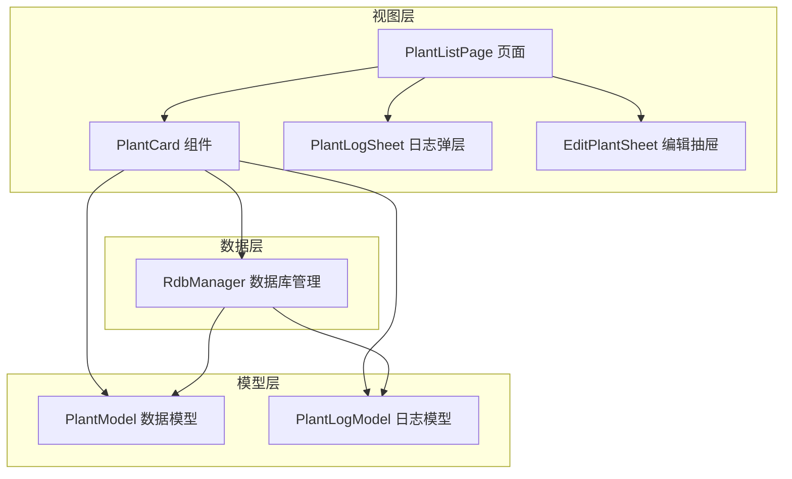
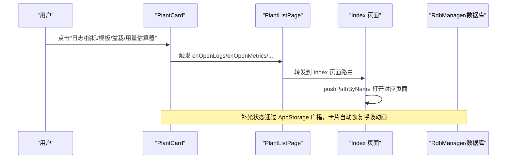
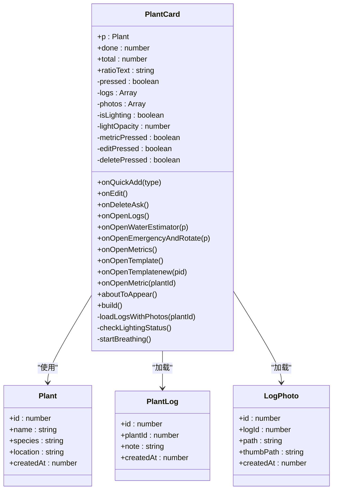
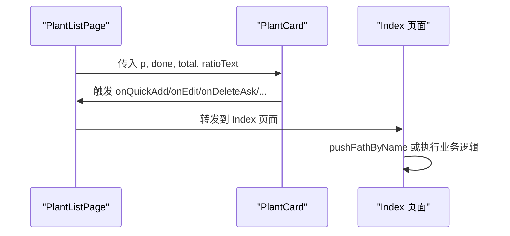
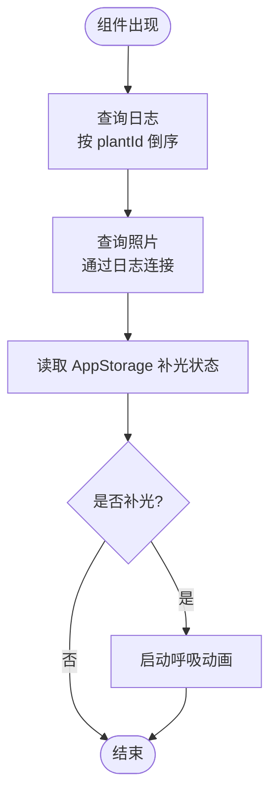
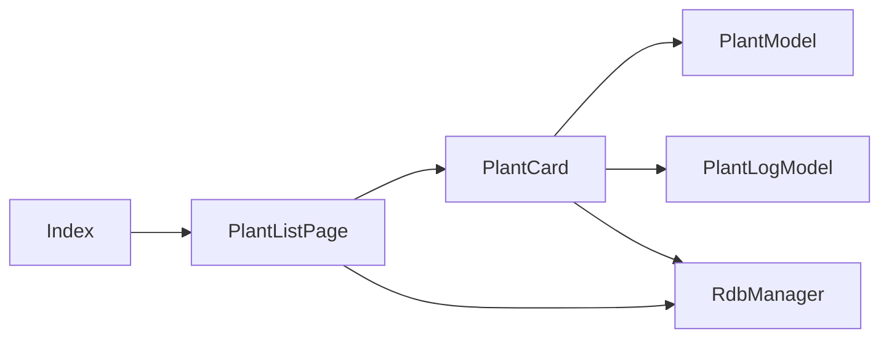

# 植物卡片组件

<cite>
**本文引用的文件**
- [PlantCard.ets](file://entry/src/main/ets/view/PlantCard.ets)
- [PlantModel.ets](file://entry/src/main/ets/model/PlantModel.ets)
- [PlantLogModel.ets](file://entry/src/main/ets/model/PlantLogModel.ets)
- [RdbManager.ets](file://entry/src/main/ets/viewmodel/RdbManager.ets)
- [PlantListPage.ets](file://entry/src/main/ets/pages/PlantListPage.ets)
- [Index.ets](file://entry/src/main/ets/pages/Index.ets)
- [PlantLogSheet.ets](file://entry/src/main/ets/view/PlantLogSheet.ets)
- [EditPlantSheet.ets](file://entry/src/main/ets/view/EditPlantSheet.ets)
</cite>

## 目录
1. [简介](#简介)
2. [项目结构](#项目结构)
3. [核心组件](#核心组件)
4. [架构总览](#架构总览)
5. [详细组件分析](#详细组件分析)
6. [依赖关系分析](#依赖关系分析)
7. [性能考虑](#性能考虑)
8. [故障排查指南](#故障排查指南)
9. [结论](#结论)
10. [附录](#附录)

## 简介
本文件系统性地解析 PlantCard 组件的设计理念、实现细节与使用方式，涵盖属性定义、事件处理机制、状态管理、数据库交互、视觉设计元素，并提供完整的 API 参考与使用示例，帮助开发者高效集成与优化该组件。

## 项目结构
PlantCard 位于视图层，作为 PlantListPage 的子组件，负责展示植物信息、任务进度、快捷操作，并向父页面抛出事件以驱动上层业务逻辑。数据库访问通过 RdbManager 统一管理，日志与照片模型独立封装，便于跨页面复用。

**图表来源**
- [PlantCard.ets:1-326](file://entry/src/main/ets/view/PlantCard.ets#L1-L326)
- [PlantListPage.ets:1-228](file://entry/src/main/ets/pages/PlantListPage.ets#L1-L228)
- [RdbManager.ets:1-296](file://entry/src/main/ets/viewmodel/RdbManager.ets#L1-L296)
- [PlantModel.ets:1-166](file://entry/src/main/ets/model/PlantModel.ets#L1-L166)
- [PlantLogModel.ets:1-58](file://entry/src/main/ets/model/PlantLogModel.ets#L1-L58)
- [PlantLogSheet.ets:1-384](file://entry/src/main/ets/view/PlantLogSheet.ets#L1-L384)
- [EditPlantSheet.ets:1-264](file://entry/src/main/ets/view/EditPlantSheet.ets#L1-L264)

**章节来源**
- [PlantCard.ets:1-326](file://entry/src/main/ets/view/PlantCard.ets#L1-L326)
- [PlantListPage.ets:1-228](file://entry/src/main/ets/pages/PlantListPage.ets#L1-L228)
- [RdbManager.ets:1-296](file://entry/src/main/ets/viewmodel/RdbManager.ets#L1-L296)

## 核心组件
- PlantCard：单个植物卡片，聚合展示植物头像、名称、任务进度、快捷操作与功能入口。
- PlantListPage：列表容器，负责计算每株植物的任务完成数、总数与比率文本，向下传递给 PlantCard。
- RdbManager：数据库管理器，提供统一的建表、索引与查询能力，支持日志与照片查询。
- PlantModel/PlantLogModel：数据模型，封装 Plant、LogEntry、LogPhoto 等实体。
- PlantLogSheet：日志弹层，承载日志与照片的增删查改。
- EditPlantSheet：编辑抽屉，提供植物信息编辑与快捷任务入口。

**章节来源**
- [PlantCard.ets:1-326](file://entry/src/main/ets/view/PlantCard.ets#L1-L326)
- [PlantListPage.ets:1-228](file://entry/src/main/ets/pages/PlantListPage.ets#L1-L228)
- [RdbManager.ets:1-296](file://entry/src/main/ets/viewmodel/RdbManager.ets#L1-L296)
- [PlantModel.ets:1-166](file://entry/src/main/ets/model/PlantModel.ets#L1-L166)
- [PlantLogModel.ets:1-58](file://entry/src/main/ets/model/PlantLogModel.ets#L1-L58)
- [PlantLogSheet.ets:1-384](file://entry/src/main/ets/view/PlantLogSheet.ets#L1-L384)
- [EditPlantSheet.ets:1-264](file://entry/src/main/ets/view/EditPlantSheet.ets#L1-L264)

## 架构总览
PlantCard 采用“展示与事件抛出”的职责分离模式：
- 展示层：负责 UI 呈现、状态管理（按压、补光呼吸效果）、视觉样式。
- 事件层：通过 @Event 将用户交互转化为上层处理动作（快速添加、编辑、删除、打开日志、打开估算器等）。
- 数据层：通过 RdbManager 查询日志与照片，用于封面图与补光状态反馈。

**图表来源**
- [PlantCard.ets:13-23](file://entry/src/main/ets/view/PlantCard.ets#L13-L23)
- [PlantListPage.ets:157-178](file://entry/src/main/ets/pages/PlantListPage.ets#L157-L178)
- [Index.ets:883-923](file://entry/src/main/ets/pages/Index.ets#L883-L923)
- [RdbManager.ets:278-294](file://entry/src/main/ets/viewmodel/RdbManager.ets#L278-L294)

## 详细组件分析

### PlantCard 组件
- 设计理念
  - 卡片既是植物概览，也是功能入口聚合节点，减少页面间跳转成本。
  - 通过 AppStorage 广播补光状态，保证首页重载后仍能即时恢复视觉反馈。
  - 使用动画与按压反馈提升交互体验。

- 属性定义
  - p: Plant（必填）
  - done: number（必填，完成数）
  - total: number（必填，总数）
  - ratioText: string（必填，比率文本）

- 事件处理机制
  - 快速添加：onQuickAdd(type)
  - 编辑：onEdit()
  - 删除：onDeleteAsk()
  - 打开日志：onOpenLogs()
  - 打开水估算器：onOpenWaterEstimator(p)
  - 打开应急与轮换：onOpenEmergencyAndRotate(p)
  - 打开指标页：onOpenMetrics()
  - 打开模板：onOpenTemplate()
  - 打开新模板：onOpenTemplatenew(pid)
  - 打开指标图表：onOpenMetric(plantId)

- 状态管理
  - 按压状态：pressed、metricPressed、editPressed、deletePressed
  - 补光状态：isLighting、lightOpacity
  - 动画效果：呼吸动画（补光时循环播放）、缩放与阴影变化

- 数据库交互
  - 日志加载：按 plantId 查询日志，按创建时间倒序
  - 照片获取：通过日志表连接查询照片，按 id 倒序
  - 补光状态检查：读取 AppStorage 中 lighting_{id} 键值，决定是否启动呼吸动画

- 视觉设计元素
  - 头像显示：优先使用日志首张照片，无照片时显示首字头像
  - 进度条：Linear 类型，带动画过渡
  - 快捷操作按钮：按类型着色（浇水/施肥/修剪），带按压缩放动画
  - 辅助标签：补光状态徽章与边框/阴影

**图表来源**
- [PlantCard.ets:8-326](file://entry/src/main/ets/view/PlantCard.ets#L8-L326)
- [PlantModel.ets:7-21](file://entry/src/main/ets/model/PlantModel.ets#L7-L21)
- [PlantLogModel.ets:8-57](file://entry/src/main/ets/model/PlantLogModel.ets#L8-L57)

**章节来源**
- [PlantCard.ets:8-326](file://entry/src/main/ets/view/PlantCard.ets#L8-L326)
- [PlantModel.ets:7-21](file://entry/src/main/ets/model/PlantModel.ets#L7-L21)
- [PlantLogModel.ets:8-57](file://entry/src/main/ets/model/PlantLogModel.ets#L8-L57)

### PlantListPage 与 Index 的事件桥接
- PlantListPage 负责计算每株植物的完成数、总数与比率文本，并将这些数据与事件回调传递给 PlantCard。
- Index 页面接收来自 PlantListPage 的事件，执行页面跳转、数据刷新与弹层控制。

**图表来源**
- [PlantListPage.ets:157-178](file://entry/src/main/ets/pages/PlantListPage.ets#L157-L178)
- [Index.ets:868-923](file://entry/src/main/ets/pages/Index.ets#L868-L923)

**章节来源**
- [PlantListPage.ets:157-178](file://entry/src/main/ets/pages/PlantListPage.ets#L157-L178)
- [Index.ets:868-923](file://entry/src/main/ets/pages/Index.ets#L868-L923)

### 数据库交互流程
- 日志与照片查询：通过 RdbManager 的 rdbStore 执行 SQL，按 plantId 查询日志与照片，用于封面图与补光状态。
- 补光状态广播：通过 AppStorage 存储 lighting_{id}，PlantCard 在 aboutToAppear 中读取并启动呼吸动画。

**图表来源**
- [PlantCard.ets:35-47](file://entry/src/main/ets/view/PlantCard.ets#L35-L47)
- [PlantCard.ets:80-111](file://entry/src/main/ets/view/PlantCard.ets#L80-L111)
- [RdbManager.ets:278-294](file://entry/src/main/ets/viewmodel/RdbManager.ets#L278-L294)

**章节来源**
- [PlantCard.ets:35-47](file://entry/src/main/ets/view/PlantCard.ets#L35-L47)
- [PlantCard.ets:80-111](file://entry/src/main/ets/view/PlantCard.ets#L80-L111)
- [RdbManager.ets:278-294](file://entry/src/main/ets/viewmodel/RdbManager.ets#L278-L294)

## 依赖关系分析
- 组件耦合
  - PlantCard 依赖 PlantModel、PlantLogModel、RdbManager，但不直接持有数据库连接，通过 AppStorage 与补光状态解耦。
  - PlantListPage 仅负责数据计算与事件转发，降低 PlantCard 的复杂度。
- 外部依赖
  - ArkData relationalStore 提供数据库能力。
  - AppStorage 提供跨组件状态广播。

**图表来源**
- [PlantCard.ets:1-3](file://entry/src/main/ets/view/PlantCard.ets#L1-L3)
- [PlantListPage.ets:1-2](file://entry/src/main/ets/pages/PlantListPage.ets#L1-L2)
- [Index.ets:865-927](file://entry/src/main/ets/pages/Index.ets#L865-L927)

**章节来源**
- [PlantCard.ets:1-3](file://entry/src/main/ets/view/PlantCard.ets#L1-L3)
- [PlantListPage.ets:1-2](file://entry/src/main/ets/pages/PlantListPage.ets#L1-L2)
- [Index.ets:865-927](file://entry/src/main/ets/pages/Index.ets#L865-L927)

## 性能考虑
- 数据计算集中化：PlantListPage 负责计算完成数、总数与比率，避免每个 PlantCard 单独查询数据库，减少 IO 开销。
- 动画与按压反馈：使用短时动画与按压缩放，避免过度消耗资源。
- 索引优化：RdbManager 已为日志与照片建立复合索引，查询效率较高。
- 状态广播：补光状态通过 AppStorage 广播，避免频繁数据库查询。

[本节为通用性能建议，无需特定文件引用]

## 故障排查指南
- 日志与照片未显示
  - 检查 RdbManager 是否正确初始化数据库与索引。
  - 确认 PlantCard 的 loadLogsWithPhotos 方法是否被调用（aboutToAppear 生命周期）。
- 补光呼吸动画不生效
  - 检查 AppStorage 中 lighting_{id} 是否存在且为 true。
  - 确认 checkLightingStatus 与 startBreathing 的调用链。
- 事件未触发
  - 确认 PlantListPage 是否正确将事件回调传递给 PlantCard。
  - 检查 Index 页面是否正确接收并处理事件。

**章节来源**
- [PlantCard.ets:35-47](file://entry/src/main/ets/view/PlantCard.ets#L35-L47)
- [PlantCard.ets:80-111](file://entry/src/main/ets/view/PlantCard.ets#L80-L111)
- [RdbManager.ets:278-294](file://entry/src/main/ets/viewmodel/RdbManager.ets#L278-L294)
- [PlantListPage.ets:157-178](file://entry/src/main/ets/pages/PlantListPage.ets#L157-L178)
- [Index.ets:868-923](file://entry/src/main/ets/pages/Index.ets#L868-L923)

## 结论
PlantCard 通过清晰的职责划分与事件桥接，实现了高效的植物卡片展示与交互。配合 PlantListPage 的数据计算与 Index 的页面路由，形成完整的功能闭环。数据库层面通过 RdbManager 统一管理，确保查询效率与一致性。建议在扩展新功能时遵循“展示与事件分离”的原则，保持组件的高内聚低耦合。

[本节为总结性内容，无需特定文件引用]

## 附录

### API 参考

- 组件属性
  - p: Plant（必填）
  - done: number（必填）
  - total: number（必填）
  - ratioText: string（必填）

- 组件事件
  - onQuickAdd(type: string) => void
  - onEdit() => void
  - onDeleteAsk() => void
  - onOpenLogs() => void
  - onOpenWaterEstimator(p: Plant) => void
  - onOpenEmergencyAndRotate(p: Plant) => void
  - onOpenMetrics() => void
  - onOpenTemplate() => void
  - onOpenTemplatenew(pid: number) => void
  - onOpenMetric(plantId: number) => void

- 生命周期
  - aboutToAppear(): 异步加载日志与照片，检查补光状态

- 数据模型
  - Plant：id, name, species, location, createdAt
  - PlantLog：id, plantId, note, createdAt
  - LogPhoto：id, logId, path, thumbPath, createdAt

- 数据库表
  - plant, task, tpl, log, metric, log_photo, care_template, care_rule, light_profile, exposure_session

**章节来源**
- [PlantCard.ets:8-326](file://entry/src/main/ets/view/PlantCard.ets#L8-L326)
- [PlantModel.ets:7-21](file://entry/src/main/ets/model/PlantModel.ets#L7-L21)
- [PlantLogModel.ets:8-57](file://entry/src/main/ets/model/PlantLogModel.ets#L8-L57)
- [RdbManager.ets:4-18](file://entry/src/main/ets/viewmodel/RdbManager.ets#L4-L18)

### 使用示例
- 在 PlantListPage 中使用 PlantCard
  - 计算每株植物的完成数、总数与比率文本
  - 将事件回调传递给 PlantCard
  - 点击卡片时打开植物详情页

- 在 Index 页面中处理事件
  - 快速添加：创建 TaskDraft 并调用 createTask
  - 打开日志：pushPathByName 到 PlantLogPage
  - 打开水估算器：pushPathByName 到 WaterEstimatorPage
  - 打开应急与轮换：pushPathByName 到 EmergencyAndRotatePage
  - 删除：弹出确认对话框，确认后删除植物或任务

**章节来源**
- [PlantListPage.ets:157-178](file://entry/src/main/ets/pages/PlantListPage.ets#L157-L178)
- [Index.ets:868-923](file://entry/src/main/ets/pages/Index.ets#L868-L923)