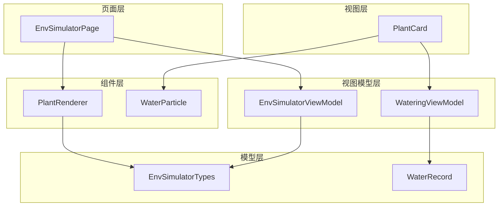
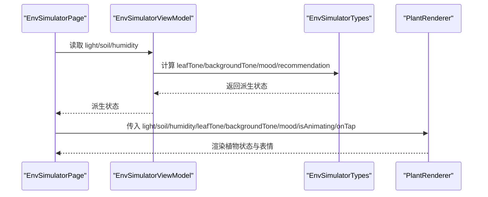
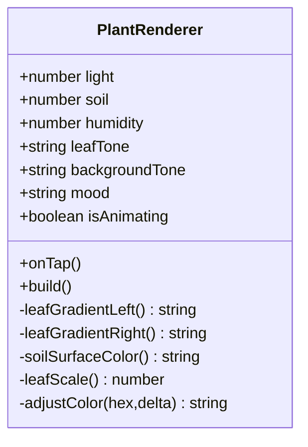
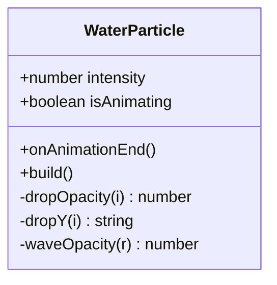
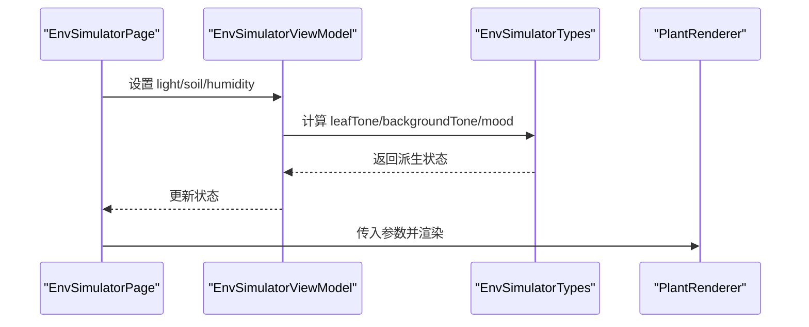
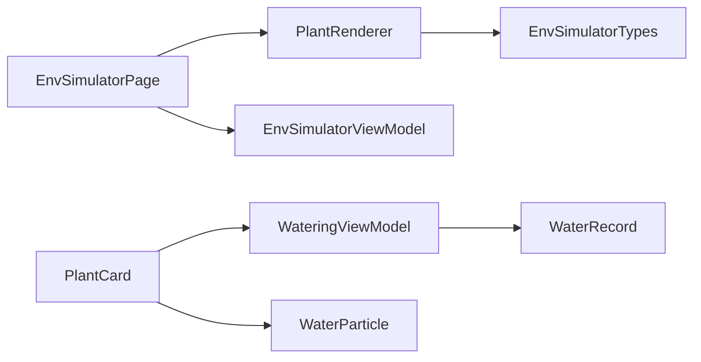

# 自定义组件

<cite>
**本文引用的文件**
- [PlantRenderer.ets](file://entry/src/main/ets/component/PlantRenderer.ets)
- [WaterParticle.ets](file://entry/src/main/ets/component/WaterParticle.ets)
- [EnvSimulatorPage.ets](file://entry/src/main/ets/pages/EnvSimulatorPage.ets)
- [EnvSimulatorViewModel.ets](file://entry/src/main/ets/viewmodel/EnvSimulatorViewModel.ets)
- [EnvSimulatorTypes.ets](file://entry/src/main/ets/model/EnvSimulatorTypes.ets)
- [WateringViewModel.ets](file://entry/src/main/ets/viewmodel/WateringViewModel.ets)
- [WaterRecord.ets](file://entry/src/main/ets/model/WaterRecord.ets)
- [PlantCard.ets](file://entry/src/main/ets/view/PlantCard.ets)
</cite>

## 目录
1. [简介](#简介)
2. [项目结构](#项目结构)
3. [核心组件](#核心组件)
4. [架构总览](#架构总览)
5. [详细组件分析](#详细组件分析)
6. [依赖关系分析](#依赖关系分析)
7. [性能考量](#性能考量)
8. [故障排查指南](#故障排查指南)
9. [结论](#结论)
10. [附录](#附录)

## 简介
本文件聚焦于 PlantDiary 项目中的两个自定义组件：PlantRenderer（植物渲染器）与 WaterParticle（水粒子）。前者通过 ArkUI 基础组件组合实现 3D 视觉风格的植物状态可视化，包括光照、土壤湿度、空气湿度对植物外观的影响，以及基于参数的简单动画表现；后者用于模拟浇水过程中的粒子与波纹效果，强调轻量级的视觉反馈与可配置强度。文档将从架构、数据流、处理逻辑、集成点、性能与资源管理、扩展与最佳实践等方面进行系统化说明，并提供使用示例与渲染技术实现细节。

## 项目结构
- 组件层：位于 entry/src/main/ets/component，包含 PlantRenderer 与 WaterParticle。
- 页面层：位于 entry/src/main/ets/pages，如 EnvSimulatorPage 展示了 PlantRenderer 的使用场景。
- 视图模型层：位于 entry/src/main/ets/viewmodel，如 EnvSimulatorViewModel、WateringViewModel 管理状态与交互。
- 模型层：位于 entry/src/main/ets/model，如 EnvSimulatorTypes 定义环境参数与派生状态，WaterRecord 描述浇水记录。
- 视图层：位于 entry/src/main/ets/view，如 PlantCard 展示植物卡片与光照呼吸动画。

图表来源
- [EnvSimulatorPage.ets:1-123](file://entry/src/main/ets/pages/EnvSimulatorPage.ets#L1-L123)
- [EnvSimulatorViewModel.ets:1-108](file://entry/src/main/ets/viewmodel/EnvSimulatorViewModel.ets#L1-L108)
- [EnvSimulatorTypes.ets:1-96](file://entry/src/main/ets/model/EnvSimulatorTypes.ets#L1-L96)
- [PlantRenderer.ets:1-169](file://entry/src/main/ets/component/PlantRenderer.ets#L1-L169)
- [WateringViewModel.ets:1-102](file://entry/src/main/ets/viewmodel/WateringViewModel.ets#L1-L102)
- [WaterRecord.ets:1-18](file://entry/src/main/ets/model/WaterRecord.ets#L1-L18)
- [PlantCard.ets:1-326](file://entry/src/main/ets/view/PlantCard.ets#L1-L326)

章节来源
- [EnvSimulatorPage.ets:1-123](file://entry/src/main/ets/pages/EnvSimulatorPage.ets#L1-L123)
- [EnvSimulatorViewModel.ets:1-108](file://entry/src/main/ets/viewmodel/EnvSimulatorViewModel.ets#L1-L108)
- [EnvSimulatorTypes.ets:1-96](file://entry/src/main/ets/model/EnvSimulatorTypes.ets#L1-L96)
- [PlantRenderer.ets:1-169](file://entry/src/main/ets/component/PlantRenderer.ets#L1-L169)
- [WateringViewModel.ets:1-102](file://entry/src/main/ets/viewmodel/WateringViewModel.ets#L1-L102)
- [WaterRecord.ets:1-18](file://entry/src/main/ets/model/WaterRecord.ets#L1-L18)
- [PlantCard.ets:1-326](file://entry/src/main/ets/view/PlantCard.ets#L1-L326)

## 核心组件
- PlantRenderer：基于 ArkUI 组件树构建的植物状态可视化组件，接收光照、土壤湿度、空气湿度、叶色、背景色、情绪标签、动画开关与点击事件等参数，内部通过颜色调整、缩放与阴影等基础样式实现植物外观与状态反馈。
- WaterParticle：基于简单几何元素（矩形、圆角、边框）模拟水粒子与波纹的组件，支持强度参数与动画结束回调，适合在页面侧通过整体位移与透明度过渡实现动画。

章节来源
- [PlantRenderer.ets:1-169](file://entry/src/main/ets/component/PlantRenderer.ets#L1-L169)
- [WaterParticle.ets:1-61](file://entry/src/main/ets/component/WaterParticle.ets#L1-L61)

## 架构总览
PlantRenderer 与 WaterParticle 分别服务于“植物状态可视化”和“浇水动画反馈”。它们通过页面与视图模型解耦，实现参数驱动的渲染与动画控制。

图表来源
- [EnvSimulatorPage.ets:44-53](file://entry/src/main/ets/pages/EnvSimulatorPage.ets#L44-L53)
- [EnvSimulatorViewModel.ets:47-62](file://entry/src/main/ets/viewmodel/EnvSimulatorViewModel.ets#L47-L62)
- [EnvSimulatorTypes.ets:22-81](file://entry/src/main/ets/model/EnvSimulatorTypes.ets#L22-L81)
- [PlantRenderer.ets:7-21](file://entry/src/main/ets/component/PlantRenderer.ets#L7-L21)

章节来源
- [EnvSimulatorPage.ets:1-123](file://entry/src/main/ets/pages/EnvSimulatorPage.ets#L1-L123)
- [EnvSimulatorViewModel.ets:1-108](file://entry/src/main/ets/viewmodel/EnvSimulatorViewModel.ets#L1-L108)
- [EnvSimulatorTypes.ets:1-96](file://entry/src/main/ets/model/EnvSimulatorTypes.ets#L1-L96)
- [PlantRenderer.ets:1-169](file://entry/src/main/ets/component/PlantRenderer.ets#L1-L169)

## 详细组件分析

### PlantRenderer 组件分析
- 设计目标：以 ArkUI 基础组件组合呈现植物状态，不依赖外部图片资源，强调参数驱动与表现力。
- 关键参数：
  - light、soil、humidity：环境参数，影响叶色、背景与表情。
  - leafTone、backgroundTone：叶色与背景色调。
  - mood：情绪标签，显示植物状态。
  - isAnimating：动画开关。
  - onTap：点击回调。
- 渲染结构：
  - 背景层：使用圆角矩形与阴影模拟光照背景。
  - 植物层：左右两片椭圆渐变叶，花盆与土壤表面。
  - 表情与数值：显示情绪与当前三参数的数值。
- 动画与效果：
  - 叶片缩放：根据土壤湿度调整缩放比例，模拟下垂或饱满。
  - 土壤表面颜色：根据湿度深浅调整颜色明度。
  - 叶色渐变：左右叶采用轻微明暗差异，增强立体感。
  - 颜色调整工具：支持十六进制颜色明暗调节，保证视觉一致性。
- 性能与资源：
  - 仅使用基础组件与内联样式，避免外部资源加载。
  - 颜色与尺寸计算集中在组件内部，减少外部依赖。
  - 通过 isAnimating 控制是否启用动画，降低不必要的重绘。

图表来源
- [PlantRenderer.ets:7-154](file://entry/src/main/ets/component/PlantRenderer.ets#L7-L154)

章节来源
- [PlantRenderer.ets:1-169](file://entry/src/main/ets/component/PlantRenderer.ets#L1-L169)

### WaterParticle 组件分析
- 设计目标：用简单几何元素模拟水粒子与波纹，强调强度可配置与动画结束回调。
- 关键参数：
  - intensity：1（浅）、2（中）、3（深）。
  - isAnimating：动画开关。
  - onAnimationEnd：动画结束回调。
- 渲染结构：
  - 粒子层：多行小矩形模拟水滴，设置透明度与初始位移。
  - 波纹层：三同心椭圆边框，随强度放大与透明度递减。
- 动画与效果：
  - 粒子透明度与位移：前几个更亮，位移逐个递增。
  - 波纹透明度：由内到外递减，营造扩散感。
  - 实际动画由页面侧通过整体 translate 与 opacity 过渡实现，组件仅提供静态布局与表现参数。

图表来源
- [WaterParticle.ets:4-60](file://entry/src/main/ets/component/WaterParticle.ets#L4-L60)

章节来源
- [WaterParticle.ets:1-61](file://entry/src/main/ets/component/WaterParticle.ets#L1-L61)

### 使用示例与集成点
- PlantRenderer 在 EnvSimulatorPage 中被直接使用，页面通过 EnvSimulatorViewModel 提供的派生状态作为参数传入，实现环境参数变化时的即时反馈。
- WaterParticle 与 WateringViewModel 在 PlantCard 中配合使用，用于展示植物光照状态的呼吸动画与浇水动画反馈。

图表来源
- [EnvSimulatorPage.ets:44-53](file://entry/src/main/ets/pages/EnvSimulatorPage.ets#L44-L53)
- [EnvSimulatorViewModel.ets:47-62](file://entry/src/main/ets/viewmodel/EnvSimulatorViewModel.ets#L47-L62)
- [EnvSimulatorTypes.ets:22-81](file://entry/src/main/ets/model/EnvSimulatorTypes.ets#L22-L81)
- [PlantRenderer.ets:7-21](file://entry/src/main/ets/component/PlantRenderer.ets#L7-L21)

章节来源
- [EnvSimulatorPage.ets:1-123](file://entry/src/main/ets/pages/EnvSimulatorPage.ets#L1-L123)
- [EnvSimulatorViewModel.ets:1-108](file://entry/src/main/ets/viewmodel/EnvSimulatorViewModel.ets#L1-L108)
- [EnvSimulatorTypes.ets:1-96](file://entry/src/main/ets/model/EnvSimulatorTypes.ets#L1-L96)
- [PlantRenderer.ets:1-169](file://entry/src/main/ets/component/PlantRenderer.ets#L1-L169)
- [PlantCard.ets:42-53](file://entry/src/main/ets/view/PlantCard.ets#L42-L53)

## 依赖关系分析
- PlantRenderer 依赖 EnvSimulatorTypes 的派生函数（叶色、背景色、情绪、建议）。
- EnvSimulatorPage 依赖 EnvSimulatorViewModel 提供的状态与交互。
- WaterParticle 依赖页面侧的动画控制与回调。
- PlantCard 依赖 WateringViewModel 与 WaterParticle 实现光照呼吸与浇水动画。

图表来源
- [PlantRenderer.ets:1-169](file://entry/src/main/ets/component/PlantRenderer.ets#L1-L169)
- [EnvSimulatorPage.ets:1-123](file://entry/src/main/ets/pages/EnvSimulatorPage.ets#L1-L123)
- [EnvSimulatorViewModel.ets:1-108](file://entry/src/main/ets/viewmodel/EnvSimulatorViewModel.ets#L1-L108)
- [EnvSimulatorTypes.ets:1-96](file://entry/src/main/ets/model/EnvSimulatorTypes.ets#L1-L96)
- [PlantCard.ets:1-326](file://entry/src/main/ets/view/PlantCard.ets#L1-L326)
- [WateringViewModel.ets:1-102](file://entry/src/main/ets/viewmodel/WateringViewModel.ets#L1-L102)
- [WaterParticle.ets:1-61](file://entry/src/main/ets/component/WaterParticle.ets#L1-L61)
- [WaterRecord.ets:1-18](file://entry/src/main/ets/model/WaterRecord.ets#L1-L18)

章节来源
- [PlantRenderer.ets:1-169](file://entry/src/main/ets/component/PlantRenderer.ets#L1-L169)
- [EnvSimulatorPage.ets:1-123](file://entry/src/main/ets/pages/EnvSimulatorPage.ets#L1-L123)
- [EnvSimulatorViewModel.ets:1-108](file://entry/src/main/ets/viewmodel/EnvSimulatorViewModel.ets#L1-L108)
- [EnvSimulatorTypes.ets:1-96](file://entry/src/main/ets/model/EnvSimulatorTypes.ets#L1-L96)
- [PlantCard.ets:1-326](file://entry/src/main/ets/view/PlantCard.ets#L1-L326)
- [WateringViewModel.ets:1-102](file://entry/src/main/ets/viewmodel/WateringViewModel.ets#L1-L102)
- [WaterParticle.ets:1-61](file://entry/src/main/ets/component/WaterParticle.ets#L1-L61)
- [WaterRecord.ets:1-18](file://entry/src/main/ets/model/WaterRecord.ets#L1-L18)

## 性能考量
- 组件内聚与低耦合：PlantRenderer 与 WaterParticle 仅依赖参数与少量工具函数，避免外部资源与复杂依赖，有利于复用与测试。
- 渲染路径简洁：使用基础组件与内联样式，减少层级与重绘成本。
- 动画控制：通过 isAnimating 开关与页面侧的整体动画过渡，避免组件内部复杂的动画状态机，降低内存占用。
- 资源管理：组件不加载外部图片，颜色与尺寸计算在本地完成，减少网络与磁盘 IO。
- 内存控制：WateringViewModel 限制最近记录数组长度，避免无限增长；PlantRenderer 的颜色与尺寸计算为纯函数，无额外对象分配。

章节来源
- [PlantRenderer.ets:1-169](file://entry/src/main/ets/component/PlantRenderer.ets#L1-L169)
- [WaterParticle.ets:1-61](file://entry/src/main/ets/component/WaterParticle.ets#L1-L61)
- [WateringViewModel.ets:1-102](file://entry/src/main/ets/viewmodel/WateringViewModel.ets#L1-L102)

## 故障排查指南
- 植物外观异常
  - 检查传入的 leafTone 与 backgroundTone 是否为合法颜色格式。
  - 确认 soil 与 humidity 的范围与阈值是否符合预期。
- 动画不生效
  - 确认 isAnimating 为 true 且页面侧确实在执行整体动画过渡。
  - 对于 WaterParticle，确认页面侧正确调用 onAnimationEnd 回调。
- 数据一致性
  - WateringViewModel 的 recentTimes 数组长度应限制在合理范围，避免内存膨胀。
  - WaterRecord 的 createdAt 应为时间戳，确保排序与统计逻辑正确。

章节来源
- [PlantRenderer.ets:1-169](file://entry/src/main/ets/component/PlantRenderer.ets#L1-L169)
- [WaterParticle.ets:1-61](file://entry/src/main/ets/component/WaterParticle.ets#L1-L61)
- [WateringViewModel.ets:1-102](file://entry/src/main/ets/viewmodel/WateringViewModel.ets#L1-L102)
- [WaterRecord.ets:1-18](file://entry/src/main/ets/model/WaterRecord.ets#L1-L18)

## 结论
PlantRenderer 与 WaterParticle 通过参数驱动与基础组件组合，实现了轻量、可复用且易于扩展的可视化与动画效果。PlantRenderer 将环境参数转化为直观的植物外观与情绪反馈；WaterParticle 则提供了可配置的水粒子与波纹表现。二者与页面及视图模型解耦，便于在不同场景中灵活集成与维护。

## 附录
- 扩展开发指南
  - 新增参数：在组件参数中添加新属性，并在 build 中使用；同时在页面或 VM 中提供对应的数据源。
  - 动画扩展：将动画状态集中到 VM，组件仅负责渲染；通过 isAnimating 与回调控制生命周期。
  - 资源与性能：尽量使用内联样式与纯函数计算，避免外部资源与复杂状态机。
  - 最佳实践：保持组件职责单一，参数最小化，渲染路径简洁，避免不必要的重绘与内存分配。
- 使用示例
  - 在 EnvSimulatorPage 中，通过 EnvSimulatorViewModel 的派生状态传入 PlantRenderer，实现环境参数变化的即时反馈。
  - 在 PlantCard 中，结合 WateringViewModel 与 WaterParticle，实现光照呼吸与浇水动画的联动。

章节来源
- [EnvSimulatorPage.ets:1-123](file://entry/src/main/ets/pages/EnvSimulatorPage.ets#L1-L123)
- [EnvSimulatorViewModel.ets:1-108](file://entry/src/main/ets/viewmodel/EnvSimulatorViewModel.ets#L1-L108)
- [PlantCard.ets:42-53](file://entry/src/main/ets/view/PlantCard.ets#L42-L53)
- [WateringViewModel.ets:1-102](file://entry/src/main/ets/viewmodel/WateringViewModel.ets#L1-L102)
- [WaterParticle.ets:1-61](file://entry/src/main/ets/component/WaterParticle.ets#L1-L61)
- [PlantRenderer.ets:1-169](file://entry/src/main/ets/component/PlantRenderer.ets#L1-L169)