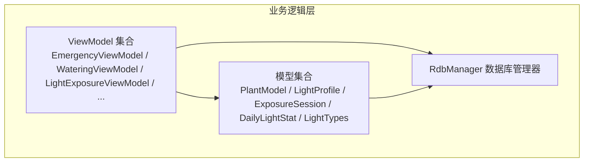
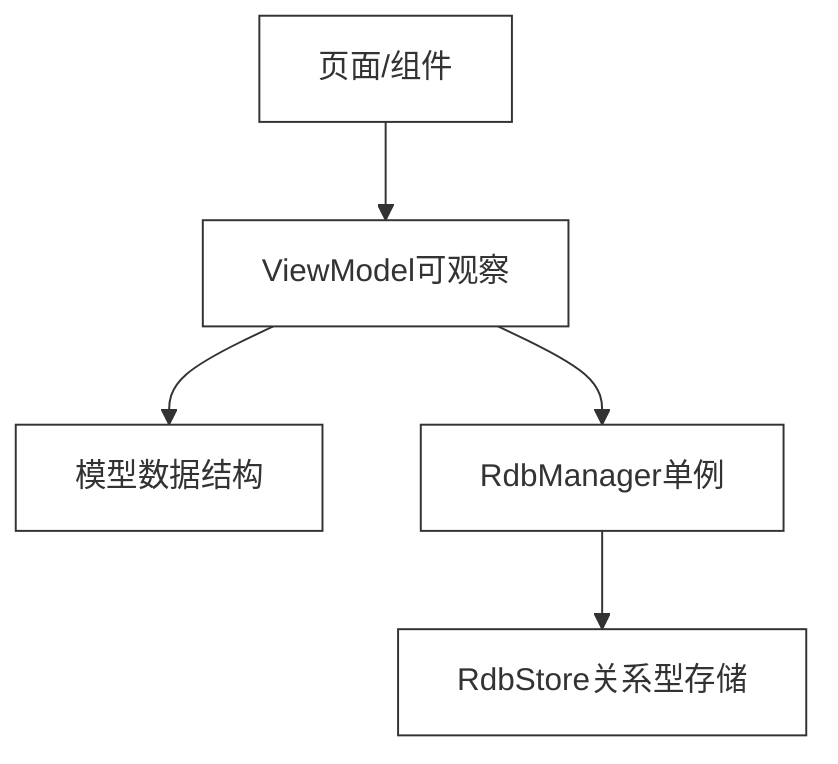
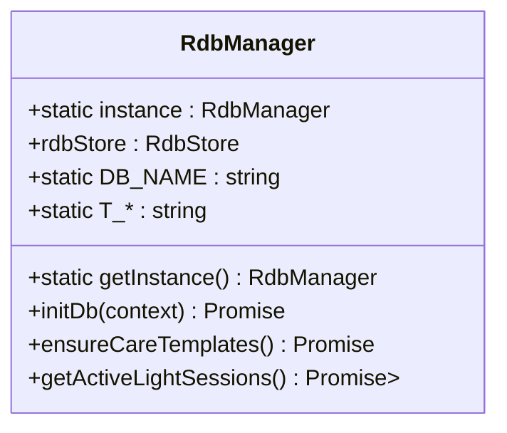
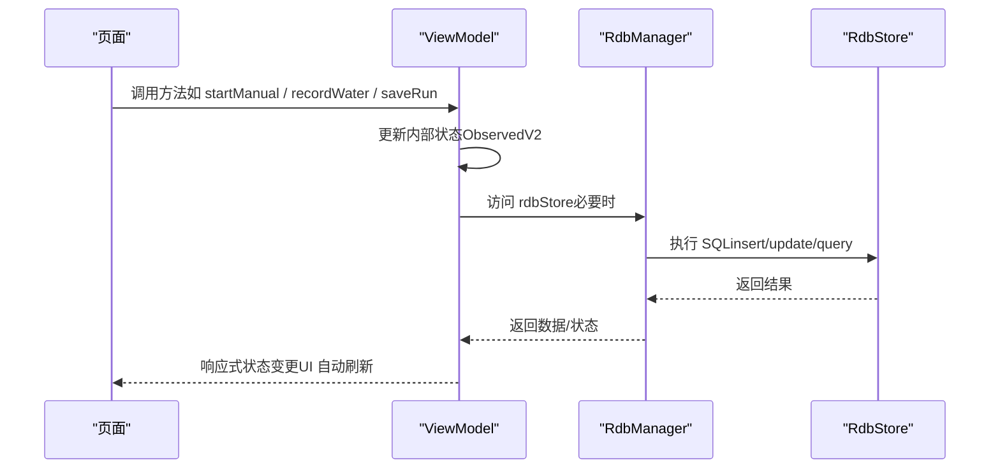
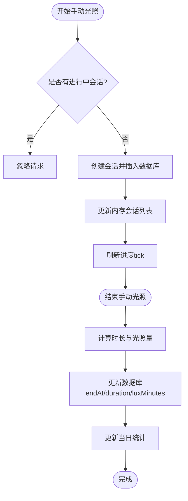
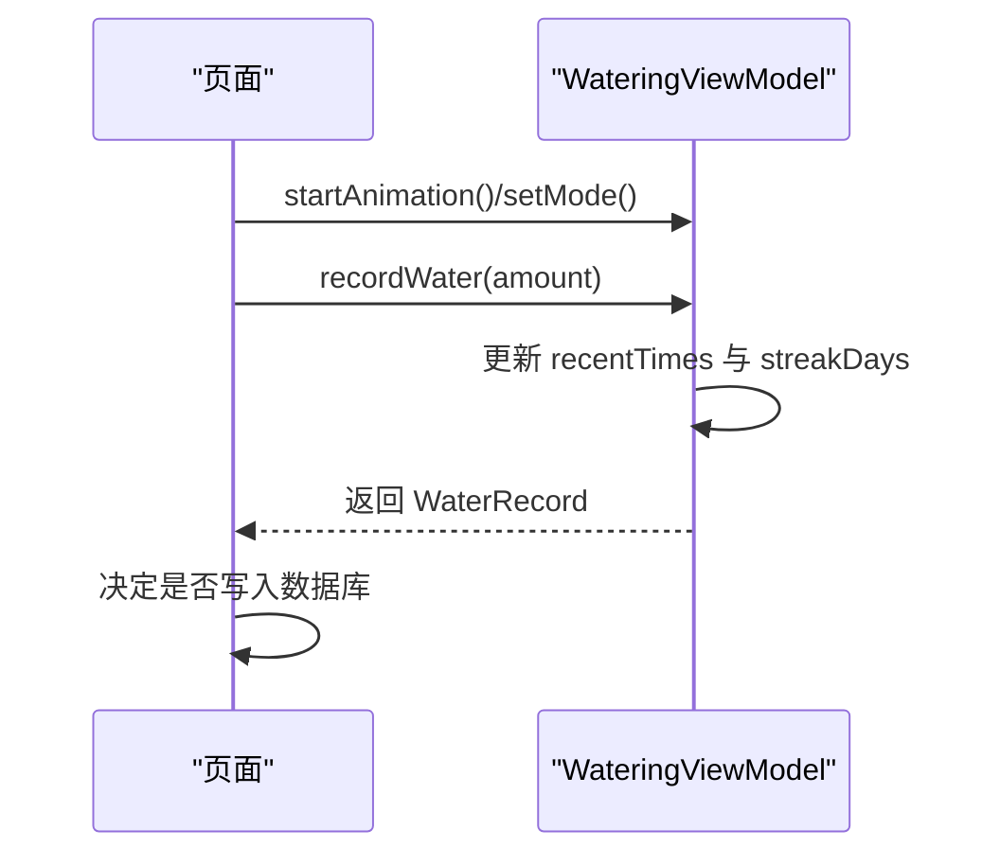
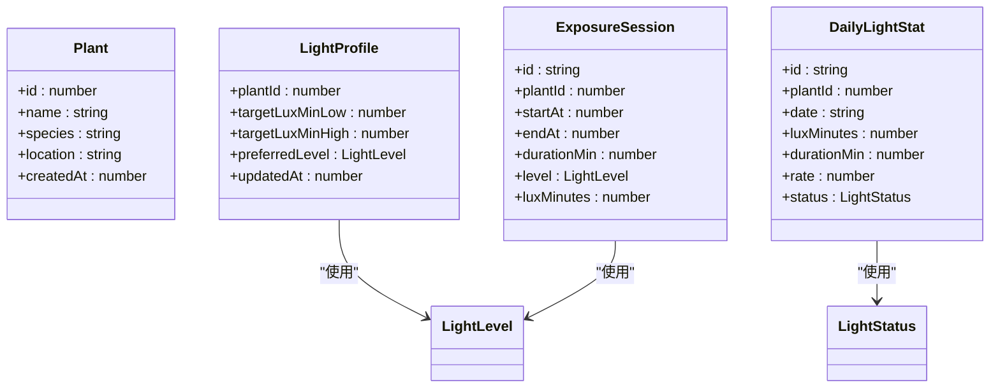
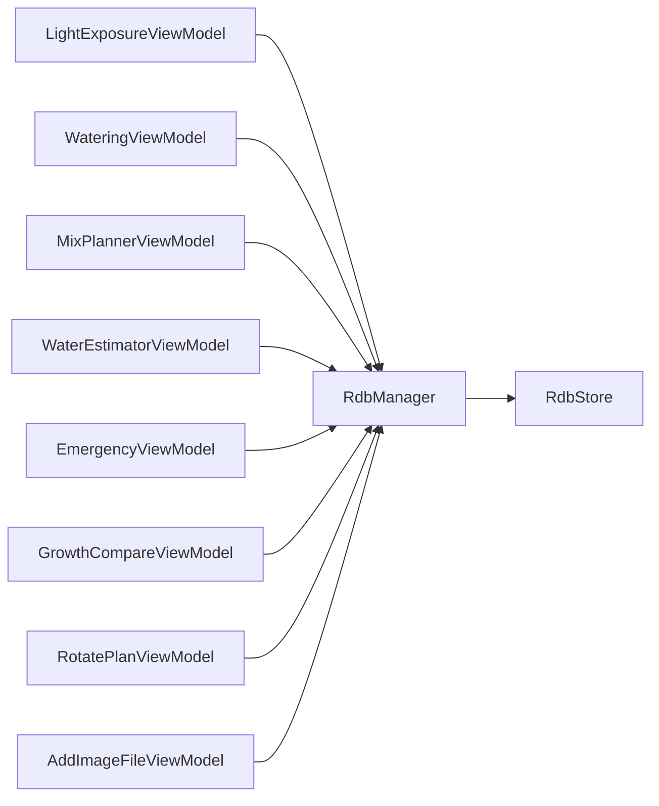

# 业务逻辑层

<cite>
**本文档引用的文件**
- [RdbManager.ets](file://entry/src/main/ets/viewmodel/RdbManager.ets)
- [EmergencyViewModel.ets](file://entry/src/main/ets/viewmodel/EmergencyViewModel.ets)
- [WateringViewModel.ets](file://entry/src/main/ets/viewmodel/WateringViewModel.ets)
- [LightExposureViewModel.ets](file://entry/src/main/ets/viewmodel/LightExposureViewModel.ets)
- [GrowthCompareViewModel.ets](file://entry/src/main/ets/viewmodel/GrowthCompareViewModel.ets)
- [MixPlannerViewModel.ets](file://entry/src/main/ets/viewmodel/MixPlannerViewModel.ets)
- [WaterEstimatorViewModel.ets](file://entry/src/main/ets/viewmodel/WaterEstimatorViewModel.ets)
- [RotatePlanViewModel.ets](file://entry/src/main/ets/viewmodel/RotatePlanViewModel.ets)
- [AddImageFileViewModel.ets](file://entry/src/main/ets/viewmodel/AddImageFileViewModel.ets)
- [err.ets](file://entry/src/main/ets/viewmodel/err.ets)
- [PlantModel.ets](file://entry/src/main/ets/model/PlantModel.ets)
- [WaterRecord.ets](file://entry/src/main/ets/model/WaterRecord.ets)
- [LightProfile.ets](file://entry/src/main/ets/model/LightProfile.ets)
- [ExposureSession.ets](file://entry/src/main/ets/model/ExposureSession.ets)
- [DailyLightStat.ets](file://entry/src/main/ets/model/DailyLightStat.ets)
- [LightTypes.ets](file://entry/src/main/ets/model/LightTypes.ets)
</cite>

## 目录
1. [简介](#简介)
2. [项目结构](#项目结构)
3. [核心组件](#核心组件)
4. [架构总览](#架构总览)
5. [详细组件分析](#详细组件分析)
6. [依赖分析](#依赖分析)
7. [性能考量](#性能考量)
8. [故障排查指南](#故障排查指南)
9. [结论](#结论)
10. [附录](#附录)

## 简介
本文件聚焦于 PlantDiary 项目的业务逻辑层，系统性梳理 ViewModel 层的设计模式与实现架构，深入解析 RdbManager 数据库管理器的单例模式与事务处理策略，阐述各 ViewModel 的职责边界与业务逻辑，解释响应式数据绑定与状态管理模式，给出业务调用流程与数据流转说明，并总结错误处理与异常策略。同时提供各 ViewModel 的使用示例与集成指引，帮助开发者快速上手与扩展。

## 项目结构
业务逻辑层主要位于 entry/src/main/ets/viewmodel 与 entry/src/main/ets/model 两个目录：
- viewmodel：以 ObservedV2 为基础的可观察 ViewModel，封装业务状态与交互逻辑，协调模型与页面。
- model：轻量数据模型与类型定义，承载页面与数据库之间的数据契约。

**图表来源**
- [RdbManager.ets:1-296](file://entry/src/main/ets/viewmodel/RdbManager.ets#L1-L296)
- [EmergencyViewModel.ets:1-115](file://entry/src/main/ets/viewmodel/EmergencyViewModel.ets#L1-L115)
- [WateringViewModel.ets:1-102](file://entry/src/main/ets/viewmodel/WateringViewModel.ets#L1-L102)
- [LightExposureViewModel.ets:1-554](file://entry/src/main/ets/viewmodel/LightExposureViewModel.ets#L1-L554)
- [GrowthCompareViewModel.ets:1-109](file://entry/src/main/ets/viewmodel/GrowthCompareViewModel.ets#L1-L109)
- [MixPlannerViewModel.ets:1-228](file://entry/src/main/ets/viewmodel/MixPlannerViewModel.ets#L1-L228)
- [WaterEstimatorViewModel.ets:1-130](file://entry/src/main/ets/viewmodel/WaterEstimatorViewModel.ets#L1-L130)
- [RotatePlanViewModel.ets:1-88](file://entry/src/main/ets/viewmodel/RotatePlanViewModel.ets#L1-L88)
- [AddImageFileViewModel.ets:1-146](file://entry/src/main/ets/viewmodel/AddImageFileViewModel.ets#L1-L146)
- [PlantModel.ets:1-166](file://entry/src/main/ets/model/PlantModel.ets#L1-L166)
- [LightProfile.ets:1-41](file://entry/src/main/ets/model/LightProfile.ets#L1-L41)
- [ExposureSession.ets:1-84](file://entry/src/main/ets/model/ExposureSession.ets#L1-L84)
- [DailyLightStat.ets:1-30](file://entry/src/main/ets/model/DailyLightStat.ets#L1-L30)
- [LightTypes.ets:1-124](file://entry/src/main/ets/model/LightTypes.ets#L1-L124)

**章节来源**
- [RdbManager.ets:1-296](file://entry/src/main/ets/viewmodel/RdbManager.ets#L1-L296)
- [EmergencyViewModel.ets:1-115](file://entry/src/main/ets/viewmodel/EmergencyViewModel.ets#L1-L115)
- [WateringViewModel.ets:1-102](file://entry/src/main/ets/viewmodel/WateringViewModel.ets#L1-L102)
- [LightExposureViewModel.ets:1-554](file://entry/src/main/ets/viewmodel/LightExposureViewModel.ets#L1-L554)
- [GrowthCompareViewModel.ets:1-109](file://entry/src/main/ets/viewmodel/GrowthCompareViewModel.ets#L1-L109)
- [MixPlannerViewModel.ets:1-228](file://entry/src/main/ets/viewmodel/MixPlannerViewModel.ets#L1-L228)
- [WaterEstimatorViewModel.ets:1-130](file://entry/src/main/ets/viewmodel/WaterEstimatorViewModel.ets#L1-L130)
- [RotatePlanViewModel.ets:1-88](file://entry/src/main/ets/viewmodel/RotatePlanViewModel.ets#L1-L88)
- [AddImageFileViewModel.ets:1-146](file://entry/src/main/ets/viewmodel/AddImageFileViewModel.ets#L1-L146)
- [PlantModel.ets:1-166](file://entry/src/main/ets/model/PlantModel.ets#L1-L166)
- [LightProfile.ets:1-41](file://entry/src/main/ets/model/LightProfile.ets#L1-L41)
- [ExposureSession.ets:1-84](file://entry/src/main/ets/model/ExposureSession.ets#L1-L84)
- [DailyLightStat.ets:1-30](file://entry/src/main/ets/model/DailyLightStat.ets#L1-L30)
- [LightTypes.ets:1-124](file://entry/src/main/ets/model/LightTypes.ets#L1-L124)

## 核心组件
- RdbManager：数据库管理器，采用单例模式，负责数据库初始化、建表与索引、默认数据注入、查询与统计等。
- ViewModel 集合：围绕具体业务场景构建的可观察状态容器，统一处理输入、计算、持久化与 UI 绑定。
- 模型集合：轻量数据结构，承载实体字段与少量构造逻辑，复杂规则置于 ViewModel 或页面。

**章节来源**
- [RdbManager.ets:1-296](file://entry/src/main/ets/viewmodel/RdbManager.ets#L1-L296)
- [EmergencyViewModel.ets:1-115](file://entry/src/main/ets/viewmodel/EmergencyViewModel.ets#L1-L115)
- [WateringViewModel.ets:1-102](file://entry/src/main/ets/viewmodel/WateringViewModel.ets#L1-L102)
- [LightExposureViewModel.ets:1-554](file://entry/src/main/ets/viewmodel/LightExposureViewModel.ets#L1-L554)
- [GrowthCompareViewModel.ets:1-109](file://entry/src/main/ets/viewmodel/GrowthCompareViewModel.ets#L1-L109)
- [MixPlannerViewModel.ets:1-228](file://entry/src/main/ets/viewmodel/MixPlannerViewModel.ets#L1-L228)
- [WaterEstimatorViewModel.ets:1-130](file://entry/src/main/ets/viewmodel/WaterEstimatorViewModel.ets#L1-L130)
- [RotatePlanViewModel.ets:1-88](file://entry/src/main/ets/viewmodel/RotatePlanViewModel.ets#L1-L88)
- [AddImageFileViewModel.ets:1-146](file://entry/src/main/ets/viewmodel/AddImageFileViewModel.ets#L1-L146)
- [PlantModel.ets:1-166](file://entry/src/main/ets/model/PlantModel.ets#L1-L166)
- [LightProfile.ets:1-41](file://entry/src/main/ets/model/LightProfile.ets#L1-L41)
- [ExposureSession.ets:1-84](file://entry/src/main/ets/model/ExposureSession.ets#L1-L84)
- [DailyLightStat.ets:1-30](file://entry/src/main/ets/model/DailyLightStat.ets#L1-L30)
- [LightTypes.ets:1-124](file://entry/src/main/ets/model/LightTypes.ets#L1-L124)

## 架构总览
业务逻辑层遵循“ViewModel 负责状态与流程，Model 负责数据契约，RdbManager 负责数据持久化”的分层设计。ViewModel 通过 ObservedV2 实现响应式状态，页面仅与 ViewModel 交互，不直接访问数据库。

**图表来源**
- [RdbManager.ets:1-296](file://entry/src/main/ets/viewmodel/RdbManager.ets#L1-L296)
- [LightExposureViewModel.ets:1-554](file://entry/src/main/ets/viewmodel/LightExposureViewModel.ets#L1-L554)
- [LightProfile.ets:1-41](file://entry/src/main/ets/model/LightProfile.ets#L1-L41)
- [ExposureSession.ets:1-84](file://entry/src/main/ets/model/ExposureSession.ets#L1-L84)
- [DailyLightStat.ets:1-30](file://entry/src/main/ets/model/DailyLightStat.ets#L1-L30)
- [LightTypes.ets:1-124](file://entry/src/main/ets/model/LightTypes.ets#L1-L124)

## 详细组件分析

### RdbManager 数据库管理器（单例与事务）
- 单例模式：通过静态实例与静态获取方法确保全局唯一，避免重复初始化与资源浪费。
- 初始化与建模：集中执行数据库配置、建表、索引与默认数据注入，保证页面仅依赖统一入口。
- 事务处理：代码中预留了事务样例（开启事务、提交/回滚、批量更新/删除），体现对一致性与原子性的重视，实际页面可按需启用。
- 查询与统计：提供活跃光照会话查询等高频场景接口，便于首页状态同步。

**图表来源**
- [RdbManager.ets:1-296](file://entry/src/main/ets/viewmodel/RdbManager.ets#L1-L296)

**章节来源**
- [RdbManager.ets:1-296](file://entry/src/main/ets/viewmodel/RdbManager.ets#L1-L296)
- [err.ets:1-169](file://entry/src/main/ets/viewmodel/err.ets#L1-L169)

### ViewModel 设计模式与响应式绑定
- 设计模式：以 ObservedV2 为基座，ViewModel 作为状态容器，统一处理输入、计算、持久化与 UI 绑定，降低页面复杂度。
- 响应式数据绑定：通过可观察字段与数组更新策略，确保 UI 能感知状态变化并自动刷新。
- 状态管理模式：将业务状态（如光照会话、浇水记录、对比参数等）收敛在 ViewModel 内部，页面通过方法调用与属性读取与之交互。

**图表来源**
- [LightExposureViewModel.ets:1-554](file://entry/src/main/ets/viewmodel/LightExposureViewModel.ets#L1-L554)
- [WateringViewModel.ets:1-102](file://entry/src/main/ets/viewmodel/WateringViewModel.ets#L1-L102)
- [MixPlannerViewModel.ets:1-228](file://entry/src/main/ets/viewmodel/MixPlannerViewModel.ets#L1-L228)
- [RdbManager.ets:1-296](file://entry/src/main/ets/viewmodel/RdbManager.ets#L1-L296)

**章节来源**
- [LightExposureViewModel.ets:1-554](file://entry/src/main/ets/viewmodel/LightExposureViewModel.ets#L1-L554)
- [WateringViewModel.ets:1-102](file://entry/src/main/ets/viewmodel/WateringViewModel.ets#L1-L102)
- [MixPlannerViewModel.ets:1-228](file://entry/src/main/ets/viewmodel/MixPlannerViewModel.ets#L1-L228)

### 各 ViewModel 功能职责与业务逻辑

#### 光照记录 ViewModel（LightExposureViewModel）
- 职责：管理光照配置、会话生命周期、历史数据与每日统计，支持手动开始/结束与即时补记。
- 关键流程：
  - 初始化：加载配置、会话、清理异常进行中会话、重建每日统计。
  - 会话管理：开始/结束手动会话，自动计算时长与光照量，更新内存与数据库。
  - 统计计算：按日汇总 lux-min 与时长，计算达标率与状态，支持七日趋势。
  - 配置更新：动态调整目标范围与偏好级别，联动统计刷新。
- 数据流：页面触发方法 → ViewModel 更新状态与数据库 → ViewModel 计算统计 → UI 响应式刷新。

**图表来源**
- [LightExposureViewModel.ets:129-192](file://entry/src/main/ets/viewmodel/LightExposureViewModel.ets#L129-L192)
- [LightExposureViewModel.ets:298-365](file://entry/src/main/ets/viewmodel/LightExposureViewModel.ets#L298-L365)

**章节来源**
- [LightExposureViewModel.ets:1-554](file://entry/src/main/ets/viewmodel/LightExposureViewModel.ets#L1-L554)
- [LightProfile.ets:1-41](file://entry/src/main/ets/model/LightProfile.ets#L1-L41)
- [ExposureSession.ets:1-84](file://entry/src/main/ets/model/ExposureSession.ets#L1-L84)
- [DailyLightStat.ets:1-30](file://entry/src/main/ets/model/DailyLightStat.ets#L1-L30)
- [LightTypes.ets:1-124](file://entry/src/main/ets/model/LightTypes.ets#L1-L124)

#### 浇水 ViewModel（WateringViewModel）
- 职责：管理浇水动画状态、历史记录（内存）、连胜天数逻辑，生成 WaterRecord。
- 关键流程：
  - 切换模式（轻/深）。
  - 开始/停止动画。
  - 记录一次浇水：更新内存历史与连胜天数，返回 WaterRecord 供上层决定是否持久化。
- 数据流：页面触发动画/记录 → ViewModel 更新内存状态 → 返回 WaterRecord → 上层决定落库。

**图表来源**
- [WateringViewModel.ets:44-57](file://entry/src/main/ets/viewmodel/WateringViewModel.ets#L44-L57)
- [WaterRecord.ets:1-18](file://entry/src/main/ets/model/WaterRecord.ets#L1-L18)

**章节来源**
- [WateringViewModel.ets:1-102](file://entry/src/main/ets/viewmodel/WateringViewModel.ets#L1-L102)
- [WaterRecord.ets:1-18](file://entry/src/main/ets/model/WaterRecord.ets#L1-L18)

#### 急救流程 ViewModel（EmergencyViewModel）
- 职责：症状选择 → 步骤勾选 → 开始观察（生成记录，内存态）→ 历史列表。
- 关键流程：
  - 选择症状，重建勾选数组，保证 UI 与步骤数一致。
  - 生成急救记录（带复查时间），追加到历史列表头部。
  - 标记完成：通过重建对象保证 UI 更新。
- 数据流：症状选择 → 步骤勾选 → 生成记录 → 历史列表更新。

**章节来源**
- [EmergencyViewModel.ets:1-115](file://entry/src/main/ets/viewmodel/EmergencyViewModel.ets#L1-L115)

#### 生长对比 ViewModel（GrowthCompareViewModel）
- 职责：前后对比工作区管理（before/after）、对齐参数（分割、缩放、偏移、网格、对齐模式）、保存对比卡。
- 关键流程：
  - 设置 before/after，支持交换。
  - 调整对齐参数并重置。
  - 保存时冻结图片关系与备注，追加到已保存列表。
- 数据流：选择图片 → 调整对齐 → 保存 → 列表更新。

**章节来源**
- [GrowthCompareViewModel.ets:1-109](file://entry/src/main/ets/viewmodel/GrowthCompareViewModel.ets#L1-L109)

#### 混合配土 ViewModel（MixPlannerViewModel）
- 职责：内置配方选择、自定义编辑、计算结果、保存“我的配方”与调配记录。
- 关键流程：
  - 初始化内置配方与默认自定义配方。
  - 编辑材料（增删改名/比例/密度）、设置总量。
  - 计算：按比例分摊体积，结合密度估算重量。
  - 保存“我的配方”与“一次调配记录”，均冻结当前快照。
- 数据流：选择配方 → 编辑材料 → 计算 → 保存 → 列表更新。

**章节来源**
- [MixPlannerViewModel.ets:1-228](file://entry/src/main/ets/viewmodel/MixPlannerViewModel.ets#L1-L228)

#### 浇水量估算 ViewModel（WaterEstimatorViewModel）
- 职责：接收输入参数（盆径、深度、保水性、策略、植物类型），实时计算区间结果，保存估算日志。
- 关键流程：
  - 修改任一输入即重算区间。
  - 生成建议文案与简要公式说明。
  - 保存日志：冻结当前输入与结果快照。
- 数据流：输入变更 → 自动重算 → 生成建议 → 保存日志。

**章节来源**
- [WaterEstimatorViewModel.ets:1-130](file://entry/src/main/ets/viewmodel/WaterEstimatorViewModel.ets#L1-L130)

#### 转盆计划 ViewModel（RotatePlanViewModel）
- 职责：启用/周期设置、到期判断、完成打卡、历史记录。
- 关键流程：
  - 启用开关与周期天数设置。
  - 打卡：同步刷新 lastRotatedAt，并追加历史记录。
  - 到期判断：统一委托底层计划对象计算。
- 数据流：设置参数 → 打卡 → 到期判断 → 历史更新。

**章节来源**
- [RotatePlanViewModel.ets:1-88](file://entry/src/main/ets/viewmodel/RotatePlanViewModel.ets#L1-L88)

#### 图片处理 ViewModel（AddImageFileViewModel）
- 职责：单例封装图片选择、缩略图生成、分布式文件写入，供多页面复用。
- 关键流程：
  - 获取单例实例。
  - 选图 → 处理（缩略图）→ 写入分布式目录 → 回调新图列表。
- 数据流：页面调用 → 选图/处理/写入 → 回调结果。

**章节来源**
- [AddImageFileViewModel.ets:1-146](file://entry/src/main/ets/viewmodel/AddImageFileViewModel.ets#L1-L146)

### 数据模型与类型
- PlantModel：植物、任务、草稿、指标等基础模型，字段清晰，便于页面与数据库映射。
- LightProfile/ExposureSession/DailyLightStat/LightTypes：光照模块专用模型与类型，支撑光照配置、会话与统计。

**图表来源**
- [PlantModel.ets:1-166](file://entry/src/main/ets/model/PlantModel.ets#L1-L166)
- [LightProfile.ets:1-41](file://entry/src/main/ets/model/LightProfile.ets#L1-L41)
- [ExposureSession.ets:1-84](file://entry/src/main/ets/model/ExposureSession.ets#L1-L84)
- [DailyLightStat.ets:1-30](file://entry/src/main/ets/model/DailyLightStat.ets#L1-L30)
- [LightTypes.ets:1-124](file://entry/src/main/ets/model/LightTypes.ets#L1-L124)

**章节来源**
- [PlantModel.ets:1-166](file://entry/src/main/ets/model/PlantModel.ets#L1-L166)
- [LightProfile.ets:1-41](file://entry/src/main/ets/model/LightProfile.ets#L1-L41)
- [ExposureSession.ets:1-84](file://entry/src/main/ets/model/ExposureSession.ets#L1-L84)
- [DailyLightStat.ets:1-30](file://entry/src/main/ets/model/DailyLightStat.ets#L1-L30)
- [LightTypes.ets:1-124](file://entry/src/main/ets/model/LightTypes.ets#L1-L124)

## 依赖分析
- ViewModel 与模型：通过 @ObservedV2 字段与方法调用建立依赖，模型仅承载数据契约。
- ViewModel 与数据库：通过 RdbManager 单例访问 RdbStore，集中处理建表、索引、查询与更新。
- 事务依赖：RdbManager 提供事务能力，ViewModel 可按需启用（如批量更新/删除）。

**图表来源**
- [LightExposureViewModel.ets:1-554](file://entry/src/main/ets/viewmodel/LightExposureViewModel.ets#L1-L554)
- [WateringViewModel.ets:1-102](file://entry/src/main/ets/viewmodel/WateringViewModel.ets#L1-L102)
- [MixPlannerViewModel.ets:1-228](file://entry/src/main/ets/viewmodel/MixPlannerViewModel.ets#L1-L228)
- [WaterEstimatorViewModel.ets:1-130](file://entry/src/main/ets/viewmodel/WaterEstimatorViewModel.ets#L1-L130)
- [EmergencyViewModel.ets:1-115](file://entry/src/main/ets/viewmodel/EmergencyViewModel.ets#L1-L115)
- [GrowthCompareViewModel.ets:1-109](file://entry/src/main/ets/viewmodel/GrowthCompareViewModel.ets#L1-L109)
- [RotatePlanViewModel.ets:1-88](file://entry/src/main/ets/viewmodel/RotatePlanViewModel.ets#L1-L88)
- [AddImageFileViewModel.ets:1-146](file://entry/src/main/ets/viewmodel/AddImageFileViewModel.ets#L1-L146)
- [RdbManager.ets:1-296](file://entry/src/main/ets/viewmodel/RdbManager.ets#L1-L296)

**章节来源**
- [LightExposureViewModel.ets:1-554](file://entry/src/main/ets/viewmodel/LightExposureViewModel.ets#L1-L554)
- [WateringViewModel.ets:1-102](file://entry/src/main/ets/viewmodel/WateringViewModel.ets#L1-L102)
- [MixPlannerViewModel.ets:1-228](file://entry/src/main/ets/viewmodel/MixPlannerViewModel.ets#L1-L228)
- [WaterEstimatorViewModel.ets:1-130](file://entry/src/main/ets/viewmodel/WaterEstimatorViewModel.ets#L1-L130)
- [EmergencyViewModel.ets:1-115](file://entry/src/main/ets/viewmodel/EmergencyViewModel.ets#L1-L115)
- [GrowthCompareViewModel.ets:1-109](file://entry/src/main/ets/viewmodel/GrowthCompareViewModel.ets#L1-L109)
- [RotatePlanViewModel.ets:1-88](file://entry/src/main/ets/viewmodel/RotatePlanViewModel.ets#L1-L88)
- [AddImageFileViewModel.ets:1-146](file://entry/src/main/ets/viewmodel/AddImageFileViewModel.ets#L1-L146)
- [RdbManager.ets:1-296](file://entry/src/main/ets/viewmodel/RdbManager.ets#L1-L296)

## 性能考量
- 响应式更新：通过 @ObservedV2 与数组重建策略，减少不必要的重绘，提升 UI 渲染效率。
- 数据库索引：针对高频查询（任务按日期/植物、日志按植物+时间、指标按植物+时间）建立复合索引，优化查询性能。
- 统计增量更新：光照每日统计采用按日增量更新，避免全量扫描，提高实时性与性能。
- 内存态优先：浇水等高频操作先更新内存状态，由上层决定持久化时机，降低数据库压力。

[本节为通用性能指导，无需特定文件引用]

## 故障排查指南
- 数据库初始化失败：检查上下文与配置，确认数据库连接成功与建表完成。
- 查询异常降级：当查询失败时返回空集合或空映射，页面应具备容错显示。
- 事务回滚：批量更新/删除失败时应执行回滚并提示用户，避免脏数据。
- 图片处理异常：捕获错误并记录日志，确保资源释放（如 PixelMap 释放）。

**章节来源**
- [RdbManager.ets:282-294](file://entry/src/main/ets/viewmodel/RdbManager.ets#L282-L294)
- [err.ets:1-169](file://entry/src/main/ets/viewmodel/err.ets#L1-L169)
- [AddImageFileViewModel.ets:109-144](file://entry/src/main/ets/viewmodel/AddImageFileViewModel.ets#L109-L144)

## 结论
业务逻辑层通过 ViewModel 的可观察状态与集中式数据库管理，实现了清晰的职责分离与高效的响应式交互。RdbManager 的单例与事务能力为数据一致性提供了保障；各 ViewModel 将复杂业务规则内聚，简化了页面逻辑。建议在需要批量/一致性场景启用事务，在高频更新场景采用内存态优先策略，并持续优化索引与统计算法以提升性能。

[本节为总结性内容，无需特定文件引用]

## 附录

### 使用示例与集成指南

- 光照记录（LightExposureViewModel）
  - 初始化：在页面加载时调用 init，从数据库加载配置与历史。
  - 开始/结束：调用 startManual/endManualWithAutoDuration，自动计算时长与光照量。
  - 即时补记：调用 addManualInstant，直接插入历史记录。
  - 统计查看：读取 todayRatePercent、todayStatus、sevenDays 获取实时状态与七日趋势。
  - 集成要点：页面仅与 ViewModel 交互，不直接访问数据库。

- 浇水（WateringViewModel）
  - 设置模式：setMode 切换轻/深。
  - 记录浇水：recordWater 返回 WaterRecord，由上层决定是否持久化。
  - 连续天数：streakDays 由 recentTimes 推导，容忍跨天误差。

- 急救流程（EmergencyViewModel）
  - 选择症状：selectSymptom，重建勾选数组。
  - 开始观察：startObservation 生成记录并追加到历史。
  - 标记完成：markCompleted 通过重建对象更新 UI。

- 生长对比（GrowthCompareViewModel）
  - 设置 before/after：setBefore/setAfter。
  - 调整对齐：setSplit/setZoom/panBy/resetAlign/toggleGrid/toggleAlignMode。
  - 保存：savePair 冻结快照并追加到列表。

- 混合配土（MixPlannerViewModel）
  - 选择内置：chooseBuiltin 深拷贝材料列表。
  - 自定义编辑：addItem/removeItem/setItemName/setItemRatio/setItemDensity/setTotalLiters。
  - 计算：compute 返回分项体积与重量。
  - 保存：saveMyRecipe 保存“我的配方”，saveRun 保存“一次调配记录”。

- 浇水量估算（WaterEstimatorViewModel）
  - 修改输入：setDiameter/setDepth/setRetention/setStrategy/setPlant。
  - 计算：compute 自动重算区间。
  - 保存日志：saveLog 冻结当前输入与结果。

- 转盆计划（RotatePlanViewModel）
  - 设置：setEnabled/setIntervalDays。
  - 打卡：markRotatedNow 同步刷新 lastRotatedAt 并追加历史。
  - 到期：nextDueAt/overdue 统一委托计划对象计算。

- 图片处理（AddImageFileViewModel）
  - 单例：getInstance 获取实例。
  - 选图处理：selectAndProcessImages，回调返回新图列表。
  - 写入：写入分布式目录，便于后续共享与预览。

**章节来源**
- [LightExposureViewModel.ets:1-554](file://entry/src/main/ets/viewmodel/LightExposureViewModel.ets#L1-L554)
- [WateringViewModel.ets:1-102](file://entry/src/main/ets/viewmodel/WateringViewModel.ets#L1-L102)
- [EmergencyViewModel.ets:1-115](file://entry/src/main/ets/viewmodel/EmergencyViewModel.ets#L1-L115)
- [GrowthCompareViewModel.ets:1-109](file://entry/src/main/ets/viewmodel/GrowthCompareViewModel.ets#L1-L109)
- [MixPlannerViewModel.ets:1-228](file://entry/src/main/ets/viewmodel/MixPlannerViewModel.ets#L1-L228)
- [WaterEstimatorViewModel.ets:1-130](file://entry/src/main/ets/viewmodel/WaterEstimatorViewModel.ets#L1-L130)
- [RotatePlanViewModel.ets:1-88](file://entry/src/main/ets/viewmodel/RotatePlanViewModel.ets#L1-L88)
- [AddImageFileViewModel.ets:1-146](file://entry/src/main/ets/viewmodel/AddImageFileViewModel.ets#L1-L146)