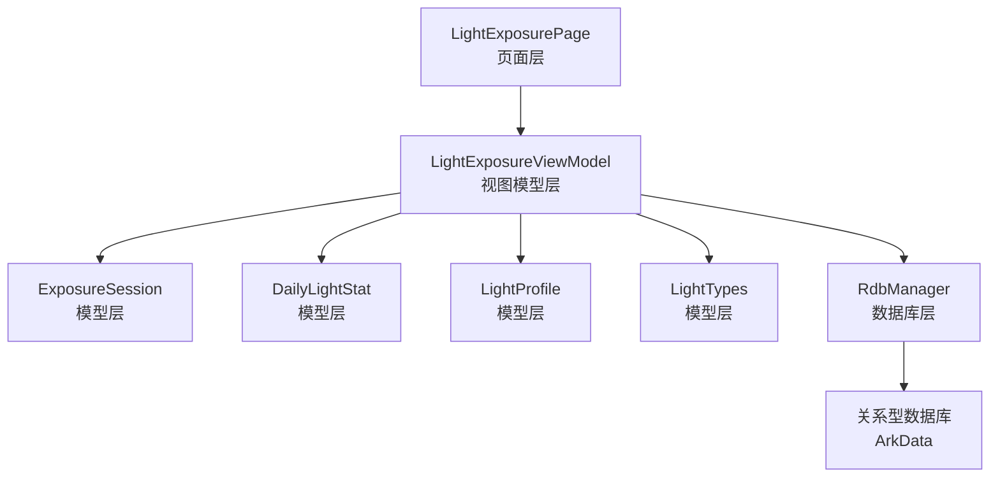
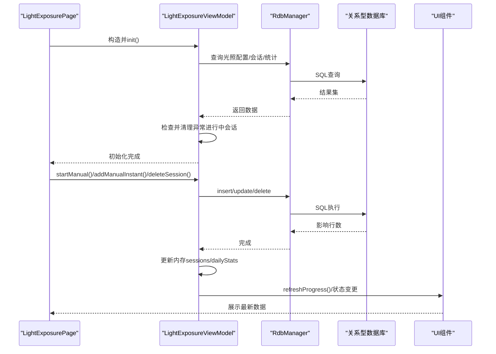
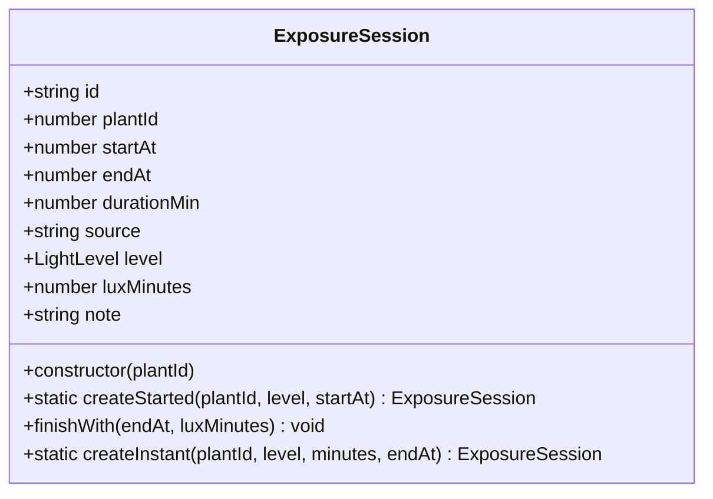
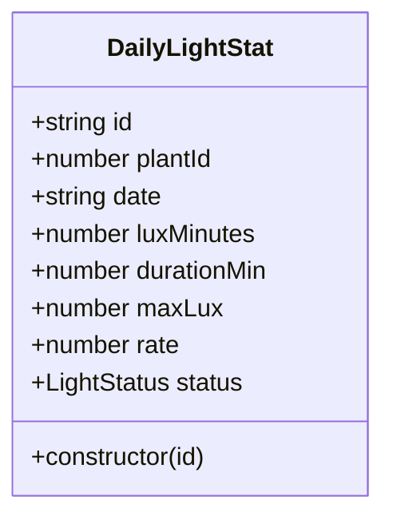
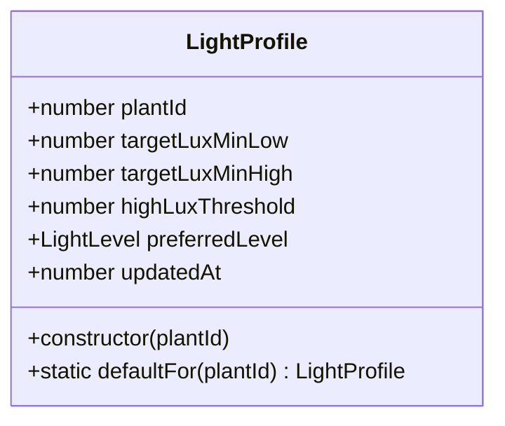
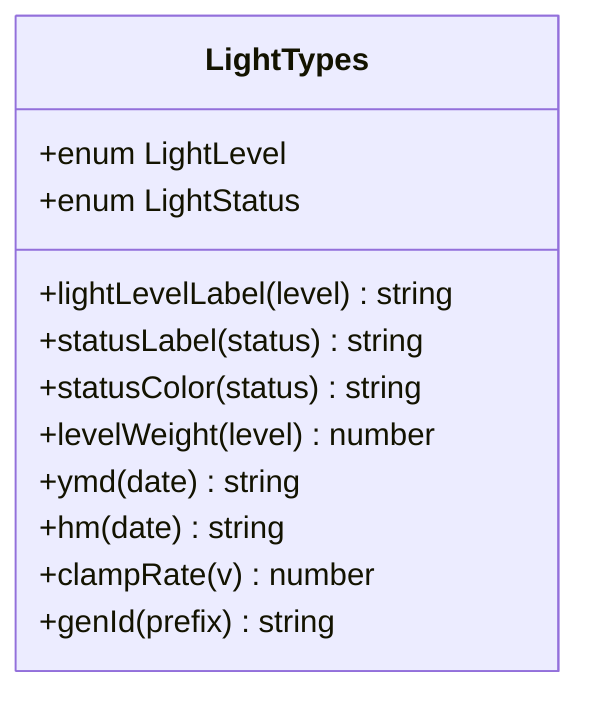
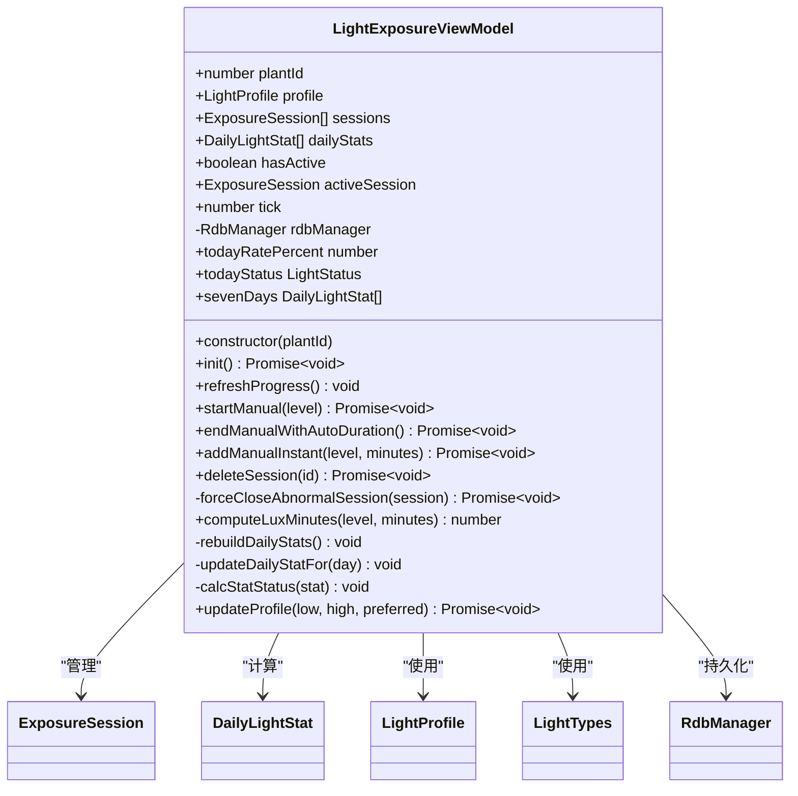
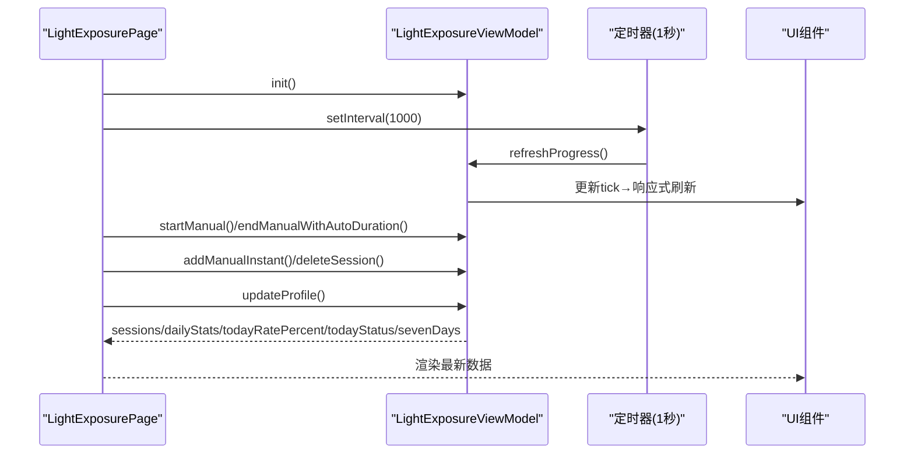
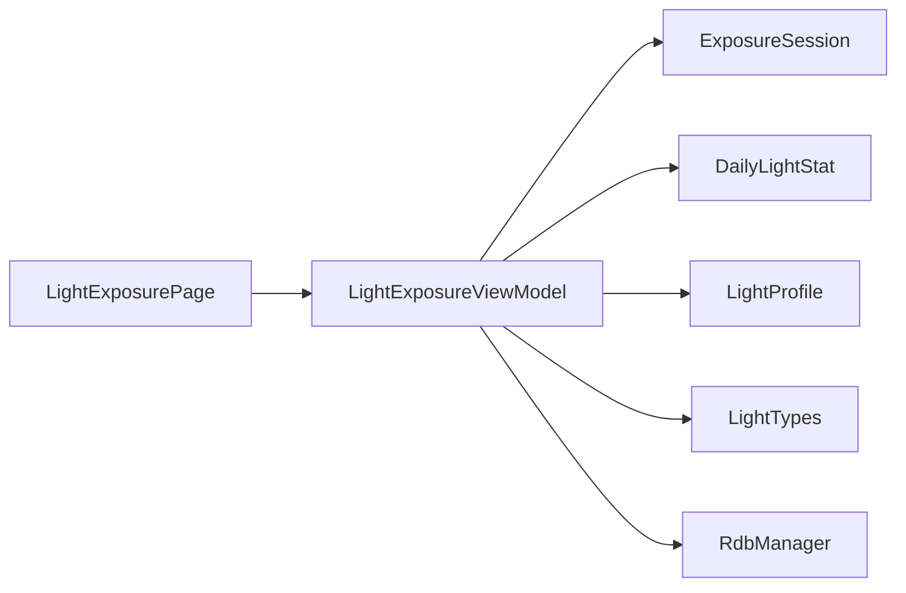

# 光照监控ViewModel

<cite>
**本文档引用的文件**
- [LightExposureViewModel.ets](file://entry/src/main/ets/viewmodel/LightExposureViewModel.ets)
- [ExposureSession.ets](file://entry/src/main/ets/model/ExposureSession.ets)
- [DailyLightStat.ets](file://entry/src/main/ets/model/DailyLightStat.ets)
- [LightTypes.ets](file://entry/src/main/ets/model/LightTypes.ets)
- [LightProfile.ets](file://entry/src/main/ets/model/LightProfile.ets)
- [RdbManager.ets](file://entry/src/main/ets/viewmodel/RdbManager.ets)
- [LightExposurePage.ets](file://entry/src/main/ets/pages/LightExposurePage.ets)
</cite>

## 更新摘要
**变更内容**
- 新增强制关闭异常会话的方法，解决应用崩溃或意外终止导致的并发活动会话问题
- 增强初始化阶段的异常会话清理机制
- 完善异常会话状态管理与数据一致性保障

## 目录
1. [简介](#简介)
2. [项目结构](#项目结构)
3. [核心组件](#核心组件)
4. [架构总览](#架构总览)
5. [详细组件分析](#详细组件分析)
6. [依赖关系分析](#依赖关系分析)
7. [性能考量](#性能考量)
8. [故障排查指南](#故障排查指南)
9. [结论](#结论)
10. [附录](#附录)

## 简介
本文件面向开发者，系统性阐述光照监控ViewModel的设计与实现，重点覆盖以下方面：
- 光照记录系统的业务逻辑与数据流转
- ExposureSession的创建、管理与状态跟踪机制
- 光照级别定义与luxMinutes的计算方法（含权重与累积统计）
- 光照会话生命周期管理（从开始到结束的状态转换）
- 光照数据的查询、更新与删除操作实现细节
- 光照统计分析算法与图表展示逻辑
- 异常会话处理与数据一致性保障机制
- 集成指南与使用示例

## 项目结构
光照监控功能位于应用的主模块中，采用"页面-视图模型-模型-数据库管理器"的分层设计：
- 页面层：LightExposurePage负责用户交互与UI展示
- 视图模型层：LightExposureViewModel负责业务逻辑、状态管理与数据持久化
- 模型层：ExposureSession、DailyLightStat、LightProfile、LightTypes等承载数据结构与工具
- 数据库层：RdbManager封装ArkTS关系型数据库的初始化、建表与CRUD

**图表来源**
- [LightExposurePage.ets:210-384](file://entry/src/main/ets/pages/LightExposurePage.ets#L210-L384)
- [LightExposureViewModel.ets:16-36](file://entry/src/main/ets/viewmodel/LightExposureViewModel.ets#L16-L36)
- [ExposureSession.ets:14-33](file://entry/src/main/ets/model/ExposureSession.ets#L14-L33)
- [DailyLightStat.ets:11-28](file://entry/src/main/ets/model/DailyLightStat.ets#L11-L28)
- [LightProfile.ets:11-27](file://entry/src/main/ets/model/LightProfile.ets#L11-L27)
- [RdbManager.ets:4-24](file://entry/src/main/ets/viewmodel/RdbManager.ets#L4-L24)

**章节来源**
- [LightExposurePage.ets:210-384](file://entry/src/main/ets/pages/LightExposurePage.ets#L210-L384)
- [LightExposureViewModel.ets:16-36](file://entry/src/main/ets/viewmodel/LightExposureViewModel.ets#L16-L36)
- [RdbManager.ets:4-24](file://entry/src/main/ets/viewmodel/RdbManager.ets#L4-L24)

## 核心组件
- LightExposureViewModel：光照记录的中枢，负责会话管理、统计计算、数据库交互与UI驱动，包含异常会话处理机制
- ExposureSession：单次光照会话的数据载体，支持"开始/结束"与"即时记录"两种模式
- DailyLightStat：每日光照统计，包含累计luxMinutes、时长、达标率与状态
- LightProfile：光照目标配置，包含目标上下限与偏好级别
- LightTypes：光照级别与状态枚举、标签与颜色映射、权重与工具函数
- RdbManager：数据库初始化、建表与CRUD封装

**章节来源**
- [LightExposureViewModel.ets:16-36](file://entry/src/main/ets/viewmodel/LightExposureViewModel.ets#L16-L36)
- [ExposureSession.ets:14-83](file://entry/src/main/ets/model/ExposureSession.ets#L14-L83)
- [DailyLightStat.ets:11-28](file://entry/src/main/ets/model/DailyLightStat.ets#L11-L28)
- [LightProfile.ets:11-27](file://entry/src/main/ets/model/LightProfile.ets#L11-L27)
- [LightTypes.ets:5-70](file://entry/src/main/ets/model/LightTypes.ets#L5-L70)
- [RdbManager.ets:4-24](file://entry/src/main/ets/viewmodel/RdbManager.ets#L4-L24)

## 架构总览
光照监控的端到端流程如下：
- 页面初始化：LightExposurePage创建并注入LightExposureViewModel
- 视图模型初始化：加载光照配置、历史会话与重建每日统计，包含异常会话清理
- 用户交互：开始/结束光照、补记光照、删除记录
- 数据持久化：通过RdbManager写入数据库，同时维护内存状态
- 统计计算：按日聚合luxMinutes与durationMin，计算达标率与状态
- 异常处理：强制关闭异常进行中会话，确保数据一致性
- UI更新：通过tick驱动与AppStorage同步，实现实时进度与状态展示

**图表来源**
- [LightExposurePage.ets:229-241](file://entry/src/main/ets/pages/LightExposurePage.ets#L229-L241)
- [LightExposureViewModel.ets:43-113](file://entry/src/main/ets/viewmodel/LightExposureViewModel.ets#L43-L113)
- [RdbManager.ets:27-170](file://entry/src/main/ets/viewmodel/RdbManager.ets#L27-L170)

**章节来源**
- [LightExposurePage.ets:229-241](file://entry/src/main/ets/pages/LightExposurePage.ets#L229-L241)
- [LightExposureViewModel.ets:43-113](file://entry/src/main/ets/viewmodel/LightExposureViewModel.ets#L43-L113)
- [RdbManager.ets:27-170](file://entry/src/main/ets/viewmodel/RdbManager.ets#L27-L170)

## 详细组件分析

### ExposureSession：光照会话模型
- 职责：记录一次完整的光照过程，支持两种模式
  - 开始/结束模式：createStarted + finishWith
  - 即时记录模式：createInstant（补记历史）
- 关键字段：id、plantId、startAt、endAt、durationMin、level、luxMinutes、note
- 生命周期：从createStarted到finishWith，endAt=0表示进行中

**图表来源**
- [ExposureSession.ets:14-83](file://entry/src/main/ets/model/ExposureSession.ets#L14-L83)

**章节来源**
- [ExposureSession.ets:14-83](file://entry/src/main/ets/model/ExposureSession.ets#L14-L83)

### DailyLightStat：每日统计模型
- 职责：按日聚合光照数据，计算达标率与状态
- 字段：id、plantId、date、luxMinutes、durationMin、maxLux、rate、status
- 状态计算：依据profile.targetLuxMinHigh与当日luxMinutes计算rate并判定状态

**图表来源**
- [DailyLightStat.ets:11-29](file://entry/src/main/ets/model/DailyLightStat.ets#L11-L29)

**章节来源**
- [DailyLightStat.ets:11-29](file://entry/src/main/ets/model/DailyLightStat.ets#L11-L29)

### LightProfile：光照目标配置
- 职责：每株植物的光照偏好与目标范围
- 字段：plantId、targetLuxMinLow、targetLuxMinHigh、highLuxThreshold、preferredLevel、updatedAt
- 默认策略：defaultFor返回中光偏好与目标范围

**图表来源**
- [LightProfile.ets:11-40](file://entry/src/main/ets/model/LightProfile.ets#L11-L40)

**章节来源**
- [LightProfile.ets:11-40](file://entry/src/main/ets/model/LightProfile.ets#L11-L40)

### LightTypes：光照级别与工具
- 枚举：LightLevel（LOW/MID/HIGH）、LightStatus（INSUFF/OK/STRONG）
- 工具：lightLevelLabel、statusLabel、statusColor、levelWeight、ymd、hm、clampRate、genId

**图表来源**
- [LightTypes.ets:5-124](file://entry/src/main/ets/model/LightTypes.ets#L5-L124)

**章节来源**
- [LightTypes.ets:5-124](file://entry/src/main/ets/model/LightTypes.ets#L5-L124)

### LightExposureViewModel：光照监控核心
- 状态属性：plantId、profile、sessions、dailyStats、hasActive、activeSession、tick
- 初始化：加载配置、历史会话，清理异常进行中会话，重建每日统计
- 会话管理：
  - startManual：创建进行中会话，写库并同步AppStorage
  - endManualWithAutoDuration：自动计算时长与luxMinutes，更新会话并刷新统计
  - addManualInstant：补记历史，不进入进行中
  - deleteSession：删除记录并修正统计
  - **forceCloseAbnormalSession：强制结束异常进行中会话**（新增）
- 统计计算：
  - computeLuxMinutes：基于levelWeight与分钟数计算luxMinutes
  - rebuildDailyStats：全量重建每日统计
  - updateDailyStatFor：增量更新某日统计
  - calcStatStatus：根据达标率判定状态
- UI驱动：refreshProgress通过tick驱动响应式更新
- 查询接口：
  - todayRatePercent：今日达标率（0-100）
  - todayStatus：今日状态
  - sevenDays：近7日统计（含今日实时叠加）

**更新** 新增异常会话处理机制，在初始化阶段自动检测并清理多个进行中会话，确保系统状态一致性

**图表来源**
- [LightExposureViewModel.ets:16-554](file://entry/src/main/ets/viewmodel/LightExposureViewModel.ets#L16-L554)

**章节来源**
- [LightExposureViewModel.ets:16-554](file://entry/src/main/ets/viewmodel/LightExposureViewModel.ets#L16-L554)

### 页面集成：LightExposurePage
- 负责用户交互：开始/结束光照、补记、删除、偏好设置
- 通过定时器每秒触发refreshProgress，驱动进行中会话的实时进度
- 展示环形进度、状态、目标、7日柱状图与历史会话列表
- 与ViewModel交互，不直接操作数据库

**图表来源**
- [LightExposurePage.ets:229-241](file://entry/src/main/ets/pages/LightExposurePage.ets#L229-L241)
- [LightExposurePage.ets:458-481](file://entry/src/main/ets/pages/LightExposurePage.ets#L458-L481)
- [LightExposurePage.ets:705-750](file://entry/src/main/ets/pages/LightExposurePage.ets#L705-L750)

**章节来源**
- [LightExposurePage.ets:229-241](file://entry/src/main/ets/pages/LightExposurePage.ets#L229-L241)
- [LightExposurePage.ets:458-481](file://entry/src/main/ets/pages/LightExposurePage.ets#L458-L481)
- [LightExposurePage.ets:705-750](file://entry/src/main/ets/pages/LightExposurePage.ets#L705-L750)

## 依赖关系分析
- ViewModel依赖：
  - ExposureSession：会话创建与结束
  - DailyLightStat：每日统计聚合
  - LightProfile：目标配置与偏好
  - LightTypes：级别权重、标签、颜色、日期工具
  - RdbManager：数据库初始化与CRUD
- 页面依赖：
  - LightExposurePage通过ViewModel暴露的属性与方法驱动UI

**图表来源**
- [LightExposureViewModel.ets:5-10](file://entry/src/main/ets/viewmodel/LightExposureViewModel.ets#L5-L10)
- [LightExposurePage.ets:5-10](file://entry/src/main/ets/pages/LightExposurePage.ets#L5-L10)

**章节来源**
- [LightExposureViewModel.ets:5-10](file://entry/src/main/ets/viewmodel/LightExposureViewModel.ets#L5-L10)
- [LightExposurePage.ets:5-10](file://entry/src/main/ets/pages/LightExposurePage.ets#L5-L10)

## 性能考量
- 统计更新策略：
  - rebuildDailyStats：全量扫描sessions，适合初始化或兜底校正
  - updateDailyStatFor：按日增量更新，避免每次结束会话重扫全部历史
- 数据库索引：
  - RdbManager为常用查询建立索引（如任务表的唯一索引与排序索引），提升查询效率
- UI刷新：
  - 通过tick驱动响应式更新，减少不必要的重绘
- 异常处理：
  - 初始化阶段检测并清理异常进行中会话，保证状态一致性
  - **新增异常会话强制关闭机制，防止并发活动会话导致的数据不一致**

## 故障排查指南
- 异常进行中会话：
  - 现象：hasActive=true但activeSession为空或存在多个进行中
  - 处理：init阶段自动清理多余进行中会话，保留最新；必要时调用forceCloseAbnormalSession
  - **新增**：forceCloseAbnormalSession方法可强制结束异常会话，确保数据一致性
- 删除记录后状态异常：
  - 现象：删除进行中会话后状态未清空
  - 处理：deleteSession会同步修正activeSession与AppStorage标记
- 统计不准确：
  - 现象：今日达标率或状态与预期不符
  - 处理：调用updateDailyStatFor或updateProfile触发重算；检查profile.targetLuxMinHigh是否合理

**章节来源**
- [LightExposureViewModel.ets:90-113](file://entry/src/main/ets/viewmodel/LightExposureViewModel.ets#L90-L113)
- [LightExposureViewModel.ets:227-251](file://entry/src/main/ets/viewmodel/LightExposureViewModel.ets#L227-L251)
- [LightExposureViewModel.ets:258-278](file://entry/src/main/ets/viewmodel/LightExposureViewModel.ets#L258-L278)
- [LightExposureViewModel.ets:334-365](file://entry/src/main/ets/viewmodel/LightExposureViewModel.ets#L334-L365)
- [LightExposureViewModel.ets:515-552](file://entry/src/main/ets/viewmodel/LightExposureViewModel.ets#L515-L552)

## 结论
光照监控ViewModel通过清晰的分层设计与完善的生命周期管理，实现了从会话创建、状态跟踪到统计分析与UI展示的完整闭环。其关键优势在于：
- 会话模型灵活支持开始/结束与即时记录两种场景
- 统计计算采用增量更新策略，兼顾准确性与性能
- UI通过tick驱动实时更新，用户体验流畅
- 数据持久化与内存状态严格同步，异常处理完善
- **新增异常会话强制关闭机制，有效解决应用崩溃或意外终止导致的并发活动会话问题，确保系统状态一致性**

## 附录

### 光照级别与权重
- 光照级别：LOW(弱光)、MID(中光)、HIGH(强光)
- 权重：LOW=1.0、MID=1.5、HIGH=2.0
- 计算公式：luxMinutes = floor(minutes × 100 × levelWeight)

**章节来源**
- [LightTypes.ets:64-70](file://entry/src/main/ets/model/LightTypes.ets#L64-L70)
- [LightExposureViewModel.ets:287-291](file://entry/src/main/ets/viewmodel/LightExposureViewModel.ets#L287-L291)

### 达标率与状态判定
- 达标率：rate = clampRate(luxMinutes / targetLuxMinHigh)
- 状态：
  - rate < 0.6：INSUFF（不足）
  - rate > 1.0：STRONG（过强）
  - 否则：OK（适中）

**章节来源**
- [LightExposureViewModel.ets:372-385](file://entry/src/main/ets/viewmodel/LightExposureViewModel.ets#L372-L385)

### 数据库表结构与索引
- light_profile：每植物一条配置，主键plantId
- exposure_session：多条会话记录，主键id，endAt=0表示进行中
- 常用索引：任务表唯一索引、日志与指标表复合索引

**章节来源**
- [RdbManager.ets:105-170](file://entry/src/main/ets/viewmodel/RdbManager.ets#L105-L170)

### 异常会话处理机制
- **forceCloseAbnormalSession方法**：用于强制结束异常的进行中会话
- 处理流程：计算会话时长与luxMinutes → 更新数据库 → 更新内存状态 → 从会话列表移除
- 日志输出：强制关闭异常会话的警告信息，便于调试与监控

**章节来源**
- [LightExposureViewModel.ets:227-251](file://entry/src/main/ets/viewmodel/LightExposureViewModel.ets#L227-L251)

### 集成指南与使用示例
- 在页面中创建并注入ViewModel
  - 示例路径：[LightExposurePage.ets:229-241](file://entry/src/main/ets/pages/LightExposurePage.ets#L229-L241)
- 开始光照
  - 调用：startManual(level)
  - 示例路径：[LightExposurePage.ets:466-481](file://entry/src/main/ets/pages/LightExposurePage.ets#L466-L481)
- 结束光照
  - 调用：endManualWithAutoDuration()
  - 示例路径：[LightExposurePage.ets:478-481](file://entry/src/main/ets/pages/LightExposurePage.ets#L478-L481)
- 补记光照
  - 调用：addManualInstant(level, minutes)
  - 示例路径：[LightExposurePage.ets:419-421](file://entry/src/main/ets/pages/LightExposurePage.ets#L419-L421)
- 删除记录
  - 调用：deleteSession(id)
  - 示例路径：[LightExposurePage.ets:777-780](file://entry/src/main/ets/pages/LightExposurePage.ets#L777-L780)
- 更新目标配置
  - 调用：updateProfile(low, high, preferred)
  - 示例路径：[LightExposurePage.ets:569-591](file://entry/src/main/ets/pages/LightExposurePage.ets#L569-L591)