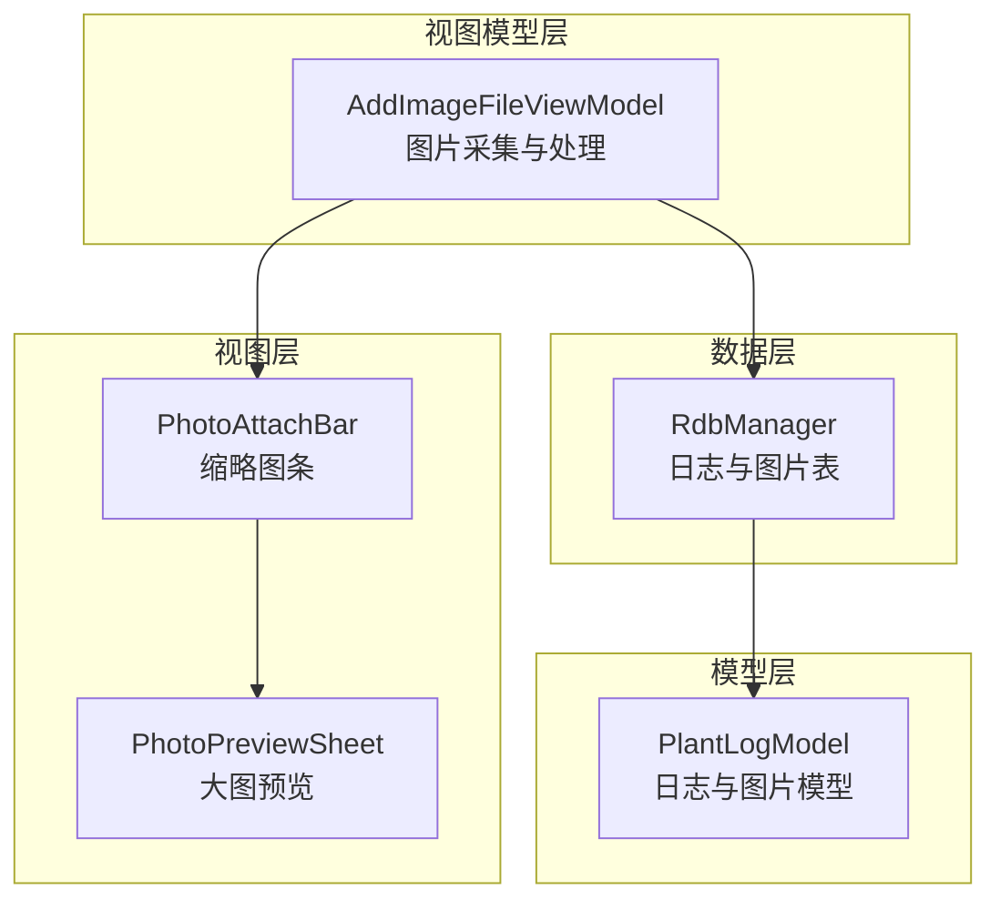
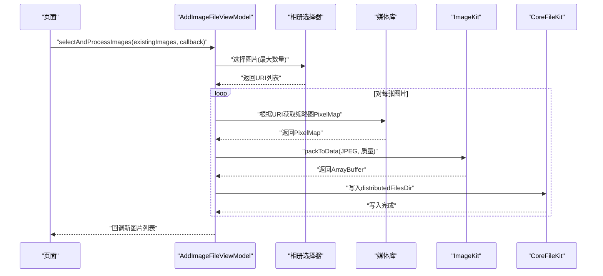
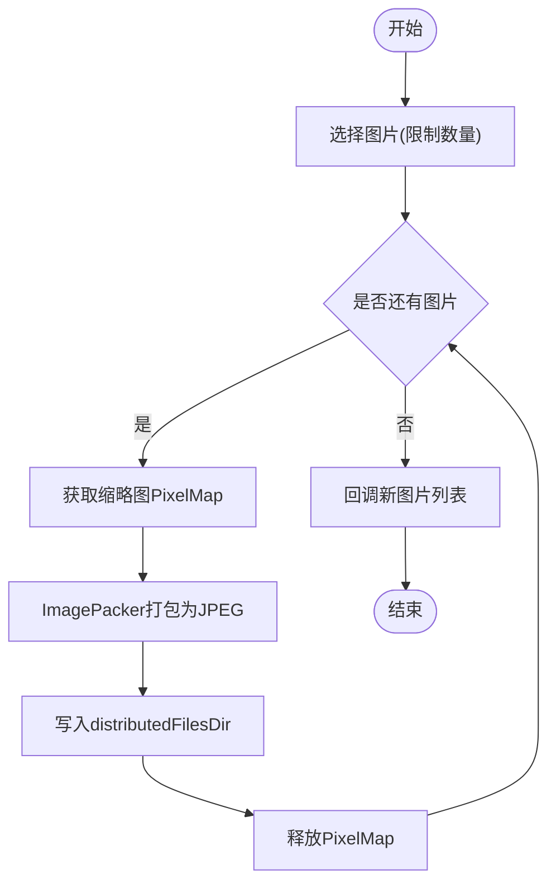
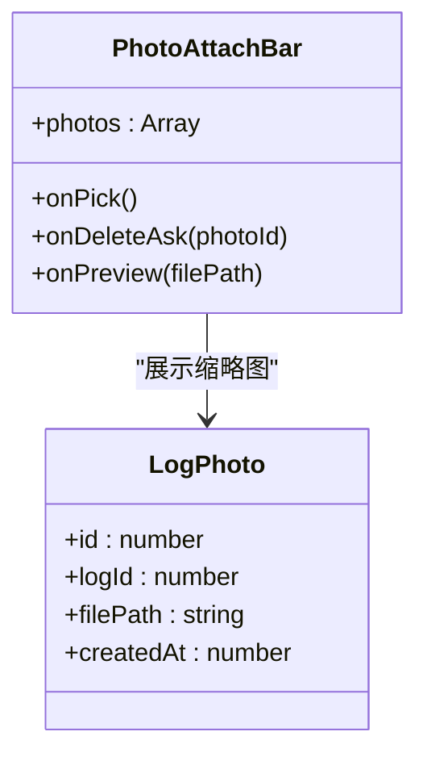
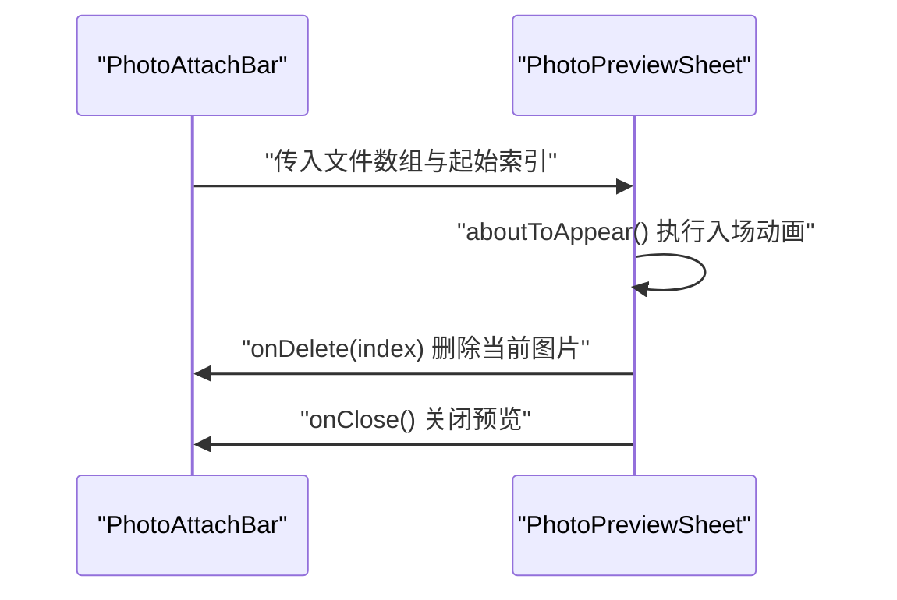
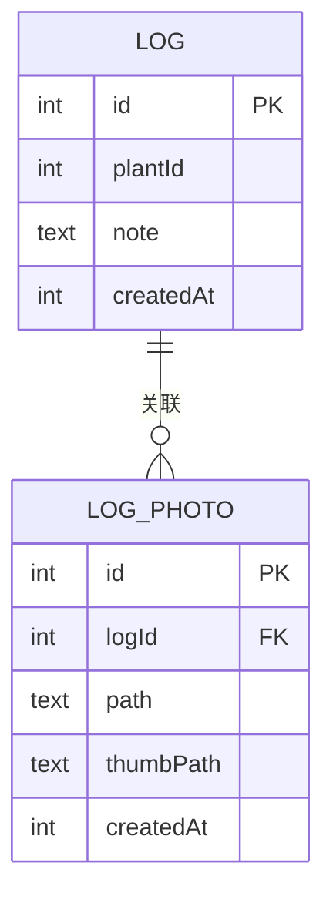
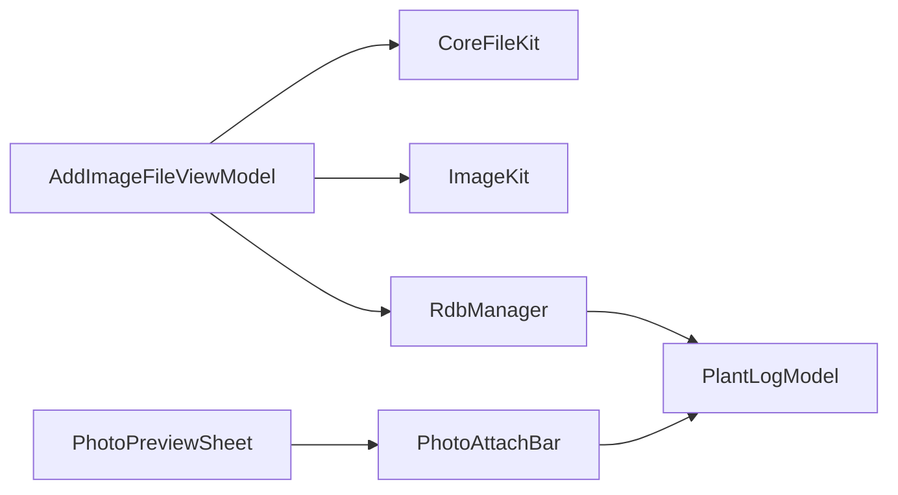

# 图片文件ViewModel

<cite>
**本文档引用的文件**
- [AddImageFileViewModel.ets](file://entry/src/main/ets/viewmodel/AddImageFileViewModel.ets)
- [PhotoPreviewSheet.ets](file://entry/src/main/ets/view/PhotoPreviewSheet.ets)
- [PhotoAttachBar.ets](file://entry/src/main/ets/view/PhotoAttachBar.ets)
- [RdbManager.ets](file://entry/src/main/ets/viewmodel/RdbManager.ets)
- [PlantLogModel.ets](file://entry/src/main/ets/model/PlantLogModel.ets)
- [PlantDetail.ets](file://entry/src/main/ets/pages/PlantDetail.ets)
</cite>

## 目录
1. [简介](#简介)
2. [项目结构](#项目结构)
3. [核心组件](#核心组件)
4. [架构总览](#架构总览)
5. [详细组件分析](#详细组件分析)
6. [依赖分析](#依赖分析)
7. [性能考虑](#性能考虑)
8. [故障排查指南](#故障排查指南)
9. [结论](#结论)
10. [附录](#附录)

## 简介
本文件围绕植物日记应用中的图片文件ViewModel展开，系统性阐述植物图片的采集、存储、处理与展示机制。重点包括：
- 图片上传与URI到路径的转换
- 缩略图生成与写入分布式目录
- 图片与植物日志的关联关系与数据一致性
- 存储空间管理与孤儿文件清理策略
- 图片浏览、预览与删除的实现细节
- 图片质量优化与格式转换的技术方案
- 完整的使用指南与最佳实践

## 项目结构
与图片管理相关的关键模块分布如下：
- 视图模型层：负责图片采集、处理与落盘
- 视图层：提供图片预览、缩略图条与删除交互
- 数据层：通过RDB管理日志与图片关联表
- 模型层：定义日志与图片实体结构

**图表来源**
- [AddImageFileViewModel.ets:14-146](file://entry/src/main/ets/viewmodel/AddImageFileViewModel.ets#L14-L146)
- [PhotoAttachBar.ets:17-100](file://entry/src/main/ets/view/PhotoAttachBar.ets#L17-L100)
- [PhotoPreviewSheet.ets:1-223](file://entry/src/main/ets/view/PhotoPreviewSheet.ets#L1-L223)
- [RdbManager.ets:1-296](file://entry/src/main/ets/viewmodel/RdbManager.ets#L1-L296)
- [PlantLogModel.ets:1-58](file://entry/src/main/ets/model/PlantLogModel.ets#L1-L58)

**章节来源**
- [AddImageFileViewModel.ets:14-146](file://entry/src/main/ets/viewmodel/AddImageFileViewModel.ets#L14-L146)
- [PhotoAttachBar.ets:17-100](file://entry/src/main/ets/view/PhotoAttachBar.ets#L17-L100)
- [PhotoPreviewSheet.ets:1-223](file://entry/src/main/ets/view/PhotoPreviewSheet.ets#L1-L223)
- [RdbManager.ets:1-296](file://entry/src/main/ets/viewmodel/RdbManager.ets#L1-L296)
- [PlantLogModel.ets:1-58](file://entry/src/main/ets/model/PlantLogModel.ets#L1-L58)

## 核心组件
- AddImageFileViewModel：封装图片采集、缩略图生成与分布式文件写入，提供统一的回调接口供页面复用。
- PhotoAttachBar：展示日志图片缩略图条，支持点击预览与删除操作。
- PhotoPreviewSheet：全屏图片预览组件，支持缩放、翻页与删除。
- RdbManager：维护日志与图片关联表，提供索引与清理能力。
- PlantLogModel：定义日志与图片实体字段，支撑数据持久化。

**章节来源**
- [AddImageFileViewModel.ets:14-146](file://entry/src/main/ets/viewmodel/AddImageFileViewModel.ets#L14-L146)
- [PhotoAttachBar.ets:17-100](file://entry/src/main/ets/view/PhotoAttachBar.ets#L17-L100)
- [PhotoPreviewSheet.ets:1-223](file://entry/src/main/ets/view/PhotoPreviewSheet.ets#L1-L223)
- [RdbManager.ets:1-296](file://entry/src/main/ets/viewmodel/RdbManager.ets#L1-L296)
- [PlantLogModel.ets:1-58](file://entry/src/main/ets/model/PlantLogModel.ets#L1-L58)

## 架构总览
图片从采集到展示的整体流程如下：

**图表来源**
- [AddImageFileViewModel.ets:34-144](file://entry/src/main/ets/viewmodel/AddImageFileViewModel.ets#L34-L144)

## 详细组件分析

### AddImageFileViewModel 组件分析
职责与流程
- 职责单一：仅负责图片采集、处理与落盘，不参与业务数据落库。
- 流程要点：
  - 选图：通过相册选择器限制最大选择数量。
  - 处理：获取缩略图PixelMap，打包为JPEG二进制。
  - 写入：写入应用分布式目录，便于后续分享或跨设备使用。
  - 错误处理：捕获异常并记录日志，保证流程健壮性。

关键实现点
- URI转换：将file:前缀统一为内部路径格式。
- 缩略图生成：从媒体库资产获取缩略图PixelMap。
- 图片打包：使用ImagePacker将PixelMap编码为JPEG。
- 分布式文件写入：写入distributedFilesDir，避免跨设备引用问题。
- 内存释放：及时释放PixelMap，防止内存溢出。

**图表来源**
- [AddImageFileViewModel.ets:34-144](file://entry/src/main/ets/viewmodel/AddImageFileViewModel.ets#L34-L144)

**章节来源**
- [AddImageFileViewModel.ets:14-146](file://entry/src/main/ets/viewmodel/AddImageFileViewModel.ets#L14-L146)

### PhotoAttachBar 组件分析
职责与交互
- 展示日志图片缩略图条，支持点击预览与删除。
- 事件回调：onPick（添加）、onDeleteAsk（删除确认）、onPreview（预览）。
- UI设计：缩略图采用Cover裁剪，圆角与间距控制，提升可读性。

**图表来源**
- [PhotoAttachBar.ets:17-100](file://entry/src/main/ets/view/PhotoAttachBar.ets#L17-L100)
- [PlantLogModel.ets:34-57](file://entry/src/main/ets/model/PlantLogModel.ets#L34-L57)

**章节来源**
- [PhotoAttachBar.ets:17-100](file://entry/src/main/ets/view/PhotoAttachBar.ets#L17-L100)
- [PlantLogModel.ets:34-57](file://entry/src/main/ets/model/PlantLogModel.ets#L34-L57)

### PhotoPreviewSheet 组件分析
职责与交互
- 全屏预览：支持左右翻页、点击缩放、顶部计数与删除入口。
- 动画效果：切换图片时的滑动与透明度过渡，提升体验。
- 事件回调：onDelete（删除当前图片）、onClose（关闭预览）。

**图表来源**
- [PhotoPreviewSheet.ets:1-223](file://entry/src/main/ets/view/PhotoPreviewSheet.ets#L1-L223)
- [PhotoAttachBar.ets:17-100](file://entry/src/main/ets/view/PhotoAttachBar.ets#L17-L100)

**章节来源**
- [PhotoPreviewSheet.ets:1-223](file://entry/src/main/ets/view/PhotoPreviewSheet.ets#L1-L223)

### RdbManager 组件分析
职责与数据结构
- 维护日志与图片关联表：log_photo，包含logId、path、thumbPath、createdAt等字段。
- 索引设计：为log_photo与log表建立查询索引，提升读写效率。
- 清理策略：提供孤儿照片清理，包括DB指向不存在日志的记录与磁盘文件缺失的残留记录。

**图表来源**
- [RdbManager.ets:79-87](file://entry/src/main/ets/viewmodel/RdbManager.ets#L79-L87)
- [RdbManager.ets:157-161](file://entry/src/main/ets/viewmodel/RdbManager.ets#L157-L161)

**章节来源**
- [RdbManager.ets:1-296](file://entry/src/main/ets/viewmodel/RdbManager.ets#L1-L296)

### PlantLogModel 组件分析
职责与字段
- PlantLog：日志实体，包含id、plantId、note、createdAt。
- LogPhoto：日志图片实体，包含id、logId、path、thumbPath、createdAt。
- 用于RDB持久化与前端展示的数据模型。

**章节来源**
- [PlantLogModel.ets:1-58](file://entry/src/main/ets/model/PlantLogModel.ets#L1-L58)

## 依赖分析
组件间的耦合关系
- AddImageFileViewModel 依赖媒体库与文件系统，输出分布式路径供其他组件使用。
- PhotoAttachBar 依赖 LogPhoto 模型，负责UI展示与事件回调。
- PhotoPreviewSheet 依赖 PhotoAttachBar 的事件流，提供全屏预览能力。
- RdbManager 提供日志与图片表的CRUD与清理能力，支撑数据一致性。
- PlantLogModel 作为数据模型，被RdbManager与视图层共同使用。

**图表来源**
- [AddImageFileViewModel.ets:1-8](file://entry/src/main/ets/viewmodel/AddImageFileViewModel.ets#L1-L8)
- [PhotoAttachBar.ets:1-15](file://entry/src/main/ets/view/PhotoAttachBar.ets#L1-L15)
- [PhotoPreviewSheet.ets:1-15](file://entry/src/main/ets/view/PhotoPreviewSheet.ets#L1-L15)
- [RdbManager.ets:1-3](file://entry/src/main/ets/viewmodel/RdbManager.ets#L1-L3)
- [PlantLogModel.ets:8-57](file://entry/src/main/ets/model/PlantLogModel.ets#L8-L57)

**章节来源**
- [AddImageFileViewModel.ets:1-8](file://entry/src/main/ets/viewmodel/AddImageFileViewModel.ets#L1-L8)
- [PhotoAttachBar.ets:1-15](file://entry/src/main/ets/view/PhotoAttachBar.ets#L1-L15)
- [PhotoPreviewSheet.ets:1-15](file://entry/src/main/ets/view/PhotoPreviewSheet.ets#L1-L15)
- [RdbManager.ets:1-3](file://entry/src/main/ets/viewmodel/RdbManager.ets#L1-L3)
- [PlantLogModel.ets:8-57](file://entry/src/main/ets/model/PlantLogModel.ets#L8-L57)

## 性能考虑
- 缩略图优先：采集阶段仅处理缩略图，减少内存占用与IO压力。
- 及时释放：PixelMap使用后立即释放，避免内存泄漏。
- 分布式目录：写入distributedFilesDir便于跨设备共享与引用。
- 索引优化：为log_photo与log表建立复合索引，提升查询效率。
- 批量删除：事务内删除日志与图片，成功后再删除文件，确保一致性。

[本节为通用性能建议，无需特定文件引用]

## 故障排查指南
常见问题与处理
- 选图失败：检查相册权限与选择器参数，确保返回URI非空。
- 缩略图为空：确认媒体库资产存在且可访问，捕获错误并记录日志。
- 写入失败：检查distributedFilesDir权限与磁盘空间，捕获BusinessError并记录错误码与消息。
- 预览异常：确认传入文件路径有效，注意路径前缀与文件存在性。
- 删除不生效：确认RDB删除成功后再删除文件，避免数据不一致。

**章节来源**
- [AddImageFileViewModel.ets:58-74](file://entry/src/main/ets/viewmodel/AddImageFileViewModel.ets#L58-L74)
- [AddImageFileViewModel.ets:116-144](file://entry/src/main/ets/viewmodel/AddImageFileViewModel.ets#L116-L144)
- [PhotoPreviewSheet.ets:17-34](file://entry/src/main/ets/view/PhotoPreviewSheet.ets#L17-L34)

## 结论
本方案通过轻量的图片采集与缩略图处理，结合RDB的强一致关联与分布式文件写入，实现了植物图片的高效管理。配合缩略图条与全屏预览组件，提供了良好的用户体验。通过索引与清理策略保障了长期使用的稳定性与性能。

[本节为总结性内容，无需特定文件引用]

## 附录

### 图片上传、压缩与缩略图生成流程
- 上传：通过相册选择器返回URI列表。
- 处理：获取缩略图PixelMap，使用ImagePacker编码为JPEG。
- 写入：将二进制数据写入distributedFilesDir，返回文件路径供后续使用。

**章节来源**
- [AddImageFileViewModel.ets:34-144](file://entry/src/main/ets/viewmodel/AddImageFileViewModel.ets#L34-L144)

### 图片与植物记录的关联关系与数据同步
- 关联表：log_photo记录logId、path、thumbPath、createdAt。
- 查询：按logId查询图片集合，按createdAt倒序展示。
- 同步：删除日志时，先删除log_photo记录，再删除文件，最后刷新界面。

**章节来源**
- [RdbManager.ets:79-87](file://entry/src/main/ets/viewmodel/RdbManager.ets#L79-L87)
- [RdbManager.ets:157-161](file://entry/src/main/ets/viewmodel/RdbManager.ets#L157-L161)

### 图片存储空间管理与清理策略
- 孤儿清理：清理DB中指向不存在日志的记录与磁盘文件缺失的残留记录。
- 批量删除：事务内删除日志与图片，成功后再删除文件，失败回滚。

**章节来源**
- [RdbManager.ets:440-481](file://entry/src/main/ets/viewmodel/RdbManager.ets#L440-L481)

### 图片浏览、预览与删除实现细节
- 浏览：PhotoAttachBar展示缩略图，支持点击预览。
- 预览：PhotoPreviewSheet提供全屏预览、缩放与翻页。
- 删除：onDeleteAsk触发删除确认，删除成功后刷新列表。

**章节来源**
- [PhotoAttachBar.ets:17-100](file://entry/src/main/ets/view/PhotoAttachBar.ets#L17-L100)
- [PhotoPreviewSheet.ets:1-223](file://entry/src/main/ets/view/PhotoPreviewSheet.ets#L1-L223)

### 图片质量优化与格式转换技术方案
- 格式：统一转换为JPEG，兼顾体积与兼容性。
- 质量：初始质量设置为较高值，确保预览清晰。
- 压缩：如需进一步压缩，可在ImagePacker基础上调整质量参数或尺寸。

**章节来源**
- [AddImageFileViewModel.ets:116-127](file://entry/src/main/ets/viewmodel/AddImageFileViewModel.ets#L116-L127)

### 使用指南
- 添加图片：在日志编辑页点击“添加”，选择图片后自动生成缩略图并写入分布式目录。
- 查看图片：在日志详情页查看缩略图条，点击进入全屏预览。
- 删除图片：在预览页点击“删除”，确认后删除对应记录与文件，并刷新界面。
- 清理空间：定期执行孤儿清理，移除无效记录与残留文件。

**章节来源**
- [PhotoAttachBar.ets:17-100](file://entry/src/main/ets/view/PhotoAttachBar.ets#L17-L100)
- [PhotoPreviewSheet.ets:1-223](file://entry/src/main/ets/view/PhotoPreviewSheet.ets#L1-L223)
- [RdbManager.ets:440-481](file://entry/src/main/ets/viewmodel/RdbManager.ets#L440-L481)