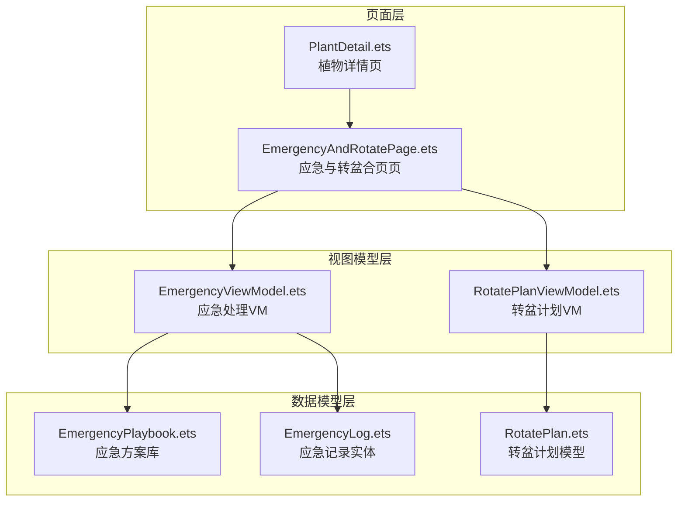
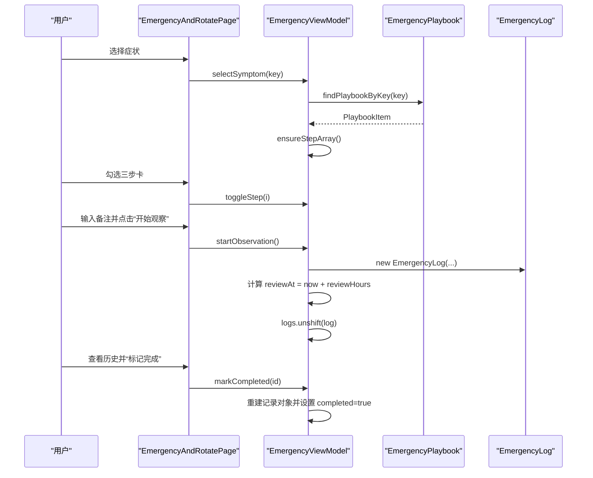
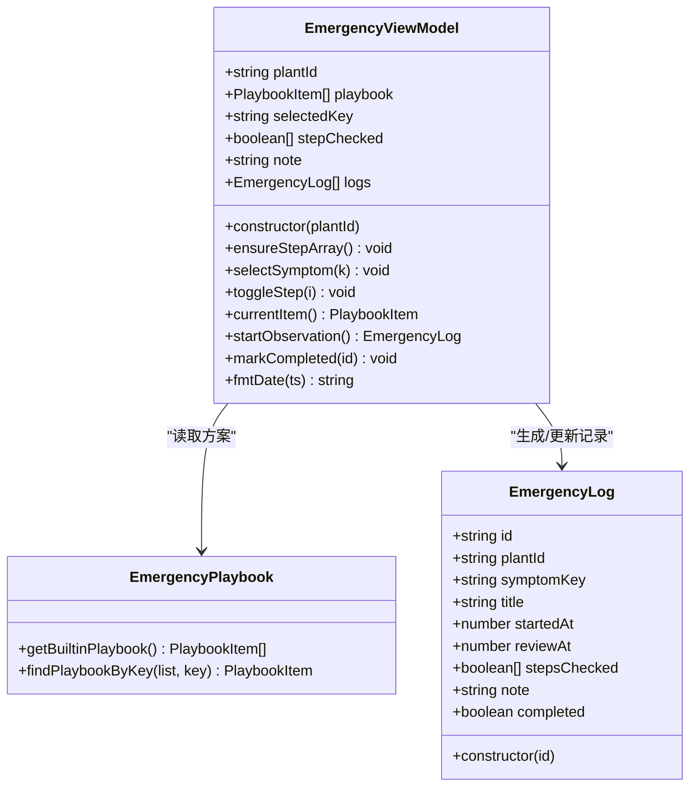
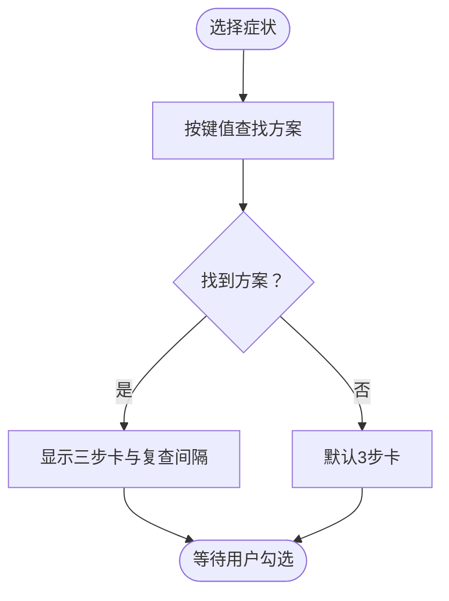
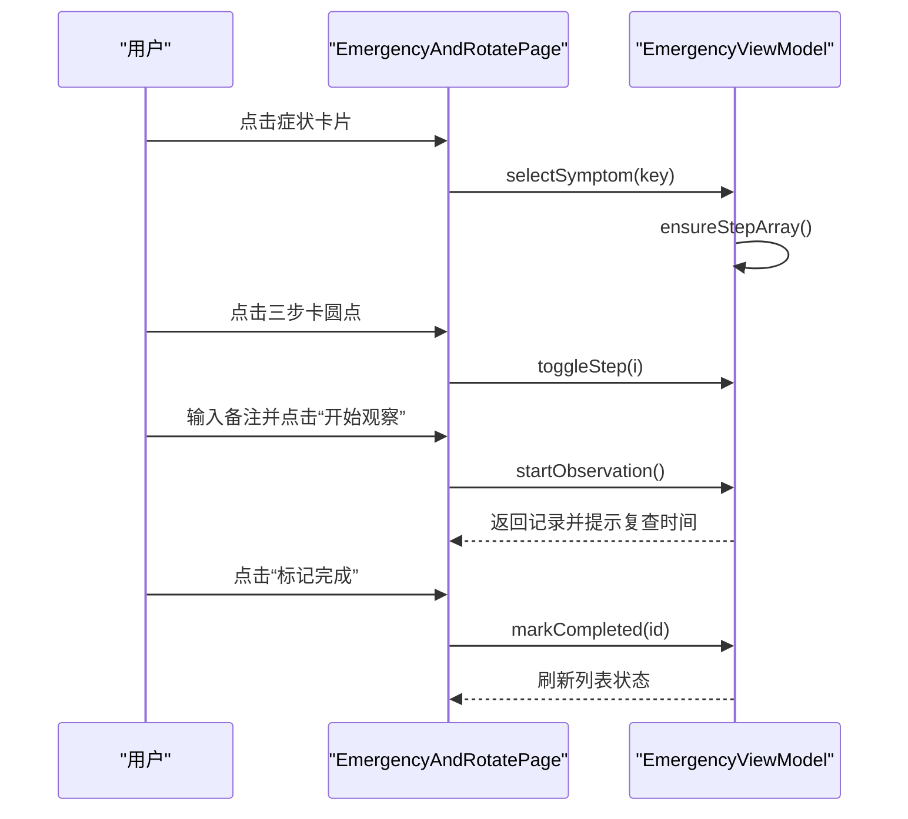
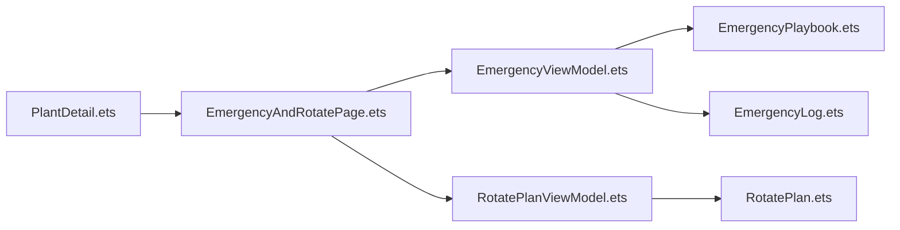

# 应急处理ViewModel

<cite>
**本文档引用的文件**
- [EmergencyViewModel.ets](file://entry/src/main/ets/viewmodel/EmergencyViewModel.ets)
- [EmergencyPlaybook.ets](file://entry/src/main/ets/model/EmergencyPlaybook.ets)
- [EmergencyLog.ets](file://entry/src/main/ets/model/EmergencyLog.ets)
- [EmergencyAndRotatePage.ets](file://entry/src/main/ets/pages/EmergencyAndRotatePage.ets)
- [RotatePlanViewModel.ets](file://entry/src/main/ets/viewmodel/RotatePlanViewModel.ets)
- [RotatePlan.ets](file://entry/src/main/ets/model/RotatePlan.ets)
- [PlantDetail.ets](file://entry/src/main/ets/pages/PlantDetail.ets)
- [Index.ets](file://entry/src/main/ets/pages/Index.ets)
</cite>

## 目录
1. [简介](#简介)
2. [项目结构](#项目结构)
3. [核心组件](#核心组件)
4. [架构总览](#架构总览)
5. [详细组件分析](#详细组件分析)
6. [依赖关系分析](#依赖关系分析)
7. [性能考量](#性能考量)
8. [故障排除指南](#故障排除指南)
9. [结论](#结论)
10. [附录](#附录)

## 简介
本文件面向“应急处理ViewModel”的完整技术文档，聚焦植物在紧急状况下的处理流程与应对策略，涵盖：
- 病虫害识别与治疗方案推荐机制
- 枯萎、黄叶等异常症状的诊断与处理方法
- 应急处理的优先级判断与资源调配逻辑
- 应急处理记录的跟踪与效果评估
- 植物急救知识库与专家建议的集成
- 提供用户操作指南与可视化流程说明

该能力以“症状选择 → 三步卡打勾 → 开始观察（生成记录）→ 历史列表”的闭环流程为核心，结合内置的“应急处理方案库”，为用户提供可执行、可追踪的植物急救指导。

## 项目结构
应急处理能力由页面、视图模型与数据模型三层构成，页面负责交互与展示，视图模型负责状态与业务逻辑，数据模型负责数据结构与持久化准备。

图表来源
- [EmergencyAndRotatePage.ets:10-557](file://entry/src/main/ets/pages/EmergencyAndRotatePage.ets#L10-L557)
- [EmergencyViewModel.ets:14-115](file://entry/src/main/ets/viewmodel/EmergencyViewModel.ets#L14-L115)
- [EmergencyPlaybook.ets:25-81](file://entry/src/main/ets/model/EmergencyPlaybook.ets#L25-L81)
- [EmergencyLog.ets:4-20](file://entry/src/main/ets/model/EmergencyLog.ets#L4-L20)
- [RotatePlanViewModel.ets:18-88](file://entry/src/main/ets/viewmodel/RotatePlanViewModel.ets#L18-L88)
- [RotatePlan.ets:4-25](file://entry/src/main/ets/model/RotatePlan.ets#L4-L25)
- [PlantDetail.ets:104-107](file://entry/src/main/ets/pages/PlantDetail.ets#L104-L107)

章节来源
- [EmergencyAndRotatePage.ets:10-557](file://entry/src/main/ets/pages/EmergencyAndRotatePage.ets#L10-L557)
- [EmergencyViewModel.ets:14-115](file://entry/src/main/ets/viewmodel/EmergencyViewModel.ets#L14-L115)
- [EmergencyPlaybook.ets:25-81](file://entry/src/main/ets/model/EmergencyPlaybook.ets#L25-L81)
- [EmergencyLog.ets:4-20](file://entry/src/main/ets/model/EmergencyLog.ets#L4-L20)
- [RotatePlanViewModel.ets:18-88](file://entry/src/main/ets/viewmodel/RotatePlanViewModel.ets#L18-L88)
- [RotatePlan.ets:4-25](file://entry/src/main/ets/model/RotatePlan.ets#L4-L25)
- [PlantDetail.ets:104-107](file://entry/src/main/ets/pages/PlantDetail.ets#L104-L107)

## 核心组件
- 应急处理视图模型（EmergencyViewModel）
  - 负责症状选择、三步卡勾选、生成观察记录、完成标记、时间格式化等
  - 内置应急方案库读取与当前症状项获取
- 应急方案库（EmergencyPlaybook）
  - 定义症状键值、标题、三步卡、复查间隔与补充提示
  - 提供内置方案列表与按键值查找
- 应急记录实体（EmergencyLog）
  - 记录开始时间、复查时间、症状键值、标题、步骤勾选状态、备注、完成状态
- 应急与转盆页面（EmergencyAndRotatePage）
  - 展示症状选择、三步卡、备注与开始观察按钮、历史记录列表
  - 提供“清空勾选”“标记完成”等交互
- 转盆计划视图模型（RotatePlanViewModel）
  - 提供转盆计划开关、周期设置、下次到期判断、历史记录展示
- 转盆计划模型（RotatePlan）
  - 计算下次到期时间、记录最近转盆时间

章节来源
- [EmergencyViewModel.ets:14-115](file://entry/src/main/ets/viewmodel/EmergencyViewModel.ets#L14-L115)
- [EmergencyPlaybook.ets:25-81](file://entry/src/main/ets/model/EmergencyPlaybook.ets#L25-L81)
- [EmergencyLog.ets:4-20](file://entry/src/main/ets/model/EmergencyLog.ets#L4-L20)
- [EmergencyAndRotatePage.ets:100-358](file://entry/src/main/ets/pages/EmergencyAndRotatePage.ets#L100-L358)
- [RotatePlanViewModel.ets:18-88](file://entry/src/main/ets/viewmodel/RotatePlanViewModel.ets#L18-L88)
- [RotatePlan.ets:4-25](file://entry/src/main/ets/model/RotatePlan.ets#L4-L25)

## 架构总览
应急处理流程采用“页面-视图模型-数据模型”的分层设计，页面负责UI与事件绑定，视图模型负责状态与业务规则，数据模型负责数据结构与持久化准备。页面与视图模型之间通过双向绑定与事件回调连接，视图模型内部通过方案库与记录实体完成业务闭环。

图表来源
- [EmergencyAndRotatePage.ets:100-358](file://entry/src/main/ets/pages/EmergencyAndRotatePage.ets#L100-L358)
- [EmergencyViewModel.ets:40-98](file://entry/src/main/ets/viewmodel/EmergencyViewModel.ets#L40-L98)
- [EmergencyPlaybook.ets:75-81](file://entry/src/main/ets/model/EmergencyPlaybook.ets#L75-L81)
- [EmergencyLog.ets:15-18](file://entry/src/main/ets/model/EmergencyLog.ets#L15-L18)

## 详细组件分析

### 应急处理视图模型（EmergencyViewModel）
职责与特性
- 症状选择：根据症状键值动态重建三步卡勾选数组，确保UI与数据一致
- 三步卡勾选：支持逐项切换，维护布尔数组
- 记录生成：生成应急记录，填充植物ID、症状键值、标题、步骤勾选状态、备注、复查时间
- 完成标记：对指定记录进行“完成”标记，采用对象重建方式保证UI响应
- 时间格式化：提供统一的时间格式化工具

关键方法与属性
- plantId：当前植物标识
- playbook：内置应急方案列表
- selectedKey：当前选中的症状键值
- stepChecked：当前症状对应的三步卡勾选状态
- note：用户备注
- logs：应急记录列表（内存）

图表来源
- [EmergencyViewModel.ets:14-115](file://entry/src/main/ets/viewmodel/EmergencyViewModel.ets#L14-L115)
- [EmergencyPlaybook.ets:25-81](file://entry/src/main/ets/model/EmergencyPlaybook.ets#L25-L81)
- [EmergencyLog.ets:4-20](file://entry/src/main/ets/model/EmergencyLog.ets#L4-L20)

章节来源
- [EmergencyViewModel.ets:14-115](file://entry/src/main/ets/viewmodel/EmergencyViewModel.ets#L14-L115)

### 应急方案库（EmergencyPlaybook）
内置方案与字段
- PlayStep：三步卡条目文本
- PlaybookItem：包含键值、标题、三步卡数组、复查间隔（小时）、补充提示
- 内置方案：日灼、萎蔫、黄化、黑斑/斑点、疑似烂根
- 工具函数：获取内置方案列表、按键值查找方案

图表来源
- [EmergencyPlaybook.ets:25-81](file://entry/src/main/ets/model/EmergencyPlaybook.ets#L25-L81)

章节来源
- [EmergencyPlaybook.ets:25-81](file://entry/src/main/ets/model/EmergencyPlaybook.ets#L25-L81)

### 应急记录实体（EmergencyLog）
记录字段
- id：唯一标识
- plantId：所属植物
- symptomKey：症状键值
- title：症状标题
- startedAt：开始时间
- reviewAt：复查时间
- stepsChecked：三步卡勾选状态
- note：备注
- completed：是否完成

章节来源
- [EmergencyLog.ets:4-20](file://entry/src/main/ets/model/EmergencyLog.ets#L4-L20)

### 应急与转盆页面（EmergencyAndRotatePage）
页面结构与交互
- 急救面板：症状选择、三步卡、备注与开始观察、历史记录
- 转盆面板：启用/禁用计划、周期设置、下次到期、历史记录
- 交互逻辑：症状切换、三步卡勾选、备注输入、开始观察、清空勾选、标记完成、转盆打卡

图表来源
- [EmergencyAndRotatePage.ets:100-358](file://entry/src/main/ets/pages/EmergencyAndRotatePage.ets#L100-L358)
- [EmergencyViewModel.ets:40-98](file://entry/src/main/ets/viewmodel/EmergencyViewModel.ets#L40-L98)

章节来源
- [EmergencyAndRotatePage.ets:100-358](file://entry/src/main/ets/pages/EmergencyAndRotatePage.ets#L100-L358)

### 转盆计划视图模型（RotatePlanViewModel）
职责与特性
- 计划开关与周期设置：启用/禁用、周期范围限制
- 下次到期判断：基于最近转盆时间与周期计算
- 历史记录：打卡记录追加到列表头部
- 时间格式化：统一时间显示格式

章节来源
- [RotatePlanViewModel.ets:18-88](file://entry/src/main/ets/viewmodel/RotatePlanViewModel.ets#L18-L88)

### 转盆计划模型（RotatePlan）
职责与特性
- 计算下次到期时间：以最近转盆时间为基准加上周期
- 记录最近转盆时间：用于下次到期计算

章节来源
- [RotatePlan.ets:4-25](file://entry/src/main/ets/model/RotatePlan.ets#L4-L25)

## 依赖关系分析
- EmergencyAndRotatePage 依赖 EmergencyViewModel 与 RotatePlanViewModel
- EmergencyViewModel 依赖 EmergencyPlaybook 与 EmergencyLog
- RotatePlanViewModel 依赖 RotatePlan
- PlantDetail 通过导航打开 EmergencyAndRotatePage

图表来源
- [EmergencyAndRotatePage.ets:10-557](file://entry/src/main/ets/pages/EmergencyAndRotatePage.ets#L10-L557)
- [EmergencyViewModel.ets:14-115](file://entry/src/main/ets/viewmodel/EmergencyViewModel.ets#L14-L115)
- [EmergencyPlaybook.ets:25-81](file://entry/src/main/ets/model/EmergencyPlaybook.ets#L25-L81)
- [EmergencyLog.ets:4-20](file://entry/src/main/ets/model/EmergencyLog.ets#L4-L20)
- [RotatePlanViewModel.ets:18-88](file://entry/src/main/ets/viewmodel/RotatePlanViewModel.ets#L18-L88)
- [RotatePlan.ets:4-25](file://entry/src/main/ets/model/RotatePlan.ets#L4-L25)
- [PlantDetail.ets:104-107](file://entry/src/main/ets/pages/PlantDetail.ets#L104-L107)

章节来源
- [EmergencyAndRotatePage.ets:10-557](file://entry/src/main/ets/pages/EmergencyAndRotatePage.ets#L10-L557)
- [EmergencyViewModel.ets:14-115](file://entry/src/main/ets/viewmodel/EmergencyViewModel.ets#L14-L115)
- [EmergencyPlaybook.ets:25-81](file://entry/src/main/ets/model/EmergencyPlaybook.ets#L25-L81)
- [EmergencyLog.ets:4-20](file://entry/src/main/ets/model/EmergencyLog.ets#L4-L20)
- [RotatePlanViewModel.ets:18-88](file://entry/src/main/ets/viewmodel/RotatePlanViewModel.ets#L18-L88)
- [RotatePlan.ets:4-25](file://entry/src/main/ets/model/RotatePlan.ets#L4-L25)
- [PlantDetail.ets:104-107](file://entry/src/main/ets/pages/PlantDetail.ets#L104-L107)

## 性能考量
- 列表更新策略：通过“重建对象+替换数组”的方式更新列表项，确保UI正确响应，避免原地修改导致的渲染问题
- 时间计算：复查时间基于毫秒时间戳计算，避免频繁格式化带来的额外开销
- UI交互：症状切换与三步卡勾选均为轻量操作，适合移动端高频交互场景
- 数据持久化：当前记录存储在内存中，便于快速迭代；后续可替换为RDB或JSON载入，提升稳定性与跨设备一致性

## 故障排除指南
常见问题与处理
- 症状切换后三步卡数量不匹配
  - 检查 ensureStepArray 是否被调用，确保根据当前症状重建勾选数组
- “开始观察”后历史列表未更新
  - 确认 startObservation 是否返回记录并成功插入到 logs 列表头部
- “标记完成”无效
  - 检查 markCompleted 是否正确重建记录对象并更新 completed 状态
- 复查时间显示异常
  - 使用 fmtDate 统一格式化时间，确保时区与格式一致

章节来源
- [EmergencyViewModel.ets:32-38](file://entry/src/main/ets/viewmodel/EmergencyViewModel.ets#L32-L38)
- [EmergencyViewModel.ets:60-75](file://entry/src/main/ets/viewmodel/EmergencyViewModel.ets#L60-L75)
- [EmergencyViewModel.ets:78-98](file://entry/src/main/ets/viewmodel/EmergencyViewModel.ets#L78-L98)
- [EmergencyViewModel.ets:101-113](file://entry/src/main/ets/viewmodel/EmergencyViewModel.ets#L101-L113)

## 结论
应急处理ViewModel以简洁清晰的流程设计，将植物紧急状况的诊断与处理标准化为“症状选择 → 三步卡执行 → 观察与复查 → 历史追踪”的闭环。通过内置的应急方案库与可扩展的数据模型，系统既满足即用性，又为后续集成专家建议、数据库持久化与智能诊断留出空间。页面层与视图模型层的清晰分工，使得功能易于维护与扩展。

## 附录

### 症状与处理方案速览
- 日灼：移至散射光、剪除灼伤叶、减少浇水
- 萎蔫：检查介质湿度、移至阴凉、确认无根损后恢复
- 黄化：增加光照、薄肥勤施、排查长期过湿
- 黑斑/斑点：剪除病叶、加强通风、必要时使用杀菌剂
- 烂根：停水、通风阴凉、剪除腐烂根、换新介质

章节来源
- [EmergencyPlaybook.ets:25-73](file://entry/src/main/ets/model/EmergencyPlaybook.ets#L25-L73)

### 用户操作指南
- 选择症状：点击对应症状卡片，自动加载三步卡
- 执行步骤：逐项勾选三步卡，完成后进入观察阶段
- 备注记录：在备注框中记录环境、药剂等信息
- 开始观察：点击“开始观察”，系统自动生成复查时间
- 清空勾选：重新开始流程前可一键清空勾选状态
- 标记完成：观察期结束后点击“标记完成”，更新记录状态
- 查看历史：在历史列表中查看所有应急记录与状态

章节来源
- [EmergencyAndRotatePage.ets:100-358](file://entry/src/main/ets/pages/EmergencyAndRotatePage.ets#L100-L358)