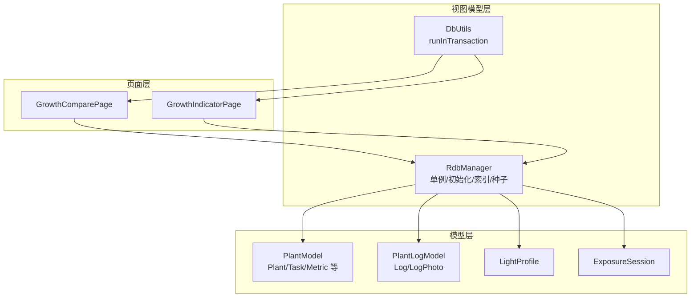
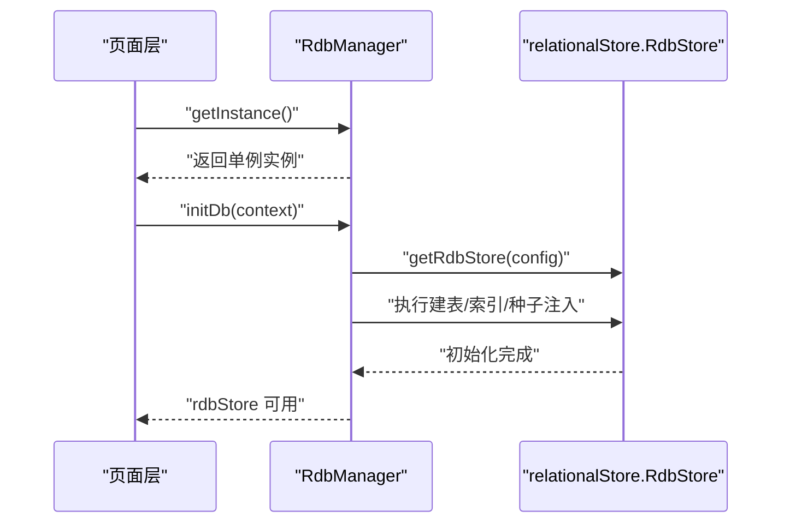
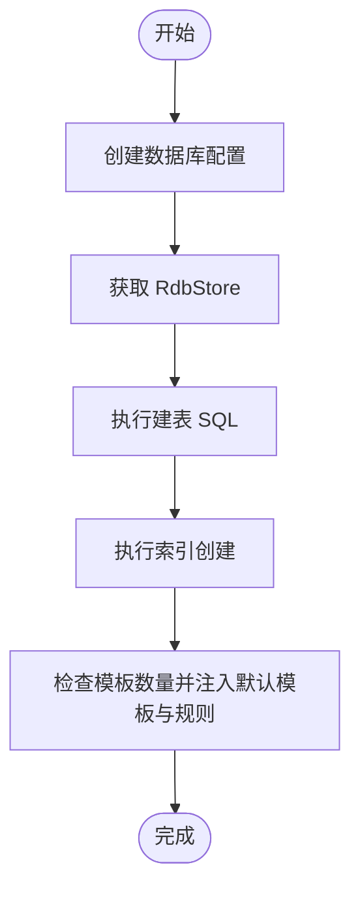
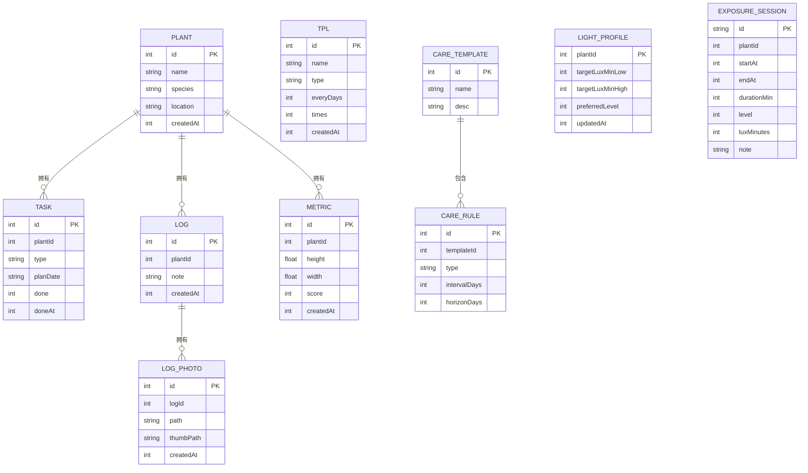
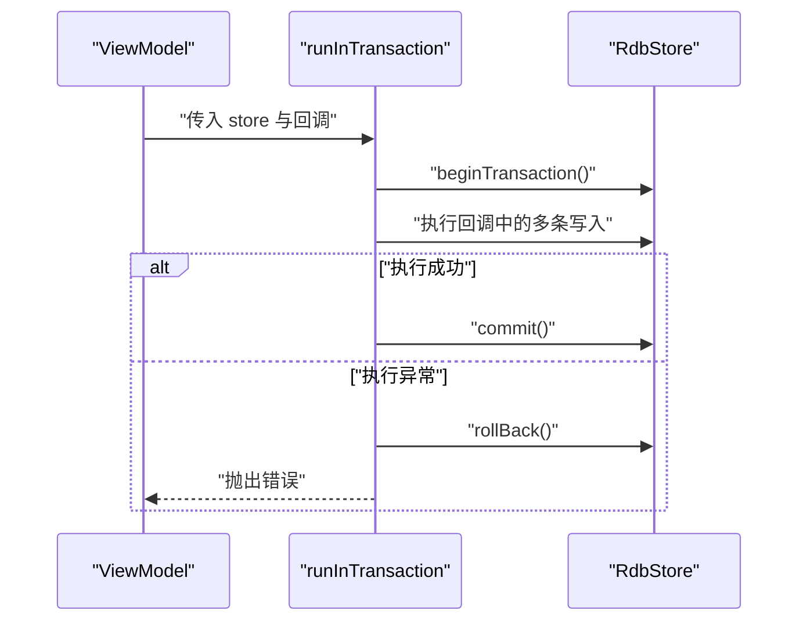
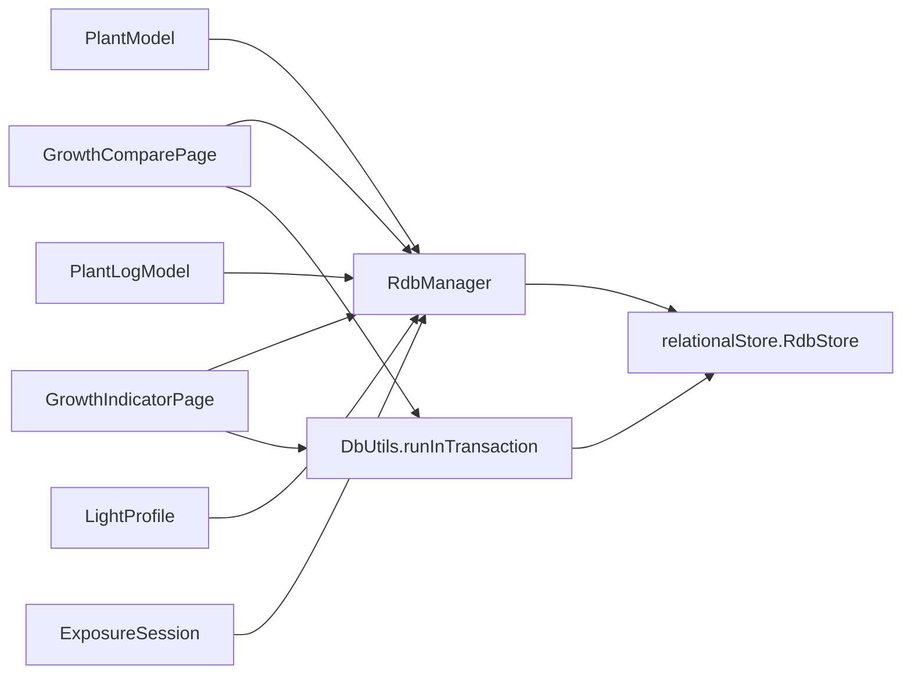

# 数据库管理器

<cite>
**本文引用的文件**
- [RdbManager.ets](file://entry/src/main/ets/viewmodel/RdbManager.ets)
- [DbUtils.ets](file://entry/src/main/ets/model/DbUtils.ets)
- [PlantModel.ets](file://entry/src/main/ets/model/PlantModel.ets)
- [PlantLogModel.ets](file://entry/src/main/ets/model/PlantLogModel.ets)
- [LightProfile.ets](file://entry/src/main/ets/model/LightProfile.ets)
- [ExposureSession.ets](file://entry/src/main/ets/model/ExposureSession.ets)
- [GrowthComparePage.ets](file://entry/src/main/ets/pages/GrowthComparePage.ets)
- [GrowthIndicatorPage.ets](file://entry/src/main/ets/pages/GrowthIndicatorPage.ets)
- [err.ets](file://entry/src/main/ets/viewmodel/err.ets)
</cite>

## 目录
1. [简介](#简介)
2. [项目结构](#项目结构)
3. [核心组件](#核心组件)
4. [架构总览](#架构总览)
5. [详细组件分析](#详细组件分析)
6. [依赖关系分析](#依赖关系分析)
7. [性能考量](#性能考量)
8. [故障排查指南](#故障排查指南)
9. [结论](#结论)
10. [附录](#附录)

## 简介
本文件系统性地解析 PlantDiary 应用中的数据库管理器实现，重点围绕 RdbManager 单例模式、数据库初始化流程、表结构设计与索引策略、事务处理与错误处理、以及最佳实践与性能优化建议展开。同时给出与页面层交互的使用示例与集成指南，帮助开发者在不深入源码细节的情况下也能正确使用数据库模块。

## 项目结构
数据库相关代码主要集中在以下位置：
- 视图模型层：RdbManager 提供数据库单例与初始化、表结构与索引创建、默认数据种子注入、常用查询封装等能力
- 工具层：DbUtils 封装统一事务执行，保证批量写入的原子性
- 模型层：PlantModel、PlantLogModel、LightProfile、ExposureSession 定义了与数据库表字段一致的数据模型，便于跨页面共享
- 页面层：GrowthComparePage、GrowthIndicatorPage 等页面通过 RdbManager 的 store 执行查询与写入
- 示例与注释：err.ets 中保留了大量事务与批量操作的注释示例，便于理解正确用法

**图表来源**
- [RdbManager.ets](file://entry/src/main/ets/viewmodel/RdbManager.ets)
- [DbUtils.ets](file://entry/src/main/ets/model/DbUtils.ets)
- [PlantModel.ets](file://entry/src/main/ets/model/PlantModel.ets)
- [PlantLogModel.ets](file://entry/src/main/ets/model/PlantLogModel.ets)
- [LightProfile.ets](file://entry/src/main/ets/model/LightProfile.ets)
- [ExposureSession.ets](file://entry/src/main/ets/model/ExposureSession.ets)
- [GrowthComparePage.ets](file://entry/src/main/ets/pages/GrowthComparePage.ets)
- [GrowthIndicatorPage.ets](file://entry/src/main/ets/pages/GrowthIndicatorPage.ets)

**章节来源**
- [RdbManager.ets](file://entry/src/main/ets/viewmodel/RdbManager.ets)
- [DbUtils.ets](file://entry/src/main/ets/model/DbUtils.ets)
- [PlantModel.ets](file://entry/src/main/ets/model/PlantModel.ets)
- [PlantLogModel.ets](file://entry/src/main/ets/model/PlantLogModel.ets)
- [LightProfile.ets](file://entry/src/main/ets/model/LightProfile.ets)
- [ExposureSession.ets](file://entry/src/main/ets/model/ExposureSession.ets)
- [GrowthComparePage.ets](file://entry/src/main/ets/pages/GrowthComparePage.ets)
- [GrowthIndicatorPage.ets](file://entry/src/main/ets/pages/GrowthIndicatorPage.ets)

## 核心组件
- RdbManager：ArkTS 关系型数据库的单例入口，负责数据库初始化、表结构与索引创建、默认数据种子注入、常用查询封装
- DbUtils：统一事务封装，确保批量写入要么全部成功、要么全部回滚
- 模型层：Plant、PlantTask、Metric、LogEntry、LogPhoto、LightProfile、ExposureSession 等，与数据库表字段一一对应

**章节来源**
- [RdbManager.ets](file://entry/src/main/ets/viewmodel/RdbManager.ets)
- [DbUtils.ets](file://entry/src/main/ets/model/DbUtils.ets)
- [PlantModel.ets](file://entry/src/main/ets/model/PlantModel.ets)
- [PlantLogModel.ets](file://entry/src/main/ets/model/PlantLogModel.ets)
- [LightProfile.ets](file://entry/src/main/ets/model/LightProfile.ets)
- [ExposureSession.ets](file://entry/src/main/ets/model/ExposureSession.ets)

## 架构总览
RdbManager 以单例模式对外提供数据库访问能力，页面层仅通过 RdbManager 获取 store 并执行 SQL 或使用工具层的事务封装，避免直接操作底层存储，降低耦合与出错概率。

**图表来源**
- [RdbManager.ets](file://entry/src/main/ets/viewmodel/RdbManager.ets)

## 详细组件分析

### RdbManager 单例与线程安全
- 单例实现：通过静态属性保存实例，getInstance 方法在首次调用时创建并缓存实例，后续调用直接返回同一实例，确保全局唯一
- 线程安全：在 ArkTS 运行时环境下，单例初始化发生在应用生命周期早期且为同步创建，配合页面层统一通过 getInstance 获取，天然避免并发竞态
- 线程安全要点：避免在多线程/多进程场景下重复创建实例；页面层应始终通过单例访问 store，不要自行持有多个 store 实例

**章节来源**
- [RdbManager.ets](file://entry/src/main/ets/viewmodel/RdbManager.ets)

### 数据库初始化流程
- 初始化步骤
  - 创建数据库配置并获取 RdbStore
  - 依次执行建表语句：plant、task、tpl、log、metric、log_photo、care_template、care_rule、light_profile、exposure_session
  - 建立常用查询索引：task 的唯一索引与 planDate、plantId 索引；log 的组合索引；log_photo 的 logId 索引；metric 的组合索引
  - 注入默认养护模板与规则：ensureCareTemplates 在空库时一次性插入多条模板与规则，避免覆盖用户后续修改
- 设计原则
  - 表结构与字段与模型层保持一致，便于跨层共享
  - 唯一索引约束重复任务，支持“尝试插入、冲突即跳过”的批量生成策略
  - 组合索引优先，减少冗余索引，提升查询效率

**图表来源**
- [RdbManager.ets](file://entry/src/main/ets/viewmodel/RdbManager.ets)

**章节来源**
- [RdbManager.ets](file://entry/src/main/ets/viewmodel/RdbManager.ets)

### 数据表设计与字段说明
- plant（植物）
  - 字段：id、name、species、location、createdAt
  - 用途：记录植物基本信息
- task（任务）
  - 字段：id、plantId、type、planDate、done、doneAt
  - 用途：记录植物的养护计划与完成状态
- tpl（周期模板）
  - 字段：id、name、type、everyDays、times、createdAt
  - 用途：周期性任务模板
- log（日志）
  - 字段：id、plantId、note、createdAt
  - 用途：记录植物的观察与养护日志
- metric（成长指标）
  - 字段：id、plantId、height、width、score、createdAt
  - 用途：记录植物身高、冠幅、健康评分等指标
- log_photo（日志照片）
  - 字段：id、logId、path、thumbPath、createdAt
  - 用途：记录日志对应的图片与缩略图
- care_template（养护模板）
  - 字段：id、name、desc
  - 用途：养护模板主表
- care_rule（养护规则）
  - 字段：id、templateId、type、intervalDays、horizonDays
  - 用途：描述模板下的任务类型、间隔天数与生成范围
- light_profile（光照配置）
  - 字段：plantId（PK）、targetLuxMinLow、targetLuxMinHigh、preferredLevel、updatedAt
  - 用途：每株植物的光照目标与偏好
- exposure_session（光照会话）
  - 字段：id（PK）、plantId、startAt、endAt、durationMin、level、luxMinutes、note
  - 用途：记录一次完整的光照过程（开始/结束或即时补记）

**图表来源**
- [RdbManager.ets](file://entry/src/main/ets/viewmodel/RdbManager.ets)
- [PlantModel.ets](file://entry/src/main/ets/model/PlantModel.ets)
- [PlantLogModel.ets](file://entry/src/main/ets/model/PlantLogModel.ets)
- [LightProfile.ets](file://entry/src/main/ets/model/LightProfile.ets)
- [ExposureSession.ets](file://entry/src/main/ets/model/ExposureSession.ets)

**章节来源**
- [RdbManager.ets](file://entry/src/main/ets/viewmodel/RdbManager.ets)
- [PlantModel.ets](file://entry/src/main/ets/model/PlantModel.ets)
- [PlantLogModel.ets](file://entry/src/main/ets/model/PlantLogModel.ets)
- [LightProfile.ets](file://entry/src/main/ets/model/LightProfile.ets)
- [ExposureSession.ets](file://entry/src/main/ets/model/ExposureSession.ets)

### 事务处理机制与错误处理策略
- 事务封装：DbUtils 提供 runInTransaction，统一开启事务、执行回调、提交或回滚，并在异常时抛出错误
- 错误处理策略：页面层在批量写入或复杂操作中使用事务封装，确保一致性；对不可恢复错误进行捕获并提示用户
- 常见用法：批量更新任务状态、批量删除任务、日志与照片联动删除等

**图表来源**
- [DbUtils.ets](file://entry/src/main/ets/model/DbUtils.ets)

**章节来源**
- [DbUtils.ets](file://entry/src/main/ets/model/DbUtils.ets)
- [err.ets](file://entry/src/main/ets/viewmodel/err.ets)

### 常用查询与数据访问
- 获取活跃光照会话：查询 exposure_session 中 endAt=0 的记录，用于首页快速同步植物卡片的“正在补光”状态
- 页面层使用示例：GrowthComparePage 与 GrowthIndicatorPage 展示了如何通过 store.querySql 与 insert 执行查询与写入

**章节来源**
- [RdbManager.ets](file://entry/src/main/ets/viewmodel/RdbManager.ets)
- [GrowthComparePage.ets](file://entry/src/main/ets/pages/GrowthComparePage.ets)
- [GrowthIndicatorPage.ets](file://entry/src/main/ets/pages/GrowthIndicatorPage.ets)

## 依赖关系分析
- RdbManager 依赖 relationalStore 提供的 RdbStore，负责建表、索引与种子注入
- 页面层通过 RdbManager 获取 store，避免直接依赖底层存储
- DbUtils 作为工具层被页面层调用，提供统一事务封装
- 模型层与数据库表字段一一对应，便于跨页面共享与类型安全

**图表来源**
- [RdbManager.ets](file://entry/src/main/ets/viewmodel/RdbManager.ets)
- [DbUtils.ets](file://entry/src/main/ets/model/DbUtils.ets)
- [GrowthComparePage.ets](file://entry/src/main/ets/pages/GrowthComparePage.ets)
- [GrowthIndicatorPage.ets](file://entry/src/main/ets/pages/GrowthIndicatorPage.ets)
- [PlantModel.ets](file://entry/src/main/ets/model/PlantModel.ets)
- [PlantLogModel.ets](file://entry/src/main/ets/model/PlantLogModel.ets)
- [LightProfile.ets](file://entry/src/main/ets/model/LightProfile.ets)
- [ExposureSession.ets](file://entry/src/main/ets/model/ExposureSession.ets)

**章节来源**
- [RdbManager.ets](file://entry/src/main/ets/viewmodel/RdbManager.ets)
- [DbUtils.ets](file://entry/src/main/ets/model/DbUtils.ets)
- [GrowthComparePage.ets](file://entry/src/main/ets/pages/GrowthComparePage.ets)
- [GrowthIndicatorPage.ets](file://entry/src/main/ets/pages/GrowthIndicatorPage.ets)
- [PlantModel.ets](file://entry/src/main/ets/model/PlantModel.ets)
- [PlantLogModel.ets](file://entry/src/main/ets/model/PlantLogModel.ets)
- [LightProfile.ets](file://entry/src/main/ets/model/LightProfile.ets)
- [ExposureSession.ets](file://entry/src/main/ets/model/ExposureSession.ets)

## 性能考量
- 索引策略
  - task：唯一索引约束重复任务，避免重复生成；额外建立 planDate 与 plantId 索引，满足常见查询与排序
  - log：组合索引 (plantId, createdAt) 支持按植物查询并按时间倒序展示
  - log_photo：对 logId 建立索引，支撑日志与照片的关联查询
  - metric：组合索引 (plantId, createdAt) 支持按植物与时间范围查询
- 唯一索引与“尝试插入、冲突即跳过”：在批量生成任务时可直接使用唯一索引，避免重复插入
- 事务批处理：对批量写入使用事务封装，减少多次提交带来的开销与失败风险
- 查询优化：尽量使用组合索引覆盖查询条件，避免全表扫描

**章节来源**
- [RdbManager.ets](file://entry/src/main/ets/viewmodel/RdbManager.ets)
- [DbUtils.ets](file://entry/src/main/ets/model/DbUtils.ets)

## 故障排查指南
- 初始化失败
  - 检查数据库配置与上下文是否有效
  - 确认建表与索引 SQL 是否执行成功
- 查询异常
  - 使用 try/catch 包裹查询，必要时降级返回空结果
  - 确认索引是否存在且覆盖查询条件
- 事务异常
  - 使用 runInTransaction 包裹批量写入，异常时自动回滚
  - 对外抛出错误并提示用户，避免部分成功导致数据不一致
- 页面层常见问题
  - 确保通过 RdbManager.getInstance() 获取单例
  - 在 initDb 完成后再进行任何数据库操作

**章节来源**
- [RdbManager.ets](file://entry/src/main/ets/viewmodel/RdbManager.ets)
- [DbUtils.ets](file://entry/src/main/ets/model/DbUtils.ets)
- [err.ets](file://entry/src/main/ets/viewmodel/err.ets)

## 结论
RdbManager 以单例模式提供统一的数据库入口，结合完善的建表、索引与种子注入机制，为页面层提供了稳定可靠的数据访问能力。配合 DbUtils 的事务封装与页面层的规范使用，整体系统在一致性、性能与可维护性方面均具备良好表现。建议在后续扩展中继续保持“模型层与表结构一一对应”的约定，并持续优化查询与索引策略以适配更大规模数据。

## 附录

### 使用示例与集成指南
- 初始化数据库
  - 在应用启动阶段调用 RdbManager.getInstance().initDb(context)，确保在使用任何数据库功能之前完成
- 建表与索引
  - 由 RdbManager 内部统一执行，页面层无需关心具体 SQL
- 种子数据
  - 通过 ensureCareTemplates 注入默认模板与规则，仅在空库时执行
- 事务写入
  - 对批量更新、批量删除等操作使用 runInTransaction 包裹，确保原子性
- 页面层查询与写入
  - 使用 store.querySql 与 store.insert 等方法进行数据读写
  - 示例参考 GrowthComparePage 与 GrowthIndicatorPage 中的日志与指标写入

**章节来源**
- [RdbManager.ets](file://entry/src/main/ets/viewmodel/RdbManager.ets)
- [DbUtils.ets](file://entry/src/main/ets/model/DbUtils.ets)
- [GrowthComparePage.ets](file://entry/src/main/ets/pages/GrowthComparePage.ets)
- [GrowthIndicatorPage.ets](file://entry/src/main/ets/pages/GrowthIndicatorPage.ets)