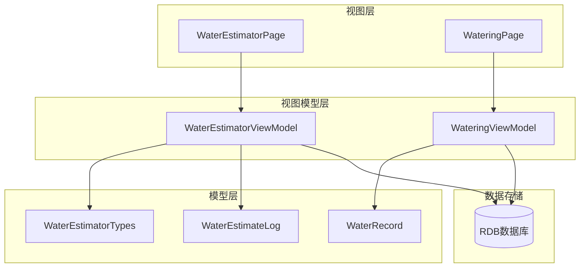
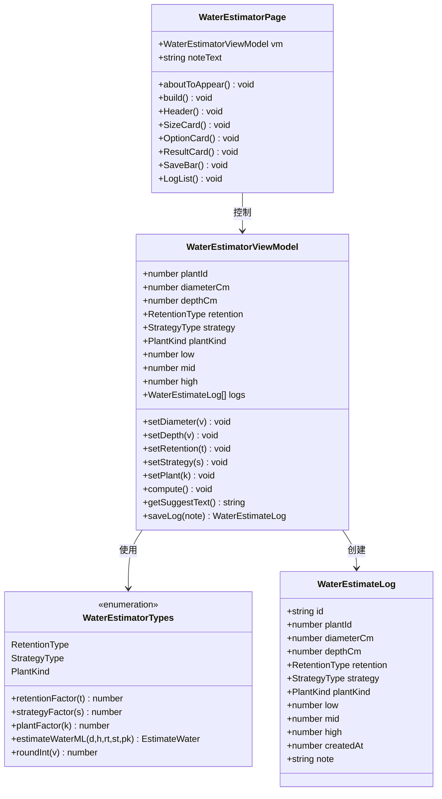
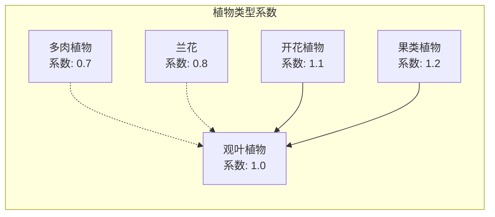
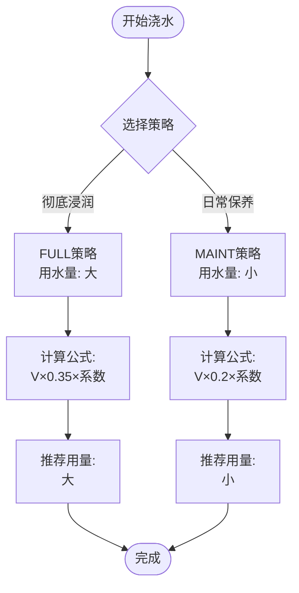
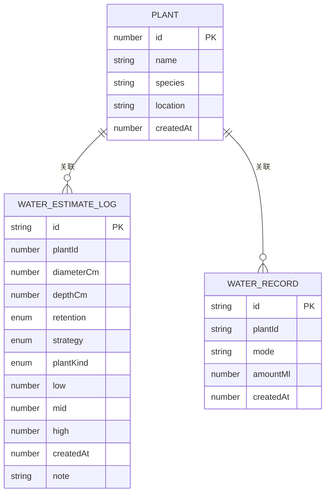
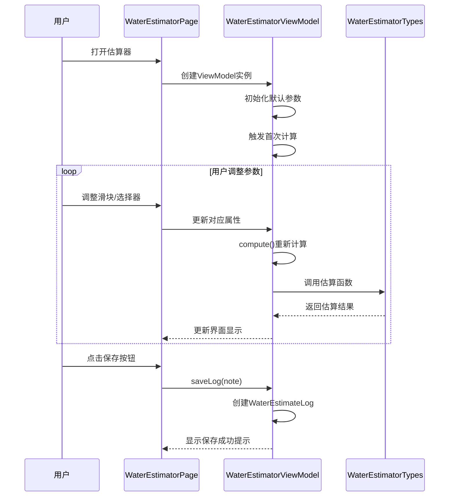
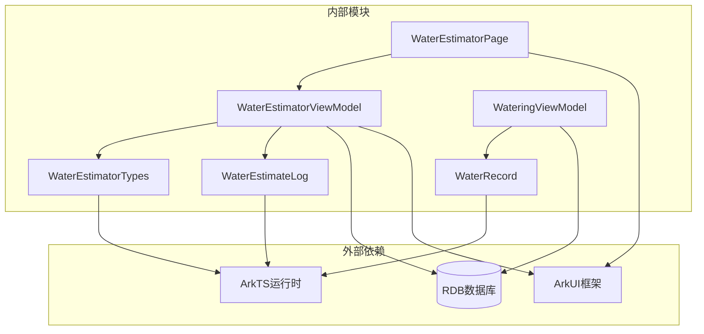
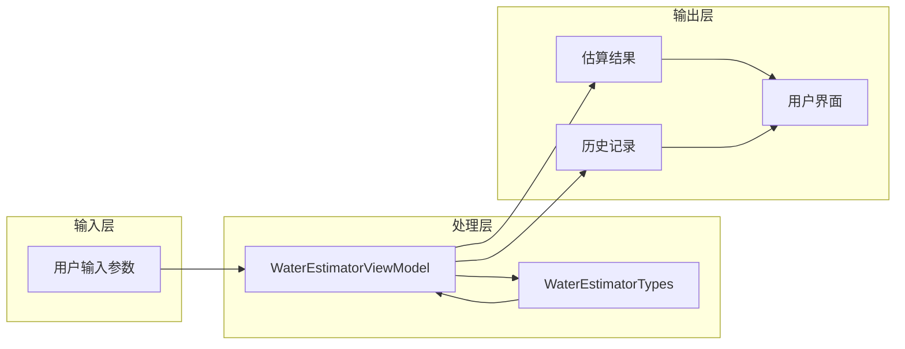
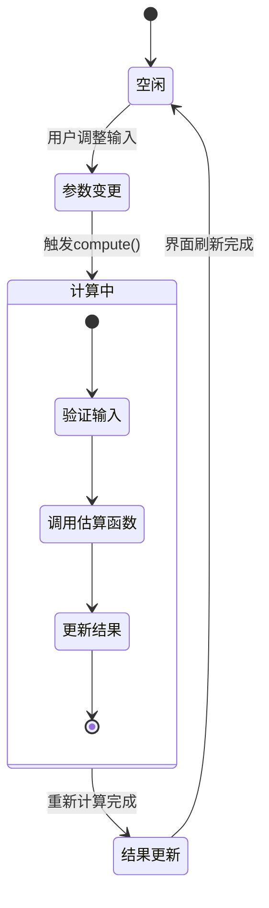

# 浇水估算ViewModel

<cite>
**本文档引用的文件**
- [WaterEstimatorViewModel.ets](file://entry/src/main/ets/viewmodel/WaterEstimatorViewModel.ets)
- [WaterEstimatorTypes.ts](file://entry/build/default/cache/default/default@CompileArkTS/esmodule/debug/entry/src/main/ets/model/WaterEstimatorTypes.ts)
- [WaterEstimateLog.ets](file://entry/src/main/ets/model/WaterEstimateLog.ets)
- [WaterRecord.ets](file://entry/src/main/ets/model/WaterRecord.ets)
- [WateringViewModel.ets](file://entry/src/main/ets/viewmodel/WateringViewModel.ets)
- [WaterEstimatorPage.ets](file://entry/src/main/ets/pages/WaterEstimatorPage.ets)
</cite>

## 目录
1. [简介](#简介)
2. [项目结构](#项目结构)
3. [核心组件](#核心组件)
4. [架构概览](#架构概览)
5. [详细组件分析](#详细组件分析)
6. [依赖关系分析](#依赖关系分析)
7. [性能考虑](#性能考虑)
8. [故障排除指南](#故障排除指南)
9. [结论](#结论)
10. [附录](#附录)

## 简介

浇水估算ViewModel是PlantDiary应用中的核心功能模块，专门用于根据植物特性和环境条件进行智能化的浇水量估算。该模块通过科学的数学模型和园艺学原理，为用户提供精确的浇水指导，帮助用户建立科学的植物养护体系。

本系统采用先进的估算算法，综合考虑植物类型、盆器尺寸、介质保水性、浇水策略等多个维度，为每一种植物提供个性化的浇水方案。通过实时计算和历史记录追踪，用户可以建立完整的植物养护档案，实现精准的智能浇水管理。

## 项目结构

PlantDiary应用采用清晰的MVVM架构设计，浇水估算功能位于视图模型层，实现了业务逻辑与界面展示的完全分离。



**图表来源**
- [WaterEstimatorPage.ets:1-490](file://entry/src/main/ets/pages/WaterEstimatorPage.ets#L1-L490)
- [WaterEstimatorViewModel.ets:1-130](file://entry/src/main/ets/viewmodel/WaterEstimatorViewModel.ets#L1-L130)
- [WateringViewModel.ets:1-102](file://entry/src/main/ets/viewmodel/WateringViewModel.ets#L1-L102)

**章节来源**
- [WaterEstimatorViewModel.ets:1-130](file://entry/src/main/ets/viewmodel/WaterEstimatorViewModel.ets#L1-L130)
- [WaterEstimatorPage.ets:1-490](file://entry/src/main/ets/pages/WaterEstimatorPage.ets#L1-L490)

## 核心组件

### 浇水估算ViewModel (WaterEstimatorViewModel)

WaterEstimatorViewModel是整个浇水估算系统的核心控制器，负责管理所有输入参数、计算结果和历史记录。该类采用@ObservedV2装饰器实现响应式数据绑定，确保界面能够实时反映数据变化。

#### 主要特性

- **响应式数据绑定**：所有属性都标记为@Trace，实现自动更新
- **实时计算**：任何输入参数变化都会触发重新计算
- **历史记录管理**：内置数组存储估算历史
- **建议生成**：根据策略和植物类型提供操作建议

#### 关键属性

| 属性名 | 类型 | 默认值 | 描述 |
|--------|------|--------|------|
| plantId | number | 0 | 植物标识符 |
| diameterCm | number | 14 | 盆器直径（厘米） |
| depthCm | number | 12 | 盆器深度（厘米） |
| retention | RetentionType | GENERAL | 介质保水性 |
| strategy | StrategyType | MAINT | 浇水策略 |
| plantKind | PlantKind | FOLIAGE | 植物类型 |
| low | number | 0 | 估算下限（毫升） |
| mid | number | 0 | 推荐用量（毫升） |
| high | number | 0 | 估算上限（毫升） |
| logs | Array<WaterEstimateLog> | [] | 估算历史记录 |

**章节来源**
- [WaterEstimatorViewModel.ets:16-129](file://entry/src/main/ets/viewmodel/WaterEstimatorViewModel.ets#L16-L129)

### 估算算法核心

系统采用基于物理公式的科学估算方法，通过以下公式计算浇水量：

```
V ≈ π × (盆径/2)² × 深度 × 孔隙率 × 策略系数 × 植株系数 × 介质系数
```

其中：
- **孔隙率**：固定为0.55（土壤平均孔隙率）
- **策略系数**：根据浇水方式调整用水量
- **植株系数**：根据植物类型调整需水量
- **介质系数**：根据土壤保水性调整

**章节来源**
- [WaterEstimatorTypes.ts:151-166](file://entry/build/default/cache/default/default@CompileArkTS/esmodule/debug/entry/src/main/ets/model/WaterEstimatorTypes.ts#L151-L166)

## 架构概览

浇水估算系统采用分层架构设计，确保了良好的可维护性和扩展性。



**图表来源**
- [WaterEstimatorViewModel.ets:16-129](file://entry/src/main/ets/viewmodel/WaterEstimatorViewModel.ets#L16-L129)
- [WaterEstimatorTypes.ts:8-33](file://entry/build/default/cache/default/default@CompileArkTS/esmodule/debug/entry/src/main/ets/model/WaterEstimatorTypes.ts#L8-L33)
- [WaterEstimateLog.ets:6-24](file://entry/src/main/ets/model/WaterEstimateLog.ets#L6-L24)
- [WaterEstimatorPage.ets:9-54](file://entry/src/main/ets/pages/WaterEstimatorPage.ets#L9-L54)

## 详细组件分析

### 估算算法详解

#### 植物需水量差异

系统通过植物类型系数精确反映不同植物的需水量特点：



**图表来源**
- [WaterEstimatorTypes.ts:71-85](file://entry/build/default/cache/default/default@CompileArkTS/esmodule/debug/entry/src/main/ets/model/WaterEstimatorTypes.ts#L71-L85)

#### 介质保水性影响

不同介质对水分保持能力有显著影响：

| 介质类型 | 保水系数 | 特点 | 适用植物 |
|----------|----------|------|----------|
| 砂砾/透水 | 0.8 | 保水性差，排水快 | 多肉、仙人掌 |
| 通用介质 | 1.0 | 平衡性好 | 大多数观叶植物 |
| 泥炭/保水 | 1.2 | 保水性强 | 开花植物、喜湿植物 |
| 兰花介质 | 0.7 | 特殊配方 | 兰花、凤梨科植物 |
| 椰糠 | 1.1 | 保水性好，透气佳 | 多肉、兰花 |

**章节来源**
- [WaterEstimatorTypes.ts:40-54](file://entry/build/default/cache/default/default@CompileArkTS/esmodule/debug/entry/src/main/ets/model/WaterEstimatorTypes.ts#L40-L54)

#### 浇水策略机制

系统提供两种主要浇水策略，针对不同的养护需求：



**图表来源**
- [WaterEstimatorTypes.ts:60-65](file://entry/build/default/cache/default/default@CompileArkTS/esmodule/debug/entry/src/main/ets/model/WaterEstimatorTypes.ts#L60-L65)

**章节来源**
- [WaterEstimatorTypes.ts:151-166](file://entry/build/default/cache/default/default@CompileArkTS/esmodule/debug/entry/src/main/ets/model/WaterEstimatorTypes.ts#L151-L166)

### 历史记录管理系统

#### 记录实体结构

WaterEstimateLog作为估算历史的载体，完整记录每次估算的关键信息：



**图表来源**
- [WaterEstimateLog.ets:6-24](file://entry/src/main/ets/model/WaterEstimateLog.ets#L6-L24)
- [WaterRecord.ets:3-17](file://entry/src/main/ets/model/WaterRecord.ets#L3-L17)

#### 记录存储策略

系统采用内存优先的存储策略，确保快速响应的同时为后续数据库集成预留空间：

| 存储位置 | 特点 | 适用场景 |
|----------|------|----------|
| 内存数组 | 速度快，生命周期短 | 实时估算，临时记录 |
| 数据库 | 持久化，可查询 | 历史分析，统计报表 |
| 本地缓存 | 快速访问，容量有限 | 频繁访问的数据 |

**章节来源**
- [WaterEstimatorViewModel.ets:105-123](file://entry/src/main/ets/viewmodel/WaterEstimatorViewModel.ets#L105-L123)

### 用户界面交互设计

#### 估算器页面结构

WaterEstimatorPage采用卡片式布局，提供直观的交互体验：



**图表来源**
- [WaterEstimatorPage.ets:15-22](file://entry/src/main/ets/pages/WaterEstimatorPage.ets#L15-L22)
- [WaterEstimatorViewModel.ets:74-79](file://entry/src/main/ets/viewmodel/WaterEstimatorViewModel.ets#L74-L79)

**章节来源**
- [WaterEstimatorPage.ets:24-54](file://entry/src/main/ets/pages/WaterEstimatorPage.ets#L24-L54)

## 依赖关系分析

### 组件间依赖关系



**图表来源**
- [WaterEstimatorViewModel.ets:4-8](file://entry/src/main/ets/viewmodel/WaterEstimatorViewModel.ets#L4-L8)
- [WaterEstimatorPage.ets:4-7](file://entry/src/main/ets/pages/WaterEstimatorPage.ets#L4-L7)

### 数据流分析

系统采用单向数据流设计，确保数据一致性：



**图表来源**
- [WaterEstimatorViewModel.ets:74-79](file://entry/src/main/ets/viewmodel/WaterEstimatorViewModel.ets#L74-L79)
- [WaterEstimatorTypes.ts:151-166](file://entry/build/default/cache/default/default@CompileArkTS/esmodule/debug/entry/src/main/ets/model/WaterEstimatorTypes.ts#L151-L166)

**章节来源**
- [WaterEstimatorViewModel.ets:16-129](file://entry/src/main/ets/viewmodel/WaterEstimatorViewModel.ets#L16-L129)

## 性能考虑

### 计算性能优化

系统在保证精度的前提下，采用了多项性能优化措施：

- **延迟计算**：仅在参数变化时触发计算
- **数值范围限制**：防止异常输入导致的计算错误
- **内存管理**：合理控制历史记录数量，避免内存泄漏

### 响应式更新机制

通过@ObservedV2装饰器实现的响应式系统，确保界面更新的及时性和准确性：



**图表来源**
- [WaterEstimatorViewModel.ets:74-79](file://entry/src/main/ets/viewmodel/WaterEstimatorViewModel.ets#L74-L79)

## 故障排除指南

### 常见问题及解决方案

#### 估算结果异常

**问题现象**：估算结果明显不合理
**可能原因**：
- 盆器尺寸输入超出合理范围
- 介质类型选择不当
- 植物类型与实际不符

**解决步骤**：
1. 检查盆器尺寸是否在6-60cm范围内
2. 确认介质类型符合实际使用情况
3. 验证植物类型分类准确性

#### 界面更新延迟

**问题现象**：参数调整后界面未及时更新
**解决方法**：
- 确认@ObservedV2装饰器正确应用
- 检查@Trace装饰器是否遗漏
- 验证compute()方法是否被正确调用

#### 历史记录丢失

**问题现象**：重启应用后历史记录消失
**原因分析**：
- 当前版本使用内存存储
- 应用进程被系统回收

**预防措施**：
- 定期导出重要估算记录
- 在数据库版本完成后迁移数据

**章节来源**
- [WaterEstimatorViewModel.ets:41-70](file://entry/src/main/ets/viewmodel/WaterEstimatorViewModel.ets#L41-L70)

## 结论

浇水估算ViewModel为PlantDiary应用提供了科学、准确、易用的智能浇水解决方案。通过精心设计的算法模型和用户友好的界面交互，系统能够帮助用户建立科学的植物养护体系。

### 核心优势

1. **科学性**：基于植物学原理和土壤物理学的精确计算
2. **个性化**：针对不同植物类型提供定制化建议
3. **智能化**：实时响应环境变化，动态调整推荐用量
4. **可追溯**：完整的估算历史记录，便于趋势分析
5. **易用性**：直观的界面设计，降低使用门槛

### 发展前景

随着数据库集成的完成和机器学习算法的引入，浇水估算系统将进一步提升智能化水平，为用户提供更加精准和个性化的植物养护指导。

## 附录

### 使用指南

#### 基本使用流程

1. **输入盆器参数**：调整盆径和深度滑块
2. **选择介质类型**：根据实际使用介质选择
3. **设置浇水策略**：根据植物状态选择策略
4. **查看估算结果**：参考推荐用量进行浇水
5. **保存历史记录**：记录重要估算信息

#### 最佳实践建议

- **定期校准**：根据实际浇水效果调整估算参数
- **环境适应**：在极端天气条件下适当调整用水量
- **植物观察**：结合植物状态灵活运用估算结果
- **记录分析**：利用历史记录分析植物需求规律