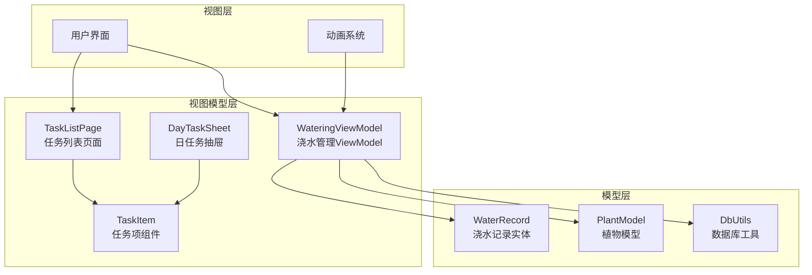
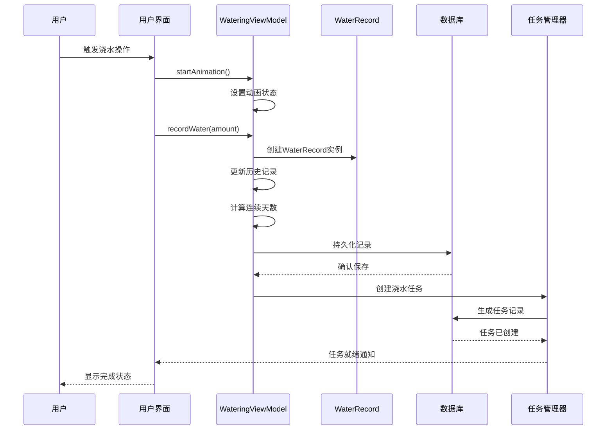
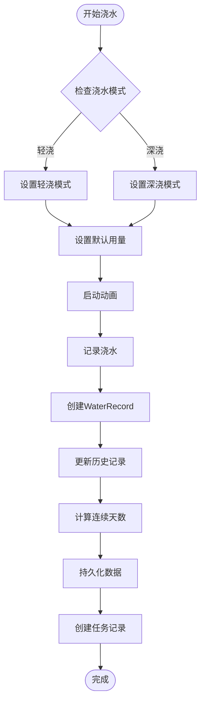
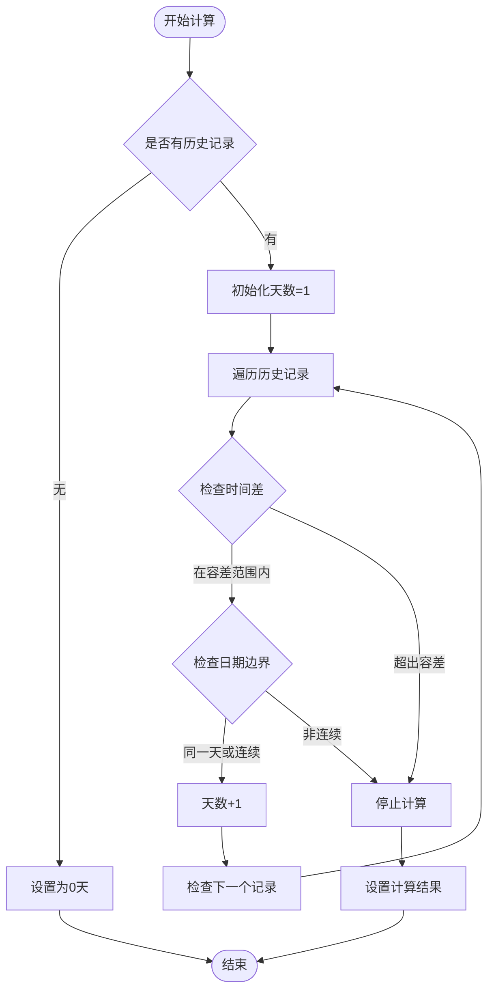
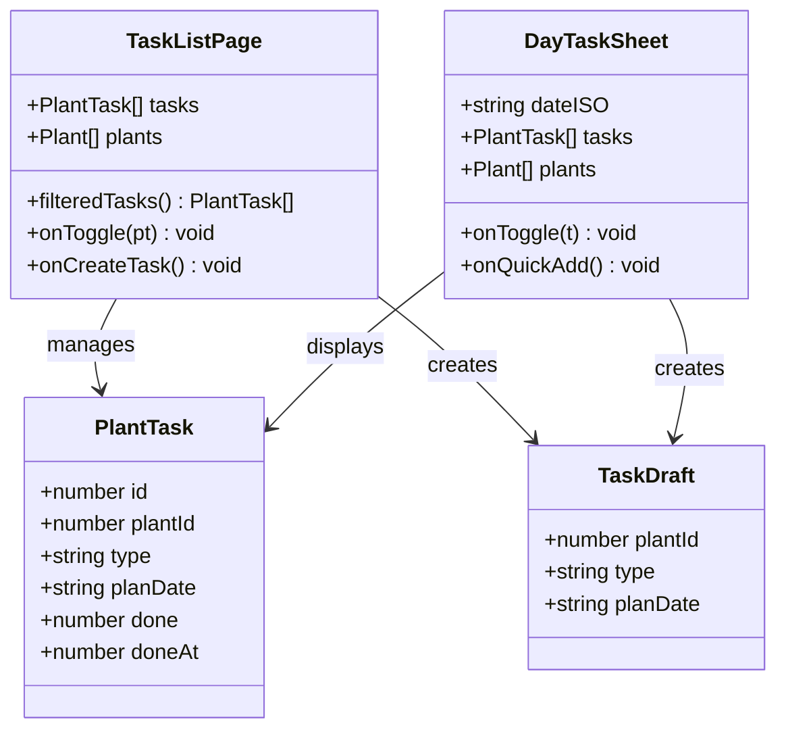
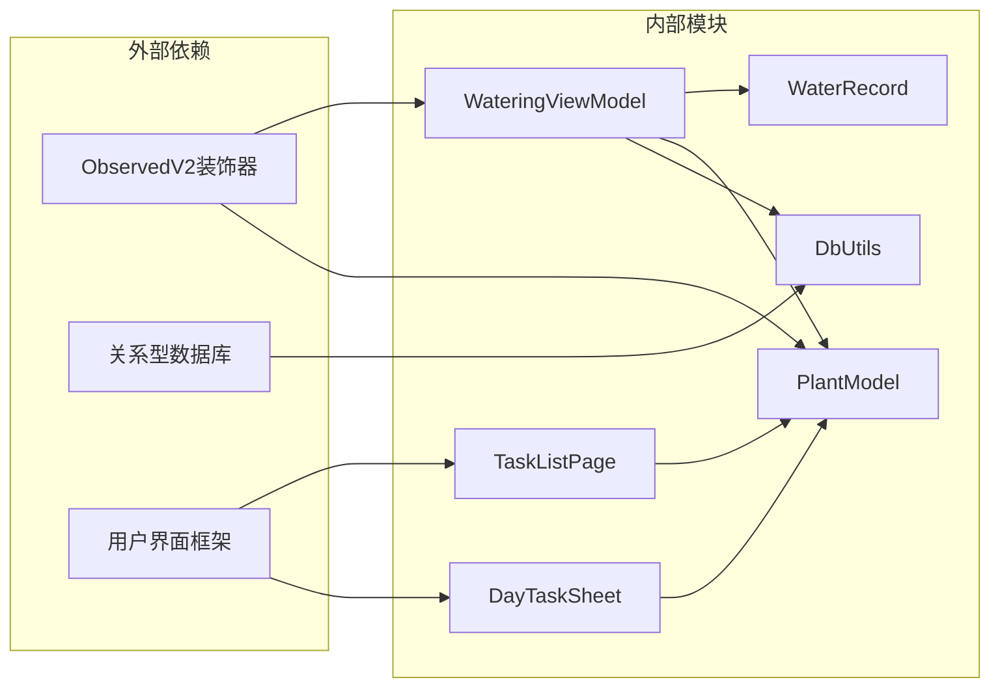

# 浇水管理ViewModel

<cite>
**本文档引用的文件**
- [WateringViewModel.ets](file://entry/src/main/ets/viewmodel/WateringViewModel.ets)
- [WaterRecord.ets](file://entry/src/main/ets/model/WaterRecord.ets)
- [PlantModel.ets](file://entry/src/main/ets/model/PlantModel.ets)
- [DbUtils.ets](file://entry/src/main/ets/model/DbUtils.ets)
- [TaskListPage.ets](file://entry/src/main/ets/pages/TaskListPage.ets)
- [DayTaskSheet.ets](file://entry/src/main/ets/view/DayTaskSheet.ets)
- [TaskItem.ets](file://entry/src/main/ets/view/TaskItem.ets)
</cite>

## 目录
1. [简介](#简介)
2. [项目结构](#项目结构)
3. [核心组件](#核心组件)
4. [架构概览](#架构概览)
5. [详细组件分析](#详细组件分析)
6. [依赖关系分析](#依赖关系分析)
7. [性能考虑](#性能考虑)
8. [故障排除指南](#故障排除指南)
9. [结论](#结论)

## 简介

浇水管理ViewModel是PlantDiary植物养护应用中的核心组件，负责管理植物的浇水任务、历史记录和相关状态。该系统提供了完整的浇水任务生命周期管理，包括任务生成、分配、跟踪、提醒和完成确认等功能。

系统采用MVVM架构模式，通过WateringViewModel管理浇水动画状态、历史记录、连胜天数逻辑，并生成WaterRecord实体来记录每次浇水操作。同时，系统集成了任务管理系统，支持浇水任务的批量处理和智能安排。

## 项目结构

PlantDiary项目的浇水管理功能分布在以下关键模块中：

**图表来源**
- [WateringViewModel.ets:1-102](file://entry/src/main/ets/viewmodel/WateringViewModel.ets#L1-L102)
- [TaskListPage.ets:1-463](file://entry/src/main/ets/pages/TaskListPage.ets#L1-L463)

**章节来源**
- [WateringViewModel.ets:1-102](file://entry/src/main/ets/viewmodel/WateringViewModel.ets#L1-L102)
- [PlantModel.ets:1-166](file://entry/src/main/ets/model/PlantModel.ets#L1-L166)

## 核心组件

### WateringViewModel - 浇水管理核心

WateringViewModel是浇水管理的主要控制器，负责管理浇水动画状态、历史记录和相关逻辑。

**主要功能特性：**
- 浇水模式管理（轻浇/深浇）
- 动画状态控制
- 浇水历史记录管理
- 连续浇水天数统计
- 时间格式化工具

**关键属性：**
- `plantId`: 植物标识符
- `isAnimating`: 动画状态标志
- `mode`: 浇水模式（'light' | 'deep'）
- `defaultAmount`: 默认浇水用量（ml）
- `recentTimes`: 最近10次浇水时间戳数组
- `streakDays`: 连续浇水天数

**章节来源**
- [WateringViewModel.ets:11-96](file://entry/src/main/ets/viewmodel/WateringViewModel.ets#L11-L96)

### WaterRecord - 浇水记录实体

WaterRecord是轻量级的数据传输对象，用于表示单次浇水操作的详细信息。

**核心字段：**
- `id`: 记录唯一标识符
- `plantId`: 关联植物标识符
- `mode`: 浇水模式
- `amountMl`: 浇水量（毫升）
- `createdAt`: 创建时间戳

**章节来源**
- [WaterRecord.ets:1-18](file://entry/src/main/ets/model/WaterRecord.ets#L1-L18)

### 任务管理系统集成

系统集成了完整的任务管理功能，支持浇水任务的创建、管理和跟踪。

**任务模型：**
- `PlantTask`: 植物任务实体
- `TaskDraft`: 任务草稿
- 支持多种任务类型（浇水、施肥、修剪等）

**章节来源**
- [PlantModel.ets:43-59](file://entry/src/main/ets/model/PlantModel.ets#L43-L59)
- [PlantModel.ets:70-75](file://entry/src/main/ets/model/PlantModel.ets#L70-L75)

## 架构概览

浇水管理系统采用分层架构设计，确保职责分离和代码可维护性：

**图表来源**
- [WateringViewModel.ets:36-57](file://entry/src/main/ets/viewmodel/WateringViewModel.ets#L36-L57)
- [WaterRecord.ets:10-16](file://entry/src/main/ets/model/WaterRecord.ets#L10-L16)

系统架构特点：
- **响应式设计**: 使用@ObservedV2装饰器实现数据绑定
- **事务安全**: 通过runInTransaction确保数据一致性
- **模块化**: 清晰的职责分离，便于测试和维护
- **扩展性**: 支持多种任务类型和自定义规则

## 详细组件分析

### 浇水任务生成流程

**图表来源**
- [WateringViewModel.ets:29-57](file://entry/src/main/ets/viewmodel/WateringViewModel.ets#L29-L57)
- [WateringViewModel.ets:66-88](file://entry/src/main/ets/viewmodel/WateringViewModel.ets#L66-L88)

**章节来源**
- [WateringViewModel.ets:25-88](file://entry/src/main/ets/viewmodel/WateringViewModel.ets#L25-L88)

### 连续天数计算算法

系统实现了智能的连续天数计算逻辑，考虑了跨天边界和时间误差：

**图表来源**
- [WateringViewModel.ets:66-88](file://entry/src/main/ets/viewmodel/WateringViewModel.ets#L66-L88)

算法特点：
- **时间容差**: 允许最多36小时的时间误差
- **日期边界处理**: 正确处理午夜跨天情况
- **连续性判断**: 基于日期计算而非仅时间差

**章节来源**
- [WateringViewModel.ets:66-88](file://entry/src/main/ets/viewmodel/WateringViewModel.ets#L66-L88)

### 任务管理系统

系统提供了完整的任务管理功能，支持浇水任务的创建、跟踪和统计：

**图表来源**
- [PlantModel.ets:43-59](file://entry/src/main/ets/model/PlantModel.ets#L43-L59)
- [PlantModel.ets:70-75](file://entry/src/main/ets/model/PlantModel.ets#L70-L75)
- [TaskListPage.ets:7-30](file://entry/src/main/ets/pages/TaskListPage.ets#L7-L30)

**章节来源**
- [TaskListPage.ets:135-162](file://entry/src/main/ets/pages/TaskListPage.ets#L135-L162)
- [DayTaskSheet.ets:14-57](file://entry/src/main/ets/view/DayTaskSheet.ets#L14-L57)

### 数据持久化机制

系统采用事务性数据库操作确保数据一致性：

**事务处理流程：**
1. 开始事务
2. 执行数据库操作
3. 提交事务或回滚
4. 错误处理和异常传播

**章节来源**
- [DbUtils.ets:12-21](file://entry/src/main/ets/model/DbUtils.ets#L12-L21)

## 依赖关系分析

浇水管理系统的依赖关系体现了清晰的分层架构：

**图表来源**
- [WateringViewModel.ets:11](file://entry/src/main/ets/viewmodel/WateringViewModel.ets#L11)
- [PlantModel.ets:6](file://entry/src/main/ets/model/PlantModel.ets#L6)

**章节来源**
- [WateringViewModel.ets:1-102](file://entry/src/main/ets/viewmodel/WateringViewModel.ets#L1-L102)
- [PlantModel.ets:1-166](file://entry/src/main/ets/model/PlantModel.ets#L1-L166)

## 性能考虑

### 内存优化策略

1. **历史记录限制**: 最近10次浇水记录，避免内存无限增长
2. **响应式更新**: 使用@ObservedV2减少不必要的UI重绘
3. **延迟计算**: 连续天数计算仅在需要时执行

### 数据库性能

1. **事务批处理**: 使用runInTransaction确保批量操作的原子性
2. **索引优化**: 建议在常用查询字段上建立索引
3. **连接池管理**: 合理管理数据库连接资源

### 动画性能

1. **硬件加速**: 利用平台的硬件加速能力
2. **帧率控制**: 通过合理的动画间隔控制CPU使用
3. **内存管理**: 及时释放不再使用的动画资源

## 故障排除指南

### 常见问题及解决方案

**问题1: 浇水记录无法保存**
- 检查数据库连接状态
- 验证事务是否正确提交
- 确认权限设置

**问题2: 连续天数计算错误**
- 检查时间戳格式
- 验证跨天边界处理
- 确认时间容差设置

**问题3: 任务状态不同步**
- 检查响应式数据绑定
- 验证事件回调机制
- 确认UI刷新时机

**章节来源**
- [DbUtils.ets:12-21](file://entry/src/main/ets/model/DbUtils.ets#L12-L21)
- [WateringViewModel.ets:66-88](file://entry/src/main/ets/viewmodel/WateringViewModel.ets#L66-L88)

## 结论

PlantDiary的浇水管理ViewModel提供了一个完整、高效且用户友好的植物浇水管理解决方案。系统通过精心设计的架构和算法，实现了以下核心功能：

**主要优势：**
- **智能化管理**: 自动计算连续天数，提供科学的浇水建议
- **用户体验优秀**: 流畅的动画效果和直观的操作界面
- **数据安全可靠**: 事务性数据库操作确保数据一致性
- **扩展性强**: 模块化设计支持功能扩展和定制

**技术亮点：**
- 响应式编程模型提升开发效率
- 智能算法优化用户体验
- 完善的错误处理和异常管理
- 清晰的代码结构和文档

该系统为植物爱好者提供了一个专业级的浇水管理工具，帮助用户建立科学的植物养护习惯，提高植物存活率和生长质量。