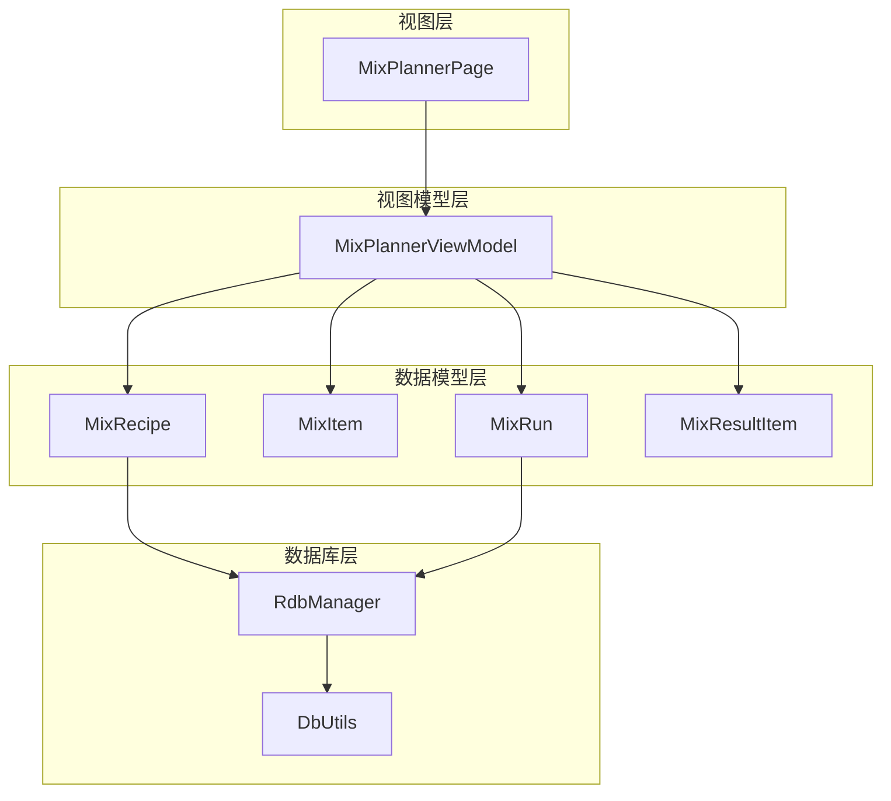
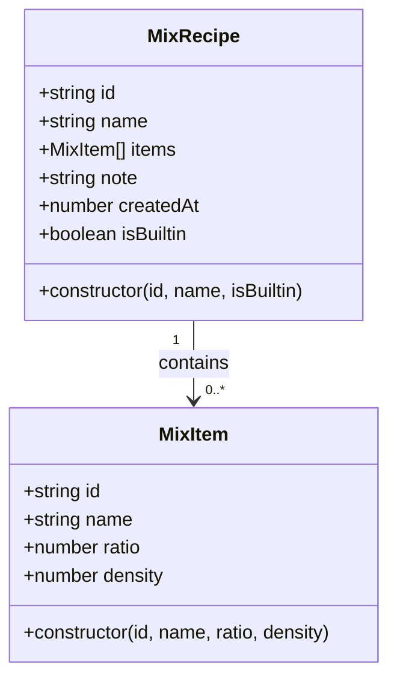
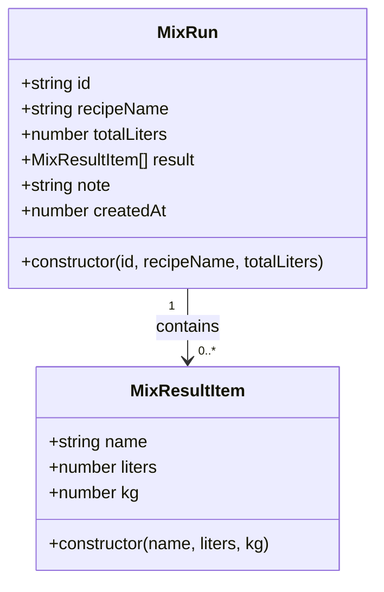
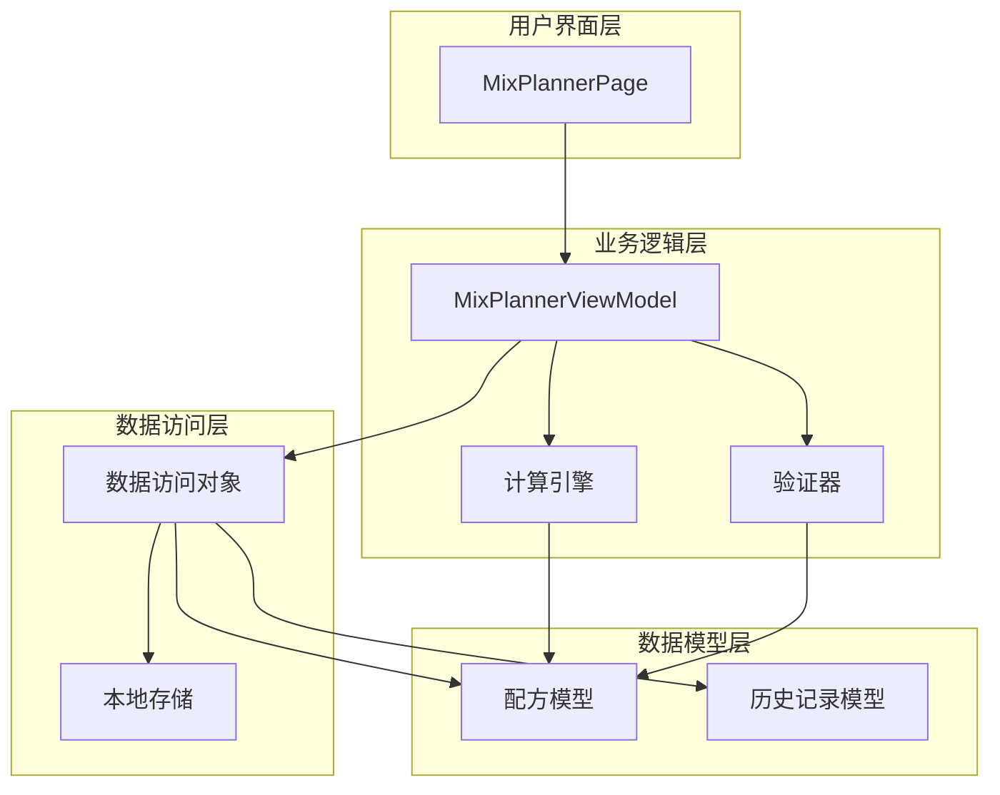
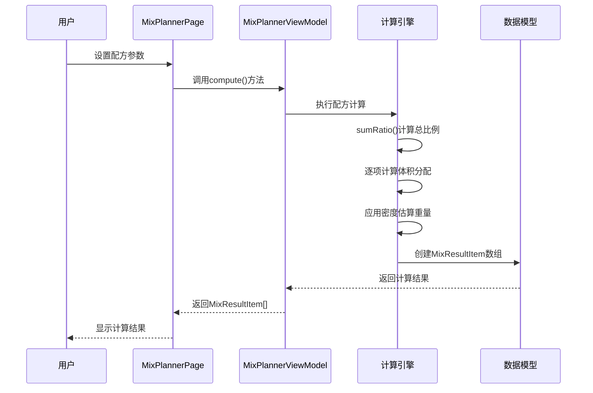
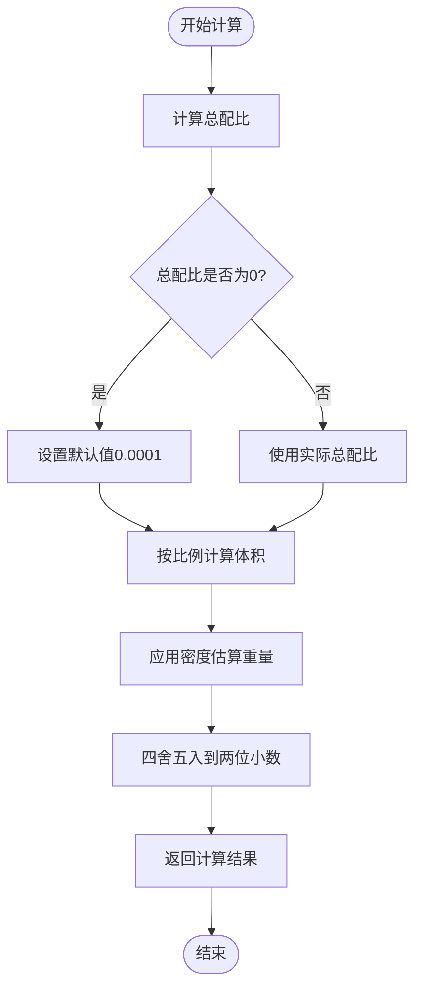
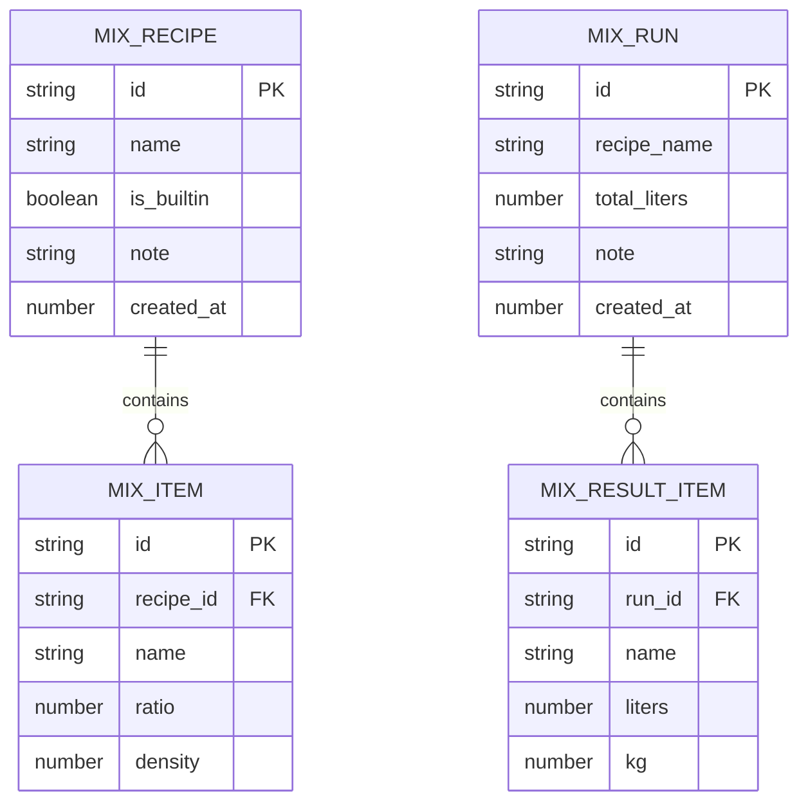
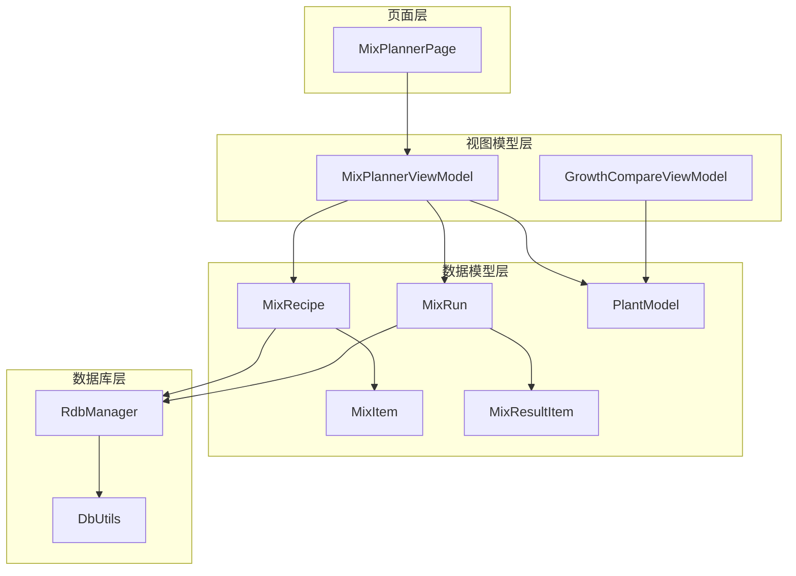

# 混合配方规划ViewModel

<cite>
**本文档引用的文件**
- [MixPlannerViewModel.ets](file://entry/src/main/ets/viewmodel/MixPlannerViewModel.ets)
- [MixRecipe.ets](file://entry/src/main/ets/model/MixRecipe.ets)
- [MixRun.ets](file://entry/src/main/ets/model/MixRun.ets)
- [MixPlannerPage.ets](file://entry/src/main/ets/pages/MixPlannerPage.ets)
- [DbUtils.ets](file://entry/src/main/ets/model/DbUtils.ets)
- [PlantModel.ets](file://entry/src/main/ets/model/PlantModel.ets)
- [RdbManager.ets](file://entry/src/main/ets/viewmodel/RdbManager.ets)
</cite>

## 目录
1. [简介](#简介)
2. [项目结构](#项目结构)
3. [核心组件](#核心组件)
4. [架构概览](#架构概览)
5. [详细组件分析](#详细组件分析)
6. [依赖关系分析](#依赖关系分析)
7. [性能考量](#性能考量)
8. [故障排除指南](#故障排除指南)
9. [结论](#结论)
10. [附录](#附录)

## 简介

混合配方规划ViewModel是植物日记应用中一个关键的功能模块，专门用于植物营养配方的混合设计和管理。该模块基于科学的植物营养学原理，结合实践经验，为用户提供了一个完整的植物营养管理解决方案。

本模块的核心功能包括：
- 植物营养配方的科学设计和优化
- 不同肥料成分的配比算法和营养需求分析
- 植物生长阶段对营养元素的不同需求和调整策略
- 配方混合的安全性考虑和浓度控制机制
- 配方效果的预测模型和实验验证方法
- 配方历史记录和效果追踪功能

## 项目结构

混合配方规划模块采用MVVM架构模式，清晰分离了视图、视图模型和数据模型：

**图表来源**
- [MixPlannerPage.ets:39-90](file://entry/src/main/ets/pages/MixPlannerPage.ets#L39-L90)
- [MixPlannerViewModel.ets:17-39](file://entry/src/main/ets/viewmodel/MixPlannerViewModel.ets#L17-L39)
- [MixRecipe.ets:4-32](file://entry/src/main/ets/model/MixRecipe.ets#L4-L32)
- [MixRun.ets:4-30](file://entry/src/main/ets/model/MixRun.ets#L4-L30)

**章节来源**
- [MixPlannerPage.ets:1-366](file://entry/src/main/ets/pages/MixPlannerPage.ets#L1-L366)
- [MixPlannerViewModel.ets:1-228](file://entry/src/main/ets/viewmodel/MixPlannerViewModel.ets#L1-L228)

## 核心组件

### MixPlannerViewModel - 主要视图模型

MixPlannerViewModel是整个混合配方规划系统的核心，负责管理配方的创建、编辑、计算和存储功能。

#### 主要属性
- `plantId`: 关联的植物标识符
- `recipeName`: 当前配方名称
- `items`: 配方材料列表
- `totalLiters`: 总配制量（升）
- `builtinRecipes`: 内置配方集合
- `myRecipes`: 用户自定义配方集合
- `runs`: 调配历史记录

#### 核心功能
1. **配方管理**: 支持内置配方选择、自定义配方编辑、用户配方保存
2. **计算引擎**: 实现配方比例分配和重量估算
3. **历史追踪**: 记录每次配方调配的详细信息
4. **数据持久化**: 提供配方和历史记录的保存机制

**章节来源**
- [MixPlannerViewModel.ets:17-39](file://entry/src/main/ets/viewmodel/MixPlannerViewModel.ets#L17-L39)
- [MixPlannerViewModel.ets:168-181](file://entry/src/main/ets/viewmodel/MixPlannerViewModel.ets#L168-L181)

### 数据模型设计

#### MixRecipe - 配方实体

**图表来源**
- [MixRecipe.ets:18-32](file://entry/src/main/ets/model/MixRecipe.ets#L18-L32)
- [MixRecipe.ets:4-16](file://entry/src/main/ets/model/MixRecipe.ets#L4-L16)

#### MixRun - 调配记录

**图表来源**
- [MixRun.ets:16-30](file://entry/src/main/ets/model/MixRun.ets#L16-L30)
- [MixRun.ets:4-14](file://entry/src/main/ets/model/MixRun.ets#L4-L14)

**章节来源**
- [MixRecipe.ets:1-33](file://entry/src/main/ets/model/MixRecipe.ets#L1-L33)
- [MixRun.ets:1-31](file://entry/src/main/ets/model/MixRun.ets#L1-L31)

## 架构概览

混合配方规划系统采用分层架构设计，确保了良好的可维护性和扩展性：

**图表来源**
- [MixPlannerPage.ets:39-90](file://entry/src/main/ets/pages/MixPlannerPage.ets#L39-L90)
- [MixPlannerViewModel.ets:17-39](file://entry/src/main/ets/viewmodel/MixPlannerViewModel.ets#L17-L39)

### 配方计算流程

配方计算是系统的核心功能，实现了科学的配比算法：

**图表来源**
- [MixPlannerViewModel.ets:168-181](file://entry/src/main/ets/viewmodel/MixPlannerViewModel.ets#L168-L181)
- [MixPlannerPage.ets:252-273](file://entry/src/main/ets/pages/MixPlannerPage.ets#L252-L273)

**章节来源**
- [MixPlannerViewModel.ets:168-181](file://entry/src/main/ets/viewmodel/MixPlannerViewModel.ets#L168-L181)
- [MixPlannerPage.ets:252-273](file://entry/src/main/ets/pages/MixPlannerPage.ets#L252-L273)

## 详细组件分析

### 配方管理功能

#### 内置配方系统
系统预置了多种常用的植物配方，针对不同的植物类型和生长需求：

| 配方类型 | 名称 | 配比 | 适用植物 | 特点 |
|---------|------|------|----------|------|
| 排水型 | 多肉·排水型(2:2:1) | 泥炭:珍珠岩:树皮 = 2:2:1 | 多肉植物 | 高排水性，防止根部腐烂 |
| 通用型 | 观叶·通用(2:2:1) | 椰糠:泥炭:珍珠岩 = 2:2:1 | 观叶植物 | 保水保肥，适合大多数观叶植物 |
| 透气型 | 兰科·透气(3:2) | 树皮/松鳞:轻石/火山岩 = 3:2 | 兰科植物 | 高透气性，模拟兰花附生环境 |

#### 自定义配方编辑
用户可以通过以下方式编辑自定义配方：
- 添加新的配方材料
- 修改材料名称和配比
- 设置密度参数（kg/L）
- 删除不需要的材料

**章节来源**
- [MixPlannerViewModel.ets:43-77](file://entry/src/main/ets/viewmodel/MixPlannerViewModel.ets#L43-L77)
- [MixPlannerPage.ets:154-231](file://entry/src/main/ets/pages/MixPlannerPage.ets#L154-L231)

### 计算引擎分析

#### 配比算法实现
配方计算采用了科学的比例分配算法：

**图表来源**
- [MixPlannerViewModel.ets:161-181](file://entry/src/main/ets/viewmodel/MixPlannerViewModel.ets#L161-L181)

#### 密度估算机制
系统提供了灵活的密度估算机制：
- **默认密度**: 0.15 kg/L（适用于大多数通用材料）
- **自定义密度**: 用户可为特定材料设置密度值
- **密度范围限制**: 0-3 kg/L，确保计算的合理性

**章节来源**
- [MixPlannerViewModel.ets:168-181](file://entry/src/main/ets/viewmodel/MixPlannerViewModel.ets#L168-L181)
- [MixPlannerPage.ets:192-230](file://entry/src/main/ets/pages/MixPlannerPage.ets#L192-L230)

### 历史记录和追踪功能

#### 调配记录管理
系统完整记录每次配方调配的详细信息：
- 配方名称和类型
- 总配制量（升）
- 材料清单和用量
- 调配时间戳
- 用户备注

#### 效果追踪机制
通过历史记录，用户可以：
- 追踪不同配方的效果差异
- 分析植物生长趋势
- 优化配方参数
- 建立个人配方知识库

**章节来源**
- [MixPlannerViewModel.ets:215-226](file://entry/src/main/ets/viewmodel/MixPlannerViewModel.ets#L215-L226)
- [MixRun.ets:16-30](file://entry/src/main/ets/model/MixRun.ets#L16-L30)

### 数据持久化设计

#### 数据库架构
系统采用关系型数据库存储配方和历史数据：

**图表来源**
- [RdbManager.ets:36-102](file://entry/src/main/ets/viewmodel/RdbManager.ets#L36-L102)

#### 事务管理
系统使用统一的事务管理机制确保数据一致性：
- 批量操作的原子性
- 失败回滚机制
- 错误处理和异常恢复

**章节来源**
- [DbUtils.ets:12-21](file://entry/src/main/ets/model/DbUtils.ets#L12-L21)
- [RdbManager.ets:172-208](file://entry/src/main/ets/viewmodel/RdbManager.ets#L172-L208)

## 依赖关系分析

### 组件间依赖关系

**图表来源**
- [MixPlannerPage.ets:5-8](file://entry/src/main/ets/pages/MixPlannerPage.ets#L5-L8)
- [MixPlannerViewModel.ets:4-5](file://entry/src/main/ets/viewmodel/MixPlannerViewModel.ets#L4-L5)

### 外部依赖分析

系统主要依赖以下外部组件：
- **ArkTS框架**: 提供MVVM架构支持
- **关系型数据库**: 存储配方和历史数据
- **本地存储**: 提供数据持久化能力

**章节来源**
- [MixPlannerPage.ets:1-366](file://entry/src/main/ets/pages/MixPlannerPage.ets#L1-L366)
- [MixPlannerViewModel.ets:1-228](file://entry/src/main/ets/viewmodel/MixPlannerViewModel.ets#L1-L228)

## 性能考量

### 计算性能优化

系统在计算性能方面采用了多项优化措施：

1. **惰性计算**: 结果卡片直接调用计算方法，避免中间状态缓存
2. **数值精度控制**: 使用四舍五入确保显示精度的一致性
3. **边界值处理**: 对输入参数进行严格的边界检查和容错处理

### 内存管理

- **深拷贝机制**: 避免编辑态污染内置模板
- **数组操作优化**: 使用高效的数组复制和更新策略
- **垃圾回收**: 及时释放不再使用的临时对象

### 数据库性能

- **索引优化**: 为常用查询字段建立索引
- **事务批处理**: 减少数据库操作次数
- **连接池管理**: 优化数据库连接的使用效率

## 故障排除指南

### 常见问题及解决方案

#### 配方计算异常
**问题**: 计算结果异常或显示错误
**解决方案**: 
1. 检查总配比是否为0
2. 验证密度参数的有效性
3. 确认材料数量的合理性

#### 数据保存失败
**问题**: 配方或历史记录无法保存
**解决方案**:
1. 检查数据库连接状态
2. 验证事务执行结果
3. 查看错误日志获取详细信息

#### 界面响应缓慢
**问题**: 页面操作响应迟缓
**解决方案**:
1. 检查计算密集型操作
2. 优化数组遍历和查找
3. 减少不必要的重绘操作

**章节来源**
- [MixPlannerViewModel.ets:124-159](file://entry/src/main/ets/viewmodel/MixPlannerViewModel.ets#L124-L159)
- [DbUtils.ets:12-21](file://entry/src/main/ets/model/DbUtils.ets#L12-L21)

## 结论

混合配方规划ViewModel是一个功能完整、设计合理的植物营养管理工具。它成功地将科学的植物营养学原理与实用的用户体验相结合，为用户提供了：

1. **科学的配方设计**: 基于植物生长需求的配方算法
2. **灵活的编辑功能**: 支持内置配方和自定义配方的自由组合
3. **完整的追踪体系**: 从配方创建到效果评估的全流程管理
4. **可靠的数据持久化**: 确保用户数据的安全和一致性

该模块不仅满足了当前的功能需求，还为未来的扩展和优化奠定了坚实的基础。通过持续的改进和完善，它将成为植物日记应用中不可或缺的重要组成部分。

## 附录

### 使用指南

#### 基本使用流程
1. 选择或创建配方
2. 设置材料配比和密度
3. 设定总配制量
4. 查看计算结果
5. 保存配方或记录

#### 最佳实践建议
- 根据植物类型选择合适的配方模板
- 定期记录和追踪配方效果
- 根据植物生长阶段调整营养配比
- 建立个人配方知识库

### 开发参考

#### 扩展方向
- 集成更多植物营养数据库
- 添加配方效果预测算法
- 实现配方分享和社区功能
- 集成传感器数据进行智能调节