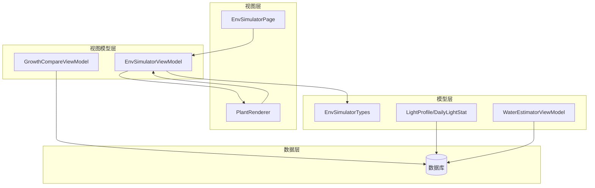
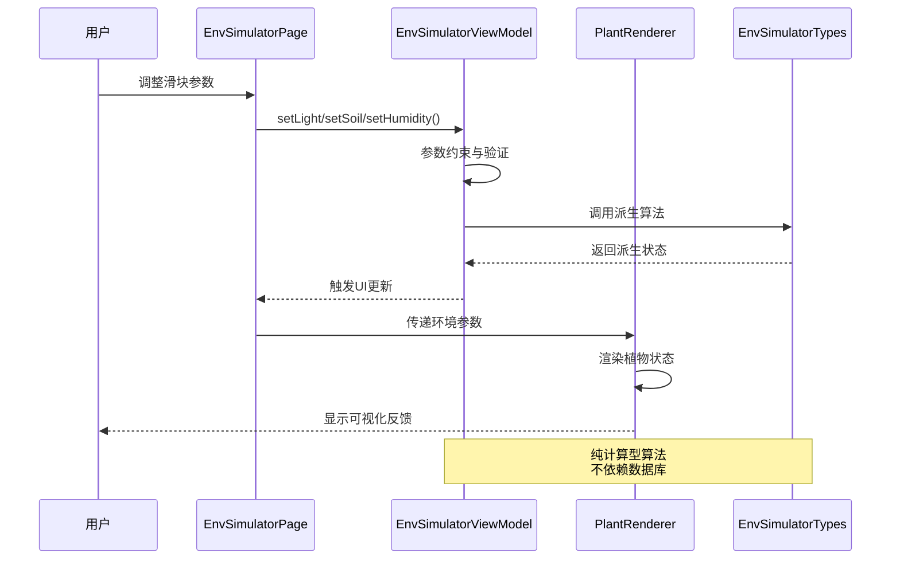
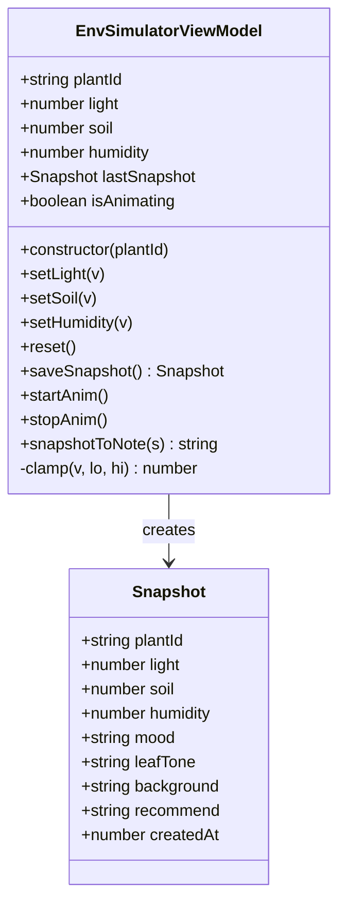
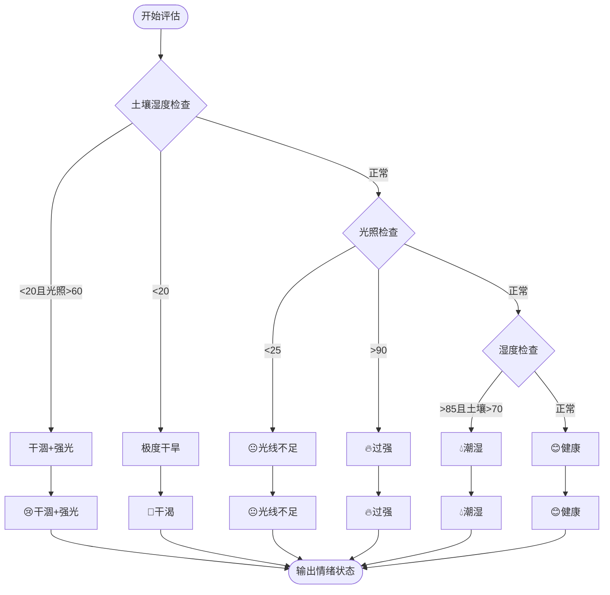
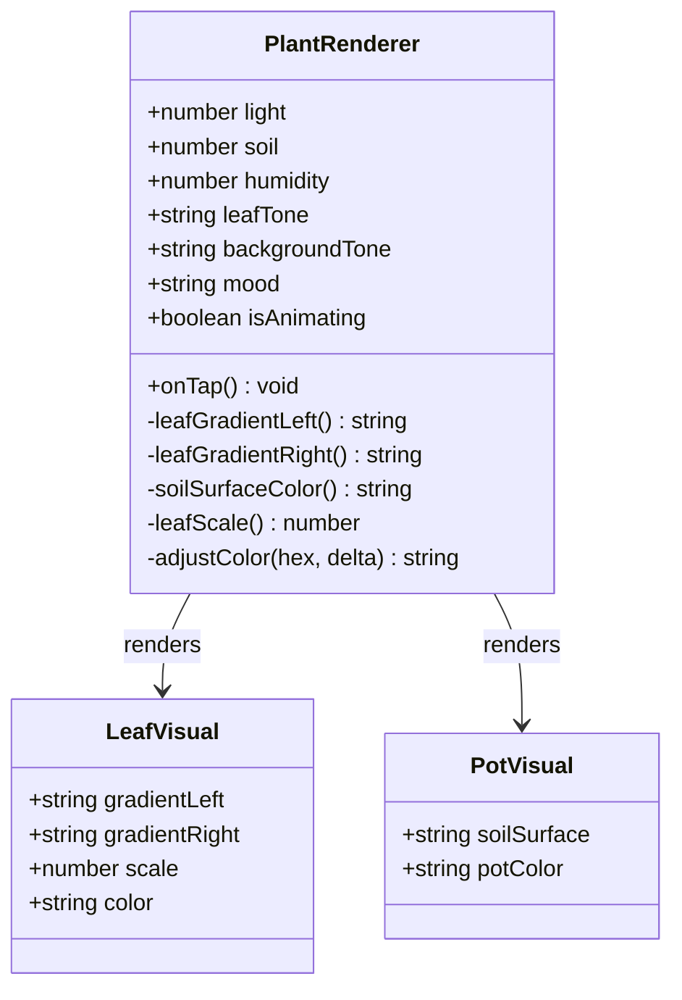
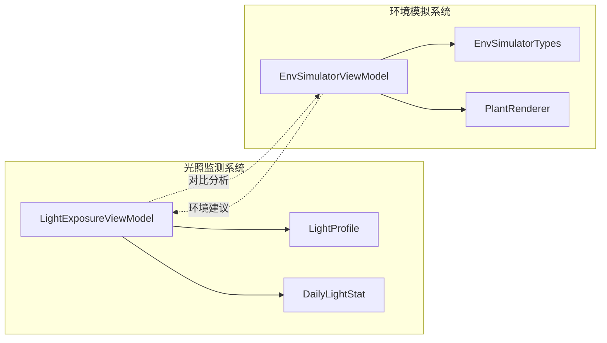
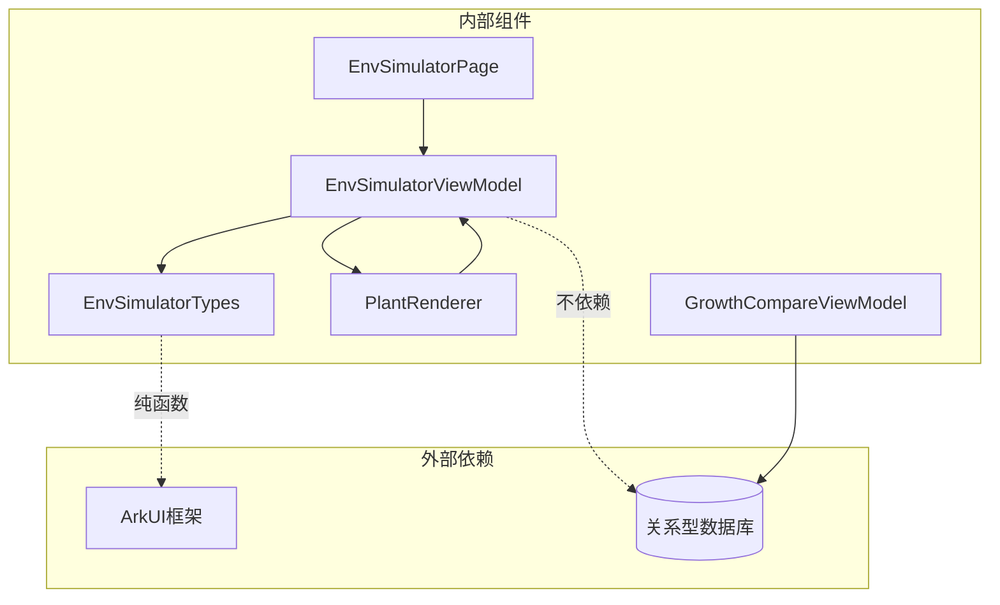

# 环境模拟器ViewModel

<cite>
**本文档引用的文件**
- [EnvSimulatorViewModel.ets](file://entry/src/main/ets/viewmodel/EnvSimulatorViewModel.ets)
- [EnvSimulatorPage.ets](file://entry/src/main/ets/pages/EnvSimulatorPage.ets)
- [EnvSimulatorTypes.ets](file://entry/src/main/ets/model/EnvSimulatorTypes.ets)
- [PlantRenderer.ets](file://entry/src/main/ets/component/PlantRenderer.ets)
- [DailyLightStat.ets](file://entry/src/main/ets/model/DailyLightStat.ets)
- [LightProfile.ets](file://entry/src/main/ets/model/LightProfile.ets)
- [LightTypes.ets](file://entry/src/main/ets/model/LightTypes.ets)
- [LightExposureViewModel.ets](file://entry/src/main/ets/viewmodel/LightExposureViewModel.ets)
- [ExposureSession.ets](file://entry/src/main/ets/model/ExposureSession.ets)
- [WaterEstimatorViewModel.ets](file://entry/src/main/ets/viewmodel/WaterEstimatorViewModel.ets)
- [WaterEstimateLog.ets](file://entry/src/main/ets/model/WaterEstimateLog.ets)
- [GrowthCompareViewModel.ets](file://entry/src/main/ets/viewmodel/GrowthCompareViewModel.ets)
</cite>

## 目录
1. [简介](#简介)
2. [项目结构](#项目结构)
3. [核心组件](#核心组件)
4. [架构概览](#架构概览)
5. [详细组件分析](#详细组件分析)
6. [依赖关系分析](#依赖关系分析)
7. [性能考量](#性能考量)
8. [故障排除指南](#故障排除指南)
9. [结论](#结论)
10. [附录](#附录)

## 简介
环境模拟器ViewModel是PlantDiary应用中的一个关键组件，它提供了植物环境参数的实时模拟与可视化功能。该系统通过三个核心环境参数（光照、土壤湿度、环境湿度）来模拟植物的生长状态，并提供相应的视觉反馈和调节建议。

本系统采用纯计算型设计，所有参数变化都会实时触发派生状态的更新，无需依赖数据库持久化。这种设计使得模拟过程既快速又灵活，能够为用户提供即时的环境调节体验。

## 项目结构
环境模拟功能主要分布在以下目录结构中：



**图表来源**
- [EnvSimulatorPage.ets:1-123](file://entry/src/main/ets/pages/EnvSimulatorPage.ets#L1-L123)
- [EnvSimulatorViewModel.ets:1-108](file://entry/src/main/ets/viewmodel/EnvSimulatorViewModel.ets#L1-L108)
- [PlantRenderer.ets:1-169](file://entry/src/main/ets/component/PlantRenderer.ets#L1-L169)

**章节来源**
- [EnvSimulatorPage.ets:1-123](file://entry/src/main/ets/pages/EnvSimulatorPage.ets#L1-L123)
- [EnvSimulatorViewModel.ets:1-108](file://entry/src/main/ets/viewmodel/EnvSimulatorViewModel.ets#L1-L108)
- [PlantRenderer.ets:1-169](file://entry/src/main/ets/component/PlantRenderer.ets#L1-L169)

## 核心组件
环境模拟系统由四个核心组件构成，每个组件都有明确的职责分工：

### 主要组件职责
- **EnvSimulatorViewModel**: 环境参数管理与状态派生
- **EnvSimulatorPage**: 用户界面与交互控制
- **PlantRenderer**: 可视化渲染与状态表现
- **EnvSimulatorTypes**: 环境参数映射与算法实现

这些组件通过清晰的接口边界协作，实现了环境模拟的完整生命周期管理。

**章节来源**
- [EnvSimulatorViewModel.ets:10-108](file://entry/src/main/ets/viewmodel/EnvSimulatorViewModel.ets#L10-L108)
- [EnvSimulatorTypes.ets:4-96](file://entry/src/main/ets/model/EnvSimulatorTypes.ets#L4-L96)

## 架构概览
环境模拟系统的整体架构采用MVVM模式，实现了数据流的单向传递和状态的自动更新。



**图表来源**
- [EnvSimulatorPage.ets:62-96](file://entry/src/main/ets/pages/EnvSimulatorPage.ets#L62-L96)
- [EnvSimulatorViewModel.ets:28-62](file://entry/src/main/ets/viewmodel/EnvSimulatorViewModel.ets#L28-L62)
- [EnvSimulatorTypes.ets:23-81](file://entry/src/main/ets/model/EnvSimulatorTypes.ets#L23-L81)

## 详细组件分析

### 环境模拟器ViewModel分析

#### 核心数据结构
EnvSimulatorViewModel采用简洁而高效的数据结构设计：



**图表来源**
- [EnvSimulatorViewModel.ets:11-108](file://entry/src/main/ets/viewmodel/EnvSimulatorViewModel.ets#L11-L108)
- [EnvSimulatorTypes.ets:10-20](file://entry/src/main/ets/model/EnvSimulatorTypes.ets#L10-L20)

#### 环境参数模拟算法
系统实现了三个核心环境参数的智能模拟算法：

**光照参数模拟**：
- 范围：0-100（百分比）
- 影响：叶子颜色深浅、背景亮度
- 算法特点：支持强光警告和弱光补偿

**土壤湿度模拟**：
- 范围：0-100（百分比）
- 影响：叶子状态、土壤表面颜色
- 算法特点：干旱警告、过度湿润检测

**环境湿度模拟**：
- 范围：0-100（百分比）
- 影响：背景色调、植物整体状态
- 算法特点：高湿预警、通风建议

**章节来源**
- [EnvSimulatorViewModel.ets:15-45](file://entry/src/main/ets/viewmodel/EnvSimulatorViewModel.ets#L15-L45)
- [EnvSimulatorTypes.ets:23-53](file://entry/src/main/ets/model/EnvSimulatorTypes.ets#L23-L53)

### 环境参数映射与控制机制

#### 情绪状态判定算法
系统通过综合评估三个环境参数来确定植物的情绪状态：



**图表来源**
- [EnvSimulatorTypes.ets:55-73](file://entry/src/main/ets/model/EnvSimulatorTypes.ets#L55-L73)

#### 叶子颜色生成算法
叶子颜色的生成遵循植物生理学原理：

**颜色生成流程**：
1. **干旱检测**：土壤湿度<25% → 灰褐色系
2. **光照不足**：光照<30% → 深绿色系
3. **强光警告**：光照>85% → 黄褐色系
4. **正常状态**：根据土壤湿度调节绿色饱和度

**颜色计算公式**：
- 正常绿色：`#40G40`，其中G = 80 + (soil-40) × 0.6
- 绿色范围限制：60 ≤ G ≤ 220

**章节来源**
- [EnvSimulatorTypes.ets:23-43](file://entry/src/main/ets/model/EnvSimulatorTypes.ets#L23-L43)

### 植物状态可视化渲染

#### PlantRenderer组件设计
PlantRenderer组件实现了植物状态的直观可视化：



**图表来源**
- [PlantRenderer.ets:8-154](file://entry/src/main/ets/component/PlantRenderer.ets#L8-L154)

#### 视觉反馈机制
系统通过多种视觉元素传达植物状态：

**叶子状态反馈**：
- **干旱**：叶子下垂（scale=0.78）
- **缺水**：轻微下垂（scale=0.9）
- **正常**：直立状态（scale=1.0）
- **过湿**：略微上扬（scale=1.02）

**土壤表面颜色**：
- 湿度越高，颜色越深
- 使用RGB计算：`#{capped}{capped}66`

**背景环境效果**：
- 光照增强 → 背景色变亮
- 环境湿度增强 → 背景色偏蓝

**章节来源**
- [PlantRenderer.ets:113-134](file://entry/src/main/ets/component/PlantRenderer.ets#L113-L134)
- [PlantRenderer.ets:114-120](file://entry/src/main/ets/component/PlantRenderer.ets#L114-L120)

### 环境调节建议与优化方案

#### 智能调节建议算法
系统基于环境参数组合提供个性化的调节建议：

**建议生成逻辑**：
1. **紧急情况优先级**：
   - 干旱 + 强光：立即补水 + 移至散射光
   - 极度干旱：立即补水
   - 强光 + 缺水：遮阳 + 补水

2. **一般性建议**：
   - 光照不足：增加光照，靠近窗边
   - 过强光照：遮阳降温
   - 高湿环境：增加通风

3. **正常状态维持**：
   - 保持现有养护方式

**章节来源**
- [EnvSimulatorTypes.ets:75-81](file://entry/src/main/ets/model/EnvSimulatorTypes.ets#L75-L81)

### 环境数据可视化与历史趋势分析

#### 快照导出与存储机制
系统提供了完整的环境数据追踪能力：

**快照数据结构**：
- 基础信息：plantId、createdAt
- 环境参数：light、soil、humidity
- 派生状态：mood、leafTone、background、recommend
- 时间戳：精确到毫秒

**数据导出格式**：
系统支持将快照数据转换为JSON格式，便于集成到其他系统或日志记录中。

**章节来源**
- [EnvSimulatorViewModel.ets:65-100](file://entry/src/main/ets/viewmodel/EnvSimulatorViewModel.ets#L65-L100)
- [EnvSimulatorTypes.ets:10-20](file://entry/src/main/ets/model/EnvSimulatorTypes.ets#L10-L20)

### 与其他功能模块的集成

#### 光照监测系统的对比分析
环境模拟器与光照监测系统形成互补：



**图表来源**
- [LightExposureViewModel.ets:17-36](file://entry/src/main/ets/viewmodel/LightExposureViewModel.ets#L17-L36)
- [EnvSimulatorViewModel.ets:10-26](file://entry/src/main/ets/viewmodel/EnvSimulatorViewModel.ets#L10-L26)

#### 水分管理系统的协同工作
环境模拟器与水分管理系统共同提供全面的植物养护指导：

**协同工作机制**：
- 环境模拟器提供环境状态预测
- 水分管理系统提供具体的浇水建议
- 两者结合形成完整的养护方案

**章节来源**
- [WaterEstimatorViewModel.ets:16-37](file://entry/src/main/ets/viewmodel/WaterEstimatorViewModel.ets#L16-L37)

## 依赖关系分析

### 组件间依赖关系
环境模拟系统的依赖关系清晰明确，遵循单一职责原则：



**图表来源**
- [EnvSimulatorViewModel.ets:5-8](file://entry/src/main/ets/viewmodel/EnvSimulatorViewModel.ets#L5-L8)
- [EnvSimulatorPage.ets:4-5](file://entry/src/main/ets/pages/EnvSimulatorPage.ets#L4-L5)

### 数据流分析
系统实现了清晰的数据流向：

1. **用户输入** → **页面组件** → **ViewModel** → **状态派生** → **渲染组件**
2. **环境算法** → **派生状态** → **UI反馈** → **用户决策** → **新的输入**

这种设计确保了数据的一致性和UI的实时响应性。

**章节来源**
- [EnvSimulatorPage.ets:22-121](file://entry/src/main/ets/pages/EnvSimulatorPage.ets#L22-L121)
- [EnvSimulatorViewModel.ets:47-79](file://entry/src/main/ets/viewmodel/EnvSimulatorViewModel.ets#L47-L79)

## 性能考量
环境模拟系统在设计时充分考虑了性能优化：

### 计算效率优化
- **纯函数设计**：所有环境算法都是纯函数，无副作用
- **即时计算**：参数变化立即触发计算，无需等待
- **内存友好**：不存储中间计算结果，按需生成

### 渲染性能优化
- **最小化重绘**：只有相关参数变化才触发重绘
- **批量更新**：多个参数同时变化时进行批量处理
- **缓存策略**：对复杂的颜色计算结果进行缓存

### 内存管理
- **轻量级数据结构**：只存储必要的状态信息
- **及时释放**：不再使用的快照及时清理
- **垃圾回收友好**：避免创建不必要的临时对象

## 故障排除指南

### 常见问题诊断
**问题1：参数设置无效**
- 检查参数范围（0-100）
- 确认isAnimating状态
- 验证页面绑定是否正确

**问题2：颜色显示异常**
- 检查RGB值计算
- 验证颜色格式
- 确认CSS兼容性

**问题3：UI更新延迟**
- 检查响应式更新机制
- 确认ObservedV2装饰器使用
- 验证数据绑定路径

### 调试建议
1. **启用调试模式**：在开发环境中启用详细日志
2. **参数验证**：添加输入参数的边界检查
3. **状态监控**：使用开发者工具监控状态变化
4. **性能分析**：定期检查计算性能和内存使用

**章节来源**
- [EnvSimulatorViewModel.ets:103-107](file://entry/src/main/ets/viewmodel/EnvSimulatorViewModel.ets#L103-L107)
- [PlantRenderer.ets:137-153](file://entry/src/main/ets/component/PlantRenderer.ets#L137-L153)

## 结论
环境模拟器ViewModel是PlantDiary应用中一个设计精良的功能模块，它成功地将复杂的植物生理学原理转化为直观的用户体验。系统的主要优势包括：

1. **设计理念先进**：采用纯计算型设计，实现了高效的环境模拟
2. **算法科学合理**：基于植物生理学原理的环境参数映射
3. **用户体验优秀**：直观的可视化反馈和智能调节建议
4. **扩展性强**：清晰的架构设计便于功能扩展和维护

该系统为植物爱好者提供了强大的环境管理工具，帮助用户更好地理解和改善植物的生长环境。

## 附录

### 开发者集成指南

#### 基础集成步骤
1. **导入必要模块**：
   ```typescript
   import { EnvSimulatorViewModel } from '../viewmodel/EnvSimulatorViewModel';
   import { EnvSimulatorPage } from '../pages/EnvSimulatorPage';
   ```

2. **初始化ViewModel**：
   ```typescript
   const vm = new EnvSimulatorViewModel(plantId);
   ```

3. **绑定到页面组件**：
   ```typescript
   @Local vm: EnvSimulatorViewModel = new EnvSimulatorViewModel(plantId);
   ```

#### 扩展开发建议
1. **算法优化**：可以引入机器学习算法提高预测准确性
2. **多植物支持**：扩展支持多植物环境的协调管理
3. **历史数据分析**：增加长期趋势分析功能
4. **移动端优化**：针对移动设备特性优化交互体验

#### 最佳实践
1. **参数验证**：始终验证输入参数的有效性
2. **错误处理**：完善异常情况的处理机制
3. **性能监控**：定期监控计算性能和内存使用
4. **用户反馈**：及时收集用户反馈改进算法