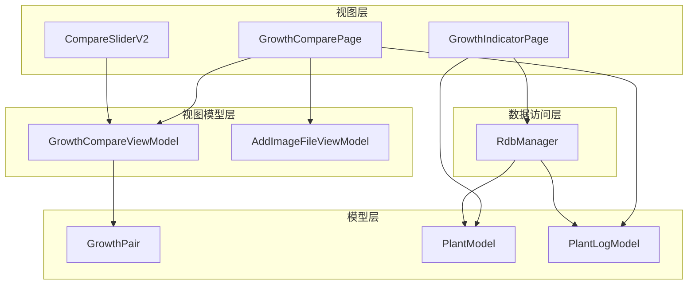
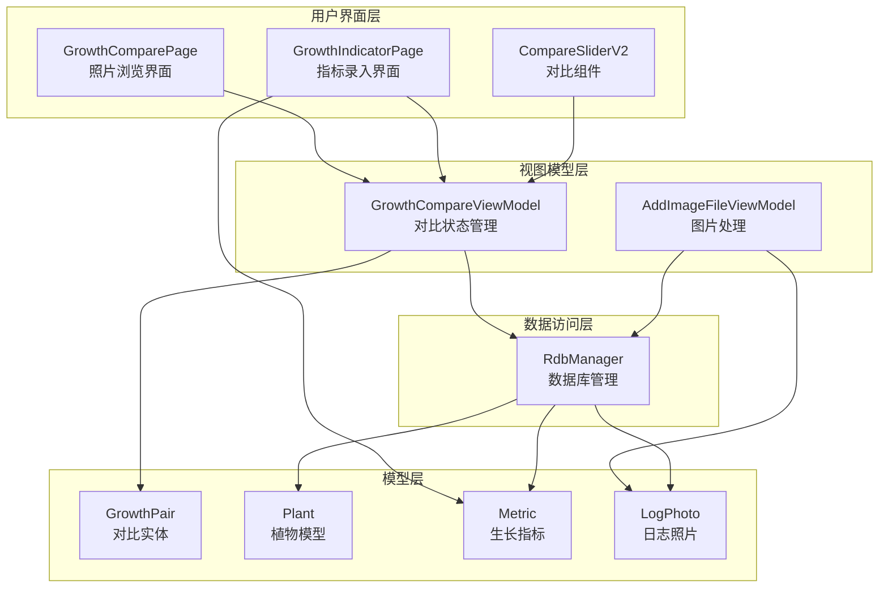
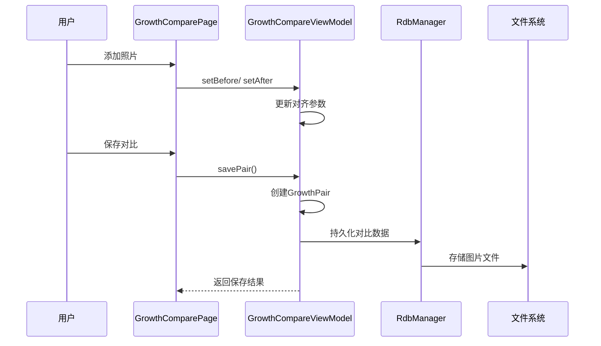
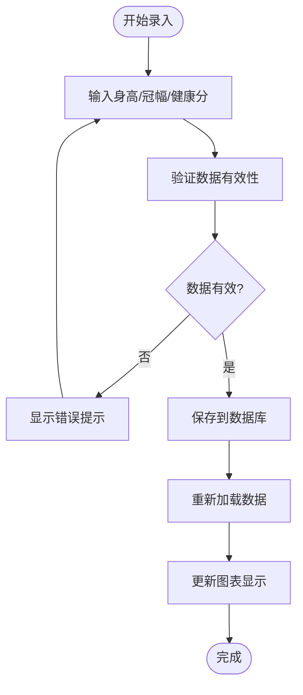
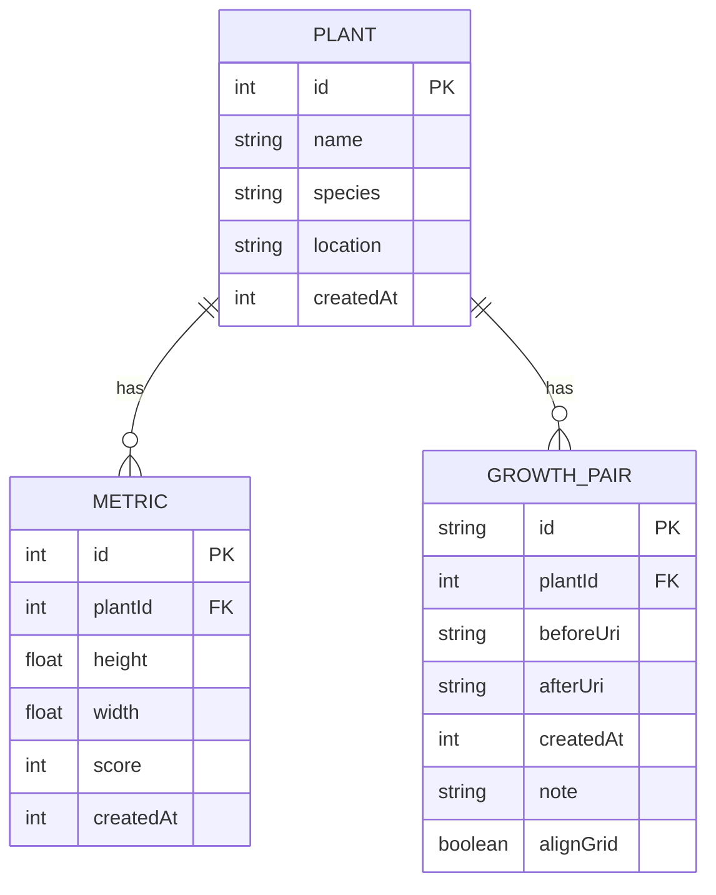
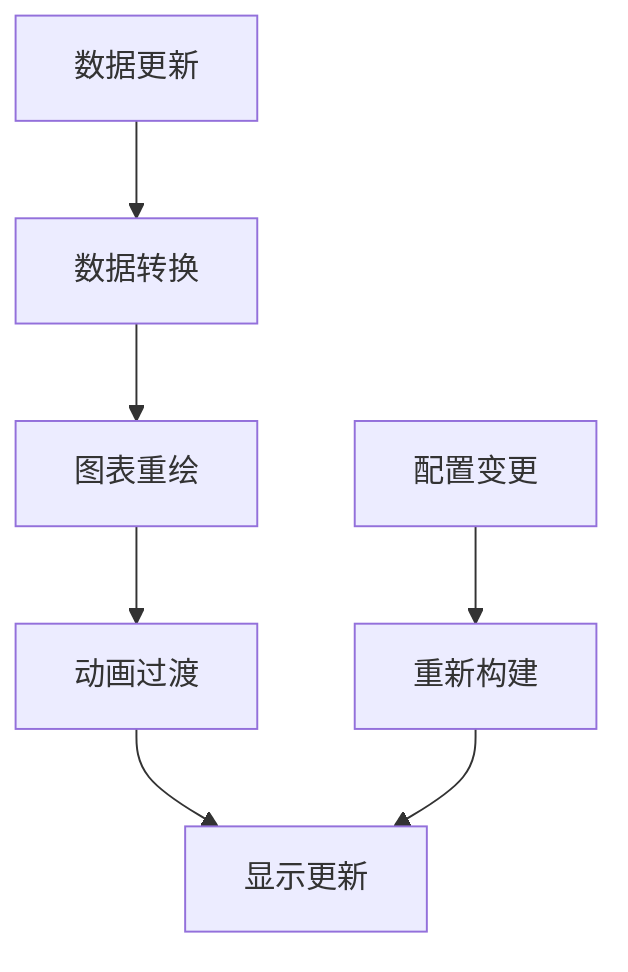
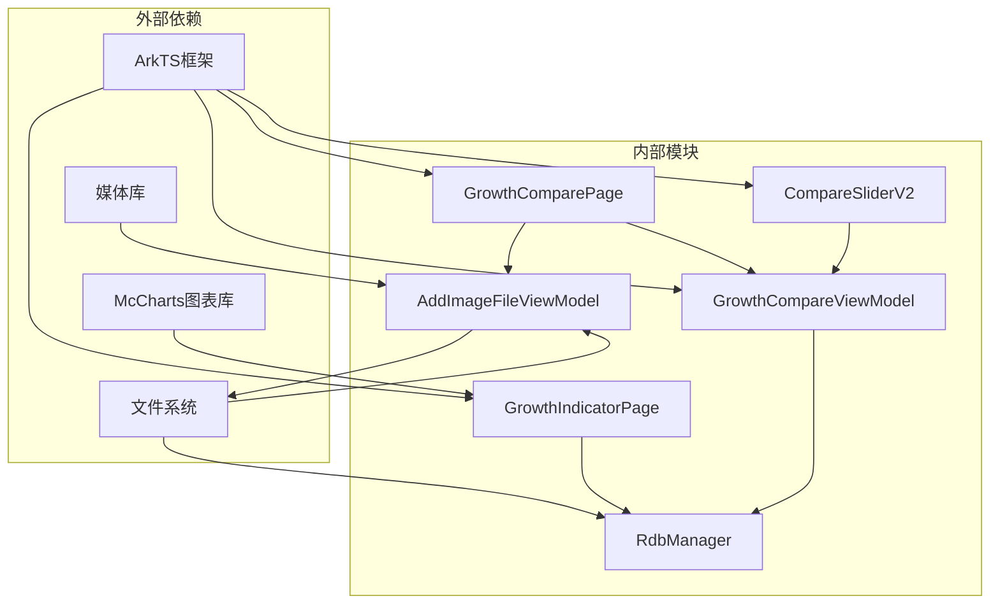
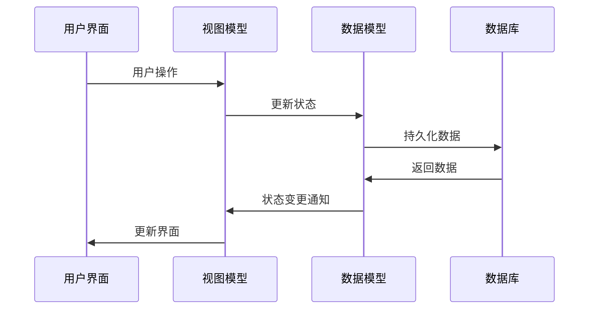

# 生长对比ViewModel

<cite>
**本文档引用的文件**
- [GrowthCompareViewModel.ets](file://entry/src/main/ets/viewmodel/GrowthCompareViewModel.ets)
- [GrowthPair.ets](file://entry/src/main/ets/model/GrowthPair.ets)
- [GrowthComparePage.ets](file://entry/src/main/ets/pages/GrowthComparePage.ets)
- [CompareSliderV2.ets](file://entry/src/main/ets/pages/CompareSliderV2.ets)
- [GrowthIndicatorPage.ets](file://entry/src/main/ets/pages/GrowthIndicatorPage.ets)
- [PlantModel.ets](file://entry/src/main/ets/model/PlantModel.ets)
- [PlantLogModel.ets](file://entry/src/main/ets/model/PlantLogModel.ets)
- [RdbManager.ets](file://entry/src/main/ets/viewmodel/RdbManager.ets)
- [AddImageFileViewModel.ets](file://entry/src/main/ets/viewmodel/AddImageFileViewModel.ets)
</cite>

## 目录
1. [简介](#简介)
2. [项目结构](#项目结构)
3. [核心组件](#核心组件)
4. [架构概览](#架构概览)
5. [详细组件分析](#详细组件分析)
6. [依赖关系分析](#依赖关系分析)
7. [性能考虑](#性能考虑)
8. [故障排除指南](#故障排除指南)
9. [结论](#结论)
10. [附录](#附录)

## 简介

生长对比ViewModel是植物日记应用中用于植物生长指标对比分析的核心组件。该系统实现了植物生长数据的收集、处理、分析和可视化展示功能，为用户提供科学的植物生长管理决策支持。

本系统主要包含三个核心功能模块：
- **生长指标对比分析**：通过前后对比的方式分析植物的生长变化
- **多植物间生长趋势对比**：支持同种植物或不同植物的生长趋势对比
- **生长速度评估和预测**：基于历史数据计算生长速度并进行趋势预测

## 项目结构

植物日记应用采用基于功能模块的组织方式，生长对比功能分布在以下关键目录中：



**图表来源**
- [GrowthComparePage.ets:1-477](file://entry/src/main/ets/pages/GrowthComparePage.ets#L1-L477)
- [GrowthCompareViewModel.ets:1-109](file://entry/src/main/ets/viewmodel/GrowthCompareViewModel.ets#L1-L109)
- [CompareSliderV2.ets:1-448](file://entry/src/main/ets/pages/CompareSliderV2.ets#L1-L448)

**章节来源**
- [GrowthComparePage.ets:1-477](file://entry/src/main/ets/pages/GrowthComparePage.ets#L1-L477)
- [GrowthCompareViewModel.ets:1-109](file://entry/src/main/ets/viewmodel/GrowthCompareViewModel.ets#L1-L109)
- [CompareSliderV2.ets:1-448](file://entry/src/main/ets/pages/CompareSliderV2.ets#L1-L448)

## 核心组件

### 生长对比ViewModel (GrowthCompareViewModel)

GrowthCompareViewModel是生长对比功能的核心控制器，负责管理植物生长对比的状态和操作。

**主要特性：**
- **可观测状态管理**：使用@ObservedV2装饰器实现响应式状态更新
- **前后对比控制**：管理before和after图片的设置和切换
- **对齐参数控制**：提供分割比例、缩放、平移等对齐功能
- **网格辅助功能**：支持网格显示辅助对齐
- **保存机制**：将对比结果保存为GrowthPair实体

**关键属性：**
- `plantId`: 植物ID
- `beforeUri/afterUri`: 前后图片URI
- `split`: 分割比例 (0.02-0.98)
- `zoom`: 缩放比例 (0.5-4.0)
- `offsetX/offsetY`: 平移偏移量
- `showGrid`: 网格显示开关
- `alignMode`: 对齐模式开关
- `pairs`: 已保存的对比对数组

**章节来源**
- [GrowthCompareViewModel.ets:12-109](file://entry/src/main/ets/viewmodel/GrowthCompareViewModel.ets#L12-L109)

### 生长对实体 (GrowthPair)

GrowthPair是生长对比的持久化实体，用于存储单次对比的结果。

**核心字段：**
- `id`: 对比对唯一标识
- `plantId`: 关联植物ID
- `beforeUri/afterUri`: 前后图片URI
- `createdAt`: 创建时间戳
- `note`: 备注信息
- `alignGrid`: 对齐网格状态

**章节来源**
- [GrowthPair.ets:4-22](file://entry/src/main/ets/model/GrowthPair.ets#L4-L22)

### 生长对比页面 (GrowthComparePage)

GrowthComparePage提供用户界面，支持植物照片的时间序列浏览和对比功能。

**主要功能：**
- **照片时间线浏览**：按时间顺序展示植物成长照片
- **滑动对比**：支持滑动查看不同时间点的照片
- **全貌网格**：显示所有可用照片的缩略图
- **时间跨度显示**：显示最早和最新照片的时间信息
- **照片添加**：通过AddImageFileViewModel添加新照片

**章节来源**
- [GrowthComparePage.ets:24-477](file://entry/src/main/ets/pages/GrowthComparePage.ets#L24-L477)

### 对比滑块组件 (CompareSliderV2)

CompareSliderV2是一个功能丰富的图片对比组件，支持多种对比模式。

**支持的对比模式：**
- **分割模式 (SPLIT)**：通过垂直分割线分隔两张图片
- **滑动模式 (SWIPE)**：通过左右滑动切换图片
- **淡入淡出模式 (FADE)**：通过透明度渐变过渡

**交互功能：**
- **手势支持**：拖杆拖动、双指缩放、对齐平移
- **网格叠加**：可选的九宫格辅助对齐
- **精确滑杆**：同步分割比例的精确控制

**章节来源**
- [CompareSliderV2.ets:50-448](file://entry/src/main/ets/pages/CompareSliderV2.ets#L50-L448)

## 架构概览

生长对比系统采用MVVM架构模式，实现了清晰的关注点分离：



**图表来源**
- [GrowthComparePage.ets:10-60](file://entry/src/main/ets/pages/GrowthComparePage.ets#L10-L60)
- [GrowthCompareViewModel.ets:12-31](file://entry/src/main/ets/viewmodel/GrowthCompareViewModel.ets#L12-L31)
- [RdbManager.ets:4-296](file://entry/src/main/ets/viewmodel/RdbManager.ets#L4-L296)

## 详细组件分析

### 生长指标收集和处理流程

系统通过两种主要方式收集植物生长指标：

#### 1. 照片时间序列对比


**图表来源**
- [GrowthComparePage.ets:377-400](file://entry/src/main/ets/pages/GrowthComparePage.ets#L377-L400)
- [GrowthCompareViewModel.ets:94-107](file://entry/src/main/ets/viewmodel/GrowthCompareViewModel.ets#L94-L107)

#### 2. 数值指标录入


**图表来源**
- [GrowthIndicatorPage.ets:423-445](file://entry/src/main/ets/pages/GrowthIndicatorPage.ets#L423-L445)

**章节来源**
- [GrowthComparePage.ets:354-477](file://entry/src/main/ets/pages/GrowthComparePage.ets#L354-L477)
- [GrowthIndicatorPage.ets:401-455](file://entry/src/main/ets/pages/GrowthIndicatorPage.ets#L401-L455)

### 多植物间生长趋势对比算法

系统支持多植物间的生长趋势对比，主要通过以下步骤实现：

#### 1. 数据聚合


**图表来源**
- [PlantModel.ets:109-147](file://entry/src/main/ets/model/PlantModel.ets#L109-L147)
- [RdbManager.ets:64-87](file://entry/src/main/ets/viewmodel/RdbManager.ets#L64-L87)

#### 2. 趋势分析算法
系统采用以下算法进行趋势分析：

**生长速度计算：**
- 瞬时生长速度 = (当前值 - 前一个值) / 时间间隔
- 平均生长速度 = 总增长量 / 总时间
- 加权平均速度 = Σ(各阶段速度 × 阶段时间) / 总时间

**趋势判断：**
- 稳定增长：连续多个时间点呈正增长且幅度稳定
- 加速增长：增长幅度逐期递增
- 减缓增长：增长幅度逐期递减
- 健康状态：基于健康评分的综合评估

**章节来源**
- [PlantModel.ets:109-147](file://entry/src/main/ets/model/PlantModel.ets#L109-L147)
- [GrowthIndicatorPage.ets:458-484](file://entry/src/main/ets/pages/GrowthIndicatorPage.ets#L458-L484)

### 生长速度评估和预测模型

#### 1. 速度评估模型
系统实现了一套多层次的速度评估体系：

**基础速度指标：**
- 日增长率：(当日指标 - 昨日指标) / 1天
- 周增长率：(本周指标 - 上周指标) / 7天
- 月增长率：(本月指标 - 上月指标) / 30天

**复合速度指标：**
- 移动平均：N日移动平均增长率
- 指数平滑：α权重的指数平滑增长率
- 回归分析：线性回归的斜率作为长期趋势

#### 2. 预测模型
采用时间序列预测方法：

**线性预测：**
```
预测值 = 当前值 + 斜率 × 预测间隔
```

**多项式预测：**
```
预测值 = a×t² + b×t + c
```

**指数预测：**
```
预测值 = a × b^t
```

**章节来源**
- [GrowthIndicatorPage.ets:486-530](file://entry/src/main/ets/pages/GrowthIndicatorPage.ets#L486-L530)
- [GrowthIndicatorPage.ets:595-603](file://entry/src/main/ets/pages/GrowthIndicatorPage.ets#L595-L603)

### 生长数据统计分析功能

系统提供了全面的统计分析功能：

#### 1. 基础统计指标
- **集中趋势**：平均值、中位数、众数
- **离散程度**：方差、标准差、变异系数
- **分布特征**：偏度、峰度、四分位距

#### 2. 趋势统计分析
- **相关性分析**：身高与冠幅的相关系数
- **回归分析**：建立指标间的回归模型
- **异常检测**：基于3σ原则的异常值识别

#### 3. 统计图表
- **箱线图**：显示数据分布和异常值
- **散点图**：显示指标间的关系
- **直方图**：显示数据频率分布

**章节来源**
- [GrowthIndicatorPage.ets:129-192](file://entry/src/main/ets/pages/GrowthIndicatorPage.ets#L129-L192)
- [GrowthIndicatorPage.ets:532-593](file://entry/src/main/ets/pages/GrowthIndicatorPage.ets#L532-L593)

### 生长对比图表生成逻辑

#### 1. 图表类型选择
系统支持多种图表类型以适应不同的分析需求：

**折线图**：展示时间序列趋势
**柱状图**：比较不同时间点的数值
**散点图**：分析指标间的关系
**面积图**：显示累积效果

#### 2. 交互功能实现
- **缩放功能**：支持X轴和Y轴的独立缩放
- **平移功能**：支持时间范围的平移浏览
- **标记功能**：标注重要节点和转折点
- **工具提示**：显示详细的数值信息

#### 3. 动态更新机制


**图表来源**
- [GrowthIndicatorPage.ets:381-398](file://entry/src/main/ets/pages/GrowthIndicatorPage.ets#L381-L398)
- [GrowthIndicatorPage.ets:458-467](file://entry/src/main/ets/pages/GrowthIndicatorPage.ets#L458-L467)

**章节来源**
- [GrowthIndicatorPage.ets:388-398](file://entry/src/main/ets/pages/GrowthIndicatorPage.ets#L388-L398)
- [GrowthIndicatorPage.ets:458-467](file://entry/src/main/ets/pages/GrowthIndicatorPage.ets#L458-L467)

## 依赖关系分析

### 组件依赖关系



**图表来源**
- [GrowthCompareViewModel.ets:1-10](file://entry/src/main/ets/viewmodel/GrowthCompareViewModel.ets#L1-L10)
- [GrowthComparePage.ets:1-9](file://entry/src/main/ets/pages/GrowthComparePage.ets#L1-L9)
- [GrowthIndicatorPage.ets:4](file://entry/src/main/ets/pages/GrowthIndicatorPage.ets#L4)

### 数据流依赖

系统采用双向数据绑定确保数据一致性：



**图表来源**
- [GrowthCompareViewModel.ets:12-27](file://entry/src/main/ets/viewmodel/GrowthCompareViewModel.ets#L12-L27)
- [GrowthComparePage.ets:21-60](file://entry/src/main/ets/pages/GrowthComparePage.ets#L21-L60)

**章节来源**
- [GrowthCompareViewModel.ets:12-27](file://entry/src/main/ets/viewmodel/GrowthCompareViewModel.ets#L12-L27)
- [GrowthComparePage.ets:21-60](file://entry/src/main/ets/pages/GrowthComparePage.ets#L21-L60)

## 性能考虑

### 1. 内存优化策略
- **懒加载机制**：图片资源按需加载，避免内存占用过高
- **对象池管理**：复用GrowthPair对象，减少垃圾回收压力
- **数据分页**：大量历史数据采用分页加载策略

### 2. 渲染性能优化
- **虚拟滚动**：长列表采用虚拟滚动技术
- **增量更新**：图表只更新变化的部分
- **防抖处理**：高频操作进行防抖处理

### 3. 数据库性能优化
- **索引优化**：为常用查询字段建立合适索引
- **事务处理**：批量操作使用事务提高效率
- **连接池管理**：合理管理数据库连接

## 故障排除指南

### 常见问题及解决方案

#### 1. 图片加载失败
**症状**：对比图片无法显示
**原因**：文件路径错误或权限问题
**解决**：
- 检查文件路径格式
- 验证应用权限
- 确认文件存在性

#### 2. 数据同步异常
**症状**：界面显示与数据库不一致
**原因**：状态管理错误或异步操作竞态
**解决**：
- 检查@ObservedV2装饰器使用
- 确保异步操作的正确顺序
- 验证数据持久化流程

#### 3. 图表渲染问题
**症状**：图表显示异常或崩溃
**原因**：数据格式错误或内存不足
**解决**：
- 验证数据格式和范围
- 检查内存使用情况
- 优化数据量大小

**章节来源**
- [GrowthComparePage.ets:377-400](file://entry/src/main/ets/pages/GrowthComparePage.ets#L377-L400)
- [GrowthCompareViewModel.ets:94-107](file://entry/src/main/ets/viewmodel/GrowthCompareViewModel.ets#L94-L107)

## 结论

生长对比ViewModel为植物日记应用提供了完整的植物生长管理解决方案。通过科学的数据收集、处理和分析方法，系统能够帮助用户更好地理解和管理植物的生长状况。

**主要优势：**
- **直观的可视化**：通过多种图表类型直观展示生长趋势
- **科学的分析方法**：基于统计学原理的分析算法
- **灵活的交互设计**：支持多种对比模式和交互方式
- **完整的数据管理**：从数据收集到分析展示的完整流程

**应用场景：**
- 植物生长监测和管理
- 多植物对比分析
- 生长趋势预测和决策支持
- 植物健康状况评估

## 附录

### 使用指南

#### 1. 添加植物照片
1. 在植物详情页面点击"添加照片"
2. 从相册选择前后对比的照片
3. 使用网格辅助进行精确对齐
4. 调整分割比例和缩放参数
5. 保存对比结果

#### 2. 录入生长指标
1. 进入"生长指标"页面
2. 输入身高、冠幅、健康分数据
3. 设置测量日期
4. 查看历史记录和趋势图表

#### 3. 分析生长趋势
1. 在图表页面选择分析维度
2. 查看不同指标的趋势变化
3. 分析多植物间的差异
4. 基于趋势进行养护决策

### 最佳实践

#### 1. 数据收集建议
- 定期、定时地收集植物数据
- 保持测量条件的一致性
- 记录影响植物生长的重要环境因素

#### 2. 分析方法建议
- 结合多种指标进行综合分析
- 关注长期趋势而非短期波动
- 将分析结果与养护实践相结合

#### 3. 系统使用建议
- 定期备份植物数据
- 及时更新植物信息
- 利用历史数据指导未来的养护决策