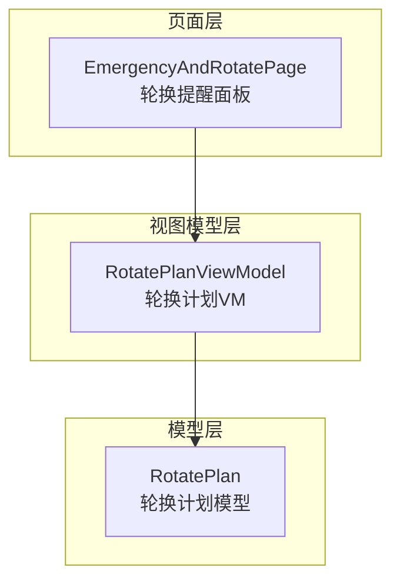
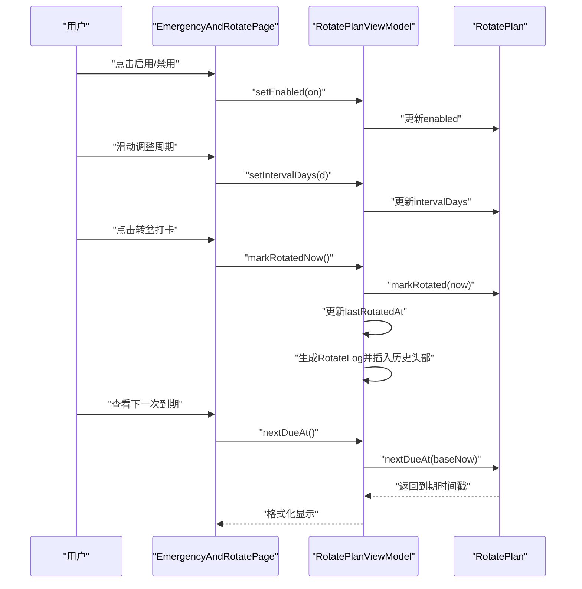
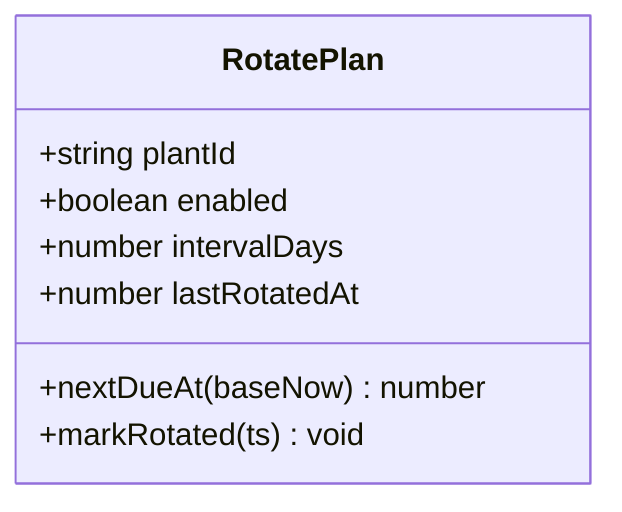
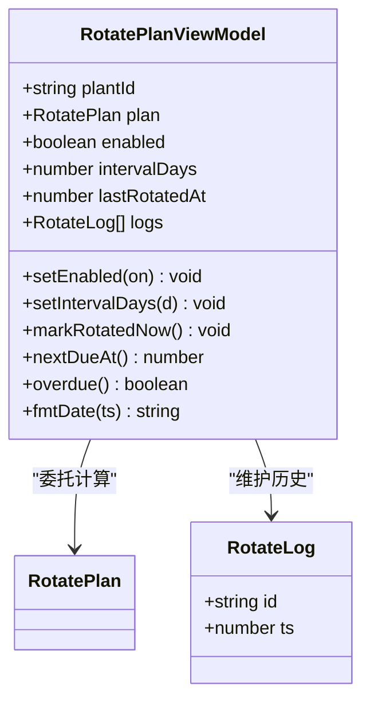
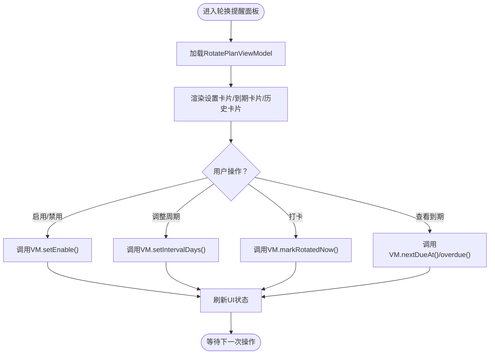
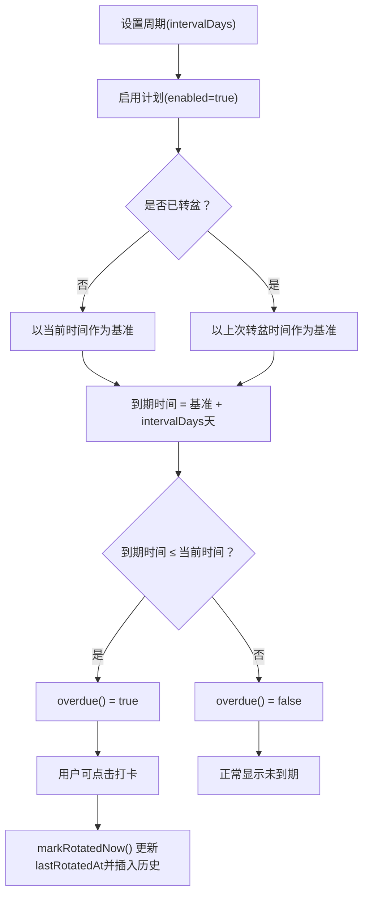
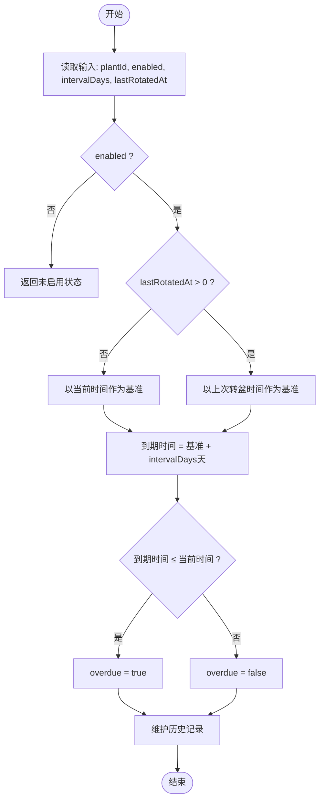
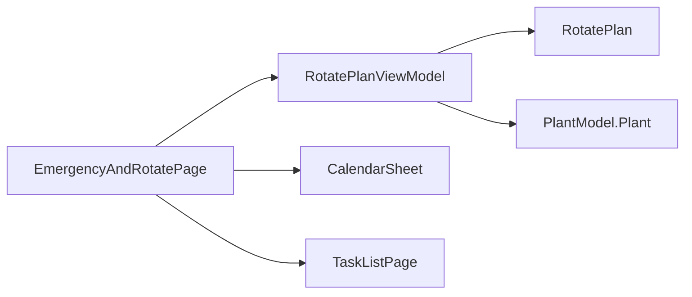

# 轮换计划ViewModel

<cite>
**本文档引用的文件**
- [RotatePlanViewModel.ets](file://entry/src/main/ets/viewmodel/RotatePlanViewModel.ets)
- [RotatePlan.ets](file://entry/src/main/ets/model/RotatePlan.ets)
- [EmergencyAndRotatePage.ets](file://entry/src/main/ets/pages/EmergencyAndRotatePage.ets)
- [PlantModel.ets](file://entry/src/main/ets/model/PlantModel.ets)
- [WateringViewModel.ets](file://entry/src/main/ets/viewmodel/WateringViewModel.ets)
- [GrowthCompareViewModel.ets](file://entry/src/main/ets/viewmodel/GrowthCompareViewModel.ets)
- [CalendarSheet.ets](file://entry/src/main/ets/pages/CalendarSheet.ets)
- [TaskListPage.ets](file://entry/src/main/ets/pages/TaskListPage.ets)
</cite>

## 目录
1. [简介](#简介)
2. [项目结构](#项目结构)
3. [核心组件](#核心组件)
4. [架构总览](#架构总览)
5. [详细组件分析](#详细组件分析)
6. [依赖关系分析](#依赖关系分析)
7. [性能考虑](#性能考虑)
8. [故障排除指南](#故障排除指南)
9. [结论](#结论)
10. [附录](#附录)

## 简介
本文件聚焦于轮换计划ViewModel（RotatePlanViewModel）及其配套模型（RotatePlan），系统性阐述植物轮换管理的重要性、实施策略、周期设定与执行机制、不同植物种类的轮换需求与注意事项、轮换对植物健康与生长的影响分析、轮换计划的制定算法与自动化执行逻辑，以及轮换历史记录与效果评估功能。文档同时提供面向用户的科学轮换管理方案与操作指南，帮助用户建立可持续的植物轮换体系。

## 项目结构
轮换计划功能位于应用的主模块中，采用MVVM架构组织：
- Model层：RotatePlan（内存版计划模型）
- ViewModel层：RotatePlanViewModel（页面绑定的可观察视图模型）
- Page层：EmergencyAndRotatePage（轮换提醒面板所在页面）

图表来源
- [EmergencyAndRotatePage.ets:360-557](file://entry/src/main/ets/pages/EmergencyAndRotatePage.ets#L360-L557)
- [RotatePlanViewModel.ets:18-88](file://entry/src/main/ets/viewmodel/RotatePlanViewModel.ets#L18-L88)
- [RotatePlan.ets:4-25](file://entry/src/main/ets/model/RotatePlan.ets#L4-L25)

章节来源
- [EmergencyAndRotatePage.ets:1-557](file://entry/src/main/ets/pages/EmergencyAndRotatePage.ets#L1-L557)
- [RotatePlanViewModel.ets:1-88](file://entry/src/main/ets/viewmodel/RotatePlanViewModel.ets#L1-L88)
- [RotatePlan.ets:1-25](file://entry/src/main/ets/model/RotatePlan.ets#L1-L25)

## 核心组件
- RotatePlan（模型）：封装轮换计划的核心状态与计算逻辑，包括启用状态、周期天数、最近转盆时间戳，以及到期时间计算与打卡记录更新。
- RotatePlanViewModel（视图模型）：向页面暴露扁平化的可观察字段，负责与底层模型同步、设置周期、打卡记录、到期判断、格式化时间等。
- EmergencyAndRotatePage（页面）：承载轮换提醒面板，提供启用/禁用计划、调整周期、打卡、查看到期与历史记录等功能。

章节来源
- [RotatePlan.ets:4-25](file://entry/src/main/ets/model/RotatePlan.ets#L4-L25)
- [RotatePlanViewModel.ets:18-88](file://entry/src/main/ets/viewmodel/RotatePlanViewModel.ets#L18-L88)
- [EmergencyAndRotatePage.ets:360-557](file://entry/src/main/ets/pages/EmergencyAndRotatePage.ets#L360-L557)

## 架构总览
轮换计划的控制流如下：
- 页面初始化时创建VM实例并绑定植物ID
- VM从底层模型同步状态（启用、周期、最近转盆时间）
- 用户通过页面操作设置周期、启用/禁用计划、打卡
- VM调用模型进行到期时间计算与状态更新
- VM维护历史记录数组，每次打卡插入到头部
- 页面根据VM提供的到期状态与格式化时间展示提醒

图表来源
- [EmergencyAndRotatePage.ets:369-501](file://entry/src/main/ets/pages/EmergencyAndRotatePage.ets#L369-L501)
- [RotatePlanViewModel.ets:40-72](file://entry/src/main/ets/viewmodel/RotatePlanViewModel.ets#L40-L72)
- [RotatePlan.ets:14-23](file://entry/src/main/ets/model/RotatePlan.ets#L14-L23)

## 详细组件分析

### RotatePlan（轮换计划模型）
- 职责：持有计划状态与计算到期时间
- 关键字段：enabled（启用）、intervalDays（周期天数）、lastRotatedAt（最近转盆时间戳）
- 关键方法：
  - nextDueAt(baseNow)：基于最近转盆时间或当前时间计算下一次到期时间
  - markRotated(ts)：更新最近转盆时间为当前时间戳

图表来源
- [RotatePlan.ets:4-25](file://entry/src/main/ets/model/RotatePlan.ets#L4-L25)

章节来源
- [RotatePlan.ets:4-25](file://entry/src/main/ets/model/RotatePlan.ets#L4-L25)

### RotatePlanViewModel（轮换计划视图模型）
- 职责：页面绑定的可观察VM，负责与模型同步、设置周期、打卡、到期判断、历史记录维护与时间格式化
- 关键字段：plantId、plan（底层模型）、enabled、intervalDays、lastRotatedAt、logs（历史记录）
- 关键方法：
  - setEnabled/on：启用/禁用计划
  - setIntervalDays：设置周期（带最小/最大约束）
  - markRotatedNow：打卡并更新历史记录
  - nextDueAt：委托模型计算到期时间
  - overdue：判断是否已到期
  - fmtDate：格式化时间

图表来源
- [RotatePlanViewModel.ets:18-88](file://entry/src/main/ets/viewmodel/RotatePlanViewModel.ets#L18-L88)
- [RotatePlan.ets:4-25](file://entry/src/main/ets/model/RotatePlan.ets#L4-L25)

章节来源
- [RotatePlanViewModel.ets:18-88](file://entry/src/main/ets/viewmodel/RotatePlanViewModel.ets#L18-L88)

### EmergencyAndRotatePage（轮换提醒面板）
- 职责：承载轮换提醒面板，提供设置周期、启用/禁用、打卡、查看到期与历史记录
- 关键交互：
  - 设置卡片：启用开关、周期滑条、打卡按钮、上次转盆时间
  - 下一次到期卡片：显示到期时间与状态（未到期/已到期）
  - 转盆历史：展示历史记录列表
- 与VM交互：通过VM的方法进行状态更新与查询

图表来源
- [EmergencyAndRotatePage.ets:369-501](file://entry/src/main/ets/pages/EmergencyAndRotatePage.ets#L369-L501)
- [RotatePlanViewModel.ets:40-72](file://entry/src/main/ets/viewmodel/RotatePlanViewModel.ets#L40-L72)

章节来源
- [EmergencyAndRotatePage.ets:360-557](file://entry/src/main/ets/pages/EmergencyAndRotatePage.ets#L360-L557)

### 轮换周期设定与执行机制
- 周期设定：支持3-60天范围，滑条步进为1天，确保灵活性与实用性
- 执行机制：
  - 到期计算：以最近转盆时间或当前时间作为基准，加上周期天数计算下一次到期
  - 到期判断：enabled为true且到期时间小于等于当前时间即为已到期
  - 打卡更新：每次打卡将当前时间写入lastRotatedAt，并在历史记录头部插入新的RotateLog

图表来源
- [RotatePlan.ets:14-19](file://entry/src/main/ets/model/RotatePlan.ets#L14-L19)
- [RotatePlanViewModel.ets:65-72](file://entry/src/main/ets/viewmodel/RotatePlanViewModel.ets#L65-L72)
- [EmergencyAndRotatePage.ets:398-411](file://entry/src/main/ets/pages/EmerergencyAndRotatePage.ets#L398-L411)

章节来源
- [RotatePlan.ets:14-23](file://entry/src/main/ets/model/RotatePlan.ets#L14-L23)
- [RotatePlanViewModel.ets:45-72](file://entry/src/main/ets/viewmodel/RotatePlanViewModel.ets#L45-L72)
- [EmergencyAndRotatePage.ets:398-411](file://entry/src/main/ets/pages/EmergencyAndRotatePage.ets#L398-L411)

### 不同植物种类的轮换需求与注意事项
- 多肉类：周期可适当缩短，通常14-21天，注意休眠期调整
- 观叶植物：常规14-28天，关注季节变化与光照强度
- 开花植物：花期前后可能需要更频繁轮换，以促进花芽分化
- 热带雨林型：湿度较高时可适当延长周期，避免积水烂根
- 注意事项：
  - 强度光照下的植物可适当缩短周期
  - 高温或低温季节应减少轮换频率
  - 病虫害高发期避免轮换，优先治疗
  - 新购植物建议先稳定两周再纳入轮换计划

### 轮换对植物健康与生长的影响分析
- 促进根系均匀发展：定期改变光照方向，避免根系偏侧生长
- 改善光合作用效率：轮换使叶片受光更均匀，提升叶绿素合成
- 减少病虫害累积：打破病原菌与害虫的生存环境
- 优化养分吸收：避免长期固定位置导致的局部养分失衡
- 提升抗逆性：适度的环境变化有助于植物适应能力增强

### 轮换计划制定算法与自动化执行逻辑
- 算法输入：植物ID、启用状态、周期天数、最近转盆时间
- 算法输出：下一次到期时间、是否到期、历史记录
- 自动化执行：
  - 页面启动时VM从模型同步状态
  - 用户操作触发VM方法，VM更新模型与本地状态
  - 历史记录采用头插法，保证最新记录在前
  - 到期状态通过overdue()统一判定，避免重复计算

图表来源
- [RotatePlan.ets:14-23](file://entry/src/main/ets/model/RotatePlan.ets#L14-L23)
- [RotatePlanViewModel.ets:65-72](file://entry/src/main/ets/viewmodel/RotatePlanViewModel.ets#L65-L72)

章节来源
- [RotatePlan.ets:14-23](file://entry/src/main/ets/model/RotatePlan.ets#L14-L23)
- [RotatePlanViewModel.ets:65-72](file://entry/src/main/ets/viewmodel/RotatePlanViewModel.ets#L65-L72)

### 轮换历史记录与效果评估功能
- 历史记录：每次打卡生成RotateLog（包含唯一ID与时间戳），插入到logs数组头部
- 效果评估：页面提供历史卡片，用户可查看转盆记录；结合其他指标（如生长指标、水记录）进行综合评估
- 与其他功能的协同：
  - 与水记录（WateringViewModel）对比：轮换与浇水频率共同影响植物健康
  - 与生长对比（GrowthCompareViewModel）联动：通过前后对比评估轮换对形态变化的影响
  - 与日程（CalendarSheet、TaskListPage）集成：将轮换纳入整体养护日程

章节来源
- [EmergencyAndRotatePage.ets:503-555](file://entry/src/main/ets/pages/EmergencyAndRotatePage.ets#L503-L555)
- [RotatePlanViewModel.ets:12-16](file://entry/src/main/ets/viewmodel/RotatePlanViewModel.ets#L12-L16)
- [WateringViewModel.ets:44-57](file://entry/src/main/ets/viewmodel/WateringViewModel.ets#L44-L57)
- [GrowthCompareViewModel.ets:94-107](file://entry/src/main/ets/viewmodel/GrowthCompareViewModel.ets#L94-L107)
- [CalendarSheet.ets:1-504](file://entry/src/main/ets/pages/CalendarSheet.ets#L1-L504)
- [TaskListPage.ets:1-463](file://entry/src/main/ets/pages/TaskListPage.ets#L1-L463)

## 依赖关系分析
- 页面依赖VM：EmergencyAndRotatePage通过VM暴露的方法与状态驱动UI
- VM依赖模型：RotatePlanViewModel委托RotatePlan进行到期计算与状态更新
- 模型为纯数据与计算：RotatePlan不依赖页面或VM，便于测试与复用
- 与系统其他功能的耦合：
  - 与PlantModel中的Plant实体配合，通过plantId关联到具体植物
  - 与日程系统（CalendarSheet、TaskListPage）集成，形成完整的养护闭环

图表来源
- [EmergencyAndRotatePage.ets:14-22](file://entry/src/main/ets/pages/EmergencyAndRotatePage.ets#L14-L22)
- [RotatePlanViewModel.ets:20-31](file://entry/src/main/ets/viewmodel/RotatePlanViewModel.ets#L20-L31)
- [PlantModel.ets:7-21](file://entry/src/main/ets/model/PlantModel.ets#L7-L21)

章节来源
- [EmergencyAndRotatePage.ets:14-22](file://entry/src/main/ets/pages/EmergencyAndRotatePage.ets#L14-L22)
- [RotatePlanViewModel.ets:20-31](file://entry/src/main/ets/viewmodel/RotatePlanViewModel.ets#L20-L31)
- [PlantModel.ets:7-21](file://entry/src/main/ets/model/PlantModel.ets#L7-L21)

## 性能考虑
- 计算复杂度：到期计算为O(1)，历史记录头插为O(n)（n为历史数量，通常较小）
- 内存占用：RotateLog数组长度有限，建议在页面销毁或达到阈值时清理
- 渲染优化：VM使用可观察注解，页面按需刷新，避免全量重绘
- 建议：对于大量植物的场景，可考虑将历史记录持久化至数据库，减少内存压力

## 故障排除指南
- 问题：周期设置无效
  - 检查setIntervalDays的边界（3-60天），确认页面滑条值已更新
- 问题：到期状态不正确
  - 确认enabled为true，检查lastRotatedAt是否被正确更新
- 问题：历史记录未显示
  - 确认markRotatedNow()已被调用，logs数组是否为空
- 问题：UI不刷新
  - 确认VM字段使用可观察注解，页面绑定方式正确

章节来源
- [RotatePlanViewModel.ets:45-51](file://entry/src/main/ets/viewmodel/RotatePlanViewModel.ets#L45-L51)
- [RotatePlanViewModel.ets:54-62](file://entry/src/main/ets/viewmodel/RotatePlanViewModel.ets#L54-L62)
- [EmergencyAndRotatePage.ets:398-411](file://entry/src/main/ets/pages/EmergencyAndRotatePage.ets#L398-L411)

## 结论
轮换计划ViewModel通过简洁的模型-视图-页面三层结构，实现了植物轮换管理的核心功能：周期设定、到期计算、打卡记录与历史展示。其设计遵循单一职责与委托原则，易于扩展与维护。结合日程系统与其他养护功能，可构建完整的植物健康管理方案。建议在实际使用中根据植物特性与环境条件动态调整周期，并结合生长指标与水记录进行综合评估。

## 附录
- 操作指南摘要：
  - 启用轮换计划：点击“已启用/未启用”切换
  - 设置周期：拖动滑条设置3-60天
  - 打卡：点击“转盆90°·打卡”，系统记录时间并更新到期
  - 查看待到期：查看“下一次到期”卡片，红色表示已到期
  - 查看历史：在“转盆历史”中查看记录列表
- 科学方案建议：
  - 新手建议从14天开始，逐步调整
  - 高温/低温/强光环境下适当缩短周期
  - 与浇水、施肥、修剪等其他养护措施协调安排
  - 定期评估轮换效果，结合生长指标与照片对比