# 光照数据模型

<cite>
**本文引用的文件**
- [ExposureSession.ets](file://entry/src/main/ets/model/ExposureSession.ets)
- [DailyLightStat.ets](file://entry/src/main/ets/model/DailyLightStat.ets)
- [LightProfile.ets](file://entry/src/main/ets/model/LightProfile.ets)
- [LightTypes.ets](file://entry/src/main/ets/model/LightTypes.ets)
- [LightExposureViewModel.ets](file://entry/src/main/ets/viewmodel/LightExposureViewModel.ets)
- [RdbManager.ets](file://entry/src/main/ets/viewmodel/RdbManager.ets)
- [DbUtils.ets](file://entry/src/main/ets/model/DbUtils.ets)
- [LightExposurePage.ets](file://entry/src/main/ets/pages/LightExposurePage.ets)
</cite>

## 目录
1. [简介](#简介)
2. [项目结构](#项目结构)
3. [核心组件](#核心组件)
4. [架构概览](#架构概览)
5. [详细组件分析](#详细组件分析)
6. [依赖关系分析](#依赖关系分析)
7. [性能考量](#性能考量)
8. [故障排查指南](#故障排查指南)
9. [结论](#结论)
10. [附录](#附录)

## 简介
本文件系统性梳理光照数据模型的设计与实现，围绕以下关键实体展开：
- ExposureSession：手动光照会话记录模型，支持“开始/结束”和“即时补记”两种模式
- DailyLightStat：每日光照汇总统计模型，用于环形进度图与7日条形图
- LightProfile：植物光照偏好与目标配置模型
- LightTypes：光照级别与状态枚举、工具函数（权重、标签、颜色、日期格式化、ID生成）
- LightExposureViewModel：光照记录的视图模型，负责生命周期管理、数据持久化与统计计算
- RdbManager：数据库管理器，负责建表、索引与事务封装
- LightExposurePage：光照记录页面，承载UI交互与数据展示

本文件同时阐述光照类型的枚举设计、状态转换机制、存储格式、时间序列处理与聚合计算方法，并提供API参考与最佳实践。

## 项目结构
光照数据模型位于应用入口的ETS模块中，采用“模型-视图模型-页面”的分层组织：
- model：数据模型与类型定义
- viewmodel：业务逻辑与数据持久化
- pages：页面组件与UI交互

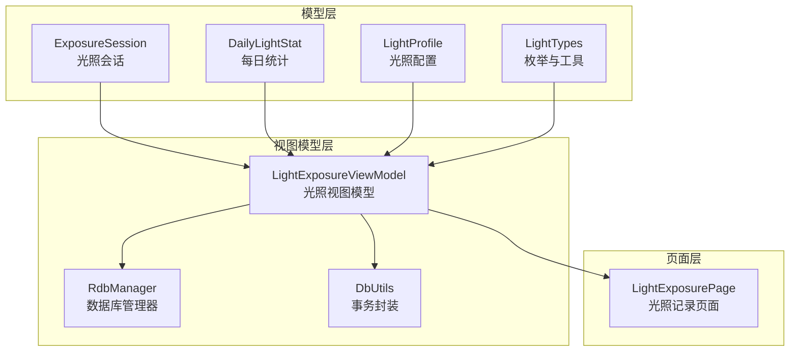

**图表来源**
- [ExposureSession.ets:1-84](file://entry/src/main/ets/model/ExposureSession.ets#L1-L84)
- [DailyLightStat.ets:1-30](file://entry/src/main/ets/model/DailyLightStat.ets#L1-L30)
- [LightProfile.ets:1-41](file://entry/src/main/ets/model/LightProfile.ets#L1-L41)
- [LightTypes.ets:1-124](file://entry/src/main/ets/model/LightTypes.ets#L1-L124)
- [LightExposureViewModel.ets:1-554](file://entry/src/main/ets/viewmodel/LightExposureViewModel.ets#L1-L554)
- [RdbManager.ets:1-296](file://entry/src/main/ets/viewmodel/RdbManager.ets#L1-L296)
- [DbUtils.ets:1-22](file://entry/src/main/ets/model/DbUtils.ets#L1-L22)
- [LightExposurePage.ets:1-806](file://entry/src/main/ets/pages/LightExposurePage.ets#L1-L806)

**章节来源**
- [LightExposureViewModel.ets:1-554](file://entry/src/main/ets/viewmodel/LightExposureViewModel.ets#L1-L554)
- [RdbManager.ets:105-129](file://entry/src/main/ets/viewmodel/RdbManager.ets#L105-L129)

## 核心组件
- ExposureSession：记录一次完整的光照过程，包含开始/结束时间、时长、光照级别、等效光照量（lux-min）与备注等字段，支持两种创建方式：开始/结束模式与即时补记模式
- DailyLightStat：记录植物每日的光照汇总，包括累积光照量、总时长、达标率与状态（不足/适中/过强）
- LightProfile：记录植物的光照偏好与目标范围，包含目标下限/上限、偏好级别与更新时间
- LightTypes：定义光照级别（LOW/MID/HIGH）与状态（INSUFF/OK/STRONG），提供标签、颜色、权重、日期格式化与ID生成等工具函数

**章节来源**
- [ExposureSession.ets:14-84](file://entry/src/main/ets/model/ExposureSession.ets#L14-L84)
- [DailyLightStat.ets:11-30](file://entry/src/main/ets/model/DailyLightStat.ets#L11-L30)
- [LightProfile.ets:11-41](file://entry/src/main/ets/model/LightProfile.ets#L11-L41)
- [LightTypes.ets:9-70](file://entry/src/main/ets/model/LightTypes.ets#L9-L70)

## 架构概览
光照数据模型遵循MVVM架构，页面仅负责展示与交互，业务逻辑集中在视图模型中，数据持久化通过数据库管理器统一处理。

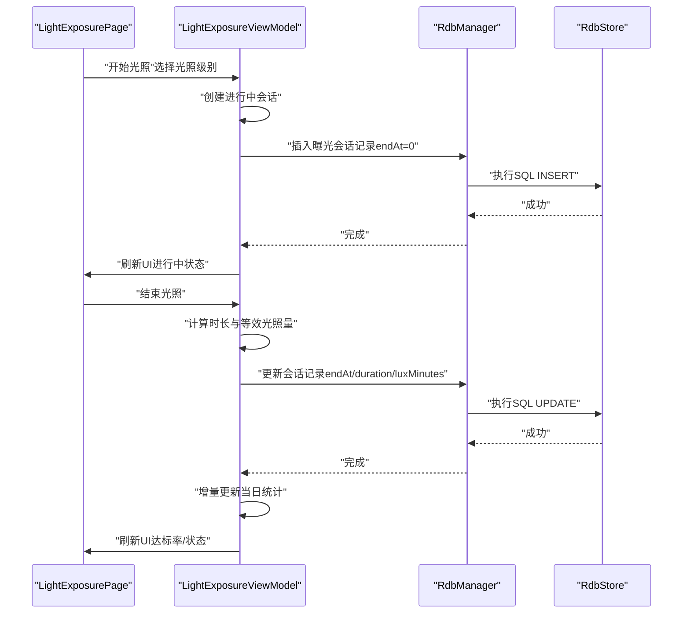

**图表来源**
- [LightExposurePage.ets:458-481](file://entry/src/main/ets/pages/LightExposurePage.ets#L458-L481)
- [LightExposureViewModel.ets:129-192](file://entry/src/main/ets/viewmodel/LightExposureViewModel.ets#L129-L192)
- [RdbManager.ets:108-129](file://entry/src/main/ets/viewmodel/RdbManager.ets#L108-L129)

## 详细组件分析

### ExposureSession（光照会话）
- 设计理念
  - 支持两种记录模式：开始/结束模式（用户点击开始/结束按钮）与即时补记模式（用户直接输入时长）
  - 会话唯一标识采用带前缀的ID生成策略，便于追踪与调试
  - 等效光照量（lux-min）= 光照强度 × 时长，强度由光照级别权重决定
- 关键字段
  - id：会话唯一标识
  - plantId：关联植物ID
  - startAt/endAt：开始/结束时间戳（毫秒）
  - durationMin：持续时间（分钟），至少为1分钟
  - source：记录来源（默认手动）
  - level：光照级别（LOW/MID/HIGH）
  - luxMinutes：等效光照量（lux-min）
  - note：用户备注
- 生命周期管理
  - createStarted：创建已开始的会话
  - finishWith：结束会话并计算时长与等效光照量
  - createInstant：创建即时补记会话（反向推导开始时间）

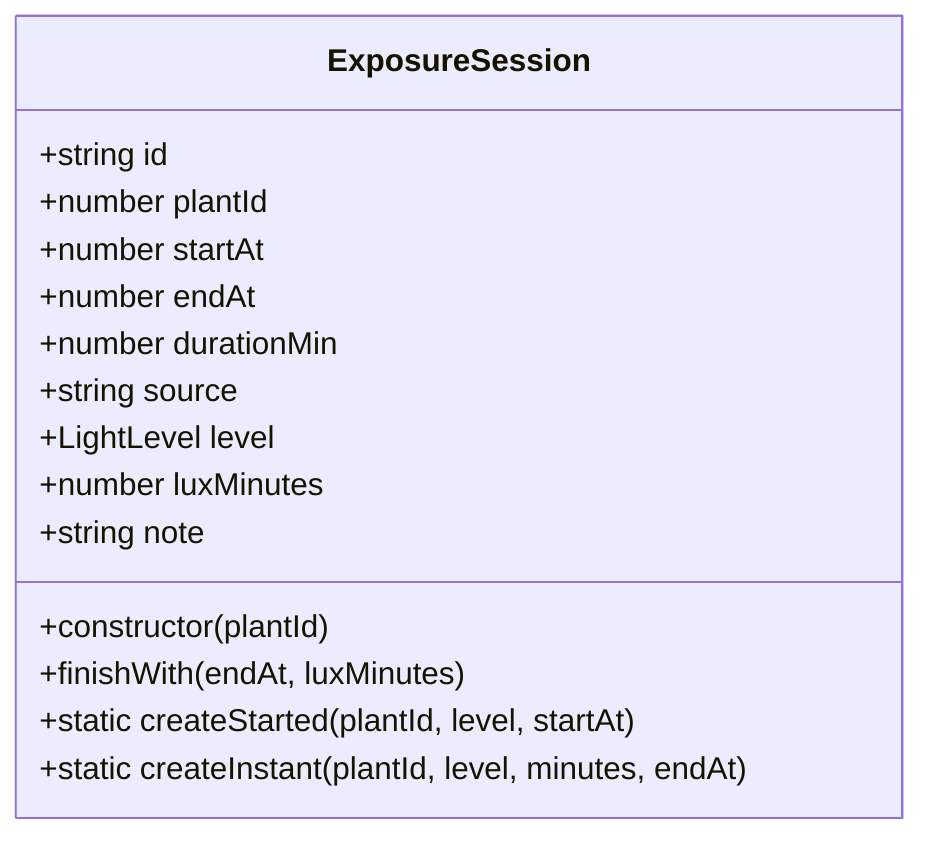

**图表来源**
- [ExposureSession.ets:14-84](file://entry/src/main/ets/model/ExposureSession.ets#L14-L84)

**章节来源**
- [ExposureSession.ets:14-84](file://entry/src/main/ets/model/ExposureSession.ets#L14-L84)

### DailyLightStat（每日光照统计）
- 设计理念
  - 以日期为维度聚合当日光照，支持达标率与状态计算
  - 用于环形进度图与7日条形图的数据源
- 关键字段
  - id：统计记录唯一标识
  - plantId：关联植物ID
  - date：日期（YYYY-MM-DD）
  - luxMinutes：当日累积光照量（lux-min）
  - durationMin：当日总光照时长（分钟）
  - maxLux：最大光照强度（保留字段）
  - rate：达标率（0-1之间）
  - status：光照状态（INSUFF/OK/STRONG）

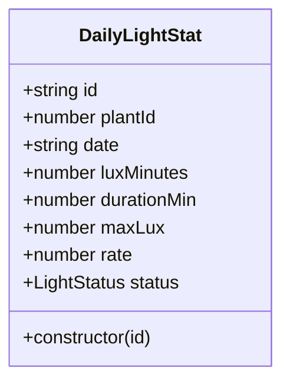

**图表来源**
- [DailyLightStat.ets:11-30](file://entry/src/main/ets/model/DailyLightStat.ets#L11-L30)

**章节来源**
- [DailyLightStat.ets:11-30](file://entry/src/main/ets/model/DailyLightStat.ets#L11-L30)

### LightProfile（光照配置档案）
- 设计理念
  - 每株植物一条配置记录，包含目标范围与偏好级别
  - 默认偏好中光，目标范围可随植物品类微调
- 关键字段
  - plantId：关联植物ID
  - targetLuxMinLow/high：达标下限/上限（lux-min）
  - highLuxThreshold：视为“过强”的阈值（手动近似）
  - preferredLevel：偏好的光照级别
  - updatedAt：更新时间戳

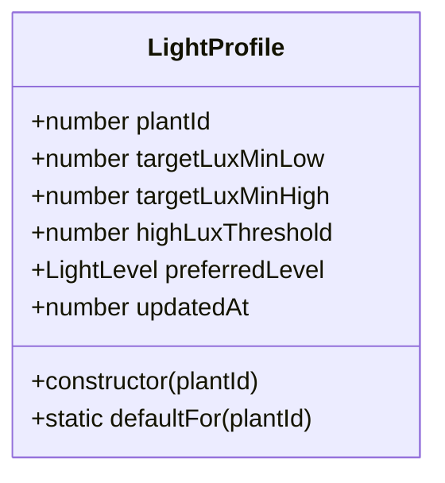

**图表来源**
- [LightProfile.ets:11-41](file://entry/src/main/ets/model/LightProfile.ets#L11-L41)

**章节来源**
- [LightProfile.ets:11-41](file://entry/src/main/ets/model/LightProfile.ets#L11-L41)

### LightTypes（光照类型与工具）
- 光照级别枚举（LightLevel）
  - LOW：弱光（适合耐阴植物）
  - MID：中光（适合大多数室内植物）
  - HIGH：强光（适合喜阳植物）
- 光照状态枚举（LightStatus）
  - INSUFF：日照不足
  - OK：日照适中
  - STRONG：日照过强
- 工具函数
  - lightLevelLabel/statusLabel：中文标签映射
  - statusColor：状态对应颜色
  - levelWeight：光照级别权重（弱光=1.0，中光=1.5，强光=2.0）
  - ymd/hm：日期/时间格式化
  - clampRate：比率限制在0-1
  - genId：生成唯一ID（前缀_时间戳_随机数）

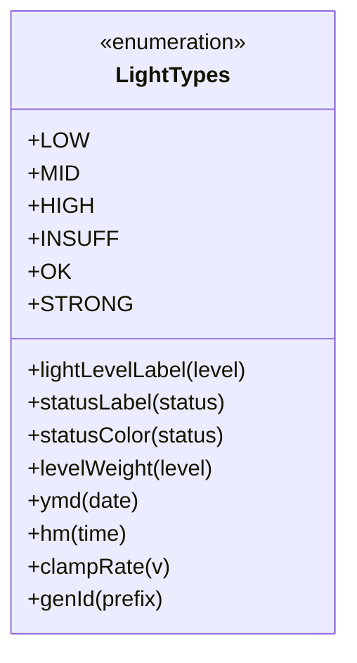

**图表来源**
- [LightTypes.ets:9-124](file://entry/src/main/ets/model/LightTypes.ets#L9-L124)

**章节来源**
- [LightTypes.ets:9-124](file://entry/src/main/ets/model/LightTypes.ets#L9-L124)

### LightExposureViewModel（光照视图模型）
- 职责
  - 管理光照会话、数据持久化与统计计算
  - 维护进行中会话状态与UI刷新
  - 提供实时达标率与状态计算
- 关键流程
  - 初始化：加载光照配置、历史会话与当天统计
  - 开始/结束会话：创建进行中记录、自动计算时长与等效光照量、更新数据库与统计
  - 即时补记：直接插入历史记录，不进入进行中状态
  - 统计计算：重建/增量更新每日统计，计算达标率与状态
  - 偏好更新：自动切换偏好级别并刷新统计
- 性能优化
  - 增量更新：仅更新指定日期的统计，避免全量扫描
  - 事务封装：批量写入使用统一事务，保证一致性

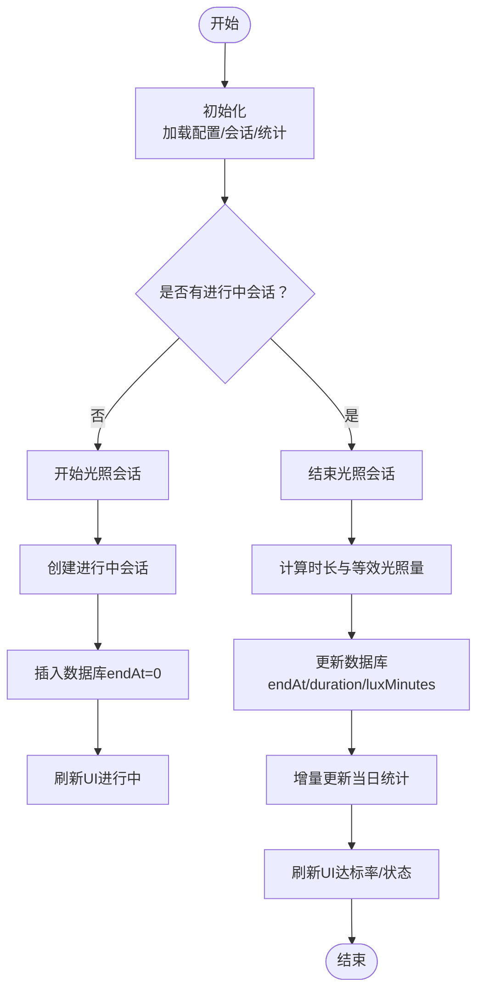

**图表来源**
- [LightExposureViewModel.ets:43-113](file://entry/src/main/ets/viewmodel/LightExposureViewModel.ets#L43-L113)
- [LightExposureViewModel.ets:129-192](file://entry/src/main/ets/viewmodel/LightExposureViewModel.ets#L129-L192)

**章节来源**
- [LightExposureViewModel.ets:17-554](file://entry/src/main/ets/viewmodel/LightExposureViewModel.ets#L17-L554)

### 数据库架构与存储格式
- 表结构
  - light_profile：每株植物一条记录，主键为plantId
  - exposure_session：每条会话一条记录，主键为id；endAt=0表示进行中
- 索引
  - 常用查询：按plantId、日期等维度建立索引，提升查询效率
- 事务封装
  - runInTransaction：确保批量写入要么全部成功、要么全部回滚

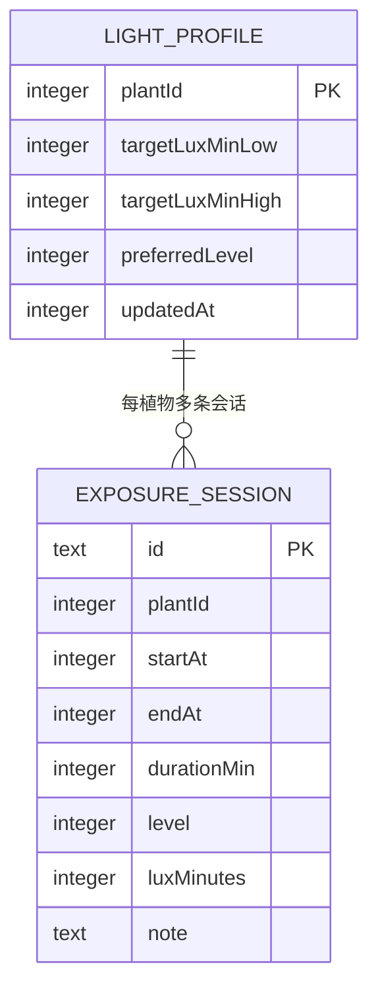

**图表来源**
- [RdbManager.ets:108-129](file://entry/src/main/ets/viewmodel/RdbManager.ets#L108-L129)

**章节来源**
- [RdbManager.ets:105-170](file://entry/src/main/ets/viewmodel/RdbManager.ets#L105-L170)
- [DbUtils.ets:12-22](file://entry/src/main/ets/model/DbUtils.ets#L12-L22)

### 光照类型枚举与状态转换机制
- 光照级别权重
  - 弱光=1.0，中光=1.5，强光=2.0
  - 用于计算等效光照量：lux-min = 分钟 × 基础强度 × 权重
- 状态转换
  - 达标率 rate = luxMinutes / targetLuxMinHigh
  - rate < 0.6 → INSUFF（不足）
  - rate > 1.0 → STRONG（过强）
  - 0.6 ≤ rate ≤ 1.0 → OK（适中）
- 标签与颜色
  - lightLevelLabel/statusLabel：中文标签映射
  - statusColor：状态对应颜色，用于UI渲染

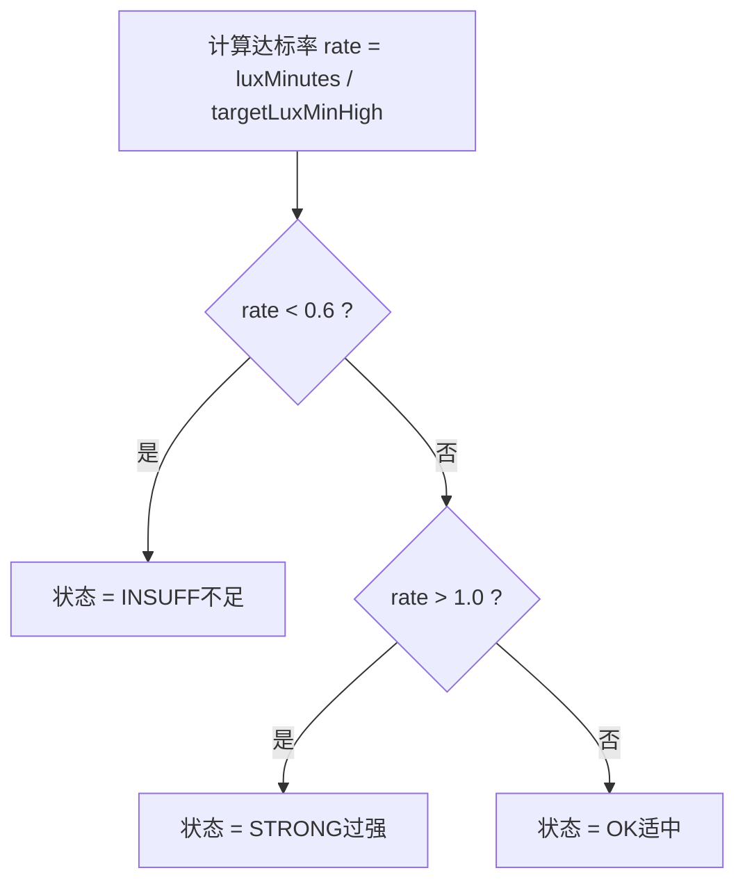

**图表来源**
- [LightExposureViewModel.ets:372-385](file://entry/src/main/ets/viewmodel/LightExposureViewModel.ets#L372-L385)
- [LightTypes.ets:30-56](file://entry/src/main/ets/model/LightTypes.ets#L30-L56)

**章节来源**
- [LightExposureViewModel.ets:287-385](file://entry/src/main/ets/viewmodel/LightExposureViewModel.ets#L287-L385)
- [LightTypes.ets:30-70](file://entry/src/main/ets/model/LightTypes.ets#L30-L70)

### 时间序列处理与聚合计算
- 时间序列
  - 以日期（YYYY-MM-DD）为粒度聚合，支持7日滚动窗口
  - 今日若存在进行中会话，会在图表中临时叠加实时贡献
- 聚合计算
  - 每日累计：luxMinutes与durationMin累加
  - 达标率：clampRate(rate)
  - 状态：基于达标率判定
- 增量更新
  - 结束会话时仅更新当日统计，避免全量重算

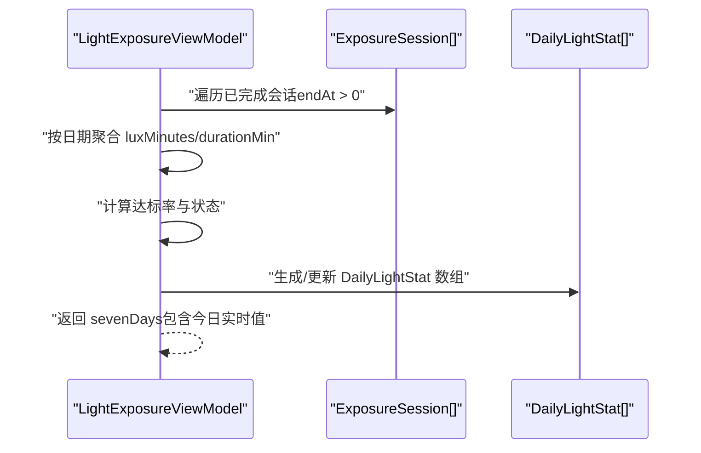

**图表来源**
- [LightExposureViewModel.ets:298-365](file://entry/src/main/ets/viewmodel/LightExposureViewModel.ets#L298-L365)
- [LightExposureViewModel.ets:451-506](file://entry/src/main/ets/viewmodel/LightExposureViewModel.ets#L451-L506)

**章节来源**
- [LightExposureViewModel.ets:298-365](file://entry/src/main/ets/viewmodel/LightExposureViewModel.ets#L298-L365)
- [LightExposureViewModel.ets:451-506](file://entry/src/main/ets/viewmodel/LightExposureViewModel.ets#L451-L506)

### 光照数据的存储格式、时间序列处理与聚合计算方法
- 存储格式
  - 光照配置：light_profile（plantId为主键）
  - 会话记录：exposure_session（id为主键，endAt=0表示进行中）
- 时间序列处理
  - 以日期为键，聚合当日光照量与时长
  - 今日实时值：进行中会话的贡献会临时叠加
- 聚合计算
  - 达标率：clampRate(luxMinutes / targetLuxMinHigh)
  - 状态：依据达标率区间判定
  - 7日窗口：固定取最近7天，今日若进行中则包含实时值

**章节来源**
- [RdbManager.ets:108-129](file://entry/src/main/ets/viewmodel/RdbManager.ets#L108-L129)
- [LightExposureViewModel.ets:334-365](file://entry/src/main/ets/viewmodel/LightExposureViewModel.ets#L334-L365)
- [LightExposureViewModel.ets:451-506](file://entry/src/main/ets/viewmodel/LightExposureViewModel.ets#L451-L506)

### 具体代码示例路径（记录光照数据、计算统计与生成报告）
- 记录光照数据
  - 开始会话：[LightExposureViewModel.startManual:129-156](file://entry/src/main/ets/viewmodel/LightExposureViewModel.ets#L129-L156)
  - 结束会话并自动计算时长与等效光照量：[LightExposureViewModel.endManualWithAutoDuration:162-192](file://entry/src/main/ets/viewmodel/LightExposureViewModel.ets#L162-L192)
  - 即时补记：[LightExposureViewModel.addManualInstant:200-220](file://entry/src/main/ets/viewmodel/LightExposureViewModel.ets#L200-L220)
- 计算光照统计
  - 计算等效光照量：[LightExposureViewModel.computeLuxMinutes:287-291](file://entry/src/main/ets/viewmodel/LightExposureViewModel.ets#L287-L291)
  - 重建每日统计：[LightExposureViewModel.rebuildDailyStats:298-327](file://entry/src/main/ets/viewmodel/LightExposureViewModel.ets#L298-L327)
  - 增量更新某日统计：[LightExposureViewModel.updateDailyStatFor:334-365](file://entry/src/main/ets/viewmodel/LightExposureViewModel.ets#L334-L365)
  - 计算状态与达标率：[LightExposureViewModel.calcStatStatus:372-385](file://entry/src/main/ets/viewmodel/LightExposureViewModel.ets#L372-L385)
- 生成光照报告
  - 今日达标率与状态：[LightExposureViewModel.todayRatePercent:392-416](file://entry/src/main/ets/viewmodel/LightExposureViewModel.ets#L392-L416)、[LightExposureViewModel.todayStatus:423-444](file://entry/src/main/ets/viewmodel/LightExposureViewModel.ets#L423-L444)
  - 7日条形图数据：[LightExposureViewModel.sevenDays:451-506](file://entry/src/main/ets/viewmodel/LightExposureViewModel.ets#L451-L506)
- 光照偏好设置与管理
  - 更新配置并自动切换偏好级别：[LightExposureViewModel.updateProfile:515-552](file://entry/src/main/ets/viewmodel/LightExposureViewModel.ets#L515-L552)
  - 页面交互：[LightExposurePage.ProfileCard:541-603](file://entry/src/main/ets/pages/LightExposurePage.ets#L541-L603)

**章节来源**
- [LightExposureViewModel.ets:129-220](file://entry/src/main/ets/viewmodel/LightExposureViewModel.ets#L129-L220)
- [LightExposureViewModel.ets:287-385](file://entry/src/main/ets/viewmodel/LightExposureViewModel.ets#L287-L385)
- [LightExposureViewModel.ets:392-552](file://entry/src/main/ets/viewmodel/LightExposureViewModel.ets#L392-L552)
- [LightExposurePage.ets:541-603](file://entry/src/main/ets/pages/LightExposurePage.ets#L541-L603)

## 依赖关系分析
- 组件耦合
  - LightExposureViewModel依赖LightTypes、LightProfile、ExposureSession、DailyLightStat与RdbManager
  - 页面仅依赖视图模型，降低耦合度
- 外部依赖
  - ArkTS响应式框架（@ObservedV2/@Trace）
  - ArkData关系型数据库（relationalStore）
  - AppStorage（跨组件状态同步）

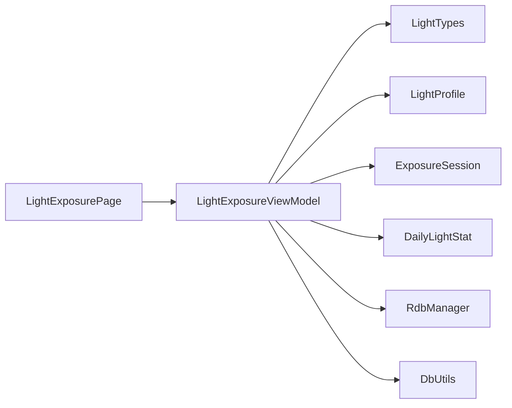

**图表来源**
- [LightExposureViewModel.ets:5-11](file://entry/src/main/ets/viewmodel/LightExposureViewModel.ets#L5-L11)
- [LightExposurePage.ets:5-10](file://entry/src/main/ets/pages/LightExposurePage.ets#L5-L10)

**章节来源**
- [LightExposureViewModel.ets:5-11](file://entry/src/main/ets/viewmodel/LightExposureViewModel.ets#L5-L11)
- [LightExposurePage.ets:5-10](file://entry/src/main/ets/pages/LightExposurePage.ets#L5-L10)

## 性能考量
- 增量更新策略：结束会话时仅更新当日统计，避免全量扫描历史
- 事务封装：批量写入使用runInTransaction，确保一致性与原子性
- 索引优化：为常用查询维度建立索引，减少查询成本
- UI刷新：通过tick驱动响应式更新，控制刷新频率以平衡实时性与性能

[本节为通用性能指导，无需特定文件来源]

## 故障排查指南
- 进行中会话异常
  - 现象：多个进行中会话或异常长时间未结束
  - 处理：视图模型会清理多余进行中会话并强制结束，同时记录警告日志
  - 参考：[LightExposureViewModel.forceCloseAbnormalSession:227-251](file://entry/src/main/ets/viewmodel/LightExposureViewModel.ets#L227-L251)
- 数据库事务失败
  - 现象：批量写入部分成功导致数据不一致
  - 处理：使用runInTransaction封装，捕获异常并回滚
  - 参考：[DbUtils.runInTransaction:12-22](file://entry/src/main/ets/model/DbUtils.ets#L12-L22)
- 统计偏差
  - 现象：达标率或状态与预期不符
  - 处理：检查目标上限与等效光照量计算，必要时重建统计
  - 参考：[LightExposureViewModel.rebuildDailyStats:298-327](file://entry/src/main/ets/viewmodel/LightExposureViewModel.ets#L298-L327)

**章节来源**
- [LightExposureViewModel.ets:90-113](file://entry/src/main/ets/viewmodel/LightExposureViewModel.ets#L90-L113)
- [LightExposureViewModel.ets:227-251](file://entry/src/main/ets/viewmodel/LightExposureViewModel.ets#L227-L251)
- [DbUtils.ets:12-22](file://entry/src/main/ets/model/DbUtils.ets#L12-L22)

## 结论
光照数据模型通过清晰的分层设计与完善的生命周期管理，实现了从会话记录到统计分析的闭环。模型层提供稳定的领域对象，视图模型承担业务逻辑与持久化，页面专注交互展示。通过权重、达标率与状态转换机制，系统能够直观反映植物光照状况，并支持偏好配置与实时更新。数据库层面的事务封装与索引优化进一步保障了数据一致性与查询性能。

[本节为总结性内容，无需特定文件来源]

## 附录

### API参考（方法与属性）
- ExposureSession
  - 构造函数：接收plantId
  - createStarted：创建已开始的会话
  - finishWith：结束会话并计算时长与等效光照量
  - createInstant：创建即时补记会话
  - 字段：id、plantId、startAt、endAt、durationMin、source、level、luxMinutes、note
- DailyLightStat
  - 构造函数：接收id
  - 字段：id、plantId、date、luxMinutes、durationMin、maxLux、rate、status
- LightProfile
  - 构造函数：接收plantId
  - defaultFor：创建默认配置
  - 字段：plantId、targetLuxMinLow、targetLuxMinHigh、highLuxThreshold、preferredLevel、updatedAt
- LightTypes
  - 枚举：LightLevel、LightStatus
  - 工具：lightLevelLabel、statusLabel、statusColor、levelWeight、ymd、hm、clampRate、genId
- LightExposureViewModel
  - 初始化：init
  - 开始/结束/补记：startManual、endManualWithAutoDuration、addManualInstant
  - 删除：deleteSession
  - 统计：computeLuxMinutes、rebuildDailyStats、updateDailyStatFor、calcStatStatus
  - 查询：todayRatePercent、todayStatus、sevenDays
  - 偏好：updateProfile
  - 状态：plantId、profile、sessions、dailyStats、hasActive、activeSession、tick
- RdbManager
  - 初始化：initDb
  - 表：T_LIGHT_PROFILE、T_EXPOSURE_SESSION
  - 查询：getActiveLightSessions
- DbUtils
  - 事务：runInTransaction

**章节来源**
- [ExposureSession.ets:14-84](file://entry/src/main/ets/model/ExposureSession.ets#L14-L84)
- [DailyLightStat.ets:11-30](file://entry/src/main/ets/model/DailyLightStat.ets#L11-L30)
- [LightProfile.ets:11-41](file://entry/src/main/ets/model/LightProfile.ets#L11-L41)
- [LightTypes.ets:9-124](file://entry/src/main/ets/model/LightTypes.ets#L9-L124)
- [LightExposureViewModel.ets:17-554](file://entry/src/main/ets/viewmodel/LightExposureViewModel.ets#L17-L554)
- [RdbManager.ets:4-296](file://entry/src/main/ets/viewmodel/RdbManager.ets#L4-L296)
- [DbUtils.ets:12-22](file://entry/src/main/ets/model/DbUtils.ets#L12-L22)

### 最佳实践指南
- 记录会话
  - 优先使用开始/结束模式，确保时长与等效光照量准确
  - 即时补记仅用于历史记录或刚完成的光照
- 统计与报告
  - 定期检查达标率与状态，及时调整目标范围与偏好级别
  - 7日图表用于趋势观察，今日实时值有助于评估当前状态
- 偏好管理
  - 根据植物特性与季节变化调整目标范围
  - 使用快速调整功能一键切换至推荐偏好级别
- 数据一致性
  - 使用事务封装批量写入，避免部分失败导致的数据不一致
  - 定期重建统计以校正潜在偏差

[本节为通用最佳实践，无需特定文件来源]