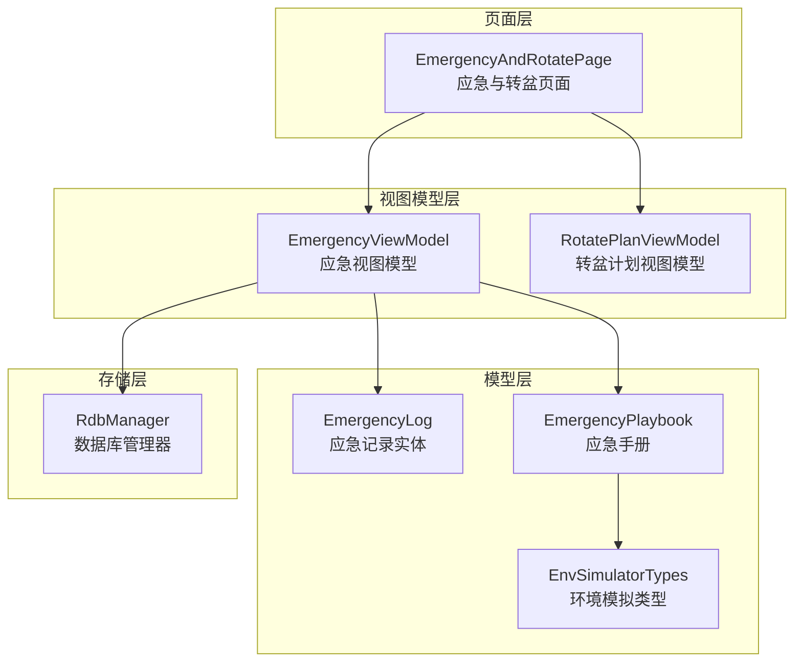
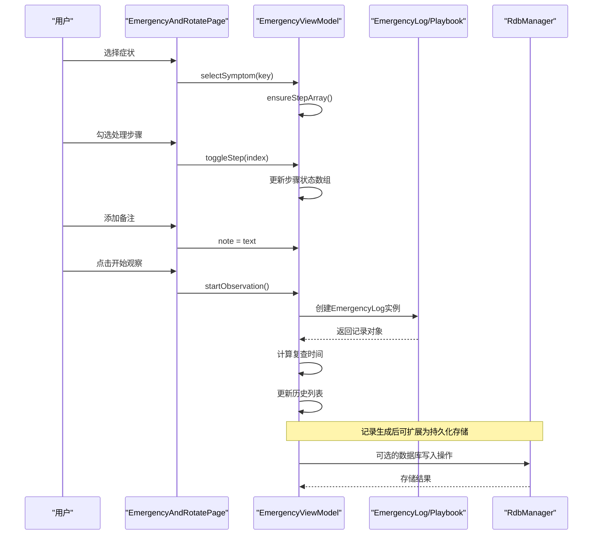
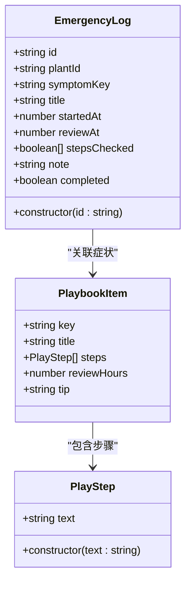
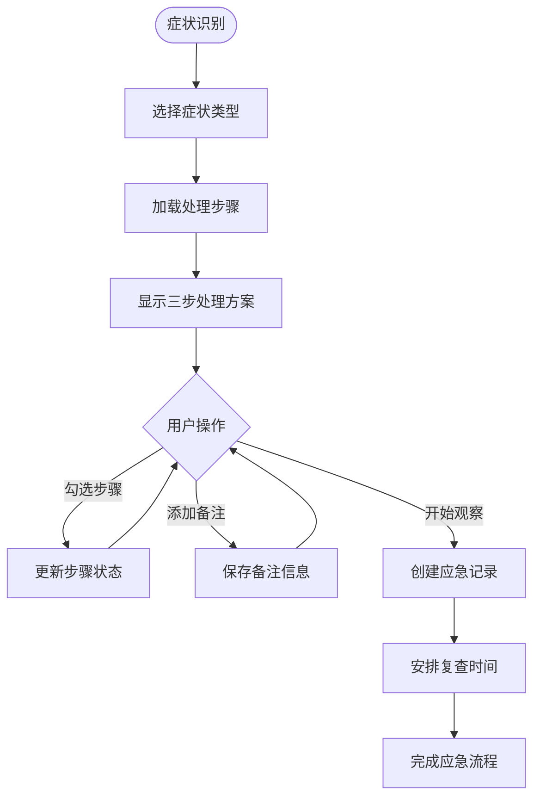
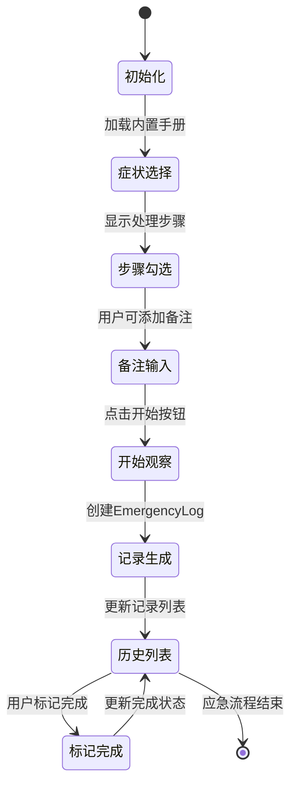
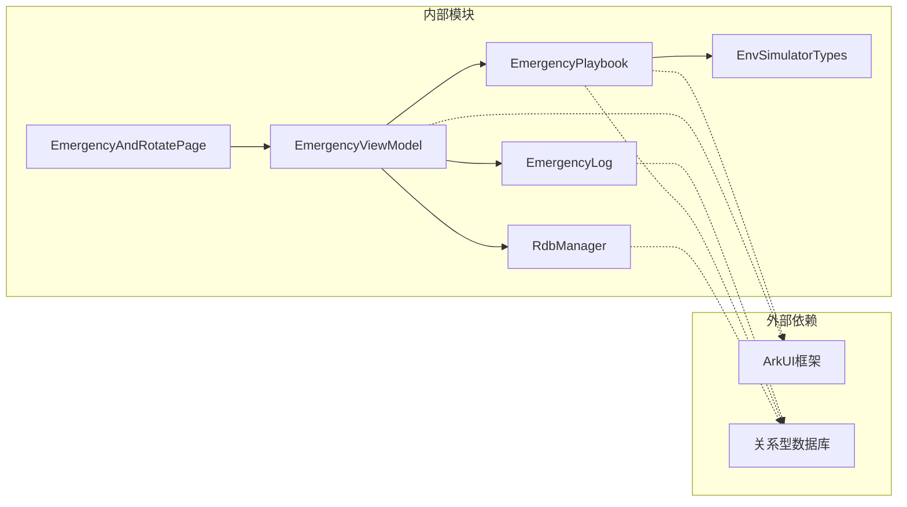

# 应急数据模型

<cite>
**本文档引用的文件**
- [EmergencyLog.ets](file://entry/src/main/ets/model/EmergencyLog.ets)
- [EmergencyPlaybook.ets](file://entry/src/main/ets/model/EmergencyPlaybook.ets)
- [EmergencyViewModel.ets](file://entry/src/main/ets/viewmodel/EmergencyViewModel.ets)
- [EmergencyAndRotatePage.ets](file://entry/src/main/ets/pages/EmergencyAndRotatePage.ets)
- [RdbManager.ets](file://entry/src/main/ets/viewmodel/RdbManager.ets)
- [EnvSimulatorTypes.ets](file://entry/src/main/ets/model/EnvSimulatorTypes.ets)
- [err.ets](file://entry/src/main/ets/viewmodel/err.ets)
</cite>

## 目录
1. [简介](#简介)
2. [项目结构](#项目结构)
3. [核心组件](#核心组件)
4. [架构概览](#架构概览)
5. [详细组件分析](#详细组件分析)
6. [依赖关系分析](#依赖关系分析)
7. [性能考量](#性能考量)
8. [故障排除指南](#故障排除指南)
9. [结论](#结论)
10. [附录](#附录)

## 简介
本文件详细解析植物日记应用中的应急数据模型，重点涵盖EmergencyLog（应急记录）和EmergencyPlaybook（应急手册）两大核心模块。文档从设计理念、实现细节、数据结构、处理流程、存储策略、检索机制、分类管理、优先级设置、响应时间统计等方面进行全面阐述，并提供API参考和操作指南，帮助开发者和使用者高效理解和运用应急数据模型。

## 项目结构
应急数据模型位于应用的主模块中，采用分层架构设计：
- Model层：定义数据实体和业务规则
- ViewModel层：封装业务逻辑和状态管理
- Page层：提供用户界面和交互
- Storage层：数据库初始化和索引管理

**图表来源**
- [EmergencyAndRotatePage.ets:1-557](file://entry/src/main/ets/pages/EmergencyAndRotatePage.ets#L1-L557)
- [EmergencyViewModel.ets:1-115](file://entry/src/main/ets/viewmodel/EmergencyViewModel.ets#L1-L115)
- [EmergencyLog.ets:1-20](file://entry/src/main/ets/model/EmergencyLog.ets#L1-L20)
- [EmergencyPlaybook.ets:1-81](file://entry/src/main/ets/model/EmergencyPlaybook.ets#L1-L81)
- [RdbManager.ets:1-296](file://entry/src/main/ets/viewmodel/RdbManager.ets#L1-L296)

**章节来源**
- [EmergencyAndRotatePage.ets:1-557](file://entry/src/main/ets/pages/EmergencyAndRotatePage.ets#L1-L557)
- [EmergencyViewModel.ets:1-115](file://entry/src/main/ets/viewmodel/EmergencyViewModel.ets#L1-L115)
- [EmergencyLog.ets:1-20](file://entry/src/main/ets/model/EmergencyLog.ets#L1-L20)
- [EmergencyPlaybook.ets:1-81](file://entry/src/main/ets/model/EmergencyPlaybook.ets#L1-L81)
- [RdbManager.ets:1-296](file://entry/src/main/ets/viewmodel/RdbManager.ets#L1-L296)

## 核心组件
应急数据模型由三个核心组件构成：应急记录实体、应急手册和应急视图模型。

### 应急记录实体（EmergencyLog）
EmergencyLog是应急事件的核心数据载体，采用内存版设计，具备以下属性：
- 标识符：唯一ID，用于区分不同应急记录
- 植物标识：关联到具体植物实例
- 症状标识：对应应急手册中的症状分类
- 标题：症状的描述性标题
- 开始时间：应急处理启动的时间戳
- 复查时间：建议的复查时间点
- 步骤状态：三步应急处理的完成状态数组
- 备注：用户添加的额外信息
- 完成状态：记录是否已完成

### 应急手册（EmergencyPlaybook）
EmergencyPlaybook提供结构化的应急处理方案，包含：
- 症状分类：如日灼、萎蔫、黄化、斑点、烂根等
- 处理步骤：每个症状对应的三步处理方案
- 复查间隔：基于症状的建议复查时间（小时）
- 辅助提示：针对特定症状的专业建议
- 内置清单：预定义的应急处理方案集合

### 应急视图模型（EmergencyViewModel）
EmergencyViewModel负责协调应急流程的业务逻辑：
- 症状选择：支持多种植物常见症状的选择
- 步骤管理：动态维护应急处理步骤的状态
- 记录生成：创建应急记录并安排复查时间
- 历史管理：维护应急记录的历史列表
- 数据格式化：提供时间格式化等辅助功能

**章节来源**
- [EmergencyLog.ets:4-19](file://entry/src/main/ets/model/EmergencyLog.ets#L4-L19)
- [EmergencyPlaybook.ets:9-23](file://entry/src/main/ets/model/EmergencyPlaybook.ets#L9-L23)
- [EmergencyViewModel.ets:14-29](file://entry/src/main/ets/viewmodel/EmergencyViewModel.ets#L14-L29)

## 架构概览
应急数据模型采用MVVM架构模式，实现了清晰的关注点分离：

**图表来源**
- [EmergencyAndRotatePage.ets:149-243](file://entry/src/main/ets/pages/EmergencyAndRotatePage.ets#L149-L243)
- [EmergencyViewModel.ets:60-75](file://entry/src/main/ets/viewmodel/EmergencyViewModel.ets#L60-L75)
- [EmergencyLog.ets:15-18](file://entry/src/main/ets/model/EmergencyLog.ets#L15-L18)

该架构确保了：
- **关注点分离**：页面负责UI，视图模型负责业务逻辑，模型负责数据结构
- **可测试性**：各层职责明确，便于单元测试
- **可扩展性**：支持从内存存储迁移到数据库存储
- **用户体验**：提供直观的症状选择和处理流程

## 详细组件分析

### 应急记录实体（EmergencyLog）
EmergencyLog作为应急事件的最小数据单元，具有以下特点：

**图表来源**
- [EmergencyLog.ets:4-19](file://entry/src/main/ets/model/EmergencyLog.ets#L4-L19)
- [EmergencyPlaybook.ets:4-23](file://entry/src/main/ets/model/EmergencyPlaybook.ets#L4-L23)

EmergencyLog的设计体现了以下原则：
- **简洁性**：只包含必要的字段，避免冗余信息
- **完整性**：涵盖应急处理的全过程信息
- **可扩展性**：预留字段支持未来功能扩展
- **类型安全**：使用强类型定义确保数据一致性

### 应急手册（EmergencyPlaybook）
EmergencyPlaybook提供了标准化的应急处理方案：

**图表来源**
- [EmergencyPlaybook.ets:25-81](file://entry/src/main/ets/model/EmergencyPlaybook.ets#L25-L81)
- [EmergencyViewModel.ets:40-56](file://entry/src/main/ets/viewmodel/EmergencyViewModel.ets#L40-L56)

应急手册的结构化设计包括：
- **症状分类体系**：涵盖植物常见的五种紧急状况
- **标准化处理流程**：每种症状都有明确的三步处理方案
- **个性化建议**：提供针对特定症状的专业提示
- **时间管理**：为每种症状设定合理的复查间隔

### 应急视图模型（EmergencyViewModel）
EmergencyViewModel是应急流程的核心协调者：

**图表来源**
- [EmergencyViewModel.ets:14-98](file://entry/src/main/ets/viewmodel/EmergencyViewModel.ets#L14-L98)

ViewModel的关键功能：
- **状态管理**：维护症状选择、步骤状态、备注等状态
- **数据转换**：将用户输入转换为EmergencyLog对象
- **业务规则**：计算复查时间、验证输入有效性
- **UI同步**：确保界面状态与数据状态保持一致

**章节来源**
- [EmergencyLog.ets:1-20](file://entry/src/main/ets/model/EmergencyLog.ets#L1-L20)
- [EmergencyPlaybook.ets:1-81](file://entry/src/main/ets/model/EmergencyPlaybook.ets#L1-L81)
- [EmergencyViewModel.ets:1-115](file://entry/src/main/ets/viewmodel/EmergencyViewModel.ets#L1-L115)

## 依赖关系分析

**图表来源**
- [EmergencyAndRotatePage.ets:4-8](file://entry/src/main/ets/pages/EmergencyAndRotatePage.ets#L4-L8)
- [EmergencyViewModel.ets:4-5](file://entry/src/main/ets/viewmodel/EmergencyViewModel.ets#L4-L5)
- [RdbManager.ets:1-296](file://entry/src/main/ets/viewmodel/RdbManager.ets#L1-L296)

依赖关系特点：
- **单向依赖**：页面依赖视图模型，视图模型依赖模型
- **松耦合**：各层之间通过接口而非具体实现耦合
- **可替换性**：模型层支持从内存存储迁移到数据库存储
- **扩展性**：新增功能可通过扩展接口实现

**章节来源**
- [EmergencyAndRotatePage.ets:1-557](file://entry/src/main/ets/pages/EmergencyAndRotatePage.ets#L1-L557)
- [EmergencyViewModel.ets:1-115](file://entry/src/main/ets/viewmodel/EmergencyViewModel.ets#L1-L115)
- [RdbManager.ets:1-296](file://entry/src/main/ets/viewmodel/RdbManager.ets#L1-L296)

## 性能考量
应急数据模型在设计时充分考虑了性能优化：

### 内存管理
- **即时创建**：EmergencyLog实例在创建时立即分配内存
- **数组优化**：步骤状态使用布尔数组，空间效率高
- **对象复用**：ViewModel通过重建对象而非原地修改来保证UI更新

### 数据访问优化
- **索引设计**：数据库层面为常用查询建立组合索引
- **查询优化**：按植物ID和时间戳的复合查询模式
- **缓存策略**：内置手册数据在内存中缓存，避免重复加载

### UI渲染优化
- **响应式更新**：使用@ObservedV2装饰器确保UI自动更新
- **列表渲染**：采用高效的ForEach和ListItem组件
- **状态管理**：通过状态变化驱动UI更新，避免手动DOM操作

## 故障排除指南
应急数据模型的常见问题及解决方案：

### 数据不一致问题
**问题现象**：应急记录与手册数据不匹配
**解决方法**：
1. 检查症状选择与手册条目的对应关系
2. 验证步骤状态数组长度与手册步骤数量一致
3. 确认复查时间计算逻辑正确

### UI状态同步问题
**问题现象**：界面状态与数据状态不一致
**解决方法**：
1. 确保toggleStep方法正确更新状态数组
2. 检查ensureStepArray方法在症状切换时的调用
3. 验证markCompleted方法的对象重建逻辑

### 存储迁移问题
**问题现象**：从内存存储迁移到数据库时数据丢失
**解决方法**：
1. 实现EmergencyLog到数据库表的映射
2. 建立相应的索引以支持查询性能
3. 提供数据迁移脚本确保历史数据保留

**章节来源**
- [EmergencyViewModel.ets:78-98](file://entry/src/main/ets/viewmodel/EmergencyViewModel.ets#L78-L98)
- [RdbManager.ets:148-170](file://entry/src/main/ets/viewmodel/RdbManager.ets#L148-L170)

## 结论
应急数据模型通过精心设计的架构和数据结构，为植物日记应用提供了完整的应急处理解决方案。模型具备以下优势：

- **结构化设计**：EmergencyLog、EmergencyPlaybook、EmergencyViewModel形成完整的数据处理链
- **用户体验友好**：直观的症状选择和三步处理流程
- **可扩展性强**：支持从内存存储迁移到数据库存储
- **性能优化**：通过索引设计和状态管理确保高效运行

该模型不仅满足了当前的功能需求，还为未来的功能扩展和性能优化奠定了坚实基础。

## 附录

### API参考

#### EmergencyLog类
- **构造函数**：`new EmergencyLog(id: string)`
- **属性**：
  - `id: string` - 记录唯一标识
  - `plantId: string` - 关联植物标识
  - `symptomKey: string` - 症状分类标识
  - `title: string` - 症状标题
  - `startedAt: number` - 开始时间戳
  - `reviewAt: number` - 复查时间戳
  - `stepsChecked: boolean[]` - 步骤完成状态
  - `note: string` - 备注信息
  - `completed: boolean` - 完成状态

#### EmergencyPlaybook类
- **PlaybookItem属性**：
  - `key: string` - 症状标识符
  - `title: string` - 症状名称
  - `steps: PlayStep[]` - 处理步骤数组
  - `reviewHours: number` - 复查间隔（小时）
  - `tip: string` - 专业提示

- **PlayStep属性**：
  - `text: string` - 步骤描述

#### EmergencyViewModel类
- **主要方法**：
  - `selectSymptom(key: string): void` - 选择症状
  - `toggleStep(index: number): void` - 切换步骤状态
  - `startObservation(): EmergencyLog | undefined` - 开始观察
  - `markCompleted(id: string): void` - 标记完成
  - `fmtDate(timestamp: number): string` - 格式化时间

### 操作指南

#### 记录应急事件
1. 在症状选择区域点击目标症状
2. 勾选已完成的处理步骤
3. 添加必要的备注信息
4. 点击"开始观察"按钮
5. 系统自动安排复查时间并生成记录

#### 调用应急手册
1. 在症状选择区域浏览可用症状
2. 点击目标症状查看处理步骤
3. 根据手册指导执行相应处理
4. 定期检查复查时间

#### 生成应急报告
1. 查看历史记录列表
2. 选择需要的记录查看详情
3. 导出或分享应急处理过程
4. 分析处理效果和改进建议

### 最佳实践
- **及时更新**：定期检查和更新应急手册内容
- **数据备份**：定期备份应急记录数据
- **流程标准化**：严格按照应急手册执行处理步骤
- **效果跟踪**：持续跟踪植物恢复情况
- **知识积累**：总结应急处理经验，完善手册内容