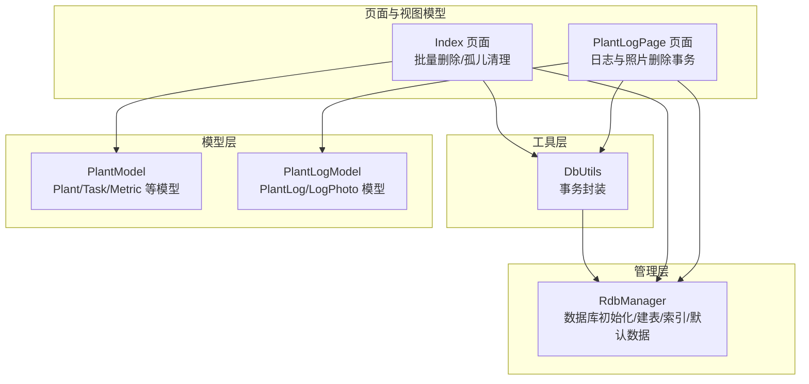
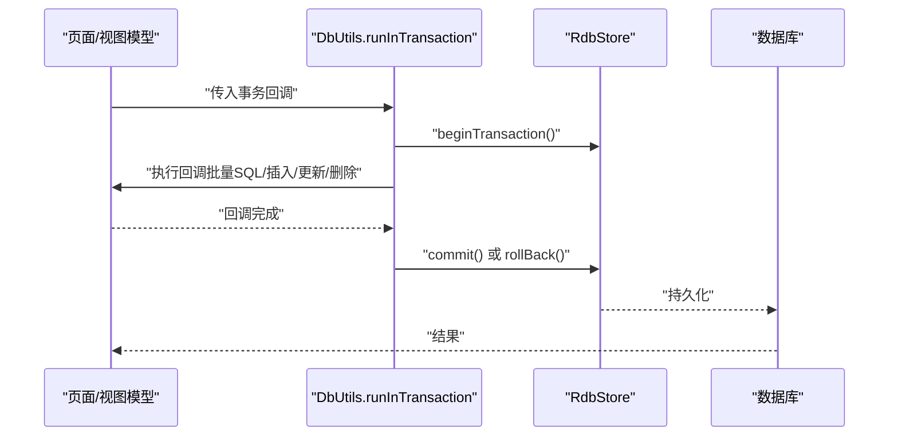
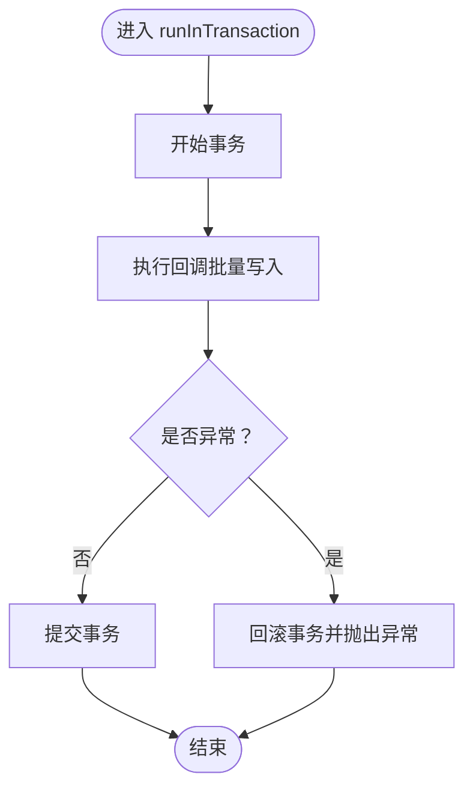
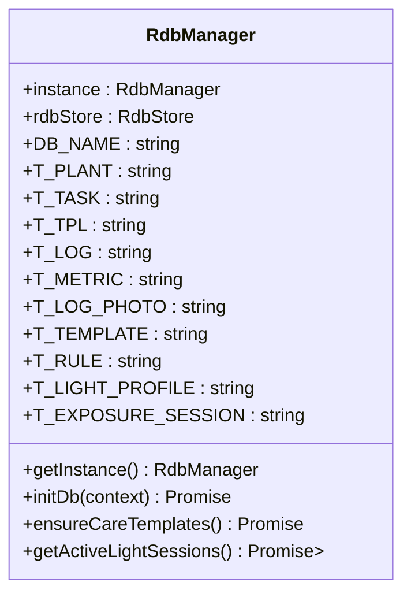
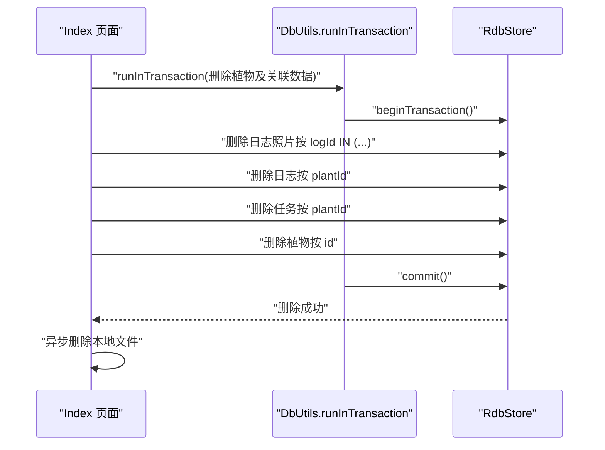
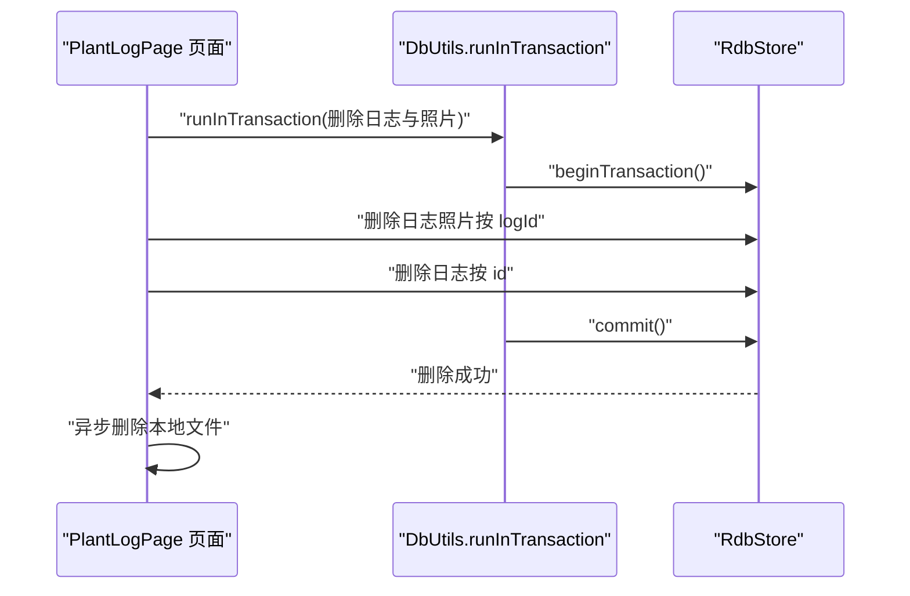
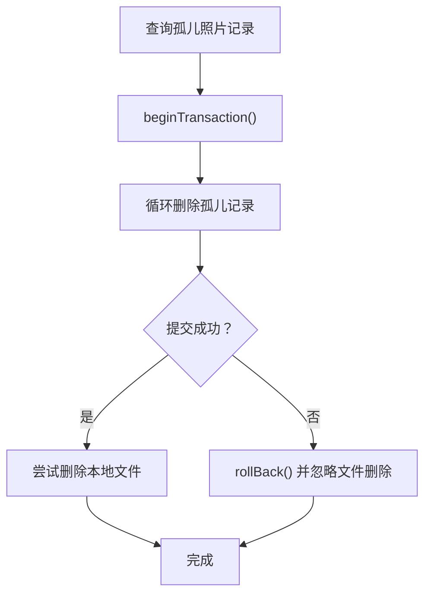
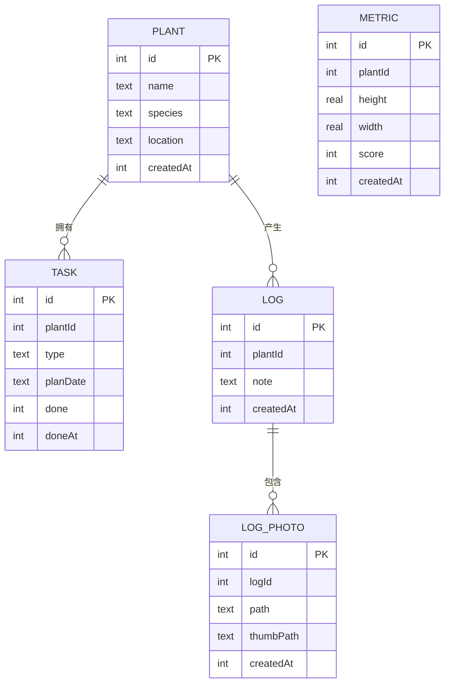
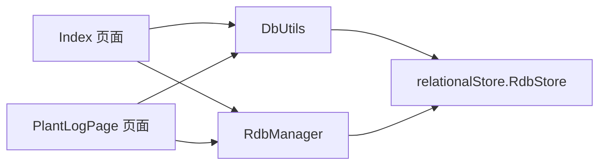

# 数据库工具类

<cite>
**本文引用的文件**
- [DbUtils.ets](file://entry/src/main/ets/model/DbUtils.ets)
- [RdbManager.ets](file://entry/src/main/ets/viewmodel/RdbManager.ets)
- [Index.ets](file://entry/src/main/ets/pages/Index.ets)
- [PlantLogPage.ets](file://entry/src/main/ets/pages/PlantLogPage.ets)
- [err.ets](file://entry/src/main/ets/viewmodel/err.ets)
- [PlantModel.ets](file://entry/src/main/ets/model/PlantModel.ets)
- [PlantLogModel.ets](file://entry/src/main/ets/model/PlantLogModel.ets)
</cite>

## 目录
1. [简介](#简介)
2. [项目结构](#项目结构)
3. [核心组件](#核心组件)
4. [架构总览](#架构总览)
5. [组件详解](#组件详解)
6. [依赖关系分析](#依赖关系分析)
7. [性能考量](#性能考量)
8. [故障排查指南](#故障排查指南)
9. [结论](#结论)
10. [附录：API 参考与最佳实践](#附录api-参考与最佳实践)

## 简介
本文件围绕数据库工具类进行系统化文档化，重点解析 DbUtils 工具类的设计理念与实现细节，涵盖数据库事务处理、连接管理、错误处理机制、数据访问模式与性能优化策略，并结合项目中的实际使用场景，给出最佳实践、安全考虑与调试方法。同时提供基于仓库现有代码的 API 参考与使用指南，帮助开发者高效、安全地进行 CRUD、事务与批量处理。

## 项目结构
该数据库相关能力主要分布在以下模块：
- 工具层：DbUtils 提供统一事务封装，简化批量写入的一致性保证。
- 管理层：RdbManager 负责数据库初始化、建表、索引与默认数据注入，提供全局单例访问入口。
- 页面与视图模型：多个页面通过 RdbManager 获取 RdbStore 实例，执行 CRUD 与事务控制。
- 模型层：PlantModel、PlantLogModel 等定义与数据库表结构对应的轻量数据模型，用于页面间传递与展示。

**图表来源**
- [DbUtils.ets:1-22](file://entry/src/main/ets/model/DbUtils.ets#L1-L22)
- [RdbManager.ets:1-296](file://entry/src/main/ets/viewmodel/RdbManager.ets#L1-L296)
- [Index.ets:350-549](file://entry/src/main/ets/pages/Index.ets#L350-L549)
- [PlantLogPage.ets:105-304](file://entry/src/main/ets/pages/PlantLogPage.ets#L105-L304)
- [PlantModel.ets:1-166](file://entry/src/main/ets/model/PlantModel.ets#L1-L166)
- [PlantLogModel.ets:1-58](file://entry/src/main/ets/model/PlantLogModel.ets#L1-L58)

**章节来源**
- [DbUtils.ets:1-22](file://entry/src/main/ets/model/DbUtils.ets#L1-L22)
- [RdbManager.ets:1-296](file://entry/src/main/ets/viewmodel/RdbManager.ets#L1-L296)
- [Index.ets:350-549](file://entry/src/main/ets/pages/Index.ets#L350-L549)
- [PlantLogPage.ets:105-304](file://entry/src/main/ets/pages/PlantLogPage.ets#L105-L304)
- [PlantModel.ets:1-166](file://entry/src/main/ets/model/PlantModel.ets#L1-L166)
- [PlantLogModel.ets:1-58](file://entry/src/main/ets/model/PlantLogModel.ets#L1-L58)

## 核心组件
- DbUtils：提供 runInTransaction 封装，确保批量写入的原子性，自动提交或回滚。
- RdbManager：提供数据库初始化、建表、索引与默认数据注入，暴露全局单例与表常量。
- 页面与视图模型：在具体业务中使用 RdbStore 执行 CRUD，并在关键路径使用事务保证一致性。

**章节来源**
- [DbUtils.ets:1-22](file://entry/src/main/ets/model/DbUtils.ets#L1-L22)
- [RdbManager.ets:1-296](file://entry/src/main/ets/viewmodel/RdbManager.ets#L1-L296)

## 架构总览
下图展示了从页面到数据库的调用链路与事务控制点：

**图表来源**
- [DbUtils.ets:12-21](file://entry/src/main/ets/model/DbUtils.ets#L12-L21)
- [Index.ets:357-382](file://entry/src/main/ets/pages/Index.ets#L357-L382)
- [PlantLogPage.ets:111-122](file://entry/src/main/ets/pages/PlantLogPage.ets#L111-L122)

## 组件详解

### DbUtils 工具类
- 设计理念
  - 统一事务入口，避免各处重复开启/提交/回滚逻辑。
  - 将“要么全部成功、要么全部回滚”的语义抽象为一个高阶函数，降低调用方心智负担。
- 实现要点
  - 开启事务 -> 执行回调 -> 成功提交 -> 异常回滚并抛出。
  - 回调中可串联多次 SQL 执行或插入/更新/删除，保证原子性。
- 使用建议
  - 对涉及多表或多步骤的写入流程，优先使用该封装。
  - 将“数据库写入 + 文件系统操作”拆分为“先事务提交，再异步删除文件”，以保证数据一致性。

**图表来源**
- [DbUtils.ets:12-21](file://entry/src/main/ets/model/DbUtils.ets#L12-L21)

**章节来源**
- [DbUtils.ets:1-22](file://entry/src/main/ets/model/DbUtils.ets#L1-L22)

### RdbManager 管理器
- 数据库初始化
  - 通过 StoreConfig 配置数据库名称、安全等级、加密与只读属性。
  - 初始化完成后创建多张核心表（植物、任务、模板、规则、日志、指标、日志照片、光照配置与会话）。
- 索引设计
  - 任务表：唯一索引约束“同植物+类型+计划日”避免重复；常用查询建立 planDate、plantId 索引。
  - 日志表：按 plantId+createdAt 组合索引，满足按植物查询与倒序展示。
  - 日志照片表：按 logId 建立索引，支持按日志批量删除。
  - 指标表：按 plantId+createdAt 组合索引，支撑时间序列查询。
- 默认数据注入
  - 空库时插入多种养护模板与规则，避免覆盖用户后续修改。
- 查询辅助
  - 提供获取“活跃光照会话”的便捷方法，用于首页状态同步。

**图表来源**
- [RdbManager.ets:4-296](file://entry/src/main/ets/viewmodel/RdbManager.ets#L4-L296)

**章节来源**
- [RdbManager.ets:1-296](file://entry/src/main/ets/viewmodel/RdbManager.ets#L1-L296)

### 页面中的事务与批量处理示例

#### 示例一：批量删除植物及其关联数据（事务）
- 场景：删除某植物时，需级联删除其日志照片、日志、任务与植物记录。
- 流程：使用 runInTransaction 包裹删除逻辑，确保原子性；事务提交后再统一删除本地文件。

**图表来源**
- [Index.ets:357-382](file://entry/src/main/ets/pages/Index.ets#L357-L382)
- [DbUtils.ets:12-21](file://entry/src/main/ets/model/DbUtils.ets#L12-L21)

**章节来源**
- [Index.ets:350-402](file://entry/src/main/ets/pages/Index.ets#L350-L402)

#### 示例二：日志与照片删除（事务 + 文件清理）
- 场景：删除单条日志时，需先删除其关联照片，再删除日志本身。
- 流程：使用 runInTransaction 保证数据库一致性；事务提交后再逐个删除本地文件。

**图表来源**
- [PlantLogPage.ets:111-122](file://entry/src/main/ets/pages/PlantLogPage.ets#L111-L122)
- [DbUtils.ets:12-21](file://entry/src/main/ets/model/DbUtils.ets#L12-L21)

**章节来源**
- [PlantLogPage.ets:105-137](file://entry/src/main/ets/pages/PlantLogPage.ets#L105-L137)

#### 示例三：孤儿照片清理（事务）
- 场景：清理数据库中指向不存在日志的孤儿照片记录，并尝试删除对应文件。
- 流程：先查询孤儿记录，开启事务逐条删除，提交后再尝试删除文件。

**图表来源**
- [Index.ets:471-487](file://entry/src/main/ets/pages/Index.ets#L471-L487)

**章节来源**
- [Index.ets:441-546](file://entry/src/main/ets/pages/Index.ets#L441-L546)

### 数据模型与表结构映射
- Plant/PlantTask/Metric 等模型用于页面展示与交互，字段与数据库表保持一致或语义一致。
- PlantLog 与 LogPhoto 模型用于日志与照片管理，支持按日志聚合展示与倒序排列。

**图表来源**
- [RdbManager.ets:36-129](file://entry/src/main/ets/viewmodel/RdbManager.ets#L36-L129)
- [PlantModel.ets:6-147](file://entry/src/main/ets/model/PlantModel.ets#L6-L147)
- [PlantLogModel.ets:8-57](file://entry/src/main/ets/model/PlantLogModel.ets#L8-L57)

**章节来源**
- [PlantModel.ets:1-166](file://entry/src/main/ets/model/PlantModel.ets#L1-L166)
- [PlantLogModel.ets:1-58](file://entry/src/main/ets/model/PlantLogModel.ets#L1-L58)
- [RdbManager.ets:36-129](file://entry/src/main/ets/viewmodel/RdbManager.ets#L36-L129)

## 依赖关系分析
- DbUtils 依赖 relationalStore 的 RdbStore 接口，提供统一事务封装。
- RdbManager 作为全局单例，集中管理数据库生命周期、建表与索引。
- 页面与视图模型通过 RdbManager 获取 RdbStore 实例，执行 CRUD 与事务控制。
- 模型层与数据库表结构一一对应，便于数据映射与 UI 展示。

**图表来源**
- [DbUtils.ets:1-22](file://entry/src/main/ets/model/DbUtils.ets#L1-L22)
- [RdbManager.ets:1-296](file://entry/src/main/ets/viewmodel/RdbManager.ets#L1-L296)
- [Index.ets:350-549](file://entry/src/main/ets/pages/Index.ets#L350-L549)
- [PlantLogPage.ets:105-304](file://entry/src/main/ets/pages/PlantLogPage.ets#L105-L304)

**章节来源**
- [DbUtils.ets:1-22](file://entry/src/main/ets/model/DbUtils.ets#L1-L22)
- [RdbManager.ets:1-296](file://entry/src/main/ets/viewmodel/RdbManager.ets#L1-L296)
- [Index.ets:350-549](file://entry/src/main/ets/pages/Index.ets#L350-L549)
- [PlantLogPage.ets:105-304](file://entry/src/main/ets/pages/PlantLogPage.ets#L105-L304)

## 性能考量
- 索引策略
  - 任务表：唯一索引避免重复任务，减少冲突与回滚成本；planDate、plantId 索引提升查询效率。
  - 日志与指标表：组合索引按 plantId+createdAt 排序，避免额外索引冗余。
- 批量操作
  - 使用 IN 子句与批量删除/插入减少往返次数；事务包裹保证原子性与一致性。
- I/O 分离
  - 将“数据库写入 + 文件系统操作”解耦：先事务提交，再异步删除文件，避免文件系统异常破坏数据一致性。
- 查询优化
  - 使用组合索引与 LIMIT/排序策略，避免全表扫描；按需投影列，减少网络与解析开销。

[本节为通用性能指导，无需特定文件引用]

## 故障排查指南
- 事务异常
  - 现象：批量写入部分失败导致数据不一致。
  - 处理：确认是否使用 runInTransaction 包裹；检查回调中是否有未捕获异常导致回滚。
  - 参考：事务封装与页面使用示例。
- 孤儿记录清理失败
  - 现象：数据库中存在无效日志照片记录或文件丢失。
  - 处理：先在事务中删除孤儿记录，提交后再尝试删除文件；失败记录可后续再次清理。
  - 参考：孤儿清理流程与事务提交逻辑。
- 错误处理与降级
  - RdbManager 中的查询失败采用降级策略（返回空集合），避免阻断主流程。
  - 参考：活跃光照会话查询的异常处理。

**章节来源**
- [DbUtils.ets:12-21](file://entry/src/main/ets/model/DbUtils.ets#L12-L21)
- [Index.ets:471-487](file://entry/src/main/ets/pages/Index.ets#L471-L487)
- [RdbManager.ets:278-294](file://entry/src/main/ets/viewmodel/RdbManager.ets#L278-L294)

## 结论
DbUtils 与 RdbManager 构成了本项目的数据库基础设施：前者提供统一事务封装，后者负责数据库初始化与表结构管理。页面与视图模型通过这些能力实现安全、高效的 CRUD 与批量处理。配合合理的索引策略与 I/O 分离，系统在一致性与性能之间取得良好平衡。建议在所有涉及多步写入的业务中优先使用事务封装，并遵循“先事务、后文件”的原则，确保数据与文件系统的最终一致性。

[本节为总结性内容，无需特定文件引用]

## 附录：API 参考与最佳实践

### API 参考
- DbUtils.runInTransaction
  - 参数
    - store: relationalStore.RdbStore
    - fn: () => Promise<void>
  - 行为：开启事务 -> 执行回调 -> 成功提交 -> 异常回滚并抛出
  - 使用场景：批量写入、级联删除、多表一致性更新
  - 参考路径
    - [DbUtils.ets:12-21](file://entry/src/main/ets/model/DbUtils.ets#L12-L21)

- RdbManager.getInstance
  - 行为：返回全局单例实例
  - 参考路径
    - [RdbManager.ets:19-24](file://entry/src/main/ets/viewmodel/RdbManager.ets#L19-L24)

- RdbManager.initDb(context)
  - 行为：创建数据库、建表、索引与默认数据
  - 参考路径
    - [RdbManager.ets:27-170](file://entry/src/main/ets/viewmodel/RdbManager.ets#L27-L170)

- RdbManager.ensureCareTemplates()
  - 行为：空库时注入默认养护模板与规则
  - 参考路径
    - [RdbManager.ets:173-276](file://entry/src/main/ets/viewmodel/RdbManager.ets#L173-L276)

- RdbManager.getActiveLightSessions()
  - 行为：查询活跃光照会话（用于首页状态同步）
  - 参考路径
    - [RdbManager.ets:278-294](file://entry/src/main/ets/viewmodel/RdbManager.ets#L278-L294)

### 最佳实践
- 事务优先
  - 凡是多步写入或涉及多表一致性，一律使用 runInTransaction 包裹。
- 批量删除
  - 使用 IN 子句与批量删除，减少往返；事务包裹后统一删除本地文件。
- 索引与查询
  - 为高频查询建立组合索引；按需投影列，避免全表扫描。
- 文件与数据库分离
  - 先事务提交，再异步删除文件；失败记录可后续重试。
- 错误降级
  - 查询失败时采用降级策略，避免阻断主流程。

### 安全考虑
- 输入校验：在写入前对关键字段进行校验与裁剪，避免非法数据进入数据库。
- 唯一约束：利用唯一索引避免重复任务与日志，减少脏数据风险。
- 权限与加密：根据业务需求合理设置安全等级与加密选项（当前示例未启用加密）。

### 调试方法
- 事务回滚定位：在回调中加入日志输出，定位具体失败步骤。
- 孤儿清理：分步执行删除与文件清理，分别记录失败项以便重试。
- 查询验证：使用组合索引的查询路径进行性能验证与回归测试。

**章节来源**
- [DbUtils.ets:1-22](file://entry/src/main/ets/model/DbUtils.ets#L1-L22)
- [RdbManager.ets:1-296](file://entry/src/main/ets/viewmodel/RdbManager.ets#L1-L296)
- [Index.ets:350-549](file://entry/src/main/ets/pages/Index.ets#L350-L549)
- [PlantLogPage.ets:105-304](file://entry/src/main/ets/pages/PlantLogPage.ets#L105-L304)
- [err.ets:1-169](file://entry/src/main/ets/viewmodel/err.ets#L1-L169)