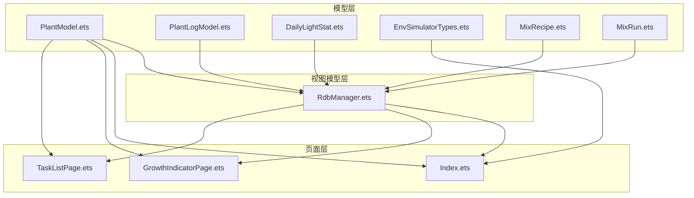
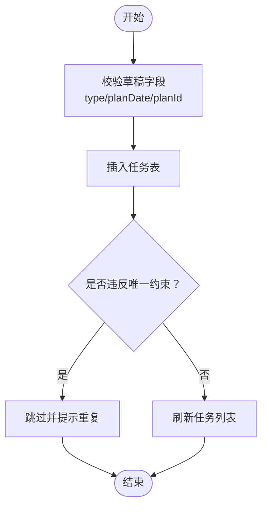
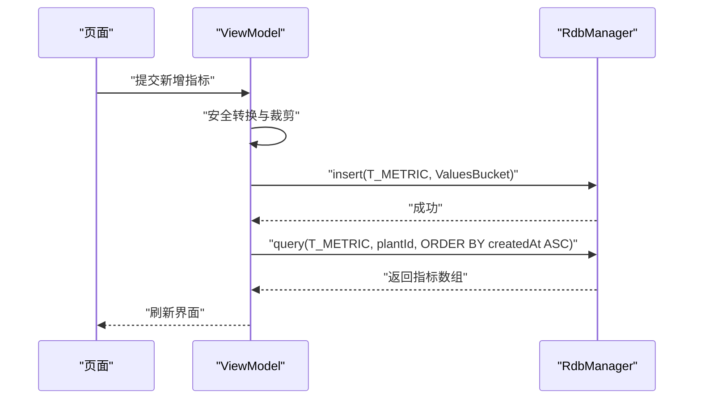
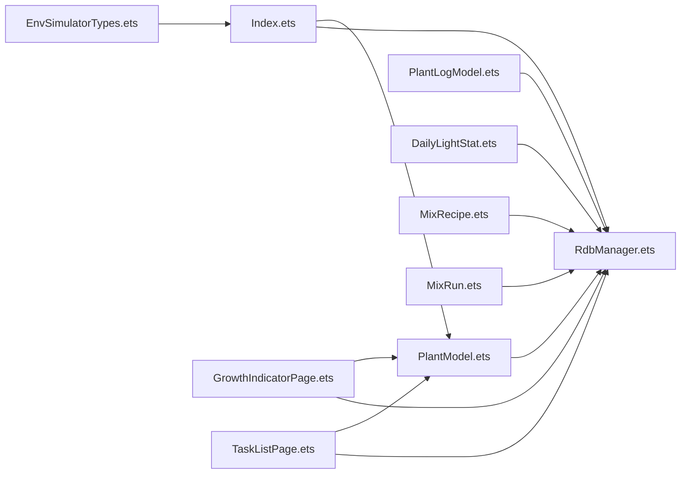

# 数据模型层

<cite>
**本文引用的文件**
- [PlantModel.ets](file://entry/src/main/ets/model/PlantModel.ets)
- [PlantLogModel.ets](file://entry/src/main/ets/model/PlantLogModel.ets)
- [RdbManager.ets](file://entry/src/main/ets/viewmodel/RdbManager.ets)
- [Index.ets](file://entry/src/main/ets/pages/Index.ets)
- [GrowthIndicatorPage.ets](file://entry/src/main/ets/pages/GrowthIndicatorPage.ets)
- [TaskListPage.ets](file://entry/src/main/ets/pages/TaskListPage.ets)
- [CODE_ANNOTATIONS.md](file://CODE_ANNOTATIONS.md)
- [DailyLightStat.ets](file://entry/src/main/ets/model/DailyLightStat.ets)
- [EnvSimulatorTypes.ets](file://entry/src/main/ets/model/EnvSimulatorTypes.ets)
- [MixRecipe.ets](file://entry/src/main/ets/model/MixRecipe.ets)
- [MixRun.ets](file://entry/src/main/ets/model/MixRun.ets)
</cite>

## 目录
1. [简介](#简介)
2. [项目结构](#项目结构)
3. [核心组件](#核心组件)
4. [架构总览](#架构总览)
5. [详细组件分析](#详细组件分析)
6. [依赖分析](#依赖分析)
7. [性能考虑](#性能考虑)
8. [故障排查指南](#故障排查指南)
9. [结论](#结论)
10. [附录](#附录)

## 简介
本章节面向数据模型层，系统性梳理 Plant、PlanTpl、PlantTask、Metric、LogEntry、DailyLightStat、EnvSimulatorTypes、MixRecipe、MixRun 等核心数据模型的设计理念、字段语义、约束条件与业务规则，并结合装饰器 @ObservedV2 与 @Trace 的作用机制，给出创建、更新、查询与草稿模型（Draft）的使用范式与最佳实践。同时，通过数据库层 RdbManager 的建表与索引策略，阐明模型间的关系与一致性保障。

## 项目结构
数据模型层主要位于 entry/src/main/ets/model 与 entry/src/main/ets/viewmodel 下，配合页面层进行数据读写与展示。核心文件如下：
- PlantModel.ets：植物、任务、日志、指标等基础模型与草稿模型
- PlantLogModel.ets：植物日志与日志照片模型
- RdbManager.ets：数据库初始化、建表、索引与默认数据
- 页面层 Index.ets、GrowthIndicatorPage.ets、TaskListPage.ets：展示模型的创建、更新、查询与筛选逻辑
- DailyLightStat.ets：光照统计模型
- EnvSimulatorTypes.ets：环境模拟器常量与工具
- MixRecipe.ets、MixRun.ets：土壤配方与调配运行结果模型



**图表来源**
- [PlantModel.ets](file://entry/src/main/ets/model/PlantModel.ets)
- [PlantLogModel.ets](file://entry/src/main/ets/model/PlantLogModel.ets)
- [RdbManager.ets](file://entry/src/main/ets/viewmodel/RdbManager.ets)
- [Index.ets](file://entry/src/main/ets/pages/Index.ets)
- [GrowthIndicatorPage.ets](file://entry/src/main/ets/pages/GrowthIndicatorPage.ets)
- [TaskListPage.ets](file://entry/src/main/ets/pages/TaskListPage.ets)
- [DailyLightStat.ets](file://entry/src/main/ets/model/DailyLightStat.ets)
- [EnvSimulatorTypes.ets](file://entry/src/main/ets/model/EnvSimulatorTypes.ets)
- [MixRecipe.ets](file://entry/src/main/ets/model/MixRecipe.ets)
- [MixRun.ets](file://entry/src/main/ets/model/MixRun.ets)

**章节来源**
- [PlantModel.ets](file://entry/src/main/ets/model/PlantModel.ets)
- [PlantLogModel.ets](file://entry/src/main/ets/model/PlantLogModel.ets)
- [RdbManager.ets](file://entry/src/main/ets/viewmodel/RdbManager.ets)
- [Index.ets](file://entry/src/main/ets/pages/Index.ets)
- [GrowthIndicatorPage.ets](file://entry/src/main/ets/pages/GrowthIndicatorPage.ets)
- [TaskListPage.ets](file://entry/src/main/ets/pages/TaskListPage.ets)
- [DailyLightStat.ets](file://entry/src/main/ets/model/DailyLightStat.ets)
- [EnvSimulatorTypes.ets](file://entry/src/main/ets/model/EnvSimulatorTypes.ets)
- [MixRecipe.ets](file://entry/src/main/ets/model/MixRecipe.ets)
- [MixRun.ets](file://entry/src/main/ets/model/MixRun.ets)

## 核心组件
本节聚焦核心数据模型的设计与职责：
- Plant：植物基本信息（名称、种类、位置、创建时间）
- PlanTpl：养护计划模板（名称、类型、周期、次数、创建时间）
- PlantTask：植物任务（关联植物、类型、计划日期、完成状态与完成时间）
- Metric：生长指标（身高、冠幅、健康分、创建时间）
- LogEntry：日志条目（关联植物、内容、创建时间）
- DailyLightStat：光照统计（当日累计光照量、时长、达标率、状态）
- EnvSimulatorTypes：环境模拟器常量与工具（光照、土壤湿度、推荐与情绪）
- MixRecipe、MixRun：土壤配方与一次调配结果

字段类型与约束要点（以模型定义为准）：
- 数值型：整数（如 id、times、done、createdAt）、浮点（如 height、width、score 的近似值）
- 文本型：字符串（如 name、species、location、type、planDate）
- 日期型：字符串格式 YYYY-MM-DD（如 planDate、date）
- 时间戳：毫秒级整数（如 createdAt）

业务规则与约束：
- 唯一性：任务表对 (plantId, type, planDate) 建有唯一索引，防止重复生成同日同类型的重复任务
- 查询优化：按 plantId+createdAt、planDate、plantId 等维度建立索引
- 默认值：指标表中 height、width、score 设有默认值，确保数值完整性
- 草稿模型：PlantDraft、TaskDraft 用于表单编辑态，避免直接修改列表实体

**章节来源**
- [PlantModel.ets](file://entry/src/main/ets/model/PlantModel.ets)
- [PlantLogModel.ets](file://entry/src/main/ets/model/PlantLogModel.ets)
- [RdbManager.ets](file://entry/src/main/ets/viewmodel/RdbManager.ets)
- [DailyLightStat.ets](file://entry/src/main/ets/model/DailyLightStat.ets)
- [EnvSimulatorTypes.ets](file://entry/src/main/ets/model/EnvSimulatorTypes.ets)
- [MixRecipe.ets](file://entry/src/main/ets/model/MixRecipe.ets)
- [MixRun.ets](file://entry/src/main/ets/model/MixRun.ets)

## 架构总览
数据模型层采用“轻模型 + 装饰器 + 数据库层”的分层设计：
- 轻模型：仅承载字段与少量构造逻辑，复杂业务规则由页面或 ViewModel 处理
- 装饰器：@ObservedV2 使模型具备响应式能力；@Trace 标记追踪属性
- 数据库层：RdbManager 统一建表、索引与默认数据，页面通过 SQL 查询与 ValuesBucket 写入

```mermaid
classDiagram
class Plant {
+number id
+string name
+string species
+string location
+number createdAt
}
class PlanTpl {
+number id
+string name
+string type
+number everyDays
+number times
+number createdAt
}
class PlantTask {
+number id
+number plantId
+string type
+string planDate
+number done
+number doneAt
}
class Metric {
+number id
+number plantId
+number height
+number width
+number score
+number createdAt
}
class LogEntry {
+number id
+number plantId
+string note
+number createdAt
}
class DailyLightStat {
+string id
+number plantId
+string date
+number luxMinutes
+number durationMin
+number maxLux
+number rate
+string status
}
class MixRecipe {
+string id
+string name
+MixItem[] items
+string note
+number createdAt
+boolean isBuiltin
}
class MixRun {
+string id
+string recipeName
+number totalLiters
+MixResultItem[] result
+string note
+number createdAt
}
PlantTask --> Plant : "外键 : plantId"
Metric --> Plant : "外键 : plantId"
LogEntry --> Plant : "外键 : plantId"
```

**图表来源**
- [PlantModel.ets](file://entry/src/main/ets/model/PlantModel.ets)
- [PlantLogModel.ets](file://entry/src/main/ets/model/PlantLogModel.ets)
- [RdbManager.ets](file://entry/src/main/ets/viewmodel/RdbManager.ets)

## 详细组件分析

### Plant（植物）
- 字段与类型：id、name、species、location、createdAt（整数时间戳）
- 用途：作为任务与指标的归属主体
- 业务规则：页面层通过 ValuesBucket 写入，查询时按 createdAt 倒序展示
- 示例路径：
  - 创建：[Index.ets](file://entry/src/main/ets/pages/Index.ets)
  - 更新：[Index.ets](file://entry/src/main/ets/pages/Index.ets)
  - 查询：[Index.ets](file://entry/src/main/ets/pages/Index.ets)

**章节来源**
- [PlantModel.ets](file://entry/src/main/ets/model/PlantModel.ets)
- [Index.ets](file://entry/src/main/ets/pages/Index.ets)

### PlanTpl（养护计划模板）
- 字段与类型：id、name、type、everyDays、times、createdAt
- 用途：定义周期性养护行为的模板，支持按间隔天数与覆盖范围生成任务
- 示例路径：
  - 查询模板：[Index.ets](file://entry/src/main/ets/pages/Index.ets)

**章节来源**
- [PlantModel.ets](file://entry/src/main/ets/model/PlantModel.ets)
- [Index.ets](file://entry/src/main/ets/pages/Index.ets)

### PlantTask（植物任务）
- 字段与类型：id、plantId、type、planDate（YYYY-MM-DD）、done（0/1）、doneAt
- 用途：记录植物的养护任务，支持按日期与植物过滤
- 约束：数据库对 (plantId, type, planDate) 建唯一索引，避免重复
- 示例路径：
  - 查询任务：[Index.ets](file://entry/src/main/ets/pages/Index.ets)
  - 新建任务（草稿）：[Index.ets](file://entry/src/main/ets/pages/Index.ets)
  - 任务筛选与排序：[TaskListPage.ets](file://entry/src/main/ets/pages/TaskListPage.ets)



**图表来源**
- [Index.ets](file://entry/src/main/ets/pages/Index.ets)
- [RdbManager.ets](file://entry/src/main/ets/viewmodel/RdbManager.ets)

**章节来源**
- [PlantModel.ets](file://entry/src/main/ets/model/PlantModel.ets)
- [Index.ets](file://entry/src/main/ets/pages/Index.ets)
- [TaskListPage.ets](file://entry/src/main/ets/pages/TaskListPage.ets)
- [RdbManager.ets](file://entry/src/main/ets/viewmodel/RdbManager.ets)

### Metric（生长指标）
- 字段与类型：id、plantId、height、width、score、createdAt
- 用途：记录植物身高、冠幅与健康分，按时间升序展示
- 示例路径：
  - 查询指标：[GrowthIndicatorPage.ets](file://entry/src/main/ets/pages/GrowthIndicatorPage.ets)
  - 新增指标（含输入兜底与分数裁剪）：[GrowthIndicatorPage.ets](file://entry/src/main/ets/pages/GrowthIndicatorPage.ets)



**图表来源**
- [GrowthIndicatorPage.ets](file://entry/src/main/ets/pages/GrowthIndicatorPage.ets)
- [RdbManager.ets](file://entry/src/main/ets/viewmodel/RdbManager.ets)

**章节来源**
- [PlantModel.ets](file://entry/src/main/ets/model/PlantModel.ets)
- [GrowthIndicatorPage.ets](file://entry/src/main/ets/pages/GrowthIndicatorPage.ets)
- [RdbManager.ets](file://entry/src/main/ets/viewmodel/RdbManager.ets)

### LogEntry（日志条目）
- 字段与类型：id、plantId、note、createdAt
- 用途：记录植物的养护与观察笔记
- 示例路径：
  - 日志与照片模型定义：[PlantLogModel.ets](file://entry/src/main/ets/model/PlantLogModel.ets)

**章节来源**
- [PlantLogModel.ets](file://entry/src/main/ets/model/PlantLogModel.ets)

### DailyLightStat（光照统计）
- 字段与类型：id、plantId、date（YYYY-MM-DD）、luxMinutes、durationMin、maxLux、rate、status
- 用途：展示每日光照汇总，支持达标率与状态
- 示例路径：
  - 模型定义：[DailyLightStat.ets](file://entry/src/main/ets/model/DailyLightStat.ets)

**章节来源**
- [DailyLightStat.ets](file://entry/src/main/ets/model/DailyLightStat.ets)

### EnvSimulatorTypes（环境模拟器）
- 用途：提供光照、土壤湿度、情绪与推荐的映射与工具函数
- 示例路径：
  - 环境模拟器常量与工具：[EnvSimulatorTypes.ets](file://entry/src/main/ets/model/EnvSimulatorTypes.ets)

**章节来源**
- [EnvSimulatorTypes.ets](file://entry/src/main/ets/model/EnvSimulatorTypes.ets)

### MixRecipe / MixRun（配方与运行结果）
- 用途：配方实体与一次调配结果，支持配比权重与密度估算
- 示例路径：
  - 配方模型：[MixRecipe.ets](file://entry/src/main/ets/model/MixRecipe.ets)
  - 运行结果模型：[MixRun.ets](file://entry/src/main/ets/model/MixRun.ets)

**章节来源**
- [MixRecipe.ets](file://entry/src/main/ets/model/MixRecipe.ets)
- [MixRun.ets](file://entry/src/main/ets/model/MixRun.ets)

### 装饰器：@ObservedV2 与 @Trace
- @ObservedV2：使类具备响应式能力，属性变更触发视图更新
- @Trace：标记需要追踪的属性，配合响应式系统进行细粒度更新
- 示例路径：
  - Plant、PlanTpl、PlantTask、Metric、LogEntry 等模型均使用 @ObservedV2
  - 装饰器使用说明与示例：[CODE_ANNOTATIONS.md](file://CODE_ANNOTATIONS.md)

**章节来源**
- [PlantModel.ets](file://entry/src/main/ets/model/PlantModel.ets)
- [CODE_ANNOTATIONS.md](file://CODE_ANNOTATIONS.md)

### 草稿模型（Draft）
- PlantDraft：用于编辑植物信息的草稿，避免直接修改列表实体
- TaskDraft：用于新建任务的草稿，统一校验后再落库
- 示例路径：
  - 草稿模型定义：[PlantModel.ets](file://entry/src/main/ets/model/PlantModel.ets)
  - 页面使用草稿创建/更新：[Index.ets](file://entry/src/main/ets/pages/Index.ets)

**章节来源**
- [PlantModel.ets](file://entry/src/main/ets/model/PlantModel.ets)
- [Index.ets](file://entry/src/main/ets/pages/Index.ets)

## 依赖分析
- 模型到数据库：各模型通过 RdbManager 的表名常量与索引策略进行持久化
- 页面到模型：页面层通过 SQL 查询与 ValuesBucket 写入，构建模型实例
- 任务唯一性：数据库唯一索引保证 (plantId, type, planDate) 不重复
- 查询性能：针对常用查询维度建立复合索引，提升读取效率



**图表来源**
- [Index.ets](file://entry/src/main/ets/pages/Index.ets)
- [GrowthIndicatorPage.ets](file://entry/src/main/ets/pages/GrowthIndicatorPage.ets)
- [TaskListPage.ets](file://entry/src/main/ets/pages/TaskListPage.ets)
- [PlantModel.ets](file://entry/src/main/ets/model/PlantModel.ets)
- [PlantLogModel.ets](file://entry/src/main/ets/model/PlantLogModel.ets)
- [RdbManager.ets](file://entry/src/main/ets/viewmodel/RdbManager.ets)
- [DailyLightStat.ets](file://entry/src/main/ets/model/DailyLightStat.ets)
- [EnvSimulatorTypes.ets](file://entry/src/main/ets/model/EnvSimulatorTypes.ets)
- [MixRecipe.ets](file://entry/src/main/ets/model/MixRecipe.ets)
- [MixRun.ets](file://entry/src/main/ets/model/MixRun.ets)

**章节来源**
- [RdbManager.ets](file://entry/src/main/ets/viewmodel/RdbManager.ets)
- [PlantModel.ets](file://entry/src/main/ets/model/PlantModel.ets)
- [PlantLogModel.ets](file://entry/src/main/ets/model/PlantLogModel.ets)
- [Index.ets](file://entry/src/main/ets/pages/Index.ets)
- [GrowthIndicatorPage.ets](file://entry/src/main/ets/pages/GrowthIndicatorPage.ets)
- [TaskListPage.ets](file://entry/src/main/ets/pages/TaskListPage.ets)
- [DailyLightStat.ets](file://entry/src/main/ets/model/DailyLightStat.ets)
- [EnvSimulatorTypes.ets](file://entry/src/main/ets/model/EnvSimulatorTypes.ets)
- [MixRecipe.ets](file://entry/src/main/ets/model/MixRecipe.ets)
- [MixRun.ets](file://entry/src/main/ets/model/MixRun.ets)

## 性能考虑
- 唯一索引：任务表的 (plantId, type, planDate) 唯一索引可避免重复插入，减少冲突处理成本
- 复合索引：日志与指标表分别按 (plantId, createdAt) 建立索引，满足高频查询需求
- 查询排序：按时间升序或倒序展示，避免额外排序开销
- 草稿校验：在页面层集中进行输入校验与裁剪，降低数据库层异常回滚概率

[本节为通用性能建议，无需特定文件引用]

## 故障排查指南
- 重复任务插入失败：检查唯一索引冲突，优先采用“尝试插入，冲突即跳过”的策略
- 查询结果为空：确认表名常量与 SQL 语句正确，核对索引是否存在
- 指标新增异常：检查输入转换与分数裁剪逻辑，确保时间戳格式正确
- 删除植物流程：先删日志/任务/植物，再删文件，避免事务失败导致数据不一致

**章节来源**
- [RdbManager.ets](file://entry/src/main/ets/viewmodel/RdbManager.ets)
- [Index.ets](file://entry/src/main/ets/pages/Index.ets)
- [GrowthIndicatorPage.ets](file://entry/src/main/ets/pages/GrowthIndicatorPage.ets)

## 结论
数据模型层通过轻量模型、装饰器响应式与数据库层约束，实现了清晰的职责分离与高效的读写路径。Plant、PlanTpl、PlantTask、Metric 等核心模型围绕“植物”这一中心实体形成稳定关系，配合草稿模型与统一的 CRUD 流程，既保证了业务灵活性，也确保了数据一致性与性能表现。

[本节为总结性内容，无需特定文件引用]

## 附录

### API 参考（基于模型与页面的使用路径）
- 创建植物
  - 路径：[Index.ets](file://entry/src/main/ets/pages/Index.ets)
  - 关键步骤：构造 ValuesBucket（name/species/location/createdAt），插入 plant 表，刷新列表
- 更新植物
  - 路径：[Index.ets](file://entry/src/main/ets/pages/Index.ets)
  - 关键步骤：构造 ValuesBucket（name/species/location），按 id 更新
- 删除植物
  - 路径：[Index.ets](file://entry/src/main/ets/pages/Index.ets)
  - 关键步骤：先查日志ID，再批量查照片路径，事务内删除日志/任务/植物，最后删除文件
- 新建任务
  - 路径：[Index.ets](file://entry/src/main/ets/pages/Index.ets)
  - 关键步骤：使用 TaskDraft 校验后插入 task 表，唯一索引冲突时跳过
- 查询任务
  - 路径：[Index.ets](file://entry/src/main/ets/pages/Index.ets)、[TaskListPage.ets](file://entry/src/main/ets/pages/TaskListPage.ets)
  - 关键步骤：按 planDate 或 plantId 查询，支持筛选与排序
- 新增指标
  - 路径：[GrowthIndicatorPage.ets](file://entry/src/main/ets/pages/GrowthIndicatorPage.ets)
  - 关键步骤：输入兜底与分数裁剪，按 plantId+createdAt 查询并升序展示
- 查询日志
  - 路径：[GrowthIndicatorPage.ets](file://entry/src/main/ets/pages/GrowthIndicatorPage.ets)
  - 关键步骤：按 plantId 查询，按 createdAt 倒序展示

**章节来源**
- [Index.ets](file://entry/src/main/ets/pages/Index.ets)
- [TaskListPage.ets](file://entry/src/main/ets/pages/TaskListPage.ets)
- [GrowthIndicatorPage.ets](file://entry/src/main/ets/pages/GrowthIndicatorPage.ets)