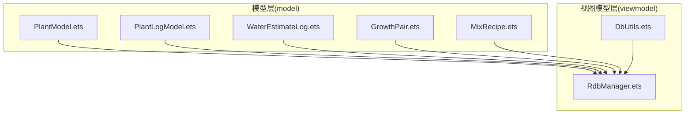
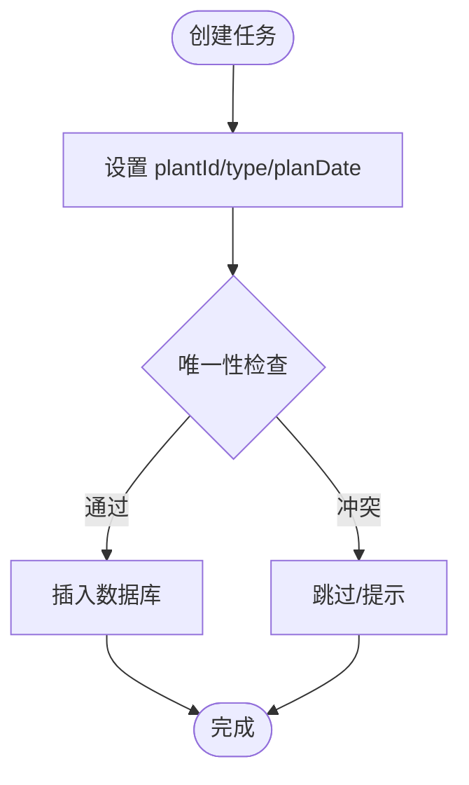
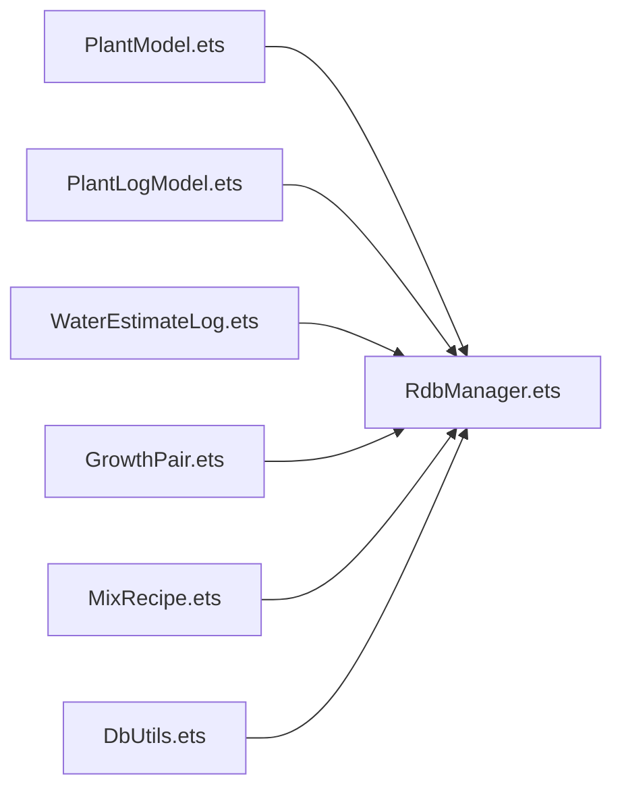

# 核心数据模型

<cite>
**本文引用的文件**
- [PlantModel.ets](file://entry/src/main/ets/model/PlantModel.ets)
- [PlantLogModel.ets](file://entry/src/main/ets/model/PlantLogModel.ets)
- [RdbManager.ets](file://entry/src/main/ets/viewmodel/RdbManager.ets)
- [DbUtils.ets](file://entry/src/main/ets/model/DbUtils.ets)
- [CODE_ANNOTATIONS.md](file://CODE_ANNOTATIONS.md)
- [WaterEstimateLog.ets](file://entry/src/main/ets/model/WaterEstimateLog.ets)
- [GrowthPair.ets](file://entry/src/main/ets/model/GrowthPair.ets)
- [MixRecipe.ets](file://entry/src/main/ets/model/MixRecipe.ets)
</cite>

## 目录
1. [简介](#简介)
2. [项目结构](#项目结构)
3. [核心组件](#核心组件)
4. [架构总览](#架构总览)
5. [详细组件分析](#详细组件分析)
6. [依赖分析](#依赖分析)
7. [性能考虑](#性能考虑)
8. [故障排查指南](#故障排查指南)
9. [结论](#结论)
10. [附录](#附录)

## 简介
本文件系统性梳理 PlantDiary 项目中的核心数据模型与实现，重点覆盖以下主题：
- 数据模型设计与字段语义：Plant、PlanTpl、PlantTask、Metric、LogEntry、PlantLog、LogPhoto、WaterEstimateLog、GrowthPair、MixRecipe 等
- 装饰器机制：@ObservedV2 与 @Trace 的作用与使用场景
- 模型间关系与约束：一对一、一对多、外键与索引策略
- 数据验证规则、字段类型与业务规则
- 草稿模型（Draft）的设计目的与使用方式
- 完整 API 参考与最佳实践

## 项目结构
围绕数据模型与持久化的关键文件组织如下：
- model 层：定义轻量数据结构与接口，承载业务数据载体
- viewmodel 层：封装数据库初始化、建表、索引与事务控制
- 示例与扩展：水肥估算日志、成长前后对比、土壤配方等



**图表来源**
- [PlantModel.ets](file://entry/src/main/ets/model/PlantModel.ets)
- [PlantLogModel.ets](file://entry/src/main/ets/model/PlantLogModel.ets)
- [RdbManager.ets](file://entry/src/main/ets/viewmodel/RdbManager.ets)
- [DbUtils.ets](file://entry/src/main/ets/model/DbUtils.ets)
- [WaterEstimateLog.ets](file://entry/src/main/ets/model/WaterEstimateLog.ets)
- [GrowthPair.ets](file://entry/src/main/ets/model/GrowthPair.ets)
- [MixRecipe.ets](file://entry/src/main/ets/model/MixRecipe.ets)

**章节来源**
- [PlantModel.ets](file://entry/src/main/ets/model/PlantModel.ets)
- [PlantLogModel.ets](file://entry/src/main/ets/model/PlantLogModel.ets)
- [RdbManager.ets](file://entry/src/main/ets/viewmodel/RdbManager.ets)
- [DbUtils.ets](file://entry/src/main/ets/model/DbUtils.ets)

## 核心组件
本节对核心数据模型进行逐项说明，包括字段类型、取值范围、业务含义与典型用法。

- Plant（植物）
  - 字段：id、name、species、location、createdAt
  - 类型：id、createdAt 为数字；其余为字符串
  - 约束：id 主键（数据库自增），createdAt 为时间戳
  - 用途：记录植物基本信息，作为其他模型的父实体

- PlanTpl（养护计划模板）
  - 字段：id、name、type、everyDays、times、createdAt
  - 类型：id、everyDays、times、createdAt 数字；name、type 字符串
  - 约束：模板用于派生任务，支持周期与次数控制
  - 用途：定义任务生成规则（如“每 N 天一次，覆盖未来 M 天”）

- PlantTask（植物任务）
  - 字段：id、plantId、type、planDate、done、doneAt
  - 类型：id、plantId、done、doneAt 数字；type 字符串；planDate 日期字符串
  - 约束：唯一索引（plantId, type, planDate）避免重复
  - 用途：具体到某天的任务计划与完成状态

- Metric（生长指标）
  - 字段：id、plantId、height、width、score、createdAt
  - 类型：id、plantId、createdAt 数字；height、width 浮点；score 整数
  - 约束：height、width 默认 0；score 0~100
  - 用途：记录植物身高、冠幅与健康评分

- LogEntry（日志条目）
  - 字段：id、plantId、note、createdAt
  - 类型：id、plantId、createdAt 数字；note 字符串
  - 约束：按 plantId+createdAt 组合索引，便于查询
  - 用途：通用日志记录

- PlantLog（日志）
  - 字段：id、plantId、note、createdAt
  - 类型：id、plantId、createdAt 数字；note 字符串
  - 约束：与 LogPhoto 通过 logId 关联
  - 用途：植物日志正文

- LogPhoto（日志照片）
  - 字段：id、logId、path、thumbPath、createdAt
  - 类型：id、logId、createdAt 数字；path、thumbPath 字符串
  - 约束：logId 外键；按 logId 建索引
  - 用途：与日志关联的图片资源

- WaterEstimateLog（水肥估算日志）
  - 字段：id、plantId、diameterCm、depthCm、retention、strategy、plantKind、low、mid、high、createdAt、note
  - 类型：id 字符串；plantId、diameterCm、depthCm、createdAt 数字；low、mid、high 数字；其余字符串/枚举
  - 约束：createdAt 默认当前时间
  - 用途：估算结果与输入参数的持久化

- GrowthPair（成长前后对比）
  - 字段：id、plantId、beforeUri、afterUri、createdAt、note、alignGrid
  - 类型：id、plantId、createdAt 数字；alignGrid 布尔
  - 约束：createdAt 默认当前时间
  - 用途：前后对比展示与标注

- MixRecipe（土壤配方）
  - 字段：id、name、items、note、createdAt、isBuiltin
  - 类段：items 为 MixItem 数组
  - 约束：createdAt 默认当前时间
  - 用途：配方定义与条目配比

- 草稿模型（Draft）
  - PlantDraft：编辑态草稿，避免直接修改列表实体
  - TaskDraft：新建任务草稿，统一校验后再落库
  - 用途：隔离编辑态与持久态，降低脏写风险

**章节来源**
- [PlantModel.ets](file://entry/src/main/ets/model/PlantModel.ets)
- [PlantLogModel.ets](file://entry/src/main/ets/model/PlantLogModel.ets)
- [WaterEstimateLog.ets](file://entry/src/main/ets/model/WaterEstimateLog.ets)
- [GrowthPair.ets](file://entry/src/main/ets/model/GrowthPair.ets)
- [MixRecipe.ets](file://entry/src/main/ets/model/MixRecipe.ets)

## 架构总览
下图展示数据模型与数据库层的交互关系，以及装饰器驱动的响应式更新机制。

```mermaid
classDiagram
class Plant {
+number id
+string name
+string species
+string location
+number createdAt
}
class PlanTpl {
+number id
+string name
+string type
+number everyDays
+number times
+number createdAt
}
class PlantTask {
+number id
+number plantId
+string type
+string planDate
+number done
+number doneAt
}
class Metric {
+number id
+number plantId
+number height
+number width
+number score
+number createdAt
}
class LogEntry {
+number id
+number plantId
+string note
+number createdAt
}
class PlantLog {
+number id
+number plantId
+string note
+number createdAt
}
class LogPhoto {
+number id
+number logId
+string path
+string thumbPath
+number createdAt
}
class WaterEstimateLog {
+string id
+number plantId
+number diameterCm
+number depthCm
+enum retention
+enum strategy
+enum plantKind
+number low
+number mid
+number high
+number createdAt
+string note
}
class GrowthPair {
+string id
+number plantId
+string beforeUri
+string afterUri
+number createdAt
+string note
+boolean alignGrid
}
class MixRecipe {
+string id
+string name
+MixItem[] items
+string note
+number createdAt
+boolean isBuiltin
}
PlantTask --> Plant : "外键 : plantId"
LogPhoto --> PlantLog : "外键 : logId"
Metric --> Plant : "外键 : plantId"
LogEntry --> Plant : "外键 : plantId"
```

**图表来源**
- [PlantModel.ets](file://entry/src/main/ets/model/PlantModel.ets)
- [PlantLogModel.ets](file://entry/src/main/ets/model/PlantLogModel.ets)
- [RdbManager.ets](file://entry/src/main/ets/viewmodel/RdbManager.ets)

## 详细组件分析

### Plant（植物）
- 设计理念：最小字段集，仅承载必要信息；复杂业务逻辑由页面/VM 处理
- 字段与类型：id（主键）、name、species、location、createdAt（时间戳）
- 业务规则：无硬性校验，遵循数据库约束（如非空、自增）

**章节来源**
- [PlantModel.ets](file://entry/src/main/ets/model/PlantModel.ets)

### PlanTpl（养护计划模板）
- 设计理念：以模板驱动任务生成，支持周期与覆盖范围
- 字段与类型：id、name、type、everyDays、times、createdAt
- 业务规则：模板与规则表配合，生成未来任务

**章节来源**
- [PlantModel.ets](file://entry/src/main/ets/model/PlantModel.ets)

### PlantTask（植物任务）
- 设计理念：任务粒度细化到“植物+类型+日期”，保证唯一性
- 字段与类型：id、plantId、type、planDate（YYYY-MM-DD）、done（0/1）、doneAt
- 约束：唯一索引（plantId, type, planDate），避免重复任务
- 业务规则：done 标识完成状态，doneAt 记录完成时间



**图表来源**
- [RdbManager.ets](file://entry/src/main/ets/viewmodel/RdbManager.ets)

**章节来源**
- [PlantModel.ets](file://entry/src/main/ets/model/PlantModel.ets)
- [RdbManager.ets](file://entry/src/main/ets/viewmodel/RdbManager.ets)

### Metric（生长指标）
- 设计理念：记录植物关键生长参数，支持趋势分析
- 字段与类型：id、plantId、height（cm）、width（cm）、score（0~100）、createdAt
- 业务规则：height、width 默认 0；score 限制在 0~100

**章节来源**
- [PlantModel.ets](file://entry/src/main/ets/model/PlantModel.ets)

### LogEntry（日志条目）
- 设计理念：与 Plant 关联的日志入口，便于聚合查询
- 字段与类型：id、plantId、note、createdAt
- 约束：按 plantId+createdAt 建立复合索引

**章节来源**
- [PlantModel.ets](file://entry/src/main/ets/model/PlantModel.ets)
- [RdbManager.ets](file://entry/src/main/ets/viewmodel/RdbManager.ets)

### PlantLog（日志）与 LogPhoto（日志照片）
- 设计理念：日志正文与附件分离，便于检索与展示
- 字段与类型：PlantLog（id、plantId、note、createdAt）；LogPhoto（id、logId、path、thumbPath、createdAt）
- 约束：LogPhoto.logId 外键；按 logId 建索引

**章节来源**
- [PlantLogModel.ets](file://entry/src/main/ets/model/PlantLogModel.ets)
- [RdbManager.ets](file://entry/src/main/ets/viewmodel/RdbManager.ets)

### WaterEstimateLog（水肥估算日志）
- 设计理念：记录估算输入参数与结果，支持历史回溯
- 字段与类型：id、plantId、diameterCm、depthCm、retention、strategy、plantKind、low、mid、high、createdAt、note
- 业务规则：createdAt 默认当前时间

**章节来源**
- [WaterEstimateLog.ets](file://entry/src/main/ets/model/WaterEstimateLog.ets)

### GrowthPair（成长前后对比）
- 设计理念：前后对比展示，支持标注与网格对齐
- 字段与类型：id、plantId、beforeUri、afterUri、createdAt、note、alignGrid
- 业务规则：createdAt 默认当前时间

**章节来源**
- [GrowthPair.ets](file://entry/src/main/ets/model/GrowthPair.ets)

### MixRecipe（土壤配方）
- 设计理念：配方条目化管理，支持内置与自定义
- 字段与类型：id、name、items（MixItem 数组）、note、createdAt、isBuiltin
- 业务规则：createdAt 默认当前时间

**章节来源**
- [MixRecipe.ets](file://entry/src/main/ets/model/MixRecipe.ets)

### 装饰器：@ObservedV2 与 @Trace
- @ObservedV2：使类具备响应式能力，属性变更触发 UI 更新
- @Trace：标记需要追踪的属性，配合 @ObservedV2 实现细粒度响应
- 使用场景：模型类（如 Plant、PlanTpl、PlantTask、Metric、GrowthPair 等）与 VM（如 WaterEstimatorViewModel）中广泛使用
- 最佳实践：仅对需要响应式更新的字段加 @Trace；避免过度追踪导致性能问题

**章节来源**
- [CODE_ANNOTATIONS.md](file://CODE_ANNOTATIONS.md)
- [PlantModel.ets](file://entry/src/main/ets/model/PlantModel.ets)
- [WaterEstimatorViewModel.ets](file://entry/src/main/ets/viewmodel/WaterEstimatorViewModel.ets)

### 草稿模型（Draft）
- PlantDraft：编辑态草稿，避免直接修改列表实体
- TaskDraft：新建任务草稿，统一校验后再落库
- 使用方式：页面/VM 先填充草稿，执行校验与业务规则，通过后再写入数据库
- 优势：降低脏写风险，提升一致性

**章节来源**
- [PlantModel.ets](file://entry/src/main/ets/model/PlantModel.ets)

## 依赖分析
- 模型到数据库：各模型对应数据库表，通过 RdbManager 统一建表与索引
- 外键关系：PlantTask.plantId → Plant.id；LogPhoto.logId → PlantLog.id；Metric.plantId → Plant.id；LogEntry.plantId → Plant.id
- 索引策略：任务唯一索引（plantId, type, planDate）；日志与指标按（plantId, createdAt）建立复合索引
- 事务封装：DbUtils 提供统一事务封装，确保批量写入原子性



**图表来源**
- [PlantModel.ets](file://entry/src/main/ets/model/PlantModel.ets)
- [PlantLogModel.ets](file://entry/src/main/ets/model/PlantLogModel.ets)
- [RdbManager.ets](file://entry/src/main/ets/viewmodel/RdbManager.ets)
- [DbUtils.ets](file://entry/src/main/ets/model/DbUtils.ets)

**章节来源**
- [RdbManager.ets](file://entry/src/main/ets/viewmodel/RdbManager.ets)
- [DbUtils.ets](file://entry/src/main/ets/model/DbUtils.ets)

## 性能考虑
- 唯一索引：任务表的唯一索引避免重复插入，提高并发安全性
- 复合索引：日志与指标按（plantId, createdAt）建立索引，满足高频查询
- 事务封装：批量写入使用事务，减少 IO 次数，提升吞吐
- 响应式更新：合理使用 @Trace，避免过度追踪造成不必要的重渲染

[本节为通用指导，无需特定文件引用]

## 故障排查指南
- 重复任务插入失败：检查任务唯一索引（plantId, type, planDate），采用“尝试插入，冲突即跳过”的策略
- 查询性能异常：确认是否使用了（plantId, createdAt）复合索引；避免全表扫描
- 事务回滚：使用 DbUtils.runInTransaction 包裹批量写入，确保原子性
- 装饰器未生效：确认类已使用 @ObservedV2，并对需要追踪的字段添加 @Trace

**章节来源**
- [RdbManager.ets](file://entry/src/main/ets/viewmodel/RdbManager.ets)
- [DbUtils.ets](file://entry/src/main/ets/model/DbUtils.ets)
- [CODE_ANNOTATIONS.md](file://CODE_ANNOTATIONS.md)

## 结论
本项目通过轻量数据模型与装饰器驱动的响应式机制，实现了清晰的领域建模与高效的 UI 更新。配合数据库层面的唯一索引与复合索引，既保障了数据一致性，也兼顾了查询性能。草稿模型进一步提升了编辑流程的可靠性。建议在扩展新模型时，遵循现有命名与索引策略，保持数据模型的一致性与可维护性。

[本节为总结性内容，无需特定文件引用]

## 附录

### API 参考（字段与类型）
- Plant：id（number）、name（string）、species（string）、location（string）、createdAt（number）
- PlanTpl：id（number）、name（string）、type（string）、everyDays（number）、times（number）、createdAt（number）
- PlantTask：id（number）、plantId（number）、type（string）、planDate（string）、done（number）、doneAt（number）
- Metric：id（number）、plantId（number）、height（number）、width（number）、score（number）、createdAt（number）
- LogEntry：id（number）、plantId（number）、note（string）、createdAt（number）
- PlantLog：id（number）、plantId（number）、note（string）、createdAt（number）
- LogPhoto：id（number）、logId（number）、path（string）、thumbPath（string）、createdAt（number）
- WaterEstimateLog：id（string）、plantId（number）、diameterCm（number）、depthCm（number）、retention（枚举）、strategy（枚举）、plantKind（枚举）、low（number）、mid（number）、high（number）、createdAt（number）、note（string）
- GrowthPair：id（string）、plantId（number）、beforeUri（string）、afterUri（string）、createdAt（number）、note（string）、alignGrid（boolean）
- MixRecipe：id（string）、name（string）、items（数组，元素为 MixItem）、note（string）、createdAt（number）、isBuiltin（boolean）

**章节来源**
- [PlantModel.ets](file://entry/src/main/ets/model/PlantModel.ets)
- [PlantLogModel.ets](file://entry/src/main/ets/model/PlantLogModel.ets)
- [WaterEstimateLog.ets](file://entry/src/main/ets/model/WaterEstimateLog.ets)
- [GrowthPair.ets](file://entry/src/main/ets/model/GrowthPair.ets)
- [MixRecipe.ets](file://entry/src/main/ets/model/MixRecipe.ets)

### 最佳实践
- 字段设计：尽量保持模型轻量，复杂规则移至页面或 VM
- 唯一性：对可能重复的关键组合建立唯一索引
- 查询优化：针对高频查询建立复合索引
- 事务：批量写入使用事务封装，确保一致性
- 响应式：仅对必要字段使用 @Trace，避免过度追踪
- 草稿：编辑态使用草稿模型，统一校验后再落库

**章节来源**
- [CODE_ANNOTATIONS.md](file://CODE_ANNOTATIONS.md)
- [RdbManager.ets](file://entry/src/main/ets/viewmodel/RdbManager.ets)
- [DbUtils.ets](file://entry/src/main/ets/model/DbUtils.ets)
- [PlantModel.ets](file://entry/src/main/ets/model/PlantModel.ets)