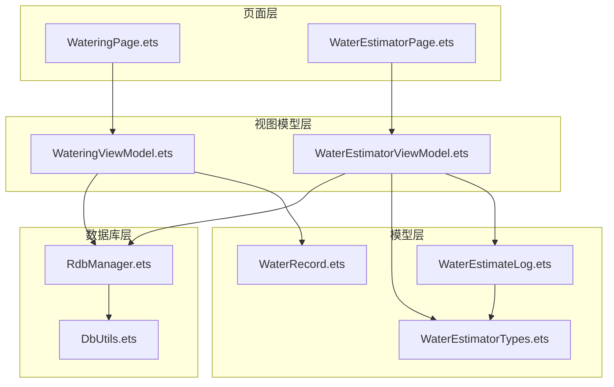
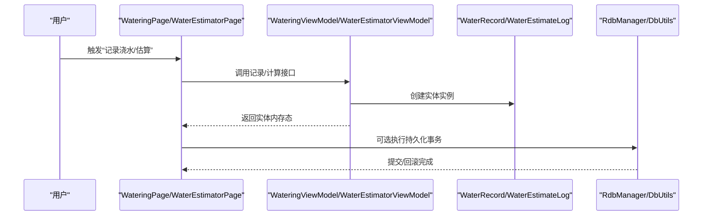
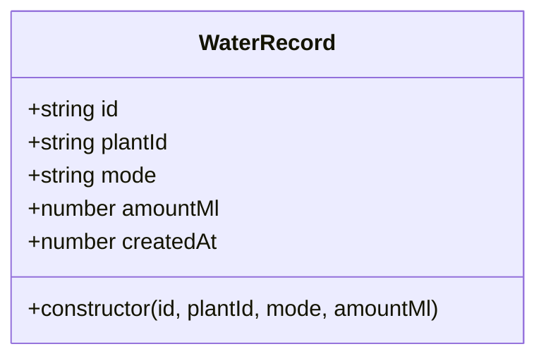
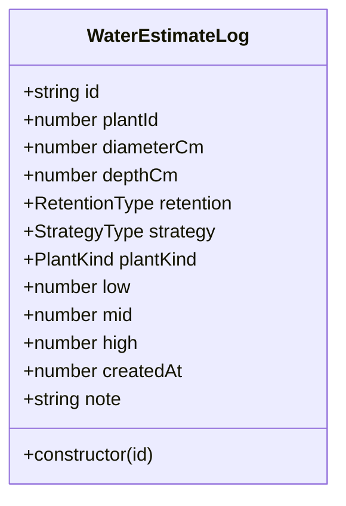
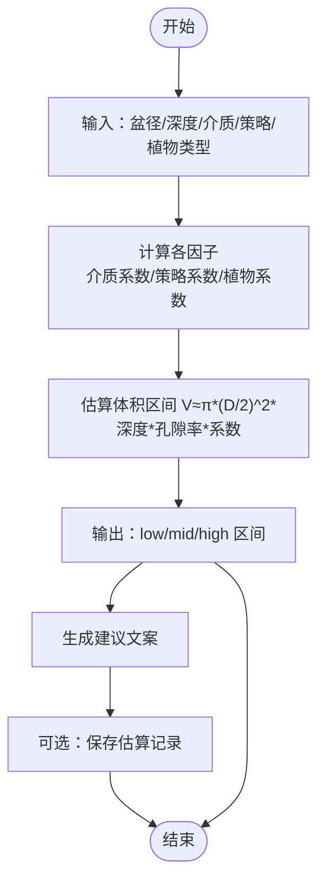
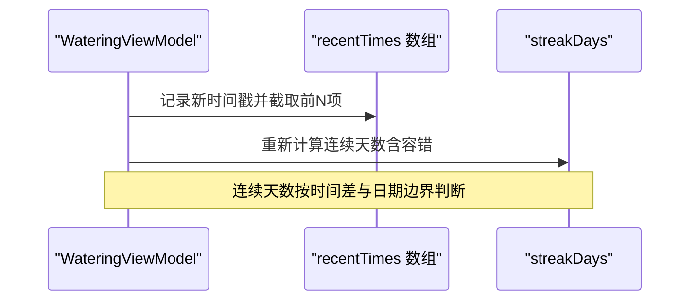
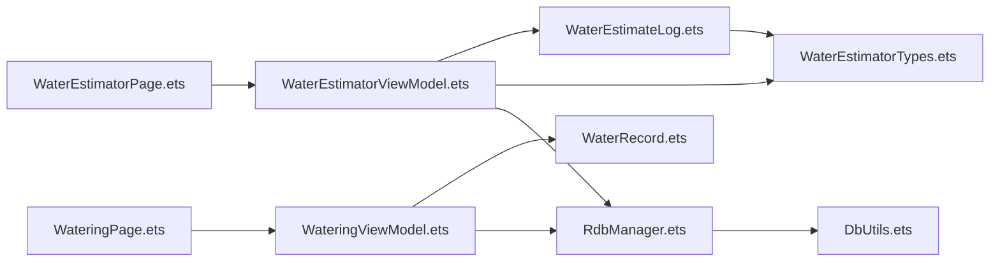

# 浇水数据模型

<cite>
**本文引用的文件**
- [WaterRecord.ets](file://entry/src/main/ets/model/WaterRecord.ets)
- [WaterEstimateLog.ets](file://entry/src/main/ets/model/WaterEstimateLog.ets)
- [WaterEstimatorTypes.ets](file://entry/src/main/ets/model/WaterEstimatorTypes.ets)
- [WateringViewModel.ets](file://entry/src/main/ets/viewmodel/WateringViewModel.ets)
- [WaterEstimatorViewModel.ets](file://entry/src/main/ets/viewmodel/WaterEstimatorViewModel.ets)
- [WaterEstimatorPage.ets](file://entry/src/main/ets/pages/WaterEstimatorPage.ets)
- [WateringPage.ets](file://entry/src/main/ets/pages/WateringPage.ets)
- [RdbManager.ets](file://entry/src/main/ets/viewmodel/RdbManager.ets)
- [DbUtils.ets](file://entry/src/main/ets/model/DbUtils.ets)
</cite>

## 目录
1. [简介](#简介)
2. [项目结构](#项目结构)
3. [核心组件](#核心组件)
4. [架构总览](#架构总览)
5. [详细组件分析](#详细组件分析)
6. [依赖关系分析](#依赖关系分析)
7. [性能考虑](#性能考虑)
8. [故障排查指南](#故障排查指南)
9. [结论](#结论)
10. [附录](#附录)

## 简介
本文件聚焦于植物日记应用中的浇水数据模型，系统性阐述以下内容：
- WaterRecord 与 WaterEstimateLog 的设计理念与实现细节
- 浇水记录的存储格式与估算算法
- 浇水历史的追踪机制与数据完整性保障
- 时间序列处理、用量统计与趋势分析方法
- 具体的使用示例（以路径引用代替代码片段）
- 估算模型参数设置与准确性评估
- 完整的 API 参考与最佳实践

## 项目结构
围绕浇水功能的相关模块分布如下：
- 模型层：WaterRecord、WaterEstimateLog、WaterEstimatorTypes
- 视图模型层：WateringViewModel、WaterEstimatorViewModel
- 页面层：WateringPage、WaterEstimatorPage
- 数据库层：RdbManager、DbUtils

**图表来源**
- [WateringPage.ets](file://entry/src/main/ets/pages/WateringPage.ets)
- [WaterEstimatorPage.ets](file://entry/src/main/ets/pages/WaterEstimatorPage.ets)
- [WateringViewModel.ets](file://entry/src/main/ets/viewmodel/WateringViewModel.ets)
- [WaterEstimatorViewModel.ets](file://entry/src/main/ets/viewmodel/WaterEstimatorViewModel.ets)
- [WaterRecord.ets](file://entry/src/main/ets/model/WaterRecord.ets)
- [WaterEstimateLog.ets](file://entry/src/main/ets/model/WaterEstimateLog.ets)
- [WaterEstimatorTypes.ets](file://entry/src/main/ets/model/WaterEstimatorTypes.ets)
- [RdbManager.ets](file://entry/src/main/ets/viewmodel/RdbManager.ets)
- [DbUtils.ets](file://entry/src/main/ets/model/DbUtils.ets)

**章节来源**
- [WateringPage.ets](file://entry/src/main/ets/pages/WateringPage.ets)
- [WaterEstimatorPage.ets](file://entry/src/main/ets/pages/WaterEstimatorPage.ets)
- [WateringViewModel.ets](file://entry/src/main/ets/viewmodel/WateringViewModel.ets)
- [WaterEstimatorViewModel.ets](file://entry/src/main/ets/viewmodel/WaterEstimatorViewModel.ets)
- [WaterRecord.ets](file://entry/src/main/ets/model/WaterRecord.ets)
- [WaterEstimateLog.ets](file://entry/src/main/ets/model/WaterEstimateLog.ets)
- [WaterEstimatorTypes.ets](file://entry/src/main/ets/model/WaterEstimatorTypes.ets)
- [RdbManager.ets](file://entry/src/main/ets/viewmodel/RdbManager.ets)
- [DbUtils.ets](file://entry/src/main/ets/model/DbUtils.ets)

## 核心组件
- WaterRecord：轻量级浇水记录实体，用于承载单次浇水事件的关键信息（如植物标识、模式、用量、时间戳），便于页面即时生成并交由上层决定是否持久化。
- WaterEstimateLog：估算记录实体，用于保存一次“用量估算”的完整上下文（输入参数、结果区间、创建时间、备注等），支持历史追踪与可追溯性。

关键字段与职责：
- WaterRecord
  - id：记录唯一标识
  - plantId：所属植物标识
  - mode：浇水模式（轻浇/深浇）
  - amountMl：实际用量（ml，可选）
  - createdAt：创建时间（毫秒时间戳）
- WaterEstimateLog
  - id、plantId、diameterCm、depthCm、retention、strategy、plantKind、low、mid、high、createdAt、note

**章节来源**
- [WaterRecord.ets:1-18](file://entry/src/main/ets/model/WaterRecord.ets#L1-L18)
- [WaterEstimateLog.ets:1-25](file://entry/src/main/ets/model/WaterEstimateLog.ets#L1-L25)

## 架构总览
浇水数据模型采用“页面层-视图模型层-模型层-数据库层”的分层设计：
- 页面层负责用户交互与展示
- 视图模型层负责业务逻辑与状态管理
- 模型层负责数据结构与算法
- 数据库层负责持久化与事务控制

**图表来源**
- [WateringPage.ets](file://entry/src/main/ets/pages/WateringPage.ets)
- [WaterEstimatorPage.ets](file://entry/src/main/ets/pages/WaterEstimatorPage.ets)
- [WateringViewModel.ets](file://entry/src/main/ets/viewmodel/WateringViewModel.ets)
- [WaterEstimatorViewModel.ets](file://entry/src/main/ets/viewmodel/WaterEstimatorViewModel.ets)
- [RdbManager.ets](file://entry/src/main/ets/viewmodel/RdbManager.ets)
- [DbUtils.ets](file://entry/src/main/ets/model/DbUtils.ets)

## 详细组件分析

### WaterRecord 组件分析
- 设计理念
  - 轻量化：仅包含必要字段，避免与数据库耦合
  - 可观测：配合视图模型使用，便于 UI 自动刷新
  - 可扩展：预留备注、标签等字段空间
- 关键行为
  - 构造函数自动填充 id、plantId、mode、amountMl、createdAt
  - 用量四舍五入取整，确保数值一致性
- 使用场景
  - 页面调用 recordWater(...) 生成 WaterRecord
  - 上层决定是否写入数据库

**图表来源**
- [WaterRecord.ets:1-18](file://entry/src/main/ets/model/WaterRecord.ets#L1-L18)

**章节来源**
- [WaterRecord.ets:1-18](file://entry/src/main/ets/model/WaterRecord.ets#L1-L18)
- [WateringViewModel.ets:44-57](file://entry/src/main/ets/viewmodel/WateringViewModel.ets#L44-L57)

### WaterEstimateLog 组件分析
- 设计理念
  - 内存版快照：保存估算时的输入与结果，便于回溯
  - 结构化参数：包含介质、策略、植物类型等维度
- 关键行为
  - 构造函数自动填充 id、createdAt
  - 保存时将当前 VM 的输入与结果打包为快照

**图表来源**
- [WaterEstimateLog.ets:1-25](file://entry/src/main/ets/model/WaterEstimateLog.ets#L1-L25)

**章节来源**
- [WaterEstimateLog.ets:1-25](file://entry/src/main/ets/model/WaterEstimateLog.ets#L1-L25)
- [WaterEstimatorViewModel.ets:105-123](file://entry/src/main/ets/viewmodel/WaterEstimatorViewModel.ets#L105-L123)

### 估算算法与参数体系
- 参数维度
  - 盆径（cm）、深度（cm）：几何参数
  - 介质类型（RetentionType）：影响保水/排水能力
  - 浇水策略（StrategyType）：日常保养/彻底浸润
  - 植物类型（PlantKind）：不同植物对水的需求差异
- 算法要点
  - 通过各维度因子相乘得到区间估计（low、mid、high）
  - 公式包含介质孔隙率、策略系数、植物系数等
- 页面呈现
  - 估算器页面实时展示区间与建议文案
  - 支持保存估算记录与“用推荐记一笔浇水”

**图表来源**
- [WaterEstimatorViewModel.ets:74-79](file://entry/src/main/ets/viewmodel/WaterEstimatorViewModel.ets#L74-L79)
- [WaterEstimatorPage.ets:307-342](file://entry/src/main/ets/pages/WaterEstimatorPage.ets#L307-L342)

**章节来源**
- [WaterEstimatorViewModel.ets:17-79](file://entry/src/main/ets/viewmodel/WaterEstimatorViewModel.ets#L17-L79)
- [WaterEstimatorPage.ets:307-342](file://entry/src/main/ets/pages/WaterEstimatorPage.ets#L307-L342)

### 历史追踪与数据完整性
- 浇水历史（内存）
  - WateringViewModel 维护最近 N 次浇水时间戳数组，用于计算连续天数
  - 连续天数计算考虑跨天边界与时间误差（容错）
- 估算历史（内存）
  - WaterEstimatorViewModel 维护估算日志列表，新记录插入到最前
- 数据库层
  - RdbManager 负责建表、索引与事务
  - DbUtils 提供统一事务封装，确保批量写入原子性

**图表来源**
- [WateringViewModel.ets:44-88](file://entry/src/main/ets/viewmodel/WateringViewModel.ets#L44-L88)

**章节来源**
- [WateringViewModel.ets:20-23](file://entry/src/main/ets/viewmodel/WateringViewModel.ets#L20-L23)
- [WateringViewModel.ets:66-88](file://entry/src/main/ets/viewmodel/WateringViewModel.ets#L66-L88)
- [RdbManager.ets:62-69](file://entry/src/main/ets/viewmodel/RdbManager.ets#L62-L69)
- [DbUtils.ets:12-21](file://entry/src/main/ets/model/DbUtils.ets#L12-L21)

### 时间序列处理、用量统计与趋势分析
- 时间序列
  - 以 createdAt 为时间轴，recentTimes 作为降序序列
  - 支持按日期边界与容差计算连续性
- 用量统计
  - WaterRecord.amountMl 为实际用量；估算区间由 WaterEstimateLog 提供
- 趋势分析
  - 建议结合历史记录与指标表（如 metric 表）进行可视化分析（页面层可扩展）

**章节来源**
- [WateringViewModel.ets:20-23](file://entry/src/main/ets/viewmodel/WateringViewModel.ets#L20-L23)
- [WateringViewModel.ets:66-88](file://entry/src/main/ets/viewmodel/WateringViewModel.ets#L66-L88)
- [WaterRecord.ets:7](file://entry/src/main/ets/model/WaterRecord.ets#L7)
- [WaterEstimateLog.ets:14-16](file://entry/src/main/ets/model/WaterEstimateLog.ets#L14-L16)

### API 参考与最佳实践

- WaterRecord
  - 字段
    - id: string
    - plantId: string
    - mode: string
    - amountMl: number
    - createdAt: number
  - 构造函数
    - 传入 id、plantId、mode、amountMl，自动填充 createdAt
  - 使用建议
    - 仅承载必要字段，避免与数据库耦合
    - 用量取整，保证统计一致性

- WaterEstimateLog
  - 字段
    - id: string
    - plantId: number
    - diameterCm: number
    - depthCm: number
    - retention: RetentionType
    - strategy: StrategyType
    - plantKind: PlantKind
    - low: number
    - mid: number
    - high: number
    - createdAt: number
    - note: string
  - 构造函数
    - 传入 id，自动填充 createdAt
  - 使用建议
    - 保存时打包当前 VM 的输入与结果，确保可追溯

- WateringViewModel
  - 关键方法
    - setMode(mode): 设置浇水模式
    - recordWater(amountMl): 生成 WaterRecord 并更新内存历史
    - lastWaterAt(): 获取最近浇水时间
    - fmtDate(ts): 格式化时间显示
  - 最佳实践
    - 将 recordWater 产生的 WaterRecord 交由上层决定是否持久化
    - 使用 fmtDate 统一时间显示格式

- WaterEstimatorViewModel
  - 关键方法
    - setDiameter/setDepth/setRetention/setStrategy/setPlant：设置输入参数并自动重算
    - compute：触发区间重算
    - getSuggestText/getFormulaBrief：生成建议与公式说明
    - saveLog(note)：保存估算记录
  - 最佳实践
    - 输入参数限制范围（如 6-60）并取整
    - 估算结果作为区间值，便于用户安全操作

- 页面与持久化
  - WateringPage/WaterEstimatorPage：负责用户交互与展示
  - RdbManager：负责建表、索引与查询
  - DbUtils：提供事务封装，确保批量写入原子性

**章节来源**
- [WaterRecord.ets:1-18](file://entry/src/main/ets/model/WaterRecord.ets#L1-L18)
- [WaterEstimateLog.ets:1-25](file://entry/src/main/ets/model/WaterEstimateLog.ets#L1-L25)
- [WateringViewModel.ets:11-96](file://entry/src/main/ets/viewmodel/WateringViewModel.ets#L11-L96)
- [WaterEstimatorViewModel.ets:17-129](file://entry/src/main/ets/viewmodel/WaterEstimatorViewModel.ets#L17-L129)
- [WaterEstimatorPage.ets:15-490](file://entry/src/main/ets/pages/WaterEstimatorPage.ets#L15-L490)
- [RdbManager.ets:4-296](file://entry/src/main/ets/viewmodel/RdbManager.ets#L4-L296)
- [DbUtils.ets:12-21](file://entry/src/main/ets/model/DbUtils.ets#L12-L21)

## 依赖关系分析
- 组件耦合
  - WateringViewModel 依赖 WaterRecord
  - WaterEstimatorViewModel 依赖 WaterEstimateLog 与 WaterEstimatorTypes
  - 页面层依赖对应的 ViewModel
- 外部依赖
  - 数据库：ArkData relationalStore
  - 事务：DbUtils.runInTransaction

**图表来源**
- [WateringPage.ets](file://entry/src/main/ets/pages/WateringPage.ets)
- [WaterEstimatorPage.ets](file://entry/src/main/ets/pages/WaterEstimatorPage.ets)
- [WateringViewModel.ets](file://entry/src/main/ets/viewmodel/WateringViewModel.ets)
- [WaterEstimatorViewModel.ets](file://entry/src/main/ets/viewmodel/WaterEstimatorViewModel.ets)
- [WaterRecord.ets](file://entry/src/main/ets/model/WaterRecord.ets)
- [WaterEstimateLog.ets](file://entry/src/main/ets/model/WaterEstimateLog.ets)
- [WaterEstimatorTypes.ets](file://entry/src/main/ets/model/WaterEstimatorTypes.ets)
- [RdbManager.ets](file://entry/src/main/ets/viewmodel/RdbManager.ets)
- [DbUtils.ets](file://entry/src/main/ets/model/DbUtils.ets)

**章节来源**
- [WateringViewModel.ets:3](file://entry/src/main/ets/viewmodel/WateringViewModel.ets#L3)
- [WaterEstimatorViewModel.ets:4-8](file://entry/src/main/ets/viewmodel/WaterEstimatorViewModel.ets#L4-L8)

## 性能考虑
- 内存占用
  - WateringViewModel 的 recentTimes 限制长度，避免无限增长
  - WaterEstimatorViewModel 的 logs 采用头插法，保持最新在前
- 计算效率
  - 估算计算在 ViewModel 中即时完成，减少页面交互延迟
- 数据库性能
  - RdbManager 为常用查询建立复合索引，提升查询效率
  - 事务封装避免频繁提交带来的开销

**章节来源**
- [WateringViewModel.ets:20-23](file://entry/src/main/ets/viewmodel/WateringViewModel.ets#L20-L23)
- [WaterEstimatorViewModel.ets:32](file://entry/src/main/ets/viewmodel/WaterEstimatorViewModel.ets#L32)
- [RdbManager.ets:152-169](file://entry/src/main/ets/viewmodel/RdbManager.ets#L152-L169)
- [DbUtils.ets:12-21](file://entry/src/main/ets/model/DbUtils.ets#L12-L21)

## 故障排查指南
- 估算结果异常
  - 检查输入参数范围与取整逻辑
  - 确认介质/策略/植物类型的系数是否符合预期
- 历史记录不正确
  - 检查连续天数计算的容差与日期边界逻辑
  - 确认 recentTimes 的更新顺序
- 数据持久化失败
  - 使用事务封装确保批量写入原子性
  - 检查数据库建表与索引是否初始化完成

**章节来源**
- [WateringViewModel.ets:66-88](file://entry/src/main/ets/viewmodel/WateringViewModel.ets#L66-L88)
- [DbUtils.ets:12-21](file://entry/src/main/ets/model/DbUtils.ets#L12-L21)
- [RdbManager.ets:27-170](file://entry/src/main/ets/viewmodel/RdbManager.ets#L27-L170)

## 结论
本浇水数据模型通过轻量实体与可观测视图模型实现了高效的浇水记录与估算功能。模型具备良好的可追溯性与扩展性，配合数据库层的事务与索引设计，能够满足日常使用与进一步分析的需求。建议在生产环境中：
- 明确记录与持久化的边界，优先使用 WaterRecord 作为中间态
- 严格控制估算参数范围并进行取整处理
- 使用事务封装保证数据一致性
- 在页面层扩展趋势分析与报表功能

## 附录

### 示例：记录一次浇水
- 步骤
  - 调用 WateringViewModel.recordWater(amountMl)
  - 获取 WaterRecord 实例
  - 根据业务需求决定是否写入数据库
- 参考路径
  - [WateringViewModel.ets:44-57](file://entry/src/main/ets/viewmodel/WateringViewModel.ets#L44-L57)
  - [WaterRecord.ets:10-16](file://entry/src/main/ets/model/WaterRecord.ets#L10-L16)

### 示例：计算用水量并生成估算记录
- 步骤
  - 设置盆径/深度/介质/策略/植物类型
  - 调用 WaterEstimatorViewModel.compute()
  - 保存估算记录：saveLog(note)
- 参考路径
  - [WaterEstimatorViewModel.ets:41-79](file://entry/src/main/ets/viewmodel/WaterEstimatorViewModel.ets#L41-L79)
  - [WaterEstimatorViewModel.ets:105-123](file://entry/src/main/ets/viewmodel/WaterEstimatorViewModel.ets#L105-L123)

### 示例：生成浇水报告（概念性）
- 步骤
  - 汇总 WaterRecord 的 amountMl 与 WaterEstimateLog 的区间
  - 按日期聚合，计算周/月均值
  - 生成可视化图表与建议
- 参考路径
  - [WaterRecord.ets:7](file://entry/src/main/ets/model/WaterRecord.ets#L7)
  - [WaterEstimateLog.ets:14-16](file://entry/src/main/ets/model/WaterEstimateLog.ets#L14-L16)