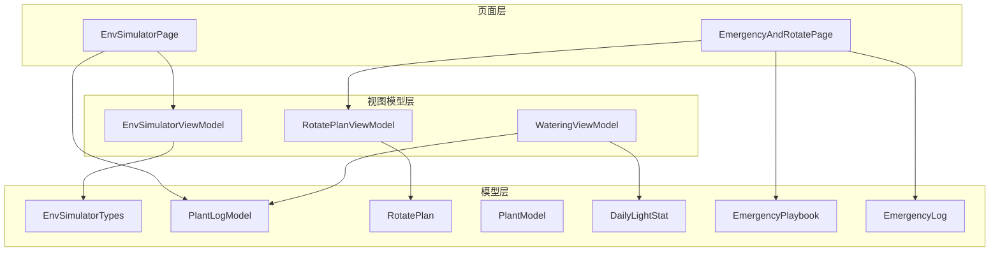
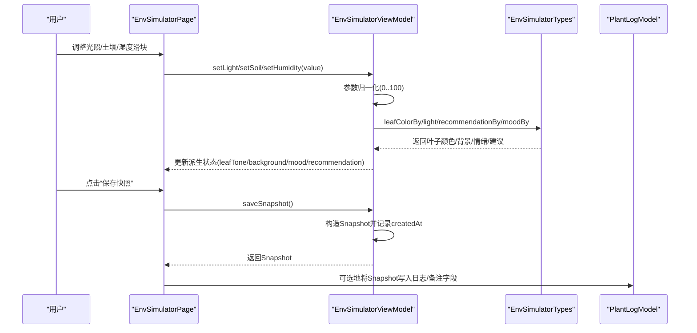
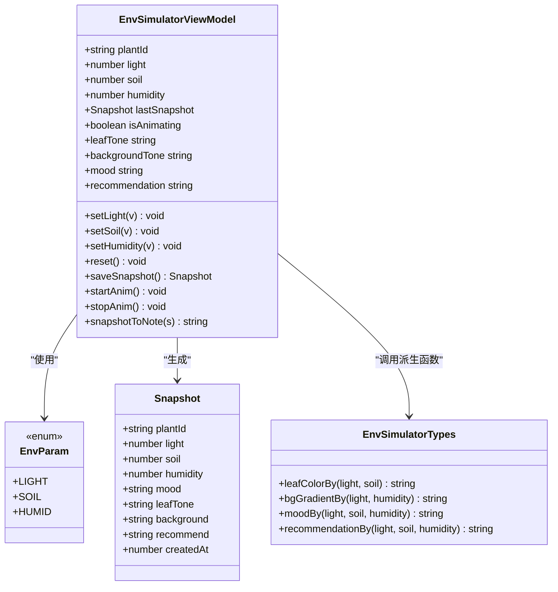
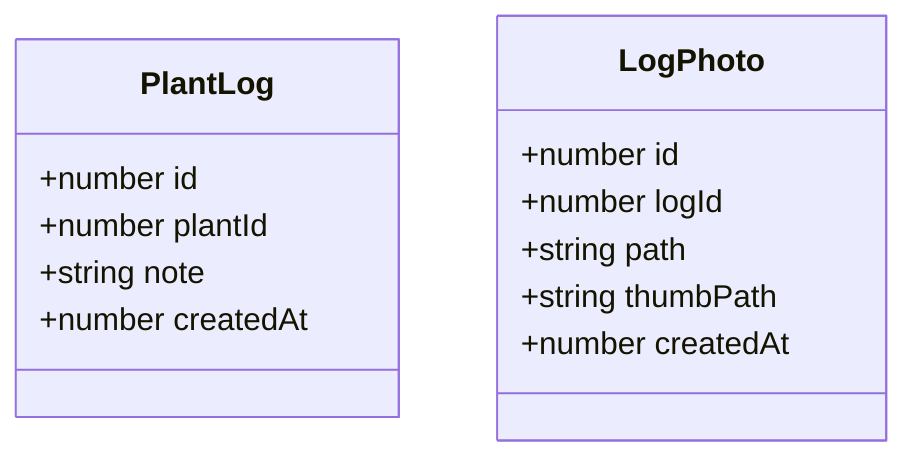
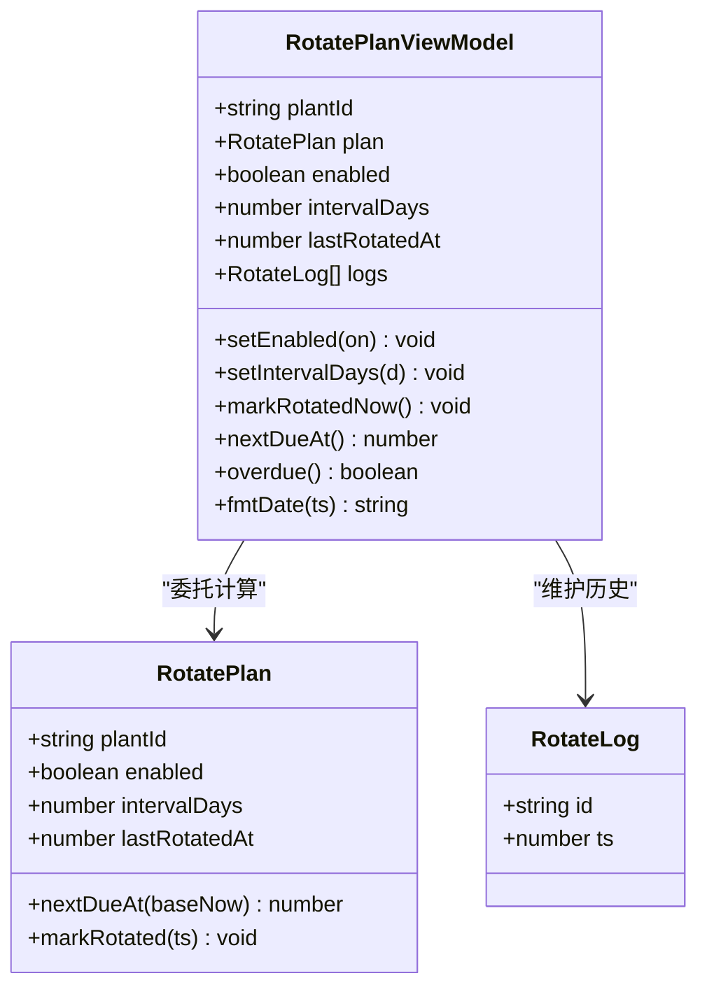
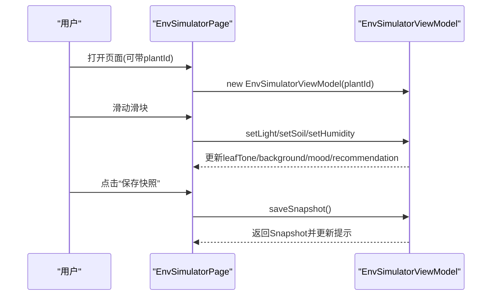
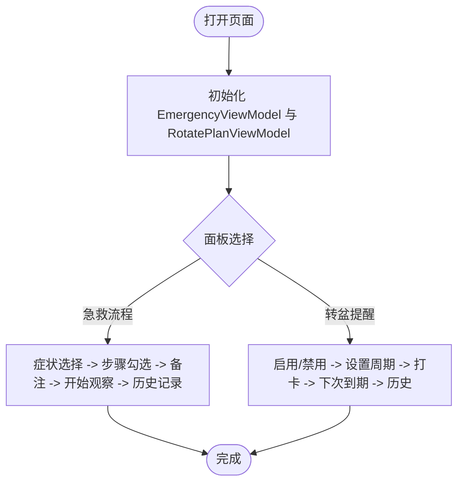
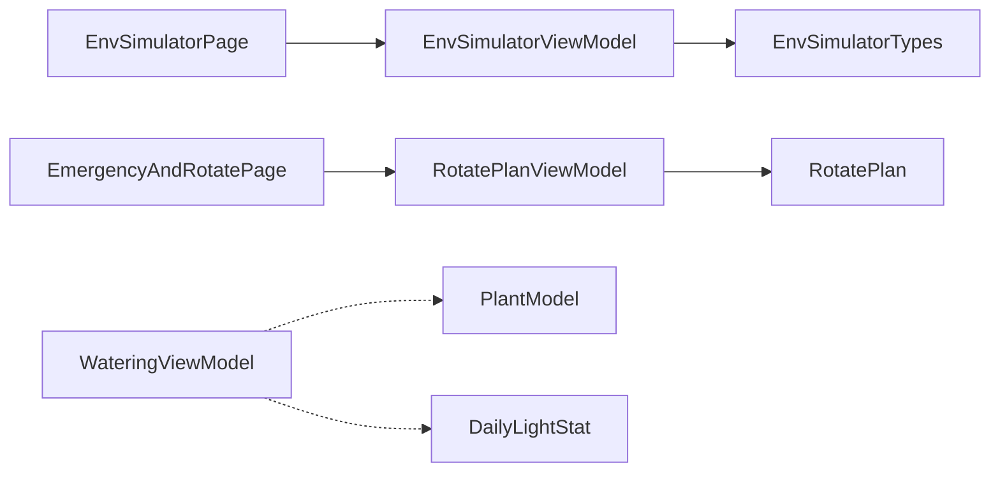

# 环境模拟数据模型

<cite>
**本文引用的文件**
- [EnvSimulatorTypes.ets](file://entry/src/main/ets/model/EnvSimulatorTypes.ets)
- [PlantLogModel.ets](file://entry/src/main/ets/model/PlantLogModel.ets)
- [RotatePlan.ets](file://entry/src/main/ets/model/RotatePlan.ets)
- [EnvSimulatorViewModel.ets](file://entry/src/main/ets/viewmodel/EnvSimulatorViewModel.ets)
- [RotatePlanViewModel.ets](file://entry/src/main/ets/viewmodel/RotatePlanViewModel.ets)
- [EnvSimulatorPage.ets](file://entry/src/main/ets/pages/EnvSimulatorPage.ets)
- [EmergencyAndRotatePage.ets](file://entry/src/main/ets/pages/EmergencyAndRotatePage.ets)
- [PlantModel.ets](file://entry/src/main/ets/model/PlantModel.ets)
- [DailyLightStat.ets](file://entry/src/main/ets/model/DailyLightStat.ets)
- [EmergencyPlaybook.ets](file://entry/src/main/ets/model/EmergencyPlaybook.ets)
- [EmergencyLog.ets](file://entry/src/main/ets/model/EmergencyLog.ets)
- [WateringViewModel.ets](file://entry/src/main/ets/viewmodel/WateringViewModel.ets)
</cite>

## 目录
1. [简介](#简介)
2. [项目结构](#项目结构)
3. [核心组件](#核心组件)
4. [架构总览](#架构总览)
5. [详细组件分析](#详细组件分析)
6. [依赖关系分析](#依赖关系分析)
7. [性能考量](#性能考量)
8. [故障排查指南](#故障排查指南)
9. [结论](#结论)
10. [附录：API参考与配置指南](#附录api参考与配置指南)

## 简介
本文件系统性梳理 PlantDiary 项目中的环境模拟数据模型，重点覆盖以下主题：
- 环境模拟类型定义与参数配置：EnvSimulatorTypes 的参数枚举、快照结构与派生状态计算。
- 植物日志记录的数据结构：PlantLog 与 LogPhoto 的设计与使用场景。
- 旋转计划的制定逻辑与执行状态管理：RotatePlan 与 RotatePlanViewModel 的职责划分与到期判断。
- 环境模拟的算法原理与参数调优：基于光照、土壤湿度、空气湿度的叶子颜色、背景渐变、情绪与建议生成策略。
- 实际使用示例：如何在页面中配置环境模拟、记录植物日志、管理旋转计划。
- API 参考与配置指南：面向开发者与产品配置人员的完整参考。

## 项目结构
围绕环境模拟与植物日志的核心文件组织如下：
- 模型层（model）：EnvSimulatorTypes、PlantLogModel、RotatePlan、PlantModel、DailyLightStat、EmergencyPlaybook、EmergencyLog 等。
- 视图模型层（viewmodel）：EnvSimulatorViewModel、RotatePlanViewModel、WateringViewModel 等。
- 页面层（pages）：EnvSimulatorPage、EmergencyAndRotatePage 等，负责用户交互与状态展示。

图表来源
- [EnvSimulatorPage.ets:1-123](file://entry/src/main/ets/pages/EnvSimulatorPage.ets#L1-L123)
- [EmergencyAndRotatePage.ets:1-557](file://entry/src/main/ets/pages/EmergencyAndRotatePage.ets#L1-L557)
- [EnvSimulatorViewModel.ets:1-108](file://entry/src/main/ets/viewmodel/EnvSimulatorViewModel.ets#L1-L108)
- [RotatePlanViewModel.ets:1-88](file://entry/src/main/ets/viewmodel/RotatePlanViewModel.ets#L1-L88)
- [EnvSimulatorTypes.ets:1-96](file://entry/src/main/ets/model/EnvSimulatorTypes.ets#L1-L96)
- [PlantLogModel.ets:1-58](file://entry/src/main/ets/model/PlantLogModel.ets#L1-L58)
- [RotatePlan.ets:1-25](file://entry/src/main/ets/model/RotatePlan.ets#L1-L25)
- [PlantModel.ets:1-166](file://entry/src/main/ets/model/PlantModel.ets#L1-L166)
- [DailyLightStat.ets:1-30](file://entry/src/main/ets/model/DailyLightStat.ets#L1-L30)
- [EmergencyPlaybook.ets:1-81](file://entry/src/main/ets/model/EmergencyPlaybook.ets#L1-L81)
- [EmergencyLog.ets:1-20](file://entry/src/main/ets/model/EmergencyLog.ets#L1-L20)
- [WateringViewModel.ets:1-102](file://entry/src/main/ets/viewmodel/WateringViewModel.ets#L1-L102)

章节来源
- [EnvSimulatorPage.ets:1-123](file://entry/src/main/ets/pages/EnvSimulatorPage.ets#L1-L123)
- [EmergencyAndRotatePage.ets:1-557](file://entry/src/main/ets/pages/EmergencyAndRotatePage.ets#L1-L557)

## 核心组件
- 环境模拟类型与派生状态：EnvSimulatorTypes 定义环境参数枚举、快照结构以及叶子颜色、背景渐变、情绪与建议的计算函数；EnvSimulatorViewModel 将参数映射为 UI 友好状态并提供快照导出。
- 植物日志模型：PlantLog 与 LogPhoto 描述日志与日志照片的结构，支持与数据库交互与附件管理。
- 旋转计划模型：RotatePlan 与 RotatePlanViewModel 负责周期设定、到期判断、打卡记录与历史展示。
- 光照统计模型：DailyLightStat 用于光照达标率与状态的统计展示。
- 急救与转盆整合页：EmergencyAndRotatePage 将“急救流程卡”和“转盆提醒”整合在一个页面中，分别由独立 VM 管理。

章节来源
- [EnvSimulatorTypes.ets:1-96](file://entry/src/main/ets/model/EnvSimulatorTypes.ets#L1-L96)
- [EnvSimulatorViewModel.ets:1-108](file://entry/src/main/ets/viewmodel/EnvSimulatorViewModel.ets#L1-L108)
- [PlantLogModel.ets:1-58](file://entry/src/main/ets/model/PlantLogModel.ets#L1-L58)
- [RotatePlan.ets:1-25](file://entry/src/main/ets/model/RotatePlan.ets#L1-L25)
- [RotatePlanViewModel.ets:1-88](file://entry/src/main/ets/viewmodel/RotatePlanViewModel.ets#L1-L88)
- [DailyLightStat.ets:1-30](file://entry/src/main/ets/model/DailyLightStat.ets#L1-L30)
- [EmergencyAndRotatePage.ets:1-557](file://entry/src/main/ets/pages/EmergencyAndRotatePage.ets#L1-L557)

## 架构总览
环境模拟数据模型采用“模型-视图模型-页面”的分层架构：
- 模型层：纯数据结构与纯函数，不包含副作用，便于测试与复用。
- 视图模型层：承载业务状态与派生逻辑，负责与页面交互与数据转换。
- 页面层：负责用户输入、状态展示与导航。

图表来源
- [EnvSimulatorPage.ets:1-123](file://entry/src/main/ets/pages/EnvSimulatorPage.ets#L1-L123)
- [EnvSimulatorViewModel.ets:1-108](file://entry/src/main/ets/viewmodel/EnvSimulatorViewModel.ets#L1-L108)
- [EnvSimulatorTypes.ets:1-96](file://entry/src/main/ets/model/EnvSimulatorTypes.ets#L1-L96)
- [PlantLogModel.ets:1-58](file://entry/src/main/ets/model/PlantLogModel.ets#L1-L58)

## 详细组件分析

### 环境模拟类型与派生状态（EnvSimulatorTypes 与 EnvSimulatorViewModel）
- 参数枚举与快照结构
  - 参数枚举：LIGHT、SOIL、HUMID，用于统一环境参数名称。
  - 快照结构：包含植物ID、光照、土壤湿度、空气湿度、情绪、叶子色调、背景色调、建议、创建时间等字段。
- 派生状态计算
  - 叶子颜色：根据光照与土壤湿度生成绿色系色调，考虑干旱、光照不足、强光与正常区间。
  - 背景渐变：根据光照与空气湿度生成单色背景，亮度随光照增强而提升，湿度影响蓝色分量。
  - 情绪：综合光照、土壤湿度与空气湿度，输出表情或短文本。
  - 建议：针对异常状态给出具体养护建议。
- 视图模型职责
  - 参数范围约束：setLight/setSoil/setHumidity 将输入限制在 0..100。
  - 派生状态：leafTone、backgroundTone、mood、recommendation 直接暴露给页面。
  - 快照导出：saveSnapshot 返回当前状态快照，供页面或上层决定是否持久化。
  - 动画控制：startAnim/stopAnim 控制 isAnimating，用于禁用交互。

图表来源
- [EnvSimulatorTypes.ets:1-96](file://entry/src/main/ets/model/EnvSimulatorTypes.ets#L1-L96)
- [EnvSimulatorViewModel.ets:1-108](file://entry/src/main/ets/viewmodel/EnvSimulatorViewModel.ets#L1-L108)

章节来源
- [EnvSimulatorTypes.ets:1-96](file://entry/src/main/ets/model/EnvSimulatorTypes.ets#L1-L96)
- [EnvSimulatorViewModel.ets:1-108](file://entry/src/main/ets/viewmodel/EnvSimulatorViewModel.ets#L1-L108)

### 植物日志记录（PlantLogModel）
- PlantLog：记录日志的唯一标识、关联植物ID、内容/备注、创建时间戳。
- LogPhoto：记录与日志关联的照片，包含原图路径、缩略图路径、创建时间戳。
- 使用场景：页面新增日志、删除日志与照片、批量删除、照片预览与管理等。

图表来源
- [PlantLogModel.ets:1-58](file://entry/src/main/ets/model/PlantLogModel.ets#L1-L58)

章节来源
- [PlantLogModel.ets:1-58](file://entry/src/main/ets/model/PlantLogModel.ets#L1-L58)

### 旋转计划（RotatePlan 与 RotatePlanViewModel）
- RotatePlan：内存版计划对象，包含植物ID、启用状态、周期（天）、最近一次转盆时间戳。
- 计算逻辑：
  - nextDueAt：以最近一次转盆时间或当前时间为基准，加上周期毫秒数，得到下次到期时间。
  - markRotated：更新最近一次转盆时间为当前时间。
- RotatePlanViewModel：
  - 暴露给页面的扁平字段，内部委托 RotatePlan 完成计算。
  - 设置周期与启用状态，记录打卡并维护历史列表。
  - overdue：基于 nextDueAt 判断是否已到期。
  - fmtDate：格式化时间显示。

图表来源
- [RotatePlan.ets:1-25](file://entry/src/main/ets/model/RotatePlan.ets#L1-L25)
- [RotatePlanViewModel.ets:1-88](file://entry/src/main/ets/viewmodel/RotatePlanViewModel.ets#L1-L88)

章节来源
- [RotatePlan.ets:1-25](file://entry/src/main/ets/model/RotatePlan.ets#L1-L25)
- [RotatePlanViewModel.ets:1-88](file://entry/src/main/ets/viewmodel/RotatePlanViewModel.ets#L1-L88)

### 环境模拟页面与交互（EnvSimulatorPage）
- 页面职责：接收植物ID参数，创建 EnvSimulatorViewModel；提供滑块调整光照、土壤湿度、空气湿度；展示派生状态与保存快照。
- 交互要点：在动画期间禁用滑块交互，防止状态抖动；保存快照后更新提示文本。

图表来源
- [EnvSimulatorPage.ets:1-123](file://entry/src/main/ets/pages/EnvSimulatorPage.ets#L1-L123)
- [EnvSimulatorViewModel.ets:1-108](file://entry/src/main/ets/viewmodel/EnvSimulatorViewModel.ets#L1-L108)

章节来源
- [EnvSimulatorPage.ets:1-123](file://entry/src/main/ets/pages/EnvSimulatorPage.ets#L1-L123)

### 急救与转盆整合页（EmergencyAndRotatePage）
- 页面职责：在“急救流程”和“转盆提醒”两个面板间切换；分别由 EmergencyViewModel 与 RotatePlanViewModel 管理。
- 转盆面板功能：启用/禁用计划、设置周期、打卡转盆、查看下次到期与历史记录。
- 急救面板功能：症状选择、步骤卡片、备注与开始观察、历史记录管理。

图表来源
- [EmergencyAndRotatePage.ets:1-557](file://entry/src/main/ets/pages/EmergencyAndRotatePage.ets#L1-L557)
- [RotatePlanViewModel.ets:1-88](file://entry/src/main/ets/viewmodel/RotatePlanViewModel.ets#L1-L88)

章节来源
- [EmergencyAndRotatePage.ets:1-557](file://entry/src/main/ets/pages/EmergencyAndRotatePage.ets#L1-L557)

### 光照统计模型（DailyLightStat）
- 用途：记录每日光照统计，包括累积光照量、总时长、最大光照强度、达标率与状态。
- 字段：id、plantId、date、luxMinutes、durationMin、maxLux、rate、status。
- 适用场景：环形进度图与7日条形图的数据来源。

章节来源
- [DailyLightStat.ets:1-30](file://entry/src/main/ets/model/DailyLightStat.ets#L1-L30)

### 急救方案与记录（EmergencyPlaybook 与 EmergencyLog）
- EmergencyPlaybook：内置急救方案清单，包含症状键、标题、步骤、复查小时数与提示。
- EmergencyLog：急救记录实体，包含症状键、标题、开始与复查时间、步骤完成状态、备注与完成状态。

章节来源
- [EmergencyPlaybook.ets:1-81](file://entry/src/main/ets/model/EmergencyPlaybook.ets#L1-L81)
- [EmergencyLog.ets:1-20](file://entry/src/main/ets/model/EmergencyLog.ets#L1-L20)

## 依赖关系分析
- EnvSimulatorViewModel 依赖 EnvSimulatorTypes 的派生函数，用于生成叶子颜色、背景渐变、情绪与建议。
- RotatePlanViewModel 依赖 RotatePlan 的到期计算与打卡更新，并维护历史列表。
- 页面层通过 VM 间接依赖模型层，实现数据驱动的 UI 更新。
- WateringViewModel 与 PlantModel/DailyLightStat 解耦，仅在需要时被页面或上层服务使用。

图表来源
- [EnvSimulatorViewModel.ets:1-108](file://entry/src/main/ets/viewmodel/EnvSimulatorViewModel.ets#L1-L108)
- [EnvSimulatorTypes.ets:1-96](file://entry/src/main/ets/model/EnvSimulatorTypes.ets#L1-L96)
- [RotatePlanViewModel.ets:1-88](file://entry/src/main/ets/viewmodel/RotatePlanViewModel.ets#L1-L88)
- [RotatePlan.ets:1-25](file://entry/src/main/ets/model/RotatePlan.ets#L1-L25)
- [EnvSimulatorPage.ets:1-123](file://entry/src/main/ets/pages/EnvSimulatorPage.ets#L1-L123)
- [EmergencyAndRotatePage.ets:1-557](file://entry/src/main/ets/pages/EmergencyAndRotatePage.ets#L1-L557)
- [WateringViewModel.ets:1-102](file://entry/src/main/ets/viewmodel/WateringViewModel.ets#L1-L102)
- [PlantModel.ets:1-166](file://entry/src/main/ets/model/PlantModel.ets#L1-L166)
- [DailyLightStat.ets:1-30](file://entry/src/main/ets/model/DailyLightStat.ets#L1-L30)

## 性能考量
- 环境模拟计算为纯函数与纯计算型 VM，避免不必要的数据库访问，适合高频交互场景。
- 参数范围约束与派生状态缓存（lastSnapshot）减少重复计算。
- 页面层通过 isAnimating 禁用交互，避免动画期间的状态抖动。
- RotatePlanViewModel 的历史列表采用头插法，保持最新记录在前，便于展示与统计。

[本节为通用指导，无需列出章节来源]

## 故障排查指南
- 环境模拟无响应
  - 检查页面是否处于动画状态（isAnimating），若为 true，滑块交互会被禁用。
  - 确认 EnvSimulatorViewModel 的参数是否在 0..100 范围内。
- 快照未保存
  - 确认 saveSnapshot 是否被调用，且返回的 Snapshot 中 createdAt 是否为当前时间。
  - 若需持久化，页面应自行将快照写入数据库或日志备注字段。
- 旋转计划未到期
  - 检查 enabled 与 intervalDays 设置，确认 nextDueAt 是否正确。
  - 打卡后 lastRotatedAt 应更新，overdue 应变为 false。
- 急救流程无法开始
  - 确认症状选择与步骤勾选状态，确保开始观察按钮可用。
  - 检查 EmergencyViewModel 的 logs 列表是否正确更新。

章节来源
- [EnvSimulatorViewModel.ets:1-108](file://entry/src/main/ets/viewmodel/EnvSimulatorViewModel.ets#L1-L108)
- [EnvSimulatorPage.ets:1-123](file://entry/src/main/ets/pages/EnvSimulatorPage.ets#L1-L123)
- [RotatePlanViewModel.ets:1-88](file://entry/src/main/ets/viewmodel/RotatePlanViewModel.ets#L1-L88)
- [EmergencyAndRotatePage.ets:1-557](file://entry/src/main/ets/pages/EmergencyAndRotatePage.ets#L1-L557)

## 结论
本数据模型以“纯函数+纯计算型 VM”的方式实现了环境模拟与植物日志管理的关键能力，具备良好的可测试性与可扩展性。EnvSimulatorTypes 提供了直观的参数与派生状态映射，PlantLogModel 支撑了日志与附件的完整生命周期，RotatePlan 与 RotatePlanViewModel 则提供了简洁可靠的周期管理与到期提醒。页面层通过 VM 与模型解耦，既保证了交互流畅，又便于后续扩展与维护。

[本节为总结性内容，无需列出章节来源]

## 附录：API参考与配置指南

### 环境模拟类型与参数配置
- 参数枚举
  - LIGHT、SOIL、HUMID
- 快照结构
  - 字段：plantId、light、soil、humidity、mood、leafTone、background、recommend、createdAt
- 派生函数
  - leafColorBy(light, soil)：根据光照与土壤湿度生成叶子颜色。
  - bgGradientBy(light, humidity)：根据光照与空气湿度生成背景色调。
  - moodBy(light, soil, humidity)：综合判断植物情绪。
  - recommendationBy(light, soil, humidity)：针对异常状态给出建议。
- 视图模型方法
  - setLight(v)、setSoil(v)、setHumidity(v)：设置参数并约束范围。
  - reset()：重置为默认值。
  - saveSnapshot()：生成快照。
  - startAnim()/stopAnim()：控制动画期间的交互。
  - snapshotToNote(s)：将快照序列化为备注字符串。

章节来源
- [EnvSimulatorTypes.ets:1-96](file://entry/src/main/ets/model/EnvSimulatorTypes.ets#L1-L96)
- [EnvSimulatorViewModel.ets:1-108](file://entry/src/main/ets/viewmodel/EnvSimulatorViewModel.ets#L1-L108)

### 植物日志模型
- PlantLog
  - 字段：id、plantId、note、createdAt
- LogPhoto
  - 字段：id、logId、path、thumbPath、createdAt

章节来源
- [PlantLogModel.ets:1-58](file://entry/src/main/ets/model/PlantLogModel.ets#L1-L58)

### 旋转计划模型
- RotatePlan
  - 字段：plantId、enabled、intervalDays、lastRotatedAt
  - 方法：nextDueAt(baseNow)、markRotated(ts)
- RotatePlanViewModel
  - 字段：plantId、plan、enabled、intervalDays、lastRotatedAt、logs
  - 方法：setEnabled(on)、setIntervalDays(d)、markRotatedNow()、nextDueAt()、overdue()、fmtDate(ts)

章节来源
- [RotatePlan.ets:1-25](file://entry/src/main/ets/model/RotatePlan.ets#L1-L25)
- [RotatePlanViewModel.ets:1-88](file://entry/src/main/ets/viewmodel/RotatePlanViewModel.ets#L1-L88)

### 页面使用示例（路径指引）
- 环境模拟页面
  - 页面：EnvSimulatorPage
  - 关键交互：滑块 onChange -> setLight/setSoil/setHumidity；保存快照 -> saveSnapshot
  - 示例路径：[EnvSimulatorPage.ets:1-123](file://entry/src/main/ets/pages/EnvSimulatorPage.ets#L1-L123)
- 急救与转盆整合页
  - 页面：EmergencyAndRotatePage
  - 转盆面板：启用/禁用、设置周期、打卡、查看下次到期与历史
  - 示例路径：[EmergencyAndRotatePage.ets:1-557](file://entry/src/main/ets/pages/EmergencyAndRotatePage.ets#L1-L557)

章节来源
- [EnvSimulatorPage.ets:1-123](file://entry/src/main/ets/pages/EnvSimulatorPage.ets#L1-L123)
- [EmergencyAndRotatePage.ets:1-557](file://entry/src/main/ets/pages/EmergencyAndRotatePage.ets#L1-L557)

### 环境模拟算法原理与参数调优
- 叶子颜色算法
  - 干旱（soil < 25）：发灰偏褐
  - 光照不足（light < 30）：深绿偏暗
  - 强光（light > 85）：黄褐
  - 正常绿：根据 soil 调节鲜艳度，范围限制在 60..220
- 背景渐变算法
  - 亮度随光照增强：180 + (light - 50) * 0.7，限制在 100..255
  - 蓝色分量随湿度降低：200 - (humidity - 50) * 0.5，限制在 100..255
- 情绪与建议
  - 综合光照、土壤湿度与空气湿度，给出健康或异常状态的提示与建议
- 参数调优建议
  - 将输入参数限制在 0..100，确保派生状态稳定
  - 对极端阈值进行边界测试（如极低光照、极高湿度）
  - 在页面层通过 isAnimating 禁用交互，避免动画期间的状态抖动

章节来源
- [EnvSimulatorTypes.ets:1-96](file://entry/src/main/ets/model/EnvSimulatorTypes.ets#L1-L96)
- [EnvSimulatorViewModel.ets:1-108](file://entry/src/main/ets/viewmodel/EnvSimulatorViewModel.ets#L1-L108)
- [EnvSimulatorPage.ets:1-123](file://entry/src/main/ets/pages/EnvSimulatorPage.ets#L1-L123)