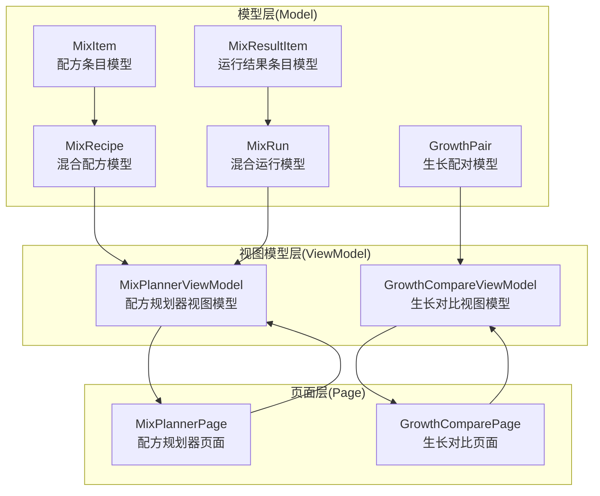
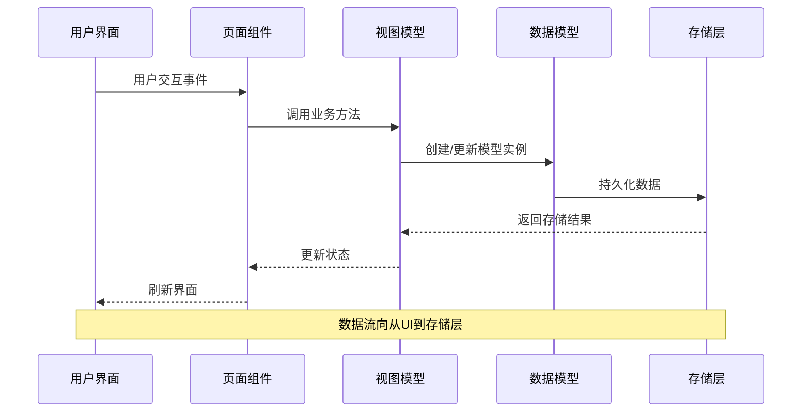
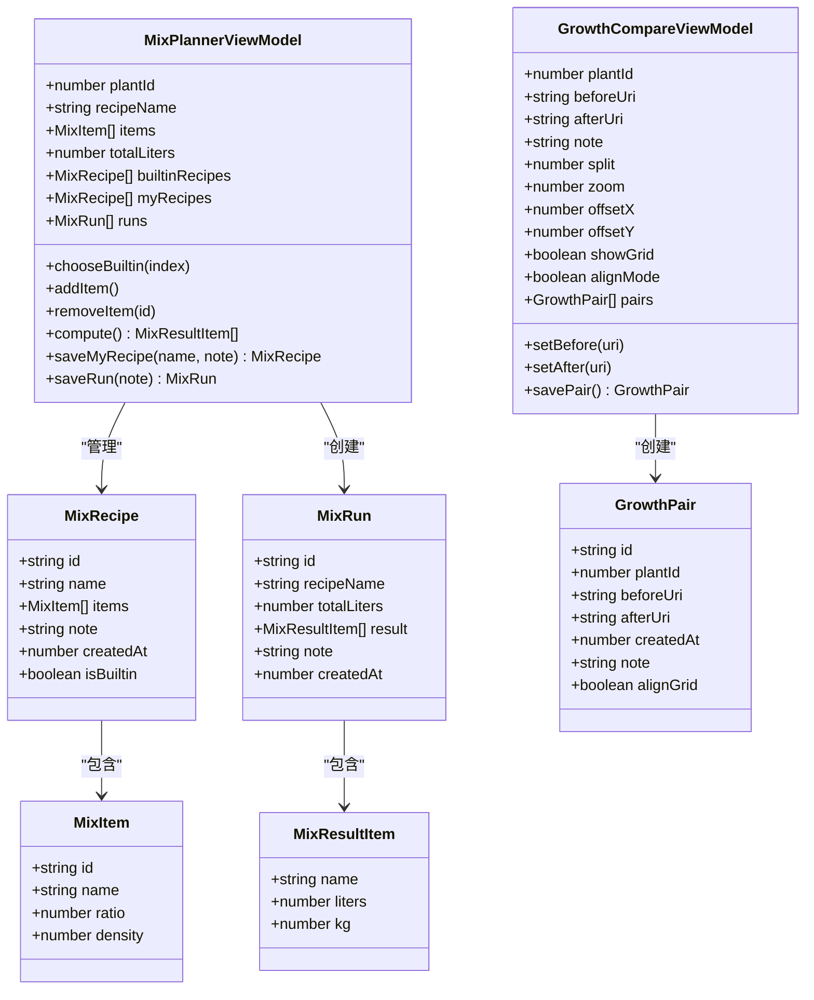
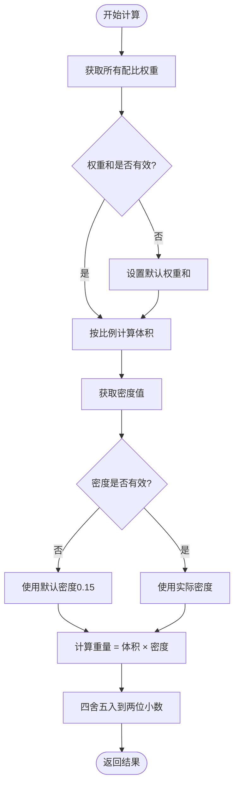
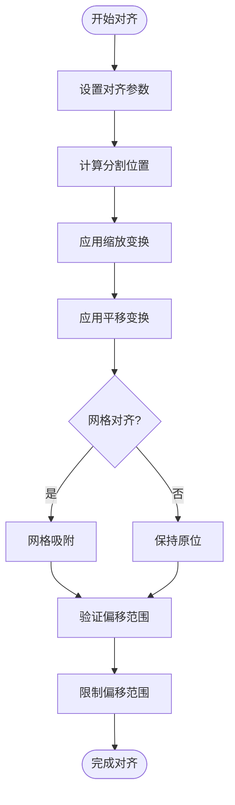
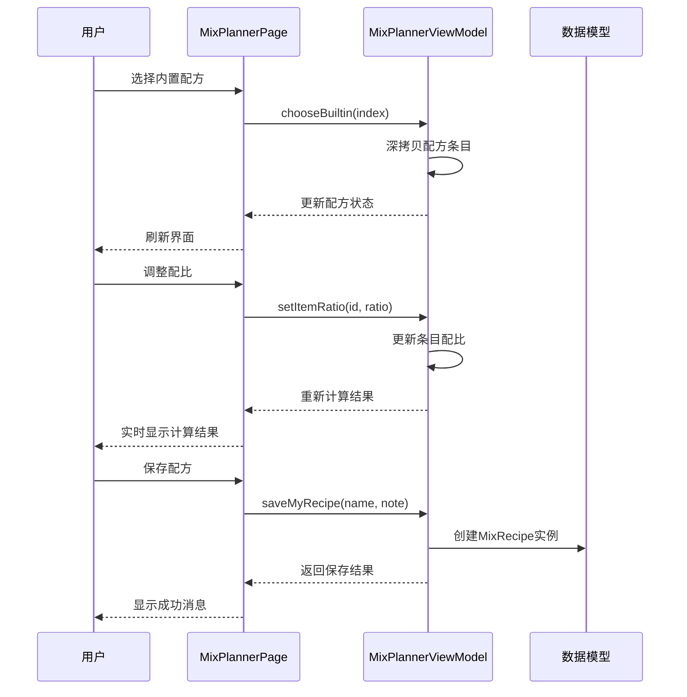
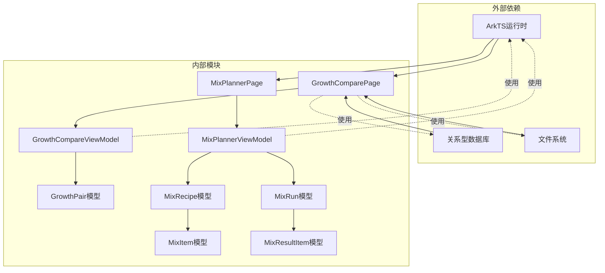
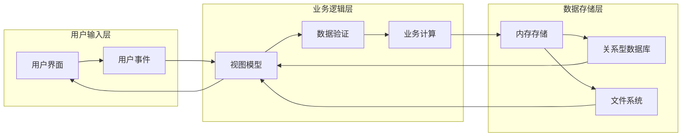

# 生长混合数据模型

<cite>
**本文档引用的文件**
- [GrowthPair.ets](file://entry/src/main/ets/model/GrowthPair.ets)
- [MixRecipe.ets](file://entry/src/main/ets/model/MixRecipe.ets)
- [MixRun.ets](file://entry/src/main/ets/model/MixRun.ets)
- [MixPlannerViewModel.ets](file://entry/src/main/ets/viewmodel/MixPlannerViewModel.ets)
- [GrowthCompareViewModel.ets](file://entry/src/main/ets/viewmodel/GrowthCompareViewModel.ets)
- [MixPlannerPage.ets](file://entry/src/main/ets/pages/MixPlannerPage.ets)
- [GrowthComparePage.ets](file://entry/src/main/ets/pages/GrowthComparePage.ets)
</cite>

## 目录
1. [简介](#简介)
2. [项目结构](#项目结构)
3. [核心组件](#核心组件)
4. [架构概览](#架构概览)
5. [详细组件分析](#详细组件分析)
6. [依赖关系分析](#依赖关系分析)
7. [性能考虑](#性能考虑)
8. [故障排除指南](#故障排除指南)
9. [结论](#结论)
10. [附录](#附录)

## 简介

PlantDiary项目中的生长混合数据模型是一套完整的植物生长管理和配方调配系统。该系统主要包含三个核心数据模型：GrowthPair（生长配对）、MixRecipe（混合配方）和MixRun（混合运行），以及相应的视图模型和页面组件。

本系统旨在帮助植物爱好者和园艺工作者：
- 记录和比较植物的生长变化
- 创建和管理定制化的土壤混合配方
- 跟踪每次配方调配的历史记录
- 通过数据驱动的方式优化植物养护策略

## 项目结构

系统采用MVVM架构模式，将数据模型、视图模型和页面组件清晰分离：

**图表来源**
- [GrowthPair.ets:1-22](file://entry/src/main/ets/model/GrowthPair.ets#L1-L22)
- [MixRecipe.ets:1-33](file://entry/src/main/ets/model/MixRecipe.ets#L1-L33)
- [MixRun.ets:1-31](file://entry/src/main/ets/model/MixRun.ets#L1-L31)
- [MixPlannerViewModel.ets:1-228](file://entry/src/main/ets/viewmodel/MixPlannerViewModel.ets#L1-L228)
- [GrowthCompareViewModel.ets:1-109](file://entry/src/main/ets/viewmodel/GrowthCompareViewModel.ets#L1-L109)

**章节来源**
- [GrowthPair.ets:1-22](file://entry/src/main/ets/model/GrowthPair.ets#L1-L22)
- [MixRecipe.ets:1-33](file://entry/src/main/ets/model/MixRecipe.ets#L1-L33)
- [MixRun.ets:1-31](file://entry/src/main/ets/model/MixRun.ets#L1-L31)
- [MixPlannerViewModel.ets:1-228](file://entry/src/main/ets/viewmodel/MixPlannerViewModel.ets#L1-L228)
- [GrowthCompareViewModel.ets:1-109](file://entry/src/main/ets/viewmodel/GrowthCompareViewModel.ets#L1-L109)

## 核心组件

### GrowthPair - 生长配对模型

GrowthPair是植物生长前后对比的核心数据模型，用于记录同一植物在不同时间点的照片对比信息。

**设计特点：**
- 使用装饰器标记可观察属性
- 包含植物ID关联和时间戳记录
- 支持备注和网格对齐状态
- 构造函数自动设置创建时间

**数据结构：**
- `id`: 唯一标识符
- `plantId`: 关联的植物ID
- `beforeUri`: 前期照片URI
- `afterUri`: 后期照片URI
- `createdAt`: 创建时间戳
- `note`: 备注信息
- `alignGrid`: 网格对齐状态

### MixRecipe - 混合配方模型

MixRecipe代表一个完整的土壤混合配方，包含多个配方条目和元数据信息。

**设计特点：**
- 支持内置配方和用户自定义配方
- 配方条目具有权重和密度属性
- 自动记录创建时间和备注信息
- 支持布尔标志位标识配方类型

**数据结构：**
- `id`: 配方唯一标识符
- `name`: 配方名称
- `items`: 配方条目数组
- `note`: 配方描述
- `createdAt`: 创建时间
- `isBuiltin`: 是否为内置配方

### MixRun - 混合运行模型

MixRun记录一次具体的配方调配执行结果，包含计算后的详细数据。

**设计特点：**
- 保存计算结果的快照，便于历史追溯
- 包含目标总量和执行时间信息
- 支持备注记录和快速摘要显示

**数据结构：**
- `id`: 运行记录ID
- `recipeName`: 关联的配方名称
- `totalLiters`: 目标总量(L)
- `result`: 计算结果数组
- `note`: 执行备注
- `createdAt`: 执行时间

**章节来源**
- [GrowthPair.ets:4-21](file://entry/src/main/ets/model/GrowthPair.ets#L4-L21)
- [MixRecipe.ets:18-32](file://entry/src/main/ets/model/MixRecipe.ets#L18-L32)
- [MixRun.ets:16-30](file://entry/src/main/ets/model/MixRun.ets#L16-L30)

## 架构概览

系统采用MVVM架构，实现了清晰的关注点分离：

**图表来源**
- [MixPlannerViewModel.ets:35-39](file://entry/src/main/ets/viewmodel/MixPlannerViewModel.ets#L35-L39)
- [GrowthCompareViewModel.ets:29-31](file://entry/src/main/ets/viewmodel/GrowthCompareViewModel.ets#L29-L31)

### 组件交互流程

**图表来源**
- [MixPlannerViewModel.ets:18-228](file://entry/src/main/ets/viewmodel/MixPlannerViewModel.ets#L18-L228)
- [GrowthCompareViewModel.ets:13-109](file://entry/src/main/ets/viewmodel/GrowthCompareViewModel.ets#L13-L109)
- [MixRecipe.ets:4-32](file://entry/src/main/ets/model/MixRecipe.ets#L4-L32)
- [MixRun.ets:4-30](file://entry/src/main/ets/model/MixRun.ets#L4-L30)
- [GrowthPair.ets:5-21](file://entry/src/main/ets/model/GrowthPair.ets#L5-L21)

## 详细组件分析

### MixPlannerViewModel - 配方规划器视图模型

MixPlannerViewModel是配方管理的核心业务逻辑组件，提供了完整的配方创建、编辑、计算和保存功能。

#### 核心功能模块

**1. 配方初始化**
- 加载内置配方模板
- 初始化默认自定义配方
- 设置植物ID关联

**2. 配方选择与编辑**
- 选择内置配方并深拷贝
- 添加、删除和修改配方条目
- 实时计算配比和密度

**3. 计算引擎**
- 按权重比例分配总体积
- 根据密度估算重量
- 结果精度控制

**4. 数据持久化**
- 保存为"我的配方"
- 保存调配运行记录
- 历史记录管理

#### 计算算法流程

**图表来源**
- [MixPlannerViewModel.ets:170-181](file://entry/src/main/ets/viewmodel/MixPlannerViewModel.ets#L170-L181)

#### API参考

**构造函数**
- `MixPlannerViewModel(plantId: number)`
  - 参数: plantId - 关联的植物ID
  - 返回: 配方规划器实例

**配方管理方法**
- `chooseBuiltin(index: number): void`
  - 选择并加载内置配方
- `addItem(): void`
  - 添加新的配方条目
- `removeItem(id: string): void`
  - 删除指定ID的配方条目
- `setItemName(id: string, name: string): void`
  - 修改配方条目名称
- `setItemRatio(id: string, ratio: number): void`
  - 设置配方条目配比(0.1-99)
- `setItemDensity(id: string, density: number): void`
  - 设置配方条目密度(0-3)

**计算方法**
- `sumRatio(): number`
  - 计算总配比权重
- `compute(): Array<MixResultItem>`
  - 执行配方计算

**保存方法**
- `saveMyRecipe(name: string, note: string): MixRecipe | undefined`
  - 保存为"我的配方"
- `saveRun(note: string): MixRun`
  - 保存本次调配记录

**章节来源**
- [MixPlannerViewModel.ets:35-228](file://entry/src/main/ets/viewmodel/MixPlannerViewModel.ets#L35-L228)

### GrowthCompareViewModel - 生长对比视图模型

GrowthCompareViewModel专门处理植物生长前后照片的对比功能，支持图像对齐和网格辅助。

#### 核心功能

**1. 图像管理**
- 设置前后对比图像
- 支持图像交换功能
- 实时预览对比效果

**2. 对齐控制**
- 分割比例调节(0.02-0.98)
- 缩放级别控制(0.5-4.0)
- 平移偏移限制(-600到600)
- 网格显示开关

**3. 数据持久化**
- 保存对比卡片
- 管理历史对比记录

#### 对齐算法

**图表来源**
- [GrowthCompareViewModel.ets:62-73](file://entry/src/main/ets/viewmodel/GrowthCompareViewModel.ets#L62-L73)

#### API参考

**图像设置**
- `setBefore(uri: string): void`
- `setAfter(uri: string): void`
- `swap(): void`

**对齐控制**
- `setSplit(v: number): void`
- `setZoom(z: number): void`
- `panBy(dx: number, dy: number): void`
- `resetAlign(): void`
- `toggleGrid(): void`
- `toggleAlignMode(): void`

**数据管理**
- `canSave(): boolean`
- `savePair(): GrowthPair | undefined`

**章节来源**
- [GrowthCompareViewModel.ets:13-109](file://entry/src/main/ets/viewmodel/GrowthCompareViewModel.ets#L13-L109)

### 页面组件集成

#### MixPlannerPage - 配方规划器页面

MixPlannerPage提供了完整的配方管理界面，集成了所有功能模块：

**界面布局结构：**
1. **头部区域** - 显示植物ID和操作按钮
2. **配方选择器** - 内置配方、我的配方、自定义配方
3. **材料编辑器** - 配方条目的增删改查
4. **总量与计算** - 总量设置和实时计算结果
5. **操作栏** - 保存配方和保存记录
6. **历史记录** - 查看和管理调配历史

**交互流程：**

**图表来源**
- [MixPlannerPage.ets:109-142](file://entry/src/main/ets/pages/MixPlannerPage.ets#L109-L142)
- [MixPlannerPage.ets:155-177](file://entry/src/main/ets/pages/MixPlannerPage.ets#L155-L177)
- [MixPlannerPage.ets:276-291](file://entry/src/main/ets/pages/MixPlannerPage.ets#L276-L291)

#### GrowthComparePage - 生长对比页面

GrowthComparePage专注于植物生长过程的照片对比展示：

**核心功能：**
- 时间轴照片浏览
- 照片网格预览
- 时间跨度显示
- 照片添加和管理

**技术实现：**
- 使用RDB存储照片元数据
- 支持动态加载和缓存
- 提供照片复制和路径转换

**章节来源**
- [MixPlannerPage.ets:1-366](file://entry/src/main/ets/pages/MixPlannerPage.ets#L1-L366)
- [GrowthComparePage.ets:1-477](file://entry/src/main/ets/pages/GrowthComparePage.ets#L1-L477)

## 依赖关系分析

系统采用松耦合设计，各组件间的依赖关系清晰明确：

**图表来源**
- [MixPlannerViewModel.ets:4-5](file://entry/src/main/ets/viewmodel/MixPlannerViewModel.ets#L4-L5)
- [GrowthCompareViewModel.ets:4](file://entry/src/main/ets/viewmodel/GrowthCompareViewModel.ets#L4)
- [GrowthComparePage.ets:1-8](file://entry/src/main/ets/pages/GrowthComparePage.ets#L1-L8)

### 数据流分析

系统遵循单向数据流原则，确保数据的一致性和可预测性：

**图表来源**
- [MixPlannerViewModel.ets:170-181](file://entry/src/main/ets/viewmodel/MixPlannerViewModel.ets#L170-L181)
- [GrowthCompareViewModel.ets:94-107](file://entry/src/main/ets/viewmodel/GrowthCompareViewModel.ets#L94-L107)

**章节来源**
- [MixPlannerViewModel.ets:1-228](file://entry/src/main/ets/viewmodel/MixPlannerViewModel.ets#L1-L228)
- [GrowthCompareViewModel.ets:1-109](file://entry/src/main/ets/viewmodel/GrowthCompareViewModel.ets#L1-L109)

## 性能考虑

### 内存管理
- 使用装饰器标记可观察属性，减少不必要的重渲染
- 深拷贝机制避免编辑态污染内置模板
- 实时计算结果缓存，避免重复计算

### 数据持久化
- 配方快照保存，确保历史记录的稳定性
- 文件路径转换优化，减少I/O操作
- 数据库查询优化，使用索引字段

### 用户体验
- 实时预览功能，即时反馈用户操作
- 输入验证和边界检查，防止异常状态
- 动画过渡效果，提升交互流畅度

## 故障排除指南

### 常见问题及解决方案

**1. 配方计算结果异常**
- 检查配比权重是否在有效范围内(0.1-99)
- 确认密度值是否合理(0-3)，0表示使用默认密度
- 验证总配比权重是否大于0

**2. 照片对比功能失效**
- 确认RDB连接状态正常
- 检查文件系统权限
- 验证照片路径格式正确

**3. 数据保存失败**
- 检查存储空间是否充足
- 确认数据库表结构完整
- 验证数据完整性约束

**章节来源**
- [MixPlannerViewModel.ets:154-159](file://entry/src/main/ets/viewmodel/MixPlannerViewModel.ets#L154-L159)
- [GrowthCompareViewModel.ets:54-59](file://entry/src/main/ets/viewmodel/GrowthCompareViewModel.ets#L54-L59)

## 结论

PlantDiary项目的生长混合数据模型展现了优秀的软件架构设计：

**设计理念优势：**
- MVVM架构确保了清晰的关注点分离
- 数据模型简洁明了，职责单一
- 视图模型封装了复杂的业务逻辑
- 页面组件专注于用户交互

**技术实现亮点：**
- 使用装饰器实现响应式编程
- 深拷贝机制保证数据安全
- 实时计算和缓存优化性能
- 完善的错误处理和边界检查

**扩展性考虑：**
- 模块化设计便于功能扩展
- 接口抽象支持未来升级
- 数据持久化方案灵活可变

这套数据模型为植物生长管理和配方调配提供了坚实的技术基础，既满足了当前的功能需求，也为未来的功能扩展预留了充分的空间。

## 附录

### 最佳实践建议

**1. 配方管理最佳实践**
- 使用内置配方作为起点，再进行个性化调整
- 定期保存重要的配方组合
- 记录配方使用的具体环境条件
- 建立配方版本管理机制

**2. 数据记录规范**
- 详细的备注信息有助于后续分析
- 定期备份重要的配方和运行记录
- 建立标准化的数据格式
- 保持数据的一致性和完整性

**3. 性能优化建议**
- 合理设置计算精度，平衡准确性和性能
- 使用缓存机制减少重复计算
- 优化数据库查询，使用适当的索引
- 控制内存使用，及时清理不需要的数据

**4. 用户体验优化**
- 提供直观的操作反馈
- 实现撤销和重做功能
- 建立完善的帮助文档
- 支持多语言和无障碍访问