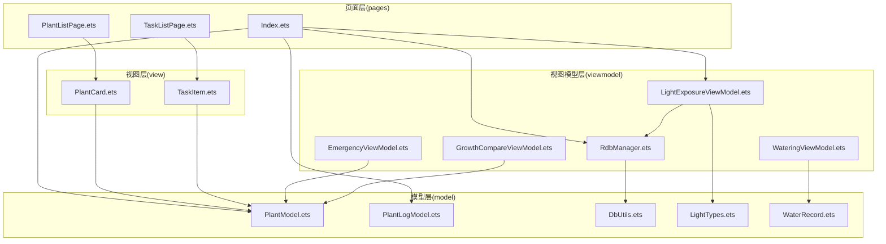
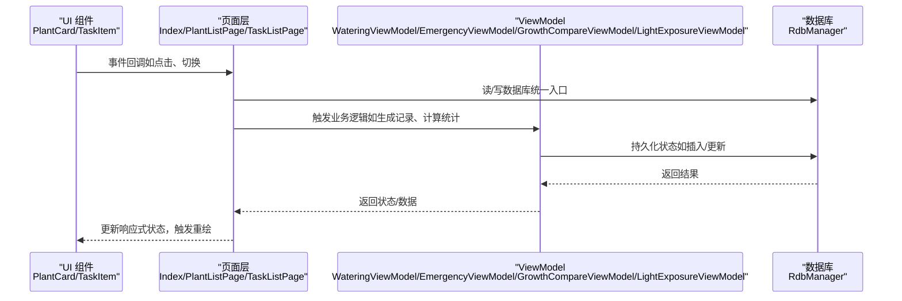
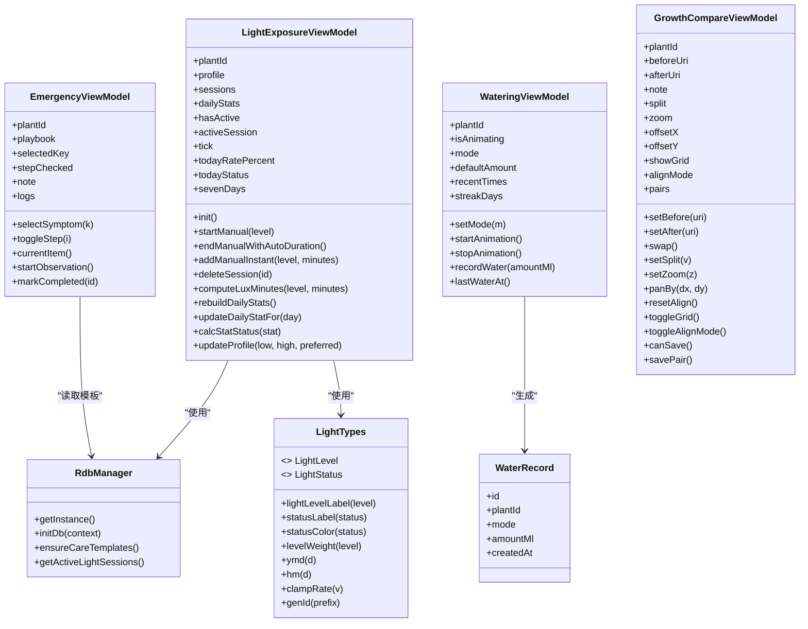

# 核心模块

<cite>
**本文引用的文件**
- [PlantModel.ets](file://entry/src/main/ets/model/PlantModel.ets)
- [PlantLogModel.ets](file://entry/src/main/ets/model/PlantLogModel.ets)
- [DbUtils.ets](file://entry/src/main/ets/model/DbUtils.ets)
- [LightTypes.ets](file://entry/src/main/ets/model/LightTypes.ets)
- [WaterRecord.ets](file://entry/src/main/ets/model/WaterRecord.ets)
- [RdbManager.ets](file://entry/src/main/ets/viewmodel/RdbManager.ets)
- [WateringViewModel.ets](file://entry/src/main/ets/viewmodel/WateringViewModel.ets)
- [EmergencyViewModel.ets](file://entry/src/main/ets/viewmodel/EmergencyViewModel.ets)
- [GrowthCompareViewModel.ets](file://entry/src/main/ets/viewmodel/GrowthCompareViewModel.ets)
- [LightExposureViewModel.ets](file://entry/src/main/ets/viewmodel/LightExposureViewModel.ets)
- [Index.ets](file://entry/src/main/ets/pages/Index.ets)
- [PlantListPage.ets](file://entry/src/main/ets/pages/PlantListPage.ets)
- [TaskListPage.ets](file://entry/src/main/ets/pages/TaskListPage.ets)
- [PlantCard.ets](file://entry/src/main/ets/view/PlantCard.ets)
- [TaskItem.ets](file://entry/src/main/ets/view/TaskItem.ets)
</cite>

## 目录
1. [简介](#简介)
2. [项目结构](#项目结构)
3. [核心组件](#核心组件)
4. [架构总览](#架构总览)
5. [详细组件分析](#详细组件分析)
6. [依赖分析](#依赖分析)
7. [性能考量](#性能考量)
8. [故障排查指南](#故障排查指南)
9. [结论](#结论)
10. [附录](#附录)

## 简介
本文件面向植物日记项目的核心模块，系统梳理数据模型层、业务逻辑层（ViewModel）、UI 组件层与页面层的设计理念与实现方式，解释各层之间的协作关系与数据流转过程，阐述响应式数据绑定机制、状态管理与组件通信模式。文档同时给出核心类的设计思路、接口定义与使用示例，提供模块间依赖关系图与调用链路说明，并总结装饰器的使用场景与最佳实践，帮助开发者快速理解与扩展功能。

## 项目结构
项目采用分层组织：model（数据模型）、viewmodel（业务逻辑与状态）、view（UI 组件）、pages（页面容器）、model/DbUtils.ts（数据库事务封装）。页面层通过 Provider/Consumer 注入数据库实例，ViewModel 负责状态与业务逻辑，UI 组件以轻量展示为主，统一通过事件回调回到页面层进行持久化。

**图表来源**
- [Index.ets:1-120](file://entry/src/main/ets/pages/Index.ets#L1-L120)
- [PlantListPage.ets:1-60](file://entry/src/main/ets/pages/PlantListPage.ets#L1-L60)
- [TaskListPage.ets:1-40](file://entry/src/main/ets/pages/TaskListPage.ets#L1-L40)
- [PlantCard.ets:1-40](file://entry/src/main/ets/view/PlantCard.ets#L1-L40)
- [TaskItem.ets:1-20](file://entry/src/main/ets/view/TaskItem.ets#L1-L20)
- [RdbManager.ets:1-40](file://entry/src/main/ets/viewmodel/RdbManager.ets#L1-L40)
- [WateringViewModel.ets:1-30](file://entry/src/main/ets/viewmodel/WateringViewModel.ets#L1-L30)
- [EmergencyViewModel.ets:1-30](file://entry/src/main/ets/viewmodel/EmergencyViewModel.ets#L1-L30)
- [GrowthCompareViewModel.ets:1-30](file://entry/src/main/ets/viewmodel/GrowthCompareViewModel.ets#L1-L30)
- [LightExposureViewModel.ets:1-40](file://entry/src/main/ets/viewmodel/LightExposureViewModel.ets#L1-L40)
- [PlantModel.ets:1-40](file://entry/src/main/ets/model/PlantModel.ets#L1-L40)
- [PlantLogModel.ets:1-20](file://entry/src/main/ets/model/PlantLogModel.ets#L1-L20)
- [DbUtils.ets:1-22](file://entry/src/main/ets/model/DbUtils.ets#L1-L22)
- [LightTypes.ets:1-40](file://entry/src/main/ets/model/LightTypes.ets#L1-L40)
- [WaterRecord.ets:1-18](file://entry/src/main/ets/model/WaterRecord.ets#L1-L18)

**章节来源**
- [Index.ets:1-120](file://entry/src/main/ets/pages/Index.ets#L1-L120)
- [PlantListPage.ets:1-60](file://entry/src/main/ets/pages/PlantListPage.ets#L1-L60)
- [TaskListPage.ets:1-40](file://entry/src/main/ets/pages/TaskListPage.ets#L1-L40)
- [PlantCard.ets:1-40](file://entry/src/main/ets/view/PlantCard.ets#L1-L40)
- [TaskItem.ets:1-20](file://entry/src/main/ets/view/TaskItem.ets#L1-L20)
- [RdbManager.ets:1-40](file://entry/src/main/ets/viewmodel/RdbManager.ets#L1-L40)
- [WateringViewModel.ets:1-30](file://entry/src/main/ets/viewmodel/WateringViewModel.ets#L1-L30)
- [EmergencyViewModel.ets:1-30](file://entry/src/main/ets/viewmodel/EmergencyViewModel.ets#L1-L30)
- [GrowthCompareViewModel.ets:1-30](file://entry/src/main/ets/viewmodel/GrowthCompareViewModel.ets#L1-L30)
- [LightExposureViewModel.ets:1-40](file://entry/src/main/ets/viewmodel/LightExposureViewModel.ets#L1-L40)
- [PlantModel.ets:1-40](file://entry/src/main/ets/model/PlantModel.ets#L1-L40)
- [PlantLogModel.ets:1-20](file://entry/src/main/ets/model/PlantLogModel.ets#L1-L20)
- [DbUtils.ets:1-22](file://entry/src/main/ets/model/DbUtils.ets#L1-L22)
- [LightTypes.ets:1-40](file://entry/src/main/ets/model/LightTypes.ets#L1-L40)
- [WaterRecord.ets:1-18](file://entry/src/main/ets/model/WaterRecord.ets#L1-L18)

## 核心组件
- 数据模型层
  - 植物与任务：Plant、PlanTpl、PlantTask、PlantDraft、TaskDraft、LogEntry、Metric、PlantMetric、CareTemplate、CareRule 等，均标注为可观察对象，便于响应式更新。
  - 日志与照片：PlantLog、LogPhoto。
  - 光照相关：LightProfile、ExposureSession、DailyLightStat、LightLevel、LightStatus、辅助函数与常量。
  - 浇水记录：WaterRecord。
- 业务逻辑层（ViewModel）
  - RdbManager：数据库单例、建表与索引、默认模板数据注入、活动光照会话查询。
  - WateringViewModel：浇水动画与历史、连胜天数、生成 WaterRecord。
  - EmergencyViewModel：急救流程（症状选择、步骤勾选、开始观察、历史列表）。
  - GrowthCompareViewModel：前后对比工作区（before/after、分割、缩放、偏移、网格、对齐模式、保存）。
  - LightExposureViewModel：光照配置、会话管理、统计计算、目标更新、实时进度刷新。
- UI 组件层
  - PlantCard：植物卡片，聚合日志/照片、补光状态呼吸效果、快捷任务入口、指标/模板/日志/盆栽/用量估算器入口。
  - TaskItem：任务项，展示与交互回调。
- 页面层
  - Index：应用入口，提供 Provider/Consumer 注入 RdbManager 与 store，集中加载植物、任务、模板、指标，统一处理 Banner、筛选、模板应用、批量生成任务、指标 CRUD、清理孤儿照片等。
  - PlantListPage：植物列表页，聚合筛选与排序、完成率计算、事件透传至 Index。
  - TaskListPage：任务列表页，聚合筛选（Tab/类型/关键字）、排序、日视图弹层与列表视图共享筛选结果。

**章节来源**
- [PlantModel.ets:1-166](file://entry/src/main/ets/model/PlantModel.ets#L1-L166)
- [PlantLogModel.ets:1-58](file://entry/src/main/ets/model/PlantLogModel.ets#L1-L58)
- [LightTypes.ets:1-124](file://entry/src/main/ets/model/LightTypes.ets#L1-L124)
- [WaterRecord.ets:1-18](file://entry/src/main/ets/model/WaterRecord.ets#L1-L18)
- [RdbManager.ets:1-296](file://entry/src/main/ets/viewmodel/RdbManager.ets#L1-L296)
- [WateringViewModel.ets:1-102](file://entry/src/main/ets/viewmodel/WateringViewModel.ets#L1-L102)
- [EmergencyViewModel.ets:1-115](file://entry/src/main/ets/viewmodel/EmergencyViewModel.ets#L1-L115)
- [GrowthCompareViewModel.ets:1-109](file://entry/src/main/ets/viewmodel/GrowthCompareViewModel.ets#L1-L109)
- [LightExposureViewModel.ets:1-554](file://entry/src/main/ets/viewmodel/LightExposureViewModel.ets#L1-L554)
- [Index.ets:1-800](file://entry/src/main/ets/pages/Index.ets#L1-L800)
- [PlantListPage.ets:1-228](file://entry/src/main/ets/pages/PlantListPage.ets#L1-L228)
- [TaskListPage.ets:1-463](file://entry/src/main/ets/pages/TaskListPage.ets#L1-L463)
- [PlantCard.ets:1-326](file://entry/src/main/ets/view/PlantCard.ets#L1-L326)
- [TaskItem.ets:1-67](file://entry/src/main/ets/view/TaskItem.ets#L1-L67)

## 架构总览
整体采用“页面层集中状态与持久化、ViewModel 负责业务与状态、UI 组件轻量展示”的分层设计。页面层通过 Provider 注入数据库实例，ViewModel 通过 RdbManager 访问数据库，UI 组件通过事件回调将操作交由页面层统一处理，形成清晰的单向数据流与职责分离。

**图表来源**
- [Index.ets:270-420](file://entry/src/main/ets/pages/Index.ets#L270-L420)
- [RdbManager.ets:27-170](file://entry/src/main/ets/viewmodel/RdbManager.ets#L27-L170)
- [WateringViewModel.ets:44-68](file://entry/src/main/ets/viewmodel/WateringViewModel.ets#L44-L68)
- [EmergencyViewModel.ets:60-75](file://entry/src/main/ets/viewmodel/EmergencyViewModel.ets#L60-L75)
- [GrowthCompareViewModel.ets:94-107](file://entry/src/main/ets/viewmodel/GrowthCompareViewModel.ets#L94-L107)
- [LightExposureViewModel.ets:129-192](file://entry/src/main/ets/viewmodel/LightExposureViewModel.ets#L129-L192)

## 详细组件分析

### 数据模型层
- 设计要点
  - 使用可观察装饰器标注模型类，确保字段变更能驱动 UI 自动刷新。
  - 轻量数据结构，仅承载字段与少量构造逻辑，复杂业务规则下沉到页面或 ViewModel。
  - 光照、日志、指标、任务等模型相互解耦，通过外键关联（如 plantId/logId）连接。
- 关键类与接口
  - 植物与任务：Plant、PlanTpl、PlantTask、PlantDraft、TaskDraft、LogEntry、Metric、PlantMetric、CareTemplate、CareRule。
  - 日志与照片：PlantLog、LogPhoto。
  - 光照类型：LightLevel、LightStatus、辅助函数（权重、标签、颜色、日期格式化、比率钳制、ID 生成）。
  - 浇水记录：WaterRecord。
- 使用示例（路径）
  - [PlantModel.ets:6-21](file://entry/src/main/ets/model/PlantModel.ets#L6-L21)
  - [PlantLogModel.ets:8-28](file://entry/src/main/ets/model/PlantLogModel.ets#L8-L28)
  - [LightTypes.ets:9-23](file://entry/src/main/ets/model/LightTypes.ets#L9-L23)
  - [WaterRecord.ets:3-17](file://entry/src/main/ets/model/WaterRecord.ets#L3-L17)

**章节来源**
- [PlantModel.ets:1-166](file://entry/src/main/ets/model/PlantModel.ets#L1-L166)
- [PlantLogModel.ets:1-58](file://entry/src/main/ets/model/PlantLogModel.ets#L1-L58)
- [LightTypes.ets:1-124](file://entry/src/main/ets/model/LightTypes.ets#L1-L124)
- [WaterRecord.ets:1-18](file://entry/src/main/ets/model/WaterRecord.ets#L1-L18)

### 业务逻辑层（ViewModel）

#### RdbManager（数据库管理）
- 职责
  - 单例数据库初始化、建表与索引、默认模板数据注入。
  - 提供活动光照会话映射，供首页快速同步植物卡片的“正在补光”状态。
- 关键点
  - 使用唯一索引约束任务重复，支持“尝试插入、冲突即跳过”的批量生成策略。
  - 通过组合索引优化日志与指标查询。
- 使用示例（路径）
  - [RdbManager.ets:19-170](file://entry/src/main/ets/viewmodel/RdbManager.ets#L19-L170)
  - [RdbManager.ets:173-276](file://entry/src/main/ets/viewmodel/RdbManager.ets#L173-L276)
  - [RdbManager.ets:277-294](file://entry/src/main/ets/viewmodel/RdbManager.ets#L277-L294)

**章节来源**
- [RdbManager.ets:1-296](file://entry/src/main/ets/viewmodel/RdbManager.ets#L1-L296)

#### WateringViewModel（浇水）
- 职责
  - 管理浇水动画状态、历史记录（内存）、连胜天数（基于最近记录推断）。
  - 生成 WaterRecord，具体持久化由页面或上层服务决定。
- 关键点
  - 使用装饰器标注状态字段，支持响应式更新。
  - 连续天数计算容忍跨天边界误差，避免误判。
- 使用示例（路径）
  - [WateringViewModel.ets:11-68](file://entry/src/main/ets/viewmodel/WateringViewModel.ets#L11-L68)
  - [WateringViewModel.ets:44-57](file://entry/src/main/ets/viewmodel/WateringViewModel.ets#L44-L57)

**章节来源**
- [WateringViewModel.ets:1-102](file://entry/src/main/ets/viewmodel/WateringViewModel.ets#L1-L102)

#### EmergencyViewModel（急救）
- 职责
  - 症状选择、步骤勾选、开始观察（生成记录，安排复查时间）、历史列表。
- 关键点
  - 通过重建对象而非原地修改，保证 UI 能正确感知列表项更新。
  - 支持内置/自定义症状库，动态重建勾选数组。
- 使用示例（路径）
  - [EmergencyViewModel.ets:13-38](file://entry/src/main/ets/viewmodel/EmergencyViewModel.ets#L13-L38)
  - [EmergencyViewModel.ets:60-75](file://entry/src/main/ets/viewmodel/EmergencyViewModel.ets#L60-L75)
  - [EmergencyViewModel.ets:77-98](file://entry/src/main/ets/viewmodel/EmergencyViewModel.ets#L77-L98)

**章节来源**
- [EmergencyViewModel.ets:1-115](file://entry/src/main/ets/viewmodel/EmergencyViewModel.ets#L1-L115)

#### GrowthCompareViewModel（前后对比）
- 职责
  - 管理 before/after 图片、分割、缩放、偏移、网格、对齐模式。
  - 保存对比卡（仅固化图片关系与备注，不持久化对齐参数）。
- 关键点
  - 保存前允许继续微调，保存后不清空以便继续导出。
- 使用示例（路径）
  - [GrowthCompareViewModel.ets:12-31](file://entry/src/main/ets/viewmodel/GrowthCompareViewModel.ets#L12-L31)
  - [GrowthCompareViewModel.ets:94-107](file://entry/src/main/ets/viewmodel/GrowthCompareViewModel.ets#L94-L107)

**章节来源**
- [GrowthCompareViewModel.ets:1-109](file://entry/src/main/ets/viewmodel/GrowthCompareViewModel.ets#L1-L109)

#### LightExposureViewModel（光照）
- 职责
  - 光照配置档案、会话管理、统计计算、目标更新、实时进度刷新。
- 关键点
  - 自动清理异常的进行中会话，保证一致性。
  - 通过 AppStorage 同步“正在补光”状态，首页重载后即时恢复。
  - 今日达标率与状态包含进行中会话的实时贡献。
- 使用示例（路径）
  - [LightExposureViewModel.ets:16-113](file://entry/src/main/ets/viewmodel/LightExposureViewModel.ets#L16-L113)
  - [LightExposureViewModel.ets:129-192](file://entry/src/main/ets/viewmodel/LightExposureViewModel.ets#L129-L192)
  - [LightExposureViewModel.ets:392-444](file://entry/src/main/ets/viewmodel/LightExposureViewModel.ets#L392-L444)

**章节来源**
- [LightExposureViewModel.ets:1-554](file://entry/src/main/ets/viewmodel/LightExposureViewModel.ets#L1-L554)

### UI 组件层

#### PlantCard（植物卡片）
- 职责
  - 展示植物信息、最近日志与照片、补光状态（呼吸效果）、快捷任务入口、指标/模板/日志/盆栽/用量估算器入口。
- 关键点
  - 通过 AppStorage 获取补光状态，卡片自身补拉最近日志与照片作为封面。
  - 事件回调统一交由父页面处理，避免直接访问数据库。
- 使用示例（路径）
  - [PlantCard.ets:35-47](file://entry/src/main/ets/view/PlantCard.ets#L35-L47)
  - [PlantCard.ets:80-111](file://entry/src/main/ets/view/PlantCard.ets#L80-L111)
  - [PlantCard.ets:159-168](file://entry/src/main/ets/view/PlantCard.ets#L159-L168)

**章节来源**
- [PlantCard.ets:1-326](file://entry/src/main/ets/view/PlantCard.ets#L1-L326)

#### TaskItem（任务项）
- 职责
  - 展示任务类型、植物名、计划日期、完成状态；交互回调交由父页面处理。
- 关键点
  - 本地切换仅提供即时反馈，最终以父层重载结果为准。
- 使用示例（路径)
  - [TaskItem.ets:13-15](file://entry/src/main/ets/view/TaskItem.ets#L13-L15)
  - [TaskItem.ets:20-27](file://entry/src/main/ets/view/TaskItem.ets#L20-L27)

**章节来源**
- [TaskItem.ets:1-67](file://entry/src/main/ets/view/TaskItem.ets#L1-L67)

### 页面层

#### Index（应用入口）
- 职责
  - Provider 注入 RdbManager 与 store；集中加载植物、任务、模板、指标；统一处理 Banner、筛选、模板应用、批量生成任务、指标 CRUD、清理孤儿照片等。
  - 通过 AppStorage 同步植物的“正在补光”状态。
- 关键点
  - 首页是应用状态中枢，先初始化数据库，再一次性恢复全局数据。
  - 使用事务封装删除植物时的级联删除与文件清理。
- 使用示例（路径）
  - [Index.ets:42-46](file://entry/src/main/ets/pages/Index.ets#L42-L46)
  - [Index.ets:128-135](file://entry/src/main/ets/pages/Index.ets#L128-L135)
  - [Index.ets:162-168](file://entry/src/main/ets/pages/Index.ets#L162-L168)
  - [Index.ets:358-402](file://entry/src/main/ets/pages/Index.ets#L358-L402)

**章节来源**
- [Index.ets:1-800](file://entry/src/main/ets/pages/Index.ets#L1-L800)

#### PlantListPage（植物列表）
- 职责
  - 聚合筛选（物种芯片）、排序（创建时间/名称/完成率）、完成数与总数计算、事件透传。
- 关键点
  - 完成数与总数从共享任务列表现算，避免每个卡片单独拉取。
- 使用示例（路径)
  - [PlantListPage.ets:27-59](file://entry/src/main/ets/pages/PlantListPage.ets#L27-L59)
  - [PlantListPage.ets:93-114](file://entry/src/main/ets/pages/PlantListPage.ets#L93-L114)

**章节来源**
- [PlantListPage.ets:1-228](file://entry/src/main/ets/pages/PlantListPage.ets#L1-L228)

#### TaskListPage（任务列表）
- 职责
  - 聚合筛选（Tab/类型/关键字）、排序、日视图弹层与列表视图共享筛选结果。
- 关键点
  - 任务页核心聚合逻辑统一串联 Tab、类型与关键字三个维度。
- 使用示例（路径)
  - [TaskListPage.ets:135-162](file://entry/src/main/ets/pages/TaskListPage.ets#L135-L162)
  - [TaskListPage.ets:41-52](file://entry/src/main/ets/pages/TaskListPage.ets#L41-L52)

**章节来源**
- [TaskListPage.ets:1-463](file://entry/src/main/ets/pages/TaskListPage.ets#L1-L463)

## 依赖分析
- 组件耦合与内聚
  - 页面层与 ViewModel 解耦：页面通过 Provider 注入数据库，ViewModel 通过 RdbManager 访问数据库，UI 组件仅负责展示与事件回调。
  - ViewModel 内部依赖：LightExposureViewModel 依赖 LightTypes 与 RdbManager；WateringViewModel 依赖 WaterRecord；EmergencyViewModel 依赖 PlantModel 与内置症状库。
- 直接与间接依赖
  - 直接依赖：页面层依赖 ViewModel 与模型；ViewModel 依赖模型与数据库；UI 组件依赖模型与页面层事件。
  - 间接依赖：PlantCard 与 TaskItem 通过 Index 间接依赖数据库。
- 循环依赖
  - 未发现循环依赖，职责边界清晰。
- 外部依赖与集成点
  - 数据库：ArkTS 提供的 relationalStore。
  - 性能分析：hilog。
  - 文件系统：fs 用于照片文件清理。
- 接口契约
  - ViewModel 通过 @ObservedV2 标注状态字段，确保响应式更新。
  - 页面层统一通过 RdbManager 访问数据库，保证事务与索引约束的一致性。

**图表来源**
- [RdbManager.ets:4-296](file://entry/src/main/ets/viewmodel/RdbManager.ets#L4-L296)
- [LightExposureViewModel.ets:16-554](file://entry/src/main/ets/viewmodel/LightExposureViewModel.ets#L16-L554)
- [LightTypes.ets:9-124](file://entry/src/main/ets/model/LightTypes.ets#L9-L124)
- [WateringViewModel.ets:11-102](file://entry/src/main/ets/viewmodel/WateringViewModel.ets#L11-L102)
- [WaterRecord.ets:3-17](file://entry/src/main/ets/model/WaterRecord.ets#L3-L17)
- [EmergencyViewModel.ets:13-115](file://entry/src/main/ets/viewmodel/EmergencyViewModel.ets#L13-L115)
- [GrowthCompareViewModel.ets:12-109](file://entry/src/main/ets/viewmodel/GrowthCompareViewModel.ets#L12-L109)

**章节来源**
- [RdbManager.ets:1-296](file://entry/src/main/ets/viewmodel/RdbManager.ets#L1-L296)
- [LightExposureViewModel.ets:1-554](file://entry/src/main/ets/viewmodel/LightExposureViewModel.ets#L1-L554)
- [LightTypes.ets:1-124](file://entry/src/main/ets/model/LightTypes.ets#L1-L124)
- [WateringViewModel.ets:1-102](file://entry/src/main/ets/viewmodel/WateringViewModel.ets#L1-L102)
- [WaterRecord.ets:1-18](file://entry/src/main/ets/model/WaterRecord.ets#L1-L18)
- [EmergencyViewModel.ets:1-115](file://entry/src/main/ets/viewmodel/EmergencyViewModel.ets#L1-L115)
- [GrowthCompareViewModel.ets:1-109](file://entry/src/main/ets/viewmodel/GrowthCompareViewModel.ets#L1-L109)

## 性能考量
- 数据库层面
  - 唯一索引约束任务重复，支持“尝试插入、冲突即跳过”的批量生成策略，减少重复写入。
  - 组合索引优化日志与指标查询，避免多次扫描。
  - 事务封装保证批量写入原子性，提升一致性与稳定性。
- UI 响应
  - 使用可观察装饰器标注状态字段，字段变更自动触发重绘，减少手动刷新。
  - UI 组件保持轻量，复杂计算下沉至页面层或 ViewModel，降低渲染压力。
- 光照统计
  - 仅增量更新指定日期统计，避免全量重扫历史，提高实时性与性能。
- 文件清理
  - 清理孤儿照片分为数据库记录缺失与文件缺失两类，分别处理，避免误删与遗漏。

[本节为通用指导，无需列出具体文件来源]

## 故障排查指南
- 数据库初始化失败
  - 现象：Banner 显示“数据库初始化失败”。
  - 排查：检查 RdbManager 初始化流程与权限配置。
  - 参考路径：[Index.ets:116-125](file://entry/src/main/ets/pages/Index.ets#L116-L125)、[RdbManager.ets:27-170](file://entry/src/main/ets/viewmodel/RdbManager.ets#L27-L170)
- 删除植物失败或文件残留
  - 现象：删除植物后仍有文件未删除。
  - 排查：确认事务是否成功提交，文件路径是否存在；必要时使用“清理孤儿照片”功能。
  - 参考路径：[Index.ets:358-402](file://entry/src/main/ets/pages/Index.ets#L358-L402)、[Index.ets:441-546](file://entry/src/main/ets/pages/Index.ets#L441-L546)
- 光照会话异常
  - 现象：存在多个进行中会话或状态不一致。
  - 排查：LightExposureViewModel 会自动清理异常会话，检查数据库记录与 AppStorage 同步。
  - 参考路径：[LightExposureViewModel.ets:90-113](file://entry/src/main/ets/viewmodel/LightExposureViewModel.ets#L90-L113)、[LightExposureViewModel.ets:227-251](file://entry/src/main/ets/viewmodel/LightExposureViewModel.ets#L227-L251)
- 任务重复
  - 现象：同日同类型任务重复创建。
  - 排查：检查唯一索引与插入策略，确认“尝试插入、冲突即跳过”逻辑。
  - 参考路径：[RdbManager.ets:134-146](file://entry/src/main/ets/viewmodel/RdbManager.ets#L134-L146)、[Index.ets:416-424](file://entry/src/main/ets/pages/Index.ets#L416-L424)

**章节来源**
- [Index.ets:116-125](file://entry/src/main/ets/pages/Index.ets#L116-L125)
- [RdbManager.ets:27-170](file://entry/src/main/ets/viewmodel/RdbManager.ets#L27-L170)
- [Index.ets:358-402](file://entry/src/main/ets/pages/Index.ets#L358-L402)
- [Index.ets:441-546](file://entry/src/main/ets/pages/Index.ets#L441-L546)
- [LightExposureViewModel.ets:90-113](file://entry/src/main/ets/viewmodel/LightExposureViewModel.ets#L90-L113)
- [LightExposureViewModel.ets:227-251](file://entry/src/main/ets/viewmodel/LightExposureViewModel.ets#L227-L251)
- [RdbManager.ets:134-146](file://entry/src/main/ets/viewmodel/RdbManager.ets#L134-L146)
- [Index.ets:416-424](file://entry/src/main/ets/pages/Index.ets#L416-L424)

## 结论
植物日记项目通过清晰的分层设计实现了数据模型、业务逻辑、UI 组件与页面的解耦协作。页面层集中状态与持久化，ViewModel 负责业务与状态，UI 组件保持轻量展示并通过事件回调回到页面层统一处理。装饰器的广泛使用确保了响应式数据绑定与状态管理的简洁高效。数据库层通过索引与事务保障性能与一致性。整体架构易于扩展与维护，适合进一步引入更多业务能力与可视化功能。

[本节为总结性内容，无需列出具体文件来源]

## 附录

### 响应式数据绑定与状态管理
- 装饰器使用
  - @ObservedV2：标注可观察对象与字段，字段变更自动触发 UI 刷新。
  - @ComponentV2：组件级装饰器，配合可观察状态实现响应式渲染。
  - @Provider/@Consumer：在页面层注入数据库实例，组件层消费。
- 最佳实践
  - 将复杂业务逻辑下沉到 ViewModel，UI 组件仅负责展示与事件回调。
  - 使用事务封装批量写入，确保一致性。
  - 通过 AppStorage 同步跨页面状态（如“正在补光”），保证状态一致性。

**章节来源**
- [Index.ets:42-46](file://entry/src/main/ets/pages/Index.ets#L42-L46)
- [PlantCard.ets:23-24](file://entry/src/main/ets/view/PlantCard.ets#L23-L24)
- [LightExposureViewModel.ets:16-36](file://entry/src/main/ets/viewmodel/LightExposureViewModel.ets#L16-L36)

### 组件通信模式
- 父子通信
  - 父页面通过事件回调（onToggle/onDeleteAsk/onQuickAdd 等）接收子组件事件，统一处理业务逻辑与持久化。
- 页面到 ViewModel
  - 页面通过 ViewModel 执行业务逻辑（如生成记录、计算统计），ViewModel 再访问数据库。
- 页面到数据库
  - 页面通过 RdbManager 统一访问数据库，保证事务与索引约束的一致性。

**章节来源**
- [PlantListPage.ets:157-178](file://entry/src/main/ets/pages/PlantListPage.ets#L157-L178)
- [TaskListPage.ets:218-227](file://entry/src/main/ets/pages/TaskListPage.ets#L218-L227)
- [Index.ets:270-420](file://entry/src/main/ets/pages/Index.ets#L270-L420)
- [RdbManager.ets:27-170](file://entry/src/main/ets/viewmodel/RdbManager.ets#L27-L170)

### 数据模型与接口定义
- 植物与任务
  - Plant、PlanTpl、PlantTask、PlantDraft、TaskDraft、LogEntry、Metric、PlantMetric、CareTemplate、CareRule。
- 日志与照片
  - PlantLog、LogPhoto。
- 光照类型
  - LightLevel、LightStatus、辅助函数（权重、标签、颜色、日期格式化、比率钳制、ID 生成）。
- 浇水记录
  - WaterRecord。

**章节来源**
- [PlantModel.ets:1-166](file://entry/src/main/ets/model/PlantModel.ets#L1-L166)
- [PlantLogModel.ets:1-58](file://entry/src/main/ets/model/PlantLogModel.ets#L1-L58)
- [LightTypes.ets:1-124](file://entry/src/main/ets/model/LightTypes.ets#L1-L124)
- [WaterRecord.ets:1-18](file://entry/src/main/ets/model/WaterRecord.ets#L1-L18)

### 使用示例（路径）
- 初始化数据库与加载数据
  - [Index.ets:128-135](file://entry/src/main/ets/pages/Index.ets#L128-L135)
- 删除植物并清理文件
  - [Index.ets:358-402](file://entry/src/main/ets/pages/Index.ets#L358-L402)
- 生成周期任务
  - [Index.ets:560-576](file://entry/src/main/ets/pages/Index.ets#L560-L576)
- 光照会话管理
  - [LightExposureViewModel.ets:129-192](file://entry/src/main/ets/viewmodel/LightExposureViewModel.ets#L129-L192)
- 浇水记录生成
  - [WateringViewModel.ets:44-57](file://entry/src/main/ets/viewmodel/WateringViewModel.ets#L44-L57)
- 急救流程
  - [EmergencyViewModel.ets:60-75](file://entry/src/main/ets/viewmodel/EmergencyViewModel.ets#L60-L75)
- 前后对比保存
  - [GrowthCompareViewModel.ets:94-107](file://entry/src/main/ets/viewmodel/GrowthCompareViewModel.ets#L94-L107)