# 主页面 Index

<cite>
**本文引用的文件**
- [Index.ets](file://entry/src/main/ets/pages/Index.ets)
- [RdbManager.ets](file://entry/src/main/ets/viewmodel/RdbManager.ets)
- [PlantModel.ets](file://entry/src/main/ets/model/PlantModel.ets)
- [PlantCard.ets](file://entry/src/main/ets/view/PlantCard.ets)
- [DbUtils.ets](file://entry/src/main/ets/model/DbUtils.ets)
- [PlantListPage.ets](file://entry/src/main/ets/pages/PlantListPage.ets)
- [ConfirmDialogSheet.ets](file://entry/src/main/ets/view/ConfirmDialogSheet.ets)
- [PlantTaskFilterSheet.ets](file://entry/src/main/ets/view/PlantTaskFilterSheet.ets)
- [CareTemplateSheet.ets](file://entry/src/main/ets/view/CareTemplateSheet.ets)
- [TemplateManagerSheet.ets](file://entry/src/main/ets/view/TemplateManagerSheet.ets)
- [WateringViewModel.ets](file://entry/src/main/ets/viewmodel/WateringViewModel.ets)
</cite>

## 目录
1. [简介](#简介)
2. [项目结构](#项目结构)
3. [核心组件](#核心组件)
4. [架构总览](#架构总览)
5. [详细组件分析](#详细组件分析)
6. [依赖关系分析](#依赖关系分析)
7. [性能考虑](#性能考虑)
8. [故障排查指南](#故障排查指南)
9. [结论](#结论)
10. [附录](#附录)

## 简介
本文件聚焦于主页面 Index 的设计与实现，阐述其作为应用状态中枢的角色定位：统一负责数据库初始化、全局状态同步、Tab 导航与页面间数据传递、交互提示与动画、植物卡片状态管理、光照会话同步、任务筛选机制等。文档以循序渐进的方式，结合代码级可视化图示，帮助开发者快速理解并高效维护该模块。

## 项目结构
Index 位于入口页面目录，承担以下职责：
- 应用状态中枢：集中管理数据库连接、全局状态、弹层与导航栈
- 生命周期管理：在页面出现时完成数据库初始化与全局数据恢复
- 导航容器：承载 Tab 导航与页面栈，统一分发事件
- 全局弹层宿主：统一挂载模板、指标、确认对话框等抽屉/弹窗
- 页面间数据传递：通过 Provider/Consumer 与事件回调实现松耦合通信

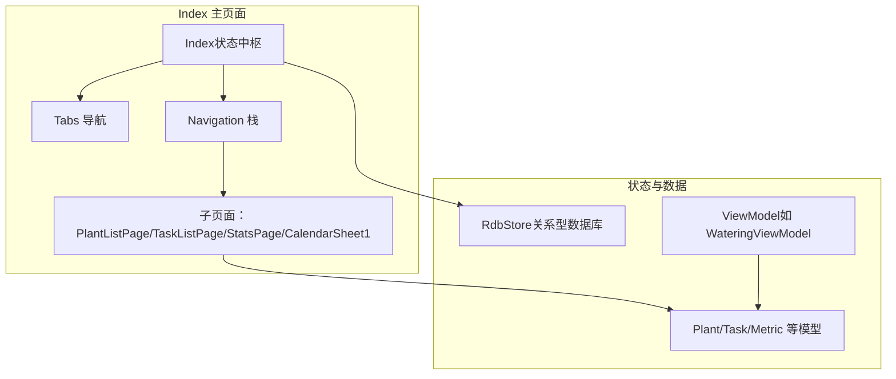

**图表来源**
- [Index.ets:855-1198](file://entry/src/main/ets/pages/Index.ets#L855-L1198)
- [RdbManager.ets:1-296](file://entry/src/main/ets/viewmodel/RdbManager.ets#L1-L296)
- [PlantModel.ets:1-166](file://entry/src/main/ets/model/PlantModel.ets#L1-L166)
- [WateringViewModel.ets:1-102](file://entry/src/main/ets/viewmodel/WateringViewModel.ets#L1-L102)

**章节来源**
- [Index.ets:115-135](file://entry/src/main/ets/pages/Index.ets#L115-L135)
- [RdbManager.ets:27-170](file://entry/src/main/ets/viewmodel/RdbManager.ets#L27-L170)

## 核心组件
- 数据库管理器 RdbManager：负责数据库初始化、建表与索引、默认模板数据注入、光照会话查询等
- Index 主页面：集中状态、生命周期、导航与弹层控制
- 模型层 Plant/Task/Metric 等：轻量数据结构，支持响应式观察
- 子页面与视图：PlantListPage、PlantCard、PlantTaskFilterSheet、CareTemplateSheet、TemplateManagerSheet、ConfirmDialogSheet 等
- ViewModel：如 WateringViewModel，承载特定业务的内存态与计算逻辑

**章节来源**
- [RdbManager.ets:4-295](file://entry/src/main/ets/viewmodel/RdbManager.ets#L4-L295)
- [Index.ets:41-112](file://entry/src/main/ets/pages/Index.ets#L41-L112)
- [PlantModel.ets:6-147](file://entry/src/main/ets/model/PlantModel.ets#L6-L147)
- [WateringViewModel.ets:11-96](file://entry/src/main/ets/viewmodel/WateringViewModel.ets#L11-L96)

## 架构总览
Index 采用“状态中枢 + 导航容器 + 弹层宿主”的架构模式：
- 状态中枢：Index 维护全局状态（植物、任务、模板、指标、筛选条件、弹层可见性等）
- 导航容器：Tabs + Navigation 提供 Tab 切换与页面栈管理
- 弹层宿主：统一挂载抽屉/对话框，避免页面间重复实现
- 数据流：数据库初始化完成后一次性加载植物、任务、模板等全局数据，避免局部状态不一致

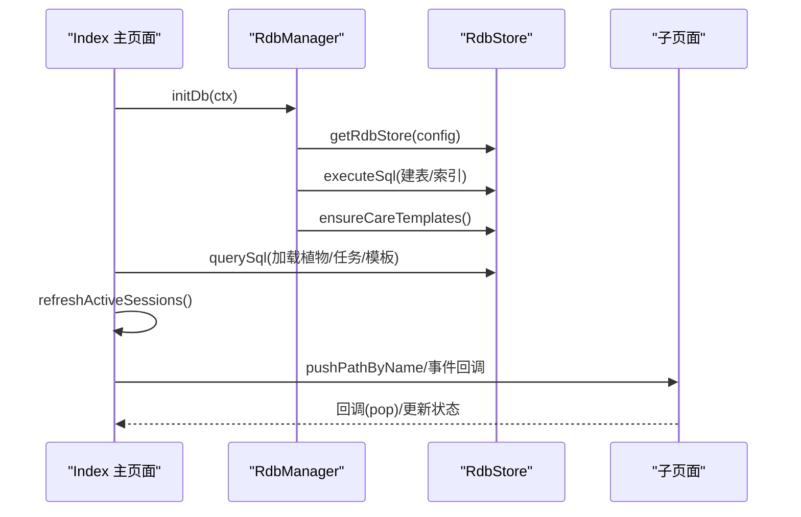

**图表来源**
- [Index.ets:116-141](file://entry/src/main/ets/pages/Index.ets#L116-L141)
- [RdbManager.ets:27-170](file://entry/src/main/ets/viewmodel/RdbManager.ets#L27-L170)

**章节来源**
- [Index.ets:116-141](file://entry/src/main/ets/pages/Index.ets#L116-L141)
- [RdbManager.ets:27-170](file://entry/src/main/ets/viewmodel/RdbManager.ets#L27-L170)

## 详细组件分析

### 生命周期与数据库初始化
- 生命周期：aboutToAppear 中触发 initDb，完成后标记 initialized 并显示初始化横幅
- 数据库初始化：统一在 RdbManager 中完成，包括建表、索引、默认模板数据注入
- 全局数据恢复：initDb 后一次性加载植物、任务、模板，并同步光照会话状态

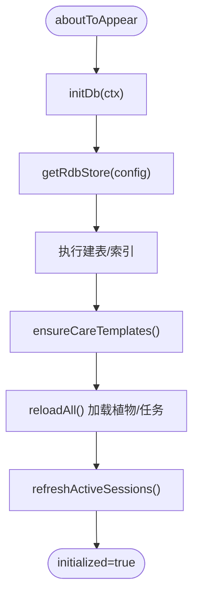

**图表来源**
- [Index.ets:116-141](file://entry/src/main/ets/pages/Index.ets#L116-L141)
- [RdbManager.ets:27-170](file://entry/src/main/ets/viewmodel/RdbManager.ets#L27-L170)

**章节来源**
- [Index.ets:116-141](file://entry/src/main/ets/pages/Index.ets#L116-L141)
- [RdbManager.ets:173-276](file://entry/src/main/ets/viewmodel/RdbManager.ets#L173-L276)

### 全局状态同步与光照会话
- 光照会话同步：Index 在加载植物后调用 refreshActiveSessions，从 RdbManager 获取“进行中”会话集合，写入 AppStorage，供 PlantCard 实时渲染“正在补光”状态
- 卡片联动：PlantCard 通过 AppStorage 读取 lighting_{id}，并在激活时启动呼吸动画

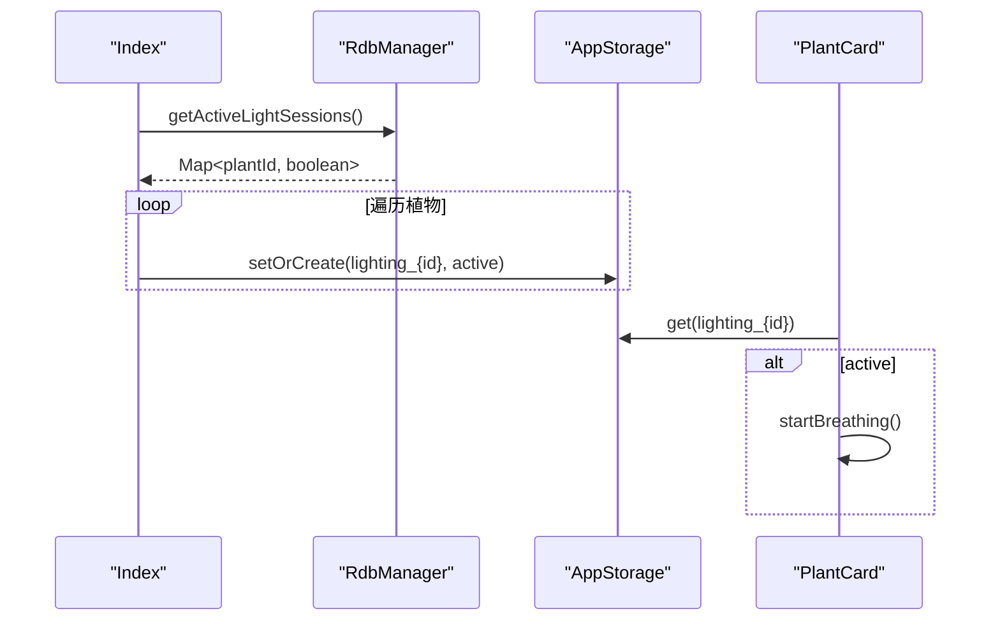

**图表来源**
- [Index.ets:162-168](file://entry/src/main/ets/pages/Index.ets#L162-L168)
- [RdbManager.ets:278-294](file://entry/src/main/ets/viewmodel/RdbManager.ets#L278-L294)
- [PlantCard.ets:42-53](file://entry/src/main/ets/view/PlantCard.ets#L42-L53)

**章节来源**
- [Index.ets:162-168](file://entry/src/main/ets/pages/Index.ets#L162-L168)
- [PlantCard.ets:42-53](file://entry/src/main/ets/view/PlantCard.ets#L42-L53)

### Tab 导航系统与页面间数据传递
- Tab 容器：Index 使用 Tabs + Navigation，TabContent 中承载 PlantListPage、TaskListPage、CalendarSheet1、StatsPage
- 页面间数据传递：通过 pushPathByName 传递参数，回调 pop 时触发 reloadAll，保证数据一致性
- 事件回调：子页面通过 onOpenDetail/onQuickAdd/onEdit 等回调将操作委派给 Index 统一处理

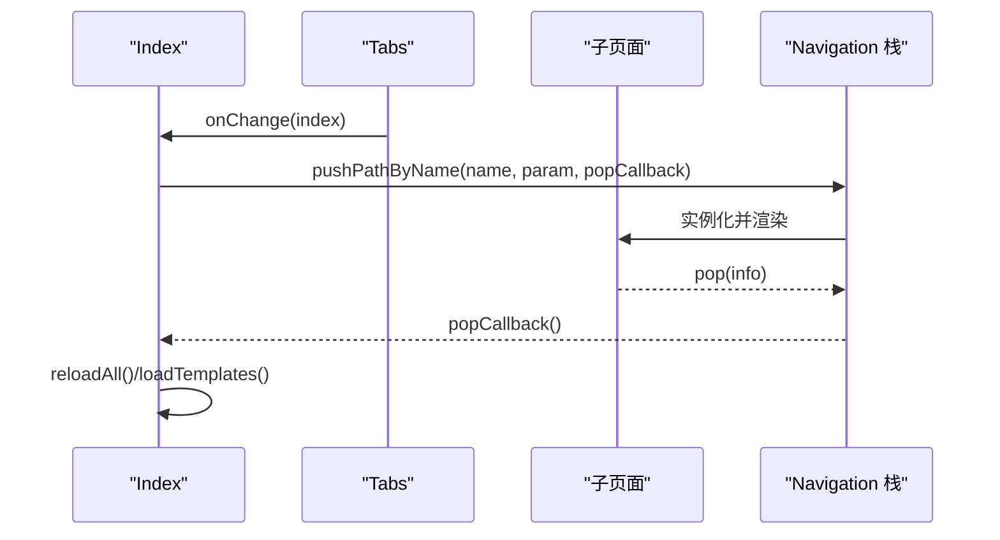

**图表来源**
- [Index.ets:859-1016](file://entry/src/main/ets/pages/Index.ets#L859-L1016)
- [Index.ets:878-927](file://entry/src/main/ets/pages/Index.ets#L878-L927)

**章节来源**
- [Index.ets:859-1016](file://entry/src/main/ets/pages/Index.ets#L859-L1016)

### 交互与动画：下拉刷新、FAB、横幅提示
- 下拉刷新：Index 维护 pullOffset/pulling/canRefresh/touchStartY 等状态，配合子页面的下拉手势实现刷新
- FAB 动画：通过 fabPressed 控制 scale 与动画，提供按压反馈
- 横幅提示：showBanner 统一管理消息类型与消失动画，使用 setTimeout 自动回收

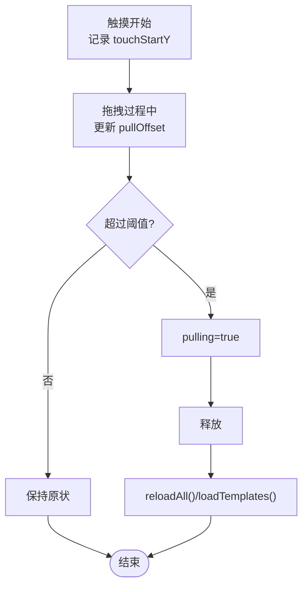

**图表来源**
- [Index.ets:71-78](file://entry/src/main/ets/pages/Index.ets#L71-L78)
- [Index.ets:1011-1016](file://entry/src/main/ets/pages/Index.ets#L1011-L1016)

**章节来源**
- [Index.ets:1311-1346](file://entry/src/main/ets/pages/Index.ets#L1311-L1346)
- [Index.ets:1349-1380](file://entry/src/main/ets/pages/Index.ets#L1349-L1380)

### 植物卡片状态管理
- 卡片状态：PlantCard 从 Index 的全局任务列表计算完成数/总数/完成率，避免重复查询
- 补光状态：通过 AppStorage 读取 lighting_{id}，激活时启动呼吸动画
- 快速操作：快捷“浇水/施肥/修剪”按钮将草稿任务交由 Index 创建

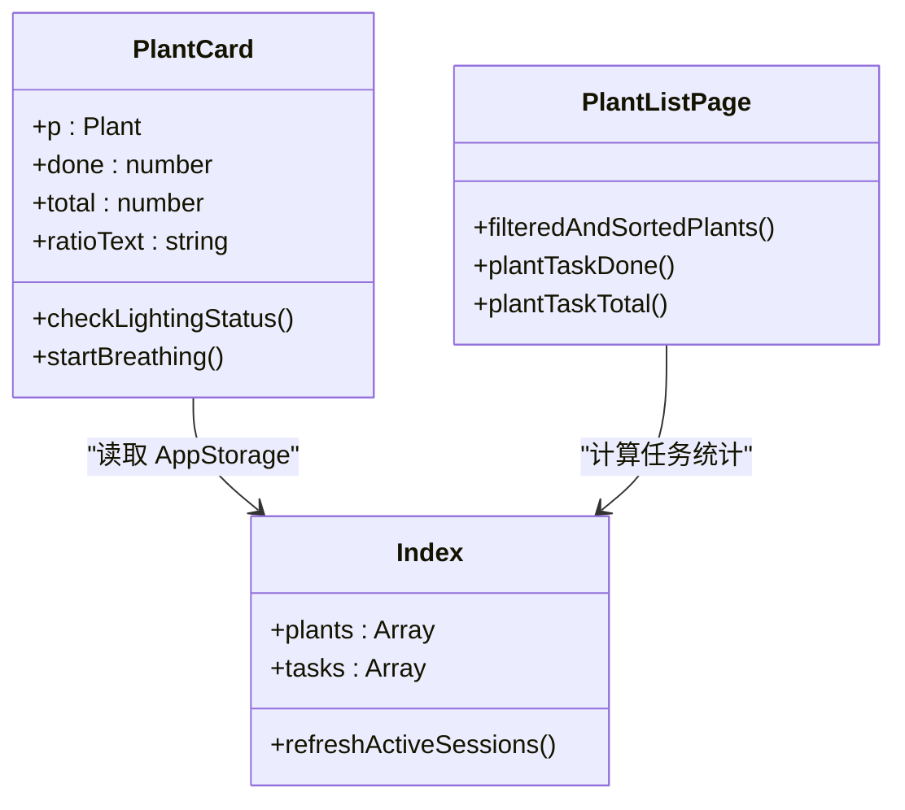

**图表来源**
- [PlantCard.ets:42-53](file://entry/src/main/ets/view/PlantCard.ets#L42-L53)
- [Index.ets:162-168](file://entry/src/main/ets/pages/Index.ets#L162-L168)
- [PlantListPage.ets:27-58](file://entry/src/main/ets/pages/PlantListPage.ets#L27-L58)

**章节来源**
- [PlantCard.ets:42-53](file://entry/src/main/ets/view/PlantCard.ets#L42-L53)
- [PlantListPage.ets:27-58](file://entry/src/main/ets/pages/PlantListPage.ets#L27-L58)

### 任务筛选机制
- 筛选弹层：PlantTaskFilterSheet 提供状态、类型、日期范围、关键词、排序等筛选项
- 筛选状态：Index 维护 PlantTaskFilter 对象，子页面通过 onApply/onReset 回调更新
- 排序键：支持按日期/类型/植物，升序/降序

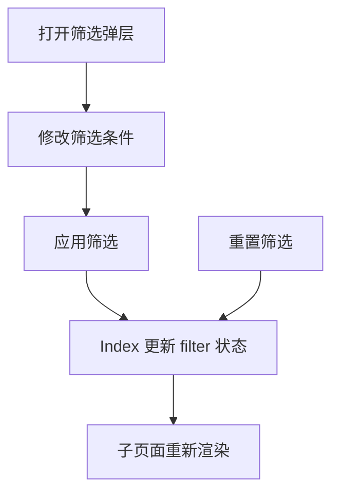

**图表来源**
- [PlantTaskFilterSheet.ets:1-374](file://entry/src/main/ets/view/PlantTaskFilterSheet.ets#L1-L374)
- [Index.ets:58-101](file://entry/src/main/ets/pages/Index.ets#L58-L101)

**章节来源**
- [PlantTaskFilterSheet.ets:1-374](file://entry/src/main/ets/view/PlantTaskFilterSheet.ets#L1-L374)
- [Index.ets:58-101](file://entry/src/main/ets/pages/Index.ets#L58-L101)

### 养护模板与任务生成
- 养护模板：CareTemplateSheet 支持预设与自定义间隔，生成指定天数内的任务
- 周期模板：TemplateManagerSheet 管理 PlanTpl（旧版），支持增删改与应用到植物
- 事务生成：Index.applyTemplateToPlant 使用事务批量插入，命中唯一索引自动跳过

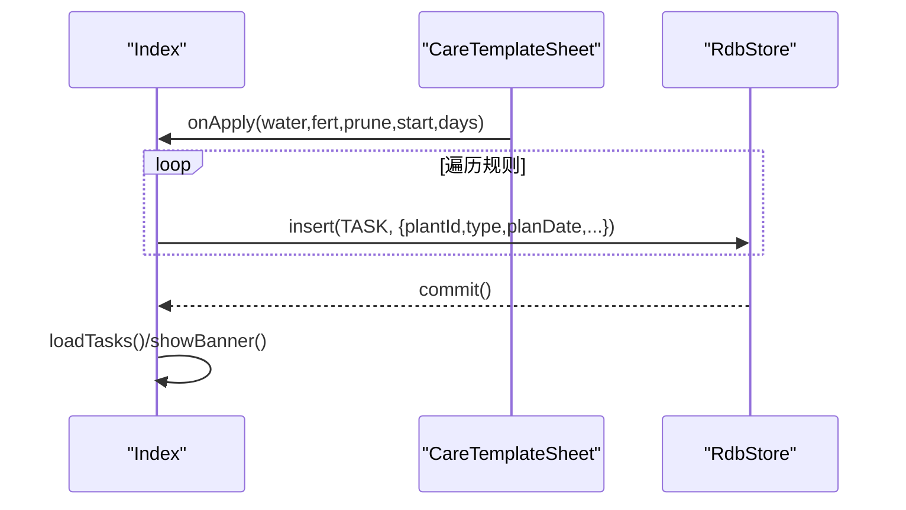

**图表来源**
- [Index.ets:814-852](file://entry/src/main/ets/pages/Index.ets#L814-L852)
- [CareTemplateSheet.ets:105-117](file://entry/src/main/ets/view/CareTemplateSheet.ets#L105-L117)

**章节来源**
- [Index.ets:814-852](file://entry/src/main/ets/pages/Index.ets#L814-L852)
- [CareTemplateSheet.ets:105-117](file://entry/src/main/ets/view/CareTemplateSheet.ets#L105-L117)

### 指标与趋势图
- 指标抽屉：Index 打开 MetricSheet，支持增删指标
- 趋势图：openMetricChart 加载指标数据并打开 MetricChartSheet
- 指标模型：PlantMetric/Metric 字段一致，兼容不同页面命名

**章节来源**
- [Index.ets:198-204](file://entry/src/main/ets/pages/Index.ets#L198-L204)
- [Index.ets:1039-1064](file://entry/src/main/ets/pages/Index.ets#L1039-L1064)
- [PlantModel.ets:109-147](file://entry/src/main/ets/model/PlantModel.ets#L109-L147)

### 删除确认与事务安全
- 删除确认：ConfirmDialogSheet 提供统一确认弹层
- 事务删除：Index.deletePlant 使用 runInTransaction 包裹，确保“表数据删除 + 文件删除”的原子性

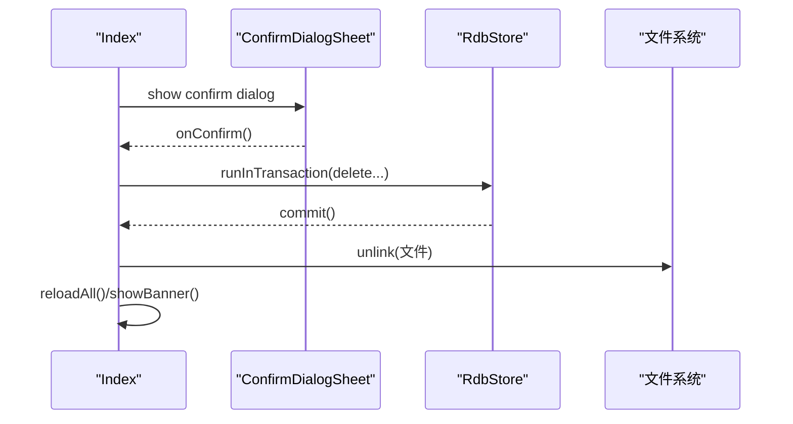

**图表来源**
- [Index.ets:1067-1083](file://entry/src/main/ets/pages/Index.ets#L1067-L1083)
- [DbUtils.ets:12-21](file://entry/src/main/ets/model/DbUtils.ets#L12-L21)
- [Index.ets:319-402](file://entry/src/main/ets/pages/Index.ets#L319-L402)

**章节来源**
- [ConfirmDialogSheet.ets:1-103](file://entry/src/main/ets/view/ConfirmDialogSheet.ets#L1-L103)
- [DbUtils.ets:12-21](file://entry/src/main/ets/model/DbUtils.ets#L12-L21)
- [Index.ets:319-402](file://entry/src/main/ets/pages/Index.ets#L319-L402)

### 养护 ViewModel 与动画
- WateringViewModel：管理浇水动画状态、历史记录、连胜天数等内存态
- 与 Index 的关系：Index 通过页面或上层服务决定是否持久化，ViewModel 仅维护内存态

**章节来源**
- [WateringViewModel.ets:11-96](file://entry/src/main/ets/viewmodel/WateringViewModel.ets#L11-L96)

## 依赖关系分析
- Index 依赖 RdbManager 提供统一数据库访问与建表/索引初始化
- Index 通过 Provider/Consumer 注入 store 与 RdbManager，供子页面使用
- PlantCard 依赖 AppStorage 与 RdbManager，实现状态联动与数据加载
- PlantListPage 依赖 Index 的任务统计与筛选状态

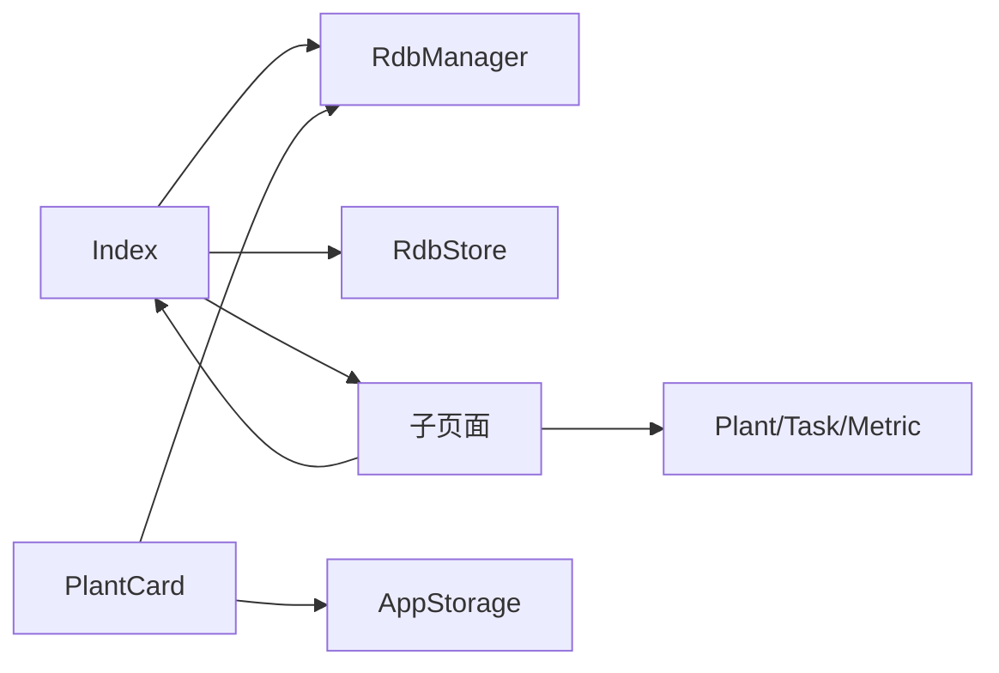

**图表来源**
- [Index.ets:44-47](file://entry/src/main/ets/pages/Index.ets#L44-L47)
- [PlantCard.ets:23-24](file://entry/src/main/ets/view/PlantCard.ets#L23-L24)

**章节来源**
- [Index.ets:44-47](file://entry/src/main/ets/pages/Index.ets#L44-L47)
- [PlantCard.ets:23-24](file://entry/src/main/ets/view/PlantCard.ets#L23-L24)

## 性能考虑
- 数据加载策略：一次性加载植物/任务/模板，避免子页面重复查询，降低 IO 与渲染压力
- 事务批处理：删除植物与生成任务均使用事务，减少中间态与回滚成本
- 索引优化：为常用查询建立复合索引（如任务按 plantId+createdAt、日志按 plantId+createdAt），提升查询效率
- 动画与提示：横幅与 FAB 动画时长适中，避免过度消耗帧率
- 内存管理：ViewModel 仅维护必要内存态，避免大对象常驻；删除文件失败时记录并提示，避免阻塞主线程

[本节为通用指导，无需具体文件引用]

## 故障排查指南
- 数据库初始化失败：检查 initDb 是否正确执行、表与索引是否创建成功、上下文是否有效
- 光照状态不同步：确认 refreshActiveSessions 是否被调用、AppStorage 键是否正确
- 删除植物失败：检查事务是否回滚、文件删除异常是否被捕获并提示
- 任务筛选无效：确认 PlantTaskFilterSheet 的 onApply 是否正确更新 Index 的 filter 状态
- 横幅不消失：检查 showBanner 的定时器与动画回调是否执行

**章节来源**
- [Index.ets:116-124](file://entry/src/main/ets/pages/Index.ets#L116-L124)
- [Index.ets:162-168](file://entry/src/main/ets/pages/Index.ets#L162-L168)
- [Index.ets:319-402](file://entry/src/main/ets/pages/Index.ets#L319-L402)
- [PlantTaskFilterSheet.ets:209-211](file://entry/src/main/ets/view/PlantTaskFilterSheet.ets#L209-L211)
- [Index.ets:715-723](file://entry/src/main/ets/pages/Index.ets#L715-L723)

## 结论
Index 通过“状态中枢 + 导航容器 + 弹层宿主”的架构，实现了数据库初始化、全局状态同步、Tab 导航与页面间数据传递、交互提示与动画、植物卡片状态管理、光照会话同步、任务筛选与模板生成等核心能力。其统一的数据加载与事务处理策略，确保了数据一致性与性能稳定性；清晰的事件回调与 Provider/Consumer 机制，降低了组件间的耦合度，便于扩展与维护。

## 附录
- 数据模型：Plant/Task/Metric/PlanTpl 等轻量结构，支持响应式观察
- 弹层组件：CareTemplateSheet、TemplateManagerSheet、ConfirmDialogSheet、PlantTaskFilterSheet 等
- ViewModel：WateringViewModel 管理特定业务的内存态与计算逻辑

**章节来源**
- [PlantModel.ets:6-147](file://entry/src/main/ets/model/PlantModel.ets#L6-L147)
- [CareTemplateSheet.ets:1-217](file://entry/src/main/ets/view/CareTemplateSheet.ets#L1-L217)
- [TemplateManagerSheet.ets:1-249](file://entry/src/main/ets/view/TemplateManagerSheet.ets#L1-L249)
- [ConfirmDialogSheet.ets:1-103](file://entry/src/main/ets/view/ConfirmDialogSheet.ets#L1-L103)
- [PlantTaskFilterSheet.ets:1-374](file://entry/src/main/ets/view/PlantTaskFilterSheet.ets#L1-L374)
- [WateringViewModel.ets:11-96](file://entry/src/main/ets/viewmodel/WateringViewModel.ets#L11-L96)