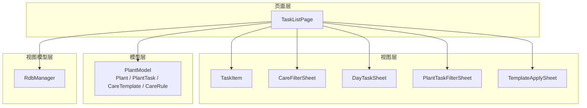
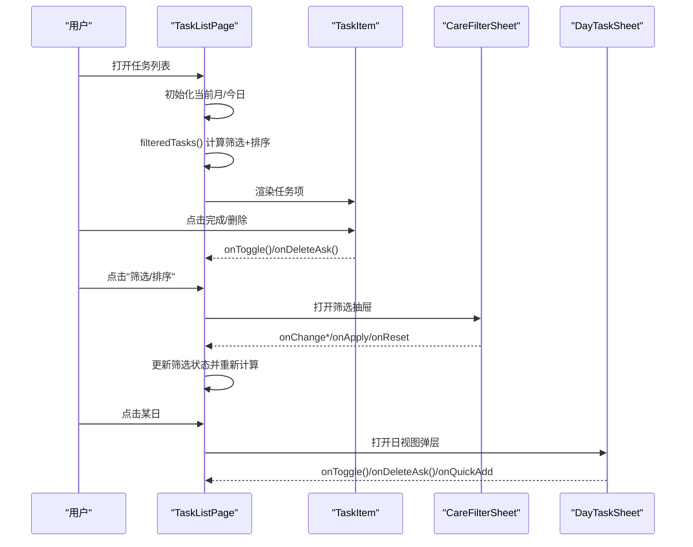
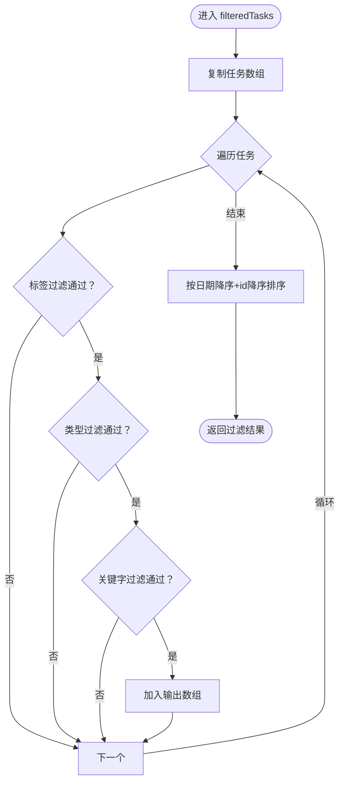
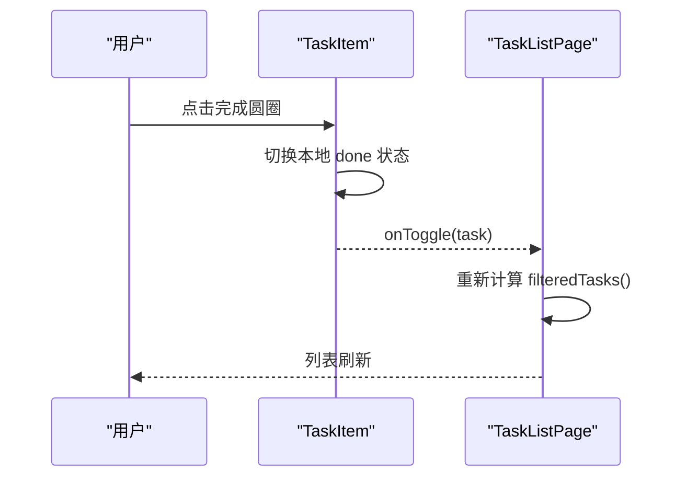
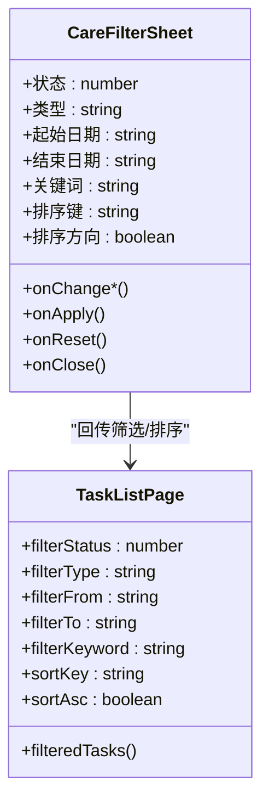
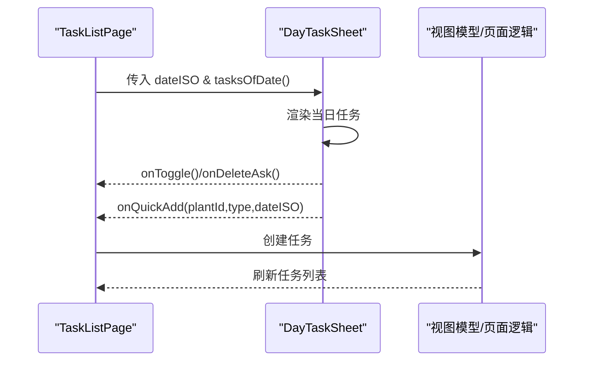
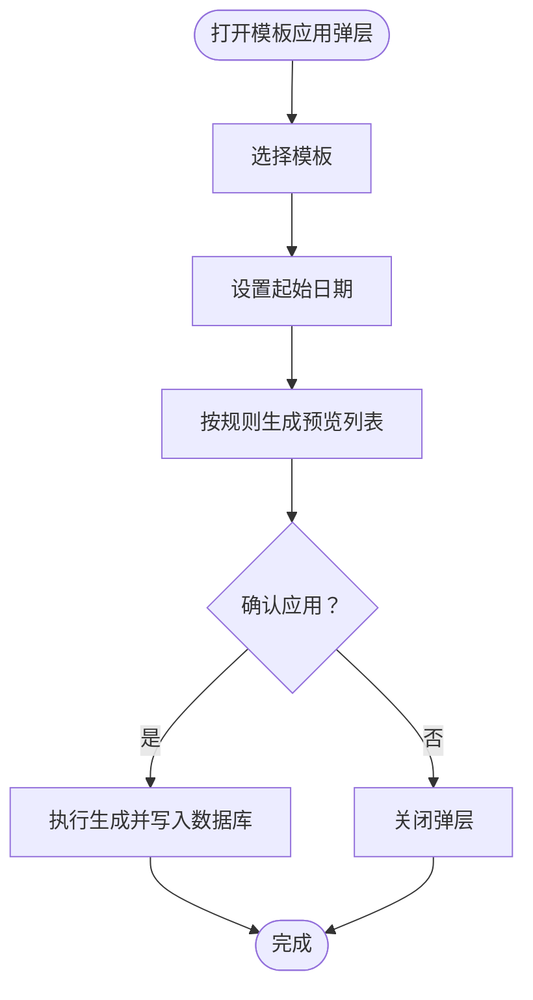
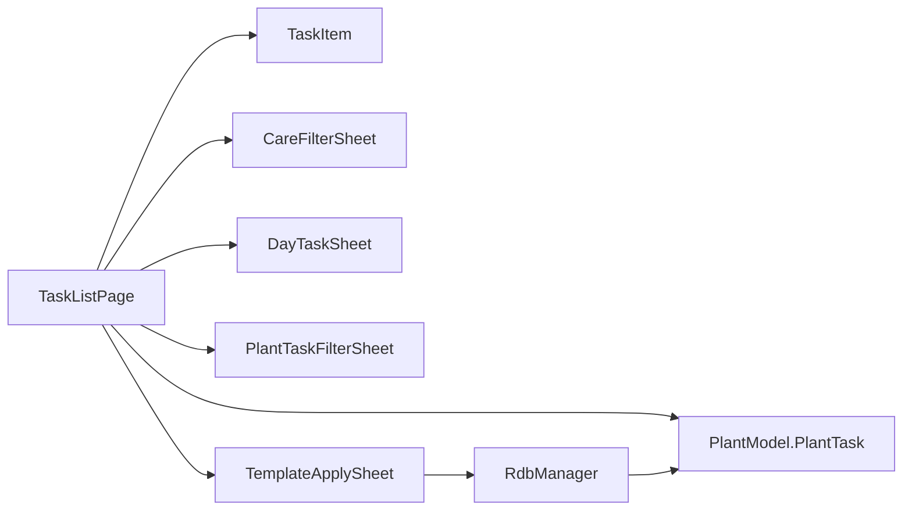

# 任务列表页 TaskListPage

<cite>
**本文引用的文件**
- [TaskListPage.ets](file://entry/src/main/ets/pages/TaskListPage.ets)
- [TaskItem.ets](file://entry/src/main/ets/view/TaskItem.ets)
- [CareFilterSheet.ets](file://entry/src/main/ets/view/CareFilterSheet.ets)
- [DayTaskSheet.ets](file://entry/src/main/ets/view/DayTaskSheet.ets)
- [PlantTaskFilterSheet.ets](file://entry/src/main/ets/view/PlantTaskFilterSheet.ets)
- [TemplateApplySheet.ets](file://entry/src/main/ets/view/TemplateApplySheet.ets)
- [RdbManager.ets](file://entry/src/main/ets/viewmodel/RdbManager.ets)
- [PlantModel.ets](file://entry/src/main/ets/model/PlantModel.ets)
- [ConfirmDialogSheet.ets](file://entry/src/main/ets/view/ConfirmDialogSheet.ets)
- [WaterRecord.ets](file://entry/src/main/ets/model/WaterRecord.ets)
</cite>

## 更新摘要
**变更内容**
- 新增页面级滚动动画配置，提升导航流畅性
- 优化任务项交互动画，增强用户反馈体验
- 完善筛选与切换操作的动画过渡效果

## 目录
1. [简介](#简介)
2. [项目结构](#项目结构)
3. [核心组件](#核心组件)
4. [架构总览](#架构总览)
5. [详细组件分析](#详细组件分析)
6. [依赖关系分析](#依赖关系分析)
7. [性能考量](#性能考量)
8. [故障排查指南](#故障排查指南)
9. [结论](#结论)
10. [附录](#附录)

## 简介
本文件围绕任务列表页 TaskListPage 的设计与实现进行全面解析，重点涵盖：
- 展示模式与筛选机制：列表视图下的标签筛选、类型筛选、关键字搜索与排序策略
- 任务状态管理：完成标记、历史追踪与状态变更流程
- 批量与快速操作：日视图弹层、快速新增、批量删除确认
- 提醒与重复任务：基于模板与规则的周期性任务生成与预览
- 优先级管理：当前版本以完成状态与日期排序为主，可扩展优先级字段
- 模板应用与自动化：模板选择、起始日期设定、生成范围与预览
- **动画优化**：页面级滚动动画、任务项交互动画与筛选切换动画，显著提升导航流畅性与用户体验

## 项目结构
TaskListPage 位于页面层，配合视图组件与数据模型协同工作，形成清晰的分层：
- 页面层：TaskListPage 负责筛选、排序、视图切换与弹层调度
- 视图层：TaskItem、CareFilterSheet、DayTaskSheet、PlantTaskFilterSheet、TemplateApplySheet 提供交互与展示
- 模型层：Plant、PlantTask、CareTemplate、CareRule 等数据结构
- 视图模型层：RdbManager 提供数据库初始化、索引与模板数据注入

**图表来源**
- [TaskListPage.ets:1-463](file://entry/src/main/ets/pages/TaskListPage.ets#L1-L463)
- [TaskItem.ets:1-67](file://entry/src/main/ets/view/TaskItem.ets#L1-L67)
- [CareFilterSheet.ets:1-212](file://entry/src/main/ets/view/CareFilterSheet.ets#L1-L212)
- [DayTaskSheet.ets:1-228](file://entry/src/main/ets/view/DayTaskSheet.ets#L1-L228)
- [PlantTaskFilterSheet.ets:1-374](file://entry/src/main/ets/view/PlantTaskFilterSheet.ets#L1-L374)
- [TemplateApplySheet.ets:1-145](file://entry/src/main/ets/view/TemplateApplySheet.ets#L1-L145)
- [RdbManager.ets:1-296](file://entry/src/main/ets/viewmodel/RdbManager.ets#L1-L296)
- [PlantModel.ets:1-166](file://entry/src/main/ets/model/PlantModel.ets#L1-L166)

**章节来源**
- [TaskListPage.ets:1-463](file://entry/src/main/ets/pages/TaskListPage.ets#L1-L463)

## 核心组件
- 任务列表页 TaskListPage：负责筛选、排序、视图切换与弹层调度
- 任务项 TaskItem：展示单条任务并触发完成/删除事件
- 筛选抽屉 CareFilterSheet：提供状态、类型、日期范围、关键词与排序设置
- 日视图弹层 DayTaskSheet：展示指定日期任务并支持快速新增与删除
- 植物任务筛选 PlantTaskFilterSheet：更完整的筛选与排序能力（作为备用）
- 模板应用 TemplateApplySheet：模板选择、起始日期与生成预览
- 数据模型 PlantModel：Plant、PlantTask、CareTemplate、CareRule
- 视图模型 RdbManager：数据库初始化、索引与模板数据注入

**章节来源**
- [TaskListPage.ets:6-33](file://entry/src/main/ets/pages/TaskListPage.ets#L6-L33)
- [TaskItem.ets:5-11](file://entry/src/main/ets/view/TaskItem.ets#L5-L11)
- [CareFilterSheet.ets:1-18](file://entry/src/main/ets/view/CareFilterSheet.ets#L1-L18)
- [DayTaskSheet.ets:3-11](file://entry/src/main/ets/view/DayTaskSheet.ets#L3-L11)
- [PlantTaskFilterSheet.ets:16-22](file://entry/src/main/ets/view/PlantTaskFilterSheet.ets#L16-L22)
- [TemplateApplySheet.ets:3-10](file://entry/src/main/ets/view/TemplateApplySheet.ets#L3-L10)
- [PlantModel.ets:6-59](file://entry/src/main/ets/model/PlantModel.ets#L6-L59)
- [RdbManager.ets:4-24](file://entry/src/main/ets/viewmodel/RdbManager.ets#L4-L24)

## 架构总览
TaskListPage 采用"页面 + 视图组件 + 数据模型 + 视图模型"的分层架构。页面通过参数接收任务与植物数据，内部维护筛选与排序状态，计算过滤后的任务列表并驱动子组件渲染。

**图表来源**
- [TaskListPage.ets:31-337](file://entry/src/main/ets/pages/TaskListPage.ets#L31-L337)
- [TaskItem.ets:17-65](file://entry/src/main/ets/view/TaskItem.ets#L17-L65)
- [CareFilterSheet.ets:20-178](file://entry/src/main/ets/view/CareFilterSheet.ets#L20-L178)
- [DayTaskSheet.ets:73-158](file://entry/src/main/ets/view/DayTaskSheet.ets#L73-L158)

## 详细组件分析

### 任务列表页 TaskListPage
- 状态与参数
  - 视图模式：列表/日历（当前默认列表）
  - 筛选：标签（全部/今天/将来/已完成）、类型、关键字
  - 高级筛选：状态、类型集合、日期范围、关键词、排序键与方向
  - 排序：日期降序，同日按 id 降序
- 关键算法
  - filteredTasks：复制源数组 → 三向过滤（标签/类型/关键字）→ 排序
  - tasksOfDate：按日期筛选当日任务，供日视图弹层复用
- 视图与交互
  - 列表视图：顶部标签与类型条 + 任务列表
  - 弹层：筛选抽屉、日视图弹层
  - 搜索：顶部搜索框，匹配"植物名/任务类型"
  - **动画优化**：列表滚动使用 Spring 边缘效果与 300ms 缓动动画，提升滚动流畅度

**更新** 新增页面级滚动动画配置，优化导航体验

**图表来源**
- [TaskListPage.ets:135-162](file://entry/src/main/ets/pages/TaskListPage.ets#L135-L162)

**章节来源**
- [TaskListPage.ets:14-30](file://entry/src/main/ets/pages/TaskListPage.ets#L14-L30)
- [TaskListPage.ets:95-162](file://entry/src/main/ets/pages/TaskListPage.ets#L95-L162)
- [TaskListPage.ets:41-52](file://entry/src/main/ets/pages/TaskListPage.ets#L41-L52)
- [TaskListPage.ets:165-337](file://entry/src/main/ets/pages/TaskListPage.ets#L165-L337)

### 任务项 TaskItem
- 展示内容：类型·植物名、计划日期、完成状态视觉反馈
- 交互：点击完成切换状态并回调父页；点击删除触发删除询问
- **动画优化**：完成切换与触摸反馈增强交互体验，包括缩放、透明度和阴影动画

**更新** 新增多项动画配置，提升交互反馈质量

**图表来源**
- [TaskItem.ets:17-65](file://entry/src/main/ets/view/TaskItem.ets#L17-L65)
- [TaskListPage.ets:221-227](file://entry/src/main/ets/pages/TaskListPage.ets#L221-L227)

**章节来源**
- [TaskItem.ets:17-65](file://entry/src/main/ets/view/TaskItem.ets#L17-L65)

### 筛选抽屉 CareFilterSheet
- 支持：状态（全部/未完成/已完成）、类型（浇水/施肥/修剪）、日期范围、关键词、排序键与方向
- 交互：点击应用将筛选条件回传至 TaskListPage，重置按钮清空条件

**图表来源**
- [CareFilterSheet.ets:2-18](file://entry/src/main/ets/view/CareFilterSheet.ets#L2-L18)
- [TaskListPage.ets:17-30](file://entry/src/main/ets/pages/TaskListPage.ets#L17-L30)

**章节来源**
- [CareFilterSheet.ets:20-178](file://entry/src/main/ets/view/CareFilterSheet.ets#L20-L178)

### 日视图弹层 DayTaskSheet
- 展示指定日期的任务列表，支持按植物筛选与快速新增
- 快速新增：基于选中植物与类型，直接调用 onCreateTask 回调

**图表来源**
- [DayTaskSheet.ets:4-21](file://entry/src/main/ets/view/DayTaskSheet.ets#L4-L21)
- [TaskListPage.ets:316-334](file://entry/src/main/ets/pages/TaskListPage.ets#L316-L334)

**章节来源**
- [DayTaskSheet.ets:73-158](file://entry/src/main/ets/view/DayTaskSheet.ets#L73-L158)
- [TaskListPage.ets:316-334](file://entry/src/main/ets/pages/TaskListPage.ets#L316-L334)

### 植物任务筛选 PlantTaskFilterSheet
- 更完整的筛选与排序能力，适合在页面内集成更复杂的筛选场景
- 包含状态、类型开关、日期范围、关键词与排序控制

**章节来源**
- [PlantTaskFilterSheet.ets:16-248](file://entry/src/main/ets/view/PlantTaskFilterSheet.ets#L16-L248)

### 模板应用 TemplateApplySheet
- 模板选择：从 CareTemplate 列表中选择
- 起始日期：默认今日，可调整
- 生成预览：根据 CareRule 的 intervalDays 与 horizonDays 计算生成日期序列
- 应用：将模板应用到目标植物并执行生成

**图表来源**
- [TemplateApplySheet.ets:14-60](file://entry/src/main/ets/view/TemplateApplySheet.ets#L14-L60)
- [RdbManager.ets:173-276](file://entry/src/main/ets/viewmodel/RdbManager.ets#L173-L276)

**章节来源**
- [TemplateApplySheet.ets:62-143](file://entry/src/main/ets/view/TemplateApplySheet.ets#L62-L143)
- [RdbManager.ets:173-276](file://entry/src/main/ets/viewmodel/RdbManager.ets#L173-L276)

### 数据模型 PlantModel
- Plant：植物基本信息
- PlantTask：任务实体（id、plantId、type、planDate、done、doneAt）
- CareTemplate / CareRule：模板与规则（模板包含多条规则，描述生成节奏）

**章节来源**
- [PlantModel.ets:6-59](file://entry/src/main/ets/model/PlantModel.ets#L6-L59)
- [PlantModel.ets:150-163](file://entry/src/main/ets/model/PlantModel.ets#L150-L163)

### 视图模型 RdbManager
- 数据库初始化：创建 plant、task、tpl、log、metric、log_photo、care_template、care_rule、light_profile、exposure_session 等表
- 索引优化：task 表按 planDate、plantId 建立索引，提升查询与排序性能
- 模板数据注入：首次空库时插入默认模板与规则，便于任务生成

**章节来源**
- [RdbManager.ets:27-170](file://entry/src/main/ets/viewmodel/RdbManager.ets#L27-L170)
- [RdbManager.ets:173-276](file://entry/src/main/ets/viewmodel/RdbManager.ets#L173-L276)

## 依赖关系分析
- TaskListPage 依赖 PlantModel 的 PlantTask 结构，使用其字段进行过滤与排序
- TaskListPage 通过 CareFilterSheet 与 DayTaskSheet 与用户交互，回传筛选与操作事件
- 模板应用依赖 RdbManager 的 care_template 与 care_rule 表，生成任务时利用唯一索引避免重复

**图表来源**
- [TaskListPage.ets:1-12](file://entry/src/main/ets/pages/TaskListPage.ets#L1-L12)
- [TemplateApplySheet.ets:1-10](file://entry/src/main/ets/view/TemplateApplySheet.ets#L1-L10)
- [RdbManager.ets:4-24](file://entry/src/main/ets/viewmodel/RdbManager.ets#L4-L24)

**章节来源**
- [TaskListPage.ets:1-12](file://entry/src/main/ets/pages/TaskListPage.ets#L1-L12)
- [TemplateApplySheet.ets:1-10](file://entry/src/main/ets/view/TemplateApplySheet.ets#L1-L10)
- [RdbManager.ets:4-24](file://entry/src/main/ets/viewmodel/RdbManager.ets#L4-L24)

## 性能考量
- 过滤与排序
  - filteredTasks 使用线性扫描与一次排序，时间复杂度 O(n) + O(n log n)
  - 建议：在大数据量下考虑分页加载与懒渲染
- 数据库索引
  - task 表按 planDate、plantId 建立索引，有利于筛选与排序
  - 唯一索引避免重复任务插入，减少冲突处理成本
- **动画优化**
  - 列表滚动与弹层动画使用系统动画，保证流畅度
  - 任务项完成切换与触摸反馈增强即时反馈
  - 页面级动画使用 120ms 缓动曲线，确保切换响应迅速且平滑

**更新** 新增动画性能优化考量

## 故障排查指南
- 删除确认
  - 使用 ConfirmDialogSheet 提供统一的删除确认弹层，避免误删
- 任务重复
  - 通过唯一索引约束避免重复任务；如出现重复，检查模板生成逻辑与日期范围
- 筛选不生效
  - 确认 CareFilterSheet 的 onChange* 是否正确回传至 TaskListPage
  - 检查 filteredTasks 的过滤条件是否被正确应用
- 日视图弹层
  - 确认 tasksOfDate 的日期匹配与 PlantTask.planDate 格式一致（ISO）
- **动画问题**
  - 检查 animateTo 函数的 duration 和 curve 参数配置
  - 确认 .animation() 配置中的持续时间和缓动函数设置合理
  - 验证 EdgeEffect.Spring 在滚动时的边缘反馈效果

**更新** 新增动画相关故障排查指导

**章节来源**
- [ConfirmDialogSheet.ets:13-102](file://entry/src/main/ets/view/ConfirmDialogSheet.ets#L13-L102)
- [RdbManager.ets:134-146](file://entry/src/main/ets/viewmodel/RdbManager.ets#L134-L146)
- [TaskListPage.ets:41-52](file://entry/src/main/ets/pages/TaskListPage.ets#L41-L52)

## 结论
TaskListPage 通过清晰的分层设计与完善的筛选/排序机制，提供了高效的任务管理体验。结合模板与规则的自动化生成，能够显著降低用户维护成本。**最新的滚动动画改进**进一步提升了导航流畅性和用户体验，包括页面级滚动动画、任务项交互动画和筛选切换动画。建议在后续迭代中引入优先级字段、批量操作与更丰富的统计视图，进一步提升效率与可读性。

**更新** 新增动画优化成果总结

## 附录
- 任务状态字段：done（0/1）、doneAt（时间戳）
- 任务排序键：date（计划日期）、type（任务类型）、status（完成状态）、plant（植物）
- 模板生成规则：intervalDays（间隔天数）、horizonDays（生成范围）
- **动画配置**：duration（持续时间）、curve（缓动函数）、EdgeEffect（边缘效果）

**更新** 新增动画配置说明

**章节来源**
- [PlantModel.ets:43-59](file://entry/src/main/ets/model/PlantModel.ets#L43-L59)
- [PlantTaskFilterSheet.ets:4-14](file://entry/src/main/ets/view/PlantTaskFilterSheet.ets#L4-L14)
- [TemplateApplySheet.ets:44-60](file://entry/src/main/ets/view/TemplateApplySheet.ets#L44-L60)