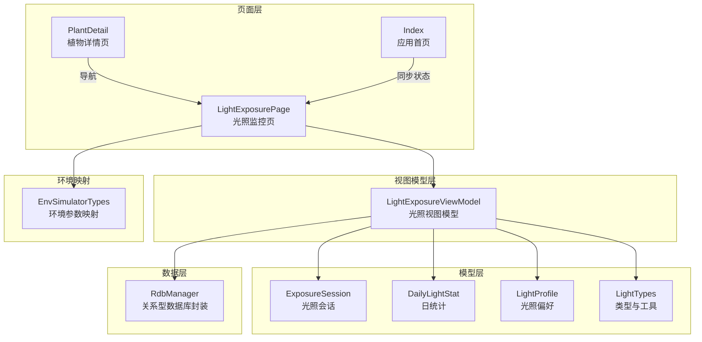
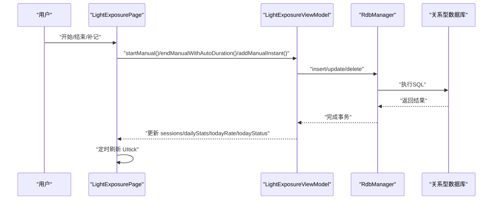
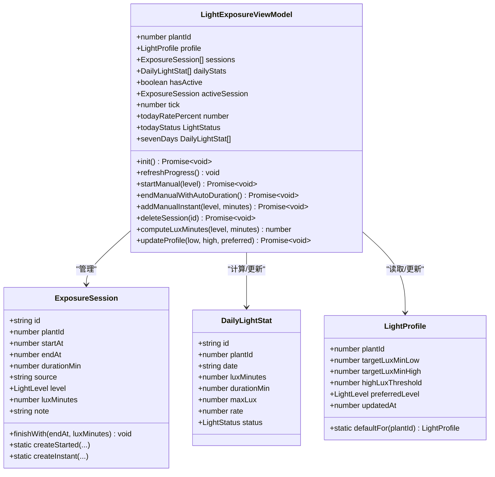
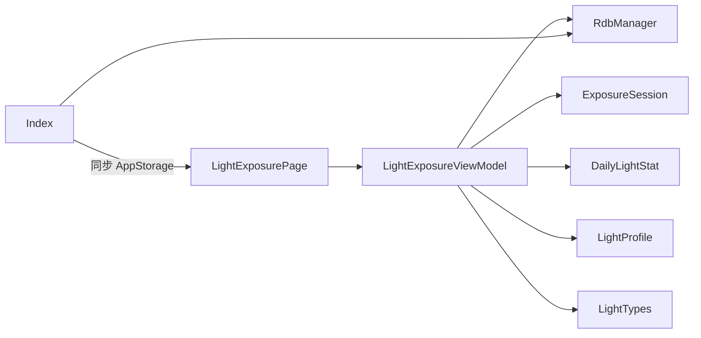
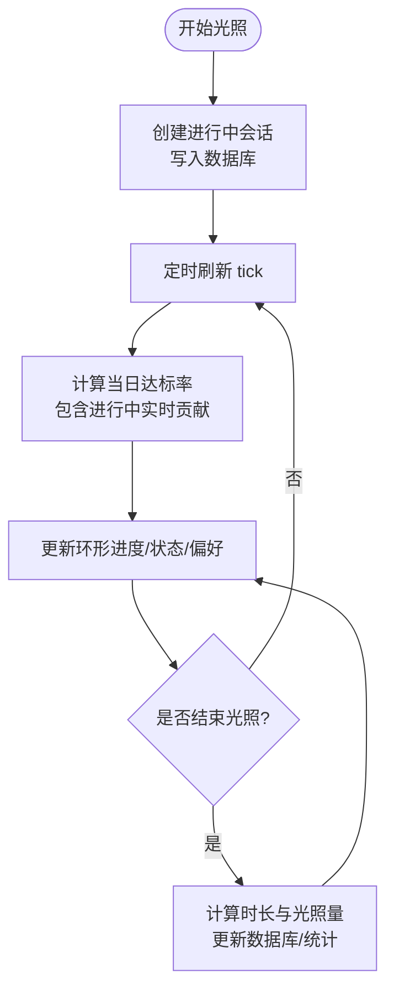

# 光照监控页 LightExposurePage

<cite>
**本文引用的文件**   
- [LightExposurePage.ets](file://entry/src/main/ets/pages/LightExposurePage.ets)
- [LightExposureViewModel.ets](file://entry/src/main/ets/viewmodel/LightExposureViewModel.ets)
- [ExposureSession.ets](file://entry/src/main/ets/model/ExposureSession.ets)
- [DailyLightStat.ets](file://entry/src/main/ets/model/DailyLightStat.ets)
- [LightProfile.ets](file://entry/src/main/ets/model/LightProfile.ets)
- [LightTypes.ets](file://entry/src/main/ets/model/LightTypes.ets)
- [RdbManager.ets](file://entry/src/main/ets/viewmodel/RdbManager.ets)
- [Index.ets](file://entry/src/main/ets/pages/Index.ets)
- [EnvSimulatorTypes.ets](file://entry/src/main/ets/model/EnvSimulatorTypes.ets)
- [PlantDetail.ets](file://entry/src/main/ets/pages/PlantDetail.ets)
</cite>

## 目录
1. [简介](#简介)
2. [项目结构](#项目结构)
3. [核心组件](#核心组件)
4. [架构总览](#架构总览)
5. [详细组件分析](#详细组件分析)
6. [依赖关系分析](#依赖关系分析)
7. [性能考量](#性能考量)
8. [故障排查指南](#故障排查指南)
9. [结论](#结论)
10. [附录](#附录)

## 简介
本文件围绕光照监控页 LightExposurePage 的完整实现进行系统化技术文档整理，涵盖光照记录采集机制、实时显示逻辑、光照会话管理、状态同步与历史数据查询、偏好设置与达标率计算、统计分析、图表展示与趋势预测、异常提醒机制、传感器集成与数据准确性保障，以及优化建议与用户体验改进方案。文档面向开发者与产品/运营人员，既提供代码级细节，也给出可视化架构图与流程图，帮助快速理解与维护。

## 项目结构
LightExposurePage 位于页面层，通过视图模型 LightExposureViewModel 管理光照会话与统计；数据持久化由 RdbManager 统一封装；模型层包含 ExposureSession、DailyLightStat、LightProfile、LightTypes 等实体与工具；Index 页面负责全局状态同步（如进行中会话状态）；PlantDetail 页面提供导航入口；EnvSimulatorTypes 提供光照与环境参数的映射与建议。

**图表来源**
- [LightExposurePage.ets](file://entry/src/main/ets/pages/LightExposurePage.ets)
- [LightExposureViewModel.ets](file://entry/src/main/ets/viewmodel/LightExposureViewModel.ets)
- [ExposureSession.ets](file://entry/src/main/ets/model/ExposureSession.ets)
- [DailyLightStat.ets](file://entry/src/main/ets/model/DailyLightStat.ets)
- [LightProfile.ets](file://entry/src/main/ets/model/LightProfile.ets)
- [LightTypes.ets](file://entry/src/main/ets/model/LightTypes.ets)
- [RdbManager.ets](file://entry/src/main/ets/viewmodel/RdbManager.ets)
- [Index.ets](file://entry/src/main/ets/pages/Index.ets)
- [EnvSimulatorTypes.ets](file://entry/src/main/ets/model/EnvSimulatorTypes.ets)
- [PlantDetail.ets](file://entry/src/main/ets/pages/PlantDetail.ets)

**章节来源**
- [LightExposurePage.ets](file://entry/src/main/ets/pages/LightExposurePage.ets)
- [LightExposureViewModel.ets](file://entry/src/main/ets/viewmodel/LightExposureViewModel.ets)
- [RdbManager.ets](file://entry/src/main/ets/viewmodel/RdbManager.ets)
- [Index.ets](file://entry/src/main/ets/pages/Index.ets)
- [PlantDetail.ets](file://entry/src/main/ets/pages/PlantDetail.ets)

## 核心组件
- 页面组件 LightExposurePage：负责 UI 布局、交互与实时刷新（环形进度、状态卡、偏好设置、历史会话列表、删除操作等）。
- 视图模型 LightExposureViewModel：负责光照会话生命周期管理、数据库读写、统计计算、实时刷新驱动与偏好更新。
- 模型层：
  - ExposureSession：单次光照会话（开始/结束/即时记录）。
  - DailyLightStat：每日光照统计（达标率、状态、时长、光照量）。
  - LightProfile：植物光照偏好与目标范围。
  - LightTypes：光照级别/状态枚举、标签/颜色映射、权重、日期/时间工具、ID 生成等。
- 数据层 RdbManager：统一建库、建表、索引与 SQL 操作，提供光照配置与会话表访问。
- 环境映射 EnvSimulatorTypes：光照与环境参数的映射与建议，辅助理解光照数据的业务含义。

**章节来源**
- [LightExposurePage.ets](file://entry/src/main/ets/pages/LightExposurePage.ets)
- [LightExposureViewModel.ets](file://entry/src/main/ets/viewmodel/LightExposureViewModel.ets)
- [ExposureSession.ets](file://entry/src/main/ets/model/ExposureSession.ets)
- [DailyLightStat.ets](file://entry/src/main/ets/model/DailyLightStat.ets)
- [LightProfile.ets](file://entry/src/main/ets/model/LightProfile.ets)
- [LightTypes.ets](file://entry/src/main/ets/model/LightTypes.ets)
- [RdbManager.ets](file://entry/src/main/ets/viewmodel/RdbManager.ets)
- [EnvSimulatorTypes.ets](file://entry/src/main/ets/model/EnvSimulatorTypes.ets)

## 架构总览
页面层通过 ViewModel 与模型层交互，数据持久化由 RdbManager 统一管理。Index 页面负责全局状态同步（如“进行中”状态），PlantDetail 提供导航入口。EnvSimulatorTypes 提供光照与环境参数映射，辅助理解光照数据的业务含义。

**图表来源**
- [LightExposurePage.ets](file://entry/src/main/ets/pages/LightExposurePage.ets)
- [LightExposureViewModel.ets](file://entry/src/main/ets/viewmodel/LightExposureViewModel.ets)
- [RdbManager.ets](file://entry/src/main/ets/viewmodel/RdbManager.ets)

## 详细组件分析

### 页面层：LightExposurePage
- 实时刷新机制：通过每秒定时器触发 ViewModel 的 refreshProgress，驱动 UI 响应式更新（环形进度、达标率、进行中状态）。
- 交互对话框：
  - 手动开始对话框：选择光照强度后启动会话。
  - 手动补记对话框：选择强度与时长后补录历史记录。
- 核心区域：
  - 顶部卡片：当日达标率、状态、目标范围、开始/结束按钮。
  - 光照偏好卡片：快速调整目标上下限与偏好强度，一键应用推荐设置。
  - 历史会话列表：支持滑动删除，展示会话时间段、强度、时长与光照量。
  - 近 7 日条形图：按日展示达标状态与光照量，今日若存在进行中会话，图表叠加实时值。
- 导航与参数：通过导航友好参数接收 Plant 对象，首次进入时初始化 ViewModel。

**章节来源**
- [LightExposurePage.ets](file://entry/src/main/ets/pages/LightExposurePage.ets)

### 视图模型层：LightExposureViewModel
- 初始化与数据加载：从数据库加载光照配置、历史会话，检查并清理异常进行中会话，重建每日统计。
- 会话管理：
  - startManual：创建进行中会话，写入数据库，同步 AppStorage 标记。
  - endManualWithAutoDuration：自动计算时长与光照量，更新数据库与 AppStorage。
  - addManualInstant：即时记录，不进入进行中状态。
  - deleteSession：删除会话并修正进行中状态与对应日期统计。
  - forceCloseAbnormalSession：强制结束异常进行中会话。
- 统计与达标率：
  - computeLuxMinutes：按级别权重计算等效光照量（lux-min）。
  - rebuildDailyStats/updateDailyStatFor：增量更新每日统计。
  - calcStatStatus：根据目标上限计算达标率与状态（不足/适中/过强）。
  - todayRatePercent/todayStatus：包含进行中实时贡献的当日达标率与状态。
  - sevenDays：近 7 日统计，今日若进行中则叠加实时值。
- 偏好设置：
  - updateProfile：更新目标上下限与偏好强度，必要时自动切换偏好，更新数据库并触发当日统计刷新。

**图表来源**
- [LightExposureViewModel.ets](file://entry/src/main/ets/viewmodel/LightExposureViewModel.ets)
- [ExposureSession.ets](file://entry/src/main/ets/model/ExposureSession.ets)
- [DailyLightStat.ets](file://entry/src/main/ets/model/DailyLightStat.ets)
- [LightProfile.ets](file://entry/src/main/ets/model/LightProfile.ets)

**章节来源**
- [LightExposureViewModel.ets](file://entry/src/main/ets/viewmodel/LightExposureViewModel.ets)

### 模型层：ExposureSession、DailyLightStat、LightProfile、LightTypes
- ExposureSession：支持“开始/结束”与“即时记录”两种模式，记录开始/结束时间、时长、强度与等效光照量。
- DailyLightStat：每日统计，包含日期、累计光照量、总时长、达标率与状态。
- LightProfile：每株植物的光照目标与偏好，包含默认值与快速调整逻辑。
- LightTypes：光照级别/状态枚举、标签/颜色映射、权重、日期/时间工具、ID 生成等。

**章节来源**
- [ExposureSession.ets](file://entry/src/main/ets/model/ExposureSession.ets)
- [DailyLightStat.ets](file://entry/src/main/ets/model/DailyLightStat.ets)
- [LightProfile.ets](file://entry/src/main/ets/model/LightProfile.ets)
- [LightTypes.ets](file://entry/src/main/ets/model/LightTypes.ets)

### 数据层：RdbManager
- 统一建库、建表与索引初始化，提供光照配置表与会话表的 SQL 访问。
- 提供获取所有“进行中”会话的接口，供首页同步植物卡片的“正在补光”状态。

**章节来源**
- [RdbManager.ets](file://entry/src/main/ets/viewmodel/RdbManager.ets)

### 环境映射：EnvSimulatorTypes
- 提供光照、土壤湿度与叶色、背景、情绪、建议之间的映射关系，辅助理解光照数据的业务含义与用户体验提示。

**章节来源**
- [EnvSimulatorTypes.ets](file://entry/src/main/ets/model/EnvSimulatorTypes.ets)

### 导航与状态同步：Index、PlantDetail
- PlantDetail 提供“光照记录”快捷入口，导航到 LightExposurePage。
- Index 在加载植物列表后，通过 RdbManager 获取“进行中”会话集合，同步到 AppStorage，使首页植物卡片显示实时状态。

**章节来源**
- [PlantDetail.ets](file://entry/src/main/ets/pages/PlantDetail.ets)
- [Index.ets](file://entry/src/main/ets/pages/Index.ets)

## 依赖关系分析
- 页面依赖视图模型：LightExposurePage 仅通过 ViewModel 与数据交互，不直接访问数据库。
- 视图模型依赖模型与数据层：ViewModel 调用 ExposureSession、DailyLightStat、LightProfile、LightTypes，并通过 RdbManager 访问数据库。
- 全局状态同步：Index 通过 RdbManager 查询“进行中”会话，写入 AppStorage，供首页与卡片显示使用。

**图表来源**
- [LightExposurePage.ets](file://entry/src/main/ets/pages/LightExposurePage.ets)
- [LightExposureViewModel.ets](file://entry/src/main/ets/viewmodel/LightExposureViewModel.ets)
- [RdbManager.ets](file://entry/src/main/ets/viewmodel/RdbManager.ets)
- [Index.ets](file://entry/src/main/ets/pages/Index.ets)

**章节来源**
- [LightExposurePage.ets](file://entry/src/main/ets/pages/LightExposurePage.ets)
- [LightExposureViewModel.ets](file://entry/src/main/ets/viewmodel/LightExposureViewModel.ets)
- [RdbManager.ets](file://entry/src/main/ets/viewmodel/RdbManager.ets)
- [Index.ets](file://entry/src/main/ets/pages/Index.ets)

## 性能考量
- 实时刷新频率：页面每秒触发一次 ViewModel 的 refreshProgress，确保环形进度与达标率平滑更新。可根据设备性能调整刷新频率。
- 统计计算策略：
  - rebuildDailyStats：全量重建，适合初始化或兜底校正。
  - updateDailyStatFor：按日增量更新，减少全量扫描成本。
- 数据库访问：
  - 使用索引（如按 plantId、日期维度）提升查询效率。
  - 批量/事务写入，降低 I/O 压力。
- 内存与响应式更新：
  - ViewModel 使用 @ObservedV2 与 @Trace 注解，确保状态变更触发最小化 UI 重绘。
- 图表渲染：
  - 近 7 日条形图按最大值缩放，避免极端值影响视觉效果；今日若进行中，采用克隆临时对象叠加实时值，保证图表一致性。

[本节为通用性能建议，无需特定文件引用]

## 故障排查指南
- 进行中会话异常：
  - 现象：出现多个进行中会话。
  - 处理：ViewModel 在初始化时检测并强制结束多余进行中会话，保留最新会话。
  - 参考路径：[LightExposureViewModel.ets](file://entry/src/main/ets/viewmodel/LightExposureViewModel.ets)
- 删除会话后状态未更新：
  - 确认删除后是否触发 updateDailyStatFor 对应日期统计。
  - 参考路径：[LightExposureViewModel.ets](file://entry/src/main/ets/viewmodel/LightExposureViewModel.ets)
- 偏好设置未生效：
  - 确认 updateProfile 是否更新数据库并触发当日统计刷新。
  - 参考路径：[LightExposureViewModel.ets](file://entry/src/main/ets/viewmodel/LightExposureViewModel.ets)
- 图表显示异常：
  - 检查 todayRatePercent 与 sevenDays 的实时叠加逻辑，确保今日进行中时正确叠加。
  - 参考路径：[LightExposureViewModel.ets](file://entry/src/main/ets/viewmodel/LightExposureViewModel.ets)
- 全局状态不同步：
  - 确认 Index 是否成功调用 RdbManager.getActiveLightSessions 并写入 AppStorage。
  - 参考路径：[Index.ets](file://entry/src/main/ets/pages/Index.ets)

**章节来源**
- [LightExposureViewModel.ets](file://entry/src/main/ets/viewmodel/LightExposureViewModel.ets)
- [Index.ets](file://entry/src/main/ets/pages/Index.ets)

## 结论
LightExposurePage 通过清晰的分层设计实现了光照记录的采集、实时显示与历史管理。ViewModel 负责会话生命周期与统计计算，RdbManager 统一数据持久化，页面层专注于交互与可视化。通过 AppStorage 与首页联动，实现跨页面状态同步。建议在实际部署中结合设备性能调整刷新频率，优化数据库索引与查询，确保数据一致性与用户体验流畅。

[本节为总结性内容，无需特定文件引用]

## 附录

### 光照采集与实时显示流程

**图表来源**
- [LightExposurePage.ets](file://entry/src/main/ets/pages/LightExposurePage.ets)
- [LightExposureViewModel.ets](file://entry/src/main/ets/viewmodel/LightExposureViewModel.ets)

### 偏好设置与达标率计算
- 偏好设置：支持目标上下限与偏好强度的快速调整，自动切换偏好以匹配目标范围。
- 达标率：以目标上限为基准，计算当日累计光照量占比，限制在 0-100%，并映射状态（不足/适中/过强）。
- 参考路径：
  - [LightExposureViewModel.ets](file://entry/src/main/ets/viewmodel/LightExposureViewModel.ets)
  - [LightProfile.ets](file://entry/src/main/ets/model/LightProfile.ets)
  - [LightTypes.ets](file://entry/src/main/ets/model/LightTypes.ets)

**章节来源**
- [LightExposureViewModel.ets](file://entry/src/main/ets/viewmodel/LightExposureViewModel.ets)
- [LightProfile.ets](file://entry/src/main/ets/model/LightProfile.ets)
- [LightTypes.ets](file://entry/src/main/ets/model/LightTypes.ets)

### 图表展示与趋势预测
- 近 7 日条形图：按日展示达标状态与光照量，今日若进行中则叠加实时值。
- 趋势预测：可基于七日均值与斜率进行短期趋势估计（建议实现），用于异常提醒与用户提示。
- 参考路径：
  - [LightExposurePage.ets](file://entry/src/main/ets/pages/LightExposurePage.ets)
  - [LightExposureViewModel.ets](file://entry/src/main/ets/viewmodel/LightExposureViewModel.ets)

**章节来源**
- [LightExposurePage.ets](file://entry/src/main/ets/pages/LightExposurePage.ets)
- [LightExposureViewModel.ets](file://entry/src/main/ets/viewmodel/LightExposureViewModel.ets)

### 传感器集成与数据准确性保障
- 传感器集成：当前实现为手动记录模式，建议接入光照传感器时，将传感器读数转换为等效 lux-min（参考 computeLuxMinutes 的思路），并加入异常值过滤与校准。
- 数据准确性：
  - 权重与单位：确保光照级别权重与单位换算一致。
  - 异常处理：对异常进行中会话进行强制结束，防止数据污染。
  - 参考路径：
    - [LightExposureViewModel.ets](file://entry/src/main/ets/viewmodel/LightExposureViewModel.ets)
    - [LightTypes.ets](file://entry/src/main/ets/model/LightTypes.ets)

**章节来源**
- [LightExposureViewModel.ets](file://entry/src/main/ets/viewmodel/LightExposureViewModel.ets)
- [LightTypes.ets](file://entry/src/main/ets/model/LightTypes.ets)

### 优化建议与用户体验改进
- 性能优化：
  - 调整 UI 刷新频率，避免高刷新率导致电量消耗。
  - 对七日图表采用虚拟滚动或分页加载，减少一次性渲染压力。
- 体验优化：
  - 增加“补记”快捷按钮与常用时长预设。
  - 提供“异常提醒”：当连续多日处于不足或过强状态时推送提醒。
  - 增加“趋势预测”与“建议”：结合 EnvSimulatorTypes 的映射，给出光照调整建议。
- 参考路径：
  - [LightExposurePage.ets](file://entry/src/main/ets/pages/LightExposurePage.ets)
  - [EnvSimulatorTypes.ets](file://entry/src/main/ets/model/EnvSimulatorTypes.ets)

**章节来源**
- [LightExposurePage.ets](file://entry/src/main/ets/pages/LightExposurePage.ets)
- [EnvSimulatorTypes.ets](file://entry/src/main/ets/model/EnvSimulatorTypes.ets)