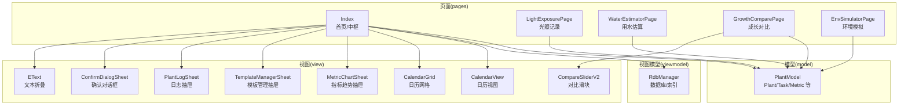
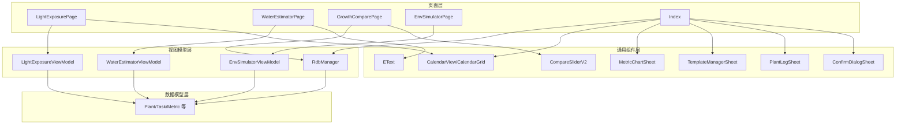
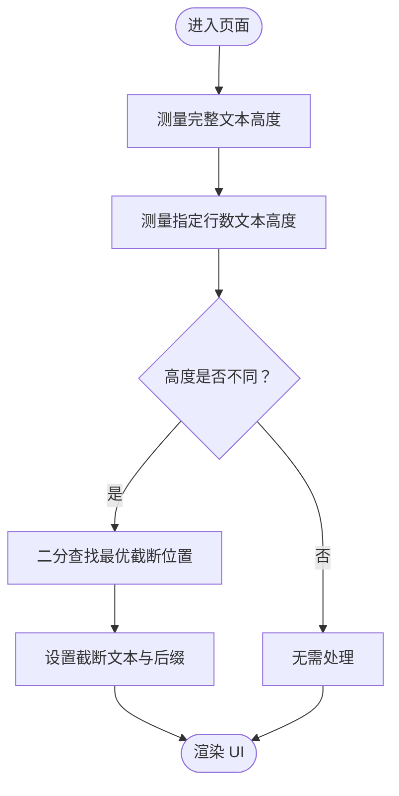
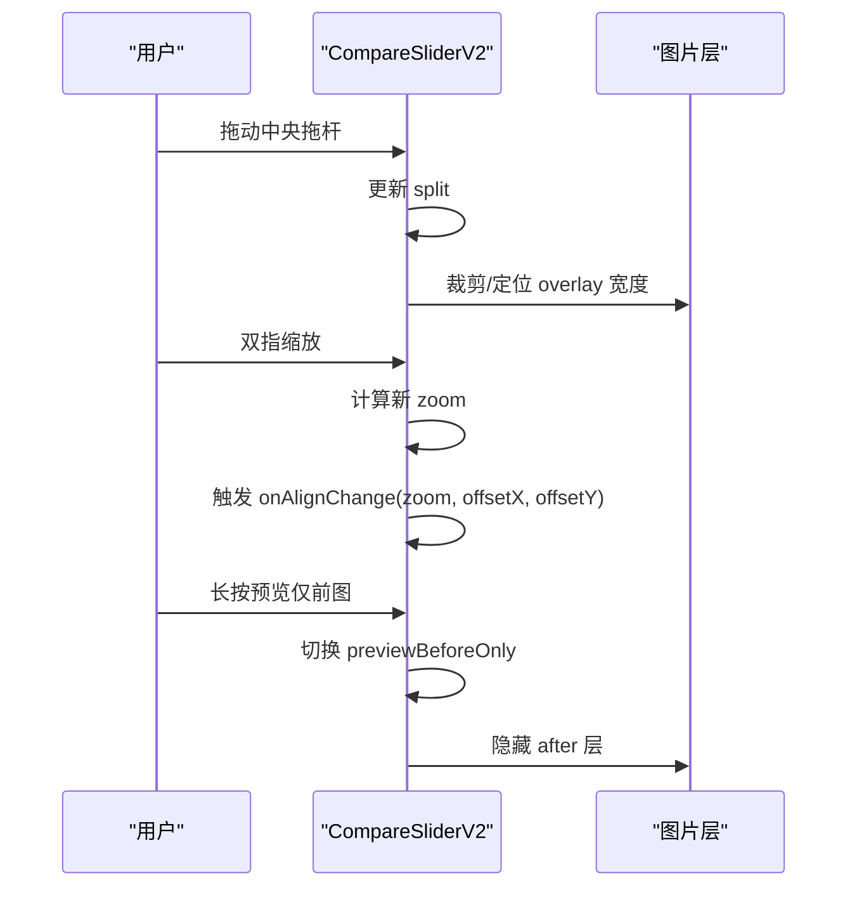
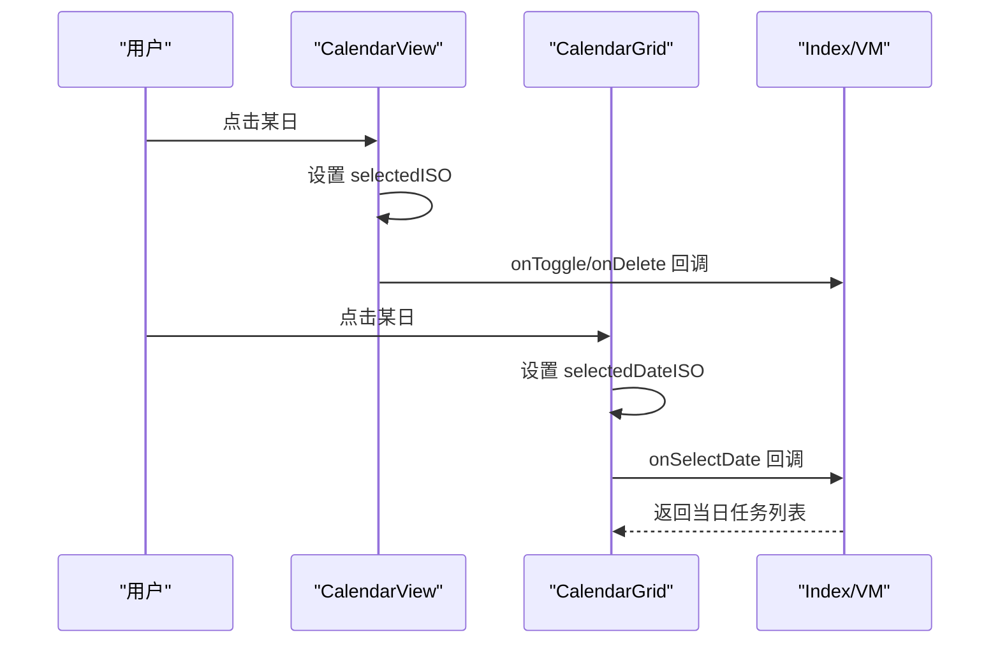
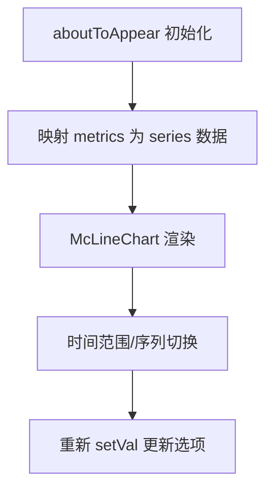
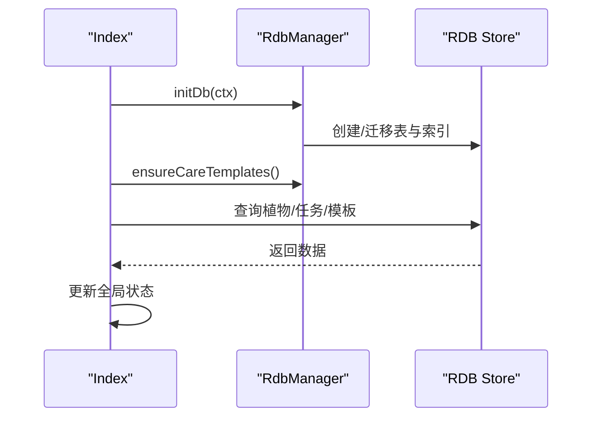
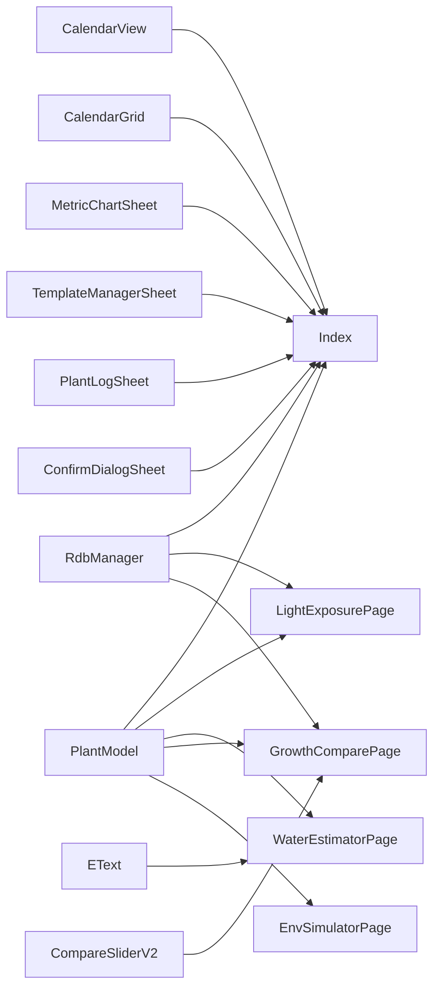

# 工具页面集合

<cite>
**本文档引用的文件**
- [Index.ets](file://entry/src/main/ets/pages/Index.ets)
- [EText.ets](file://entry/src/main/ets/pages/EText.ets)
- [CompareSliderV2.ets](file://entry/src/main/ets/pages/CompareSliderV2.ets)
- [CalendarView.ets](file://entry/src/main/ets/view/CalendarView.ets)
- [CalendarGrid.ets](file://entry/src/main/ets/view/CalendarGrid.ets)
- [WaterEstimatorPage.ets](file://entry/src/main/ets/pages/WaterEstimatorPage.ets)
- [GrowthComparePage.ets](file://entry/src/main/ets/pages/GrowthComparePage.ets)
- [LightExposurePage.ets](file://entry/src/main/ets/pages/LightExposurePage.ets)
- [MetricChartSheet.ets](file://entry/src/main/ets/view/MetricChartSheet.ets)
- [TemplateManagerSheet.ets](file://entry/src/main/ets/view/TemplateManagerSheet.ets)
- [EnvSimulatorPage.ets](file://entry/src/main/ets/pages/EnvSimulatorPage.ets)
- [PlantLogSheet.ets](file://entry/src/main/ets/view/PlantLogSheet.ets)
- [PlantModel.ets](file://entry/src/main/ets/model/PlantModel.ets)
- [RdbManager.ets](file://entry/src/main/ets/viewmodel/RdbManager.ets)
- [ConfirmDialogSheet.ets](file://entry/src/main/ets/view/ConfirmDialogSheet.ets)
</cite>

## 目录
1. [简介](#简介)
2. [项目结构](#项目结构)
3. [核心组件](#核心组件)
4. [架构总览](#架构总览)
5. [详细组件分析](#详细组件分析)
6. [依赖关系分析](#依赖关系分析)
7. [性能考虑](#性能考虑)
8. [故障排查指南](#故障排查指南)
9. [结论](#结论)
10. [附录](#附录)

## 简介
本文件系统性梳理 PlantDiary 工具页面集合，涵盖文本处理、滑块控件、日历与模板、光照记录、指标图表、环境模拟、日志与照片管理等工具页面。文档重点解释：
- 各工具页面的功能特性与使用场景
- 通用组件（如文本折叠、对比滑块、日历网格）的实现原理与复用方式
- 页面间协作关系与数据共享策略（Provider/Consumer、AppStorage、数据库）
- 定制化配置与性能优化方案
- 开发指南与最佳实践

## 项目结构
工具页面主要位于 pages 与 view 目录，配合 viewmodel 与 model 实现数据与业务逻辑分离：
- pages：完整页面（如光照记录、用水估算、成长对比、环境模拟）
- view：可复用的通用组件（如日历、滑块、图表抽屉、模板管理、确认对话框）
- viewmodel：页面状态与业务逻辑（如光照、用水估算、环境模拟）
- model：跨页面共享的数据模型（Plant、Task、Metric 等）

**图表来源**
- [Index.ets:1-120](file://entry/src/main/ets/pages/Index.ets#L1-L120)
- [CalendarView.ets:1-120](file://entry/src/main/ets/view/CalendarView.ets#L1-L120)
- [CalendarGrid.ets:1-120](file://entry/src/main/ets/view/CalendarGrid.ets#L1-L120)
- [CompareSliderV2.ets:1-120](file://entry/src/main/ets/pages/CompareSliderV2.ets#L1-L120)
- [MetricChartSheet.ets:1-120](file://entry/src/main/ets/view/MetricChartSheet.ets#L1-L120)
- [TemplateManagerSheet.ets:1-120](file://entry/src/main/ets/view/TemplateManagerSheet.ets#L1-L120)
- [PlantLogSheet.ets:1-120](file://entry/src/main/ets/view/PlantLogSheet.ets#L1-L120)
- [ConfirmDialogSheet.ets:1-103](file://entry/src/main/ets/view/ConfirmDialogSheet.ets#L1-L103)
- [EText.ets:1-128](file://entry/src/main/ets/pages/EText.ets#L1-L128)
- [PlantModel.ets:1-166](file://entry/src/main/ets/model/PlantModel.ets#L1-L166)
- [RdbManager.ets:1-120](file://entry/src/main/ets/viewmodel/RdbManager.ets#L1-L120)

**章节来源**
- [Index.ets:1-120](file://entry/src/main/ets/pages/Index.ets#L1-L120)
- [PlantModel.ets:1-166](file://entry/src/main/ets/model/PlantModel.ets#L1-L166)
- [RdbManager.ets:1-120](file://entry/src/main/ets/viewmodel/RdbManager.ets#L1-L120)

## 核心组件
- 文本折叠组件：基于测量文本高度与二分查找，动态截断并提供展开/收起交互。
- 对比滑块组件：支持分割/滑动/淡入淡出三种模式，手势包括拖动、双指缩放、对齐平移，具备网格叠加与精确滑杆。
- 日历视图：内嵌/抽屉两种模式，支持任务筛选、当日清单、指示点、类型过滤。
- 指标趋势抽屉：基于第三方图表库，支持时间范围与序列切换。
- 模板管理抽屉：支持模板的浏览、新建、编辑、删除与应用。
- 确认对话框：覆盖式弹窗，带按压反馈与渐显动画。

**章节来源**
- [EText.ets:1-128](file://entry/src/main/ets/pages/EText.ets#L1-L128)
- [CompareSliderV2.ets:1-120](file://entry/src/main/ets/pages/CompareSliderV2.ets#L1-L120)
- [CalendarView.ets:1-120](file://entry/src/main/ets/view/CalendarView.ets#L1-L120)
- [MetricChartSheet.ets:1-120](file://entry/src/main/ets/view/MetricChartSheet.ets#L1-L120)
- [TemplateManagerSheet.ets:1-120](file://entry/src/main/ets/view/TemplateManagerSheet.ets#L1-L120)
- [ConfirmDialogSheet.ets:1-103](file://entry/src/main/ets/view/ConfirmDialogSheet.ets#L1-L103)

## 架构总览
工具页面采用“页面 + 通用组件 + 视图模型 + 数据模型 + 数据库”的分层架构：
- 页面层：承载业务流程与交互，负责参数传递、状态管理与导航
- 通用组件层：可复用 UI 组件，通过 @Param/@Event 与父级解耦
- 视图模型层：封装业务逻辑与状态，提供计算属性与动作
- 数据模型层：跨页面共享的轻量数据结构
- 数据库层：集中初始化、建表、索引与默认数据，提供统一查询/写入入口

**图表来源**
- [LightExposurePage.ets:1-120](file://entry/src/main/ets/pages/LightExposurePage.ets#L1-L120)
- [WaterEstimatorPage.ets:1-120](file://entry/src/main/ets/pages/WaterEstimatorPage.ets#L1-L120)
- [GrowthComparePage.ets:1-120](file://entry/src/main/ets/pages/GrowthComparePage.ets#L1-L120)
- [EnvSimulatorPage.ets:1-120](file://entry/src/main/ets/pages/EnvSimulatorPage.ets#L1-L120)
- [Index.ets:1-120](file://entry/src/main/ets/pages/Index.ets#L1-L120)
- [CalendarView.ets:1-120](file://entry/src/main/ets/view/CalendarView.ets#L1-L120)
- [CompareSliderV2.ets:1-120](file://entry/src/main/ets/pages/CompareSliderV2.ets#L1-L120)
- [MetricChartSheet.ets:1-120](file://entry/src/main/ets/view/MetricChartSheet.ets#L1-L120)
- [TemplateManagerSheet.ets:1-120](file://entry/src/main/ets/view/TemplateManagerSheet.ets#L1-L120)
- [PlantLogSheet.ets:1-120](file://entry/src/main/ets/view/PlantLogSheet.ets#L1-L120)
- [ConfirmDialogSheet.ets:1-103](file://entry/src/main/ets/view/ConfirmDialogSheet.ets#L1-L103)
- [EText.ets:1-128](file://entry/src/main/ets/pages/EText.ets#L1-L128)
- [PlantModel.ets:1-166](file://entry/src/main/ets/model/PlantModel.ets#L1-L166)
- [RdbManager.ets:1-120](file://entry/src/main/ets/viewmodel/RdbManager.ets#L1-L120)

## 详细组件分析

### 文本处理组件：EText（文本折叠）
- 功能：根据容器宽度与最大行数，动态截断文本并通过二分查找确定最优截断长度，提供“展开/收起”交互。
- 关键点：测量文本高度、二分搜索、最小化 DOM 变更、避免重复计算。
- 使用场景：长文本摘要、日志内容预览、说明文案折叠。

**图表来源**
- [EText.ets:27-105](file://entry/src/main/ets/pages/EText.ets#L27-L105)

**章节来源**
- [EText.ets:1-128](file://entry/src/main/ets/pages/EText.ets#L1-L128)

### 滑块控件：CompareSliderV2（图片对比）
- 功能：支持分割/滑动/淡入淡出三种模式，手势包括拖动、双指缩放、对齐平移，叠加网格，提供精确滑杆。
- 关键点：容器尺寸监听、overlay 宽度计算、手势链组合、状态联动（split/fadeProgress/zoom/offset）。
- 使用场景：前后对比、照片成长对比、图像对齐校准。

**图表来源**
- [CompareSliderV2.ets:215-447](file://entry/src/main/ets/pages/CompareSliderV2.ets#L215-L447)

**章节来源**
- [CompareSliderV2.ets:1-448](file://entry/src/main/ets/pages/CompareSliderV2.ets#L1-L448)

### 日历组件：CalendarView 与 CalendarGrid
- CalendarView：抽屉/内嵌两种模式，支持任务筛选、当日清单、指示点、类型过滤。
- CalendarGrid：轻量 Master-Detail 结构，上方网格选择日期，下方展示当日任务。
- 关键点：月历矩阵生成、日期 ISO 计算、任务过滤与徽标颜色、点击/触摸反馈。

**图表来源**
- [CalendarView.ets:212-510](file://entry/src/main/ets/view/CalendarView.ets#L212-L510)
- [CalendarGrid.ets:1-351](file://entry/src/main/ets/view/CalendarGrid.ets#L1-L351)

**章节来源**
- [CalendarView.ets:1-566](file://entry/src/main/ets/view/CalendarView.ets#L1-L566)
- [CalendarGrid.ets:1-351](file://entry/src/main/ets/view/CalendarGrid.ets#L1-L351)

### 指标趋势：MetricChartSheet（折线图抽屉）
- 功能：基于第三方图表库绘制多序列折线图，支持时间范围与序列切换，底部抽屉形式。
- 关键点：x 轴标签格式化、series 数据映射、dataZoom 区域缩放、图例与提示。

**图表来源**
- [MetricChartSheet.ets:55-88](file://entry/src/main/ets/view/MetricChartSheet.ets#L55-L88)

**章节来源**
- [MetricChartSheet.ets:1-181](file://entry/src/main/ets/view/MetricChartSheet.ets#L1-L181)

### 模板管理：TemplateManagerSheet（抽屉）
- 功能：浏览/新建/编辑/删除/应用周期模板，字段解析与校验。
- 关键点：展示态/编辑态切换、正整数解析、应用到当前植物。

**章节来源**
- [TemplateManagerSheet.ets:1-249](file://entry/src/main/ets/view/TemplateManagerSheet.ets#L1-L249)

### 确认对话框：ConfirmDialogSheet
- 功能：覆盖式确认弹窗，带按压反馈与渐显动画。
- 关键点：遮罩透明度动画、按钮按压状态、点击空白区域关闭。

**章节来源**
- [ConfirmDialogSheet.ets:1-103](file://entry/src/main/ets/view/ConfirmDialogSheet.ets#L1-L103)

### 页面协作与数据共享

#### 首页中枢：Index
- 职责：数据库初始化、全局状态加载（植物/任务/模板）、Banner 提示、指标/图表/模板/日历等面板控制。
- 数据共享：通过 Provider/Consumer 注入 RdbStore 与页面栈，统一重载植物/任务数据，避免状态不一致。

**图表来源**
- [Index.ets:128-141](file://entry/src/main/ets/pages/Index.ets#L128-L141)
- [RdbManager.ets:27-170](file://entry/src/main/ets/viewmodel/RdbManager.ets#L27-L170)

**章节来源**
- [Index.ets:1-200](file://entry/src/main/ets/pages/Index.ets#L1-L200)
- [RdbManager.ets:1-296](file://entry/src/main/ets/viewmodel/RdbManager.ets#L1-L296)

#### 页面间数据流
- Index 作为中枢，向各工具页面提供：
  - 数据源：植物、任务、模板、指标
  - 导航栈：页面间跳转与参数传递
  - 弹层：日志抽屉、模板抽屉、确认对话框、指标趋势抽屉
- 工具页面通过 ViewModel 与数据库交互，完成后回写 Index 的全局状态。

**章节来源**
- [Index.ets:1-200](file://entry/src/main/ets/pages/Index.ets#L1-L200)
- [PlantLogSheet.ets:1-120](file://entry/src/main/ets/view/PlantLogSheet.ets#L1-L120)
- [TemplateManagerSheet.ets:1-120](file://entry/src/main/ets/view/TemplateManagerSheet.ets#L1-L120)
- [MetricChartSheet.ets:1-120](file://entry/src/main/ets/view/MetricChartSheet.ets#L1-L120)

## 依赖关系分析

**图表来源**
- [PlantModel.ets:1-166](file://entry/src/main/ets/model/PlantModel.ets#L1-L166)
- [Index.ets:1-120](file://entry/src/main/ets/pages/Index.ets#L1-L120)
- [LightExposurePage.ets:1-120](file://entry/src/main/ets/pages/LightExposurePage.ets#L1-L120)
- [WaterEstimatorPage.ets:1-120](file://entry/src/main/ets/pages/WaterEstimatorPage.ets#L1-L120)
- [GrowthComparePage.ets:1-120](file://entry/src/main/ets/pages/GrowthComparePage.ets#L1-L120)
- [EnvSimulatorPage.ets:1-120](file://entry/src/main/ets/pages/EnvSimulatorPage.ets#L1-L120)
- [CalendarView.ets:1-120](file://entry/src/main/ets/view/CalendarView.ets#L1-L120)
- [CalendarGrid.ets:1-120](file://entry/src/main/ets/view/CalendarGrid.ets#L1-L120)
- [MetricChartSheet.ets:1-120](file://entry/src/main/ets/view/MetricChartSheet.ets#L1-L120)
- [TemplateManagerSheet.ets:1-120](file://entry/src/main/ets/view/TemplateManagerSheet.ets#L1-L120)
- [PlantLogSheet.ets:1-120](file://entry/src/main/ets/view/PlantLogSheet.ets#L1-L120)
- [ConfirmDialogSheet.ets:1-103](file://entry/src/main/ets/view/ConfirmDialogSheet.ets#L1-L103)
- [CompareSliderV2.ets:1-120](file://entry/src/main/ets/pages/CompareSliderV2.ets#L1-L120)
- [EText.ets:1-128](file://entry/src/main/ets/pages/EText.ets#L1-L128)
- [RdbManager.ets:1-120](file://entry/src/main/ets/viewmodel/RdbManager.ets#L1-L120)

**章节来源**
- [PlantModel.ets:1-166](file://entry/src/main/ets/model/PlantModel.ets#L1-L166)
- [RdbManager.ets:1-296](file://entry/src/main/ets/viewmodel/RdbManager.ets#L1-L296)

## 性能考虑
- 组件渲染优化
  - 文本折叠：二分查找截断，避免重复测量；仅在需要时更新 UI。
  - 滑块：手势链组合减少重绘；overlay 宽度计算延迟到容器尺寸可用。
  - 日历：月历矩阵预计算，ForEach 渲染，避免在 @Builder 中使用循环变量。
- 数据访问优化
  - 数据库索引：任务按日期/植物建立索引，日志按 plantId+createdAt 建索引，指标按 plantId+createdAt 建索引。
  - 统一初始化：RdbManager 集中建表与索引，避免页面重复初始化。
- 交互流畅性
  - 抽屉/弹窗：渐显动画与阴影，提升层级感；点击空白关闭。
  - 刷新策略：首页统一重载植物/任务，避免局部状态不一致。

**章节来源**
- [EText.ets:73-105](file://entry/src/main/ets/pages/EText.ets#L73-L105)
- [CompareSliderV2.ets:371-422](file://entry/src/main/ets/pages/CompareSliderV2.ets#L371-L422)
- [CalendarGrid.ets:86-109](file://entry/src/main/ets/view/CalendarGrid.ets#L86-L109)
- [RdbManager.ets:131-170](file://entry/src/main/ets/viewmodel/RdbManager.ets#L131-L170)
- [Index.ets:137-141](file://entry/src/main/ets/pages/Index.ets#L137-L141)

## 故障排查指南
- 数据库初始化失败
  - 现象：Banner 显示初始化失败
  - 排查：检查 RdbManager 初始化日志、表与索引是否存在
- 删除植物失败
  - 现象：删除植物后仍有文件残留或事务失败
  - 排查：确认事务顺序（先删表记录，后删文件）与异常分支处理
- 光照会话状态不同步
  - 现象：首页卡片未显示“正在补光”
  - 排查：确认首页刷新时调用 getActiveLightSessions 并写入 AppStorage
- 模板应用无效
  - 现象：应用模板后未生成任务
  - 排查：确认 editingPlantId 设置、模板参数合法性与批量生成逻辑

**章节来源**
- [Index.ets:116-125](file://entry/src/main/ets/pages/Index.ets#L116-L125)
- [Index.ets:318-402](file://entry/src/main/ets/pages/Index.ets#L318-L402)
- [RdbManager.ets:277-294](file://entry/src/main/ets/viewmodel/RdbManager.ets#L277-L294)
- [TemplateManagerSheet.ets:128-150](file://entry/src/main/ets/view/TemplateManagerSheet.ets#L128-L150)

## 结论
工具页面集合通过清晰的分层架构与通用组件复用，实现了从文本处理、图片对比、日历管理到光照记录、指标图表、环境模拟与日志管理的完整工具链。页面间通过 Provider/Consumer 与数据库实现高效协作，配合索引与统一初始化保障性能。开发者可基于现有组件快速扩展新工具页面，并遵循统一的数据模型与状态管理模式，确保一致性与可维护性。

## 附录
- 开发指南与最佳实践
  - 组件设计：以 @Param/@Event 解耦，避免硬编码依赖
  - 状态管理：页面负责 UI 状态，ViewModel 负责业务状态，Model 仅承载数据
  - 数据访问：统一通过 RdbManager，避免页面直连数据库
  - 性能优化：预计算、延迟计算、索引优化、动画节流
  - 可扩展性：新增页面优先复用通用组件，保持一致的交互与样式规范