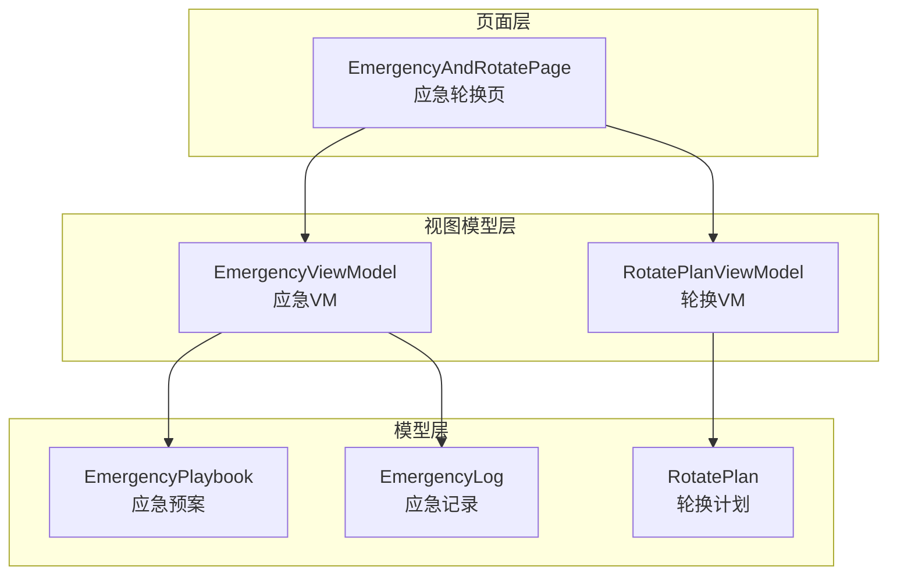
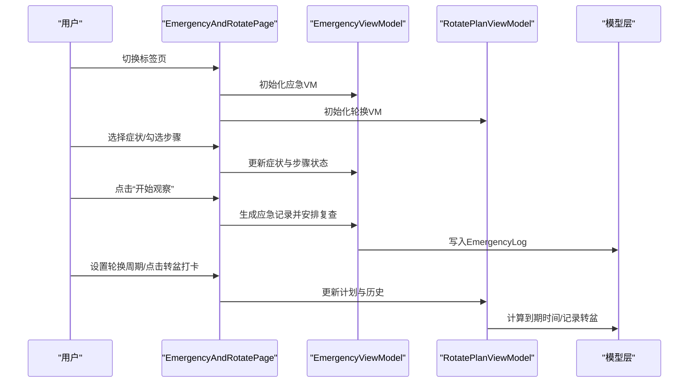
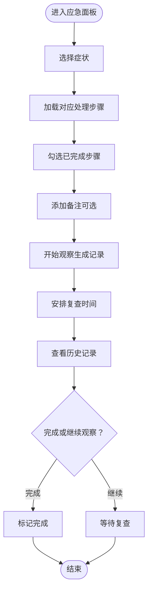
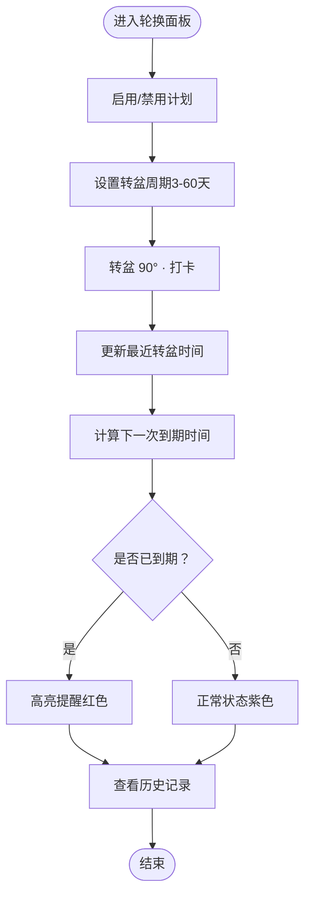
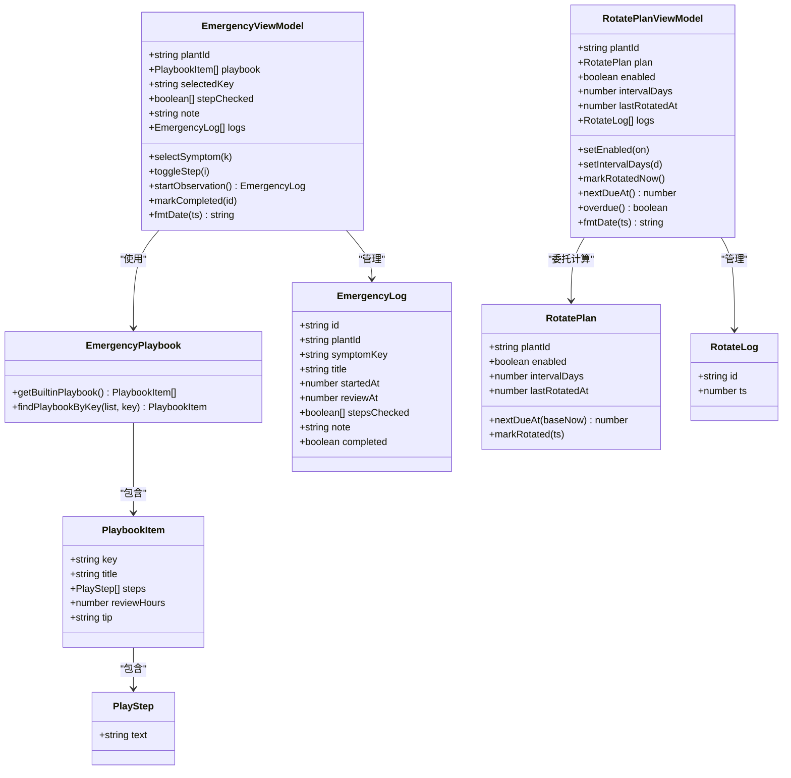
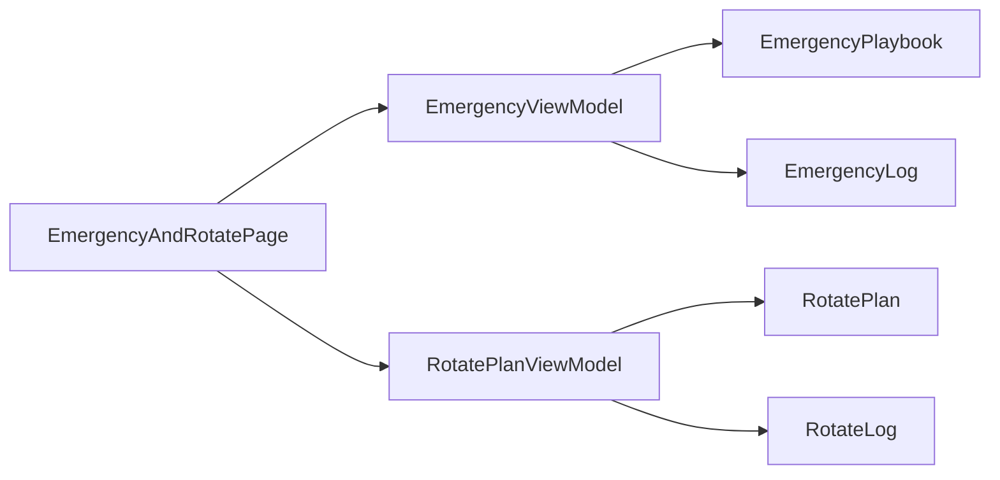

# 应急轮换页 EmergencyAndRotatePage

<cite>
**本文档引用的文件**
- [EmergencyAndRotatePage.ets](file://entry/src/main/ets/pages/EmergencyAndRotatePage.ets)
- [EmergencyViewModel.ets](file://entry/src/main/ets/viewmodel/EmergencyViewModel.ets)
- [EmergencyPlaybook.ets](file://entry/src/main/ets/model/EmergencyPlaybook.ets)
- [EmergencyLog.ets](file://entry/src/main/ets/model/EmergencyLog.ets)
- [RotatePlanViewModel.ets](file://entry/src/main/ets/viewmodel/RotatePlanViewModel.ets)
- [RotatePlan.ets](file://entry/src/main/ets/model/RotatePlan.ets)
- [PlantCard.ets](file://entry/src/main/ets/view/PlantCard.ets)
</cite>

## 目录
1. [简介](#简介)
2. [项目结构](#项目结构)
3. [核心组件](#核心组件)
4. [架构总览](#架构总览)
5. [详细组件分析](#详细组件分析)
6. [依赖关系分析](#依赖关系分析)
7. [性能考量](#性能考量)
8. [故障排除指南](#故障排除指南)
9. [结论](#结论)
10. [附录](#附录)

## 简介
本文件面向应急轮换页 EmergencyAndRotatePage 的深入技术文档，全面解析植物应急处理与轮换管理两大功能模块的实现机制。文档涵盖：
- 紧急情况识别、处理方案制定与执行跟踪的完整流程
- 植物轮换策略、光照调整与环境改善的技术细节
- 应急预案配置、处理记录与效果评估的管理机制
- 轮换时机判断与植物适应性评估的方法
- 应急处理最佳实践与预防性管理建议

该页面采用“页面 + 视图模型 + 模型”的分层设计，将 UI 展示、状态管理与数据模型解耦，确保功能清晰、可维护性强。

## 项目结构
EmergencyAndRotatePage 位于页面层，通过 ViewModel 与 Model 解耦，形成清晰的职责边界：
- 页面层：EmergencyAndRotatePage 负责布局与交互
- 视图模型层：EmergencyViewModel、RotatePlanViewModel 负责状态与业务逻辑
- 模型层：EmergencyPlaybook、EmergencyLog、RotatePlan 等负责数据结构与规则

图表来源
- [EmergencyAndRotatePage.ets:24-557](file://entry/src/main/ets/pages/EmergencyAndRotatePage.ets#L24-L557)
- [EmergencyViewModel.ets:14-115](file://entry/src/main/ets/viewmodel/EmergencyViewModel.ets#L14-L115)
- [EmergencyPlaybook.ets:25-81](file://entry/src/main/ets/model/EmergencyPlaybook.ets#L25-L81)
- [EmergencyLog.ets:4-20](file://entry/src/main/ets/model/EmergencyLog.ets#L4-L20)
- [RotatePlanViewModel.ets:18-88](file://entry/src/main/ets/viewmodel/RotatePlanViewModel.ets#L18-L88)
- [RotatePlan.ets:4-25](file://entry/src/main/ets/model/RotatePlan.ets#L4-L25)

章节来源
- [EmergencyAndRotatePage.ets:10-557](file://entry/src/main/ets/pages/EmergencyAndRotatePage.ets#L10-L557)
- [EmergencyViewModel.ets:13-115](file://entry/src/main/ets/viewmodel/EmergencyViewModel.ets#L13-L115)
- [EmergencyPlaybook.ets:1-81](file://entry/src/main/ets/model/EmergencyPlaybook.ets#L1-L81)
- [EmergencyLog.ets:1-20](file://entry/src/main/ets/model/EmergencyLog.ets#L1-L20)
- [RotatePlanViewModel.ets:1-88](file://entry/src/main/ets/viewmodel/RotatePlanViewModel.ets#L1-L88)
- [RotatePlan.ets:1-25](file://entry/src/main/ets/model/RotatePlan.ets#L1-L25)

## 核心组件
- 应急处理组件（EmergencyPanel）
  - 症状选择器：支持多种常见症状（日灼、萎蔫、黄化、斑点、烂根）
  - 步骤卡片：根据症状动态显示对应处理步骤
  - 备注与开始观察：记录处理备注并生成复查任务
  - 历史记录：展示已完成与进行中的应急记录
- 轮换管理组件（RotatePanel）
  - 轮换计划设置：启用/禁用、周期调整、最近转盆时间
  - 下一次到期提醒：到期状态可视化与提示
  - 转盆历史：记录每次转盆的时间戳

章节来源
- [EmergencyAndRotatePage.ets:100-358](file://entry/src/main/ets/pages/EmergencyAndRotatePage.ets#L100-L358)
- [EmergencyAndRotatePage.ets:360-555](file://entry/src/main/ets/pages/EmergencyAndRotatePage.ets#L360-L555)

## 架构总览
页面通过两个标签页整合“应急处理”和“轮换提醒”，每个标签页由独立的 ViewModel 管理状态与规则，降低耦合度，提升可扩展性。

图表来源
- [EmergencyAndRotatePage.ets:17-22](file://entry/src/main/ets/pages/EmergencyAndRotatePage.ets#L17-L22)
- [EmergencyViewModel.ets:60-98](file://entry/src/main/ets/viewmodel/EmergencyViewModel.ets#L60-L98)
- [RotatePlanViewModel.ets:54-62](file://entry/src/main/ets/viewmodel/RotatePlanViewModel.ets#L54-L62)

## 详细组件分析

### 应急处理流程（EmergencyPanel）
应急处理遵循“症状识别 → 方案匹配 → 步骤执行 → 复查跟踪”的闭环流程。页面负责展示与交互，ViewModel 负责状态管理与持久化。

图表来源
- [EmergencyAndRotatePage.ets:110-261](file://entry/src/main/ets/pages/EmergencyAndRotatePage.ets#L110-L261)
- [EmergencyViewModel.ets:40-98](file://entry/src/main/ets/viewmodel/EmergencyViewModel.ets#L40-L98)
- [EmergencyPlaybook.ets:25-81](file://entry/src/main/ets/model/EmergencyPlaybook.ets#L25-L81)
- [EmergencyLog.ets:15-19](file://entry/src/main/ets/model/EmergencyLog.ets#L15-L19)

关键实现要点
- 症状选择与动态步骤：ViewModel 根据选中的症状键值查找内置应急预案，重建步骤勾选数组，保证 UI 与数据一致。
- 复查时间计算：基于应急预案中的建议复查小时数，结合当前时间生成复查时间戳。
- 历史记录管理：采用“重建对象”策略更新完成状态，确保 UI 正确响应变更。

章节来源
- [EmergencyAndRotatePage.ets:110-261](file://entry/src/main/ets/pages/EmergencyAndRotatePage.ets#L110-L261)
- [EmergencyViewModel.ets:31-52](file://entry/src/main/ets/viewmodel/EmergencyViewModel.ets#L31-L52)
- [EmergencyViewModel.ets:60-98](file://entry/src/main/ets/viewmodel/EmergencyViewModel.ets#L60-L98)
- [EmergencyPlaybook.ets:25-81](file://entry/src/main/ets/model/EmergencyPlaybook.ets#L25-L81)
- [EmergencyLog.ets:15-19](file://entry/src/main/ets/model/EmergencyLog.ets#L15-L19)

### 轮换管理流程（RotatePanel）
轮换管理围绕“启用计划 → 设置周期 → 转盆打卡 → 到期提醒 → 历史记录”展开，强调周期性与可视化提醒。

图表来源
- [EmergencyAndRotatePage.ets:369-501](file://entry/src/main/ets/pages/EmergencyAndRotatePage.ets#L369-L501)
- [RotatePlanViewModel.ets:40-72](file://entry/src/main/ets/viewmodel/RotatePlanViewModel.ets#L40-L72)
- [RotatePlan.ets:14-23](file://entry/src/main/ets/model/RotatePlan.ets#L14-L23)

关键实现要点
- 到期判断：基于最近转盆时间与周期计算下一次到期时间，启用状态下且到期即视为超期。
- 周期范围控制：最小 3 天，最大 60 天，防止极端配置影响用户体验。
- 历史记录：每次打卡将新记录插入历史列表头部，便于快速查看最新转盆时间。

章节来源
- [EmergencyAndRotatePage.ets:369-501](file://entry/src/main/ets/pages/EmergencyAndRotatePage.ets#L369-L501)
- [RotatePlanViewModel.ets:40-72](file://entry/src/main/ets/viewmodel/RotatePlanViewModel.ets#L40-L72)
- [RotatePlan.ets:14-23](file://entry/src/main/ets/model/RotatePlan.ets#L14-L23)

### 数据模型与类关系
应急与轮换功能的数据模型简洁明确，职责清晰。

图表来源
- [EmergencyViewModel.ets:14-115](file://entry/src/main/ets/viewmodel/EmergencyViewModel.ets#L14-L115)
- [EmergencyPlaybook.ets:4-23](file://entry/src/main/ets/model/EmergencyPlaybook.ets#L4-L23)
- [EmergencyLog.ets:4-19](file://entry/src/main/ets/model/EmergencyLog.ets#L4-L19)
- [RotatePlanViewModel.ets:18-88](file://entry/src/main/ets/viewmodel/RotatePlanViewModel.ets#L18-L88)
- [RotatePlan.ets:4-24](file://entry/src/main/ets/model/RotatePlan.ets#L4-L24)
- [RotatePlanViewModel.ets:12-16](file://entry/src/main/ets/viewmodel/RotatePlanViewModel.ets#L12-L16)

章节来源
- [EmergencyViewModel.ets:14-115](file://entry/src/main/ets/viewmodel/EmergencyViewModel.ets#L14-L115)
- [EmergencyPlaybook.ets:4-23](file://entry/src/main/ets/model/EmergencyPlaybook.ets#L4-L23)
- [EmergencyLog.ets:4-19](file://entry/src/main/ets/model/EmergencyLog.ets#L4-L19)
- [RotatePlanViewModel.ets:18-88](file://entry/src/main/ets/viewmodel/RotatePlanViewModel.ets#L18-L88)
- [RotatePlan.ets:4-24](file://entry/src/main/ets/model/RotatePlan.ets#L4-L24)
- [RotatePlanViewModel.ets:12-16](file://entry/src/main/ets/viewmodel/RotatePlanViewModel.ets#L12-L16)

## 依赖关系分析
- 页面与 ViewModel 的依赖
  - EmergencyAndRotatePage 通过 @Local 注入 EmergencyViewModel 与 RotatePlanViewModel，分别管理应急与轮换状态。
  - ViewModel 通过内部方法暴露给页面调用，避免页面直接操作底层数据。
- ViewModel 与 Model 的依赖
  - EmergencyViewModel 依赖 EmergencyPlaybook 获取内置应急预案，依赖 EmergencyLog 管理记录。
  - RotatePlanViewModel 依赖 RotatePlan 计算到期时间，依赖 RotateLog 管理历史。
- 耦合与内聚
  - 页面层仅负责布局与交互，内聚度高；ViewModel 与 Model 分离，降低耦合，便于扩展与测试。

图表来源
- [EmergencyAndRotatePage.ets:14-15](file://entry/src/main/ets/pages/EmergencyAndRotatePage.ets#L14-L15)
- [EmergencyViewModel.ets:5-5](file://entry/src/main/ets/viewmodel/EmergencyViewModel.ets#L5-L5)
- [RotatePlanViewModel.ets:4-4](file://entry/src/main/ets/viewmodel/RotatePlanViewModel.ets#L4-L4)

章节来源
- [EmergencyAndRotatePage.ets:14-15](file://entry/src/main/ets/pages/EmergencyAndRotatePage.ets#L14-L15)
- [EmergencyViewModel.ets:5-5](file://entry/src/main/ets/viewmodel/EmergencyViewModel.ets#L5-L5)
- [RotatePlanViewModel.ets:4-4](file://entry/src/main/ets/viewmodel/RotatePlanViewModel.ets#L4-L4)

## 性能考量
- 列表更新策略
  - 应急记录与轮换历史均采用“重建数组”方式更新，确保 UI 正确响应状态变化，避免直接修改导致的渲染异常。
- 时间格式化
  - ViewModel 提供统一的时间格式化方法，避免重复计算与字符串拼接，提升渲染效率。
- 交互反馈
  - 页面通过 Toast 提示用户操作结果，减少额外页面跳转带来的性能损耗。
- 可扩展性
  - 内置应急预案与轮换计划可替换为从数据库或 JSON 加载，便于后续引入持久化存储与远程配置。

章节来源
- [EmergencyViewModel.ets:77-98](file://entry/src/main/ets/viewmodel/EmergencyViewModel.ets#L77-L98)
- [EmergencyViewModel.ets:101-113](file://entry/src/main/ets/viewmodel/EmergencyViewModel.ets#L101-L113)
- [EmergencyAndRotatePage.ets:238-242](file://entry/src/main/ets/pages/EmergencyAndRotatePage.ets#L238-L242)
- [EmergencyAndRotatePage.ets:407-411](file://entry/src/main/ets/pages/EmergencyAndRotatePage.ets#L407-L411)

## 故障排除指南
- 症状选择无效或步骤不显示
  - 检查 selectedKey 是否正确传入，确保内置应急预案包含对应键值。
  - 确认 ensureStepArray 是否被调用以重建步骤勾选数组。
- 复查时间不生效
  - 核对应急预案中的 reviewHours 是否为有效数值，确认 startObservation 中复查时间计算逻辑。
- 轮换到期状态异常
  - 检查 lastRotatedAt 是否更新，确认 nextDueAt 计算是否基于最新时间戳。
- 历史记录未更新
  - 确认 markCompleted 或 markRotatedNow 是否正确重建数组并赋值给 logs。

章节来源
- [EmergencyViewModel.ets:31-38](file://entry/src/main/ets/viewmodel/EmergencyViewModel.ets#L31-L38)
- [EmergencyViewModel.ets:60-75](file://entry/src/main/ets/viewmodel/EmergencyViewModel.ets#L60-L75)
- [EmergencyPlaybook.ets:75-80](file://entry/src/main/ets/model/EmergencyPlaybook.ets#L75-L80)
- [RotatePlanViewModel.ets:64-72](file://entry/src/main/ets/viewmodel/RotatePlanViewModel.ets#L64-L72)
- [RotatePlan.ets:14-19](file://entry/src/main/ets/model/RotatePlan.ets#L14-L19)

## 结论
EmergencyAndRotatePage 通过清晰的分层架构与职责分离，实现了植物应急处理与轮换管理的高效协同。页面层专注于用户体验，ViewModel 层承载业务逻辑，Model 层提供稳定的数据结构。内置应急预案与轮换计划具备良好的可扩展性，便于后续接入持久化存储与远程配置。建议在实际部署中结合植物类型与生长环境，持续优化应急预案与轮换周期，提升植物健康水平与管理效率。

## 附录
- 与植物卡片的集成
  - 植物卡片提供“应急轮换”入口事件，便于从植物概览直接进入应急轮换页，提升操作便捷性。
- 最佳实践建议
  - 应急处理：优先处理根系问题与环境因素，结合光照与水分管理；定期复查并记录效果。
  - 轮换管理：根据植物类型设定合理周期，关注光照方向变化与介质透气性；建立标准化流程，减少人为疏漏。
  - 预防性管理：定期检查植物状态，提前识别潜在问题；结合光照模拟与环境监测，优化生长条件。

章节来源
- [PlantCard.ets:18-18](file://entry/src/main/ets/view/PlantCard.ets#L18-L18)