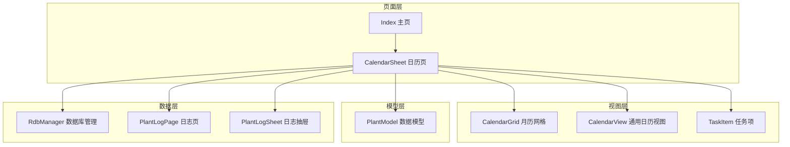
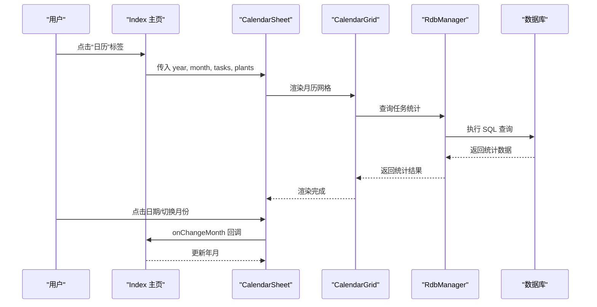
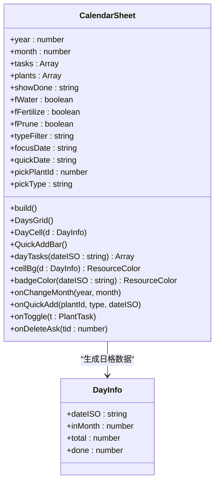
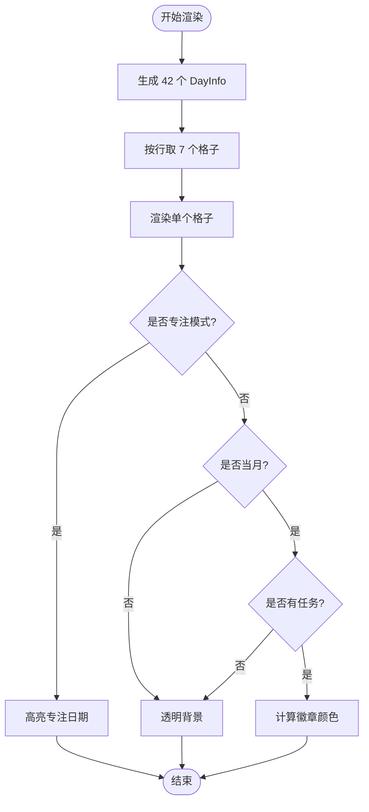
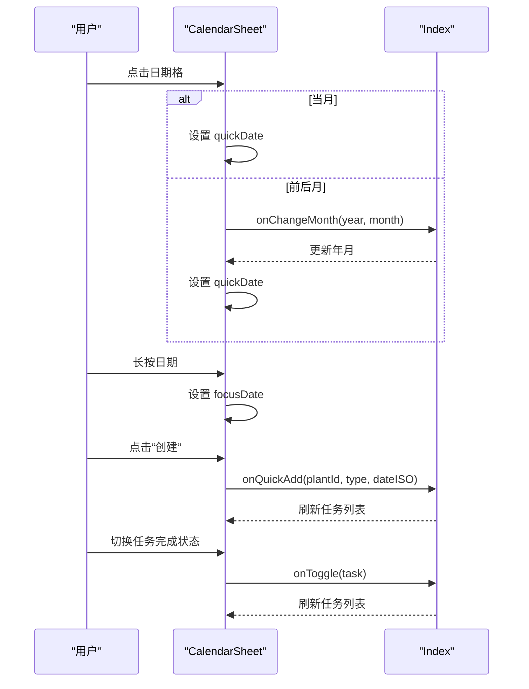
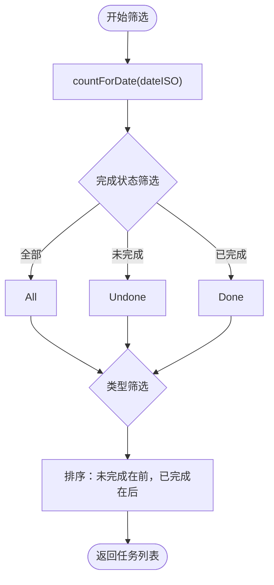
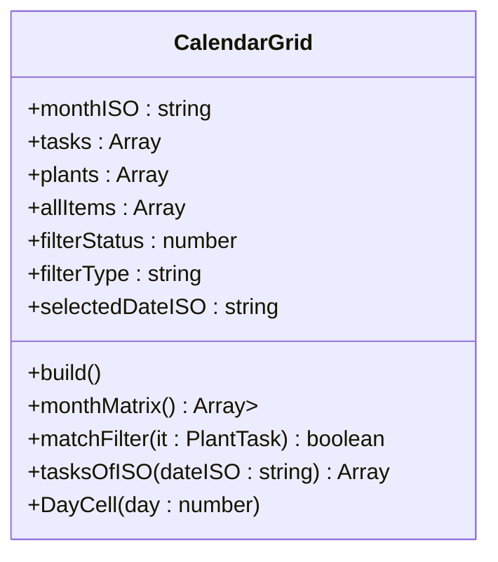
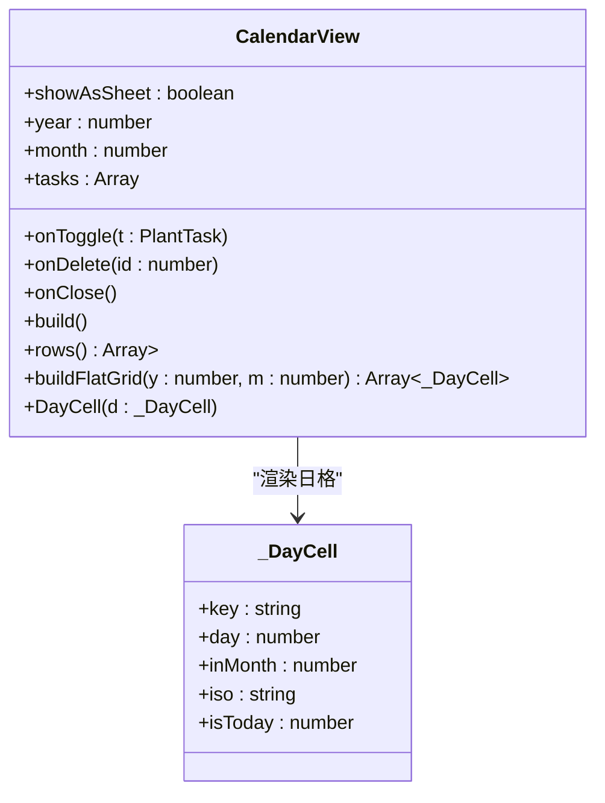
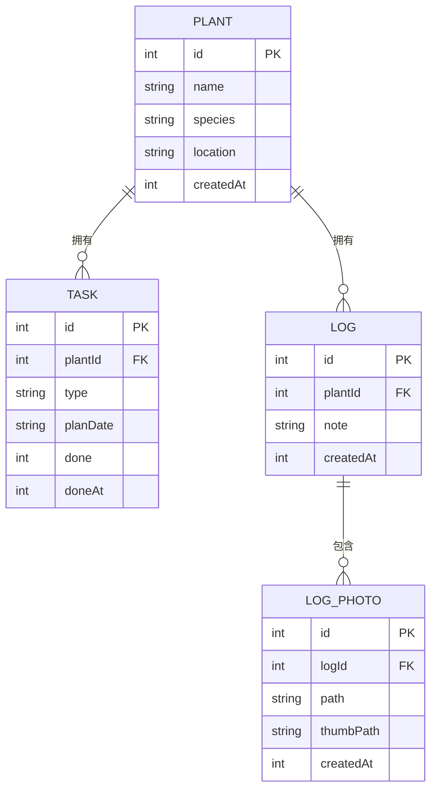
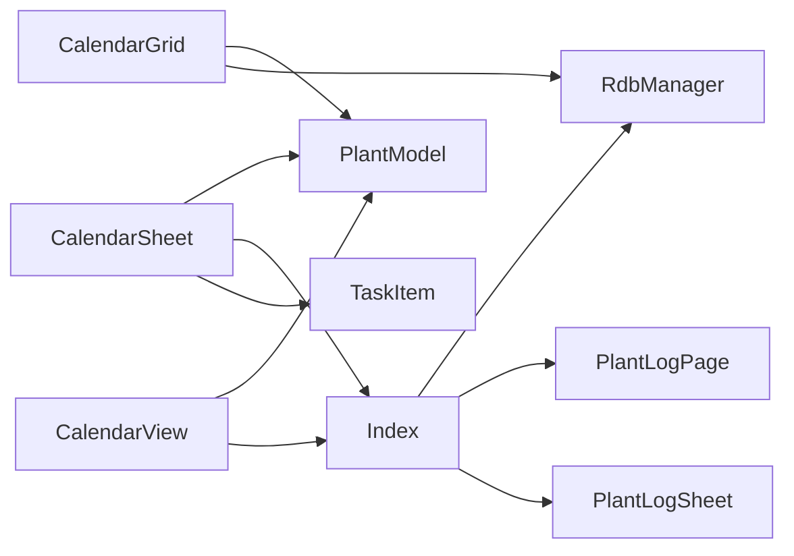

# 日历组件页 CalendarSheet

<cite>
**本文档引用的文件**
- [CalendarSheet.ets](file://entry/src/main/ets/pages/CalendarSheet.ets)
- [CalendarGrid.ets](file://entry/src/main/ets/view/CalendarGrid.ets)
- [CalendarView.ets](file://entry/src/main/ets/view/CalendarView.ets)
- [Index.ets](file://entry/src/main/ets/pages/Index.ets)
- [PlantModel.ets](file://entry/src/main/ets/model/PlantModel.ets)
- [TaskItem.ets](file://entry/src/main/ets/view/TaskItem.ets)
- [RdbManager.ets](file://entry/src/main/ets/viewmodel/RdbManager.ets)
- [PlantLogPage.ets](file://entry/src/main/ets/pages/PlantLogPage.ets)
- [PlantLogSheet.ets](file://entry/src/main/ets/view/PlantLogSheet.ets)
</cite>

## 目录
1. [简介](#简介)
2. [项目结构](#项目结构)
3. [核心组件](#核心组件)
4. [架构总览](#架构总览)
5. [详细组件分析](#详细组件分析)
6. [依赖关系分析](#依赖关系分析)
7. [性能考虑](#性能考虑)
8. [故障排除指南](#故障排除指南)
9. [结论](#结论)
10. [附录](#附录)

## 简介
CalendarSheet 是 PlantDiary 应用中的日历组件页，提供月视图日历网格、任务标注、快速添加、筛选与列表联动等功能。它支持多月份切换、快速跳转、响应式适配，并与任务、日志数据进行关联展示与同步。本文档将深入解释日历网格的渲染机制、交互逻辑、事件标注与视图切换实现，以及与任务、日志数据的关联与同步机制。

## 项目结构
CalendarSheet 位于页面层，作为 Index 主页的一个标签页被集成。其核心依赖包括：
- 数据模型 PlantModel：提供 Plant、PlantTask 等数据结构
- 视图组件 CalendarGrid、CalendarView：提供日历网格与通用日历视图
- 任务项组件 TaskItem：用于当日任务列表的展示
- 数据库管理 RdbManager：提供数据库建表、索引与任务查询能力
- 日志页面 PlantLogPage/PlantLogSheet：提供日志与照片管理，与日历形成数据关联

**图表来源**
- [Index.ets:952-978](file://entry/src/main/ets/pages/Index.ets#L952-L978)
- [CalendarSheet.ets:19-31](file://entry/src/main/ets/pages/CalendarSheet.ets#L19-L31)
- [CalendarGrid.ets:5-18](file://entry/src/main/ets/view/CalendarGrid.ets#L5-L18)
- [CalendarView.ets:5-24](file://entry/src/main/ets/view/CalendarView.ets#L5-L24)
- [TaskItem.ets:5-11](file://entry/src/main/ets/view/TaskItem.ets#L5-L11)
- [RdbManager.ets:4-17](file://entry/src/main/ets/viewmodel/RdbManager.ets#L4-L17)
- [PlantLogPage.ets:14-34](file://entry/src/main/ets/pages/PlantLogPage.ets#L14-L34)
- [PlantLogSheet.ets:36-50](file://entry/src/main/ets/view/PlantLogSheet.ets#L36-L50)

**章节来源**
- [Index.ets:952-978](file://entry/src/main/ets/pages/Index.ets#L952-L978)
- [CalendarSheet.ets:19-31](file://entry/src/main/ets/pages/CalendarSheet.ets#L19-L31)

## 核心组件
- CalendarSheet：整合月视图、快速新增、当日任务列表的综合日历页
- CalendarGrid：月历网格子组件，负责渲染 6x7 网格与任务标注
- CalendarView：通用日历视图，支持抽屉与内嵌两种模式
- TaskItem：任务项展示组件，支持完成状态切换与删除
- PlantModel：Plant、PlantTask 等数据模型
- RdbManager：数据库管理与索引初始化
- PlantLogPage/PlantLogSheet：日志与照片管理，与日历形成数据关联

**章节来源**
- [CalendarSheet.ets:19-504](file://entry/src/main/ets/pages/CalendarSheet.ets#L19-L504)
- [CalendarGrid.ets:5-351](file://entry/src/main/ets/view/CalendarGrid.ets#L5-L351)
- [CalendarView.ets:5-566](file://entry/src/main/ets/view/CalendarView.ets#L5-L566)
- [TaskItem.ets:5-67](file://entry/src/main/ets/view/TaskItem.ets#L5-L67)
- [PlantModel.ets:6-106](file://entry/src/main/ets/model/PlantModel.ets#L6-L106)
- [RdbManager.ets:4-296](file://entry/src/main/ets/viewmodel/RdbManager.ets#L4-L296)
- [PlantLogPage.ets:14-800](file://entry/src/main/ets/pages/PlantLogPage.ets#L14-L800)
- [PlantLogSheet.ets:36-384](file://entry/src/main/ets/view/PlantLogSheet.ets#L36-L384)

## 架构总览
CalendarSheet 采用“页面 + 子组件 + 数据模型 + 数据库”的分层架构：
- 页面层：Index 集成 CalendarSheet 作为标签页，传递年、月、任务、植物数据
- 视图层：CalendarSheet 使用 CalendarGrid/CalendarView 提供日历网格与任务列表
- 数据层：RdbManager 提供数据库建表、索引与查询能力，PlantLogPage/PlantLogSheet 提供日志与照片管理
- 交互层：通过事件回调实现任务切换、删除、快速添加、月视图切换等

**图表来源**
- [Index.ets:952-978](file://entry/src/main/ets/pages/Index.ets#L952-L978)
- [CalendarSheet.ets:21-31](file://entry/src/main/ets/pages/CalendarSheet.ets#L21-L31)
- [CalendarGrid.ets:19-43](file://entry/src/main/ets/view/CalendarGrid.ets#L19-L43)
- [RdbManager.ets:27-170](file://entry/src/main/ets/viewmodel/RdbManager.ets#L27-L170)

## 详细组件分析

### CalendarSheet 组件分析
CalendarSheet 是日历页的核心，负责：
- 月视图网格渲染：使用 42 个格子（6x7）渲染整个月份，包含前后月补位
- 任务标注：根据任务数量与完成状态生成徽章颜色与数量
- 交互逻辑：点击日期进入快速添加、长按进入专注模式、筛选任务类型与完成状态
- 当日任务列表：基于筛选条件展示当日任务，支持任务切换与删除

**图表来源**
- [CalendarSheet.ets:4-14](file://entry/src/main/ets/pages/CalendarSheet.ets#L4-L14)
- [CalendarSheet.ets:19-504](file://entry/src/main/ets/pages/CalendarSheet.ets#L19-L504)

**章节来源**
- [CalendarSheet.ets:19-504](file://entry/src/main/ets/pages/CalendarSheet.ets#L19-L504)

#### 日历网格渲染机制
- 固定 42 个格子：通过 buildCells 生成 42 个 DayInfo，包含当月与前后月补位
- 行渲染：cellsAtRow(row) 每次取 7 个格子渲染一行
- 格子样式：cellBg 根据是否专注、是否当月、是否有任务决定背景色
- 任务标注：badgeColor 根据任务总数与完成数决定徽章颜色（未完成/完成/部分完成）

**图表来源**
- [CalendarSheet.ets:418-453](file://entry/src/main/ets/pages/CalendarSheet.ets#L418-L453)
- [CalendarSheet.ets:455-461](file://entry/src/main/ets/pages/CalendarSheet.ets#L455-L461)
- [CalendarSheet.ets:494-502](file://entry/src/main/ets/pages/CalendarSheet.ets#L494-L502)
- [CalendarSheet.ets:403-415](file://entry/src/main/ets/pages/CalendarSheet.ets#L403-L415)

**章节来源**
- [CalendarSheet.ets:418-453](file://entry/src/main/ets/pages/CalendarSheet.ets#L418-L453)
- [CalendarSheet.ets:455-461](file://entry/src/main/ets/pages/CalendarSheet.ets#L455-L461)
- [CalendarSheet.ets:494-502](file://entry/src/main/ets/pages/CalendarSheet.ets#L494-L502)
- [CalendarSheet.ets:403-415](file://entry/src/main/ets/pages/CalendarSheet.ets#L403-L415)

#### 交互逻辑与事件处理
- 点击日期：当格子为当月时设置 quickDate；若为前后月则先切换月份再设置 quickDate
- 长按日期：进入专注模式，仅显示该日期的任务
- 快速添加：显示快速添加栏，选择植物与任务类型后触发 onQuickAdd
- 任务切换与删除：通过 onToggle 与 onDeleteAsk 回调处理

**图表来源**
- [CalendarSheet.ets:255-260](file://entry/src/main/ets/pages/CalendarSheet.ets#L255-L260)
- [CalendarSheet.ets:285-289](file://entry/src/main/ets/pages/CalendarSheet.ets#L285-L289)
- [CalendarSheet.ets:29-31](file://entry/src/main/ets/pages/CalendarSheet.ets#L29-L31)
- [Index.ets:957-977](file://entry/src/main/ets/pages/Index.ets#L957-L977)

**章节来源**
- [CalendarSheet.ets:255-260](file://entry/src/main/ets/pages/CalendarSheet.ets#L255-L260)
- [CalendarSheet.ets:285-289](file://entry/src/main/ets/pages/CalendarSheet.ets#L285-L289)
- [CalendarSheet.ets:29-31](file://entry/src/main/ets/pages/CalendarSheet.ets#L29-L31)
- [Index.ets:957-977](file://entry/src/main/ets/pages/Index.ets#L957-L977)

#### 任务标注与筛选机制
- 任务统计：countForDate 计算指定日期的任务总数与完成数
- 徽章颜色：badgeColor 根据完成率返回不同颜色
- 筛选条件：showDone 控制全部/未完成/已完成；typeFilter 控制任务类型
- 当日任务列表：dayTasks 基于筛选条件生成当日任务列表并排序

**图表来源**
- [CalendarSheet.ets:388-401](file://entry/src/main/ets/pages/CalendarSheet.ets#L388-L401)
- [CalendarSheet.ets:371-382](file://entry/src/main/ets/pages/CalendarSheet.ets#L371-L382)
- [CalendarSheet.ets:476-492](file://entry/src/main/ets/pages/CalendarSheet.ets#L476-L492)

**章节来源**
- [CalendarSheet.ets:388-401](file://entry/src/main/ets/pages/CalendarSheet.ets#L388-L401)
- [CalendarSheet.ets:371-382](file://entry/src/main/ets/pages/CalendarSheet.ets#L371-L382)
- [CalendarSheet.ets:476-492](file://entry/src/main/ets/pages/CalendarSheet.ets#L476-L492)

### CalendarGrid 组件分析
CalendarGrid 是月历网格子组件，负责：
- 生成 6x7 网格矩阵：monthMatrix 固定生成 6 行 7 列，空白位用 0 占位
- 任务标注：totalByDate/doneByDate 统计任务数量与完成数
- 选中日期：selectedDateISO 控制高亮显示
- 当日任务列表：tasksOfISO 与 countTasksAtDayISO 提供任务列表与数量

**图表来源**
- [CalendarGrid.ets:5-18](file://entry/src/main/ets/view/CalendarGrid.ets#L5-L18)
- [CalendarGrid.ets:87-109](file://entry/src/main/ets/view/CalendarGrid.ets#L87-L109)
- [CalendarGrid.ets:32-43](file://entry/src/main/ets/view/CalendarGrid.ets#L32-L43)
- [CalendarGrid.ets:248-270](file://entry/src/main/ets/view/CalendarGrid.ets#L248-L270)

**章节来源**
- [CalendarGrid.ets:5-351](file://entry/src/main/ets/view/CalendarGrid.ets#L5-L351)

### CalendarView 组件分析
CalendarView 提供通用日历视图，支持两种模式：
- 抽屉模式：showAsSheet=true，带蒙层与底部弹出动画
- 内嵌模式：showAsSheet=false，直接铺在父级布局中

核心功能：
- 月视图网格：rows 与 buildFlatGrid 生成 6x7 网格
- 任务标注：indicatorDots 与 tasksOnDate 提供任务点标记与任务列表
- 交互：onClick 设置 selectedISO，onToggle/onDelete 回调处理任务状态与删除

**图表来源**
- [CalendarView.ets:5-24](file://entry/src/main/ets/view/CalendarView.ets#L5-L24)
- [CalendarView.ets:372-409](file://entry/src/main/ets/view/CalendarView.ets#L372-L409)
- [CalendarView.ets:92-106](file://entry/src/main/ets/view/CalendarView.ets#L92-L106)
- [CalendarView.ets:219-283](file://entry/src/main/ets/view/CalendarView.ets#L219-L283)

**章节来源**
- [CalendarView.ets:5-566](file://entry/src/main/ets/view/CalendarView.ets#L5-L566)

### 任务与日志数据关联
- 任务数据：RdbManager 提供任务表建表与索引，Index 负责加载 PlantTask 列表
- 日志数据：PlantLogPage/PlantLogSheet 提供日志与照片管理，支持按植物 ID 查询
- 关联展示：日历页通过 PlantTask 的 planDate 与 ISO 日期关联，日志页通过 plantId 关联植物

**图表来源**
- [RdbManager.ets:36-87](file://entry/src/main/ets/viewmodel/RdbManager.ets#L36-L87)
- [RdbManager.ets:105-129](file://entry/src/main/ets/viewmodel/RdbManager.ets#L105-L129)
- [Index.ets:170-184](file://entry/src/main/ets/pages/Index.ets#L170-L184)
- [PlantLogPage.ets:324-357](file://entry/src/main/ets/pages/PlantLogPage.ets#L324-L357)

**章节来源**
- [RdbManager.ets:36-170](file://entry/src/main/ets/viewmodel/RdbManager.ets#L36-L170)
- [Index.ets:170-184](file://entry/src/main/ets/pages/Index.ets#L170-L184)
- [PlantLogPage.ets:324-357](file://entry/src/main/ets/pages/PlantLogPage.ets#L324-L357)

## 依赖关系分析
- CalendarSheet 依赖 PlantModel（Plant、PlantTask）、Index（事件回调）、TaskItem（任务列表）
- CalendarGrid 依赖 PlantModel、RdbManager（任务统计）
- CalendarView 依赖 PlantModel、Index（事件回调）
- Index 依赖 RdbManager（数据库初始化与任务加载）、PlantLogPage/PlantLogSheet（日志与照片管理）

**图表来源**
- [CalendarSheet.ets:1-2](file://entry/src/main/ets/pages/CalendarSheet.ets#L1-L2)
- [CalendarGrid.ets:1](file://entry/src/main/ets/view/CalendarGrid.ets#L1)
- [CalendarView.ets:2](file://entry/src/main/ets/view/CalendarView.ets#L2)
- [Index.ets:12-29](file://entry/src/main/ets/pages/Index.ets#L12-L29)

**章节来源**
- [CalendarSheet.ets:1-2](file://entry/src/main/ets/pages/CalendarSheet.ets#L1-L2)
- [CalendarGrid.ets:1](file://entry/src/main/ets/view/CalendarGrid.ets#L1)
- [CalendarView.ets:2](file://entry/src/main/ets/view/CalendarView.ets#L2)
- [Index.ets:12-29](file://entry/src/main/ets/pages/Index.ets#L12-L29)

## 性能考虑
- 渲染优化：CalendarSheet 使用固定 42 个格子与分片渲染（按行 ForEach），避免在 Builder 内声明变量，降低重渲染成本
- 任务统计：countForDate 与 totalByDate/doneByDate 采用线性扫描，建议在数据量较大时引入缓存或索引优化
- 交互反馈：点击与触摸事件使用动画与缩放效果，提升用户体验但需注意动画性能
- 数据库查询：RdbManager 提供唯一索引与复合索引，建议在高频查询场景下进一步优化查询条件

[本节为通用性能指导，不直接分析特定文件]

## 故障排除指南
- 任务未显示：检查 PlantTask 的 planDate 是否与当前日期匹配，确认筛选条件（类型/完成状态）是否正确
- 快速添加无效：确认 quickDate 是否为空，pickPlantId 是否有效，onQuickAdd 回调是否正确触发
- 月视图切换异常：检查 onChangeMonth 回调是否正确更新年月，prevMonth/nextMonth 计算逻辑是否正确
- 日志与日历关联问题：确认 PlantLog 的 plantId 与 PlantTask 的 plantId 是否一致，数据库索引是否正常

**章节来源**
- [CalendarSheet.ets:388-401](file://entry/src/main/ets/pages/CalendarSheet.ets#L388-L401)
- [CalendarSheet.ets:285-289](file://entry/src/main/ets/pages/CalendarSheet.ets#L285-L289)
- [CalendarSheet.ets:342-349](file://entry/src/main/ets/pages/CalendarSheet.ets#L342-L349)
- [RdbManager.ets:134-146](file://entry/src/main/ets/viewmodel/RdbManager.ets#L134-L146)

## 结论
CalendarSheet 通过模块化的组件设计与清晰的事件回调机制，实现了日历网格渲染、任务标注、快速添加、筛选与列表联动等功能。结合 Index 的导航与 RdbManager 的数据库管理，日历页能够高效地与任务、日志数据进行关联展示与同步。建议在大数据量场景下进一步优化任务统计与数据库查询性能，并持续完善交互反馈与响应式适配。

[本节为总结性内容，不直接分析特定文件]

## 附录
- 日期格式：ISO 8601 格式（YYYY-MM-DD）
- 任务类型：浇水、施肥、修剪
- 完成状态：0 未完成，1 已完成
- 数据库索引：任务表唯一索引（plantId, type, planDate），常用查询索引（planDate, plantId）

[本节为补充信息，不直接分析特定文件]