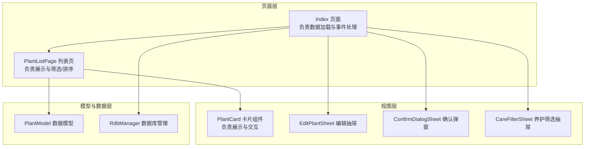
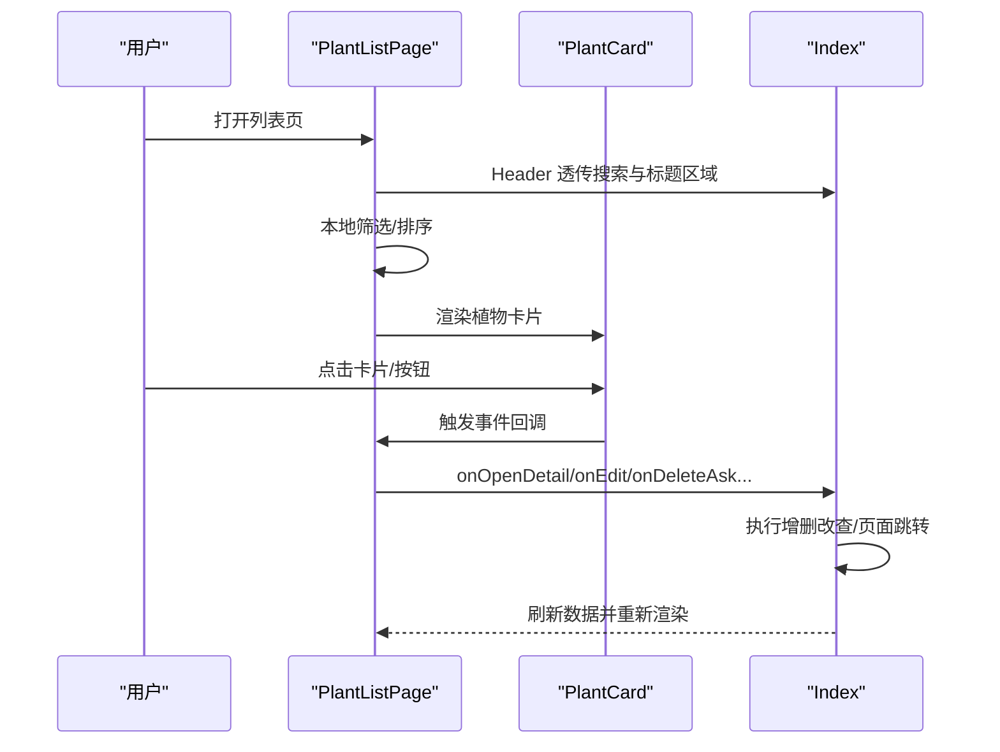
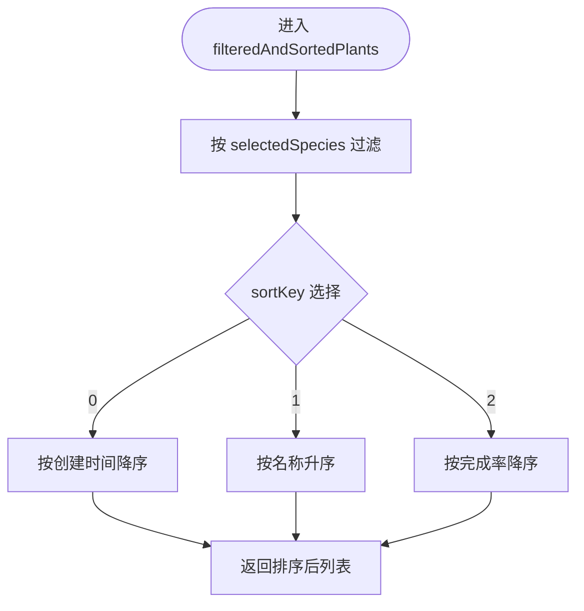
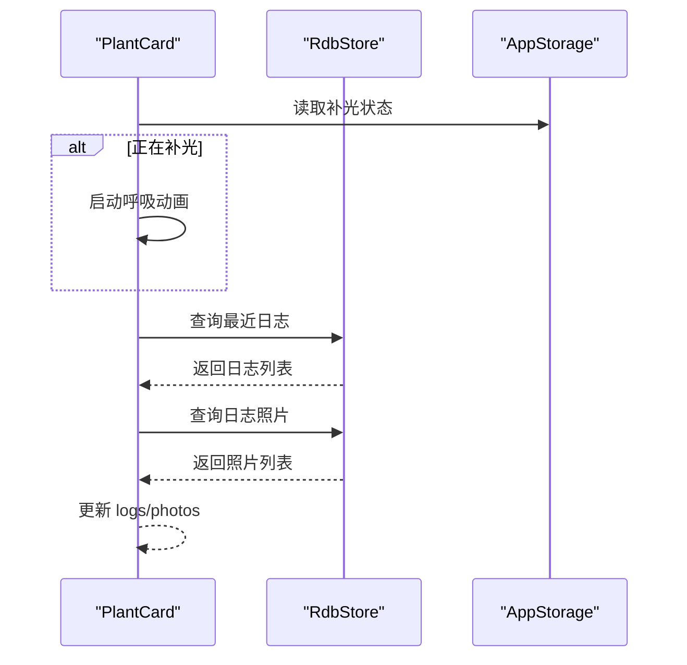
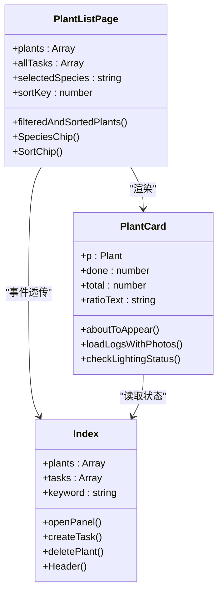

# 植物列表页 PlantListPage

<cite>
**本文档引用的文件**
- [PlantListPage.ets](file://entry/src/main/ets/pages/PlantListPage.ets)
- [PlantCard.ets](file://entry/src/main/ets/view/PlantCard.ets)
- [PlantModel.ets](file://entry/src/main/ets/model/PlantModel.ets)
- [RdbManager.ets](file://entry/src/main/ets/viewmodel/RdbManager.ets)
- [Index.ets](file://entry/src/main/ets/pages/Index.ets)
- [EditPlantSheet.ets](file://entry/src/main/ets/view/EditPlantSheet.ets)
- [ConfirmDialogSheet.ets](file://entry/src/main/ets/view/ConfirmDialogSheet.ets)
- [CareFilterSheet.ets](file://entry/src/main/ets/view/CareFilterSheet.ets)
</cite>

## 目录
1. [简介](#简介)
2. [项目结构](#项目结构)
3. [核心组件](#核心组件)
4. [架构总览](#架构总览)
5. [详细组件分析](#详细组件分析)
6. [依赖关系分析](#依赖关系分析)
7. [性能考虑](#性能考虑)
8. [故障排查指南](#故障排查指南)
9. [结论](#结论)
10. [附录](#附录)

## 简介
PlantListPage 是植物养护应用的主页列表页，负责展示植物卡片、提供筛选与排序、承载搜索入口，并将用户交互事件向上层页面转发以执行增删改查等操作。其设计强调：
- 列表渲染与交互解耦：列表仅负责展示与事件透传，核心业务逻辑在上层页面集中处理。
- 本地状态与计算分离：筛选与排序状态在列表页本地维护，但计算逻辑尽量简单，避免在渲染过程中重复计算。
- 子组件职责单一：PlantCard 负责卡片展示与交互，内部异步加载日志与照片，维持自身状态。

## 项目结构
PlantListPage 位于页面层，通过依赖注入的方式接收全局植物与任务数据，并通过事件回调将用户操作传递给上层 Index 页面统一处理。Index 页面负责数据库初始化、数据加载与持久化、以及各类页面跳转与弹窗控制。

**图表来源**
- [Index.ets:864-927](file://entry/src/main/ets/pages/Index.ets#L864-L927)
- [PlantListPage.ets:1-228](file://entry/src/main/ets/pages/PlantListPage.ets#L1-L228)
- [PlantCard.ets:1-326](file://entry/src/main/ets/view/PlantCard.ets#L1-L326)
- [RdbManager.ets:1-296](file://entry/src/main/ets/viewmodel/RdbManager.ets#L1-L296)

**章节来源**
- [Index.ets:1233-1283](file://entry/src/main/ets/pages/Index.ets#L1233-L1283)
- [PlantListPage.ets:116-199](file://entry/src/main/ets/pages/PlantListPage.ets#L116-L199)

## 核心组件
- PlantListPage：列表页主体，负责筛选、排序、渲染卡片、透传事件。
- PlantCard：单个植物卡片，负责展示封面、进度、快捷操作与功能入口。
- PlantModel：数据模型，包括 Plant、PlantTask、Metric 等。
- RdbManager：数据库初始化与索引管理，提供统一的数据库访问能力。
- Index：应用入口页，负责数据加载、事件处理、页面跳转与弹窗控制。

**章节来源**
- [PlantListPage.ets:4-228](file://entry/src/main/ets/pages/PlantListPage.ets#L4-L228)
- [PlantCard.ets:7-326](file://entry/src/main/ets/view/PlantCard.ets#L7-L326)
- [PlantModel.ets:6-166](file://entry/src/main/ets/model/PlantModel.ets#L6-L166)
- [RdbManager.ets:4-296](file://entry/src/main/ets/viewmodel/RdbManager.ets#L4-L296)
- [Index.ets:41-1382](file://entry/src/main/ets/pages/Index.ets#L41-L1382)

## 架构总览
PlantListPage 采用“列表展示 + 事件透传”的架构模式：
- 列表数据源来自上层 Index，包含植物列表与全量任务列表。
- 列表页本地维护筛选与排序状态，渲染前对数据进行本地过滤与排序。
- 每个 PlantCard 仅负责展示与交互，不直接访问数据库。
- 用户操作通过事件回调交由 Index 统一处理，保证数据一致性与事务安全。

**图表来源**
- [PlantListPage.ets:116-199](file://entry/src/main/ets/pages/PlantListPage.ets#L116-L199)
- [Index.ets:864-927](file://entry/src/main/ets/pages/Index.ets#L864-L927)

**章节来源**
- [PlantListPage.ets:116-199](file://entry/src/main/ets/pages/PlantListPage.ets#L116-L199)
- [Index.ets:864-927](file://entry/src/main/ets/pages/Index.ets#L864-L927)

## 详细组件分析

### PlantListPage 组件分析
- 参数与事件
  - 输入参数：plants（植物列表）、allTasks（全量任务列表）
  - 事件回调：打开详情、快速添加任务、编辑、删除确认、打开日志、打开指标、打开模板、打开用量估算器、打开应急与换盆等
- 本地状态
  - selectedSpecies：当前选中的物种筛选项
  - sortKey：排序键（0=创建时间，1=名称，2=完成率）
  - Header：BuilderParam，用于透传统一的搜索与标题区域
- 计算逻辑
  - plantTaskDone/plantTaskTotal/plantRatePct/ratioString：基于 allTasks 计算单个植物的任务完成数、总数与完成率
  - speciesChips：从 plants 中提取去重后的物种列表，始终包含“全部”
  - filteredAndSortedPlants：先按 selectedSpecies 过滤，再按 sortKey 排序
- 渲染结构
  - Header 区域（透传）
  - 物种芯片筛选行
  - 排序芯片行
  - 空状态提示或 List 渲染 PlantCard
  - ListItem 包裹卡片，并在点击时触发 onOpenDetail
- 交互细节
  - 物种芯片与排序芯片均使用 animateTo 实现平滑过渡
  - List 使用 EdgeEffect.Spring 与关闭滚动条，提升视觉体验

**图表来源**
- [PlantListPage.ets:93-114](file://entry/src/main/ets/pages/PlantListPage.ets#L93-L114)

**章节来源**
- [PlantListPage.ets:6-114](file://entry/src/main/ets/pages/PlantListPage.ets#L6-L114)
- [PlantListPage.ets:116-199](file://entry/src/main/ets/pages/PlantListPage.ets#L116-L199)
- [PlantListPage.ets:202-226](file://entry/src/main/ets/pages/PlantListPage.ets#L202-L226)

### PlantCard 组件分析
- 参数与依赖
  - p（Plant）、done（完成数）、total（总数）、ratioText（完成率文本）
  - 事件回调：快速添加、编辑、删除确认、打开日志、打开指标、打开模板、打开用量估算器、打开应急与换盆、打开指标图表
  - 依赖 RdbManager 与 AppStorage，用于加载日志与照片、同步补光状态
- 生命周期与状态
  - aboutToAppear：异步加载日志与照片，检查补光状态并启动呼吸动画
  - 本地状态：pressed（卡片按压）、logs/photos（日志与照片缓存）、isLighting/lightOpacity（补光状态与透明度）
- 展示逻辑
  - 封面图优先使用日志首张照片，否则使用首字头像
  - 根据 AppStorage 中的补光状态绘制边框、阴影与呼吸 Overlay
  - 名称、物种与位置信息展示
  - 顶部功能入口：日志、指标、模板、新模板、盆栽、用量估算器
  - 底部进度条与完成数/总数展示
  - 快速操作：浇水、施肥、修剪
- 交互细节
  - 按钮触摸反馈：按下缩放与动画过渡
  - 卡片整体触摸反馈与点击事件
  - 快捷按钮仅创建任务草稿，最终落库由上层统一处理

**图表来源**
- [PlantCard.ets:35-111](file://entry/src/main/ets/view/PlantCard.ets#L35-L111)

**章节来源**
- [PlantCard.ets:8-326](file://entry/src/main/ets/view/PlantCard.ets#L8-L326)

### 数据模型与数据库
- PlantModel：定义 Plant、PlantTask、Metric 等模型，使用 @ObservedV2 支持响应式更新
- RdbManager：统一数据库初始化、建表与索引，提供 getActiveLightSessions 等查询能力

**章节来源**
- [PlantModel.ets:6-166](file://entry/src/main/ets/model/PlantModel.ets#L6-L166)
- [RdbManager.ets:4-296](file://entry/src/main/ets/viewmodel/RdbManager.ets#L4-L296)

### 上层 Index 页面集成
- 数据加载：initDb -> ensureCareTemplates -> reloadAll -> loadTemplates
- 事件处理：onQuickAdd、onEdit、onDeleteAsk、onOpenDetail、onOpenLogs、onOpenMetrics、onOpenTemplate、onOpenTemplatenew、onOpenMetric 等
- Header 透传：将统一的搜索与标题区域透传给 PlantListPage

**章节来源**
- [Index.ets:128-141](file://entry/src/main/ets/pages/Index.ets#L128-L141)
- [Index.ets:864-927](file://entry/src/main/ets/pages/Index.ets#L864-L927)
- [Index.ets:1233-1283](file://entry/src/main/ets/pages/Index.ets#L1233-L1283)

## 依赖关系分析
PlantListPage 与 PlantCard 的依赖关系清晰，遵循“列表负责展示，卡片负责交互”的原则：
- PlantListPage 依赖 PlantModel 与 Index 的事件回调
- PlantCard 依赖 RdbManager 与 AppStorage，负责自身状态与数据加载
- Index 作为中枢，负责数据库初始化、数据加载、事件处理与页面跳转

**图表来源**
- [PlantListPage.ets:4-228](file://entry/src/main/ets/pages/PlantListPage.ets#L4-L228)
- [PlantCard.ets:7-326](file://entry/src/main/ets/view/PlantCard.ets#L7-L326)
- [Index.ets:41-1382](file://entry/src/main/ets/pages/Index.ets#L41-L1382)

**章节来源**
- [PlantListPage.ets:4-228](file://entry/src/main/ets/pages/PlantListPage.ets#L4-L228)
- [PlantCard.ets:7-326](file://entry/src/main/ets/view/PlantCard.ets#L7-L326)
- [Index.ets:41-1382](file://entry/src/main/ets/pages/Index.ets#L41-L1382)

## 性能考虑
- 本地筛选与排序
  - filteredAndSortedPlants 在渲染前一次性完成，避免在渲染过程中重复计算
  - speciesChips 基于 plants 提取并去重，确保筛选项与真实数据一致
- 列表渲染优化
  - List 使用 EdgeEffect.Spring 与关闭滚动条，减少不必要的绘制
  - ListItem 包裹 PlantCard，避免过度嵌套带来的性能损耗
- 数据加载与状态同步
  - PlantCard 在 aboutToAppear 中异步加载日志与照片，避免阻塞渲染
  - 补光状态通过 AppStorage 广播，首页刷新后可立即恢复视觉反馈
- 数据库索引
  - RdbManager 为常用查询建立索引，如任务表的唯一索引与复合索引，降低查询成本

**章节来源**
- [PlantListPage.ets:93-114](file://entry/src/main/ets/pages/PlantListPage.ets#L93-L114)
- [PlantCard.ets:35-111](file://entry/src/main/ets/view/PlantCard.ets#L35-L111)
- [RdbManager.ets:134-169](file://entry/src/main/ets/viewmodel/RdbManager.ets#L134-L169)

## 故障排查指南
- 搜索与筛选无效
  - 确认 Index 的 Header 是否正确透传至 PlantListPage 的 Header 参数
  - 检查 filteredAndSortedPlants 的 selectedSpecies 与 sortKey 是否被正确更新
- 删除确认弹窗
  - onDeleteAsk 会设置 confirmVisible 与 confirmText，确认弹窗组件是否正确显示
- 数据未刷新
  - 确认 Index 的 reloadAll 是否在页面返回或操作完成后调用
  - 检查数据库事务是否成功提交，特别是删除植物时的级联删除
- 卡片状态异常
  - 检查 AppStorage 中补光状态是否正确同步
  - 确认 PlantCard 的 loadLogsWithPhotos 是否成功返回日志与照片

**章节来源**
- [Index.ets:898-903](file://entry/src/main/ets/pages/Index.ets#L898-L903)
- [Index.ets:138-141](file://entry/src/main/ets/pages/Index.ets#L138-L141)
- [PlantCard.ets:42-47](file://entry/src/main/ets/view/PlantCard.ets#L42-L47)
- [ConfirmDialogSheet.ets:1-103](file://entry/src/main/ets/view/ConfirmDialogSheet.ets#L1-L103)

## 结论
PlantListPage 通过清晰的职责划分与事件透传机制，实现了高效、可维护的植物列表展示与交互。PlantCard 将展示与交互下沉至子组件，配合 Index 的统一事件处理，确保了数据一致性与用户体验。通过本地筛选与排序、异步数据加载与索引优化，系统在性能与可扩展性方面表现良好。建议在后续迭代中进一步完善批量操作与无障碍访问支持。

## 附录
- 搜索过滤功能实现要点
  - 搜索关键词来源于 Index 的 Header，Index 提供 filteredPlants 方法进行全局搜索
  - PlantListPage 仅负责本地筛选（按物种）与排序，不参与全局关键词搜索
- 增删改查操作流程
  - 创建/更新：通过 EditPlantSheet 打开编辑面板，Index 统一处理保存与删除
  - 删除：通过 ConfirmDialogSheet 确认，Index 执行删除并清理相关资源
  - 快速添加任务：PlantCard 触发 onQuickAdd，Index 创建任务并刷新数据
- 批量操作与排序
  - 批量操作建议在 Index 中实现，利用事务保证一致性
  - 排序键目前支持创建时间、名称与完成率，可根据需求扩展
- 响应式布局与无障碍
  - 建议为按钮与芯片增加焦点状态与语音朗读支持
  - 对于小屏设备，可考虑将筛选与排序控件改为抽屉式布局

**章节来源**
- [Index.ets:742-758](file://entry/src/main/ets/pages/Index.ets#L742-L758)
- [EditPlantSheet.ets:1-264](file://entry/src/main/ets/view/EditPlantSheet.ets#L1-L264)
- [ConfirmDialogSheet.ets:1-103](file://entry/src/main/ets/view/ConfirmDialogSheet.ets#L1-L103)
- [CareFilterSheet.ets:1-212](file://entry/src/main/ets/view/CareFilterSheet.ets#L1-L212)