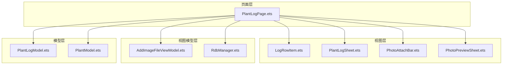
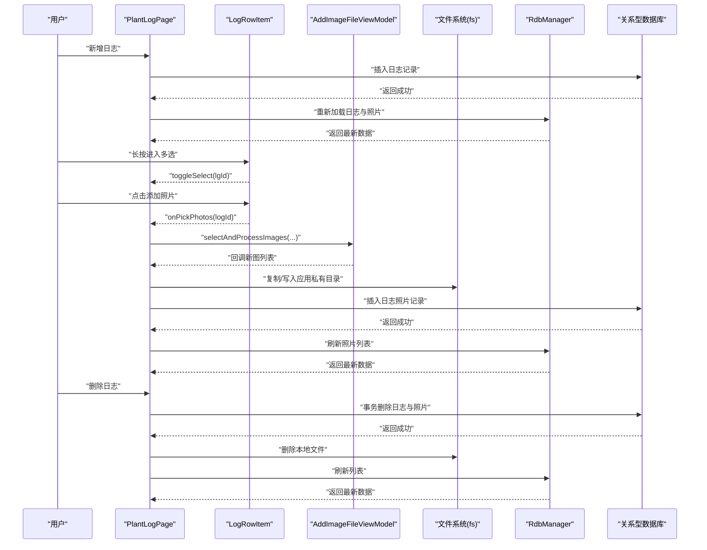
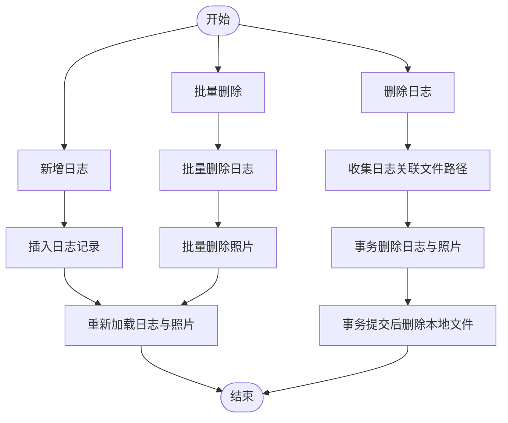
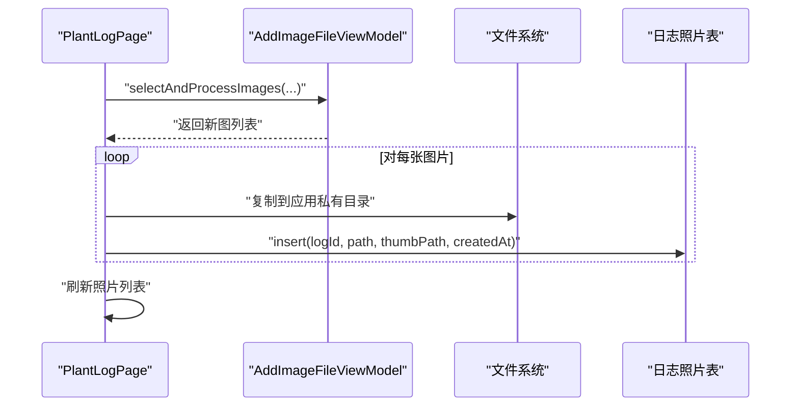
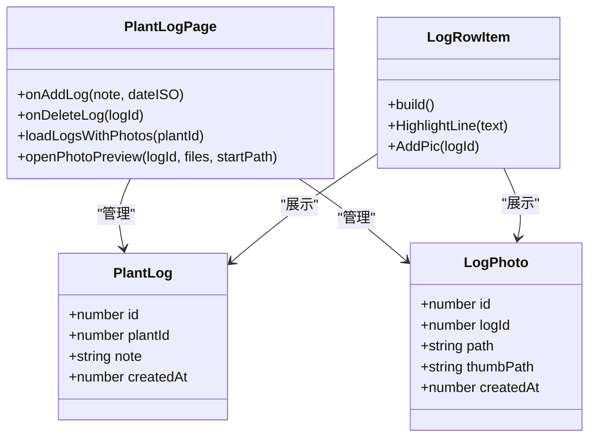
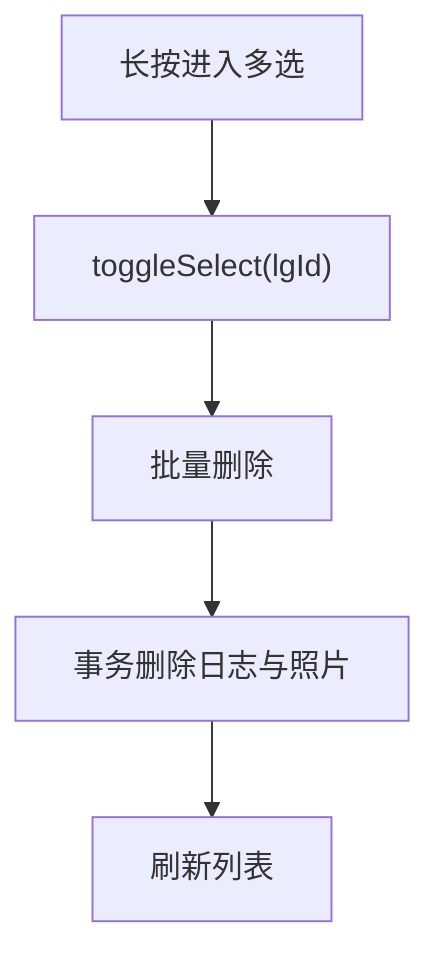
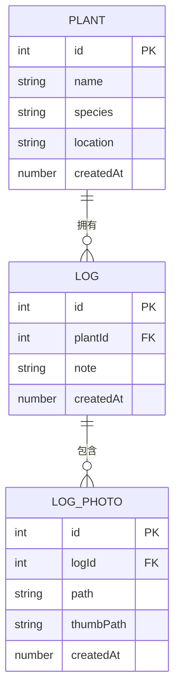
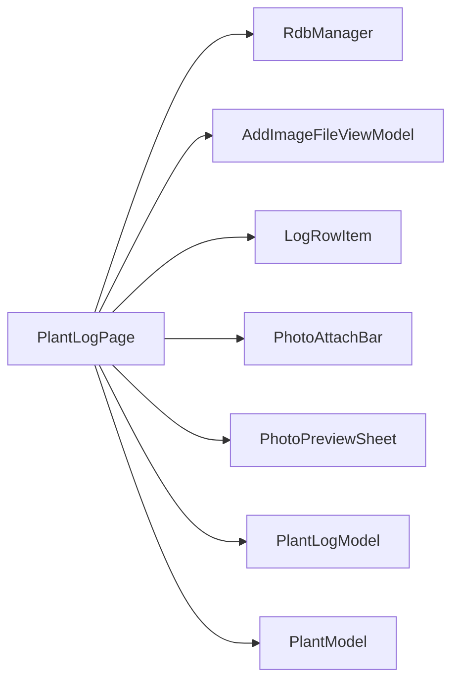

# 植物日志页 PlantLogPage

<cite>
**本文档引用的文件**
- [PlantLogPage.ets](file://entry/src/main/ets/pages/PlantLogPage.ets)
- [PlantLogModel.ets](file://entry/src/main/ets/model/PlantLogModel.ets)
- [PlantModel.ets](file://entry/src/main/ets/model/PlantModel.ets)
- [RdbManager.ets](file://entry/src/main/ets/viewmodel/RdbManager.ets)
- [AddImageFileViewModel.ets](file://entry/src/main/ets/viewmodel/AddImageFileViewModel.ets)
- [PlantLogSheet.ets](file://entry/src/main/ets/view/PlantLogSheet.ets)
- [LogRowItem.ets](file://entry/src/main/ets/view/LogRowItem.ets)
- [PhotoAttachBar.ets](file://entry/src/main/ets/view/PhotoAttachBar.ets)
- [PhotoPreviewSheet.ets](file://entry/src/main/ets/view/PhotoPreviewSheet.ets)
</cite>

## 目录
1. [简介](#简介)
2. [项目结构](#项目结构)
3. [核心组件](#核心组件)
4. [架构总览](#架构总览)
5. [详细组件分析](#详细组件分析)
6. [依赖关系分析](#依赖关系分析)
7. [性能考虑](#性能考虑)
8. [故障排查指南](#故障排查指南)
9. [结论](#结论)
10. [附录](#附录)

## 简介
PlantLogPage 是植物日志管理的核心页面，负责植物日志的创建、编辑、删除、排序与时间线展示，以及日志照片的上传、预览与批量管理。页面采用组件化设计，配合数据库管理器与图像处理视图模型，实现了日志与植物信息的强关联与数据一致性保障。本文档将深入解析其记录机制、数据管理流程、照片上传与预览、内容编辑与标签分类、时间线展示、搜索筛选与批量管理，以及与植物信息的关联关系与一致性保障策略。

## 项目结构
PlantLogPage 所属模块位于 entry/src/main/ets/pages，围绕日志管理的相关组件与模型分布在 view、viewmodel、model 等目录中。整体采用“页面 + 视图组件 + 视图模型 + 数据模型 + 数据库管理”的分层架构，确保关注点分离与可维护性。

**图表来源**
- [PlantLogPage.ets:1-1030](file://entry/src/main/ets/pages/PlantLogPage.ets#L1-L1030)
- [LogRowItem.ets:1-272](file://entry/src/main/ets/view/LogRowItem.ets#L1-L272)
- [PlantLogSheet.ets:1-384](file://entry/src/main/ets/view/PlantLogSheet.ets#L1-L384)
- [PhotoAttachBar.ets:1-100](file://entry/src/main/ets/view/PhotoAttachBar.ets#L1-L100)
- [PhotoPreviewSheet.ets:1-223](file://entry/src/main/ets/view/PhotoPreviewSheet.ets#L1-L223)
- [AddImageFileViewModel.ets:1-146](file://entry/src/main/ets/viewmodel/AddImageFileViewModel.ets#L1-L146)
- [RdbManager.ets:1-296](file://entry/src/main/ets/viewmodel/RdbManager.ets#L1-L296)
- [PlantLogModel.ets:1-58](file://entry/src/main/ets/model/PlantLogModel.ets#L1-L58)
- [PlantModel.ets:1-166](file://entry/src/main/ets/model/PlantModel.ets#L1-L166)

**章节来源**
- [PlantLogPage.ets:1-1030](file://entry/src/main/ets/pages/PlantLogPage.ets#L1-L1030)
- [PlantLogSheet.ets:1-384](file://entry/src/main/ets/view/PlantLogSheet.ets#L1-L384)

## 核心组件
- PlantLogPage：日志页主体，负责日志列表加载、新增、删除、排序、批量删除、照片选择与入库、预览与删除、横幅提示等。
- LogRowItem：单条日志行组件，负责展示日志内容、附件缩略图网格、长按进入多选、触发照片选择与删除等交互。
- PlantLogSheet：日志弹层容器（与页面同构逻辑），用于在弹层中展示日志列表与操作。
- PhotoAttachBar：照片附件栏，展示日志照片缩略图与“添加照片”按钮，支持预览与删除。
- PhotoPreviewSheet：全屏照片预览组件，支持左右翻页、缩放、删除与关闭。
- AddImageFileViewModel：图像选择与处理视图模型，封装相册选择、缩略图生成与分布式文件写入。
- RdbManager：数据库管理器，负责建表、索引、初始化与查询。
- PlantLogModel/PlantModel：日志与植物数据模型，定义字段与构造逻辑。

**章节来源**
- [PlantLogPage.ets:1-1030](file://entry/src/main/ets/pages/PlantLogPage.ets#L1-L1030)
- [LogRowItem.ets:1-272](file://entry/src/main/ets/view/LogRowItem.ets#L1-L272)
- [PlantLogSheet.ets:1-384](file://entry/src/main/ets/view/PlantLogSheet.ets#L1-L384)
- [PhotoAttachBar.ets:1-100](file://entry/src/main/ets/view/PhotoAttachBar.ets#L1-L100)
- [PhotoPreviewSheet.ets:1-223](file://entry/src/main/ets/view/PhotoPreviewSheet.ets#L1-L223)
- [AddImageFileViewModel.ets:1-146](file://entry/src/main/ets/viewmodel/AddImageFileViewModel.ets#L1-L146)
- [RdbManager.ets:1-296](file://entry/src/main/ets/viewmodel/RdbManager.ets#L1-L296)
- [PlantLogModel.ets:1-58](file://entry/src/main/ets/model/PlantLogModel.ets#L1-L58)
- [PlantModel.ets:1-166](file://entry/src/main/ets/model/PlantModel.ets#L1-L166)

## 架构总览
PlantLogPage 采用“页面 + 组件 + 视图模型 + 数据库”的分层架构。页面负责状态与交互，组件负责展示与子交互，视图模型负责数据访问与图像处理，数据库管理器负责持久化与索引。

**图表来源**
- [PlantLogPage.ets:66-152](file://entry/src/main/ets/pages/PlantLogPage.ets#L66-L152)
- [AddImageFileViewModel.ets:35-74](file://entry/src/main/ets/viewmodel/AddImageFileViewModel.ets#L35-L74)
- [RdbManager.ets:62-87](file://entry/src/main/ets/viewmodel/RdbManager.ets#L62-L87)

## 详细组件分析

### 日志记录与数据管理
- 新增日志：页面接收内容与日期，插入日志表后统一重新加载日志与照片，确保列表与附件区同步刷新。
- 删除日志：采用“事务删记录、事务后删文件”的顺序，保证数据库一致性；删除失败自动回滚并提示。
- 批量删除：按日志 ID 批量删除日志与照片，随后刷新当前植物的日志列表。
- 排序与筛选：支持按创建时间升序/降序排列；支持关键词高亮显示，提升检索效率。

**图表来源**
- [PlantLogPage.ets:66-152](file://entry/src/main/ets/pages/PlantLogPage.ets#L66-L152)

**章节来源**
- [PlantLogPage.ets:66-152](file://entry/src/main/ets/pages/PlantLogPage.ets#L66-L152)

### 照片上传、预览与管理
- 照片选择与处理：通过 AddImageFileViewModel 封装相册选择与缩略图生成，回调返回新图列表。
- 存储策略：将图片复制到应用私有目录（filesDir），确保外部 URI 失效不影响展示；路径统一以 file:// 前缀返回，便于 Image 组件显示。
- 入库与缩略图：插入日志照片记录，初始缩略图可与原图相同；后续如需生成缩略图可在视图层更新。
- 预览与删除：支持单图预览与全屏照片预览（PhotoPreviewSheet），支持删除后自动刷新预览列表与当前日志照片列表。

**图表来源**
- [PlantLogPage.ets:180-240](file://entry/src/main/ets/pages/PlantLogPage.ets#L180-L240)
- [AddImageFileViewModel.ets:35-74](file://entry/src/main/ets/viewmodel/AddImageFileViewModel.ets#L35-L74)

**章节来源**
- [PlantLogPage.ets:180-240](file://entry/src/main/ets/pages/PlantLogPage.ets#L180-L240)
- [AddImageFileViewModel.ets:35-74](file://entry/src/main/ets/viewmodel/AddImageFileViewModel.ets#L35-L74)

### 内容编辑、标签分类与时间线展示
- 内容编辑：页面提供输入框与日期选择，默认今日日期，支持清空与重置。
- 标签分类：当前版本未实现专用标签字段，可通过日志内容与关键词高亮实现简易分类与检索。
- 时间线展示：按创建时间倒序展示日志，支持升序/降序切换；日志行组件展示日期与高亮内容。

**图表来源**
- [PlantLogModel.ets:8-57](file://entry/src/main/ets/model/PlantLogModel.ets#L8-L57)
- [LogRowItem.ets:4-272](file://entry/src/main/ets/view/LogRowItem.ets#L4-L272)
- [PlantLogPage.ets:324-357](file://entry/src/main/ets/pages/PlantLogPage.ets#L324-L357)

**章节来源**
- [PlantLogModel.ets:8-57](file://entry/src/main/ets/model/PlantLogModel.ets#L8-L57)
- [LogRowItem.ets:4-272](file://entry/src/main/ets/view/LogRowItem.ets#L4-L272)
- [PlantLogPage.ets:324-357](file://entry/src/main/ets/pages/PlantLogPage.ets#L324-L357)

### 搜索、筛选与批量管理
- 搜索：支持关键词高亮显示，匹配日志内容并在 UI 中突出显示。
- 筛选：按植物 ID 与创建时间排序，典型查询使用组合索引优化。
- 批量管理：长按进入多选模式，支持批量删除与取消选择；批量删除采用事务处理，确保一致性。

**图表来源**
- [PlantLogPage.ets:388-442](file://entry/src/main/ets/pages/PlantLogPage.ets#L388-L442)
- [PlantLogSheet.ets:321-348](file://entry/src/main/ets/view/PlantLogSheet.ets#L321-L348)

**章节来源**
- [PlantLogPage.ets:388-442](file://entry/src/main/ets/pages/PlantLogPage.ets#L388-L442)
- [PlantLogSheet.ets:321-348](file://entry/src/main/ets/view/PlantLogSheet.ets#L321-L348)

### 日志与植物信息的关联关系与数据一致性
- 关联关系：日志表包含 plantId 字段，通过该字段与植物信息建立一对一或多对一关系。
- 数据一致性：删除日志时，先删除日志照片，再删除日志记录，事务提交后再删除本地文件；批量删除同样遵循事务顺序，确保数据库与文件系统的最终一致性。
- 索引优化：为日志表与日志照片表建立组合索引，优化按植物 ID 与创建时间的查询性能。

**图表来源**
- [RdbManager.ets:62-87](file://entry/src/main/ets/viewmodel/RdbManager.ets#L62-L87)

**章节来源**
- [RdbManager.ets:62-87](file://entry/src/main/ets/viewmodel/RdbManager.ets#L62-L87)
- [PlantModel.ets:7-21](file://entry/src/main/ets/model/PlantModel.ets#L7-L21)
- [PlantLogModel.ets:8-28](file://entry/src/main/ets/model/PlantLogModel.ets#L8-L28)

## 依赖关系分析
- PlantLogPage 依赖 RdbManager 提供数据库连接与建表初始化，依赖 AddImageFileViewModel 处理图像选择与写入，依赖 LogRowItem、PhotoAttachBar、PhotoPreviewSheet 等视图组件完成 UI 展示与交互。
- 数据模型 PlantLogModel 与 PlantModel 提供轻量数据结构，避免页面承担过多业务逻辑。
- 视图模型 AddImageFileViewModel 封装媒体库访问与文件写入，降低页面复杂度。

**图表来源**
- [PlantLogPage.ets:1-12](file://entry/src/main/ets/pages/PlantLogPage.ets#L1-L12)
- [AddImageFileViewModel.ets:14-27](file://entry/src/main/ets/viewmodel/AddImageFileViewModel.ets#L14-L27)
- [RdbManager.ets:4-24](file://entry/src/main/ets/viewmodel/RdbManager.ets#L4-L24)

**章节来源**
- [PlantLogPage.ets:1-12](file://entry/src/main/ets/pages/PlantLogPage.ets#L1-L12)
- [AddImageFileViewModel.ets:14-27](file://entry/src/main/ets/viewmodel/AddImageFileViewModel.ets#L14-L27)
- [RdbManager.ets:4-24](file://entry/src/main/ets/viewmodel/RdbManager.ets#L4-L24)

## 性能考虑
- 数据库查询优化：为日志表与日志照片表建立组合索引，避免重复索引造成存储浪费；按 plantId + createdAt 排序查询，减少排序成本。
- 图像处理优化：在 AddImageFileViewModel 中对 PixelMap 进行及时释放，避免内存泄漏；批量处理时控制并发与缓冲大小。
- UI 渲染优化：日志列表使用虚拟滚动与边缘效果，减少不必要的重绘；照片网格根据数量动态计算高度，避免过度布局。
- 存储空间管理：删除日志时同步删除本地文件，防止碎片堆积；定期清理无效或重复照片，保持存储整洁。

[本节为通用性能建议，无需特定文件引用]

## 故障排查指南
- 照片无法显示：检查路径是否以 file:// 前缀，确认文件存在于应用私有目录；查看插入日志照片记录是否成功。
- 删除失败回滚：当删除日志或照片失败时，页面会自动回滚并提示警告；检查数据库事务执行情况与文件权限。
- 图像选择异常：确认相册选择权限与回调处理；检查 AddImageFileViewModel 的错误日志输出。
- 列表不同步：新增或删除后应统一调用重新加载方法，确保日志与照片列表同步刷新。

**章节来源**
- [PlantLogPage.ets:133-137](file://entry/src/main/ets/pages/PlantLogPage.ets#L133-L137)
- [AddImageFileViewModel.ets:52-55](file://entry/src/main/ets/viewmodel/AddImageFileViewModel.ets#L52-L55)

## 结论
PlantLogPage 通过清晰的分层架构与组件化设计，实现了植物日志的高效管理与照片的可靠存储。其事务化的删除流程、索引优化的查询策略与完善的 UI 交互，共同保障了数据一致性与用户体验。建议在后续迭代中引入标签字段与更丰富的筛选能力，进一步提升日志管理的灵活性与可扩展性。

## 附录
- 数据库初始化与索引：日志表与日志照片表的建表与索引创建由 RdbManager 统一管理，确保查询性能与数据完整性。
- 模型定义：PlantLogModel 与 PlantModel 提供简洁的数据结构，便于在页面与视图模型间传递与复用。

**章节来源**
- [RdbManager.ets:62-170](file://entry/src/main/ets/viewmodel/RdbManager.ets#L62-L170)
- [PlantLogModel.ets:8-57](file://entry/src/main/ets/model/PlantLogModel.ets#L8-L57)
- [PlantModel.ets:77-90](file://entry/src/main/ets/model/PlantModel.ets#L77-L90)