# 植物详情页 PlantDetail

<cite>
**本文档引用的文件**
- [PlantDetail.ets](file://entry/src/main/ets/pages/PlantDetail.ets)
- [PlantModel.ets](file://entry/src/main/ets/model/PlantModel.ets)
- [PlantCard.ets](file://entry/src/main/ets/view/PlantCard.ets)
- [EditPlantSheet.ets](file://entry/src/main/ets/view/EditPlantSheet.ets)
- [PhotoAttachBar.ets](file://entry/src/main/ets/view/PhotoAttachBar.ets)
- [PlantLogSheet.ets](file://entry/src/main/ets/view/PlantLogSheet.ets)
- [PlantLogPage.ets](file://entry/src/main/ets/pages/PlantLogPage.ets)
- [RdbManager.ets](file://entry/src/main/ets/viewmodel/RdbManager.ets)
- [GrowthIndicatorPage.ets](file://entry/src/main/ets/pages/GrowthIndicatorPage.ets)
- [GrowthComparePage.ets](file://entry/src/main/ets/pages/GrowthComparePage.ets)
- [WaterEstimatorPage.ets](file://entry/src/main/ets/pages/WaterEstimatorPage.ets)
- [EmergencyAndRotatePage.ets](file://entry/src/main/ets/pages/EmergencyAndRotatePage.ets)
- [MetricSheet.ets](file://entry/src/main/ets/view/MetricSheet.ets)
</cite>

## 目录
1. [简介](#简介)
2. [项目结构](#项目结构)
3. [核心组件](#核心组件)
4. [架构总览](#架构总览)
5. [详细组件分析](#详细组件分析)
6. [依赖关系分析](#依赖关系分析)
7. [性能考虑](#性能考虑)
8. [故障排除指南](#故障排除指南)
9. [结论](#结论)

## 简介
PlantDetail 是植物详情页的核心页面，负责展示植物基本信息、快捷功能入口，并与日志、光照、生长指标、成长对比、浇水估算、应急与转盆等多个功能模块进行数据联动。本文档将深入解析其数据绑定机制、交互行为与状态切换、编辑与照片管理流程、健康状态评估与养护建议展示方式，以及与其他功能模块的关联与联动。

## 项目结构
PlantDetail 位于页面层，依赖模型层 PlantModel 提供数据结构，通过 RdbManager 访问数据库，与多个功能页面（日志、指标、对比、估算、应急与转盆）形成导航与数据联动。

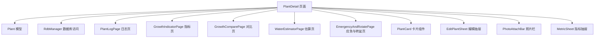

**图表来源**
- [PlantDetail.ets:1-136](file://entry/src/main/ets/pages/PlantDetail.ets#L1-L136)
- [PlantModel.ets:1-166](file://entry/src/main/ets/model/PlantModel.ets#L1-L166)
- [RdbManager.ets:1-296](file://entry/src/main/ets/viewmodel/RdbManager.ets#L1-L296)
- [PlantLogPage.ets:1-800](file://entry/src/main/ets/pages/PlantLogPage.ets#L1-L800)
- [GrowthIndicatorPage.ets:1-605](file://entry/src/main/ets/pages/GrowthIndicatorPage.ets#L1-L605)
- [GrowthComparePage.ets:1-477](file://entry/src/main/ets/pages/GrowthComparePage.ets#L1-L477)
- [WaterEstimatorPage.ets:1-490](file://entry/src/main/ets/pages/WaterEstimatorPage.ets#L1-L490)
- [EmergencyAndRotatePage.ets:1-557](file://entry/src/main/ets/pages/EmergencyAndRotatePage.ets#L1-L557)
- [PlantCard.ets:1-326](file://entry/src/main/ets/view/PlantCard.ets#L1-L326)
- [EditPlantSheet.ets:1-264](file://entry/src/main/ets/view/EditPlantSheet.ets#L1-L264)
- [PhotoAttachBar.ets:1-100](file://entry/src/main/ets/view/PhotoAttachBar.ets#L1-L100)
- [MetricSheet.ets:1-491](file://entry/src/main/ets/view/MetricSheet.ets#L1-L491)

**章节来源**
- [PlantDetail.ets:1-136](file://entry/src/main/ets/pages/PlantDetail.ets#L1-L136)

## 核心组件
- 植物详情页 PlantDetail：负责展示植物基础信息与快捷功能网格，承载导航至日志、光照、指标、对比、浇水估算、应急与转盆等功能。
- 植物模型 Plant：包含植物标识、名称、种类、位置、创建时间等字段，用于详情页展示与导航参数传递。
- 数据库访问 RdbManager：统一管理数据库初始化、建表、索引与查询，为各功能页提供数据支撑。
- 功能页面：
  - PlantLogPage：植物日志的增删改查与照片管理。
  - GrowthIndicatorPage：生长指标录入、列表与图表展示。
  - GrowthComparePage：成长对比相册，基于日志照片按时间排序。
  - WaterEstimatorPage：浇水用量估算，支持保存估算记录与直接记为浇水。
  - EmergencyAndRotatePage：植物应急处理流程与转盆提醒计划。
- 子组件：
  - PlantCard：植物卡片，承载日志、指标、模板、新模板、盆栽、用量估算器等入口，支持补光状态呼吸动画。
  - EditPlantSheet：植物编辑抽屉，支持保存、删除、快速浇水、周期任务模板入口。
  - PhotoAttachBar：照片附件栏，支持添加、预览、删除照片。
  - MetricSheet：指标抽屉，支持快速录入、迷你趋势与历史删除。

**章节来源**
- [PlantDetail.ets:1-136](file://entry/src/main/ets/pages/PlantDetail.ets#L1-L136)
- [PlantModel.ets:1-166](file://entry/src/main/ets/model/PlantModel.ets#L1-L166)
- [RdbManager.ets:1-296](file://entry/src/main/ets/viewmodel/RdbManager.ets#L1-L296)
- [PlantCard.ets:1-326](file://entry/src/main/ets/view/PlantCard.ets#L1-L326)
- [EditPlantSheet.ets:1-264](file://entry/src/main/ets/view/EditPlantSheet.ets#L1-L264)
- [PhotoAttachBar.ets:1-100](file://entry/src/main/ets/view/PhotoAttachBar.ets#L1-L100)
- [PlantLogSheet.ets:1-384](file://entry/src/main/ets/view/PlantLogSheet.ets#L1-L384)
- [PlantLogPage.ets:1-800](file://entry/src/main/ets/pages/PlantLogPage.ets#L1-L800)
- [GrowthIndicatorPage.ets:1-605](file://entry/src/main/ets/pages/GrowthIndicatorPage.ets#L1-L605)
- [GrowthComparePage.ets:1-477](file://entry/src/main/ets/pages/GrowthComparePage.ets#L1-L477)
- [WaterEstimatorPage.ets:1-490](file://entry/src/main/ets/pages/WaterEstimatorPage.ets#L1-L490)
- [EmergencyAndRotatePage.ets:1-557](file://entry/src/main/ets/pages/EmergencyAndRotatePage.ets#L1-L557)
- [MetricSheet.ets:1-491](file://entry/src/main/ets/view/MetricSheet.ets#L1-L491)

## 架构总览
PlantDetail 采用页面-组件-模型-数据库的分层架构：
- 页面层：PlantDetail 负责布局与导航。
- 组件层：PlantCard、EditPlantSheet、PhotoAttachBar、MetricSheet 等复用性强的 UI 组件。
- 模型层：PlantModel 提供数据结构与草稿对象。
- 数据层：RdbManager 统一建表、索引与查询，支撑日志、指标、照片、光照会话等数据。

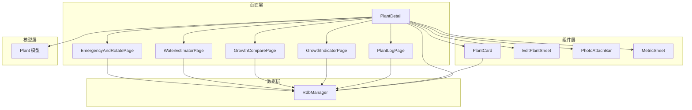

**图表来源**
- [PlantDetail.ets:1-136](file://entry/src/main/ets/pages/PlantDetail.ets#L1-L136)
- [PlantCard.ets:1-326](file://entry/src/main/ets/view/PlantCard.ets#L1-L326)
- [EditPlantSheet.ets:1-264](file://entry/src/main/ets/view/EditPlantSheet.ets#L1-L264)
- [PhotoAttachBar.ets:1-100](file://entry/src/main/ets/view/PhotoAttachBar.ets#L1-L100)
- [MetricSheet.ets:1-491](file://entry/src/main/ets/view/MetricSheet.ets#L1-L491)
- [PlantModel.ets:1-166](file://entry/src/main/ets/model/PlantModel.ets#L1-L166)
- [RdbManager.ets:1-296](file://entry/src/main/ets/viewmodel/RdbManager.ets#L1-L296)

## 详细组件分析

### 植物详情页 PlantDetail
- 展示逻辑
  - Header：标题“植物详情”。
  - PlantInfoCard：展示植物名称、种类、位置、创建日期等基础信息。
  - QuickActionGrid：九宫格快捷功能，包含“养护日志”“光照记录”“生长指标”“成长对比”“浇水估算”“应急与轮换”等入口。
- 数据绑定机制
  - @Local plant：接收导航参数中的 Plant 实例，用于渲染植物信息。
  - @Param @Require pageStack：导航栈，用于 pushPathByName 跳转到目标页面。
  - AppStorage 获取顶部/底部安全区域高度，动态适配刘海屏与底部胶囊栏。
- 交互行为与状态切换
  - GridItem 点击触发页面跳转，使用 pageStack.pushPathByName。
  - ActionCard 支持点击事件与阴影、圆角、背景色等视觉样式。
- 与数据库的关联
  - 通过 RdbManager 获取数据库连接，为日志、指标、照片等数据提供查询与写入能力。

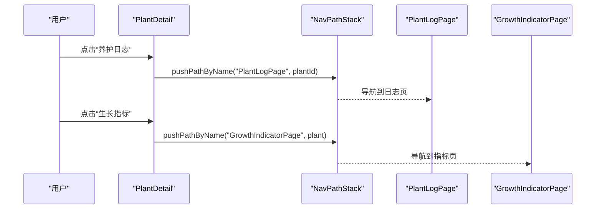

**图表来源**
- [PlantDetail.ets:70-115](file://entry/src/main/ets/pages/PlantDetail.ets#L70-L115)
- [PlantLogPage.ets:639-648](file://entry/src/main/ets/pages/PlantLogPage.ets#L639-L648)
- [GrowthIndicatorPage.ets:96-100](file://entry/src/main/ets/pages/GrowthIndicatorPage.ets#L96-L100)

**章节来源**
- [PlantDetail.ets:1-136](file://entry/src/main/ets/pages/PlantDetail.ets#L1-L136)

### 植物卡片 PlantCard（交互与状态）
- 交互行为
  - 按压反馈：卡片整体与图标按钮均支持按压缩放与动画过渡。
  - 补光状态：通过 AppStorage 广播补光状态，卡片边框、阴影与覆盖层呈现“呼吸”动画。
  - 快捷入口：日志、指标、模板、新模板、盆栽、用量估算器等入口，支持点击回调。
- 状态切换
  - 按压状态：pressed、metricPressed、editPressed、deletePressed 控制缩放与动画。
  - 补光状态：isLighting、lightOpacity 控制黄色高亮覆盖层透明度与闪烁动画。
- 数据加载
  - aboutToAppear 生命周期中异步加载最近日志与照片，用于封面图与补光状态展示。
  - loadLogsWithPhotos 通过 RdbManager 查询日志与照片表，按时间倒序排列。

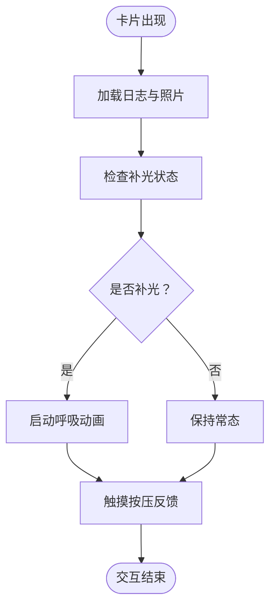

**图表来源**
- [PlantCard.ets:35-53](file://entry/src/main/ets/view/PlantCard.ets#L35-L53)
- [PlantCard.ets:80-111](file://entry/src/main/ets/view/PlantCard.ets#L80-L111)

**章节来源**
- [PlantCard.ets:1-326](file://entry/src/main/ets/view/PlantCard.ets#L1-L326)

### 植物编辑抽屉 EditPlantSheet（编辑与保存）
- 表单字段：名称、品种、位置，支持实时 onChange 更新草稿对象。
- 快速任务：提供“每7天×4次(浇水)”“每3天×6次(施肥)”“每14天×3次(修剪)”等模板快捷入口。
- 操作按钮：保存、删除、添加今日浇水，均支持按压动画与回调。
- 与 PlantModel 的关系：使用 PlantDraft 作为编辑态草稿，避免直接修改列表实体。

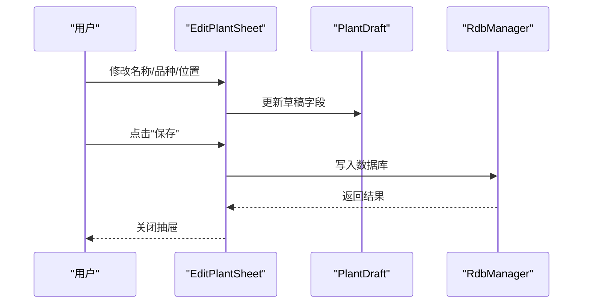

**图表来源**
- [EditPlantSheet.ets:64-73](file://entry/src/main/ets/view/EditPlantSheet.ets#L64-L73)
- [EditPlantSheet.ets:102-124](file://entry/src/main/ets/view/EditPlantSheet.ets#L102-L124)
- [PlantModel.ets:62-75](file://entry/src/main/ets/model/PlantModel.ets#L62-L75)

**章节来源**
- [EditPlantSheet.ets:1-264](file://entry/src/main/ets/view/EditPlantSheet.ets#L1-L264)
- [PlantModel.ets:62-75](file://entry/src/main/ets/model/PlantModel.ets#L62-L75)

### 照片附件栏 PhotoAttachBar（照片管理）
- 功能：展示照片缩略图、添加照片、删除照片、预览照片。
- 事件回调：onPick、onDeleteAsk、onPreview，交由外部页面处理实际操作。
- 数据结构：LogPhoto 包含照片 ID、所属日志 ID、原图路径与缩略图路径。

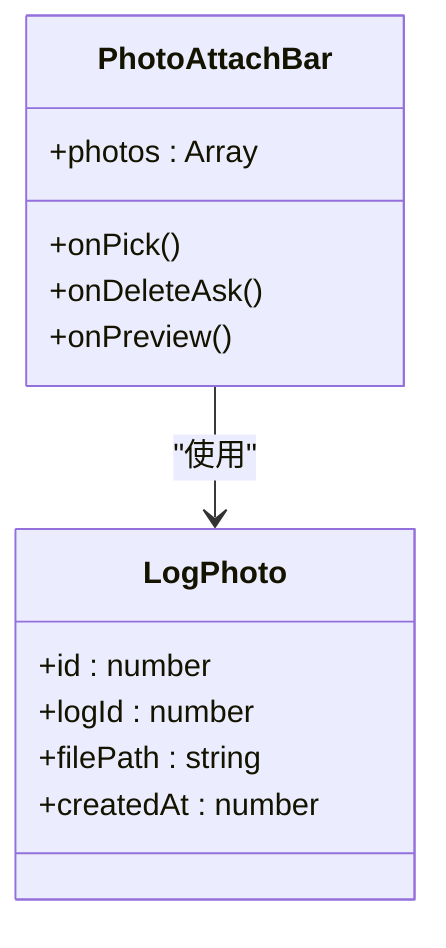

**图表来源**
- [PhotoAttachBar.ets:1-100](file://entry/src/main/ets/view/PhotoAttachBar.ets#L1-L100)

**章节来源**
- [PhotoAttachBar.ets:1-100](file://entry/src/main/ets/view/PhotoAttachBar.ets#L1-L100)

### 日志与照片管理（PlantLogSheet 与 PlantLogPage）
- PlantLogSheet：日志抽屉式组件，支持新增日志、排序切换、多选删除、照片附件管理、图片预览。
- PlantLogPage：完整日志页，支持新增日志、删除日志及关联照片、批量删除、照片预览、横幅提示等。
- 数据流程：新增日志后统一重新加载日志与照片，确保列表与附件区同步刷新；删除日志时遵循“事务删记录、事务后删文件”的顺序，保证数据一致性。

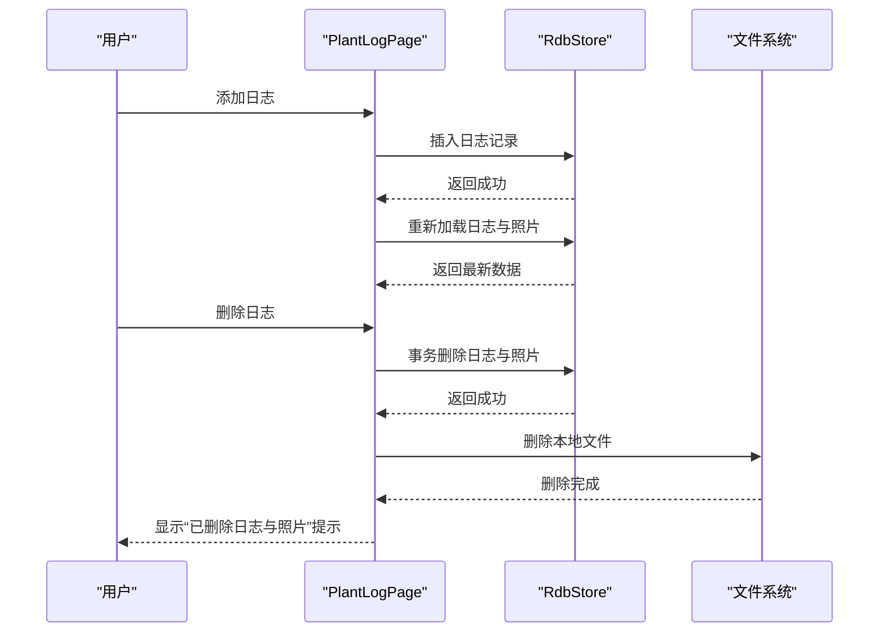

**图表来源**
- [PlantLogPage.ets:66-82](file://entry/src/main/ets/pages/PlantLogPage.ets#L66-L82)
- [PlantLogPage.ets:87-137](file://entry/src/main/ets/pages/PlantLogPage.ets#L87-L137)
- [PlantLogSheet.ets:41-48](file://entry/src/main/ets/view/PlantLogSheet.ets#L41-L48)

**章节来源**
- [PlantLogSheet.ets:1-384](file://entry/src/main/ets/view/PlantLogSheet.ets#L1-L384)
- [PlantLogPage.ets:1-800](file://entry/src/main/ets/pages/PlantLogPage.ets#L1-L800)

### 生长指标与健康评估（GrowthIndicatorPage 与 MetricSheet）
- GrowthIndicatorPage：支持录入身高、冠幅、健康分，按时间排序，支持图表/列表切换，MiniChart 展示趋势。
- MetricSheet：指标抽屉，支持快速录入、迷你趋势图、历史删除，图表动画与排序控制。
- 健康状态评估：健康分（0~100）作为核心指标，结合身高、冠幅趋势进行综合评估。

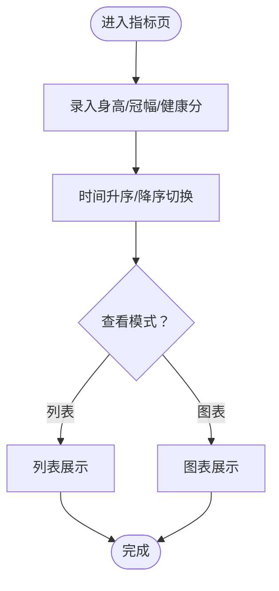

**图表来源**
- [GrowthIndicatorPage.ets:129-142](file://entry/src/main/ets/pages/GrowthIndicatorPage.ets#L129-L142)
- [GrowthIndicatorPage.ets:158-178](file://entry/src/main/ets/pages/GrowthIndicatorPage.ets#L158-L178)
- [MetricSheet.ets:28-40](file://entry/src/main/ets/view/MetricSheet.ets#L28-L40)

**章节来源**
- [GrowthIndicatorPage.ets:1-605](file://entry/src/main/ets/pages/GrowthIndicatorPage.ets#L1-L605)
- [MetricSheet.ets:1-491](file://entry/src/main/ets/view/MetricSheet.ets#L1-L491)

### 成长对比（GrowthComparePage）
- 基于日志照片的时间序列展示，支持滑动对比、预览网格、时间跨度提示。
- 照片来源：日志系统，按 plantId 聚合读取并按创建时间升序排列。
- 新增照片：若当前植物无日志，自动创建一条占位日志以承接图片。

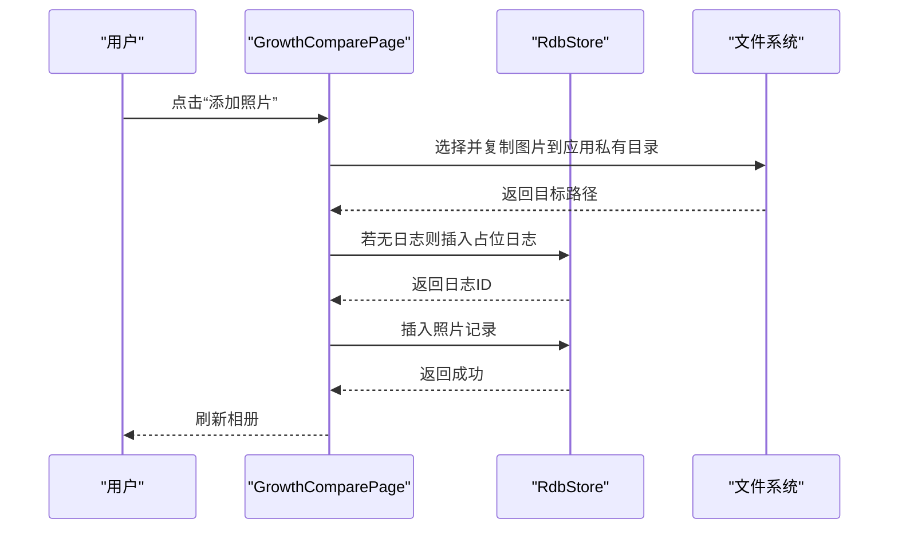

**图表来源**
- [GrowthComparePage.ets:377-400](file://entry/src/main/ets/pages/GrowthComparePage.ets#L377-L400)
- [GrowthComparePage.ets:446-475](file://entry/src/main/ets/pages/GrowthComparePage.ets#L446-L475)

**章节来源**
- [GrowthComparePage.ets:1-477](file://entry/src/main/ets/pages/GrowthComparePage.ets#L1-L477)

### 浇水估算（WaterEstimatorPage）
- 输入参数：盆径、深度、介质类型、浇水策略、植物类型。
- 输出结果：下限、推荐、上限区间值，配套建议文本与公式简述。
- 保存与记录：支持保存估算记录与直接用“推荐”值记一笔浇水，记录到日志。

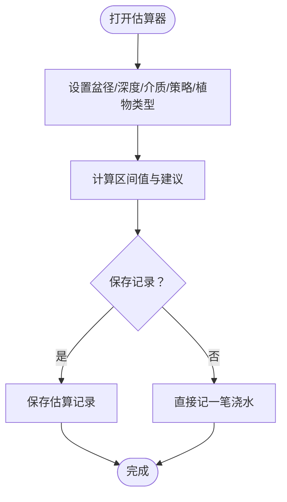

**图表来源**
- [WaterEstimatorPage.ets:24-54](file://entry/src/main/ets/pages/WaterEstimatorPage.ets#L24-L54)
- [WaterEstimatorPage.ets:362-413](file://entry/src/main/ets/pages/WaterEstimatorPage.ets#L362-L413)

**章节来源**
- [WaterEstimatorPage.ets:1-490](file://entry/src/main/ets/pages/WaterEstimatorPage.ets#L1-L490)

### 应急与转盆（EmergencyAndRotatePage）
- 应急流程：症状选择 → 步骤勾选 → 记录观察 → 历史查看。
- 转盆提醒：设置周期、查看下次到期、记录历史，支持启用/禁用计划。
- 状态管理：EmergencyViewModel 与 RotatePlanViewModel 分别管理应急与转盆状态。

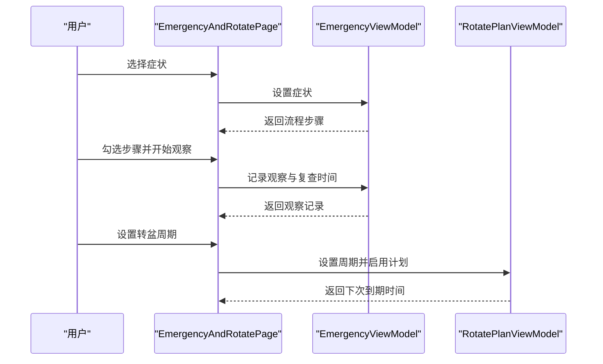

**图表来源**
- [EmergencyAndRotatePage.ets:17-22](file://entry/src/main/ets/pages/EmergencyAndRotatePage.ets#L17-L22)
- [EmergencyAndRotatePage.ets:110-136](file://entry/src/main/ets/pages/EmergencyAndRotatePage.ets#L110-L136)
- [EmergencyAndRotatePage.ets:369-434](file://entry/src/main/ets/pages/EmergencyAndRotatePage.ets#L369-L434)

**章节来源**
- [EmergencyAndRotatePage.ets:1-557](file://entry/src/main/ets/pages/EmergencyAndRotatePage.ets#L1-L557)

## 依赖关系分析
- PlantDetail 依赖 Plant 模型与 RdbManager，通过 pageStack 导航到各功能页。
- PlantCard 依赖 RdbManager 查询日志与照片，依赖 AppStorage 同步补光状态。
- PlantLogPage 与 GrowthComparePage 共享日志与照片表，确保数据一致性。
- GrowthIndicatorPage 与 MetricSheet 共享指标表，支持快速录入与图表展示。
- WaterEstimatorPage 与 EmergencyAndRotatePage 通过 ViewModel 管理状态，减少页面耦合。

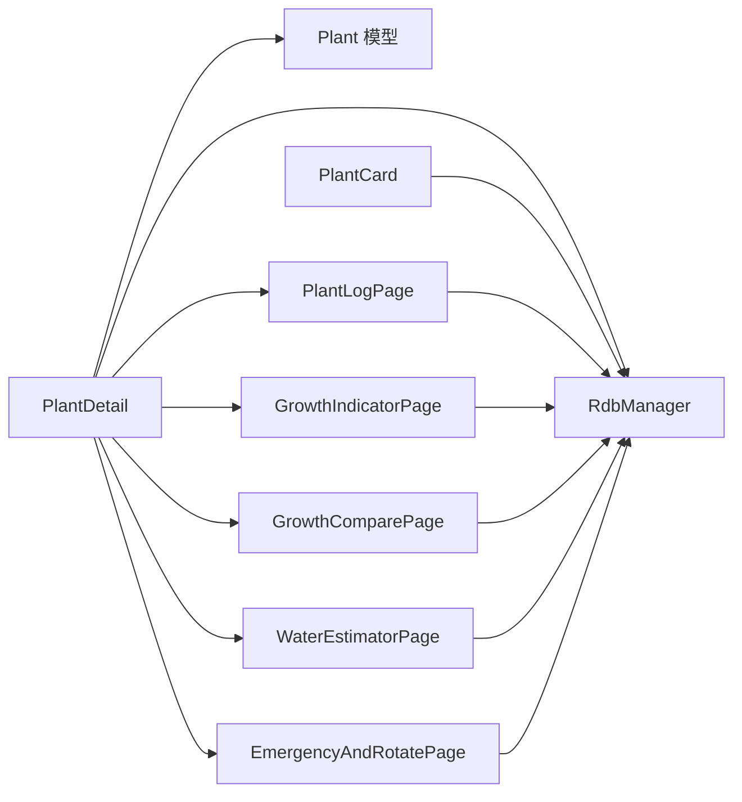

**图表来源**
- [PlantDetail.ets:1-136](file://entry/src/main/ets/pages/PlantDetail.ets#L1-L136)
- [PlantCard.ets:1-326](file://entry/src/main/ets/view/PlantCard.ets#L1-L326)
- [PlantLogPage.ets:1-800](file://entry/src/main/ets/pages/PlantLogPage.ets#L1-L800)
- [GrowthIndicatorPage.ets:1-605](file://entry/src/main/ets/pages/GrowthIndicatorPage.ets#L1-L605)
- [GrowthComparePage.ets:1-477](file://entry/src/main/ets/pages/GrowthComparePage.ets#L1-L477)
- [WaterEstimatorPage.ets:1-490](file://entry/src/main/ets/pages/WaterEstimatorPage.ets#L1-L490)
- [EmergencyAndRotatePage.ets:1-557](file://entry/src/main/ets/pages/EmergencyAndRotatePage.ets#L1-L557)

**章节来源**
- [RdbManager.ets:1-296](file://entry/src/main/ets/viewmodel/RdbManager.ets#L1-L296)

## 性能考虑
- 数据加载优化
  - PlantCard 在 aboutToAppear 中异步加载日志与照片，避免阻塞 UI。
  - PlantLogPage 与 GrowthComparePage 使用组合索引与按时间排序，提升查询效率。
- 动画与交互
  - 使用 animateTo 与 scale 控制按压反馈与呼吸动画，注意动画时长与曲线，避免过度消耗资源。
- 数据一致性
  - 日志删除采用事务删除记录与文件分离策略，降低失败风险。
- 界面响应性
  - 使用 AppStorage 动态适配安全区域，避免硬编码导致的布局问题。
  - 列表与图表切换时延迟构建图表数据，减少不必要的计算。

## 故障排除指南
- 日志删除失败
  - 现象：删除日志后提示“删除日志失败，已回滚”。
  - 处理：检查数据库事务是否正确提交，确认本地文件删除权限与路径有效性。
- 照片无法显示
  - 现象：图片预览黑屏或路径无效。
  - 处理：确认 ensureFileUri 与文件路径前缀，检查应用私有目录是否存在与可写。
- 补光状态不同步
  - 现象：首页卡片补光状态与详情页不一致。
  - 处理：检查 AppStorage 键值格式（lighting_{plantId}）与广播时机，确保卡片加载时能读取最新状态。
- 指标录入异常
  - 现象：健康分超出范围或为空。
  - 处理：clampScore 限制健康分范围，safeNum 处理非法输入，确保数值有效。

**章节来源**
- [PlantLogPage.ets:134-136](file://entry/src/main/ets/pages/PlantLogPage.ets#L134-L136)
- [PlantLogPage.ets:186-191](file://entry/src/main/ets/pages/PlantLogPage.ets#L186-L191)
- [PlantCard.ets:42-47](file://entry/src/main/ets/view/PlantCard.ets#L42-L47)
- [MetricSheet.ets:476-484](file://entry/src/main/ets/view/MetricSheet.ets#L476-L484)

## 结论
PlantDetail 通过清晰的页面-组件-模型-数据库分层，实现了植物信息的高效展示与多模块联动。其交互设计注重按压反馈与状态可视化，数据绑定机制确保信息实时更新。日志、指标、对比、估算、应急与转盆等模块在 PlantDetail 的引导下形成完整的植物养护闭环。建议持续优化数据加载与动画性能，强化错误处理与边界条件，进一步提升用户体验与界面响应性。