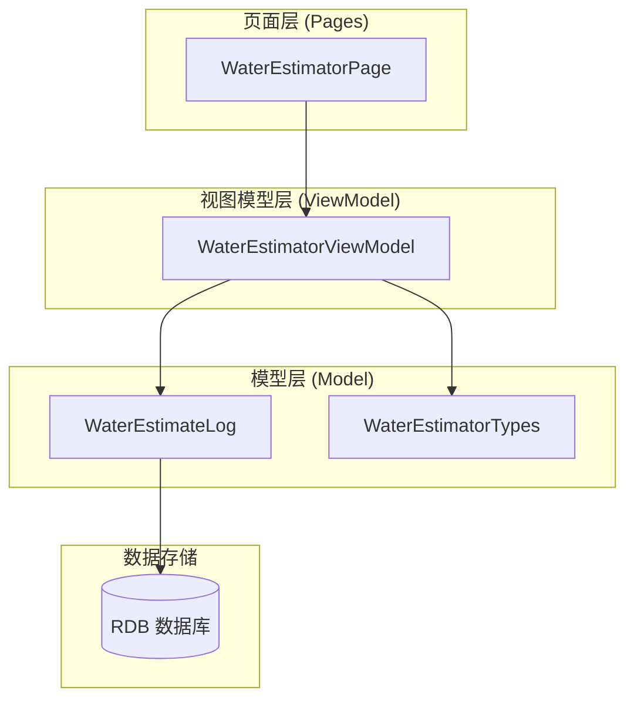
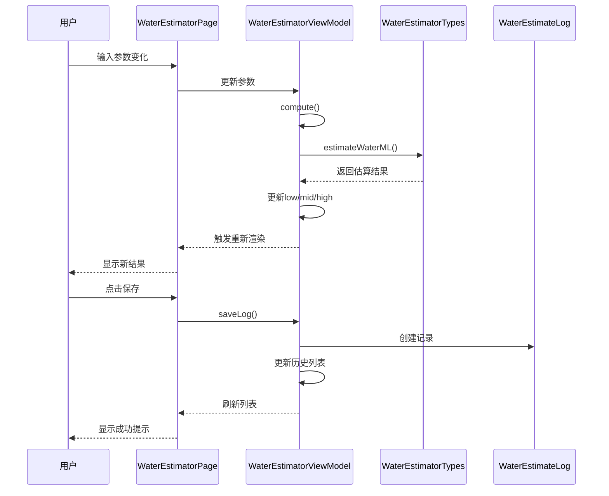
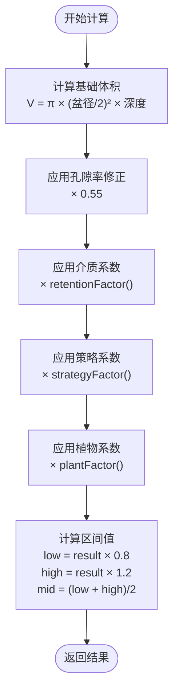
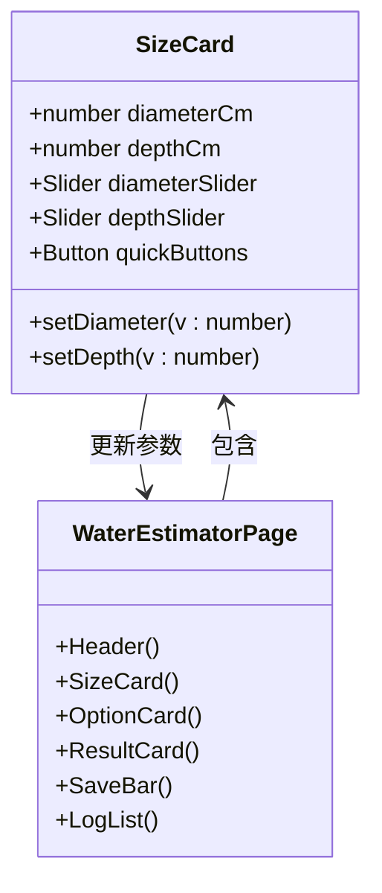
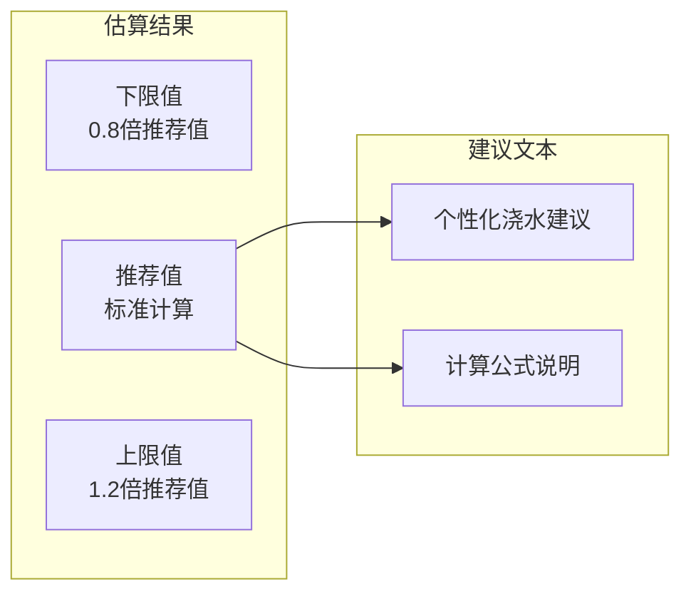
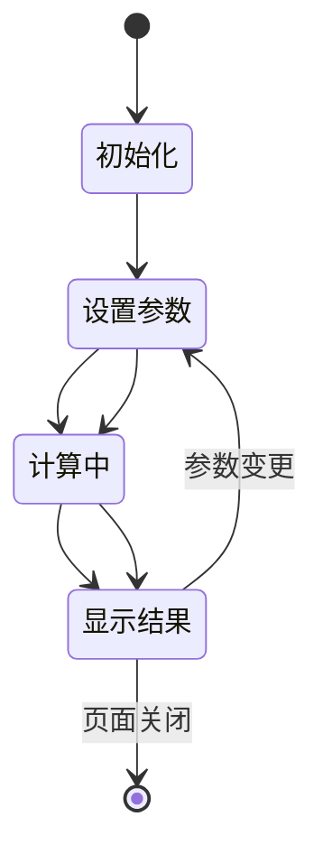
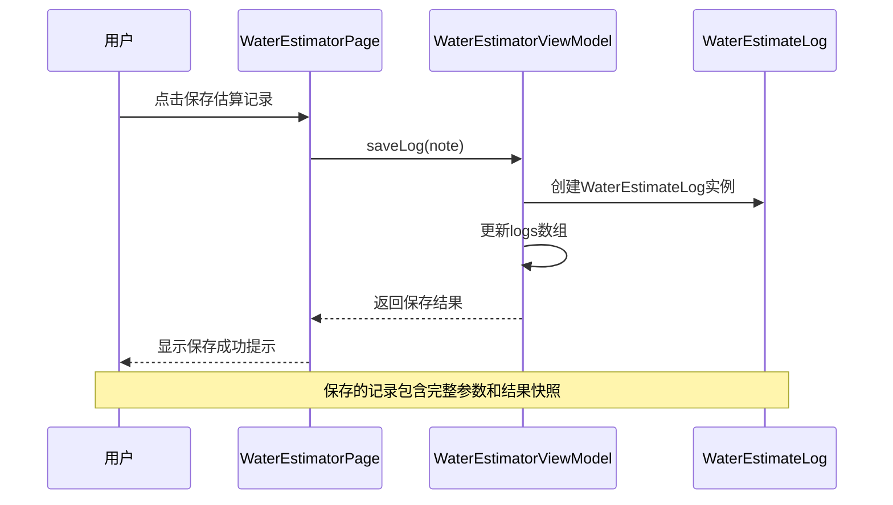
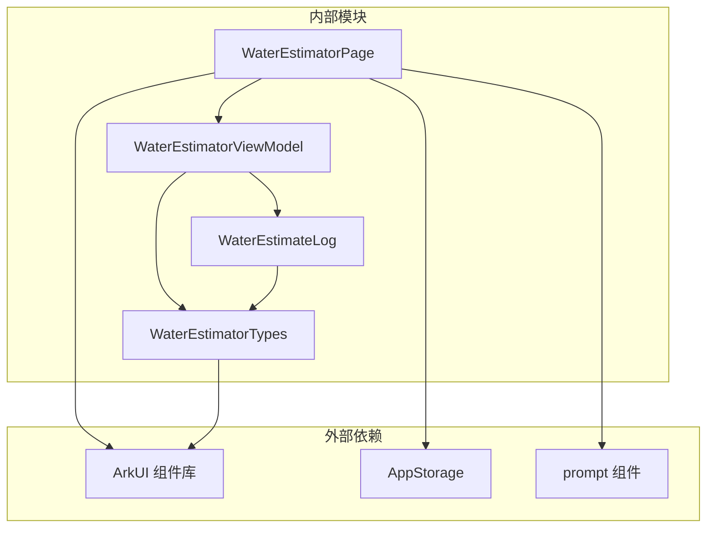

# 浇水估算页 WaterEstimatorPage

<cite>
**本文档引用的文件**
- [WaterEstimatorPage.ets](file://entry/src/main/ets/pages/WaterEstimatorPage.ets)
- [WaterEstimatorViewModel.ets](file://entry/src/main/ets/viewmodel/WaterEstimatorViewModel.ets)
- [WaterEstimateLog.ets](file://entry/src/main/ets/model/WaterEstimateLog.ets)
- [WaterEstimatorTypes.ets](file://entry/src/main/ets/model/WaterEstimatorTypes.ets)
</cite>

## 目录
1. [简介](#简介)
2. [项目结构](#项目结构)
3. [核心组件](#核心组件)
4. [架构概览](#架构概览)
5. [详细组件分析](#详细组件分析)
6. [依赖关系分析](#依赖关系分析)
7. [性能考虑](#性能考虑)
8. [故障排除指南](#故障排除指南)
9. [结论](#结论)
10. [附录](#附录)

## 简介

WaterEstimatorPage 是 PlantDiary 应用中的一个关键功能页面，专门用于基于植物特性进行水量估算。该页面采用 MVVM 架构模式，通过直观的用户界面让用户能够输入植物容器尺寸、介质类型、浇水策略和植物种类等参数，系统实时计算并显示水量估算结果。

该估算器的核心价值在于：
- 提供科学的水量计算算法，基于植物学原理和园艺实践
- 支持多种植物类型和环境条件的个性化推荐
- 实时结果显示，无需手动触发计算
- 完整的历史记录追踪和管理
- 用户友好的交互设计和视觉反馈

## 项目结构

WaterEstimatorPage 所属的模块结构遵循 ArkTS 的标准分层架构：

**图表来源**
- [WaterEstimatorPage.ets:24-54](file://entry/src/main/ets/pages/WaterEstimatorPage.ets#L24-L54)
- [WaterEstimatorViewModel.ets:16-37](file://entry/src/main/ets/viewmodel/WaterEstimatorViewModel.ets#L16-L37)

**章节来源**
- [WaterEstimatorPage.ets:1-490](file://entry/src/main/ets/pages/WaterEstimatorPage.ets#L1-L490)
- [WaterEstimatorViewModel.ets:1-130](file://entry/src/main/ets/viewmodel/WaterEstimatorViewModel.ets#L1-L130)

## 核心组件

### 页面组件 WaterEstimatorPage

WaterEstimatorPage 采用装饰器组件模式，实现了完整的 MVVM 架构。页面包含以下主要区域：

1. **头部区域**：显示页面标题和重置功能
2. **尺寸输入卡**：盆径和深度的滑块输入
3. **选项配置卡**：介质类型、浇水策略、植物类型的选择
4. **结果展示卡**：低、中、高三个估算值的可视化展示
5. **保存操作栏**：估算记录保存和直接记账功能
6. **历史记录列表**：所有估算记录的展示和管理

### 视图模型 WaterEstimatorViewModel

作为 MVVM 架构的核心，WaterEstimatorViewModel 负责：
- 管理所有输入参数的状态
- 执行水量估算计算
- 生成个性化的浇水建议
- 处理历史记录的保存和管理
- 提供标签化显示文本

### 数据模型 WaterEstimateLog

WaterEstimateLog 是估算记录的数据传输对象，包含：
- 基本参数：植物ID、盆径、深度、介质类型
- 计算结果：低、中、高三个估算值
- 时间戳和用户备注
- 创建时间自动记录

**章节来源**
- [WaterEstimatorPage.ets:9-89](file://entry/src/main/ets/pages/WaterEstimatorPage.ets#L9-L89)
- [WaterEstimatorViewModel.ents#L16-129:16-129](file://entry/src/main/ets/viewmodel/WaterEstimatorViewModel.ets#L16-L129)
- [WaterEstimateLog.ets:6-24](file://entry/src/main/ets/model/WaterEstimateLog.ets#L6-L24)

## 架构概览

WaterEstimatorPage 采用了清晰的三层架构设计：

**图表来源**
- [WaterEstimatorPage.ets:15-22](file://entry/src/main/ets/pages/WaterEstimatorPage.ets#L15-L22)
- [WaterEstimatorViewModel.ets:74-79](file://entry/src/main/ets/viewmodel/WaterEstimatorViewModel.ets#L74-L79)
- [WaterEstimatorViewModel.ets:105-123](file://entry/src/main/ets/viewmodel/WaterEstimatorViewModel.ets#L105-L123)

## 详细组件分析

### 水量估算算法实现

#### 核心计算函数

水量估算采用基于圆柱体体积的计算方法，并结合多个修正因子：

**图表来源**
- [WaterEstimatorViewModel.ets:74-79](file://entry/src/main/ets/viewmodel/WaterEstimatorViewModel.ets#L74-L79)
- [WaterEstimatorTypes.ets:163-170](file://entry/src/main/ets/model/WaterEstimatorTypes.ets#L163-L170)

#### 介质类型系数

不同的栽培介质对水分保持能力有显著影响：

| 介质类型 | 系数 | 特性描述 |
|---------|------|----------|
| 砂砾/透水 | 0.7 | 快速排水，防止积水 |
| 通用介质 | 1.0 | 平衡排水和保水性能 |
| 泥炭/保水 | 1.3 | 高保水性，需减少浇水量 |
| 兰花介质 | 1.1 | 专用配方，中等保水 |
| 椰糠 | 1.2 | 天然有机质，良好保水 |

#### 浇水策略系数

根据不同的浇水策略调整计算结果：

| 策略类型 | 系数 | 说明 |
|---------|------|------|
| 彻底浸润 | 1.0 | 标准计算，适用于大多数情况 |
| 日常保养 | 0.6 | 减少用量，避免过度浇水 |

#### 植物类型系数

不同植物的需水量差异很大：

| 植物类型 | 系数 | 特性 |
|---------|------|------|
| 多肉植物 | 0.6 | 低需水量，耐旱性强 |
| 观叶植物 | 1.0 | 中等需水量 |
| 开花植物 | 1.1 | 生长期需水量较高 |
| 兰花 | 0.9 | 专用介质，需水量适中 |
| 果类植物 | 1.2 | 生长旺盛，需水量大 |

**章节来源**
- [WaterEstimatorTypes.ets:44-84](file://entry/src/main/ets/model/WaterEstimatorTypes.ets#L44-L84)
- [WaterEstimatorTypes.ets:163-170](file://entry/src/main/ets/model/WaterEstimatorTypes.ets#L163-L170)

### 用户界面组件

#### 尺寸输入组件

页面提供了直观的滑块和快速按钮来调整盆器尺寸：

**图表来源**
- [WaterEstimatorPage.ets:92-167](file://entry/src/main/ets/pages/WaterEstimatorPage.ets#L92-L167)

#### 选项配置组件

三种核心参数的独立配置区域：

| 组件类型 | 参数选项 | 功能特点 |
|---------|---------|----------|
| 介质类型 | 砂砾、通用、泥炭、兰花、椰糠 | 五种不同保水性能 |
| 浇水策略 | 彻底浸润、日常保养 | 两种不同的浇水方式 |
| 植物类型 | 多肉、观叶、开花、兰花、果类 | 五种不同需水量 |

#### 结果展示组件

采用区间值展示而非单一数值，提供更安全的操作范围：

**图表来源**
- [WaterEstimatorPage.ets:307-342](file://entry/src/main/ets/pages/WaterEstimatorPage.ets#L307-L342)

**章节来源**
- [WaterEstimatorPage.ets:92-342](file://entry/src/main/ets/pages/WaterEstimatorPage.ets#L92-L342)

### 交互流程设计

#### 实时计算流程

页面采用响应式设计，参数变化时自动重新计算：

#### 保存流程

支持两种保存方式：估算记录保存和直接记账：

**图表来源**
- [WaterEstimatorPage.ets:380-413](file://entry/src/main/ets/pages/WaterEstimatorPage.ets#L380-L413)
- [WaterEstimatorViewModel.ets:105-123](file://entry/src/main/ets/viewmodel/WaterEstimatorViewModel.ets#L105-L123)

**章节来源**
- [WaterEstimatorPage.ets:380-413](file://entry/src/main/ets/pages/WaterEstimatorPage.ets#L380-L413)
- [WaterEstimatorViewModel.ets:105-123](file://entry/src/main/ets/viewmodel/WaterEstimatorViewModel.ets#L105-L123)

## 依赖关系分析

### 组件间依赖关系

**图表来源**
- [WaterEstimatorPage.ets:4-8](file://entry/src/main/ets/pages/WaterEstimatorPage.ets#L4-L8)
- [WaterEstimatorViewModel.ets:4-8](file://entry/src/main/ets/viewmodel/WaterEstimatorViewModel.ets#L4-L8)

### 数据流分析

估算器的数据流遵循单向数据绑定原则：

1. **输入阶段**：用户通过滑块和按钮修改参数
2. **计算阶段**：ViewModel 调用模型层的计算函数
3. **展示阶段**：页面自动更新显示新的估算结果
4. **持久化阶段**：用户可选择保存估算记录

**章节来源**
- [WaterEstimatorPage.ets:15-22](file://entry/src/main/ets/pages/WaterEstimatorPage.ets#L15-L22)
- [WaterEstimatorViewModel.ets:74-79](file://entry/src/main/ets/viewmodel/WaterEstimatorViewModel.ets#L74-L79)

## 性能考虑

### 计算性能优化

1. **实时计算优化**：使用装饰器组件的响应式更新机制，仅在参数变化时重新计算
2. **内存管理**：历史记录采用数组前插方式，保持最新记录在前
3. **UI 渲染优化**：使用局部状态更新，避免整个页面重绘

### 用户体验优化

1. **即时反馈**：参数调整后立即显示结果，提供流畅的交互体验
2. **默认值设置**：合理的默认参数值，降低用户学习成本
3. **重置功能**：一键重置到初始状态，便于重新开始

## 故障排除指南

### 常见问题及解决方案

#### 计算结果异常

**问题现象**：估算结果明显不合理
**可能原因**：
- 盆径或深度超出合理范围
- 介质类型选择不当
- 植物类型与实际不符

**解决步骤**：
1. 检查参数输入范围（盆径6-60cm，深度6-60cm）
2. 确认介质类型符合实际使用的栽培介质
3. 验证植物类型分类的准确性

#### 页面显示问题

**问题现象**：页面布局错乱或组件不显示
**解决方法**：
1. 检查设备兼容性
2. 重启应用
3. 清除应用缓存

#### 历史记录丢失

**问题现象**：保存的记录无法显示
**解决步骤**：
1. 检查网络连接状态
2. 重新启动应用
3. 联系技术支持

**章节来源**
- [WaterEstimatorPage.ets:426-441](file://entry/src/main/ets/pages/WaterEstimatorPage.ets#L426-L441)

## 结论

WaterEstimatorPage 通过精心设计的 MVVM 架构和科学的水量估算算法，为用户提供了准确、便捷的浇水指导服务。其核心优势包括：

1. **算法科学性**：基于植物学原理和园艺实践经验
2. **界面友好性**：直观的参数输入和结果展示
3. **个性化程度**：针对不同植物类型提供差异化建议
4. **实用性**：支持历史记录追踪和用户反馈收集

该估算器不仅提高了用户的园艺技能水平，也为 PlantDiary 应用的整体功能完善做出了重要贡献。

## 附录

### 使用建议

1. **参数准确性**：尽量使用精确测量的盆器尺寸
2. **介质确认**：确保介质类型与实际使用一致
3. **定期校准**：根据实际浇水效果调整使用习惯
4. **记录管理**：充分利用历史记录功能进行经验总结

### 技术扩展方向

1. **机器学习集成**：基于用户历史数据提供更精准的预测
2. **环境传感器集成**：结合土壤湿度等环境数据
3. **个性化推荐**：根据用户经验和植物状态动态调整建议
4. **社区分享**：允许用户分享成功的浇水经验