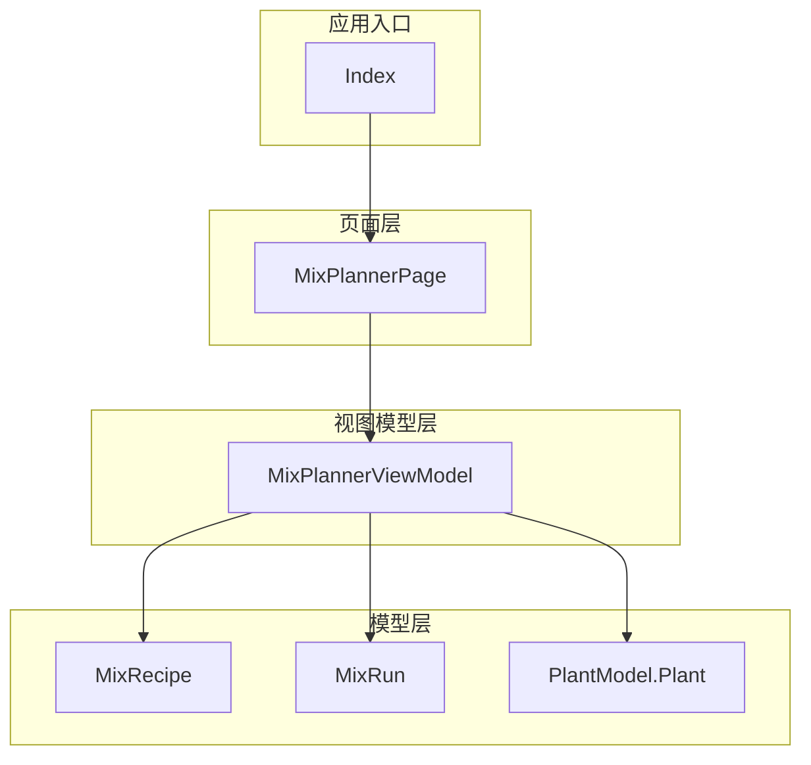
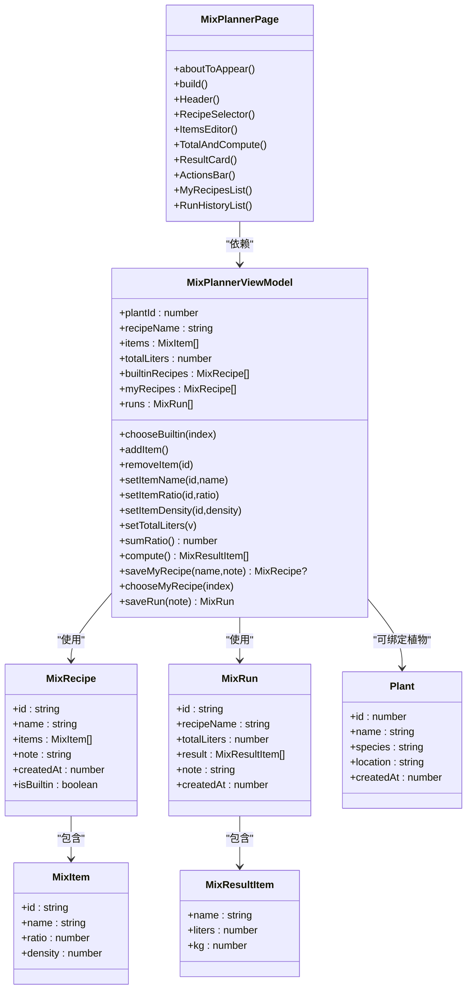
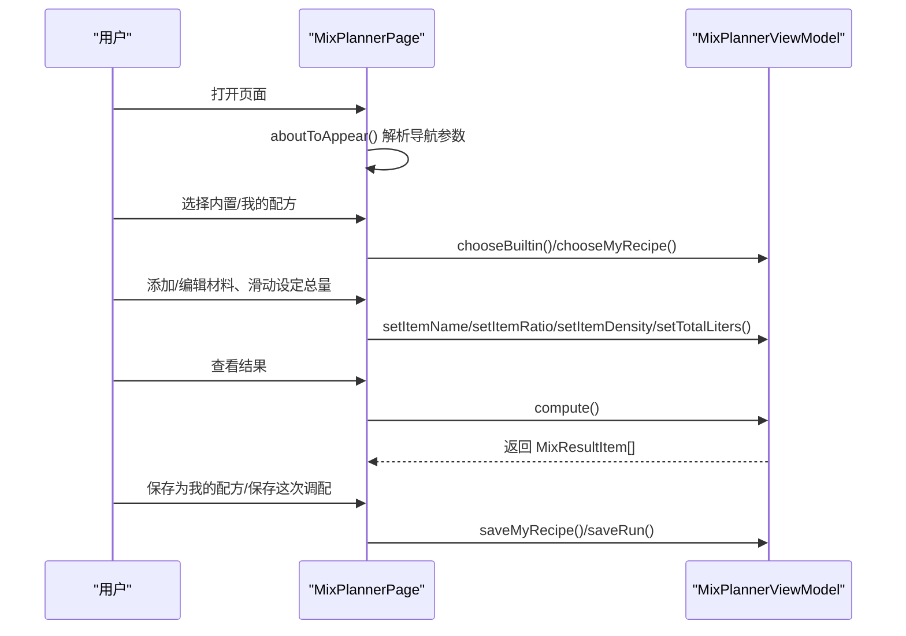
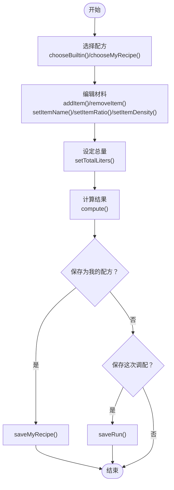
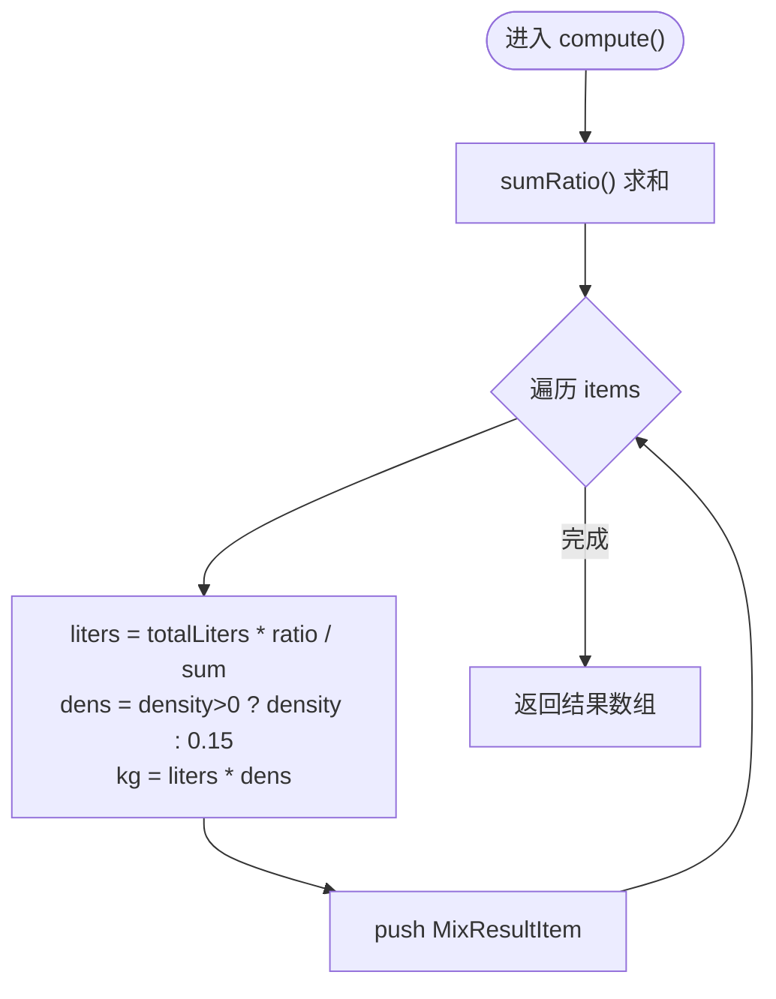
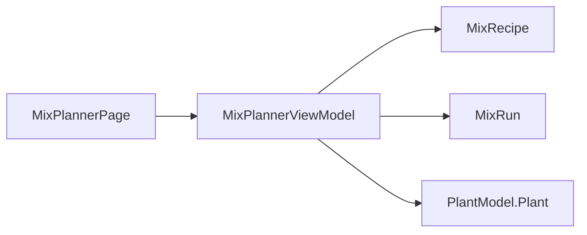

# 混合计划页 MixPlannerPage

<cite>
**本文引用的文件**
- [MixPlannerPage.ets](file://entry/src/main/ets/pages/MixPlannerPage.ets)
- [MixPlannerViewModel.ets](file://entry/src/main/ets/viewmodel/MixPlannerViewModel.ets)
- [MixRecipe.ets](file://entry/src/main/ets/model/MixRecipe.ets)
- [MixRun.ets](file://entry/src/main/ets/model/MixRun.ets)
- [PlantModel.ets](file://entry/src/main/ets/model/PlantModel.ets)
- [Index.ets](file://entry/src/main/ets/pages/Index.ets)
- [WaterEstimatorViewModel.ets](file://entry/src/main/ets/viewmodel/WaterEstimatorViewModel.ets)
- [GrowthCompareViewModel.ets](file://entry/src/main/ets/viewmodel/GrowthCompareViewModel.ets)
- [RotatePlanViewModel.ets](file://entry/src/main/ets/viewmodel/RotatePlanViewModel.ets)
- [RotatePlan.ets](file://entry/src/main/ets/model/RotatePlan.ets)
</cite>

## 目录
1. [简介](#简介)
2. [项目结构](#项目结构)
3. [核心组件](#核心组件)
4. [架构总览](#架构总览)
5. [详细组件分析](#详细组件分析)
6. [依赖分析](#依赖分析)
7. [性能考虑](#性能考虑)
8. [故障排查指南](#故障排查指南)
9. [结论](#结论)
10. [附录](#附录)

## 简介
本文件围绕混合计划页 MixPlannerPage 的设计与实现，系统梳理其在植物混合种植规划中的功能定位与技术实现。该页面支持“内置配方 → 自定义编辑 → 设定总量 → 实时计算 → 保存模板/记录”的完整工作流，强调配方的可复用性与单次操作的可追溯性。同时，页面遵循组件化与 MVVM 架构原则：UI 使用构建器函数组织，交互事件委托给 ViewModel，导航通过参数传递植物上下文，确保状态清晰、职责分离。

## 项目结构
- 页面层：MixPlannerPage 负责 UI 布局与交互，采用 @Builder 组织各功能区块，避免在 UI 中声明本地状态。
- 视图模型层：MixPlannerViewModel 提供配方选择、材料编辑、总量设定、实时计算、模板保存与记录保存等能力。
- 模型层：MixRecipe/MixRun 定义配方与调配记录的数据结构；PlantModel 提供植物实体以支持“绑定植物”场景。
- 应用入口：Index 页面作为应用中枢，承载数据库初始化与全局状态管理，MixPlannerPage 通过导航参数接收植物上下文。

**图表来源**
- [MixPlannerPage.ets:39-90](file://entry/src/main/ets/pages/MixPlannerPage.ets#L39-L90)
- [MixPlannerViewModel.ets:18-39](file://entry/src/main/ets/viewmodel/MixPlannerViewModel.ets#L18-L39)
- [MixRecipe.ets:18-32](file://entry/src/main/ets/model/MixRecipe.ets#L18-L32)
- [MixRun.ets:16-30](file://entry/src/main/ets/model/MixRun.ets#L16-L30)
- [PlantModel.ets:6-21](file://entry/src/main/ets/model/PlantModel.ets#L6-L21)
- [Index.ets:32-32](file://entry/src/main/ets/pages/Index.ets#L32-L32)

**章节来源**
- [MixPlannerPage.ets:39-90](file://entry/src/main/ets/pages/MixPlannerPage.ets#L39-L90)
- [Index.ets:32-32](file://entry/src/main/ets/pages/Index.ets#L32-L32)

## 核心组件
- MixPlannerPage：页面主体，包含头部、配方选择器、材料编辑器、总量与计算、结果展示、操作栏、我的配方列表与调配记录列表等模块。
- MixPlannerViewModel：配方工作流的核心，负责内置配方加载、自定义配方编辑、总量与密度约束、实时计算、模板保存与记录保存。
- MixRecipe/MixRun：配方与记录的数据模型，支持配方条目 MixItem 与计算结果 MixResultItem。
- PlantModel.Plant：植物实体，支持 MixPlannerPage 在“绑定植物”场景下的上下文传递。

**章节来源**
- [MixPlannerPage.ets:108-364](file://entry/src/main/ets/pages/MixPlannerPage.ets#L108-L364)
- [MixPlannerViewModel.ets:18-227](file://entry/src/main/ets/viewmodel/MixPlannerViewModel.ets#L18-L227)
- [MixRecipe.ets:4-32](file://entry/src/main/ets/model/MixRecipe.ets#L4-L32)
- [MixRun.ets:4-30](file://entry/src/main/ets/model/MixRun.ets#L4-L30)
- [PlantModel.ets:6-21](file://entry/src/main/ets/model/PlantModel.ets#L6-L21)

## 架构总览
MixPlannerPage 采用“页面-视图模型-模型”的分层架构：
- 页面层：通过 @Builder 组织 UI，事件回调统一委托给 ViewModel。
- 视图模型层：集中处理业务逻辑，包括配方选择、编辑、计算与持久化。
- 模型层：定义配方、记录与植物等数据结构，支持后续持久化扩展。

**图表来源**
- [MixPlannerPage.ets:39-90](file://entry/src/main/ets/pages/MixPlannerPage.ets#L39-L90)
- [MixPlannerViewModel.ets:18-227](file://entry/src/main/ets/viewmodel/MixPlannerViewModel.ets#L18-L227)
- [MixRecipe.ets:4-32](file://entry/src/main/ets/model/MixRecipe.ets#L4-L32)
- [MixRun.ets:4-30](file://entry/src/main/ets/model/MixRun.ets#L4-L30)
- [PlantModel.ets:6-21](file://entry/src/main/ets/model/PlantModel.ets#L6-L21)

## 详细组件分析

### 页面结构与工作流
- 页面按典型工作流组织：选择配方 → 调整材料 → 设定总量 → 查看结果 → 保存模板/记录。
- 导航通过参数传递 Plant 上下文，支持“绑定植物”或“独立使用”。

**图表来源**
- [MixPlannerPage.ets:53-90](file://entry/src/main/ets/pages/MixPlannerPage.ets#L53-L90)
- [MixPlannerViewModel.ets:81-226](file://entry/src/main/ets/viewmodel/MixPlannerViewModel.ets#L81-L226)

**章节来源**
- [MixPlannerPage.ets:53-90](file://entry/src/main/ets/pages/MixPlannerPage.ets#L53-L90)
- [MixPlannerViewModel.ets:35-77](file://entry/src/main/ets/viewmodel/MixPlannerViewModel.ets#L35-L77)

### 配方选择与编辑
- 内置配方：预置多肉、观叶、兰科等常用配方，选择后深拷贝条目，避免污染编辑态。
- 我的配方：保存为可复用模板，选择后同样深拷贝条目。
- 材料编辑：支持增删改名称、配比与密度，滑动调节配比与总量，密度为 0 时按默认 0.15kg/L 估算重量。

**图表来源**
- [MixPlannerViewModel.ets:81-226](file://entry/src/main/ets/viewmodel/MixPlannerViewModel.ets#L81-L226)

**章节来源**
- [MixPlannerViewModel.ets:81-226](file://entry/src/main/ets/viewmodel/MixPlannerViewModel.ets#L81-L226)

### 计算逻辑与数据结构
- 计算流程：按配比权重将总体积分摊到各材料，再按密度估算重量；密度为 0 时使用默认密度。
- 数据结构：MixItem/MixResultItem 支持名称、配比、密度、体积与重量；MixRecipe/MixRun 支持模板与记录快照。

**图表来源**
- [MixPlannerViewModel.ets:169-181](file://entry/src/main/ets/viewmodel/MixPlannerViewModel.ets#L169-L181)
- [MixRun.ets:4-14](file://entry/src/main/ets/model/MixRun.ets#L4-L14)

**章节来源**
- [MixPlannerViewModel.ets:161-181](file://entry/src/main/ets/viewmodel/MixPlannerViewModel.ets#L161-L181)
- [MixRun.ets:4-14](file://entry/src/main/ets/model/MixRun.ets#L4-L14)

### 可视化与交互细节
- 头部显示当前植物 ID 与页面标题，便于绑定植物场景识别。
- 配方选择器支持内置/我的配方切换，自定义入口便于直接编辑。
- 材料行包含名称、配比与密度输入，密度提供常见值快捷选择。
- 结果卡实时展示体积与重量，密度为 0 时提示默认密度。
- 操作栏提供“保存为我的配方”与“保存这次调配”，记录摘要展示前两项结果。

**章节来源**
- [MixPlannerPage.ets:93-364](file://entry/src/main/ets/pages/MixPlannerPage.ets#L93-L364)

### 与其他页面与视图模型的关系
- Index 页面负责应用初始化与全局状态，MixPlannerPage 通过导航参数接收 Plant 上下文。
- 与水肥估算、生长对比、转盆计划等页面共享数据库与全局状态，形成统一的数据与业务生态。

**章节来源**
- [Index.ets:116-135](file://entry/src/main/ets/pages/Index.ets#L116-L135)
- [WaterEstimatorViewModel.ets:16-79](file://entry/src/main/ets/viewmodel/WaterEstimatorViewModel.ets#L16-L79)
- [GrowthCompareViewModel.ets:12-31](file://entry/src/main/ets/viewmodel/GrowthCompareViewModel.ets#L12-L31)
- [RotatePlanViewModel.ets:18-31](file://entry/src/main/ets/viewmodel/RotatePlanViewModel.ets#L18-L31)

## 依赖分析
- MixPlannerPage 依赖 MixPlannerViewModel 提供的可观察状态与方法。
- MixPlannerViewModel 依赖 MixRecipe/MixRun 模型，内部维护内置配方与用户配方列表、历史记录。
- PlantModel.Plant 用于绑定植物上下文，支持页面在导航参数中接收 Plant 实例。

**图表来源**
- [MixPlannerPage.ets:39-42](file://entry/src/main/ets/pages/MixPlannerPage.ets#L39-L42)
- [MixPlannerViewModel.ets:4-6](file://entry/src/main/ets/viewmodel/MixPlannerViewModel.ets#L4-L6)
- [PlantModel.ets:6-21](file://entry/src/main/ets/model/PlantModel.ets#L6-L21)

**章节来源**
- [MixPlannerPage.ets:39-42](file://entry/src/main/ets/pages/MixPlannerPage.ets#L39-L42)
- [MixPlannerViewModel.ets:4-6](file://entry/src/main/ets/viewmodel/MixPlannerViewModel.ets#L4-L6)

## 性能考虑
- 计算复杂度：compute() 遍历 items 数组，时间复杂度 O(n)，空间复杂度 O(n)，适合小到中等规模配方。
- 约束与容错：对配比、密度、总量设置边界，避免无效输入引发异常；密度为 0 时使用默认密度，减少额外判断。
- 观测与渲染：ViewModel 使用可观察标记，UI 通过 @Builder 组织，避免在 UI 中缓存临时状态，保证渲染一致性与响应性。

[本节为通用指导，无需列出具体文件来源]

## 故障排查指南
- 保存失败：检查配方名称是否为空；保存模板时名称必填。
- 计算异常：确认配比之和大于 0；密度超出合理范围会被截断；总量小于 1 会被修正为 1。
- 导航参数：确认导航参数中包含 Plant 实例，以便页面正确绑定植物上下文。

**章节来源**
- [MixPlannerViewModel.ets:185-200](file://entry/src/main/ets/viewmodel/MixPlannerViewModel.ets#L185-L200)
- [MixPlannerViewModel.ets:154-159](file://entry/src/main/ets/viewmodel/MixPlannerViewModel.ets#L154-L159)
- [MixPlannerPage.ets:86-89](file://entry/src/main/ets/pages/MixPlannerPage.ets#L86-L89)

## 结论
MixPlannerPage 通过清晰的工作流与严谨的 MVVM 设计，实现了植物混合种植配方的快速制定、实时计算与可追溯管理。其内置配方与模板化保存机制降低了使用门槛，而密度与总量的灵活配置满足了多样化的介质需求。结合应用入口的全局状态与数据库，页面可自然融入更广泛的植物养护体系。

[本节为总结性内容，无需列出具体文件来源]

## 附录

### 植物兼容性分析与生长周期协调（概念性说明）
- 兼容性分析：可通过扩展模型层增加植物属性与兼容矩阵，配合 ViewModel 在计算前进行兼容性校验与提示。
- 生长周期协调：结合现有任务模板与周期任务生成机制，可在配方基础上附加阶段性养护建议，形成“配方+周期任务”的协同规划。
- 资源分配：在计算体积与重量的基础上，结合水肥估算与光照模拟，动态调整配方比例以平衡营养与通透性。

[本节为概念性内容，无需列出具体文件来源]

### 计划可视化与进度跟踪（概念性说明）
- 可视化：在现有结果卡基础上，可引入柱状图或饼图展示体积/重量占比，增强直观性。
- 进度跟踪：将“保存这次调配”记录与任务系统联动，生成对应养护提醒，形成从配方到执行的闭环。

[本节为概念性内容，无需列出具体文件来源]

### 混合种植效益评估与风险控制（概念性说明）
- 效益评估：以生长指标与对比图为基础，评估不同配方对植物健康的影响，形成配方效果反馈。
- 风险控制：对密度异常、总量过小、配比失衡等情况给出警告；提供默认安全阈值与回退策略。

[本节为概念性内容，无需列出具体文件来源]