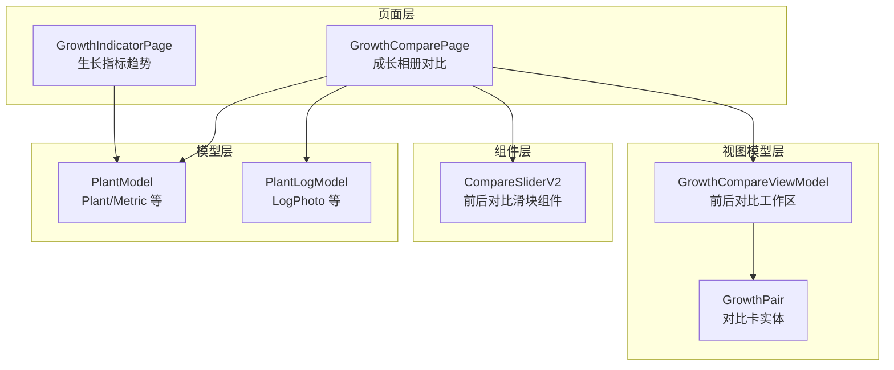
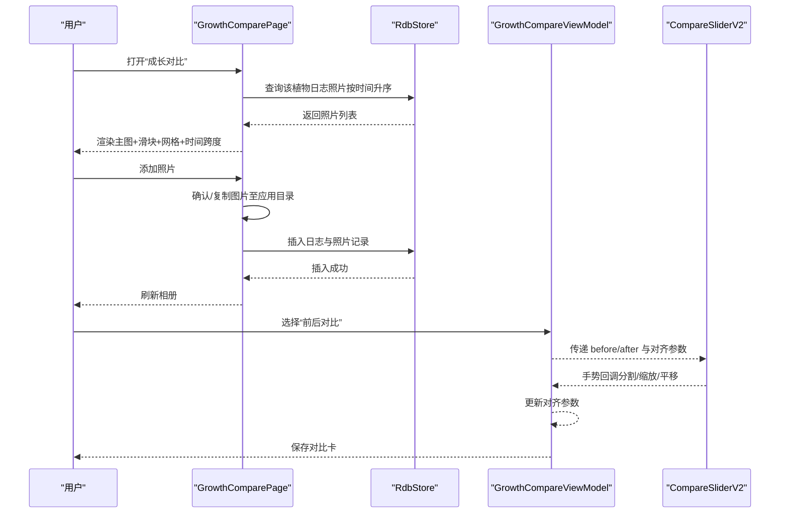
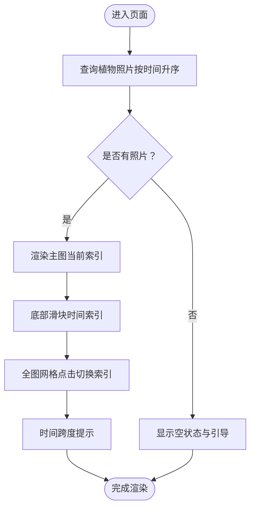
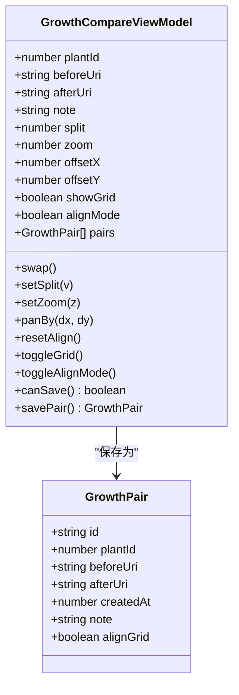
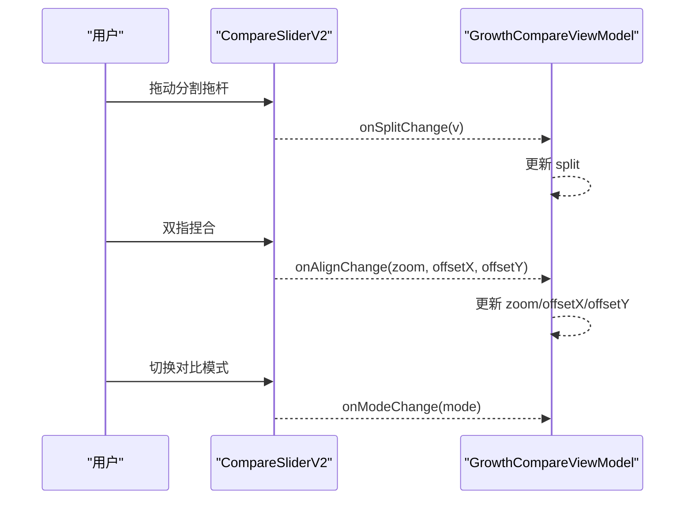
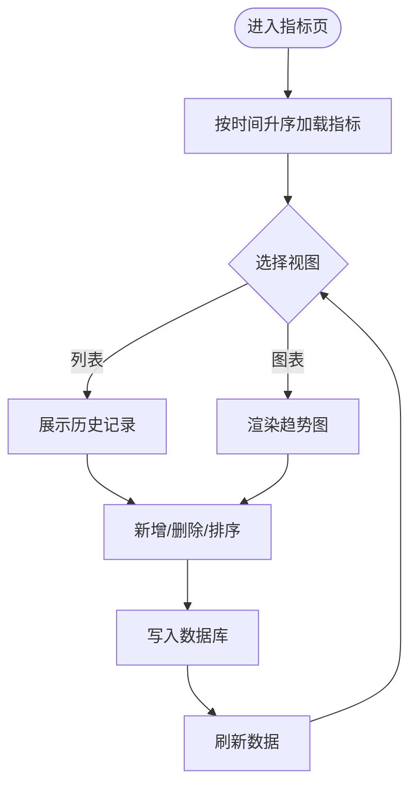
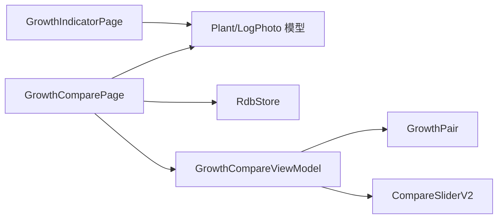

# 生长对比页 GrowthComparePage

<cite>
**本文引用的文件**
- [GrowthComparePage.ets](file://entry/src/main/ets/pages/GrowthComparePage.ets)
- [GrowthCompareViewModel.ets](file://entry/src/main/ets/viewmodel/GrowthCompareViewModel.ets)
- [GrowthPair.ets](file://entry/src/main/ets/model/GrowthPair.ets)
- [CompareSliderV2.ets](file://entry/src/main/ets/pages/CompareSliderV2.ets)
- [GrowthIndicatorPage.ets](file://entry/src/main/ets/pages/GrowthIndicatorPage.ets)
- [PlantModel.ets](file://entry/src/main/ets/model/PlantModel.ets)
- [PlantLogModel.ets](file://entry/src/main/ets/model/PlantLogModel.ets)
</cite>

## 目录
1. [简介](#简介)
2. [项目结构](#项目结构)
3. [核心组件](#核心组件)
4. [架构总览](#架构总览)
5. [详细组件分析](#详细组件分析)
6. [依赖分析](#依赖分析)
7. [性能考虑](#性能考虑)
8. [故障排查指南](#故障排查指南)
9. [结论](#结论)
10. [附录](#附录)

## 简介
本文件围绕“生长对比页 GrowthComparePage”进行系统化技术文档整理，目标包括：
- 解释植物生长指标对比分析功能与可视化展示
- 深入说明多植物数据的并行比较逻辑与图表渲染机制
- 阐述生长趋势对比、指标变化分析与统计差异计算的实现思路
- 覆盖对比维度选择、时间范围调整与结果导出的可用能力与扩展点
- 解释数据准确性验证与图表交互优化的技术细节
- 提供对比分析功能的使用指南与最佳实践建议

说明：当前仓库中“生长对比页”主要聚焦于“成长相册式”的时间序列照片对比与浏览，而非直接的指标数值对比。因此本文将结合现有代码梳理其“照片对比”能力，并补充“指标对比”相关页面（生长指标 GrowthIndicatorPage）与“前后对比组件 CompareSliderV2”的协同关系，帮助读者理解整体对比分析体系。

## 项目结构
GrowthComparePage 位于页面层，配合视图模型与组件共同完成“照片对比”体验；同时与“生长指标页”形成互补，分别覆盖“直观对比”和“量化趋势”。

**图表来源**
- [GrowthComparePage.ets:1-477](file://entry/src/main/ets/pages/GrowthComparePage.ets#L1-L477)
- [GrowthCompareViewModel.ets:1-109](file://entry/src/main/ets/viewmodel/GrowthCompareViewModel.ets#L1-L109)
- [GrowthPair.ets:1-22](file://entry/src/main/ets/model/GrowthPair.ets#L1-L22)
- [CompareSliderV2.ets:1-448](file://entry/src/main/ets/pages/CompareSliderV2.ets#L1-L448)
- [GrowthIndicatorPage.ets:1-605](file://entry/src/main/ets/pages/GrowthIndicatorPage.ets#L1-L605)
- [PlantModel.ets:1-166](file://entry/src/main/ets/model/PlantModel.ets#L1-L166)
- [PlantLogModel.ets:1-58](file://entry/src/main/ets/model/PlantLogModel.ets#L1-L58)

**章节来源**
- [GrowthComparePage.ets:1-477](file://entry/src/main/ets/pages/GrowthComparePage.ets#L1-L477)
- [GrowthCompareViewModel.ets:1-109](file://entry/src/main/ets/viewmodel/GrowthCompareViewModel.ets#L1-L109)
- [GrowthPair.ets:1-22](file://entry/src/main/ets/model/GrowthPair.ets#L1-L22)
- [CompareSliderV2.ets:1-448](file://entry/src/main/ets/pages/CompareSliderV2.ets#L1-L448)
- [GrowthIndicatorPage.ets:1-605](file://entry/src/main/ets/pages/GrowthIndicatorPage.ets#L1-L605)
- [PlantModel.ets:1-166](file://entry/src/main/ets/model/PlantModel.ets#L1-L166)
- [PlantLogModel.ets:1-58](file://entry/src/main/ets/model/PlantLogModel.ets#L1-L58)

## 核心组件
- 成长相册对比页（GrowthComparePage）
  - 职责：加载某植物的时间序列照片，提供主图浏览、底部滑块切换、全图网格与时间跨度提示，支持添加照片并自动关联日志。
  - 关键点：基于日志照片表聚合，按创建时间升序排列；滑块用于在时间线上快速定位；主图区域支持标签遮罩展示日期。
- 前后对比视图模型（GrowthCompareViewModel）
  - 职责：维护“前图/后图”工作区、对齐参数（分割比例、缩放、平移）、网格开关与对齐模式；提供保存对比卡的能力。
  - 关键点：对齐参数仅作用于“后图”，支持交换前后图、重置对齐、保存为对比卡。
- 对比卡实体（GrowthPair）
  - 职责：内存态的对比卡，保存图片关系、备注与对齐网格标记。
- 前后对比滑块组件（CompareSliderV2）
  - 职责：提供分割/滑动/淡入淡出三种对比模式；支持长按预览前图、手势拖动/双指缩放、网格叠加；通过回调驱动父级对齐参数。
  - 关键点：分割模式下提供中央拖杆；滑动/淡入淡出模式下通过手势实时更新分割比例或透明度。
- 生长指标页（GrowthIndicatorPage）
  - 职责：展示植物的健康度、身高、冠幅趋势，支持列表/图表切换、排序、新增与删除指标记录。
  - 关键点：图表基于第三方图表库渲染，按时间升序组织数据；提供“图表/列表”切换入口。

**章节来源**
- [GrowthComparePage.ets:24-374](file://entry/src/main/ets/pages/GrowthComparePage.ets#L24-L374)
- [GrowthCompareViewModel.ets:12-109](file://entry/src/main/ets/viewmodel/GrowthCompareViewModel.ets#L12-L109)
- [GrowthPair.ets:4-22](file://entry/src/main/ets/model/GrowthPair.ets#L4-L22)
- [CompareSliderV2.ets:50-448](file://entry/src/main/ets/pages/CompareSliderV2.ets#L50-L448)
- [GrowthIndicatorPage.ets:6-101](file://entry/src/main/ets/pages/GrowthIndicatorPage.ets#L6-L101)

## 架构总览
GrowthComparePage 作为入口页面，负责组织“成长相册”视图与交互；当需要进行“前后对比”时，可结合 GrowthCompareViewModel 与 CompareSliderV2 实现精细对齐与保存。同时，GrowthIndicatorPage 提供“指标趋势”的对比视角，二者互补。

**图表来源**
- [GrowthComparePage.ets:354-475](file://entry/src/main/ets/pages/GrowthComparePage.ets#L354-L475)
- [GrowthCompareViewModel.ets:33-107](file://entry/src/main/ets/viewmodel/GrowthCompareViewModel.ets#L33-L107)
- [CompareSliderV2.ets:70-211](file://entry/src/main/ets/pages/CompareSliderV2.ets#L70-L211)

## 详细组件分析

### 成长相册对比页 GrowthComparePage
- 视图结构
  - 顶部标题与植物名称
  - 添加照片按钮
  - 主图区域：堆叠多张照片，仅显示当前索引照片，带标签遮罩
  - 底部滑块：按时间顺序选择照片
  - 全部照片网格：点击切换当前索引
  - 时间跨度提示：显示起止日期
- 数据加载与存储
  - 通过 RDB 查询日志照片，按创建时间升序
  - 新增照片时，若无对应日志则自动创建占位日志，确保照片归属
- 交互与优化
  - 滑块步进与边界约束
  - 主图切换带缓动动画
  - 网格阴影与圆角提升可读性
- 可扩展点
  - 导出：当前未见导出功能，可在保存对比卡后扩展导出为图片/PDF
  - 统计差异：当前未见指标统计，可在指标页基础上扩展“前后差值/趋势对比”

**图表来源**
- [GrowthComparePage.ets:98-341](file://entry/src/main/ets/pages/GrowthComparePage.ets#L98-L341)

**章节来源**
- [GrowthComparePage.ets:24-374](file://entry/src/main/ets/pages/GrowthComparePage.ets#L24-L374)

### 前后对比视图模型 GrowthCompareViewModel 与对比卡 GrowthPair
- 视图模型职责
  - 维护 before/after URI、note、分割比例、缩放、平移、网格开关、对齐模式
  - 提供交换前后图、重置对齐、保存对比卡等操作
  - 保存时仅固化图片关系与备注，不持久化对齐参数
- 对比卡实体
  - 内存态对比卡，包含创建时间、备注与对齐网格标记
- 交互与约束
  - 分割比例限制在 0.02~0.98
  - 缩放在 0.5~4.0
  - 平移限制在 ±600（避免过度偏移）

**图表来源**
- [GrowthCompareViewModel.ets:12-109](file://entry/src/main/ets/viewmodel/GrowthCompareViewModel.ets#L12-L109)
- [GrowthPair.ets:4-22](file://entry/src/main/ets/model/GrowthPair.ets#L4-L22)

**章节来源**
- [GrowthCompareViewModel.ets:12-109](file://entry/src/main/ets/viewmodel/GrowthCompareViewModel.ets#L12-L109)
- [GrowthPair.ets:4-22](file://entry/src/main/ets/model/GrowthPair.ets#L4-L22)

### 前后对比滑块组件 CompareSliderV2
- 模式
  - 分割模式：中央拖杆调节分割比例，支持长按预览前图
  - 滑动模式：水平滑动切换前后图
  - 淡入淡出模式：水平滑动调节透明度
- 手势
  - 单指拖动：对齐模式下平移后图；非对齐模式下不消费
  - 双指缩放：按比例更新缩放与轻微平移
  - 长按：预览仅前图
- 网格叠加
  - 可选显示九宫格辅助对齐
- 与父级通信
  - 通过回调通知分割比例与对齐参数变化，父级驱动视图模型更新

**图表来源**
- [CompareSliderV2.ets:70-211](file://entry/src/main/ets/pages/CompareSliderV2.ets#L70-L211)
- [GrowthCompareViewModel.ets:48-87](file://entry/src/main/ets/viewmodel/GrowthCompareViewModel.ets#L48-L87)

**章节来源**
- [CompareSliderV2.ets:50-448](file://entry/src/main/ets/pages/CompareSliderV2.ets#L50-L448)

### 生长指标页 GrowthIndicatorPage（指标对比参考）
- 功能要点
  - 列表/图表切换：列表展示历史记录，图表展示趋势
  - 指标维度：健康度、身高、冠幅
  - 排序：支持按时间升序/降序
  - 新增/删除：输入校验与裁剪，插入数据库
- 与对比分析的关系
  - 作为“量化指标对比”的参考实现，可与“成长相册”结合：先看趋势，再看实拍对比

**图表来源**
- [GrowthIndicatorPage.ets:401-455](file://entry/src/main/ets/pages/GrowthIndicatorPage.ets#L401-L455)

**章节来源**
- [GrowthIndicatorPage.ets:6-101](file://entry/src/main/ets/pages/GrowthIndicatorPage.ets#L6-L101)

## 依赖分析
- 页面与模型
  - GrowthComparePage 依赖 Plant 与 LogPhoto 模型，以及 RdbStore 进行查询与插入
- 页面与视图模型
  - GrowthComparePage 通过 AddImageFileViewModel 与文件系统交互，间接依赖 RdbStore
  - GrowthCompareViewModel 管理对比工作区状态，与 CompareSliderV2 通过回调解耦
- 组件与视图模型
  - CompareSliderV2 仅消费参数与回调，不直接访问数据库，降低耦合

**图表来源**
- [GrowthComparePage.ets:1-20](file://entry/src/main/ets/pages/GrowthComparePage.ets#L1-L20)
- [GrowthCompareViewModel.ets:1-10](file://entry/src/main/ets/viewmodel/GrowthCompareViewModel.ets#L1-L10)
- [CompareSliderV2.ets:50-74](file://entry/src/main/ets/pages/CompareSliderV2.ets#L50-L74)
- [GrowthIndicatorPage.ets:1-6](file://entry/src/main/ets/pages/GrowthIndicatorPage.ets#L1-L6)

**章节来源**
- [GrowthComparePage.ets:1-20](file://entry/src/main/ets/pages/GrowthComparePage.ets#L1-L20)
- [GrowthCompareViewModel.ets:1-10](file://entry/src/main/ets/viewmodel/GrowthCompareViewModel.ets#L1-L10)
- [CompareSliderV2.ets:50-74](file://entry/src/main/ets/pages/CompareSliderV2.ets#L50-L74)
- [GrowthIndicatorPage.ets:1-6](file://entry/src/main/ets/pages/GrowthIndicatorPage.ets#L1-L6)

## 性能考虑
- 渲染优化
  - 主图采用堆叠层仅显示当前索引，减少不必要的重绘
  - 滑块步进与边界约束避免无效渲染
- 数据访问
  - 查询按时间升序，避免重复排序
  - 插入新照片时批量处理，减少多次事务
- 图像处理
  - 仅在需要时加载原图，缩略图路径可复用
- 手势与动画
  - 对齐参数更新采用节流策略（组件内部通过回调驱动），避免高频重绘

[本节为通用性能建议，无需特定文件引用]

## 故障排查指南
- 照片无法显示
  - 检查 RDB 查询是否返回数据，确认植物 ID 正确
  - 确认照片路径存在且可访问
- 添加照片失败
  - 检查应用文件目录权限与磁盘空间
  - 确认日志插入成功后再插入照片
- 对齐参数异常
  - 分割比例与缩放在组件内有限制，检查父级是否正确接收回调
  - 平移超出范围会被限制，确认是否需要重置对齐
- 图表渲染问题（指标页）
  - 确认图表选项初始化与数据绑定正确
  - 切换视图时注意只在图表模式重建选项

**章节来源**
- [GrowthComparePage.ets:354-475](file://entry/src/main/ets/pages/GrowthComparePage.ets#L354-L475)
- [GrowthCompareViewModel.ets:48-87](file://entry/src/main/ets/viewmodel/GrowthCompareViewModel.ets#L48-L87)
- [GrowthIndicatorPage.ets:457-467](file://entry/src/main/ets/pages/GrowthIndicatorPage.ets#L457-L467)

## 结论
- GrowthComparePage 提供了以“时间序列照片”为核心的直观对比体验，适合观察植物阶段性变化
- GrowthCompareViewModel 与 CompareSliderV2 形成“前后对比”的工作流，支持精细化对齐与保存
- GrowthIndicatorPage 提供“量化指标”的趋势对比，可与“成长相册”互补
- 当前版本未包含“指标统计差异计算”与“结果导出”功能，可在现有架构上扩展

[本节为总结性内容，无需特定文件引用]

## 附录

### 使用指南与最佳实践
- 使用指南
  - 打开“成长对比”，浏览时间线上的照片
  - 使用底部滑块快速定位到某个阶段
  - 点击“全部照片”网格中的缩略图进行切换
  - 如需前后对比，使用“前后对比”入口，设置分割比例、缩放与平移，保存对比卡
- 最佳实践
  - 照片命名与拍摄时间尽量规范，保证时间线连续
  - 对齐模式下优先使用单指拖动进行微调，双指捏合进行缩放
  - 保存对比卡前先预览效果，必要时重置对齐
  - 指标页与相册页结合使用：先看趋势，再看实拍

[本节为通用指导，无需特定文件引用]