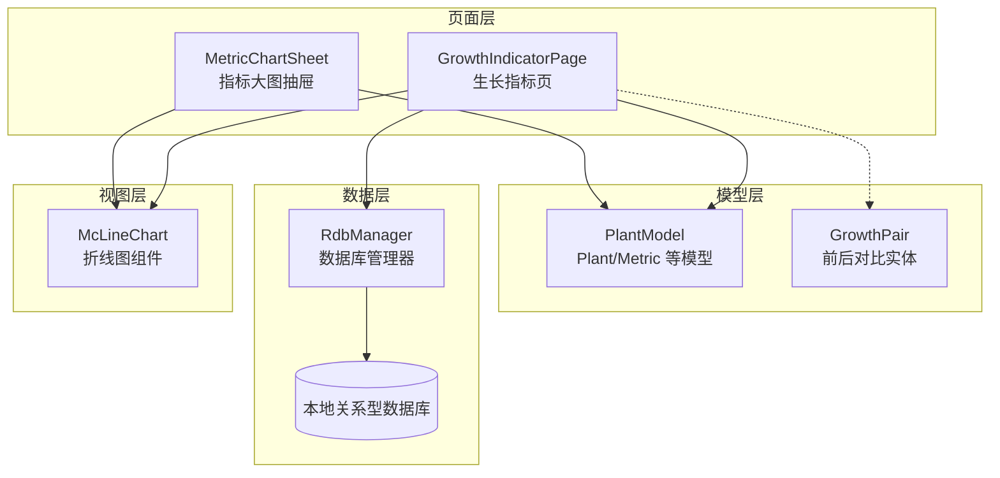
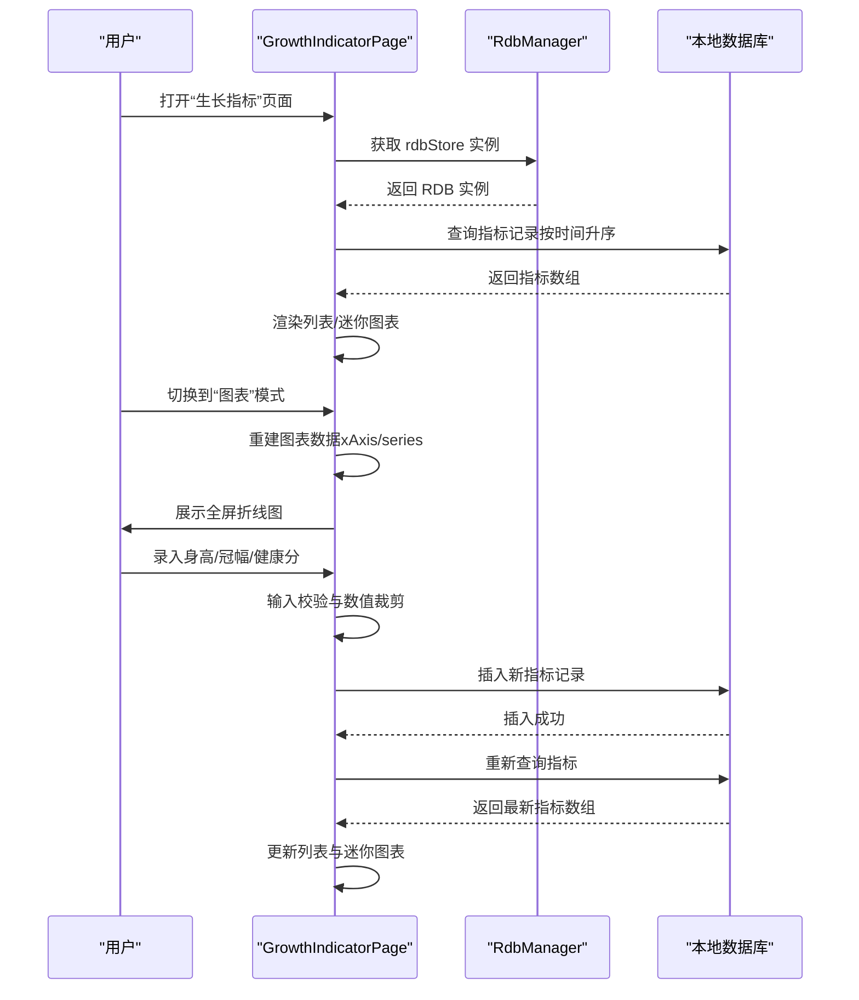
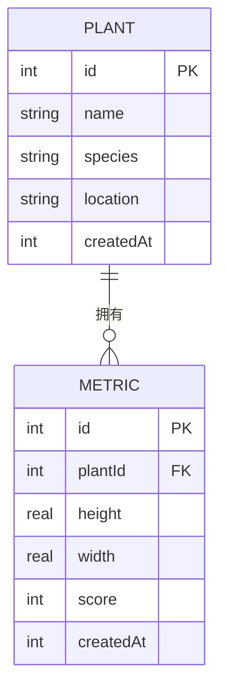
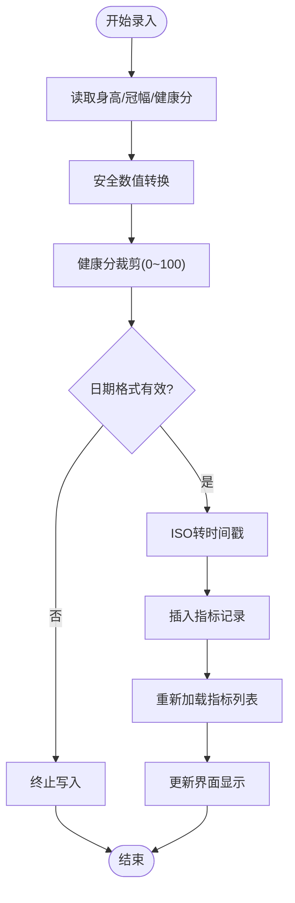
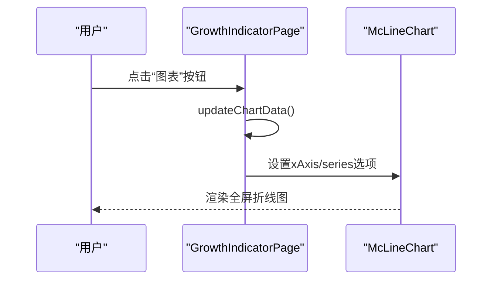
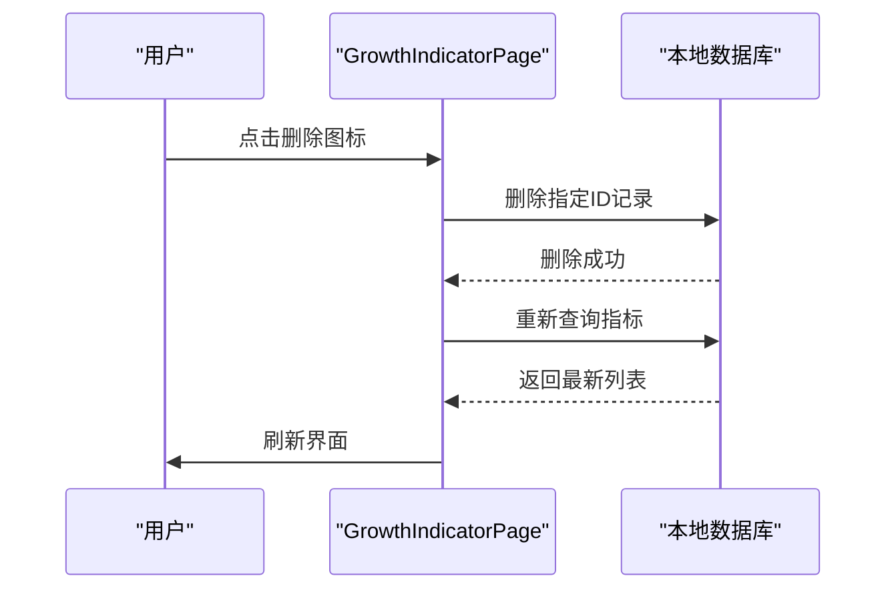
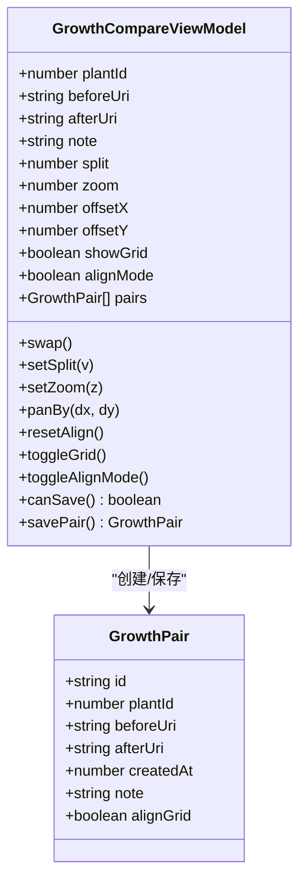
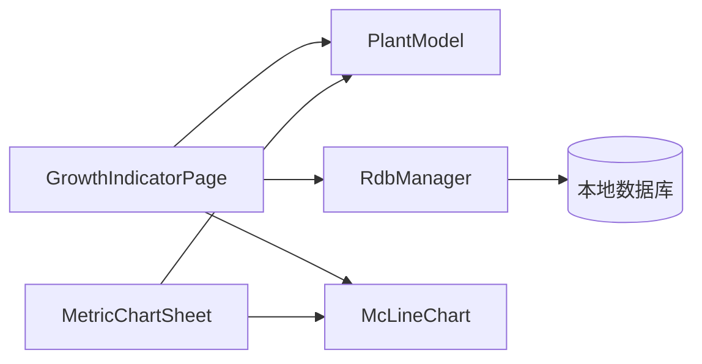

# 生长指标页 GrowthIndicatorPage

<cite>
**本文档引用的文件**
- [GrowthIndicatorPage.ets](file://entry/src/main/ets/pages/GrowthIndicatorPage.ets)
- [PlantModel.ets](file://entry/src/main/ets/model/PlantModel.ets)
- [RdbManager.ets](file://entry/src/main/ets/viewmodel/RdbManager.ets)
- [MetricChartSheet.ets](file://entry/src/main/ets/view/MetricChartSheet.ets)
- [GrowthCompareViewModel.ets](file://entry/src/main/ets/viewmodel/GrowthCompareViewModel.ets)
- [GrowthPair.ets](file://entry/src/main/ets/model/GrowthPair.ets)
</cite>

## 目录
1. [简介](#简介)
2. [项目结构](#项目结构)
3. [核心组件](#核心组件)
4. [架构总览](#架构总览)
5. [详细组件分析](#详细组件分析)
6. [依赖分析](#依赖分析)
7. [性能考虑](#性能考虑)
8. [故障排查指南](#故障排查指南)
9. [结论](#结论)
10. [附录](#附录)

## 简介
本文件围绕生长指标页 GrowthIndicatorPage 的设计与实现进行全面技术解析，涵盖指标定义、数据采集与处理、趋势展示、历史对比、图表交互、异常处理与性能优化等方面。该页面支持身高、冠幅、健康评分三项指标的录入、展示与趋势分析，并提供图表与列表双模式切换、时间排序控制、以及与数据库的完整读写闭环。

## 项目结构
生长指标页位于应用入口的页面目录中，采用自包含的页面结构，直接复用全局 RDB 存储实例，避免引入额外的 ViewModel，降低耦合并提升开发效率。页面与模型、数据库管理器、图表组件协同工作，形成清晰的职责边界。

**图表来源**
- [GrowthIndicatorPage.ets:1-605](file://entry/src/main/ets/pages/GrowthIndicatorPage.ets#L1-L605)
- [PlantModel.ets:109-147](file://entry/src/main/ets/model/PlantModel.ets#L109-L147)
- [RdbManager.ets:4-296](file://entry/src/main/ets/viewmodel/RdbManager.ets#L4-L296)
- [MetricChartSheet.ets:1-181](file://entry/src/main/ets/view/MetricChartSheet.ets#L1-L181)
- [GrowthPair.ets:1-22](file://entry/src/main/ets/model/GrowthPair.ets#L1-L22)

**章节来源**
- [GrowthIndicatorPage.ets:62-101](file://entry/src/main/ets/pages/GrowthIndicatorPage.ets#L62-L101)
- [RdbManager.ets:27-170](file://entry/src/main/ets/viewmodel/RdbManager.ets#L27-L170)

## 核心组件
- 页面主体：GrowthIndicatorPage 提供指标录入、列表展示、迷你图表、全屏图表、时间排序与切换等功能。
- 数据模型：PlantModel 定义了 Plant 与 Metric 等核心数据结构，支撑指标的存储与展示。
- 数据库管理：RdbManager 负责数据库初始化、表结构与索引创建、默认数据注入及查询接口。
- 图表组件：McLineChart 与 MetricChartSheet 提供趋势图的可视化能力。
- 对比模型：GrowthPair 与 GrowthCompareViewModel 支持前后对比卡片的生成与对齐参数管理。

**章节来源**
- [GrowthIndicatorPage.ets:7-18](file://entry/src/main/ets/pages/GrowthIndicatorPage.ets#L7-L18)
- [PlantModel.ets:109-147](file://entry/src/main/ets/model/PlantModel.ets#L109-L147)
- [RdbManager.ets:105-170](file://entry/src/main/ets/viewmodel/RdbManager.ets#L105-L170)
- [MetricChartSheet.ets:5-53](file://entry/src/main/ets/view/MetricChartSheet.ets#L5-L53)
- [GrowthPair.ets:4-21](file://entry/src/main/ets/model/GrowthPair.ets#L4-L21)

## 架构总览
页面通过 RdbManager 获取全局 RDB 实例，使用 SQL 查询植物的所有指标记录，按时间升序排列，用于图表的直接展示。新增指标时进行输入校验与数值裁剪，统一写入 metric 表。图表数据仅在切换至全屏图表模式时重建，避免列表模式下的频繁更新，提升性能。

**图表来源**
- [GrowthIndicatorPage.ets:401-420](file://entry/src/main/ets/pages/GrowthIndicatorPage.ets#L401-L420)
- [GrowthIndicatorPage.ets:423-445](file://entry/src/main/ets/pages/GrowthIndicatorPage.ets#L423-L445)
- [GrowthIndicatorPage.ets:458-467](file://entry/src/main/ets/pages/GrowthIndicatorPage.ets#L458-L467)
- [RdbManager.ets:27-170](file://entry/src/main/ets/viewmodel/RdbManager.ets#L27-L170)

## 详细组件分析

### 指标数据模型与表结构
- 指标模型：Metric 包含身高、冠幅、健康分与创建时间戳，字段类型与约束由数据库表定义保证。
- 表结构：metric 表包含主键、植物标识、身高（REAL）、冠幅（REAL）、健康分（INTEGER，默认0）、创建时间（INTEGER），并建立复合索引以支持按植物与时间的高效查询。

**图表来源**
- [PlantModel.ets:109-125](file://entry/src/main/ets/model/PlantModel.ets#L109-L125)
- [RdbManager.ets:71-78](file://entry/src/main/ets/viewmodel/RdbManager.ets#L71-L78)
- [RdbManager.ets:166-169](file://entry/src/main/ets/viewmodel/RdbManager.ets#L166-L169)

**章节来源**
- [PlantModel.ets:109-125](file://entry/src/main/ets/model/PlantModel.ets#L109-L125)
- [RdbManager.ets:71-78](file://entry/src/main/ets/viewmodel/RdbManager.ets#L71-L78)
- [RdbManager.ets:166-169](file://entry/src/main/ets/viewmodel/RdbManager.ets#L166-L169)

### 指标录入与数据处理
- 输入校验：身高、冠幅、健康分均通过安全数值转换，非法输入归零；健康分进行范围裁剪（0~100）。
- 时间处理：支持 ISO 日期格式（YYYY-MM-DD），转换为时间戳写入数据库。
- 写入策略：统一使用 ValuesBucket 将指标写入 metric 表，确保字段一致性与类型正确性。

**图表来源**
- [GrowthIndicatorPage.ets:423-445](file://entry/src/main/ets/pages/GrowthIndicatorPage.ets#L423-L445)
- [GrowthIndicatorPage.ets:552-580](file://entry/src/main/ets/pages/GrowthIndicatorPage.ets#L552-L580)

**章节来源**
- [GrowthIndicatorPage.ets:423-445](file://entry/src/main/ets/pages/GrowthIndicatorPage.ets#L423-L445)
- [GrowthIndicatorPage.ets:552-580](file://entry/src/main/ets/pages/GrowthIndicatorPage.ets#L552-L580)

### 趋势展示与图表构建
- 列表模式：展示迷你柱状图趋势，按最大值归一化高度，颜色随指标类型变化；支持升/降序切换。
- 全屏模式：使用 McLineChart 组件展示折线趋势，x 轴标签基于创建时间生成，系列包含身高、冠幅、健康度三条曲线。
- 性能优化：图表数据仅在切换到全屏图表时重建，避免列表模式下的频繁更新。

**图表来源**
- [GrowthIndicatorPage.ets:119-124](file://entry/src/main/ets/pages/GrowthIndicatorPage.ets#L119-L124)
- [GrowthIndicatorPage.ets:458-467](file://entry/src/main/ets/pages/GrowthIndicatorPage.ets#L458-L467)
- [GrowthIndicatorPage.ets:388-392](file://entry/src/main/ets/pages/GrowthIndicatorPage.ets#L388-L392)

**章节来源**
- [GrowthIndicatorPage.ets:119-124](file://entry/src/main/ets/pages/GrowthIndicatorPage.ets#L119-L124)
- [GrowthIndicatorPage.ets:458-467](file://entry/src/main/ets/pages/GrowthIndicatorPage.ets#L458-L467)
- [GrowthIndicatorPage.ets:388-392](file://entry/src/main/ets/pages/GrowthIndicatorPage.ets#L388-L392)

### 历史记录与删除
- 历史记录：按时间升序加载，支持升/降序切换；列表项包含日期与三项指标值，支持删除单条记录。
- 删除流程：根据指标 ID 构造查询条件，执行删除操作后重新加载数据。

**图表来源**
- [GrowthIndicatorPage.ets:447-455](file://entry/src/main/ets/pages/GrowthIndicatorPage.ets#L447-L455)
- [GrowthIndicatorPage.ets:401-420](file://entry/src/main/ets/pages/GrowthIndicatorPage.ets#L401-L420)

**章节来源**
- [GrowthIndicatorPage.ets:447-455](file://entry/src/main/ets/pages/GrowthIndicatorPage.ets#L447-L455)
- [GrowthIndicatorPage.ets:401-420](file://entry/src/main/ets/pages/GrowthIndicatorPage.ets#L401-L420)

### 前后对比与扩展
- 对比卡片：GrowthPair 用于保存前后对比的图片与备注，支持网格显示与对齐参数（缩放、偏移、分割）。
- 对齐参数：GrowthCompareViewModel 提供缩放范围限制、平移范围限制、对齐模式切换与保存功能，便于微调与导出。

**图表来源**
- [GrowthPair.ets:4-21](file://entry/src/main/ets/model/GrowthPair.ets#L4-L21)
- [GrowthCompareViewModel.ets:12-109](file://entry/src/main/ets/viewmodel/GrowthCompareViewModel.ets#L12-L109)

**章节来源**
- [GrowthPair.ets:4-21](file://entry/src/main/ets/model/GrowthPair.ets#L4-L21)
- [GrowthCompareViewModel.ets:12-109](file://entry/src/main/ets/viewmodel/GrowthCompareViewModel.ets#L12-L109)

## 依赖分析
- 页面依赖：GrowthIndicatorPage 直接依赖 PlantModel（数据结构）、RdbManager（数据库访问）、McLineChart（图表渲染）。
- 数据依赖：指标表的复合索引支持按植物与时间的高效查询，减少排序与过滤成本。
- 组件耦合：页面与图表组件解耦，图表数据通过 Options 注入，便于独立测试与替换。

**图表来源**
- [GrowthIndicatorPage.ets:1-4](file://entry/src/main/ets/pages/GrowthIndicatorPage.ets#L1-L4)
- [RdbManager.ets:27-170](file://entry/src/main/ets/viewmodel/RdbManager.ets#L27-L170)
- [MetricChartSheet.ets:1-2](file://entry/src/main/ets/view/MetricChartSheet.ets#L1-L2)

**章节来源**
- [GrowthIndicatorPage.ets:1-4](file://entry/src/main/ets/pages/GrowthIndicatorPage.ets#L1-L4)
- [RdbManager.ets:27-170](file://entry/src/main/ets/viewmodel/RdbManager.ets#L27-L170)
- [MetricChartSheet.ets:1-2](file://entry/src/main/ets/view/MetricChartSheet.ets#L1-L2)

## 性能考虑
- 查询优化：按植物与时间升序查询，避免在客户端进行大规模排序；索引 idx_metric_plant_created 提升查询效率。
- 图表更新：仅在切换到全屏图表时重建 Options，减少列表模式下的频繁更新与重绘。
- 数值处理：安全数值转换与裁剪在前端完成，避免无效数据进入数据库，减少后续清洗成本。
- UI渲染：迷你图表使用归一化高度与固定容器尺寸，降低复杂布局计算。

**章节来源**
- [RdbManager.ets:166-169](file://entry/src/main/ets/viewmodel/RdbManager.ets#L166-L169)
- [GrowthIndicatorPage.ets:458-467](file://entry/src/main/ets/pages/GrowthIndicatorPage.ets#L458-L467)
- [GrowthIndicatorPage.ets:512-520](file://entry/src/main/ets/pages/GrowthIndicatorPage.ets#L512-L520)

## 故障排查指南
- 无法显示图表：检查是否已切换到“图表”模式，确认 updateChartData 是否被调用；验证 Options 的 xAxis 与 series 是否正确设置。
- 新增指标失败：确认日期格式为 YYYY-MM-DD，健康分在 0~100 范围内；检查 RDB 实例是否可用。
- 历史记录不刷新：确认删除或新增后是否调用 loadMetrics 重新查询；检查数据库写入是否成功。
- 性能问题：避免在列表模式下频繁切换图表数据；确保索引存在且未被破坏。

**章节来源**
- [GrowthIndicatorPage.ets:119-124](file://entry/src/main/ets/pages/GrowthIndicatorPage.ets#L119-L124)
- [GrowthIndicatorPage.ets:423-445](file://entry/src/main/ets/pages/GrowthIndicatorPage.ets#L423-L445)
- [GrowthIndicatorPage.ets:447-455](file://entry/src/main/ets/pages/GrowthIndicatorPage.ets#L447-L455)
- [RdbManager.ets:166-169](file://entry/src/main/ets/viewmodel/RdbManager.ets#L166-L169)

## 结论
GrowthIndicatorPage 通过简洁的页面结构与明确的数据流，实现了生长指标的高效录入、展示与趋势分析。结合数据库索引与图表懒更新策略，系统在功能完整性与性能表现之间取得良好平衡。前后对比模块为后续扩展提供了清晰路径，便于进一步完善个性化标准与预警机制。

## 附录
- 指标定义与单位：身高（厘米）、冠幅（厘米）、健康分（0~100）。
- 数据采集建议：建议每日固定时间点采集，保证趋势连续性；健康分建议结合观察与经验综合评估。
- 个性化标准：可通过扩展页面或 ViewModel 引入权重与阈值配置，实现差异化预警与建议。
- 预测模型：可在现有指标基础上引入滑动平均、线性回归等简单算法，作为趋势预测的起点。
- 异常检测：基于历史统计（均值±标准差）或滑动窗口异常检测，实现低门槛的异常告警。