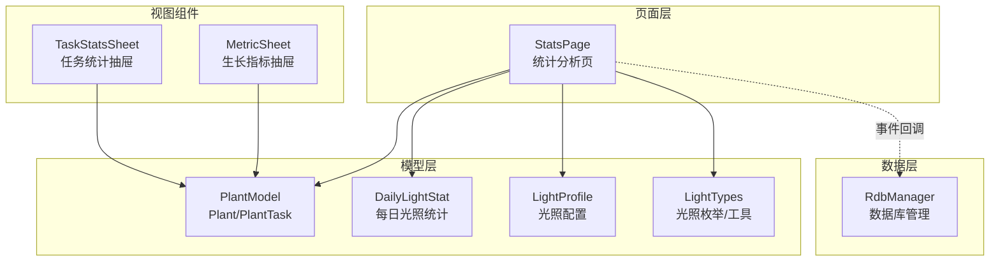
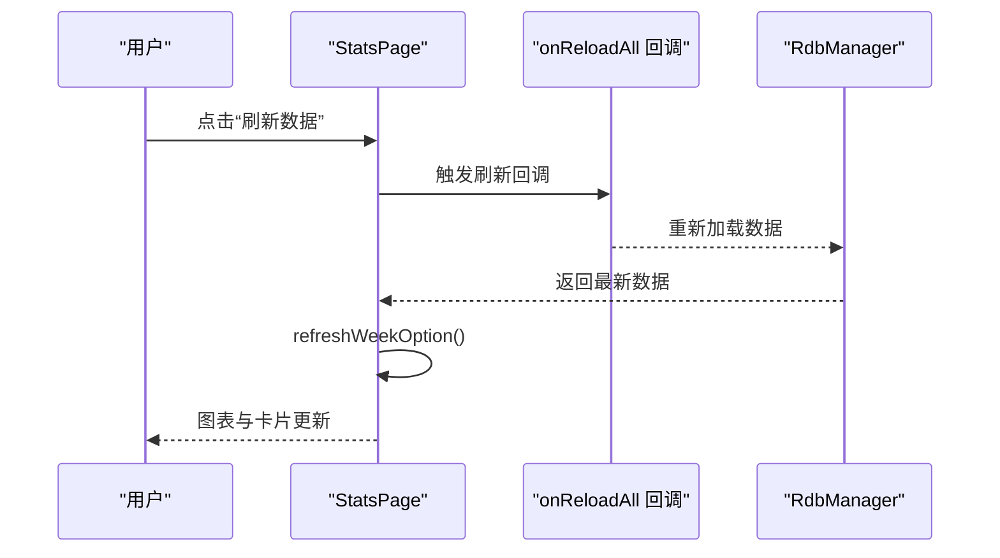
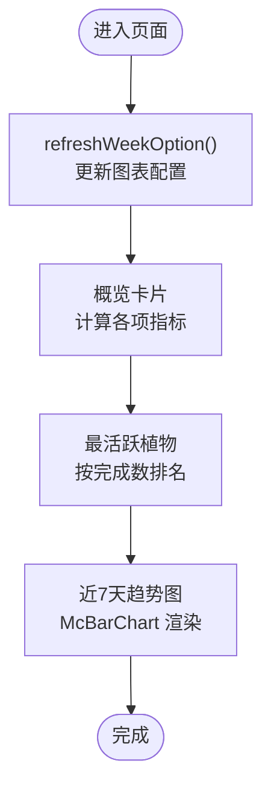
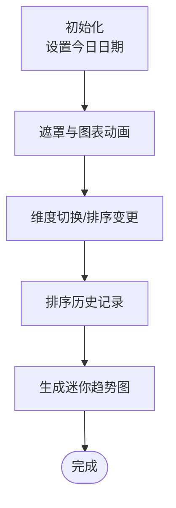
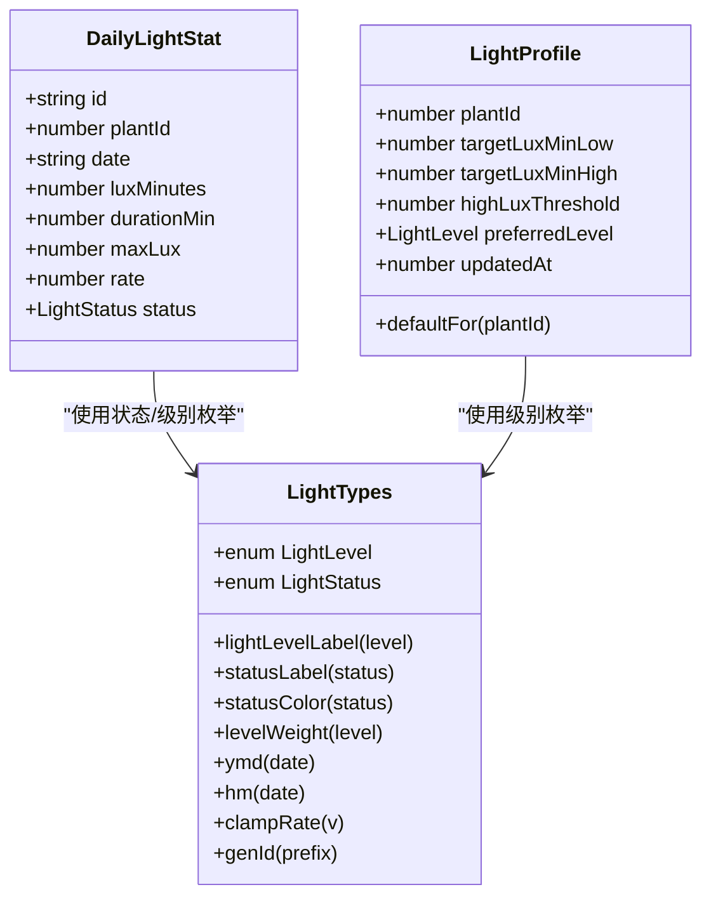
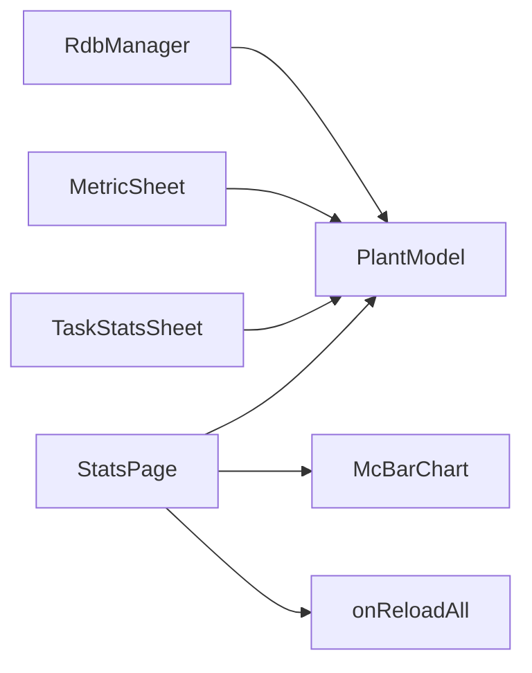

# 统计分析页 StatsPage

<cite>
**本文档引用的文件**
- [StatsPage.ets](file://entry/src/main/ets/pages/StatsPage.ets)
- [PlantModel.ets](file://entry/src/main/ets/model/PlantModel.ets)
- [DailyLightStat.ets](file://entry/src/main/ets/model/DailyLightStat.ets)
- [LightProfile.ets](file://entry/src/main/ets/model/LightProfile.ets)
- [LightTypes.ets](file://entry/src/main/ets/model/LightTypes.ets)
- [TaskStatsSheet.ets](file://entry/src/main/ets/view/TaskStatsSheet.ets)
- [MetricSheet.ets](file://entry/src/main/ets/view/MetricSheet.ets)
- [RdbManager.ets](file://entry/src/main/ets/viewmodel/RdbManager.ets)
</cite>

## 目录
1. [简介](#简介)
2. [项目结构](#项目结构)
3. [核心组件](#核心组件)
4. [架构总览](#架构总览)
5. [详细组件分析](#详细组件分析)
6. [依赖关系分析](#依赖关系分析)
7. [性能考虑](#性能考虑)
8. [故障排查指南](#故障排查指南)
9. [结论](#结论)
10. [附录](#附录)

## 简介
本文件围绕统计分析页 StatsPage 的实现进行全面解析，重点涵盖：
- 统计数据的计算逻辑与聚合算法（任务完成率、光照分析、生长趋势等）
- 图表组件的集成方式与数据可视化实现
- 数据导出、报表生成与自定义时间范围选择的实现细节
- 统计图表的交互功能与动态更新机制
- 统计准确性验证与性能优化建议

## 项目结构
StatsPage 位于页面层，负责以只读聚合视图的形式展示统计数据，并通过事件回调触发顶层刷新。其数据来源为内存中的 Plant 与 PlantTask 集合，图表使用 mccharts 库进行渲染。



**图表来源**
- [StatsPage.ets:292-441](file://entry/src/main/ets/pages/StatsPage.ets#L292-L441)
- [PlantModel.ets:1-166](file://entry/src/main/ets/model/PlantModel.ets#L1-L166)
- [DailyLightStat.ets:1-30](file://entry/src/main/ets/model/DailyLightStat.ets#L1-L30)
- [LightProfile.ets:1-41](file://entry/src/main/ets/model/LightProfile.ets#L1-L41)
- [LightTypes.ets:1-124](file://entry/src/main/ets/model/LightTypes.ets#L1-L124)
- [TaskStatsSheet.ets:1-273](file://entry/src/main/ets/view/TaskStatsSheet.ets#L1-L273)
- [MetricSheet.ets:1-491](file://entry/src/main/ets/view/MetricSheet.ets#L1-L491)
- [RdbManager.ets:1-296](file://entry/src/main/ets/viewmodel/RdbManager.ets#L1-L296)

**章节来源**
- [StatsPage.ets:1-442](file://entry/src/main/ets/pages/StatsPage.ets#L1-L442)

## 核心组件
- 统计页主体：提供概览卡片、最活跃植物、近7天趋势图等信息。
- 任务统计抽屉：支持时间范围选择（近30天/近90天/全部），展示完成率趋势与任务类型占比。
- 生长指标抽屉：支持健康分/身高/冠幅维度切换、时间排序、迷你趋势图与历史记录管理。
- 光照统计模型：提供每日光照量、达标率、状态等字段，配合光照配置与工具函数进行状态判定与可视化。

**章节来源**
- [StatsPage.ets:292-441](file://entry/src/main/ets/pages/StatsPage.ets#L292-L441)
- [TaskStatsSheet.ets:1-273](file://entry/src/main/ets/view/TaskStatsSheet.ets#L1-L273)
- [MetricSheet.ets:1-491](file://entry/src/main/ets/view/MetricSheet.ets#L1-L491)
- [DailyLightStat.ets:1-30](file://entry/src/main/ets/model/DailyLightStat.ets#L1-L30)
- [LightProfile.ets:1-41](file://entry/src/main/ets/model/LightProfile.ets#L1-L41)
- [LightTypes.ets:1-124](file://entry/src/main/ets/model/LightTypes.ets#L1-L124)

## 架构总览
StatsPage 采用“只读聚合视图 + 事件回调刷新”的设计，避免直接修改底层数据，降低耦合。图表数据通过 Options 对象注入 mccharts，实现动态更新。



**图表来源**
- [StatsPage.ets:326-335](file://entry/src/main/ets/pages/StatsPage.ets#L326-L335)
- [StatsPage.ets:278-290](file://entry/src/main/ets/pages/StatsPage.ets#L278-L290)
- [RdbManager.ets:19-24](file://entry/src/main/ets/viewmodel/RdbManager.ets#L19-L24)

## 详细组件分析

### 统计页 StatsPage
- 数据来源：plants（植物集合）、tasks（任务集合）
- 主要统计指标：
  - 植物数、任务总数、完成率、进行中、逾期、未来7天计划数、近7天完成数、连续打卡天数
  - 最活跃植物（近30天完成数最多）
- 图表：近7天完成数柱状图，使用 McBarChart 渲染
- 动态更新：aboutToAppear/aboutToRender 中刷新图表配置；点击“刷新数据”触发顶层回调并重新计算



**图表来源**
- [StatsPage.ets:32-38](file://entry/src/main/ets/pages/StatsPage.ets#L32-L38)
- [StatsPage.ets:278-290](file://entry/src/main/ets/pages/StatsPage.ets#L278-L290)
- [StatsPage.ets:340-440](file://entry/src/main/ets/pages/StatsPage.ets#L340-L440)

**章节来源**
- [StatsPage.ets:48-159](file://entry/src/main/ets/pages/StatsPage.ets#L48-L159)
- [StatsPage.ets:174-236](file://entry/src/main/ets/pages/StatsPage.ets#L174-L236)
- [StatsPage.ets:238-290](file://entry/src/main/ets/pages/StatsPage.ets#L238-L290)
- [StatsPage.ets:292-441](file://entry/src/main/ets/pages/StatsPage.ets#L292-L441)

### 任务统计抽屉 TaskStatsSheet
- 支持时间范围选择：近30天、近90天、全部
- 完成率趋势：按日期聚合，计算每日完成率（四舍五入整数）
- 类型占比：统计浇水/施肥/修剪/其他任务数量
- 动态更新：切换范围后重新收集日期序列、计算完成率与类型分布

```mermaid
sequenceDiagram
participant U as "用户"
participant TSS as "TaskStatsSheet"
participant OPT as "Options"
U->>TSS : 选择时间范围
TSS->>TSS : refreshAll()
TSS->>OPT : 更新折线图/柱状图配置
OPT-->>U : 展示最新趋势与占比
```

**图表来源**
- [TaskStatsSheet.ets:203-214](file://entry/src/main/ets/view/TaskStatsSheet.ets#L203-L214)
- [TaskStatsSheet.ets:135-148](file://entry/src/main/ets/view/TaskStatsSheet.ets#L135-L148)
- [TaskStatsSheet.ets:151-184](file://entry/src/main/ets/view/TaskStatsSheet.ets#L151-L184)

**章节来源**
- [TaskStatsSheet.ets:73-81](file://entry/src/main/ets/view/TaskStatsSheet.ets#L73-L81)
- [TaskStatsSheet.ets:84-109](file://entry/src/main/ets/view/TaskStatsSheet.ets#L84-L109)
- [TaskStatsSheet.ets:111-148](file://entry/src/main/ets/view/TaskStatsSheet.ets#L111-L148)
- [TaskStatsSheet.ets:151-184](file://entry/src/main/ets/view/TaskStatsSheet.ets#L151-L184)
- [TaskStatsSheet.ets:186-189](file://entry/src/main/ets/view/TaskStatsSheet.ets#L186-L189)

### 生长指标抽屉 MetricSheet
- 维度切换：健康分、身高、冠幅
- 排序控制：时间正序/倒序
- 迷你趋势图：按排序结果绘制柱状迷你图
- 历史记录：支持新增与删除



**图表来源**
- [MetricSheet.ets:28-40](file://entry/src/main/ets/view/MetricSheet.ets#L28-L40)
- [MetricSheet.ets:247-264](file://entry/src/main/ets/view/MetricSheet.ets#L247-L264)
- [MetricSheet.ets:384-398](file://entry/src/main/ets/view/MetricSheet.ets#L384-L398)
- [MetricSheet.ets:286-353](file://entry/src/main/ets/view/MetricSheet.ets#L286-L353)

**章节来源**
- [MetricSheet.ets:12-27](file://entry/src/main/ets/view/MetricSheet.ets#L12-L27)
- [MetricSheet.ets:247-264](file://entry/src/main/ets/view/MetricSheet.ets#L247-L264)
- [MetricSheet.ets:384-398](file://entry/src/main/ets/view/MetricSheet.ets#L384-L398)
- [MetricSheet.ets:286-353](file://entry/src/main/ets/view/MetricSheet.ets#L286-L353)

### 光照分析模型与工具
- 模型字段：plantId、date、luxMinutes、durationMin、maxLux、rate、status
- 配置字段：targetLuxMinLow、targetLuxMinHigh、highLuxThreshold、preferredLevel
- 工具函数：状态标签与颜色映射、级别权重、日期格式化、比率钳制、ID生成



**图表来源**
- [DailyLightStat.ets:11-29](file://entry/src/main/ets/model/DailyLightStat.ets#L11-L29)
- [LightProfile.ets:11-39](file://entry/src/main/ets/model/LightProfile.ets#L11-L39)
- [LightTypes.ets:9-70](file://entry/src/main/ets/model/LightTypes.ets#L9-L70)

**章节来源**
- [DailyLightStat.ets:1-30](file://entry/src/main/ets/model/DailyLightStat.ets#L1-L30)
- [LightProfile.ets:1-41](file://entry/src/main/ets/model/LightProfile.ets#L1-L41)
- [LightTypes.ets:1-124](file://entry/src/main/ets/model/LightTypes.ets#L1-L124)

## 依赖关系分析
- StatsPage 依赖 PlantModel（Plant/PlantTask）进行指标计算与图表数据生成
- StatsPage 依赖 mccharts（McBarChart）进行可视化渲染
- StatsPage 通过 onReloadAll 事件回调触发顶层数据刷新
- TaskStatsSheet 与 MetricSheet 作为独立抽屉组件，分别扩展任务与生长维度的统计能力
- RdbManager 提供数据库初始化与索引，支撑任务与指标等数据的持久化与查询



**图表来源**
- [StatsPage.ets:1-30](file://entry/src/main/ets/pages/StatsPage.ets#L1-L30)
- [TaskStatsSheet.ets:1-8](file://entry/src/main/ets/view/TaskStatsSheet.ets#L1-L8)
- [MetricSheet.ets:1-11](file://entry/src/main/ets/view/MetricSheet.ets#L1-L11)
- [RdbManager.ets:36-170](file://entry/src/main/ets/viewmodel/RdbManager.ets#L36-L170)

**章节来源**
- [StatsPage.ets:1-10](file://entry/src/main/ets/pages/StatsPage.ets#L1-L10)
- [RdbManager.ets:36-170](file://entry/src/main/ets/viewmodel/RdbManager.ets#L36-L170)

## 性能考虑
- 计算复杂度
  - 任务完成率、进行中、逾期、未来7天、近7天完成数、连续打卡等指标均为 O(N) 遍历，N 为任务数
  - 最活跃植物（近30天）为 O(P×N)，P 为植物数，N 为任务数
  - 近7天趋势图按日期聚合，O(N) 遍历任务匹配日期
- 优化建议
  - 使用索引：数据库层面已建立任务表的唯一索引与常用查询索引，有助于提升查询效率
  - 缓存策略：图表数据通过 Options 对象缓存，避免在构建器内频繁重建数据
  - 分页与懒加载：对于历史较长的数据集，可在抽屉组件中引入分页或懒加载
  - 防抖刷新：对用户频繁点击“刷新数据”可增加防抖，减少不必要的重载

**章节来源**
- [RdbManager.ets:134-146](file://entry/src/main/ets/viewmodel/RdbManager.ets#L134-L146)
- [StatsPage.ets:278-290](file://entry/src/main/ets/pages/StatsPage.ets#L278-L290)

## 故障排查指南
- 图表不更新
  - 确认 onReloadAll 回调是否正确触发并返回最新数据
  - 检查 refreshWeekOption 是否在页面生命周期中被调用
- 统计值异常
  - 检查任务完成标记 done 与完成时间 doneAt 的一致性
  - 确认日期格式化与时间边界（如近7天/近30天）的计算逻辑
- 光照状态显示异常
  - 核对光照配置中的阈值与达标率计算逻辑
  - 检查状态枚举与颜色映射是否一致

**章节来源**
- [StatsPage.ets:326-335](file://entry/src/main/ets/pages/StatsPage.ets#L326-L335)
- [StatsPage.ets:278-290](file://entry/src/main/ets/pages/StatsPage.ets#L278-L290)
- [LightTypes.ets:19-56](file://entry/src/main/ets/model/LightTypes.ets#L19-L56)

## 结论
StatsPage 通过简洁的聚合计算与 mccharts 可视化，提供了直观的任务与植物管理统计视图。结合任务统计抽屉与生长指标抽屉，用户可以按需查看更细粒度的趋势与占比。建议在数据量增长时引入缓存与分页策略，并持续优化索引与计算路径，以保障统计准确性与性能表现。

## 附录
- 数据导出与报表生成
  - 当前实现为只读视图，未内置导出功能。可在顶层页面或抽屉组件中扩展导出按钮，将当前图表数据与表格内容转为 CSV/PDF
- 自定义时间范围
  - 任务统计抽屉已支持近30天/近90天/全部三种范围；可进一步扩展为自定义起止日期范围
- 交互与动态更新
  - 通过 Options 对象与事件回调实现图表与卡片的动态更新，保持界面响应性与一致性