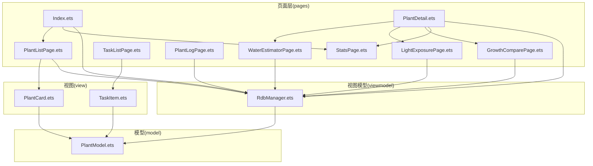
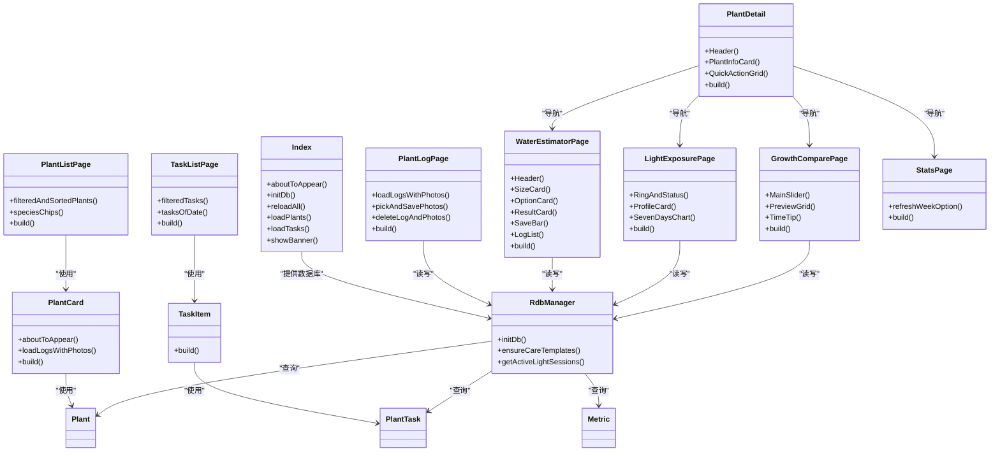
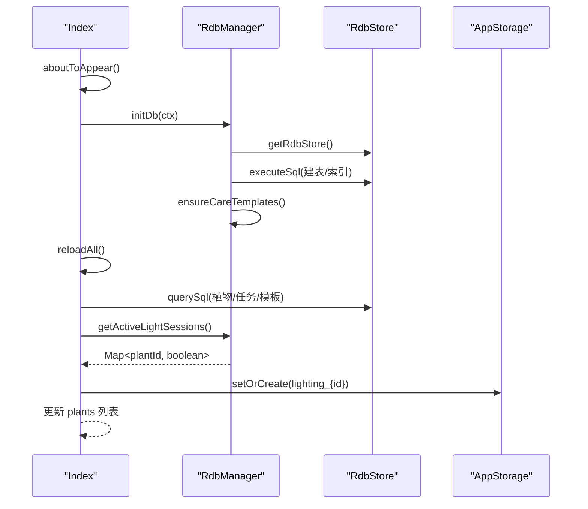
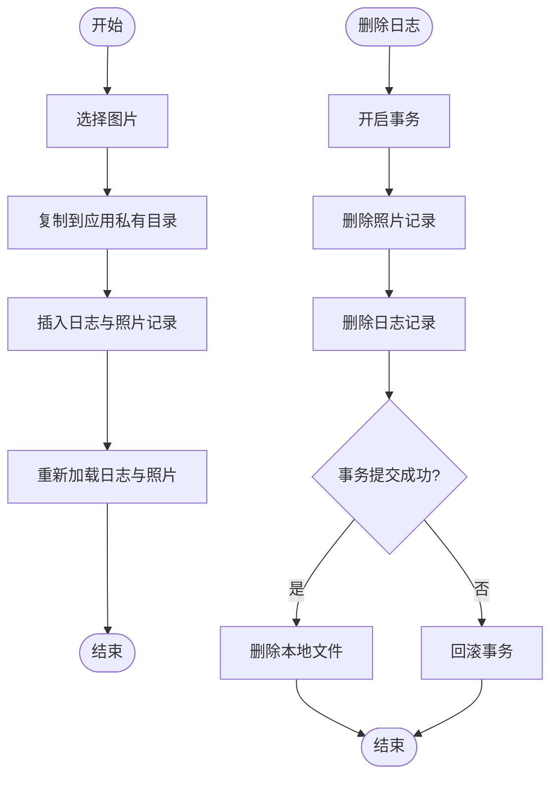
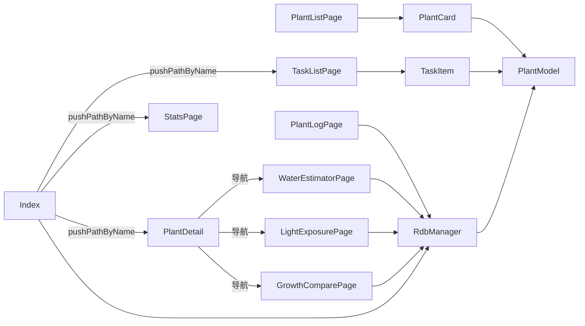

# 页面层

<cite>
**本文引用的文件**
- [Index.ets](file://entry/src/main/ets/pages/Index.ets)
- [PlantListPage.ets](file://entry/src/main/ets/pages/PlantListPage.ets)
- [PlantDetail.ets](file://entry/src/main/ets/pages/PlantDetail.ets)
- [StatsPage.ets](file://entry/src/main/ets/pages/StatsPage.ets)
- [TaskListPage.ets](file://entry/src/main/ets/pages/TaskListPage.ets)
- [PlantLogPage.ets](file://entry/src/main/ets/pages/PlantLogPage.ets)
- [WaterEstimatorPage.ets](file://entry/src/main/ets/pages/WaterEstimatorPage.ets)
- [LightExposurePage.ets](file://entry/src/main/ets/pages/LightExposurePage.ets)
- [GrowthComparePage.ets](file://entry/src/main/ets/pages/GrowthComparePage.ets)
- [PlantCard.ets](file://entry/src/main/ets/view/PlantCard.ets)
- [TaskItem.ets](file://entry/src/main/ets/view/TaskItem.ets)
- [PlantModel.ets](file://entry/src/main/ets/model/PlantModel.ets)
- [RdbManager.ets](file://entry/src/main/ets/viewmodel/RdbManager.ets)
- [build-profile.json5](file://entry/build-profile.json5)
</cite>

## 目录
1. [简介](#简介)
2. [项目结构](#项目结构)
3. [核心组件](#核心组件)
4. [架构总览](#架构总览)
5. [详细组件分析](#详细组件分析)
6. [依赖关系分析](#依赖关系分析)
7. [性能考虑](#性能考虑)
8. [故障排查指南](#故障排查指南)
9. [结论](#结论)
10. [附录](#附录)

## 简介
本文件聚焦于 PlantDiary 应用的页面层，系统性梳理各页面的功能定位、实现架构、导航与路由、数据传递与状态同步、生命周期与内存优化、布局与响应式适配、权限与安全机制，并给出每个页面的功能说明、使用流程与集成示例。页面层采用 ArkTS/ArkUI 技术栈，围绕首页为中心的全局状态与导航栈，构建植物、任务、日志、指标、光照、统计等多页面协同的工作流。

## 项目结构
页面层位于 entry/src/main/ets/pages 目录，配合 view、viewmodel、model 三层协作：
- pages：页面组件（Index、PlantListPage、PlantDetail、StatsPage、TaskListPage、PlantLogPage、WaterEstimatorPage、LightExposurePage、GrowthComparePage）
- view：可复用 UI 子组件（PlantCard、TaskItem 等）
- viewmodel：页面级业务与数据访问（RdbManager）
- model：轻量数据模型（Plant、PlantTask、Metric 等）

**图示来源**
- [Index.ets](file://entry/src/main/ets/pages/Index.ets)
- [PlantListPage.ets](file://entry/src/main/ets/pages/PlantListPage.ets)
- [PlantDetail.ets](file://entry/src/main/ets/pages/PlantDetail.ets)
- [StatsPage.ets](file://entry/src/main/ets/pages/StatsPage.ets)
- [TaskListPage.ets](file://entry/src/main/ets/pages/TaskListPage.ets)
- [PlantLogPage.ets](file://entry/src/main/ets/pages/PlantLogPage.ets)
- [WaterEstimatorPage.ets](file://entry/src/main/ets/pages/WaterEstimatorPage.ets)
- [LightExposurePage.ets](file://entry/src/main/ets/pages/LightExposurePage.ets)
- [GrowthComparePage.ets](file://entry/src/main/ets/pages/GrowthComparePage.ets)
- [PlantCard.ets](file://entry/src/main/ets/view/PlantCard.ets)
- [TaskItem.ets](file://entry/src/main/ets/view/TaskItem.ets)
- [PlantModel.ets](file://entry/src/main/ets/model/PlantModel.ets)
- [RdbManager.ets](file://entry/src/main/ets/viewmodel/RdbManager.ets)

**章节来源**
- [Index.ets](file://entry/src/main/ets/pages/Index.ets)
- [PlantListPage.ets](file://entry/src/main/ets/pages/PlantListPage.ets)
- [PlantDetail.ets](file://entry/src/main/ets/pages/PlantDetail.ets)
- [StatsPage.ets](file://entry/src/main/ets/pages/StatsPage.ets)
- [TaskListPage.ets](file://entry/src/main/ets/pages/TaskListPage.ets)
- [PlantLogPage.ets](file://entry/src/main/ets/pages/PlantLogPage.ets)
- [WaterEstimatorPage.ets](file://entry/src/main/ets/pages/WaterEstimatorPage.ets)
- [LightExposurePage.ets](file://entry/src/main/ets/pages/LightExposurePage.ets)
- [GrowthComparePage.ets](file://entry/src/main/ets/pages/GrowthComparePage.ets)
- [PlantCard.ets](file://entry/src/main/ets/view/PlantCard.ets)
- [TaskItem.ets](file://entry/src/main/ets/view/TaskItem.ets)
- [PlantModel.ets](file://entry/src/main/ets/model/PlantModel.ets)
- [RdbManager.ets](file://entry/src/main/ets/viewmodel/RdbManager.ets)

## 核心组件
- 首页 Index：应用状态中枢，负责数据库初始化、全局数据加载与共享、页面间状态广播（如光照进行中状态）、Banner 提示与常用面板控制。
- 植物列表 PlantListPage：聚合植物卡片，支持筛选（按物种）、排序（按创建时间/名称/完成率），并透传事件到上层处理。
- 植物详情 PlantDetail：以导航目的地形式承载植物详情与快捷功能入口，通过 NavDestination 的 pushPathByName 实现页面跳转。
- 任务列表 TaskListPage：任务聚合视图，支持按“全部/今天/将来/已完成”筛选、类型筛选、关键字搜索、排序与日视图弹层。
- 日志 PlantLogPage：日志与照片管理，支持新增、删除、批量删除、照片预览、图片文件与数据库双删一致性保障。
- 用量估算 WaterEstimatorPage：输入尺寸/介质/策略/植物类型，计算区间值并可保存估算记录。
- 光照 LightExposurePage：光照会话记录（开始/结束/补记）、进度环、偏好配置、历史会话列表与滑动删除。
- 成长对比 GrowthComparePage：按时间轴浏览同一植物的照片，支持添加照片与时间跨度提示。
- 统计 StatsPage：只读聚合视图，展示植物/任务/完成率/逾期/未来7天/近7天/连续打卡等指标与7日趋势图。
- 视图组件 PlantCard、TaskItem：轻量展示与交互回调，避免在渲染中夹杂复杂计算。

**章节来源**
- [Index.ets](file://entry/src/main/ets/pages/Index.ets)
- [PlantListPage.ets](file://entry/src/main/ets/pages/PlantListPage.ets)
- [PlantDetail.ets](file://entry/src/main/ets/pages/PlantDetail.ets)
- [TaskListPage.ets](file://entry/src/main/ets/pages/TaskListPage.ets)
- [PlantLogPage.ets](file://entry/src/main/ets/pages/PlantLogPage.ets)
- [WaterEstimatorPage.ets](file://entry/src/main/ets/pages/WaterEstimatorPage.ets)
- [LightExposurePage.ets](file://entry/src/main/ets/pages/LightExposurePage.ets)
- [GrowthComparePage.ets](file://entry/src/main/ets/pages/GrowthComparePage.ets)
- [StatsPage.ets](file://entry/src/main/ets/pages/StatsPage.ets)
- [PlantCard.ets](file://entry/src/main/ets/view/PlantCard.ets)
- [TaskItem.ets](file://entry/src/main/ets/view/TaskItem.ets)

## 架构总览
页面层采用“页面中心 + 视图组件 + 视图模型 + 数据模型”的分层设计：
- 页面中心：Index 作为全局状态与导航中枢，提供 Provider/Consumer 注入的数据库与页面栈。
- 视图组件：可复用的 PlantCard、TaskItem 等，降低页面耦合，提升渲染性能。
- 视图模型：RdbManager 统一数据库初始化、建表与索引、模板种子数据与查询活跃会话。
- 数据模型：Plant、PlantTask、Metric 等轻量模型，页面与 ViewModel 仅传递必要字段。

**图示来源**
- [Index.ets](file://entry/src/main/ets/pages/Index.ets)
- [PlantListPage.ets](file://entry/src/main/ets/pages/PlantListPage.ets)
- [PlantDetail.ets](file://entry/src/main/ets/pages/PlantDetail.ets)
- [TaskListPage.ets](file://entry/src/main/ets/pages/TaskListPage.ets)
- [PlantLogPage.ets](file://entry/src/main/ets/pages/PlantLogPage.ets)
- [WaterEstimatorPage.ets](file://entry/src/main/ets/pages/WaterEstimatorPage.ets)
- [LightExposurePage.ets](file://entry/src/main/ets/pages/LightExposurePage.ets)
- [GrowthComparePage.ets](file://entry/src/main/ets/pages/GrowthComparePage.ets)
- [StatsPage.ets](file://entry/src/main/ets/pages/StatsPage.ets)
- [PlantCard.ets](file://entry/src/main/ets/view/PlantCard.ets)
- [TaskItem.ets](file://entry/src/main/ets/view/TaskItem.ets)
- [RdbManager.ets](file://entry/src/main/ets/viewmodel/RdbManager.ets)
- [PlantModel.ets](file://entry/src/main/ets/model/PlantModel.ets)

## 详细组件分析

### 首页 Index：全局状态中枢与导航中枢
- 职责
  - 初始化数据库与全局模板，一次性加载植物、任务、指标等主数据。
  - 通过 Provider 注入 RdbManager、RdbStore、NavPathStack，供子页面消费。
  - 统一处理 Banner 提示、面板开关、筛选与排序状态、模板与指标抽屉等。
  - 同步光照会话状态到 AppStorage，驱动植物卡片的“正在补光”视觉反馈。
- 关键实现要点
  - 数据加载：loadPlants、loadTasks、loadMetricsByPlant、loadTemplates。
  - 事务一致性：删除植物/日志时，先事务删记录，再统一删除文件，失败回滚。
  - 状态广播：refreshActiveSessions 将进行中会话映射到 AppStorage 键值，卡片订阅。
  - Banner 与动画：showBanner + animateTo 控制提示与过渡动画。
- 导航与路由
  - 通过 NavPathStack.pushPathByName 实现页面间跳转（如 PlantDetail、StatsPage、TaskListPage 等）。
- 数据传递与状态同步
  - @Provider/@Consumer 注入 Store 与页面栈；@Local 管理页面内状态；AppStorage 用于跨组件广播（如光照状态）。
- 生命周期与内存优化
  - aboutToAppear 中初始化数据库，避免在构建函数中做耗时操作。
  - 列表渲染使用 ForEach + ListItem，减少不必要的重渲染。
  - 通过统一 reloadAll 避免局部状态不一致，降低脏读风险。

**图示来源**
- [Index.ets](file://entry/src/main/ets/pages/Index.ets)
- [RdbManager.ets](file://entry/src/main/ets/viewmodel/RdbManager.ets)

**章节来源**
- [Index.ets](file://entry/src/main/ets/pages/Index.ets)
- [RdbManager.ets](file://entry/src/main/ets/viewmodel/RdbManager.ets)

### 植物列表 PlantListPage：筛选与排序
- 职责
  - 展示植物卡片，支持按物种筛选与排序（创建时间/名称/完成率）。
  - 通过 Header 透传统一的搜索与标题区域，减少重复实现。
- 关键实现要点
  - speciesChips 动态生成筛选芯片，过滤后排序。
  - plantTaskDone/plantTaskTotal/plantRatePct 从共享任务列表即时计算，避免每个卡片重复查询。
  - 列表使用 EdgeEffect、ScrollBar 配置与动画，提升滚动体验。
- 数据传递
  - @Param 接收 plants、allTasks；@Event 透传到 PlantCard，最终回到 Index 处理 CRUD。

**章节来源**
- [PlantListPage.ets](file://entry/src/main/ets/pages/PlantListPage.ets)
- [PlantCard.ets](file://entry/src/main/ets/view/PlantCard.ets)

### 植物详情 PlantDetail：导航目的地与快捷入口
- 职责
  - 以 NavDestination 形式承载植物详情，提供快捷功能网格（日志、光照、指标、对比、用量估算、应急与轮换）。
- 关键实现要点
  - onReady 中从 pathInfo.param 获取 Plant 参数，绑定到页面状态。
  - 通过 pageStack.pushPathByName 跳转到具体页面。
  - 使用渐变背景与阴影增强视觉层次。
- 集成示例
  - 在 PlantListPage 的 ListItem 上触发 onOpenDetail，传递 Plant 对象，进入详情页。

**章节来源**
- [PlantDetail.ets](file://entry/src/main/ets/pages/PlantDetail.ets)

### 任务列表 TaskListPage：筛选、排序与日视图
- 职责
  - 任务聚合视图，支持“全部/今天/将来/已完成”、类型筛选、关键字搜索、排序。
  - 日视图弹层与列表共享同一套过滤结果，避免不一致。
- 关键实现要点
  - filteredTasks 统一串联 Tab、类型、关键字与排序。
  - typesChips 动态聚合任务类型。
  - 日视图弹层 DayTaskSheet 与任务列表共用数据源。
- 性能与体验
  - 列表使用动画与滚动效果，避免频繁重绘。

**章节来源**
- [TaskListPage.ets](file://entry/src/main/ets/pages/TaskListPage.ets)

### 日志 PlantLogPage：日志与照片管理
- 职责
  - 新增日志、删除日志与照片、批量删除、照片预览、图片文件与数据库一致性保障。
- 关键实现要点
  - deleteLogAndPhotos 采用事务先删子表再删主表，失败回滚；事务成功后再删本地文件。
  - pickAndSavePhotos 复用 AddImageFileViewModel，复制到应用私有目录并入库。
  - loadLogsWithPhotos 一次性加载日志与照片，避免多次查询。
  - Banner 提示与触摸反馈增强交互体验。
- 数据一致性
  - 通过 runInTransaction 保证日志与照片删除的一致性。

**图示来源**
- [PlantLogPage.ets](file://entry/src/main/ets/pages/PlantLogPage.ets)

**章节来源**
- [PlantLogPage.ets](file://entry/src/main/ets/pages/PlantLogPage.ets)

### 用量估算 WaterEstimatorPage：区间值与记录保存
- 职责
  - 输入盆径、深度、介质、策略、植物类型，计算区间值（下限/推荐/上限），支持保存估算记录与直接记一笔浇水。
- 关键实现要点
  - Header 重置按钮恢复默认参数。
  - OptionCard 三组参数（介质/策略/植物类型）独立选择。
  - ResultCard 展示区间值与建议文本与公式摘要。
  - SaveBar 支持保存估算记录与一键推荐用量记账。
  - LogList 展示历史估算记录。

**章节来源**
- [WaterEstimatorPage.ets](file://entry/src/main/ets/pages/WaterEstimatorPage.ets)

### 光照 LightExposurePage：会话记录与偏好配置
- 职责
  - 记录光照会话（开始/结束/补记）、展示当日达标率与状态、配置目标区间与偏好强度。
- 关键实现要点
  - ManualStartDialog 与 ManualInstantDialog 提供手动开始与补记对话框。
  - RingAndStatus 展示进度环与主操作按钮，定时刷新进行中会话。
  - ProfileCard 支持快速调整目标区间与偏好强度。
  - SevenDaysChart 展示近7日光照时长柱状图。
  - SwipeAction 提供滑动删除会话。

**章节来源**
- [LightExposurePage.ets](file://entry/src/main/ets/pages/LightExposurePage.ets)

### 成长对比 GrowthComparePage：时间轴照片浏览
- 职责
  - 将同一植物的时间序列照片按时间顺序浏览，支持添加照片与时间跨度提示。
- 关键实现要点
  - MainSlider 主视图突出当前照片，底部 Slider 用于跳转。
  - PreviewGrid 展示全部照片缩略图，支持点击选中。
  - TimeTip 显示最早与最新时间。
  - pickAndAddPhoto 自动创建占位日志承接图片。

**章节来源**
- [GrowthComparePage.ets](file://entry/src/main/ets/pages/GrowthComparePage.ets)

### 统计 StatsPage：只读聚合视图
- 职责
  - 展示植物数、任务数、完成率、进行中、逾期、未来7天、近7天、连续打卡等指标，以及7日趋势图。
- 关键实现要点
  - refreshWeekOption 在进入/渲染时刷新图表配置。
  - 通过内存中的 plants/tasks 即时计算，避免重复查询。
  - 刷新入口回调首页 reloadAll，保证数据一致性。

**章节来源**
- [StatsPage.ets](file://entry/src/main/ets/pages/StatsPage.ets)

## 依赖关系分析
- 组件耦合
  - Index 与各页面通过 NavPathStack 解耦导航；通过 Provider/Consumer 注入共享 Store。
  - PlantListPage 与 PlantDetail 通过 Plant 对象解耦数据；PlantCard 仅负责展示与事件回调。
  - TaskListPage 与 TaskItem 通过 PlantTask 解耦数据；TaskItem 保持极简展示。
- 外部依赖
  - RdbManager 依赖 ArkData relationalStore，负责建表、索引与模板种子数据。
  - PlantModel 提供轻量数据结构，避免页面与 ViewModel 直接耦合数据库字段。
- 潜在循环依赖
  - 页面间通过字符串路由跳转，避免直接 import 引起循环；PlantCard/TaskItem 作为纯展示组件，不反向依赖页面。

**图示来源**
- [Index.ets](file://entry/src/main/ets/pages/Index.ets)
- [PlantListPage.ets](file://entry/src/main/ets/pages/PlantListPage.ets)
- [PlantDetail.ets](file://entry/src/main/ets/pages/PlantDetail.ets)
- [StatsPage.ets](file://entry/src/main/ets/pages/StatsPage.ets)
- [TaskListPage.ets](file://entry/src/main/ets/pages/TaskListPage.ets)
- [PlantLogPage.ets](file://entry/src/main/ets/pages/PlantLogPage.ets)
- [WaterEstimatorPage.ets](file://entry/src/main/ets/pages/WaterEstimatorPage.ets)
- [LightExposurePage.ets](file://entry/src/main/ets/pages/LightExposurePage.ets)
- [GrowthComparePage.ets](file://entry/src/main/ets/pages/GrowthComparePage.ets)
- [PlantCard.ets](file://entry/src/main/ets/view/PlantCard.ets)
- [TaskItem.ets](file://entry/src/main/ets/view/TaskItem.ets)
- [RdbManager.ets](file://entry/src/main/ets/viewmodel/RdbManager.ets)
- [PlantModel.ets](file://entry/src/main/ets/model/PlantModel.ets)

**章节来源**
- [Index.ets](file://entry/src/main/ets/pages/Index.ets)
- [PlantListPage.ets](file://entry/src/main/ets/pages/PlantListPage.ets)
- [PlantDetail.ets](file://entry/src/main/ets/pages/PlantDetail.ets)
- [StatsPage.ets](file://entry/src/main/ets/pages/StatsPage.ets)
- [TaskListPage.ets](file://entry/src/main/ets/pages/TaskListPage.ets)
- [PlantLogPage.ets](file://entry/src/main/ets/pages/PlantLogPage.ets)
- [WaterEstimatorPage.ets](file://entry/src/main/ets/pages/WaterEstimatorPage.ets)
- [LightExposurePage.ets](file://entry/src/main/ets/pages/LightExposurePage.ets)
- [GrowthComparePage.ets](file://entry/src/main/ets/pages/GrowthComparePage.ets)
- [PlantCard.ets](file://entry/src/main/ets/view/PlantCard.ets)
- [TaskItem.ets](file://entry/src/main/ets/view/TaskItem.ets)
- [RdbManager.ets](file://entry/src/main/ets/viewmodel/RdbManager.ets)
- [PlantModel.ets](file://entry/src/main/ets/model/PlantModel.ets)

## 性能考虑
- 渲染优化
  - 列表使用 ForEach + ListItem，避免在 Builder 中进行复杂计算。
  - 使用 animateTo 与 Curve.EaseInOut 控制动画，减少过度绘制。
  - EdgeEffect 与 ScrollBar 配置提升滚动体验。
- 数据访问
  - 统一通过 RdbManager 获取 Store，避免页面直接管理连接。
  - 使用索引（如 idx_task_planDate、idx_log_plant_created、idx_metric_plant_created）优化查询。
- 事务与一致性
  - 删除操作采用事务，失败回滚，避免部分删除导致的数据不一致。
- 内存与生命周期
  - 页面在 aboutToAppear 中初始化数据库与加载数据，避免在构建函数中阻塞。
  - 使用 @Local 管理页面内状态，避免全局污染。

[本节为通用指导，无需列出具体文件来源]

## 故障排查指南
- 数据库初始化失败
  - 现象：首页初始化数据库失败，Banner 显示警告。
  - 排查：检查 RdbManager.initDb 是否成功执行，确认建表与索引 SQL 是否报错。
  - 参考实现：Index.aboutToAppear 中的异常捕获与 Banner 提示。
- 删除日志失败
  - 现象：删除日志后回滚，Banner 提示失败。
  - 排查：确认事务是否提交成功；检查本地文件删除权限与路径。
  - 参考实现：PlantLogPage.deleteLogAndPhotos 的事务与回滚逻辑。
- 活跃会话状态不同步
  - 现象：植物卡片未显示“正在补光”状态。
  - 排查：确认 Index.refreshActiveSessions 是否正确写入 AppStorage；卡片是否订阅对应键。
  - 参考实现：Index.refreshActiveSessions 与 PlantCard.checkLightingStatus。
- 光照偏好设置无效
  - 现象：调整目标区间后未生效。
  - 排查：确认 LightExposurePage.updateProfile 是否被调用；VM 是否重新计算统计。
  - 参考实现：LightExposurePage.ProfileCard 的数值增减与快速调整。

**章节来源**
- [Index.ets](file://entry/src/main/ets/pages/Index.ets)
- [PlantLogPage.ets](file://entry/src/main/ets/pages/PlantLogPage.ets)
- [LightExposurePage.ets](file://entry/src/main/ets/pages/LightExposurePage.ets)

## 结论
页面层以 Index 为核心，结合 Provider/Consumer 与 NavPathStack，实现了清晰的导航与状态管理；通过 PlantCard、TaskItem 等可复用视图组件，降低了页面耦合与渲染成本；RdbManager 统一数据库初始化与建模，保障了数据一致性与性能。整体架构具备良好的扩展性与可维护性，适合进一步引入权限控制、安全机制与更丰富的响应式布局。

[本节为总结性内容，无需列出具体文件来源]

## 附录

### 页面导航与路由配置
- 页面跳转
  - 使用 NavDestination 的 pushPathByName 与 pop 实现页面跳转与返回。
  - 示例：PlantDetail 中通过 pageStack.pushPathByName('PlantLogPage', plantId) 跳转到日志页。
- 页面栈管理
  - Index 提供 NavPathStack，供子页面统一使用。
- 路由参数
  - 通过 pathInfo.param 获取路由参数，如 Plant 对象或 plantId。

**章节来源**
- [PlantDetail.ets](file://entry/src/main/ets/pages/PlantDetail.ets)
- [Index.ets](file://entry/src/main/ets/pages/Index.ets)

### 页面间数据传递与状态同步
- 全局状态
  - Index 通过 @Provider 注入 RdbManager 与 Store，供子页面 @Consumer 使用。
  - AppStorage 用于跨组件广播（如光照进行中状态 lighting_{id}）。
- 事件透传
  - PlantListPage 与 TaskListPage 通过 @Event 将操作事件透传至上层 Index 处理。
- 状态一致性
  - 通过统一 reloadAll 与事务删除，避免局部状态不一致。

**章节来源**
- [Index.ets](file://entry/src/main/ets/pages/Index.ets)
- [PlantListPage.ets](file://entry/src/main/ets/pages/PlantListPage.ets)
- [TaskListPage.ets](file://entry/src/main/ets/pages/TaskListPage.ets)

### 页面生命周期管理与内存优化
- 生命周期
  - 页面在 aboutToAppear 中进行数据库初始化与数据加载。
  - 列表与卡片使用动画与滚动优化，避免频繁重绘。
- 内存优化
  - 使用 @Local 管理页面内状态，避免全局污染。
  - 统一通过 RdbManager 管理数据库连接与事务。

**章节来源**
- [Index.ets](file://entry/src/main/ets/pages/Index.ets)
- [PlantCard.ets](file://entry/src/main/ets/view/PlantCard.ets)
- [TaskItem.ets](file://entry/src/main/ets/view/TaskItem.ets)

### 页面布局设计与响应式适配
- 布局
  - 使用 Column/Flex/Grid 等容器组织内容，支持 Wrap 与 Space。
  - 使用 Stack、Overlay 实现叠加与动画效果。
- 响应式
  - 使用百分比宽度与 layoutWeight 控制自适应。
  - 使用 ImageFit、aspectRatio 等属性适配图片显示。

**章节来源**
- [StatsPage.ets](file://entry/src/main/ets/pages/StatsPage.ets)
- [GrowthComparePage.ets](file://entry/src/main/ets/pages/GrowthComparePage.ets)
- [WaterEstimatorPage.ets](file://entry/src/main/ets/pages/WaterEstimatorPage.ets)

### 页面权限控制与安全机制
- 数据库安全
  - RdbManager 使用 SecurityLevel 与加密配置，确保数据库安全。
- 文件访问
  - 照片保存与读取使用应用私有目录，避免外部 URI 失效。
- 事务与回滚
  - 删除操作采用事务，失败回滚，避免部分删除导致的数据不一致。

**章节来源**
- [RdbManager.ets](file://entry/src/main/ets/viewmodel/RdbManager.ets)
- [PlantLogPage.ets](file://entry/src/main/ets/pages/PlantLogPage.ets)
- [GrowthComparePage.ets](file://entry/src/main/ets/pages/GrowthComparePage.ets)

### 功能说明、使用流程与集成示例

- 植物列表
  - 功能：展示植物卡片，支持按物种筛选与排序。
  - 使用流程：进入 PlantListPage，选择物种与排序方式，点击卡片进入详情。
  - 集成示例：PlantListPage.build 中的 Header 透传与 Chip 渲染。

- 植物详情
  - 功能：展示植物详情与快捷入口。
  - 使用流程：在 PlantListPage 点击 ListItem，进入 PlantDetail，点击快捷功能跳转到对应页面。
  - 集成示例：PlantDetail.onReady 中获取参数与 QuickActionGrid 的导航。

- 任务列表
  - 功能：任务聚合视图，支持筛选、排序与日视图弹层。
  - 使用流程：进入 TaskListPage，设置 Tab/类型/关键字，查看任务列表。
  - 集成示例：TaskListPage.filteredTasks 与 DayTaskSheet 的数据共享。

- 日志
  - 功能：新增/删除日志与照片，批量删除，照片预览。
  - 使用流程：进入 PlantLogPage，填写内容与日期，添加照片，删除日志与照片。
  - 集成示例：PlantLogPage.onAddLog/onDeleteLog/pickAndSavePhotos。

- 用量估算
  - 功能：输入参数计算区间值，保存估算记录或直接记一笔。
  - 使用流程：进入 WaterEstimatorPage，调整参数，查看结果，保存或记账。
  - 集成示例：WaterEstimatorPage.ResultCard 与 SaveBar。

- 光照
  - 功能：开始/结束/补记光照会话，查看进度与偏好配置。
  - 使用流程：进入 LightExposurePage，点击开始/结束，或打开 ManualStartDialog/ManualInstantDialog。
  - 集成示例：LightExposurePage.RingAndStatus 与 ProfileCard。

- 成长对比
  - 功能：按时间轴浏览同一植物的照片，支持添加照片与时间跨度提示。
  - 使用流程：进入 GrowthComparePage，滑动 Slider 或点击缩略图切换照片。
  - 集成示例：GrowthComparePage.MainSlider 与 PreviewGrid。

- 统计
  - 功能：只读聚合视图，展示多项指标与7日趋势图。
  - 使用流程：进入 StatsPage，点击“刷新数据”触发首页 reloadAll。
  - 集成示例：StatsPage.refreshWeekOption 与 OverviewCards。

**章节来源**
- [PlantListPage.ets](file://entry/src/main/ets/pages/PlantListPage.ets)
- [PlantDetail.ets](file://entry/src/main/ets/pages/PlantDetail.ets)
- [TaskListPage.ets](file://entry/src/main/ets/pages/TaskListPage.ets)
- [PlantLogPage.ets](file://entry/src/main/ets/pages/PlantLogPage.ets)
- [WaterEstimatorPage.ets](file://entry/src/main/ets/pages/WaterEstimatorPage.ets)
- [LightExposurePage.ets](file://entry/src/main/ets/pages/LightExposurePage.ets)
- [GrowthComparePage.ets](file://entry/src/main/ets/pages/GrowthComparePage.ets)
- [StatsPage.ets](file://entry/src/main/ets/pages/StatsPage.ets)